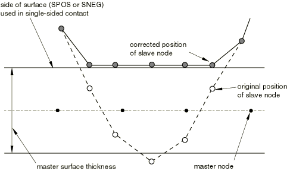

# 36.5.4 在Abaqus/Explicit中调整接触对初始表面位置和指定初始间隙


**产品：** Abaqus/Explicit  Abaqus/CAE

##### **参考**

- ["在Abaqus/Explicit中定义接触对，" 第36.5.1节"](pt09ch36s05aus160.md)
- [*CLEARANCE*](../key/key-link.md#usb-kws-mclearance)
- [*CONTACT PAIR*](../key/key-link.md#usb-kws-hcontactpair)
- ["定义表面-表面接触，" Abaqus/CAE用户指南第15.13.7节"](../usi/usi-link.md#usi-itn-help-surftosurf)

### 概述

Abaqus/Explicit中从节点位置的调整：
- 对所有具有过闭合从节点且没有指定初始间隙的接触对执行，除非刚体节点充当从节点；
- 可以消除使用图形预处理器（如Abaqus/CAE）时由数值舍入引起的小间隙或穿透；
- 在模拟第一步中不会在模型中产生任何应变或动量；
- 在模拟的后续步骤中会在模型中产生应变和动量；
- 不应用于纠正网格设计中的重大错误；和
- 不应用于解决从节点被夹在两个主表面之间的初始过闭合。

如果使用小滑动接触公式（见["Abaqus/Explicit中接触对的接触公式，" 第38.2.2节"](pt09ch38s02aus181.md)），则调整表面位置的替代方法是精确定义表面之间的初始间隙（大小和方向）。

### 模拟第一步中过闭合表面的调整

Abaqus/Explicit将自动调整表面位置以去除在模拟第一步中定义接触对时存在的任何初始过闭合，除非刚体节点充当从节点或使用了用户子程序[`VUINTER`](../sub/sub-link.md#sub-xsl-vuinter)。调整通过对表面上从节点的无应变初始位移进行。因此，当定义平衡主-从接触对时，两个表面上的节点都可能被调整。这种表面位置的自动调整旨在仅纠正与网格生成相关的小不匹配。您可以在状态（`.sta`）文件、消息（`.msg`）文件和输出数据库（`.odb`）文件中查看表面调整；更多信息请参阅["Abaqus/Explicit分析中的接触诊断，" 第39.2.1节"](pt09ch39s02aus185.md)。

一些软化接触模型在零过闭合时具有非零接触压力（见["接触压力-闭合关系，" 第37.1.2节"](pt09ch37s01aus166.md)）。对于这些模型，在分析开始时可能存在一些未平衡的初始接触压力，因为调整是为了满足零过闭合而非零接触压力。大的初始接触压力可能导致接触表面附近单元的过度变形。

来自单独接触对的冲突调整将导致初始过闭合的不完全解决，并可能导致解的噪声或单元的严重变形。当从节点被夹在两个主表面之间时会发生这种情况。

由于双侧面元缺乏唯一的朝外方向，双侧表面大初始穿透的解决可能很困难。初始穿透仅在从节点位于底层单元厚度内时被检测到，并且初始穿透将通过将从节点移动到最近的自由表面来解决，如[图36.5.4-1](pt09ch36s05aus163.md#adefsurf-bad-init-two-dual)所示。

**图36.5.4-1** 涉及两个双侧表面的接触对的初始过闭合校正。


如果检测到两个相邻的从节点（通过面元边缘连接）位于接触对中涉及的双侧主表面的相对两侧，则会向状态（`.sta`）文件发出警告消息。对于位于双侧主表面相对两侧的基于节点的表面节点，不会发出此类警告，因为无法确定基于节点的表面节点之间的邻接关系。如果主表面是单侧表面，则将使用主表面的表面法向解决初始过闭合，如[图36.5.4-2](pt09ch36s05aus163.md#adefsurf-bad-init-reg-dual)所示。

**图36.5.4-2** 涉及单侧和双侧表面的接触对的初始过闭合校正。



被困在双侧主表面相对两侧的从节点通常会导致严重问题，这些问题可能在分析后期才变得明显。因此，建议在运行大型接触对分析之前进行数据检查分析（见["Abaqus/Standard、Abaqus/Explicit和Abaqus/CFD执行，" 第3.2.2节"](pt01ch03s02abx02.md)），以便您可以检查状态文件（`.sta`）中的警告消息，并检查位于主表面相对两侧的错位相邻从节点。

调整仅影响表面上的节点。如果此功能用于纠正初始几何中的重大错误，则相邻单元可能过度变形，导致分析以错误消息结束。

刚体上的节点只能作为惩罚接触对的从节点。作为刚体一部分的从节点的初始穿透不会通过无应变校正解决；即，从节点不会被调整。这些穿透可能在分析的第一增量中导致非常大的人为接触力，因此在网格定义中应避免。

### 模拟后续步骤中过闭合表面的调整

如果在后续步骤中定义了具有初始过闭合表面的接触对，Abaqus/Explicit不会采取特殊操作来逐渐解决这些初始穿透：接触力将根据所使用的任何接触约束施加方法施加。这些接触力可能非常大，导致大的加速度和速度以及可能的单元变形。如果使用了[`VUINTER`](../sub/sub-link.md#sub-xsl-vuinter)用户子程序，则初始穿透有可能在任何引入接触对的步骤中导致问题；但在这种情况下，您控制接触力的施加。

#### 最小化与初始过闭合调整相关的噪声

当对初始过闭合调整不是很小的情況使用平衡主-从接触对时，调整后的几何中可能存在不可忽略的误差，并可能导致接触过程中的振荡（"振铃"）。这个问题有时可以通过修改接触对来使用加权因子的纯主-从关系来缓解；详见["Abaqus/Explicit中接触对的接触公式"中的"接触表面加权"， 第38.2.2节"](pt09ch38s02aus181.md#usb-cni-acontactpair-exppair)。

### 精确指定初始间隙值

当从节点坐标计算不够准确时，您可以精确地为从表面上的节点定义初始间隙和接触方向；例如，如果初始间隙相对于坐标值非常小。初始间隙和接触方向只能在小滑动接触分析中定义（["Abaqus/Explicit中接触对的接触公式，" 第38.2.2节"](pt09ch38s02aus181.md)）。


基于从节点坐标和主表面计算的每个从节点处的初始间隙值将被您指定的值覆盖。此过程不会改变从节点的坐标。

当为接触对调用平衡主-从接触算法时，可以在一个或两个表面上定义初始间隙。仅作为主表面接触的表面上定义的初始间隙将被忽略。

#### 为表面指定均匀间隙

您可以通过识别接触对和所需的初始间隙来为接触对指定均匀间隙，（值必须为正）。不需要其他数据。

| **输入文件用法：** | ``` [*CLEARANCE*](../key/key-link.md#usb-kws-mclearance), CPSET=*cpset_name*, VALUE= ``` |
| --- | --- |

| **Abaqus/CAE用法：** | 相互作用模块：接触相互作用编辑器：**间隙**：**初始间隙**：**从表面上的均匀值**： |
| --- | --- |

#### 为表面指定空间变化的间隙

或者，您可以通过识别接触对和指定从表面上的单个节点或一组节点处间隙的数据表来为接触对指定空间变化的间隙。任何未被识别的从表面节点将使用Abaqus/Explicit根据表面初始几何计算出的间隙。

| **输入文件用法：** | ``` [*CLEARANCE*](../key/key-link.md#usb-kws-mclearance), CPSET=*cpset_name*, TABULAR ``` |
| --- | --- |

| **Abaqus/CAE用法：** | 您不能在Abaqus/CAE中使用数据表指定初始间隙或过闭合值。 |
| --- | --- |

##### 从外部文件读取空间变化的间隙

Abaqus/Explicit可以从外部文件读取接触对的空间变化的间隙。

| **输入文件用法：** | ``` [*CLEARANCE*](../key/key-link.md#usb-kws-mclearance), CPSET=*cpset_name*, TABULAR, INPUT=*file_name* ``` |
| --- | --- |

| **Abaqus/CAE用法：** | 您不能在Abaqus/CAE中使用外部输入文件指定初始间隙或过闭合值。 |
| --- | --- |

##### 指定接触计算的表面法向

通常，Abaqus/Explicit根据离散表面的几何形状计算用于接触计算的表面法向，使用["Abaqus/Explicit中接触对的接触公式，" 第38.2.2节"](pt09ch38s02aus181.md)中描述的算法。在指定空间变化的间隙时，您可以通过指定该向量的分量来重新定义Abaqus/Explicit与每个从节点一起使用的接触方向。该向量必须定义主表面朝外法向的全局笛卡尔分量。

| **输入文件用法：** | ``` [*CLEARANCE*](../key/key-link.md#usb-kws-mclearance), SLAVE=*surface_name*, MASTER=*surface_name*, TABULAR *node number or node set label, clearance value, first normal component, second normal component, third normal component* ``` |
| --- | --- |
| | 根据需要重复数据行。 |

| **Abaqus/CAE用法：** | 您不能在Abaqus/CAE中重新定义接触方向，螺纹螺栓连接除外（见下面的["自动生成螺纹螺栓连接的接触法向方向"](pt09ch36s05aus163.md#usb-cni-aexpadjustsurfaces-clearance-bolt)）。 |
| --- | --- |

##### 自动生成螺纹螺栓连接的接触法向方向

或者，对于单螺纹螺栓连接，可以通过指定螺纹几何数据和用于定义螺栓/螺栓孔轴线上向量的两点来自动生成每个从节点的接触法向方向。轴向向量应指向在拉伸时从螺栓尖端到螺栓头部，在压缩时从头部到尖端。

| **输入文件用法：** | ``` [*CLEARANCE*](../key/key-link.md#usb-kws-mclearance), CPSET=*cpset_name*, TABULAR, BOLT *half-thread angle, pitch, major bolt diameter, mean bolt diameter* *node number or node set label, clearance value, coordinates of points a and b on the axis of the bolt/bolt hole* ``` |
| --- | --- |
| | 根据需要重复第二个数据行。 |

| **Abaqus/CAE用法：** | 相互作用模块：接触相互作用编辑器：**间隙**：**初始间隙**：**为单螺纹螺栓计算**或**为单螺纹螺栓指定**：*间隙值*，**从表面上的间隙区域**：**编辑区域**：选择区域，**螺栓方向向量**：**编辑**：选择轴，**半螺纹角**：*半螺纹角*，**螺距**：*螺距*，**螺栓直径**：**主要**：*主要螺栓直径*或**平均**：*平均螺栓直径* |
| --- | --- |


