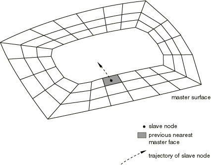

# 36.5.5 Abaqus/Explicit中接触对的接触控制


**产品：** Abaqus/Explicit  Abaqus/CAE

##### **参考**

- ["在Abaqus/Explicit中定义接触对，" 第36.5.1节"](pt09ch36s05aus160.md)
- [*CONTACT CONTROLS*](../key/key-link.md#usb-kws-hcontactcontrols)
- ["在Abaqus/Explicit分析中指定接触控制，" Abaqus/CAE用户指南第15.13.10节"](../usi/usi-link.md#usi-itn-help-exp-controls)

### 概述

Abaqus/Explicit接触对的接触控制可用于
- 缩放惩罚接触约束使用的刚度，和
- 调整跟踪两个表面之间运动的搜索算法。

### 缩放默认惩罚刚度

如果使用惩罚方法在接触对中施加接触约束（见["Abaqus/Explicit中的接触约束施加方法，" 第38.2.3节"](pt09ch38s02aus182.md)），Abaqus/Explicit通过向穿透节点施加"弹簧"刚度来抵抗表面之间的穿透。将接触力与穿透距离关联的"弹簧"刚度由Abaqus/Explicit自动选择，使得对时间增量的影响最小，但在大多数分析中允许的穿透不显著。如果存在以下任何因素，分析中可能会产生显著的穿透：
- 位移控制的加载
- 接触界面上的材料是纯弹性或随变形硬化的
- 具有相对较小自身质量并通过边界条件以外的方法（例如连接器）约束参与接触的变形单元（特别是膜和表面单元）
- 具有相对较小的自身质量或旋转惯性并通过边界条件以外的方法（例如连接器）约束参与接触的刚体

请参阅["Hertz接触问题，" Abaqus Benchmarks Guide第1.1.11节"](../bmk/bmk-link.md#bmk-anl-hertzcontact)，了解其中前两个因素结合导致默认惩罚刚度的接触穿透显著的示例。

您可以指定一个缩放因子，用于修改指定接触对的惩罚刚度。此缩放可能会影响自动时间增量。由于维持数值稳定性所必需的时间增量减少，使用大的缩放因子可能会增加分析所需的计算时间（请参阅["Abaqus/Explicit中的接触约束施加方法，" 第38.2.3节"](pt09ch38s02aus182.md)，了解更多讨论）。

| **输入文件用法：** | 使用以下两个选项来缩放默认惩罚刚度： |
| --- | --- |
| | ``` [*CONTACT PAIR*](../key/key-link.md#usb-kws-hcontactpair), MECHANICAL CONSTRAINT=PENALTY, CPSET=*contact_pair_set_name* *surface_1*, *surface_2* [*CONTACT CONTROLS*](../key/key-link.md#usb-kws-hcontactcontrols), CPSET=*contact_pair_set_name*, SCALE PENALTY=*factor* ``` |

| **Abaqus/CAE用法：** | 相互作用模块：**创建接触控制**：**名称**：*contact_controls_name*，**Abaqus/Explicit接触控制**：**惩罚刚度缩放因子**：*factor* |
| --- | --- |
| | 相互作用编辑器：**机械约束公式：惩罚接触方法**，**接触控制**：*contact_controls_name* |

### 调整有限滑动接触跟踪算法

在有限滑动接触对中，在整个分析过程中持续进行搜索以跟踪两个接触表面之间的相对运动。接触跟踪算法包括昂贵的周期性全局搜索和较便宜的正规定域搜索；搜索算法在["接触跟踪算法"中详细讨论，请参阅"Abaqus/Explicit中接触对的接触公式，" 第38.2.2节"](pt09ch38s02aus181.md#usb-cni-aexpcontactpairform-track)。您可以使用接触控制来调整这些搜索的频率和成本。

#### 指定更频繁的全局接触搜索

默认情况下，对于两表面接触对，Abaqus/Explicit每100个增量对每个从节点附近的主面进行一次更彻底的搜索，这对于大多数分析来说是足够的。但是，在某些有效的接触情况中，全局搜索需要在步骤中更频繁或更不频繁地进行。[图36.5.5-1](pt09ch36s05aus164.md#acontact-fail-search)说明了一种可能需要更频繁全局跟踪的情况。主表面是有效表面，但它包含一个孔。所示的从节点在一个增量中将阴影面元识别为最近的主表面面元。定域接触搜索查看这个主表面面元及其相邻面元。

**图36.5.5-1** 定域搜索可能失败示例。



如果从节点在相对较少的增量中跨过孔移动，则从节点与孔跨侧主表面面元之间的潜在接触将不会被检测到，因为定域接触搜索仍在检查阴影面元。当从节点快速穿过主表面上的深谷时，也会发生同样的情况。解决这个问题的方法是更频繁地进行全局接触搜索。您可以为给定的接触对指定全局搜索之间的增量数*n*，如果需要除默认值100以外的值。

| **输入文件用法：** | 使用以下两个选项： |
| --- | --- |
| | ``` [*CONTACT PAIR*](../key/key-link.md#usb-kws-hcontactpair), CPSET=*contact_pair_set_name* [*CONTACT CONTROLS*](../key/key-link.md#usb-kws-hcontactcontrols), CPSET=*contact_pair_set_name*, GLOBTRKINC=*n* ``` |

| **Abaqus/CAE用法：** | 相互作用模块：**创建接触控制**：**名称**：*contact_controls_name*，**Abaqus/Explicit接触控制**：**指定最大增量数**：*n* |
| --- | --- |
| | 相互作用编辑器：**接触控制**：*contact_controls_name* |

#### 使用更保守的定域接触搜索

Abaqus/Explicit使用的默认定域接触搜索使用使其能够使用最少计算时间的技术。如果定域接触搜索在施加适当的接触条件方面有困难，则更保守的定域接触搜索可以解决问题。指定的接触搜索对使用自接触的接触对没有影响。

| **输入文件用法：** | 使用以下两个选项： |
| --- | --- |
| | ``` [*CONTACT PAIR*](../key/key-link.md#usb-kws-hcontactpair), CPSET=*contact_pair_set_name* [*CONTACT CONTROLS*](../key/key-link.md#usb-kws-hcontactcontrols), CPSET=*contact_pair_set_name*, FASTLOCALTRK=NO ``` |

| **Abaqus/CAE用法：** | 相互作用模块：**创建接触控制**：**名称**：*contact_controls_name*，**Abaqus/Explicit接触控制**：**快速局部跟踪** |
| --- | --- |
| | 相互作用编辑器：**接触控制**：*contact_controls_name* |

### 高度翘曲表面的接触跟踪

计算高度翘曲表面上的正确接触条件非常困难，特别是当接触表面的相对速度非常大时。默认情况下，Abaqus/Explicit每20个增量监测一次由单元面形成的每个变形主表面的方向，以检查表面是否高度翘曲；刚性面元表面仅在步骤开始时检查大的翘曲。如果表面变得高度翘曲，则会在状态（`.sta`）文件中发出警告消息（见["Abaqus/Explicit分析中的接触诊断，" 第39.2.1节"](pt09ch39s02aus185.md)），并使用更精确的算法来计算每个从节点在翘曲主表面上的最近点。替代算法提供更精确的解，但会消耗稍多的计算时间。

#### 重新定义高度翘曲表面的标准

默认情况下，当面元节点处的表面法向之间的角度变化超过20度时，Abaqus/Explicit认为表面高度翘曲。面元上表面法向的最大变化称为面外翘曲角。您可以为模型中的任何接触对逐步骤更改面外翘曲角截止值的默认值。

| **输入文件用法：** | ``` [*CONTACT CONTROLS*](../key/key-link.md#usb-kws-hcontactcontrols), CPSET=*contact_pair_set_name*, WARP CUT OFF=*angle* ``` |
| --- | --- |

| **Abaqus/CAE用法：** | 相互作用模块： |
| --- | --- |
| | **创建接触控制**：**名称**：*contact_controls_name*，**Abaqus/Explicit接触控制**：**高度翘曲面元的角度标准（度）**：*angle* 相互作用编辑器：**接触控制**：*contact_controls_name* |

#### 修改Abaqus/Explicit检查翘曲表面的频率

您可以指定Abaqus/Explicit检查模型中任何接触对的翘曲表面的频率（以增量计）。频率可以逐步骤更改。更频繁地检查翘曲表面（默认每20个增量一次）将导致分析的计算时间略有增加。

| **输入文件用法：** | ``` [*CONTACT CONTROLS*](../key/key-link.md#usb-kws-hcontactcontrols), CPSET=*contact_pair_set_name*, WARP CHECK PERIOD=*n* ``` |
| --- | --- |

| **Abaqus/CAE用法：** | 相互作用模块： |
| --- | --- |
| | **创建接触控制**：**名称**：*contact_controls_name*，**Abaqus/Explicit接触控制**：**翘曲检查增量**：*n* 相互作用编辑器：**接触控制**：*contact_controls_name* |


