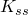
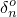
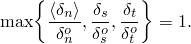
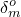
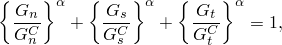
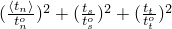

# 37.1.10 基于表面的内聚行为


**产品：** Abaqus/Standard  Abaqus/Explicit  Abaqus/CAE

##### **参考**

- ["渐进损伤和失效，" 第24.1.1节"](pt05ch24s01abo21.md)
- ["使用牵引-分离描述定义内聚元素的本构响应，" 第32.5.6节"](pt06ch32s05alm45.md)
- ["在Abaqus/Standard中定义接触对，" 第36.3.1节"](pt09ch36s03aus145.md)
- ["在Abaqus/Explicit中定义一般接触相互作用，" 第36.4.1节"](pt09ch36s04aus155.md)
- ["机械接触属性概述，" 第37.1.1节"](pt09ch37s01aus165.md)
- ["裂纹扩展分析，" 第11.4.3节"](pt04ch11s04aus69.md)
- [*COHESIVE BEHAVIOR*](../key/key-link.md#usb-kws-mcohesivebehavior)
- [*SURFACE INTERACTION*](../key/key-link.md#usb-kws-hsurfaceinteraction)
- [*DAMAGE INITIATION*](../key/key-link.md#usb-kws-mdamageinitiation)
- [*DAMAGE EVOLUTION*](../key/key-link.md#usb-kws-mdamageevolution)
- [*DAMAGE STABILIZATION*](../key/key-link.md#usb-kws-mdamagestabilization)
- [*FRACTURE CRITERION*](../key/key-link.md#usb-kws-hfracturecriterion)
- ["定义接触相互作用属性"中的"为机械接触属性选项指定内聚行为属性" Abaqus/CAE用户指南第15.14.1节"](../usi/usi-link.md#usi-itn-help-prop-contact-mech-cohesive)
- ["定义接触相互作用属性"中的"为机械接触属性选项指定内聚损伤属性" Abaqus/CAE用户指南第15.14.1节"](../usi/usi-link.md#usi-itn-help-prop-contact-mech-damage)

### 概述

本节描述的功能允许为表面指定广义牵引-分离行为。此行为提供的功能与使用牵引-分离定律定义的内聚元素非常相似（见["使用牵引-分离描述定义内聚元素的本构响应，" 第32.5.6节"](pt06ch32s05alm45.md)）。但是，基于表面的内聚行为通常更容易定义，允许模拟更广泛的内聚相互作用，例如在分析过程中两个"粘性"表面接触。

基于表面的内聚行为主要用于界面厚度可以忽略不计的情况。如果界面粘合层具有有限厚度，并且可以获得粘合材料的宏观特性（如刚度和强度），则使用传统内聚元素建模响应可能更合适（见["使用连续体方法定义内聚元素的本构响应，" 第32.5.5节"](pt06ch32s05alm44.md)）。

在Abaqus/Explicit中，基于表面的内聚行为框架也可用于通过使用虚拟裂纹闭合技术（VCCT）实现的线性弹性断裂力学原理（LEFM）对最初部分粘合表面中的裂纹扩展进行建模。

基于表面的内聚行为：
- 被定义为表面相互作用属性；
- 可用于直接根据牵引与分离来建模界面处的脱粘；
- 可用于建模"粘性"接触（即，最初不接触的表面或表面部分可能在接触时粘合；随后bonds可能发生损伤并失效）；
- 可以限制为最初接触的表面区域，在Abaqus/Standard中，也可以限制为最初接触的表面区域的部分；
- 允许指定内聚数据，例如作为界面处法向与剪切位移比（模式混合）函数的断裂能；
- 假设在损伤之前是线性弹性牵引-分离定律；
- 假设内聚bond的失效以由损伤过程驱动的内聚刚度的渐进退化为特征（在Abaqus/Explicit中，也可以使用VCCT断裂准则对脆性断裂进行建模）；
- 如果失效节点重新进入接触，允许指定失效后内聚行为；
- 在Abaqus/Explicit中在一般接触算法框架内实现，在Abaqus/Standard中在接触对框架内实现；
- 可用于在Abaqus/Explicit的一般接触框架内强制执行"粗糙摩擦"表面相互作用、"不分离"接触关系或组合的"不分离和粗糙摩擦"行为；
- 仅在Abaqus/Explicit中用于节点-表面接触相互作用，不适用于边缘-边缘和节点-解析刚性表面接触相互作用；
- 不能在Abaqus/Explicit中的耦合Eulerian-Lagrangian分析中使用；和
- 可用于除有限滑动、表面-表面公式之外的所有Abaqus/Standard接触公式。

### 在Abaqus/Explicit中定义内聚行为

在Abaqus/Explicit中，内聚行为被定义为分配给适用表面的表面相互作用属性的一部分。必须为模型定义一般接触。

| **输入文件用法：** | 使用以下选项在一般接触定义中定义两个表面之间的内聚行为： |
| --- | --- |
| | ``` [*SURFACE INTERACTION*](../key/key-link.md#usb-kws-hsurfaceinteraction), NAME=*name* [*COHESIVE BEHAVIOR*](../key/key-link.md#usb-kws-mcohesivebehavior) [*CONTACT*](../key/key-link.md#usb-kws-hcontact) [*CONTACT PROPERTY ASSIGNMENT*](../key/key-link.md#usb-kws-hcontpropassign) *surface1*, *surface2*, *name* ``` |

| **Abaqus/CAE用法：** | 使用以下选项定义两个表面之间的内聚行为： |
| --- | --- |
| | 相互作用模块：接触属性编辑器：****机械********内聚行为**** 使用以下选项定义两个表面之间的接触：相互作用模块：相互作用编辑器：**一般接触（Explicit）**：指定**接触相互作用属性** |

#### Abaqus/Explicit中内聚行为的接触公式

在某些情况下，如果除了内聚约束之外还强制执行平衡主-从公式，可能会在Abaqus/Explicit中产生过度约束。为防止此问题，对于Abaqus/Explicit中具有内聚行为的表面，强制执行纯主-从公式。如果在两个表面之间定义了内聚行为，则接触属性分配中定义的第一个表面被视为从表面，第二个表面为其对应的主表面。对于内聚表面与一般接触域其他部分之间的接触相互作用，除非定义了非默认的一般接触公式（见["Abaqus/Explicit中一般接触的接触公式，" 第38.2.1节"](pt09ch38s02aus180.md)），否则默认接触公式（平衡主-从）适用。基于表面的内聚行为仅适用于节点-表面接触相互作用；它不适用于边缘-边缘相互作用。因此，不可能定义梁和桁架单元边缘之间的基于表面的内聚。此外，当定义基于表面的内聚行为时，与热相互作用相关的接触定义被忽略。

当内聚行为与堆叠的传统壳单元一起使用时，应谨慎行事。根据载荷情况，专用接触公式可能导致近似的法向接触力，这反过来又可能在其弯曲行为影响堆叠中引起近似的横向剪切行为。在这种建模场景中，应使用连续体壳而不是传统壳。

#### 在Abaqus/Explicit中解决初始过闭合和间隙

在使用内聚表面的许多脱粘应用中，可能需要使分析从表面刚好相互接触开始。这需要解决分析开始时表面之间的初始过闭合和间隙，以确保从节点恰好与主表面接触。在Abaqus/Explicit中，默认情况下小初始过闭合被设置为零。要解决大的初始过闭合或封闭表面之间的初始间隙，可以定义适当的接触间隙规范，如["在Abaqus/Explicit中控制一般接触的初始接触状态，" 第36.4.4节"](pt09ch36s04aus158.md)中所解释。由于对内聚表面强制执行纯主-从公式，只有从表面的节点将进行无应变校正以解决与其主面元的任何初始过闭合或间隙；主面元的节点不会被移动。

### 在Abaqus/Standard中定义内聚行为

在Abaqus/Standard中，内聚行为被定义为分配给接触对的表面相互作用属性的一部分。不能将内聚行为分配给使用有限滑动、表面-表面公式的接触对（见["Abaqus/Standard中的接触公式，" 第38.1.1节"](pt09ch38s01aus177.md)）。

| **输入文件用法：** | 使用以下选项在接触对的表面之间定义内聚行为： |
| --- | --- |
| | ``` [*SURFACE INTERACTION*](../key/key-link.md#usb-kws-hsurfaceinteraction), NAME=*name* [*COHESIVE BEHAVIOR*](../key/key-link.md#usb-kws-mcohesivebehavior) [*CONTACT PAIR*](../key/key-link.md#usb-kws-hcontactpair), INTERACTION=*name* *surface1*, *surface2* ``` |

| **Abaqus/CAE用法：** | 使用以下选项在两个表面之间定义内聚行为： |
| --- | --- |
| | 相互作用模块：接触属性编辑器：****机械********内聚行为**** 使用以下选项定义两个表面之间的表面-表面接触：相互作用模块：相互作用编辑器：**表面-表面接触（Standard）**：**粘合**选项卡页面：指定**接触相互作用属性** |

#### 在Abaqus/Standard中解决初始过闭合和间隙

如上所述，在脱粘应用中，内聚表面通常需要从刚好相互接触开始分析。Abaqus/Standard提供了一些工具来调整接触对中的从节点，使它们精确接触主表面，从而消除初始过闭合和间隙。如果不调整节点，即使是非常小的初始间隙也会导致接触约束初始化为非活跃，因此不会内聚。这些工具在["在Abaqus/Standard接触对中调整初始表面位置和指定初始间隙，" 第36.3.5节"](pt09ch36s03aus149.md)中描述。

### 控制内聚节点集

默认情况下，内聚约束力可能作用于定义了内聚行为的所有表面节点。最初接触主表面的从节点可以在分析开始时承受内聚力，而最初不接触主表面的从节点如果在分析期间接触主表面，则可以承受内聚力。但是，在某些情况下，可能只需要对分析开始时接触的表面部分强制执行内聚行为。

#### 将内聚行为限制为最初接触的节点

作为内聚行为定义的一部分，您可以指示只有那些在步骤开始时与主表面接触的节点才应承受内聚力。在步骤期间发生的任何新接触都不会承受内聚约束力；它们将仅被建模为压缩接触。

| **输入文件用法：** | ``` [*COHESIVE BEHAVIOR*](../key/key-link.md#usb-kws-mcohesivebehavior), ELIGIBILITY=ORIGINAL CONTACTS ``` |
| --- | --- |

| **Abaqus/CAE用法：** | 相互作用模块：接触属性编辑器：****机械********内聚行为****：**仅最初接触的从节点** |
| --- | --- |

#### 将内聚行为限制为指定节点

在Abaqus/Standard中，您可以指定应承受内聚力的最初从节点子集。将对最初不接触但在节点集中指定的那些节点进行无应变调整。此节点集之外的所有从节点（包括最初接触主表面的节点）在分析过程中将仅承受压缩接触力。此方法对于沿现有断层线建模裂纹扩展特别有用。

| **输入文件用法：** | 同时使用以下两个选项： |
| --- | --- |
| | ``` [*INITIAL CONDITIONS*](../key/key-link.md#usb-kws-minitialcond), TYPE=CONTACT [*COHESIVE BEHAVIOR*](../key/key-link.md#usb-kws-mcohesivebehavior), ELIGIBILITY=SPECIFIED CONTACTS ``` |

| **Abaqus/CAE用法：** | 相互作用模块：接触属性编辑器：****机械********内聚行为****：**在表面-表面（Standard）相互作用中指定粘合节点集** |
| --- | --- |
| | 相互作用模块：相互作用编辑器：**粘合**选项卡页面：**限制粘合到子集中的从节点** |

### 牵引-分离行为与压缩和摩擦行为的相互作用

在接触法向方向上，控制表面之间压缩行为的压力-闭合关系与内聚行为不相互作用，因为它们各自描述了不同接触状态下的表面相互作用。压力-闭合关系仅在从节点"闭合"（即，与主表面接触）时才控制行为；内聚行为仅在从节点"打开"（即，不接触）时才对接触法向应力有贡献。对于"粘性"内聚行为——两个表面最初不接触——内聚效应在从节点状态从打开变为闭合后的增量中被激活。

在剪切方向上，如果内聚刚度未受损，假设内聚模型是活跃的，摩擦模型是休眠的。任何切向滑移都被假定为本质上是纯弹性的，并被bond的内聚强度抵抗，产生剪切力。如果定义了损伤，内聚对剪切应力的贡献开始随着损伤演化而退化。一旦内聚刚度开始退化，摩擦模型就被激活并开始对剪切应力做出贡献。摩擦模型的弹性粘附刚度与弹性内聚刚度的退化成正比增加。在内聚bond最终失效之前，以及在内聚bond退化开始之后，剪切应力是内聚贡献和摩擦模型贡献的组合。一旦达到最大退化，剪切应力的内聚贡献为零，剪切应力的唯一贡献来自摩擦模型。

### 将内聚材料概念应用于基于表面的内聚行为

控制内聚表面行为的公式和定律与具有牵引-分离本构行为的内聚元素使用的公式和定律非常相似（["使用牵引-分离描述定义内聚元素的本构响应，" 第32.5.6节"](pt06ch32s05alm45.md)）。相似之处延伸到线性弹性牵引-分离模型、损伤起始准则和损伤演化定律。

但是，重要的是要认识到，基于表面的内聚行为中的损伤是一种相互作用属性，而不是材料属性。在内聚元素的行为模型公式中使用的应变和位移概念被重新解释为接触分离；接触分离是从表面节点与沿接触法向和剪切方向在主表面上对应投影点之间的相对位移。对于基于表面的内聚行为，应力定义为沿接触法向和剪切方向作用的牵引力除以每个接触点处的当前面积。

基于表面的内聚行为模型的具体细节在以下章节中讨论。

### 线性弹性牵引-分离行为

Abaqus中可用的牵引-分离模型假设初始线性弹性行为（见["线性弹性行为"中的"以内聚元素的牵引和分离形式定义弹性"第22.2.1节"](pt05ch22s02abm02.md#usb-mat-clinearelastic-traction)），然后是损伤的起始和演化。弹性行为以本构矩阵的形式编写，该矩阵将法向和剪切应力与跨界面的法向和剪切分离联系起来。

标称牵引应力向量，，由三个分量组成（二维问题中为两个分量）：、和（在三维问题中），它们分别表示法向（在三维中沿局部3方向，在二维中沿局部2方向）和两个剪切牵引（在三维中沿局部1和2方向，在二维中沿局部1方向）。对应的分离表示为、和。然后弹性行为可以写为


#### 非耦合牵引-分离行为

内聚行为的最简单规范生成接触惩罚，在法向和切向两个方向强制执行内聚约束。默认情况下，法向和切向刚度分量不会耦合：纯法向分离本身不会在剪切方向产生内聚力，而零法向分离的纯剪切滑移不会在法向产生任何内聚力。

对于非耦合牵引-分离行为，必须定义分量、和，以及对温度或场变量的任何依赖。如果未定义这些项，Abaqus使用默认接触惩罚来建模牵引-分离行为。

| **输入文件用法：** | ``` [*COHESIVE BEHAVIOR*](../key/key-link.md#usb-kws-mcohesivebehavior), TYPE=UNCOUPLED (default) ``` |
| --- | --- |

| **Abaqus/CAE用法：** | 相互作用模块：接触属性编辑器：****机械********内聚行为****：**指定刚度系数**：**非耦合** |
| --- | --- |

#### 耦合牵引-分离行为

在其完全通用性中，弹性矩阵在牵引向量和分离向量的所有分量之间提供完全耦合的行为，并且可以依赖于温度和/或场变量。对于耦合牵引-分离行为，必须定义矩阵中的所有项。

| **输入文件用法：** | ``` [*COHESIVE BEHAVIOR*](../key/key-link.md#usb-kws-mcohesivebehavior), TYPE=COUPLED ``` |
| --- | --- |

| **Abaqus/CAE用法：** | 相互作用模块：接触属性编辑器：****机械********内聚行为****：**指定刚度系数**：**耦合** |
| --- | --- |

#### 仅在法向或剪切方向的内聚行为

要将内聚约束限制为仅沿接触法向方向作用，请定义非耦合内聚行为并为剪切刚度分量指定零值，和。或者，如果仅要强制执行切向内聚约束，法向刚度项可以设置为零，在这种情况下，法向"分离"将不受约束。法向压缩力按常规接触行为抵抗。

### 损伤建模

损伤建模允许您模拟两个内聚表面之间bond的退化和最终失效。失效机制由两个要素组成：损伤起始准则和损伤演化定律。初始响应假定为线性的，如上所述。但是，一旦满足损伤起始准则，损伤可以根据用户定义的损伤演化定律发生。图37.1.10-1显示了一个具有失效机制的典型牵引-分离响应。如果指定了损伤起始准则但没有相应的损伤演化模型，Abaqus仅出于输出目的评估损伤起始准则；对内聚表面的响应没有影响（即，不会发生损伤）。内聚表面在纯压缩下不会发生损伤。

**图37.1.10-1** 典型牵引-分离响应。


内聚表面的牵引-分离响应的损伤在与传统材料使用的相同一般框架内定义（见["渐进损伤和失效，" 第24.1.1节"](pt05ch24s01abo21.md)），只是损伤行为被指定为表面相互作用属性的一部分。内聚表面没有多种损伤响应机制可用：内聚表面只能有一个损伤起始准则和一个损伤演化定律。

| **输入文件用法：** | 使用以下选项为内聚表面定义损伤起始和损伤演化： |
| --- | --- |
| | ``` [*SURFACE INTERACTION*](../key/key-link.md#usb-kws-hsurfaceinteraction), NAME=*name* [*COHESIVE BEHAVIOR*](../key/key-link.md#usb-kws-mcohesivebehavior) [*DAMAGE INITIATION*](../key/key-link.md#usb-kws-mdamageinitiation) [*DAMAGE EVOLUTION*](../key/key-link.md#usb-kws-mdamageevolution) ``` |

| **Abaqus/CAE用法：** | 相互作用模块：接触属性编辑器：****机械********损伤****：**损伤起始**和**损伤演化**选项卡页面 |
| --- | --- |

### 损伤起始

损伤起始是指在接触点处内聚响应开始退化。当接触应力和/或接触分离满足您指定的某些损伤起始准则时，退化过程开始。有几种损伤起始准则可用，将在下面讨论。

每个损伤起始准则也有一个相关的输出变量来指示是否满足准则。值1或更高表示已满足起始准则。没有相关演化定律的损伤起始准则仅影响输出。因此，您可以使用这些准则来评估材料发生损伤的倾向，而无需实际建模损伤过程（即，无需实际指定损伤演化）。

在下面的讨论中，、和分别表示当分离纯法向于界面或纯在第一或第二剪切方向时接触应力的峰值。同样，、和分别表示当分离纯沿接触法向或纯在第一或第二剪切方向时接触分离的峰值。下面讨论中使用的符号表示Macaulay括号，具有通常的解释。Macaulay括号用于表示纯压缩位移（即，接触穿透）或纯压缩应力状态不会起始损伤。

#### 最大应力准则

当最大接触应力比（如下式定义）达到1时，假定损伤开始。此准则可表示为


| **输入文件用法：** | ``` [*DAMAGE INITIATION*](../key/key-link.md#usb-kws-mdamageinitiation), CRITERION=MAXS ``` |
| --- | --- |

| **Abaqus/CAE用法：** | 相互作用模块：接触属性编辑器：****机械********损伤****：**起始**选项卡页面：**准则**：**最大名义应力** |
| --- | --- |

#### 最大分离准则

当最大分离比（如下式定义）达到1时，假定损伤开始。此准则可表示为



| **输入文件用法：** | ``` [*DAMAGE INITIATION*](../key/key-link.md#usb-kws-mdamageinitiation), CRITERION=MAXU ``` |
| --- | --- |

| **Abaqus/CAE用法：** | 相互作用模块：接触属性编辑器：****机械********损伤****：**起始**选项卡页面：**准则**：**最大分离** |
| --- | --- |

#### 二次应力准则

当涉及接触应力比的二次相互作用函数（如下式定义）达到1时，假定损伤开始。此准则可表示为


| **输入文件用法：** | ``` [*DAMAGE INITIATION*](../key/key-link.md#usb-kws-mdamageinitiation), CRITERION=QUADS ``` |
| --- | --- |

| **Abaqus/CAE用法：** | 相互作用模块：接触属性编辑器：****机械********损伤****：**起始**选项卡页面：**准则**：**二次牵引** |
| --- | --- |

#### 二次分离准则

当涉及分离比的二次相互作用函数（如下式定义）达到1时，假定损伤开始。此准则可表示为


| **输入文件用法：** | ``` [*DAMAGE INITIATION*](../key/key-link.md#usb-kws-mdamageinitiation), CRITERION=QUADU ``` |
| --- | --- |

| **Abaqus/CAE用法：** | 相互作用模块：接触属性编辑器：****机械********损伤****：**起始**选项卡页面：**准则**：**二次分离** |
| --- | --- |

### 损伤演化

损伤演化定律描述了一旦达到相应起始准则，内聚刚度退化的速率。描述体积材料中损伤演化的通用框架（在["体积材料的损伤演化和元素移除，" 第24.2.3节"](pt05ch24s02abm43.md)中描述）与用于描述内聚表面损伤的概念类似。

标量损伤变量*D*表示接触点处的整体损伤。它最初值为0。如果建模了损伤演化，则在损伤起始后的进一步加载过程中，*D*单调从0演化为1。接触应力分量受损伤影响，公式为


其中、和是由当前分离预测的弹性牵引-分离行为（无损伤）的接触应力分量。

为了描述跨界面法向和剪切分离组合下的损伤演化，引入有效分离的概念（Camanho和Davila，2002），定义为


虽然这个公式最初应用于内聚元素的损伤演化，但可以如上所述根据内聚表面行为的接触分离来重新解释（见["将内聚材料概念应用于基于表面的内聚行为"](pt09ch37s01alm63.md#usb-cni-acohesivebehav-elements)")。

#### 混合模式定义

接触点处法向和剪切分离的相对比例定义了点的模式混合。Abaqus使用三种模式混合度量，两种基于能量，一种基于牵引。在指定损伤演化过程的模式依赖性时，您可以选择其中一种。设、和分别为牵引及其在法向、第一和第二剪切方向上的共轭分离所做的功，并定义，基于能量的模式混合定义如下：


显然，上面定义的三个量中只有两个是独立的。定义量来表示剪切牵引及相应分离分量所做总功的部分也是有用的。如后所述，Abaqus要求您将损伤演化相关的材料属性指定为（或等效地，的函数。

Abaqus根据变形的当前状态（非累积能量度量）或变形历史（累积能量度量）在积分点计算上述能量量。前者仅在Abaqus/Standard中可用，适用于混合模式模拟，其中主要能量耗散机制与内聚区失效产生的新表面相关。这类问题通常可以通过线性弹性断裂力学方法来充分描述。后者提供了一种定义模式混合的替代方法，可能在其他重要耗散机制也控制整体结构响应的情况下有用。

基于牵引分量给出了模式混合的相应定义


其中是有效剪切牵引的度量。上述定义中使用的角度度量（在其被因子归一化之前）如图37.1.10-2所示。

**图37.1.10-2** 基于牵引的模式混合度量。


| **输入文件用法：** | 使用以下选项使用基于非累积能量的模式混合定义（仅在Abaqus/Standard中可用）： |
| --- | --- |
| | ``` [*DAMAGE EVOLUTION*](../key/key-link.md#usb-kws-mdamageevolution), MODE MIX RATIO=ENERGY ``` 使用以下选项使用基于累积能量的模式混合定义： ``` [*DAMAGE EVOLUTION*](../key/key-link.md#usb-kws-mdamageevolution), MODE MIX RATIO=ACCUMULATED ENERGY ``` 使用以下选项使用基于牵引的模式混合定义： ``` [*DAMAGE EVOLUTION*](../key/key-link.md#usb-kws-mdamageevolution), MODE MIX RATIO=TRACTION ``` |

| **Abaqus/CAE用法：** | 在Abaqus/Standard中使用以下选项使用基于非累积能量的模式混合定义： |
| --- | --- |
| | 相互作用模块：接触属性编辑器：****机械********损伤****：**演化**选项卡页面：打开****指定混合模式行为****：**模式混合比**：**能量** 在Abaqus/Explicit中使用以下选项使用基于累积能量的模式混合定义：相互作用模块：接触属性编辑器：****机械********损伤****：**演化**选项卡页面：打开****指定混合模式行为****：**模式混合比**：**能量** 在Abaqus/CAE中不支持在Abaqus/Standard中使用基于累积能量的模式混合定义。使用以下选项使用基于牵引的模式混合定义：相互作用模块：接触属性编辑器：****机械********损伤****：**演化**选项卡页面：打开****指定混合模式行为****：**模式混合比**：**牵引** |

##### 混合模式定义的比较

以能量和牵引定义的模式混合比通常可能完全不同。以下示例说明了这一点。就能量而言，对于纯法向分离，无论法向和剪切牵引的值如何，和都是1。特别地，对于耦合牵引-分离行为，纯法向分离时法向和剪切牵引都可能不为零。在这种情况下，基于能量的模式混合定义将指示纯法向分离，而基于牵引的定义会提示法向和剪切分离的混合。

当模式混合基于累积能量时，可能会在混合模式行为中引入人为的路径依赖，这可能与例如基于线性弹性断裂力学的预测不一致。因此，如果界面首先在纯法向变形模式下加载，然后卸载，随后在纯剪切变形模式下加载，则在上述变形路径结束时的累积能量模式混合比计算为（假设剪切变形仅在局部1方向）和。另一方面，基于非累积能量的模式混合比在上述变形路径结束时应为和。

#### 损伤演化定义

损伤演化定义有两个组成部分。第一个组成部分涉及指定失效时的有效分离，相对于损伤起始时的有效分离；或失效所消耗的能量（见图37.1.10-3）。损伤演化定义的第二个组成部分是指定损伤变量*D*在损伤起始和最终失效之间演化的性质。这可以通过定义线性或指数软化定律来完成，或者将*D*直接指定为相对于损伤起始时有效分离的有效分离的表格函数。上述数据通常是模式混合、温度和/或场变量的函数。

**图37.1.10-3** 线性损伤演化。


图37.1.10-4是具有各向同性剪切行为的牵引-分离响应损伤起始和演化对模式混合依赖性的示意图。该图在垂直轴上显示牵引力，在两个水平轴上显示法向和剪切分离的大小。两个垂直坐标平面中的非阴影三角形分别表示纯法向和纯剪切分离下的响应。所有中间垂直平面（包含垂直轴）表示不同模式混合的混合模式条件下的损伤响应。损伤演化数据对模式混合的依赖性可以表格形式定义，或者在基于能量的定义的情况下，以解析形式定义。损伤演化数据作为模式混合函数的规定方式将在本节后面讨论。

**图37.1.10-4** 内聚相互作用中混合模式响应的说明。


损伤起始后的卸载始终假定为朝向牵引-分离平面原点线性发生，如图37.1.10-3所示。卸载后的重新加载也沿相同的线性路径发生，直到达到软化包络线（线AB）。一旦达到软化包络线，进一步的重新加载沿此包络线进行，如图37.1.10-3中的箭头所示。

#### 基于有效分离的演化

您可以指定数量（即，相对于损伤起始时的有效分离的完全失效时的有效分离，如图37.1.10-3所示，作为模式混合、温度和/或场变量的表格函数。此外，您还可以选择线性或指数软化定律，定义损伤变量*D*在损伤起始后和完全失效之间的详细演化（作为超过损伤起始的有效分离的函数）。或者，与使用线性或指数软化不同，您可以直接将损伤变量*D*指定为损伤起始后有效分离相对于损伤起始有效分离的表格函数，；模式混合；温度；和/或场变量。

##### 线性损伤演化

对于线性软化（见图37.1.10-3），Abaqus使用损伤变量*D*的演化，在恒定模式混合、温度和场变量下的损伤演化情况下，简化为以下表达式：


在前面的表达式和所有后续引用中，指的是在加载历史期间达到的有效分离的最大值。在接触点损伤起始和最终失效之间恒定模式混合的假设对于涉及单调损伤（或单调断裂）的问题是常见的。

| **输入文件用法：** | 使用以下选项指定线性损伤演化： |
| --- | --- |
| | ``` [*DAMAGE EVOLUTION*](../key/key-link.md#usb-kws-mdamageevolution), TYPE=DISPLACEMENT, SOFTENING=LINEAR ``` |

| **Abaqus/CAE用法：** | 相互作用模块：接触属性编辑器：****机械********损伤****：**演化**选项卡页面：**类型**：**位移**：**软化**：**线性** |
| --- | --- |

##### 指数损伤演化

对于指数软化（见图37.1.10-5），Abaqus使用损伤变量*D*的演化，在恒定模式混合、温度和场变量下，简化为


在上述表达式中，是定义损伤演化速率的无量纲参数，是指数函数。

**图37.1.10-5** 指数损伤演化。


| **输入文件用法：** | 使用以下选项指定指数软化： |
| --- | --- |
| | ``` [*DAMAGE EVOLUTION*](../key/key-link.md#usb-kws-mdamageevolution), TYPE=DISPLACEMENT, SOFTENING=EXPONENTIAL ``` |

| **Abaqus/CAE用法：** | 相互作用模块：接触属性编辑器：****机械********损伤****：**演化**选项卡页面：**类型**：**位移**：**软化**：**指数** |
| --- | --- |

##### 表格损伤演化

对于表格软化，您可以直接以表格形式定义*D*的演化。*D*必须指定为相对于损伤起始有效分离、模式混合、温度和/或场变量的有效分离的函数。

| **输入文件用法：** | 使用以下选项以表格形式直接定义损伤变量： |
| --- | --- |
| | ``` [*DAMAGE EVOLUTION*](../key/key-link.md#usb-kws-mdamageevolution), TYPE=DISPLACEMENT, SOFTENING=TABULAR ``` |

| **Abaqus/CAE用法：** | 相互作用模块：接触属性编辑器：****机械********损伤****：**演化**选项卡页面：**类型**：**位移**：**软化**：**表格** |
| --- | --- |

#### 基于能量的演化

损伤演化可以基于作为损伤过程结果耗散的能量（也称为断裂能）来定义。断裂能等于牵引-分离曲线下的面积（见图37.1.10-3）。您可以将断裂能指定为内聚相互作用的属性，并选择线性或指数软化行为。Abaqus确保线性或指数受损响应的面积等于断裂能。

断裂能对模式混合的依赖性可以直接以表格形式指定，也可以使用如下所述的解析形式指定。当使用解析形式时，模式混合比假定以能量定义。

##### 表格形式

定义断裂能对模式混合依赖性的最简单方法是直接以表格形式将其指定为模式混合的函数。

| **输入文件用法：** | 使用以下选项以表格形式指定断裂能作为模式混合的函数： |
| --- | --- |
| | ``` [*DAMAGE EVOLUTION*](../key/key-link.md#usb-kws-mdamageevolution), TYPE=ENERGY, MIXED MODE BEHAVIOR=TABULAR ``` |

| **Abaqus/CAE用法：** | 相互作用模块：接触属性编辑器：**接触**：****机械********损伤****：**演化**选项卡页面：**类型**：**能量**：打开****指定混合模式行为**：**表格** |
| --- | --- |

##### 幂定律形式

断裂能对模式混合的依赖性可以基于幂定律断裂准则来定义。幂定律准则规定，在混合模式条件下的失效受个别（法向和两个剪切）模式中导致失效所需能量的幂定律相互作用控制。它由下式给出



当满足上述条件时的混合模式断裂能。换句话说，


您指定数量、和，它们分别表示在法向、第一和第二剪切方向导致失效所需的临界断裂能。

| **输入文件用法：** | 使用以下选项通过解析幂定律断裂准则将断裂能定义为模式混合的函数： |
| --- | --- |
| | ``` [*DAMAGE EVOLUTION*](../key/key-link.md#usb-kws-mdamageevolution), TYPE=ENERGY, MIXED MODE BEHAVIOR=POWER LAW, POWER= ``` |

| **Abaqus/CAE用法：** | 相互作用模块：接触属性编辑器：****机械********损伤****：**演化**选项卡页面：**类型**：**能量**：打开****指定混合模式行为**：**幂定律**： |
| --- | --- |

##### Benzeggagh-Kenane（BK）形式

Benzeggagh-Kenane断裂准则（Benzeggagh和Kenane，1996）特别有用，当在纯第一和第二剪切方向分离期间的临界断裂能相同时；即，。它由下式给出


其中、和是内聚属性参数。您指定、和。

| **输入文件用法：** | 使用以下选项通过解析BK断裂准则将断裂能定义为模式混合的函数： |
| --- | --- |
| | ``` [*DAMAGE EVOLUTION*](../key/key-link.md#usb-kws-mdamageevolution), TYPE=ENERGY, MIXED MODE BEHAVIOR=BK, POWER= ``` |

| **Abaqus/CAE用法：** | 相互作用模块：接触属性编辑器：****机械********损伤****：**演化**选项卡页面：**类型**：**能量**：打开****指定混合模式行为**：**Benzeggagh-Kenane**： |
| --- | --- |

##### 线性损伤演化

对于线性软化（见图37.1.10-3），Abaqus使用损伤变量*D*的演化，简化为


其中，是损伤起始时的有效牵引。指的是在加载历史期间达到的有效分离的最大值。

| **输入文件用法：** | 使用以下选项指定线性损伤演化： |
| --- | --- |
| | ``` [*DAMAGE EVOLUTION*](../key/key-link.md#usb-kws-mdamageevolution), TYPE=ENERGY, SOFTENING=LINEAR ``` |

| **Abaqus/CAE用法：** | 相互作用模块：接触属性编辑器：****机械********损伤****：**演化**选项卡页面：**类型**：**能量**：**软化**：**线性** |
| --- | --- |

##### 指数损伤演化

对于指数软化，Abaqus使用损伤变量*D*的演化，简化为


在上述表达式中，和分别是有效牵引和分离。是损伤起始时的弹性能量。在这种情况下，牵引在损伤起始后可能不会立即下降，这与图37.1.10-5中看到的不同。

| **输入文件用法：** | 使用以下选项指定指数软化： |
| --- | --- |
| | ``` [*DAMAGE EVOLUTION*](../key/key-link.md#usb-kws-mdamageevolution), TYPE=ENERGY, SOFTENING=EXPONENTIAL ``` |

| **Abaqus/CAE用法：** | 相互作用模块：接触属性编辑器：****机械********损伤****：**演化**选项卡页面：**类型**：**能量**：**软化**：**指数** |
| --- | --- |

#### 将损伤演化数据定义为模式混合的表格函数

如前所述，定义内聚界面损伤演化的数据可以是模式混合的表格函数。在下面分别针对基于能量和基于牵引的模式混合定义，说明了必须在Abaqus中定义这种依赖性的方式。在下面的讨论中，假设演化以能量定义。对于基于有效分离的演化定义，可以做出类似的说明。

##### 基于能量的模式混合

对于基于能量的模式混合定义，在具有各向同性剪切行为的三维分离状态的最一般情况下，断裂能必须定义为和的函数。数量是剪切实分占总量的分数的度量，而是第二剪切方向中所占剪切实分的分数的度量。图37.1.10-6显示了断裂能与模式混合行为的示意图。

**图37.1.10-6** 断裂能作为模式混合的函数。


纯法向和纯第一和第二剪切方向分离的极限情况在图37.1.10-6中分别由、和表示。标记为"Modes n-s"、"Modes n-t"和"Modes s-t"的线分别显示了在纯法向和纯第一方向剪切之间、纯法向和纯第二方向剪切之间、以及纯第一和纯第二方向剪切之间的行为转变。一般来说，必须在各种固定值下定义为的函数。在下面的讨论中，我们将相对于对应于固定的的数据集称为"数据块"。以下指南在将断裂能定义为模式混合的函数时很有用：
- 对于二维问题，只需要定义为（在这种情况下为）的函数。对应于的数据列必须留空。因此，基本上只需要一个"数据块"。
- 对于具有各向同性剪切响应的三维问题，剪切行为由和定义，而不是由和的单独值定义。因此，在这种情况下，单个"数据块"（对应于的"数据块"）也足以将断裂能定义为模式混合的函数。
- 在具有各向同性剪切行为的三维问题的最一般情况下，需要几个"数据块"。如前所述，每个"数据块"将包含在固定值下相对于。在每个"数据块"中，可以在0到1.0之间变化。情况（任何"数据块"中的第一个数据点）对应于纯法向模式，当时（即，在图37.1.10-6中线OB上唯一有效的点是O，对应于纯法向分离）永远无法实现。但是，在将断裂能作为模式混合函数表格定义中，此点简单地用于设置极限，确保当从各种法向和剪切实分组合接近纯法向状态时，断裂能发生连续变化。因此，每个"数据块"中第一个数据点的断裂能必须始终设置为等于纯法向分离中的断裂能（）。作为各向同性剪切情况的示例，假设您要输入三个"数据块"，分别对应于固定值0.、0.2和1.0。对于三个"数据块"中的每一个，根据上面讨论的原因，第一个数据点必须是。每个"数据块"中的其余数据点定义了断裂能随剪切分离比例增加的变化。

##### 基于牵引的模式混合

断裂能需要以相对于和的表格形式指定。因此，需要在各种固定值下指定为的函数。在这种情况下，"数据块"对应于在固定值下相对于的数据集。在每个"数据块"中，可以从0（纯法向分离）到1（纯剪切分离）变化。一个重要的限制是，每个数据块必须为指定相同的断裂能值。此限制确保当牵引向量接近法向方向时，断裂所需的能量不取决于牵引向量在剪切平面上的投影方向（见图37.1.10-2）。

### Abaqus/Standard中的粘性正则化

表现出各种软化行为和刚度退化特征的模型通常会在Abaqus/Standard中导致严重的收敛困难。定义基于表面内聚行为的本构方程的粘性正则化可用于克服一些收敛困难。此技术也适用于内聚元素、紧固件损伤和Abaqus/Standard中的混凝土材料模型。粘性正则化阻尼会导致在足够小的时间增量下定义接触应力的切线刚度矩阵为正。

整个模型与粘性正则化相关的大约能量可使用输出变量ALLVD。

| **输入文件用法：** | ``` [*DAMAGE STABILIZATION*](../key/key-link.md#usb-kws-mdamagestabilization) ``` |
| --- | --- |

| **Abaqus/CAE用法：** | 相互作用模块：接触属性编辑器：****机械********损伤****：**稳定化**选项卡页面：**粘性系数** |
| --- | --- |

### 失效后行为

可以指定两种类型的失效后行为来定义在从表面节点处达到最大退化值后该节点处的内聚行为。

默认情况下，一旦完全退化，就在节点处强制执行法向接触行为，不再强制执行进一步的内聚约束。如果从节点重新进入接触，穿透将产生压缩接触应力，如果指定了摩擦模型，剪切方向将根据规定的摩擦模型施加摩擦应力。分离可以发生而不会产生任何内聚应力。

在某些情况下，即使在达到最大退化后，如果从节点重新进入接触，可能需要重新强制执行内聚行为。对于允许重复接触的内聚行为，当失效的从节点重新接触时，整体损伤变量将重新初始化为0。随后，法向分离可能产生拉伸内聚应力，剪切分离可能根据定义的内聚行为类型产生切向内聚应力。进一步的加载可以再次导致内聚应力经历渐进损伤、退化和失效。

| **输入文件用法：** | 使用以下选项在最大退化后强制执行内聚行为： |
| --- | --- |
| | ``` [*COHESIVE BEHAVIOR*](../key/key-link.md#usb-kws-mcohesivebehavior), REPEATED CONTACTS ``` |

| **Abaqus/CAE用法：** | 相互作用模块：接触属性编辑器：****机械********内聚行为****：**在重复失效后接触期间允许内聚行为** |
| --- | --- |

### Abaqus/Explicit中的虚拟裂纹闭合技术

在Abaqus/Explicit中，基于表面的内聚行为框架可用于基于线性弹性断裂力学原理对脆性裂纹扩展问题进行建模。虚拟裂纹闭合技术（VCCT）断裂准则可用于对最初部分粘合表面中的裂纹扩展进行建模。此主题的详细讨论可以在["裂纹扩展分析，" 第11.4.3节"](pt04ch11s04aus69.md)中找到。

VCCT断裂准则不能与牵引-分离响应的基于损伤的表面行为结合使用。但是，您可以将基于表面的VCCT断裂准则与内聚元素结合使用。VCCT可以对脆性失效/裂纹扩展进行建模，而内聚元素可以对粘合界面的其他方面（如缝合线）进行建模。

| **输入文件用法：** | 使用以下选项在最大退化后强制执行内聚行为： |
| --- | --- |
| | ``` [*COHESIVE BEHAVIOR*](../key/key-link.md#usb-kws-mcohesivebehavior) [*FRACTURE CRITERION*](../key/key-link.md#usb-kws-hfracturecriterion), TYPE=VCCT ``` |

### 内聚表面与内聚元素

如上所述，基于表面的内聚行为所使用的公式与具有牵引-分离响应的内聚元素的公式非常相似。但是，存在某些差异。

对于内聚表面，从不考虑界面厚度效应；对于具有牵引-分离响应的内聚元素，可以通过指定界面的非零厚度或要求初始本构厚度从内聚元素的节点坐标确定来考虑厚度效应。由于对内聚表面不考虑厚度效应，用于描述具有厚度效应的牵引-分离内聚元素的本构响应的材料属性可能无法直接重用于内聚表面。

对于内聚表面，内聚约束在每个从节点处强制执行；在内聚元素中，内聚约束在材料点处计算（关于内聚元素中材料点的位置，请参阅["二维内聚元素库，" 第32.5.8节"](pt06ch32s05ael30.md)和["三维内聚元素库，" 第32.5.9节"](pt06ch32s05ael31.md)）。因此，对于内聚表面，与主表面相比细化从表面可能会改善约束满足性和更准确的结果。

### 输出

除了Abaqus中可用的标准输出标识符（["Abaqus/Standard输出变量标识符，" 第4.2.1节"](pt02ch04s02abv01.md)和["Abaqus/Explicit输出变量标识符，" 第4.2.2节"](pt02ch04s02xbv01.md)），以下变量对具有牵引-分离行为的内聚表面具有特殊含义：

| CSDMG | 标量损伤变量*D*的整体值。 |
| --- | --- |

| CSMAXSCRT | 此变量指示是否在接触点处满足最大接触应力损伤起始准则。它计算为。 |
| --- | --- |

| CSMAXUCRT | 此变量指示是否在接触点处满足最大分离损伤起始准则。它计算为。 |
| --- | --- |

| CSQUADSCRT | 此变量指示是否在接触点处满足二次接触应力损伤起始准则。它计算为。 |
| --- | --- |

| CSQUADUCRT | 此变量指示是否在接触点处满足二次分离损伤起始准则。它计算为。 |
| --- | --- |

对于上述指示是否满足某个损伤起始准则的变量，值小于1.0表示未满足准则，而值1.0表示已满足准则。如果为此准则指定了损伤演化，此变量的最大值不会超过1.0。

#### 附加参考

- Benzeggagh, M. L., and M. Kenane, "Measurement of Mixed-Mode Delamination Fracture Toughness of Unidirectional Glass/Epoxy Composites with Mixed-Mode Bending Apparatus," Composites Science and Technology, vol. 56, pp. 439--449, 1996.
- Camanho, P. P., and C. G. Davila, "Mixed-Mode Decohesion Finite Elements for the Simulation of Delamination in Composite Materials," NASA/TM-2002--211737, pp. 1--37, 2002.


