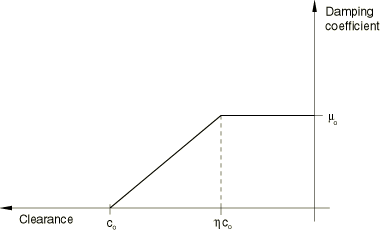
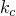
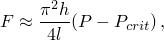
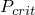
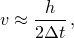

# 37.1.3 接触阻尼


**产品：** Abaqus/Standard  Abaqus/Explicit  Abaqus/CAE

##### **参考**

- ["机械接触属性概述，" 第37.1.1节"](pt09ch37s01aus165.md)
- [*CONTACT DAMPING*](../key/key-link.md#usb-kws-hcontactdamping)
- ["创建相互作用属性，" Abaqus/CAE用户指南第15.12.2节"](../usi/usi-link.md#usi-itn-helptopic-createprop)

### 概述

接触阻尼：
- 可以被定义来反对相互作用表面之间的相对运动（除了["接触压力-闭合关系，" 第37.1.2节"](pt09ch37s01aus166.md)中讨论的接触压力-闭合关系和["摩擦行为，" 第37.1.5节"](pt09ch37s01aus169.md)中讨论的摩擦模型）；
- 可以影响表面法向和切向的运动；
- 在法向方向上与表面之间的相对速度成正比；
- 在切向方向上，在Abaqus/Standard中与相对切向速度成正比，在Abaqus/Explicit中与与摩擦相关的"弹性滑移率"成正比（关于弹性滑移的讨论见["摩擦行为，" 第37.1.5节"](pt09ch37s01aus169.md)）——因此，在Abaqus/Explicit中，它不抵抗整体切向滑动；
- 不适用于线性扰动过程；
- 在Abaqus/Standard中，它对应力和刚度定义有贡献，通常仅在无法获得解的其他情况下使用——在Abaqus/Standard中允许在接触表面之间传递粘性压力和剪切应力以减少由于接触约束突然违反（在与接触相关的某些snap-through和屈曲问题中常见）而导致的收敛困难的最佳方法是在["Abaqus/Standard中的自动刚体运动稳定"中的"调整接触控制"中讨论的，按步骤指定阻尼，如["在Abaqus/Standard中调整接触控制，" 第36.3.6节"](pt09ch36s03aus150.md#usb-cni-acontacttrouble-stabilize)；和
- 在Abaqus/Explicit中可用于减少解的噪声——默认情况下，微小的粘性接触阻尼用于软化接触和惩罚接触，如下所述。

### 为表面相对运动定义粘性接触阻尼

在Abaqus/Standard中，阻尼系数是表面间隙的函数，如图37.1.3-1所示。阻尼系数定义为比例常数，单位为压力除以速度。

**图37.1.3-1** Abaqus/Standard中粘性阻尼的阻尼系数-间隙关系。



在Abaqus/Explicit中，当表面处于接触状态时，阻尼系数将保持在指定的常数值，否则为零。阻尼系数可以定义为比例常数（单位为压力除以速度），也可以作为临界阻尼的无量纲分数。

要定义粘性阻尼，必须将其包含在接触属性定义中。

| **输入文件用法：** | 对基于表面的接触同时使用以下两个选项： |
| --- | --- |
| | ``` [*SURFACE INTERACTION*](../key/key-link.md#usb-kws-hsurfaceinteraction), NAME=*interaction_property_name* [*CONTACT DAMPING*](../key/key-link.md#usb-kws-hcontactdamping) ``` 对Abaqus/Standard中基于单元的接触同时使用以下两个选项： ``` [*INTERFACE*](../key/key-link.md#usb-kws-minterface) or [*GAP*](../key/key-link.md#usb-kws-mgap), ELSET=*name* [*CONTACT DAMPING*](../key/key-link.md#usb-kws-hcontactdamping) ``` |

| **Abaqus/CAE用法：** | 相互作用模块：接触属性编辑器：****机械********阻尼**** |
| --- | --- |
| | Abaqus/CAE不支持基于单元的接触。 |

#### 阻尼和压力-闭合关系

在Abaqus/Standard中，粘性阻尼关系可与任何接触关系一起使用（见["接触压力-闭合关系，" 第37.1.2节"](pt09ch37s01aus166.md)）。

在Abaqus/Explicit中，接触阻尼不适用于硬运动学接触。软化运动学接触和所有惩罚接触默认具有形式为临界阻尼分数为=0.03的默认阻尼。

#### 指定阻尼系数，使得阻尼力直接与表面之间的相对运动速率成正比

您可以直接以阻尼系数的形式指定阻尼，单位为压力每速度，这样阻尼力将用计算，其中*A*是节点面积，是两个表面之间的相对运动速率。

对于涉及基于单元的表面的接触和基于单元的接触（仅在Abaqus/Standard中可用），阻尼系数以接触压力的形式指定。对于涉及基于节点的表面或节点接触单元（如GAP单元和ITT单元）且未定义面积或长度尺寸的接触，必须将指定为力每速度。对于梁单元上的从表面，将指定为每单位长度每速度的力。

| **输入文件用法：** | 在Abaqus/Standard中使用以下语法： |
| --- | --- |
| | ``` [*CONTACT DAMPING*](../key/key-link.md#usb-kws-hcontactdamping), DEFINITION=DAMPING COEFFICIENT , ,  ``` 在Abaqus/Explicit中使用以下语法： ``` [*CONTACT DAMPING*](../key/key-link.md#usb-kws-hcontactdamping), DEFINITION=DAMPING COEFFICIENT  ``` |

| **Abaqus/CAE用法：** | 在Abaqus/Standard中使用以下语法： |
| --- | --- |
| | 相互作用模块：接触属性编辑器：****机械********阻尼****：**定义：阻尼系数**，**线性**或**双线性**，**阻尼系数**，**间隙***c*和（对于**线性**，=0；对于**双线性**，）在Abaqus/Explicit中使用以下语法：相互作用模块：接触属性编辑器：****机械********阻尼****：**定义：阻尼系数**，**步进**，**阻尼系数** |

#### 在Abaqus/Explicit中指定阻尼系数作为临界阻尼的分数

在Abaqus/Explicit中，您可以指定以与接触刚度相关的临界阻尼分数形式的无量纲阻尼系数；此方法在Abaqus/Standard中不可用。阻尼力将用计算，其中*m*是节点质量，是节点接触刚度（单位为），, DEFINITION=CRITICAL DAMPING FRACTION *critical damping fraction* ``` |
| --- | --- |

| **Abaqus/CAE用法：** | 相互作用模块：接触属性编辑器：****机械********阻尼****：**定义：临界阻尼分数**，**临界阻尼分数***critical damping fraction* |
| --- | --- |

#### 指定切向阻尼系数

您可以指定切向阻尼系数与法向阻尼系数的比率，也称为切向分数。

切向阻尼使用与法向阻尼相同形式的阻尼。切向阻尼只能与法向阻尼一起指定。如果在Abaqus/Standard中激活切向阻尼，阻尼应力与相对切向速度成正比。在Abaqus/Explicit中，如果沿切向方向使用硬运动学接触或未定义摩擦，则切向阻尼将被忽略。如前所述，Abaqus/Explicit中切向方向的阻尼与弹性滑移率（见["摩擦行为，" 第37.1.5节"](pt09ch37s01aus169.md)）成正比，而不是与总相对滑动速率成正比。

对于Abaqus/Standard，切向分数的默认值为0.0；因此，默认情况下，切向方向的阻尼系数为零。对于Abaqus/Explicit，切向分数的默认值为1.0；因此，默认情况下，切向方向的阻尼系数等于法向方向的阻尼系数。此外，在Abaqus/Explicit中，软化接触和硬惩罚接触的默认临界阻尼分数为0.03。

| **输入文件用法：** | ``` [*CONTACT DAMPING*](../key/key-link.md#usb-kws-hcontactdamping), TANGENT FRACTION=*value* ``` |
| --- | --- |

| **Abaqus/CAE用法：** | 相互作用模块：接触属性编辑器：****机械********阻尼****：**切向分数**：**指定值**：*value* |
| --- | --- |

### 在Abaqus/Standard中选择粘性阻尼的适当系数

在Abaqus/Standard中，局部接触阻尼因子的适当大小取决于具体问题。在某些情况下，可以使用简单计算来确定大小；在其他情况下，必须通过试错来确定的合理值。合理的值是对模型中不稳定行为之前的结果影响最小的值。可以按照以下所述，在添加阻尼之前查看模型中的接触压力和速度来找到初步值。

如果输出请求不够频繁，可能难以确定不稳定行为之前的节点速度。在这种情况下，消息（`.msg`）文件中的信息可用于估计峰值节点速度。默认情况下，Abaqus/Standard在此文件中每个收敛增量提供峰值节点位移增量。此位移增量可与时间增量一起使用来计算模型的峰值节点速度。虽然此速度可能不太接近表面的实际相对速度，但它应该在数量级内，是计算初始粘性阻尼系数的合理值。

还需要估计表面之间的最大接触压力。然后应将粘性阻尼系数设置为一个值，该值比估计的最大接触压力与计算的节点速度的比值小几个数量级。

如果如上所述无法获得压力和速度，则应最初使用高阻尼值，并使用越来越小的值重复进行分析。的适当值是足够大以使分析能够度过任何不稳定响应，但又不会大到显著影响早期或晚期结果的值。["圆拱的snap-through屈曲分析，" Abaqus例题问题指南第1.2.1节"](../exa/exa-link.md#exa-sta-snapbuckling)演示了如何使用上述方法确定阻尼系数的大小。

以下示例概述了如何为典型案例选择值。考虑对二维Euler柱屈曲问题的简单修改：在柱的任一侧添加平行刚性表面，以便在屈曲时梁将接触表面。当轴向载荷超过屈曲载荷时，柱将压平在表面上。然后，接触的中点将离开表面，梁将屈曲成更高模式。图37.1.3-2显示了该形状。

**图37.1.3-2** 粘性阻尼的约束Euler屈曲示例。


当柱首次屈曲时，柱施加在一个刚性表面上的接触力*F*可以近似为



其中*h*是两个刚性表面之间的分离距离，*l*是梁长度，*P*是施加的载荷，是屈曲载荷。

接触力的近似需要假设单个点接触，并且屈曲柱的形状不变。的单位是接触力每速度，假设在此模型中使用基于节点的表面。接触点处柱的速度*v*可以近似为



其中是时间增量。这些接触力和柱速度的估计值给出了阻尼系数的值：


此值可用作起始值，但应测试不同的值。


