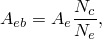
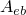
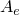
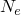

# 37.1.4 接触堵塞


**产品：** Abaqus/Explicit

##### **参考**

- ["机械接触属性概述，" 第37.1.1节"](pt09ch37s01aus165.md)
- ["基于表面的流体腔概述，" 第11.5.1节"](pt04ch11s05aus70.md)
- ["流体交换定义，" 第11.5.3节"](pt04ch11s05aus72.md)
- [*BLOCKAGE*](../key/key-link.md#usb-kws-hblockage)
- [*FLUID EXCHANGE ACTIVATION*](../key/key-link.md#usb-kws-hfluidexchangeinte)
- [*SURFACE INTERACTION*](../key/key-link.md#usb-kws-hsurfaceinteraction)

### 概述

由于接触表面引起的阻塞导致的腔体流出堵塞：
- 可以选择性地定义为可能完全或部分导致堵塞的特定表面；和
- 仅当表面与一般接触算法一起使用时才能计算。

### 用于计算接触堵塞的表面

要如["流体交换定义"中的"计算接触边界表面引起的堵塞"第11.5.3节"](pt04ch11s05aus72.md#usb-anl-afluidcavityexchange-blockage)中所讨论考虑接触表面的阻塞，您必须定义一个表面来表示流体腔边界上的泄漏面积。此外，您必须指定接触表面可能潜在地导致堵塞。所有表面（流体腔边界上的表面和接触表面）必须包含在一般接触域中。为了计算接触堵塞，表面上的节点必须是节点-面接触。当流体腔边界上的表面上的节点与接触表面接触时，从节点被标记为接触堵塞的活跃节点。接触堵塞也在边缘-边缘接触中被考虑（见["Abaqus/Explicit中一般接触的接触公式，" 第38.2.1节"](pt09ch38s02aus180.md)）。

| **输入文件用法：** | 使用以下选项指定两个接触表面可能引起堵塞： |
| --- | --- |
| | ``` [*CONTACT PROPERTY ASSIGNMENT*](../key/key-link.md#usb-kws-hcontpropassign) *surface_1, surface_2, property_name* [*SURFACE INTERACTION*](../key/key-link.md#usb-kws-hsurfaceinteraction), NAME=*property_name* [*BLOCKAGE*](../key/key-link.md#usb-kws-hblockage) ``` |

### 确定阻塞面积

Abaqus/Explicit通过计算流体腔边界上的表面中被接触表面阻塞的面积分数来确定阻塞面积。对于表示泄漏面积的此表面的每个单元面元，基于接触堵塞的活跃节点计算阻塞面积。单元阻塞面积由下式确定



其中是单元阻塞面积，是单元面积，是单元节点的总数，），则用于流体交换计算的泄漏面积是通过使用总阻塞面积与表面总面积的比率乘以有效面积获得的。在这种情况下，可以使用基于节点的表面，泄漏面积是通过使用接触堵塞活跃节点总数与表面中定义的节点总数的比率获得的。


