# 37.1.5 摩擦行为


**产品：** Abaqus/Standard  Abaqus/Explicit  Abaqus/CAE

##### **参考**

- ["机械接触属性概述，" 第37.1.1节"](pt09ch37s01aus165.md)
- ["FRIC，" Abaqus用户子程序参考指南第1.1.8节"](../sub/sub-link.md#sub-rtn-ufric)
- ["FRIC_COEF，" Abaqus用户子程序参考指南第1.1.9节"](../sub/sub-link.md#sub-rtn-ufriccoef)
- ["VFRIC，" Abaqus用户子程序参考指南第1.2.5节"](../sub/sub-link.md#sub-rtn-uexpfric)
- ["VFRIC_COEF，" Abaqus用户子程序参考指南第1.2.6节"](../sub/sub-link.md#sub-rtn-uexpfriccoef)
- ["VFRICTION，" Abaqus用户子程序参考指南第1.2.7节"](../sub/sub-link.md#sub-rtn-uexpfriction)
- [*FRICTION*](../key/key-link.md#usb-kws-hfriction)
- [*CHANGE FRICTION*](../key/key-link.md#usb-kws-hchangefriction)
- ["创建相互作用属性，" Abaqus/CAE用户指南第15.12.2节"](../usi/usi-link.md#usi-itn-helptopic-createprop)

### 概述

当表面处于接触状态时，它们通常在界面上传递剪切力以及法向力。这两个力分量之间通常存在一种关系。这种关系被称为接触体之间的摩擦，通常以界面上应力的形式表达。Abaqus中可用的摩擦模型：
- 包括经典的各向同性Coulomb摩擦模型（见["Coulomb摩擦，" Abaqus理论指南第5.2.3节"](../stm/stm-link.md#stm-ifc-coulombfric)），在Abaqus中：
  - 在其一般形式中，允许以滑移率、接触压力、接触点处的平均表面温度和场变量的函数形式定义摩擦系数；和
  - 提供选项让您定义静摩擦系数和动摩擦系数，并由指数曲线定义平滑过渡区；
- 允许引入剪切应力极限值，这是界面在表面开始滑动之前可以承受的最大剪切应力值；
- 在Abaqus/Standard中包括基本Coulomb摩擦模型的各向异性扩展；
- 包括在表面接触时消除摩擦滑移的模型；
- 在Abaqus/Explicit中包括用于粘附摩擦的"软化"界面模型，其中剪切应力是弹性滑移的函数；
- 可以通过刚度（惩罚）方法、运动学方法（在Abaqus/Explicit中）或Lagrange乘数方法（在Abaqus/Standard中）实现，取决于所使用的接触算法；和
-可以在用户子程序[`FRIC`](../sub/sub-link.md#sub-xsl-fric)或[`FRIC_COEF`](../sub/sub-link.md#sub-xsl-fric_coef)（在Abaqus/Standard中）或[`VFRIC`](../sub/sub-link.md#sub-xsl-vfric)、[`VFRICTION`](../sub/sub-link.md#sub-xsl-vfriction)或[`VFRIC_COEF`](../sub/sub-link.md#sub-xsl-vfric_coef)（在Abaqus/Explicit）中定义。

在Abaqus/Standard中，切向阻尼力可以与相对切向速度成正比引入，而在Abaqus/Explicit中，切向阻尼力可以与接触表面之间的相对弹性滑移率成正比引入（详见["接触阻尼，" 第37.1.3节"](pt09ch37s01aus167.md)）。

### 在接触属性定义中包含摩擦属性

默认情况下，Abaqus假设接触体之间的相互作用是无摩擦的。您可以在基于表面和基于单元的接触的接触属性定义中包含摩擦模型。

| **输入文件用法：** | 对基于表面的接触同时使用以下两个选项： |
| --- | --- |
| | ``` [*SURFACE INTERACTION*](../key/key-link.md#usb-kws-hsurfaceinteraction), NAME=*interaction_property_name* [*FRICTION*](../key/key-link.md#usb-kws-hfriction) ``` 对Abaqus/Standard中基于单元的接触同时使用以下两个选项： ``` [*INTERFACE*](../key/key-link.md#usb-kws-minterface) or [*GAP*](../key/key-link.md#usb-kws-mgap), ELSET=*name* [*FRICTION*](../key/key-link.md#usb-kws-hfriction) ``` |

| **Abaqus/CAE用法：** | 相互作用模块：接触属性编辑器：****机械********切向行为**** |
| --- | --- |
| | Abaqus/CAE不支持基于单元的接触。 |

### 在分析过程中更改摩擦属性

在Abaqus/Standard和Abaqus/Explicit之间，分析过程中更改摩擦属性的方法不同。

#### 在Abaqus/Standard分析过程中更改摩擦属性

在Abaqus/Standard模拟的任何特定步骤中，可以从接触属性定义中移除、修改或添加不涉及用户子程序的摩擦模型。在某些模型（如过盈配合接触干涉问题）中，摩擦不应在第一步完成后添加。在其他模型中，摩擦可能被移除或降低以表示在接触体之间引入润滑剂。

您必须识别正在更改的接触属性定义或接触单元集。

| **输入文件用法：** | 对基于表面的接触同时使用以下两个选项： |
| --- | --- |
| | ``` [*CHANGE FRICTION*](../key/key-link.md#usb-kws-hchangefriction), INTERACTION=*name* [*FRICTION*](../key/key-link.md#usb-kws-hfriction) ``` 对基于单元的接触同时使用以下两个选项： ``` [*CHANGE FRICTION*](../key/key-link.md#usb-kws-hchangefriction), ELSET=*name* [*FRICTION*](../key/key-link.md#usb-kws-hfriction) ``` |

| **Abaqus/CAE用法：** | 使用新的摩擦定义定义接触属性。然后在特定步骤中更改分配给相互作用的接触属性。 |
| --- | --- |
| | 相互作用模块：接触属性编辑器：****机械********切向行为**** 相互作用编辑器：**接触相互作用属性**：*new_interaction_property_name* Abaqus/CAE不支持基于单元的接触。 |

##### 指定摩擦属性变化的时间变化

您可以指定一个振幅曲线（见["振幅曲线，" 第34.1.2节"](pt07ch34s01aus115.md)）来定义整个步骤中摩擦系数和适用时的允许弹性滑移（见下面的["在Abaqus/Standard中施加摩擦约束的刚度方法"](pt09ch37s01aus169.md#usb-cni-afriction-stiffness-std)）的时间变化。如果您不指定振幅曲线，这些摩擦属性的变化将在步骤开始时立即应用或在整个步骤中线性斜升，取决于分配给步骤的默认振幅变化（见["定义分析，" 第6.1.2节"](pt03ch06s01abo05.md)），但有一些例外，如下所述。对于许多步骤类型，默认过渡类型是从旧值到新值的线性斜升，这有助于避免摩擦属性突然变化时可能出现的收敛问题。

用于控制摩擦属性变化的振幅曲线受以下限制：
- 必须使用表格或平滑步骤振幅定义，
- 只接受在0.0和1.0之间单调递增的振幅值，和
- 振幅必须以步骤时间定义并使用相对大小。

在给定时间生效的摩擦系数或允许弹性滑移的值通常等于步骤开始时属性的值加上当前振幅值乘以步骤中属性值的预期变化。摩擦属性的变化必须考虑以下因素：
- 摩擦约束施加方法类型的变化（惩罚或Lagrange乘数方法）、从"粗糙"摩擦模型到有限摩擦系数的变化，以及除摩擦系数或允许弹性滑移以外的摩擦属性的变化总是在步骤开始时发生。
- 如果摩擦系数依赖于滑移率、接触压力、接触点处的平均表面温度或场变量，则步骤结束时摩擦系数的最终值的估计（用于计算步骤中摩擦系数的预期变化）假设当前的滑移率、接触压力等将在步骤结束时保持有效。
- 如果摩擦系数在分析的第一步中更改，则在此计算中步骤开始时其值为零，无论模型中的原始摩擦定义如何。
- 当使用指数衰减摩擦模型或当摩擦属性在第一步或稳态传输步骤（前面是稳态传输以外的步骤类型）期间更改时，允许弹性滑移的变化总是在步骤开始时发生。

| **输入文件用法：** | ``` [*CHANGE FRICTION*](../key/key-link.md#usb-kws-hchangefriction), AMPLITUDE=*name* ``` |
| --- | --- |

| **Abaqus/CAE用法：** | Abaqus/CAE不支持摩擦属性的时间依赖变化。 |
| --- | --- |

##### 将摩擦属性重置为默认值

您可以将指定接触属性定义或单元集的摩擦属性重置为其原始值。

| **输入文件用法：** | 使用以下任一选项： |
| --- | --- |
| | ``` [*CHANGE FRICTION*](../key/key-link.md#usb-kws-hchangefriction), RESET, INTERACTION=*name* [*CHANGE FRICTION*](../key/key-link.md#usb-kws-hchangefriction), RESET, ELSET=*name* ``` 在这种情况下，不需要[*FRICTION*](../key/key-link.md#usb-kws-hfriction)选项。 |

| **Abaqus/CAE用法：** | 相互作用模块： |
| --- | --- |
| | 接触属性编辑器：****机械********切向行为****：**摩擦公式：无摩擦** 相互作用编辑器：**接触相互作用属性**：*default_interaction_property_name* |

#### 在Abaqus/Explicit分析过程中更改摩擦属性

在Abaqus/Explicit中，摩擦定义被指定为一般接触分析的模型定义的一部分，以及接触对分析的历史定义的一部分。有关在Abaqus/Explicit分析期间更改任何接触属性定义方面的信息，请参阅["为Abaqus/Explicit中的一般接触分配接触属性，" 第36.4.3节"](pt09ch36s04aus157.md)和["为Abaqus/Explicit中的接触对分配接触属性，" 第36.5.3节"](pt09ch36s05aus162.md)。

### 使用基本Coulomb摩擦模型

Coulomb摩擦模型的基本概念是将界面上的最大允许摩擦（剪切）应力与接触体之间的接触压力联系起来。在Coulomb摩擦模型的基本形式中，两个接触表面可以在界面上承受高达一定大小的剪切应力，然后才开始相互滑动；这种状态称为粘附。Coulomb摩擦模型将表面开始滑动时的临界剪切应力定义为接触表面之间接触压力*p*的分数（）。粘附/滑移计算确定点何时从粘附转变为滑动或从滑动转变为粘附。该分数被称为摩擦系数。

当从表面由基于节点的表面组成时，接触压力等于接触节点处的法向接触力除以接触节点处的横截面积。在Abaqus/Standard中，默认横截面积为1.0；当定义表面时，您可以为基于节点的表面中的每个节点指定横截面积，或者通过接触属性定义为每个节点分配相同的面积。在Abaqus/Explicit中，横截面积始终为1.0，您无法更改它。

基本摩擦模型假设在所有方向上相同（各向同性摩擦）。对于三维模拟，在两个体的界面沿有两个正交的剪切应力分量和。这些分量在接触表面或接触单元的局部切向方向上作用。接触表面的局部切向方向在["Abaqus/Standard中的接触公式，" 第38.1.1节"](pt09ch38s01aus177.md)中定义，接触单元的局部切向方向在描述这些单元的接触建模的章节中定义。

Abaqus将两个剪切应力分量合并为"等效剪切应力"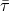，用于粘附/滑移计算，其中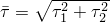。此外，Abaqus将两个滑移速度分量合并为等效滑移率。粘附/滑移计算定义了接触压力-剪切应力空间中点从粘附转变为滑动的边界（对于二维表示，见图37.1.5-1）。

**图37.1.5-1** 基本Coulomb摩擦模型的滑移区域。

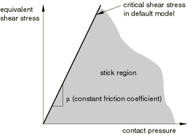

有两种方法可以在Abaqus中定义基本Coulomb摩擦模型。在默认模型中，摩擦系数被定义为等效滑移率和接触压力的函数。或者，您可以直接指定静摩擦系数和动摩擦系数。

#### 使用默认模型

在默认模型中，您直接定义摩擦系数为


其中是等效滑移率，*p*是接触压力，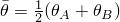是接触点处的平均温度，是接触点处预定义的平均场变量。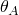、、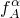和是表面上点*A*和点*B*处的温度和预定义场变量。点*A*是从表面上的节点，点*B*对应于相对主表面上的最近点。温度和场变量沿表面在位置*B*处插值。如果主表面由刚体组成，则使用参考节点处的温度和场变量。

摩擦系数可以依赖于滑移率、接触压力、温度和场变量。默认情况下，假设摩擦系数不依赖于场变量。

摩擦系数可以设置为任何非负值。零摩擦系数意味着不会产生剪切力，接触表面可以自由滑动。对于这种情况，您不需要定义摩擦模型。

| **输入文件用法：** | ``` [*FRICTION*](../key/key-link.md#usb-kws-hfriction), DEPENDENCIES=*n* , , *p*, ,  ``` |
| --- | --- |

| **Abaqus/CAE用法：** | 相互作用模块：接触属性编辑器：****机械********切向行为****：**摩擦公式：惩罚**：**摩擦** |
| --- | --- |
| | 如有必要，切换****使用滑移率相关数据****、****使用接触压力相关数据****和/或****使用温度相关数据****；和/或除滑移率、接触压力和温度外，还指定****场变量依赖数量****。 |

#### 指定静摩擦系数和动摩擦系数

实验数据表明，阻止从粘附状态开始滑动的摩擦系数与阻止已建立滑动的摩擦系数不同。前者通常被称为"静"摩擦系数，后者被称为"动"摩擦系数。通常，静摩擦系数高于动摩擦系数。

在默认模型中，静摩擦系数对应于零滑移率给出的值，动摩擦系数对应于最高滑移率给出的值。静摩擦和动摩擦之间的过渡由中间滑移率给出的值定义。在此模型中，静摩擦系数和动摩擦系数可以是接触压力、温度和场变量的函数。

Abaqus还提供了一种直接指定静摩擦系数和动摩擦系数的模型。在此模型中，假设摩擦系数根据以下公式从静值指数衰减到动值：

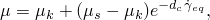

其中是动摩擦系数，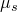是静摩擦系数，是用户定义的衰减系数，是滑移率（见Oden, J. T. and J. A. C. Martins, 1985）。此模型只能与各向同性摩擦一起使用，不允许依赖于接触压力、温度或场变量。有两种方法定义此模型。

##### 直接提供静摩擦、动摩擦和衰减系数

您可以直接提供静摩擦系数、动摩擦系数和衰减系数（见图37.1.5-2）。

**图37.1.5-2** 指数衰减摩擦模型。


| **输入文件用法：** | ``` [*FRICTION*](../key/key-link.md#usb-kws-hfriction), EXPONENTIAL DECAY , ,  ``` |
| --- | --- |

| **Abaqus/CAE用法：** | 相互作用模块：接触属性编辑器：****机械********切向行为****：**摩擦公式：静-动指数衰减**：**摩擦**，**定义：系数** |
| --- | --- |

##### 使用测试数据拟合指数模型

或者，您可以提供测试数据点来拟合指数模型。必须提供至少两个数据点。第一个点表示在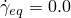处指定的静摩擦系数，第二个点（, 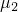)（如图37.1.5-3所示）对应于在参考滑移率处进行的实验测量。可以指定一个额外的数据点来表征指数衰减。如果省略此额外数据点，Abaqus将自动提供一个第三数据点（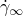, 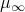）来模拟在无限速度下摩擦系数的假设渐近值。在这种情况下，的选择使得。

| **输入文件用法：** | ``` [*FRICTION*](../key/key-link.md#usb-kws-hfriction), EXPONENTIAL DECAY, TEST DATA  ,   ``` |
| --- | --- |

| **Abaqus/CAE用法：** | 相互作用模块：接触属性编辑器：****机械********切向行为****：**摩擦公式：静-动指数衰减**：**摩擦**，**定义：测试数据** |
| --- | --- |

**图37.1.5-3** 用测试数据点指定的指数衰减摩擦模型。

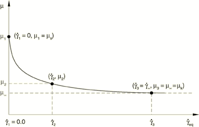

### 使用可选的剪切应力极限

您可以指定可选的等效剪切应力极限，使得无论接触压力应力的大小如何，当等效剪切应力的大小达到此值时就会发生滑动（见图37.1.5-4）。不允许使用零值。

**图37.1.5-4** 具有临界剪切应力极限的摩擦模型的滑移区域。

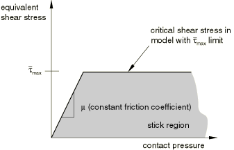

这个剪切应力极限通常在接触压力应力可能变得非常大的情况下引入（如在某些制造过程中可能发生的），这导致Coulomb理论在界面上提供超过接触表面下方材料屈服应力的临界剪切应力。的合理上限估计是，其中是表面相邻材料的Mises屈服应力；但是，经验数据是的最佳来源。

| **输入文件用法：** | ``` [*FRICTION*](../key/key-link.md#usb-kws-hfriction), TAUMAX= ``` |
| --- | --- |

| **Abaqus/CAE用法：** | 相互作用模块：接触属性编辑器：****机械********切向行为****：**摩擦公式：惩罚**或**Lagrange乘数**：**剪切应力**，**剪切应力极限：指定：** |
| --- | --- |

#### 剪切应力极限的限制

在Abaqus/Explicit中，当接触对使用基于节点的表面作为表面之一时，不能使用剪切应力极限。

### 在Abaqus/Standard中使用各向异性摩擦模型

Abaqus/Standard中可用的各向异性摩擦模型允许接触表面上两个正交方向上具有不同的摩擦系数。这些正交方向与在["Abaqus/Standard中的接触公式，" 第38.1.1节"](pt09ch38s01aus177.md)中定义的局部切向方向一致；接触单元的局部切向方向在定义这些单元的接触建模的章节中描述。局部切向方向的方向无法更改。

如果您指示应使用各向异性摩擦模型，则必须指定两个摩擦系数，其中是第一个局部切向方向上的摩擦系数，是第二个局部切向方向上的摩擦系数。

临界剪切应力曲面（见图37.1.5-5）是–空间中的一个椭圆，两个极值点为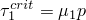和。这个椭圆的大小将随表面之间接触压力的变化而变化。滑移方向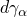与临界剪切应力曲面正交。

**图37.1.5-5** 各向异性摩擦模型的临界剪切应力曲面。


摩擦系数可以依赖于滑移率、接触压力、温度和场变量。默认情况下，假设摩擦系数不依赖于场变量。

| **输入文件用法：** | ``` [*FRICTION*](../key/key-link.md#usb-kws-hfriction), ANISOTROPIC, DEPENDENCIES=*n* , , , *p*, ,  ``` |
| --- | --- |

| **Abaqus/CAE用法：** | 相互作用模块：接触属性编辑器：****机械********切向行为****：**摩擦公式：惩罚**：**摩擦**，**方向性：各向异性** |
| --- | --- |
| | 如有必要，切换****使用滑移率相关数据****、****使用接触压力相关数据****和/或****使用温度相关数据****；和/或除滑移率、接触压力和温度外，还指定****场变量依赖数量****。 |

### 无论接触压力如何都防止滑动

Abaqus提供了指定无限摩擦系数（）的选项。这种类型的表面相互作用被称为"粗糙"摩擦，使用它可以防止两个接触表面之间的所有相对滑动（除了与惩罚施加相关的"弹性滑移"的可能性），只要相应的法向接触约束处于活跃状态。在大多数情况下，Abaqus/Standard使用惩罚方法来施加这些切向约束；但是，如果相应的法向约束具有直接施加的"硬接触"或指数压力-闭合行为，则在一般（非扰动）分析步骤中使用Lagrange乘数方法。Abaqus/Explicit使用运动学方法或惩罚方法，具体取决于所选的接触公式。

粗糙摩擦适用于非间歇性接触；一旦表面闭合并经历粗糙摩擦，它们应保持闭合。如果具有粗糙摩擦的闭合接触界面打开，可能会出现收敛困难，特别是在已形成大剪切应力的情况下。粗糙摩擦模型通常与表面法向的"不分离"接触压力-闭合关系结合使用（见["接触压力-闭合关系"中的"使用不分离关系"， 第37.1.2节"](pt09ch37s01aus166.md#usb-cni-anormalinteraction-nosep)），这禁止表面在闭合后分离。

当在Abaqus/Explicit中为硬接触指定粗糙摩擦与不分离关系且使用运动学接触方法时，表面之间不会发生相对运动。对于使用惩罚接触方法在Abaqus/Explicit中指定的硬接触，相对运动将限于与施加的惩罚力对接触约束的近似满足相对应的弹性滑移和穿透。当在Abaqus/Explicit中指定软化切向行为时（见下面的["在Abaqus/Explicit中定义切向软化"](pt09ch37s01aus169.md#usb-cni-afriction-tangsoftening)"），相对表面运动将受指定软化行为控制。

| **输入文件用法：** | ``` [*FRICTION*](../key/key-link.md#usb-kws-hfriction), ROUGH ``` |
| --- | --- |

| **Abaqus/CAE用法：** | 相互作用模块：接触属性编辑器：****机械********切向行为****：**摩擦公式：粗糙** |
| --- | --- |

### 粘附时的剪切应力与弹性滑移

在某些情况下，即使摩擦模型确定当前摩擦状态为"粘附"，也可能发生一些增量滑移。换句话说，在"粘附"状态下，剪切（摩擦）应力与总滑移关系曲线的斜率可能是有限的，如图37.1.5-6所示。

**图37.1.5-6** 粘附和滑动摩擦的弹性滑移与剪切牵引力关系。

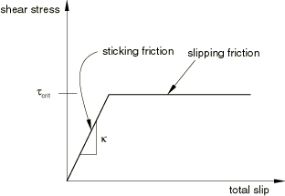

此图中显示的关系类似于无强化的弹塑性材料行为：对应于杨氏模量，对应于屈服应力；粘附摩擦对应于弹性状态，滑动摩擦对应于塑性状态。粘附刚度的有限值可能反映用户指定的物理行为，也可能是约束施加方法的特征。

在Abaqus/Standard中默认情况下和Abaqus/Explicit中的一般接触算法中，摩擦约束通过刚度（惩罚方法）施加；在这种情况下，粘附刚度将具有有限值。通过在Abaqus/Standard中施加摩擦约束的可选Lagrange乘数方法或在Abaqus/Explicit中的运动学约束方法（仅适用于接触对），可以实现无限粘附刚度，在这种情况下弹性滑移始终为零。在Abaqus/Explicit中，默认情况下有一些切向接触阻尼作用在弹性滑移率上，如["接触阻尼，" 第37.1.3节"](pt09ch37s01aus167.md)中所讨论。反映物理行为的切向软化仅在Abaqus/Explicit中可用。

#### 在Abaqus/Explicit中定义切向软化

要在Abaqus/Explicit中激活软化切向行为，请指定剪切应力与弹性滑移关系曲线的斜率（在图37.1.5-6中）。用户子程序[`VFRIC`](../sub/sub-link.md#sub-xsl-vfric)不能与软化切向行为结合使用。

| **输入文件用法：** | ``` [*FRICTION*](../key/key-link.md#usb-kws-hfriction), SHEAR TRACTION SLOPE= ``` |
| --- | --- |

| **Abaqus/CAE用法：** | 相互作用模块：接触属性编辑器：****机械********切向行为****：**摩擦公式：惩罚**或**静-动****指数衰减**：**弹性滑移**，**指定：** |
| --- | --- |

#### 在Abaqus/Standard中施加摩擦约束的刚度方法

Abaqus/Standard中用于摩擦的刚度方法是一种惩罚方法，当表面应该粘附时，允许表面发生一些相对运动（"弹性滑移"）（类似于在Abaqus/Explicit中用软化切向行为定义的允许弹性滑移）。当表面粘附时（即），滑移的大小被限制在这个弹性滑移内。Abaqus持续调整惩罚约束的大小来强制执行此条件。

Abaqus/Standard中的刚度方法需要选择允许的弹性滑移。在模拟中使用较大的会加快解的收敛速度，但会牺牲解的准确性（当表面应该粘附时，它们之间会有更大的相对运动）。通过只允许一个很小的，可以更准确地近似不允许粘附状态下滑移的行为。如果选择得非常小，可能会出现收敛问题；在这种情况下，最好使用Lagrange乘数方法来施加粘附约束（见本节后面的["在Abaqus/Standard中施加摩擦约束的Lagrange乘数方法"](pt09ch37s01aus169.md#usb-cni-afriction-lagrangemult)")。

Abaqus/Standard使用的允许弹性滑移的默认值通常非常有效，在效率和准确性之间提供了保守的平衡。Abaqus/Standard将计算为"特征接触表面长度"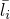的一小部分，并在计算时扫描所有从表面的所有面元。如果您请求接触约束信息的详细打印输出（见["输出"中的"控制写入数据文件的分析输入文件处理器信息量"第4.1.1节"](pt02ch04s01aus38.md#usb-out-ooutput-data-control)），Abaqus/Standard会在数据（`.dat`）文件中报告每个接触对使用的值。允许的弹性滑移给出为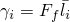，其中是滑移容差；默认值为0.005。

这种计算允许弹性滑移的方法用于Abaqus/Standard中的所有分析程序，稳态传输分析（["稳态传输分析，" 第6.4.1节"](pt03ch06s04at17.md)）除外，其中惩罚约束基于最大允许滑移率。最大滑移率计算为


其中是角旋转速率，*R*是滚动结构的半径。

##### 默认弹性滑移值可能不合适的情况

在某些情况下，允许弹性滑移的默认值可能不合适。例如，由基于节点的表面或某些接触单元类型（如GAPUNI单元）定义的从表面没有物理尺寸，Abaqus/Standard无法估计值。对于仅包含基于节点的表面或这些类型接触单元的模型，Abaqus/Standard首先尝试使用模型中其他接触对的"特征接触表面长度"。如果没有，它使用模型中的所有单元计算并发出警告消息。如果模型不包含可确定特征长度的单元（例如，如果它只包含子结构），Abaqus/Standard没有信息来计算。因此，它使用值1.0并发出警告消息。如果接触表面面元尺寸变化很大，的平均值可能对某些接触表面不合理。然后应该为具有更小"特征面元尺寸"的表面直接指定弹性滑移。

有两种方法可以修改允许的弹性滑移。一种方法是直接指定；另一种方法是指定滑移容差。某些分析仅在特定步骤中要求非默认的或（见上面的["在Abaqus/Standard分析过程中更改摩擦属性"](pt09ch37s01aus169.md#usb-cni-afriction-change-std)）。

##### 直接指定允许的弹性滑移

您可以直接提供的绝对大小。指定一个合理的值，表示表面实际开始滑动之前可能发生的相对位移。通常，允许的弹性滑移被设置为"特征接触表面面元尺寸"的一小部分（102–104）。在稳态传输分析中，您可以定义最大允许粘性滑移率。

指定的允许弹性滑移将仅用于引用包含摩擦定义的接触属性定义的接触对。例如，三个表面`ASURF`、`BSURF`和`CSURF`形成两个接触对，每个接触对引用自己的接触属性定义，如下所示。

| 接触对 | 接触属性 |  |
| --- | --- | --- |
| `ASURF, BSURF` | `DEFAULT` |  |
| `CSURF, BSURF` | `NONDEF` | 0.1 |

在`DEFAULT`接触属性定义中，没有指定。在`NONDEF`接触属性定义中，为指定了值0.1，这将用作`CSURF`和`BSURF`之间摩擦相互作用的允许弹性滑移。

| **输入文件用法：** | ``` [*FRICTION*](../key/key-link.md#usb-kws-hfriction), ELASTIC SLIP= ``` |
| --- | --- |

| **Abaqus/CAE用法：** | 相互作用模块：接触属性编辑器：****机械********切向行为****：**摩擦公式：惩罚**或**静-动****指数衰减**：**弹性滑移**，**绝对距离：** |
| --- | --- |

##### 更改默认滑移容差

您可以更改滑移容差的默认值。如果目标是提高计算效率，则更改默认弹性滑移的这种方法很方便，这种情况下应给出大于默认值0.005的值；如果目标是提高准确性，则应给出小于默认值的值。

| **输入文件用法：** | ``` [*FRICTION*](../key/key-link.md#usb-kws-hfriction), SLIP TOLERANCE= ``` |
| --- | --- |

| **Abaqus/CAE用法：** | 相互作用模块：接触属性编辑器：****机械********切向行为****：**摩擦公式：惩罚**或**静-动****指数衰减**：**弹性滑移**，**特征表面尺寸的分数：** |
| --- | --- |

#### 在Abaqus/Explicit中施加摩擦约束的刚度方法

Abaqus/Explicit中与一般接触算法一起使用摩擦的刚度方法，以及在Abaqus/Explicit中与接触对方法一起可选使用的刚度方法，是一种惩罚方法，当表面应该粘附时，允许表面发生一些相对运动（"弹性滑移"）（类似于在Abaqus/Explicit中用软化切向行为定义的允许弹性滑移）。当表面粘附时（即），滑移的大小被限制在这个弹性滑移内。Abaqus持续调整惩罚约束的大小来强制执行此条件。

在Abaqus/Explicit中，您可以选择使用惩罚方法强制执行接触对算法的接触约束；一般接触算法始终使用惩罚方法（见["Abaqus/Explicit中的接触约束施加方法，" 第38.2.3节"](pt09ch38s02aus182.md)）。

摩擦约束的默认惩罚刚度由Abaqus/Explicit自动选择，与用于法向硬接触约束的惩罚刚度相同。法向的软化不影响用于强制粘附条件的惩罚刚度。如果指定了切向软化（见上面的["在Abaqus/Explicit中定义切向软化"](pt09ch37s01aus169.md#usb-cni-afriction-tangsoftening)"），惩罚刚度将等于为剪切应力与弹性滑移关系斜率指定的值。如["Abaqus/Explicit中一般接触的接触控制，" 第36.4.5节"](pt09ch36s04aus159.md)和["Abaqus/Explicit中接触对的接触控制，" 第36.5.5节"](pt09ch36s05aus164.md)中所讨论，您可以指定缩放因子来调整惩罚刚度。

#### 在Abaqus/Standard中施加摩擦约束的Lagrange乘数方法

在Abaqus/Standard中，可以通过使用Lagrange乘数实现精确施加两个表面之间界面处的粘附约束。使用这种方法，在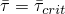之前，闭合表面之间没有相对运动。然而，Lagrange乘数通过向模型添加更多自由度并通常增加获得收敛解所需的迭代次数来增加分析的计算成本。Lagrange公式甚至可能阻止解的收敛，特别是在许多点在粘附和滑动条件之间迭代的情况下。这种影响特别可能在局部存在滑动/粘附条件与接触应力之间强烈相互作用时发生。

由于使用Lagrange摩擦公式的附加成本，它应该只在解的粘附/滑动行为解析至关重要的问题中使用，例如两个体之间的磨蚀建模。在典型的金属成型应用或橡胶部件接触中，粘附/滑动行为的准确解析并不重要，不足以证明使用Lagrange乘数公式的附加成本是合理的。

| **输入文件用法：** | ``` [*FRICTION*](../key/key-link.md#usb-kws-hfriction), LAGRANGE ``` |
| --- | --- |

| **Abaqus/CAE用法：** | 相互作用模块：接触属性编辑器：****机械********切向行为****：**摩擦公式：Lagrange乘数** |
| --- | --- |

#### 在Abaqus/Explicit中施加摩擦约束的运动学方法

默认情况下，Abaqus/Explicit中的接触对算法使用运动学方法来施加摩擦约束（见["Abaqus/Explicit中的接触约束施加方法，" 第38.2.3节"](pt09ch38s02aus182.md)）。运动学方法以与Abaqus/Standard中可选Lagrange乘数方法类似的方式施加粘附约束；但是，算法是不同的。首先使用与节点关联的质量、节点滑移的距离、时间增量来计算在节点处强制粘附所需的力；另外对于软化接触，还有弹性滑移的当前值和弹性滑移与剪切应力斜率的当前值。对于硬接触，此粘附力是保持节点在预测配置中相对于对立表面的位置所需的力。对于软化接触，此力与用户为剪切应力与弹性滑移关系斜率指定的值一致。使用与节点关联的质量、节点滑移的距离、剪切牵引-弹性滑移斜率（如果在切向方向指定了软化接触）和时间增量来计算每个节点的粘附力。如果使用此力计算的节点处剪切应力小于，则认为节点处于粘附状态，并将此力以相反方向施加到每个表面。如果剪切应力超过，则表面正在滑动，并施加对应于的力。在任一情况下，力都会在从节点处产生相对于表面的切向加速度校正，以及主表面面元的节点或它所接触的解析刚性表面上的点。

### 用户定义的摩擦模型

当Abaqus提供的摩擦行为不够时，您可以通过用户子程序定义接触表面之间的剪切应力。剪切应力可以定义为滑移、滑移率、温度和场变量等许多变量的函数。您还可以引入许多与摩擦用户子程序中更新的解决方案相关的状态变量。您可以声明与摩擦模型关联的属性或常数，并在用户子程序中使用这些值。

除了摩擦用户子程序外，还有可用于定义表面之间完整机械相互作用的子程序，包括法向相互作用以及切向方向的摩擦行为；有关更多信息，请参阅["用户定义的界面本构行为，" 第37.1.6节"](pt09ch37s01aus170.md)。

#### 定义通用摩擦行为

您可以使用Abaqus/Standard中的用户子程序[`FRIC`](../sub/sub-link.md#sub-xsl-fric)定义接触表面之间的通用摩擦行为。在Abaqus/Explicit中，接触对的通用摩擦行为在用户子程序[`VFRIC`](../sub/sub-link.md#sub-xsl-vfric)中定义，而一般接触的通用摩擦行为在用户子程序[`VFRICTION`](../sub/sub-link.md#sub-xsl-vfriction)中定义。

| **输入文件用法：** | 使用以下选项用用户子程序[`FRIC`](../sub/sub-link.md#sub-xsl-fric)或[`VFRIC`](../sub/sub-link.md#sub-xsl-vfric)定义摩擦行为： |
| --- | --- |
| | ``` [*FRICTION*](../key/key-link.md#usb-kws-hfriction), USER, DEPVAR=*n*, PROPERTIES=*p* ``` 使用以下选项用用户子程序[`VFRICTION`](../sub/sub-link.md#sub-xsl-vfriction)定义摩擦行为： ``` [*FRICTION*](../key/key-link.md#usb-kws-hfriction), USER=FRICTION, DEPVAR=*n*, PROPERTIES=*p* ``` |

| **Abaqus/CAE用法：** | 使用以下选项用用户子程序[`FRIC`](../sub/sub-link.md#sub-xsl-fric)或[`VFRIC`](../sub/sub-link.md#sub-xsl-vfric)定义摩擦行为： |
| --- | --- |
| | 相互作用模块：接触属性编辑器：****机械********切向行为****：**摩擦公式：用户定义**，**状态相关变量数量**：*n*，**摩擦属性** Abaqus/CAE不支持用户子程序[`VFRICTION`](../sub/sub-link.md#sub-xsl-vfriction)。 |

#### 定义复杂各向同性摩擦

当摩擦系数的表达式可以明确表示时，Abaqus提供了一种指定复杂各向同性摩擦行为的简单方法。您只需要指定摩擦系数，Abaqus将计算由此产生的摩擦力。Abaqus/Standard提供用户子程序[`FRIC_COEF`](../sub/sub-link.md#sub-xsl-fric_coef)，Abaqus/Explicit提供用户子程序[`VFRIC_COEF`](../sub/sub-link.md#sub-xsl-vfric_coef)用于此目的。[`VFRIC_COEF`](../sub/sub-link.md#sub-xsl-vfric_coef)只能与一般接触一起使用。

| **输入文件用法：** | ``` [*FRICTION*](../key/key-link.md#usb-kws-hfriction), USER=COEFFICIENT, PROPERTIES=*p* ``` |
| --- | --- |

| **Abaqus/CAE用法：** | Abaqus/CAE不支持用户子程序[`FRIC_COEF`](../sub/sub-link.md#sub-xsl-fric_coef)和[`VFRIC_COEF`](../sub/sub-link.md#sub-xsl-vfric_coef)。 |
| --- | --- |

### 在Abaqus/Explicit中考虑壳和梁厚度偏移的增量旋转

默认情况下，在Abaqus/Explicit中，摩擦的滑移增量计算不考虑壳和梁厚度偏移的增量旋转，摩擦约束也不对由于壳或梁厚度而偏移于接触界面的节点施加力矩。可以修改一般接触的此行为；有关详细信息，请参阅["Abaqus/Explicit中一般接触的接触控制"中的"摩擦接触中考虑壳和梁厚度偏移的增量旋转"第36.4.5节"](pt09ch36s04aus159.md#usb-cni-acontactcontrolsassign-consider)。

### 改进包含表面摩擦相互作用的Abaqus/Standard模拟

表面摩擦相互作用的几个特征可以对Abaqus/Standard模拟中的收敛速率产生强烈影响。

#### 方程组中的非对称项

当表面相对滑动时，摩擦约束会产生非对称项。如果摩擦应力对整体位移场有很大影响，并且摩擦应力的大小高度依赖于解，则这些项对收敛速率有很大影响。如果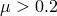或者如果依赖于压力，Abaqus/Standard将自动使用非对称解方案。如果需要，您可以关闭非对称解方案；请参阅["定义分析"中的"Abaqus/Standard中的矩阵存储和解决方案"第6.1.2节"](pt03ch06s01abo05.md#usb-anl-unsymm)。

粗糙摩擦不会发生滑移；刚度的贡献将是完全对称的，默认情况下Abaqus/Standard将使用对称解方案。

### 由表面摩擦相互作用产生的热量

在全耦合温度-位移分析和全耦合热-电-结构分析中，所有耗散的机械（摩擦）能量默认情况下会转化为热量并平均分配给两个表面。可以修改此行为；有关此和其他热表面相互作用的详细信息，请参阅["热接触属性，" 第37.2.1节"](pt09ch37s02aus174.md)。

### 结构单元摩擦属性的温度和场变量依赖性

梁和壳单元中的温度和场变量分布通常可以包括单元横截面的梯度。这些单元之间的接触发生在参考表面；因此，在确定依赖于这些变量的摩擦属性时，不考虑单元中的温度和场变量梯度。

### 与摩擦相关的表面相互作用变量

Abaqus提供在使用包含摩擦属性的表面相互作用模型的从表面上的点的剪切应力输出。剪切应力CSHEAR1和CSHEAR2以两个正交局部切向方向给出，这些方向是在主表面上构建的（见["Abaqus/Standard中的接触公式，" 第38.1.1节"](pt09ch38s01aus177.md)）。在二维问题中只有一个局部切向方向。关于请求接触表面变量输出的详细信息，请参阅["在Abaqus/Standard中定义接触对，" 第36.3.1节"](pt09ch36s03aus145.md)和["在Abaqus/Explicit中定义接触对，" 第36.5.1节"](pt09ch36s05aus160.md)。

这些变量的等值线图也可以在Abaqus/CAE中绘制。

#### 附加参考

- Oden, J. T., and J. A. C. Martins, "Models and Computational Methods for Dynamic Friction Phenomena," Computer Methods in Applied Mechanics and Engineering, vol. 52, pp. 527--634, 1985.


