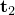

# 37.1.6 用户定义的界面本构行为


**产品：** Abaqus/Standard  Abaqus/Explicit

##### **参考**

- ["UINTER，" Abaqus用户子程序参考指南第1.1.39节"](../sub/sub-link.md#sub-rtn-uuinter)
- ["VUINTER，" Abaqus用户子程序参考指南第1.2.18节"](../sub/sub-link.md#sub-rtn-uexpinter)
- ["VUINTERACTION，" Abaqus用户子程序参考指南第1.2.19节"](../sub/sub-link.md#sub-rtn-uexpuinteraction)
- [*SURFACE INTERACTION*](../key/key-link.md#usb-kws-hsurfaceinteraction)

### 概述

用户定义的界面本构行为：
- 提供此功能以便可以将任何跨界面的本构行为添加到现有模型库（如软化接触和Coulomb摩擦）；
- 要求在用户子程序[`UINTER`](../sub/sub-link.md#sub-xsl-uinter)中为接口编写本构模型（或模型库）；
- 要求在Abaqus/Explicit中使用接触对算法时在用户子程序[`VUINTER`](../sub/sub-link.md#sub-xsl-vuinter)中为接口编写本构模型（或模型库）；
- 要求在Abaqus/Explicit中使用一般接触算法时在用户子程序[`VUINTERACTION`](../sub/sub-link.md#sub-xsl-vuinteraction)中为接口编写本构模型（或模型库）；
- 仅适用于应力/位移、耦合温度-位移、耦合热-电-结构或热传递分析中涉及的基于表面的接触定义；和
- 需要相当大的努力和专业知识：此功能非常通用和强大，但它面向高级用户。

### 用户子程序[`UINTER`](../sub/sub-link.md#sub-xsl-uinter)、[`VUINTER`](../sub/sub-link.md#sub-xsl-vuinter)和[`VUINTERACTION`](../sub/sub-link.md#sub-xsl-vuinteraction)的目的

用户子程序[`UINTER`](../sub/sub-link.md#sub-xsl-uinter)、[`VUINTER`](../sub/sub-link.md#sub-xsl-vuinter)和[`VUINTERACTION`](../sub/sub-link.md#sub-xsl-vuinteraction)为您提供了一个非常通用的界面来定义两个表面之间界面的本构行为。这些子程序替换所有内置界面本构行为模型；因此，不能与它们一起指定其他接触属性定义（如摩擦、热传导等）。

在应力/位移分析中，您必须在当前时间点在从节点（或从表面上的点）处定义法向和切向应力。在耦合温度-位移分析和耦合热-电-结构分析中，您还必须定义跨界面的热通量。因此，本构计算涉及基于从节点相对于主表面的相对位置增量（在这些情况下充当应变）、表面温度和预定义场变量来计算应力和热通量。计算通常涉及解决方案相关的状态变量，这些变量可以在这些例程内更新。如果阻尼要包含在界面本构模型中，则必须在应力定义中包含阻尼贡献。

当使用用户子程序定义界面本构行为时，关于从节点接触状态的所有决定必须基于提供的信息在子程序内做出。您可以根据从表面上的点相对于主表面的相对位置的值和适当定义的解决方案相关状态变量做出此类决定。因此，此功能的使用不仅涉及开发界面的本构行为，还涉及开发在从表面上给定点的接触处于活跃条件下的条件。界面始终被认为是无质量的。

用户子程序[`UINTER`](../sub/sub-link.md#sub-xsl-uinter)将在Abaqus/Standard分析的每次迭代中为受影响接触对的每个约束位置调用。此用户子程序的输入包括从表面上特定约束点相对于主表面对应最近点的当前相对位置，以及这两个点之间的增量相对运动。还提供作为输入的约束点在从表面上的温度和场变量值以及主表面对应最近点的温度和场变量值以及其他几个变量。除了定义接触应力或热通量外，还必须定义适当的Jacobian项以确保Abaqus/Standard中的适当收敛特性。

用户子程序[`VUINTER`](../sub/sub-link.md#sub-xsl-vuinter)在Abaqus/Explicit分析的每个时间增量中为受影响的接触对多次调用。在每次调用[`VUINTER`](../sub/sub-link.md#sub-xsl-vuinter)时处理所有从节点，而在每次调用[`UINTER`](../sub/sub-link.md#sub-xsl-uinter)时仅处理单个约束。向[`VUINTER`](../sub/sub-link.md#sub-xsl-vuinter)提供与[`UINTER`](../sub/sub-link.md#sub-xsl-uinter)类似的输入。

用户子程序[`VUINTERACTION`](../sub/sub-link.md#sub-xsl-vuinteraction)在Abaqus/Explicit分析的每个时间增量中为每个相互作用表面多次调用。在调用[`VUINTERACTION`](../sub/sub-link.md#sub-xsl-vuinteraction)时，以块的形式处理给定相互作用的潜在接触点。向[`VUINTERACTION`](../sub/sub-link.md#sub-xsl-vuinteraction)提供与[`VUINTER`](../sub/sub-link.md#sub-xsl-vuinter)类似的输入。

### 界面常数

您必须指定在用户子程序[`UINTER`](../sub/sub-link.md#sub-xsl-uinter)、[`VUINTER`](../sub/sub-link.md#sub-xsl-vuinter)或[`VUINTERACTION`](../sub/sub-link.md#sub-xsl-vuinteraction)中所需的界面常数数量；并且您必须为所有这些常数提供值。所有表面本构行为计算以及关于从节点（或所考虑从表面上点）接触状态的所有决定都必须在用户子程序中编程。如果分析中包含任何其他接触属性定义，则会报告错误。

| **输入文件用法：** | 对于通过用户子程序[`UINTER`](../sub/sub-link.md#sub-xsl-uinter)或[`VUINTER`](../sub/sub-link.md#sub-xsl-vuinter)定义的接触相互作用： |
| --- | --- |
| | ``` [*SURFACE INTERACTION*](../key/key-link.md#usb-kws-hsurfaceinteraction), USER, PROPERTIES=*number_of_material_constants* ``` 对于通过用户子程序[`VUINTERACTION`](../sub/sub-link.md#sub-xsl-vuinteraction)定义的接触相互作用： ``` [*SURFACE INTERACTION*](../key/key-link.md#usb-kws-hsurfaceinteraction), USER=INTERACTION, PROPERTIES=*number_of_material_constants* ``` |

### 使用[`VUINTER`](../sub/sub-link.md#sub-xsl-vuinter)或[`VUINTERACTION`](../sub/sub-link.md#sub-xsl-vuinteraction)时跟踪厚度

如果可以从节点容易地确定其与主表面的距离超过称为跟踪厚度的阈值距离（考虑所有厚度效应和内置接触属性模型），则避免进行到主表面的精确距离计算。Abaqus/Explicit使用跟踪厚度的内部默认值。如果内置接触属性模型有效，跟踪厚度非常小以帮助减少计算时间。但是，如果用户子程序[`VUINTER`](../sub/sub-link.md#sub-xsl-vuinter)或用户子程序[`VUINTERACTION`](../sub/sub-link.md#sub-xsl-vuinteraction)有效，默认跟踪厚度为无穷大，因此所有从节点都被提供给用户子程序作为具有潜在相互作用。或者，您可以结合用户定义的表面相互作用模型指定跟踪厚度。在这种情况下，靠近主表面在此厚度内的从节点可用于用户定义的相互作用。用户指定的跟踪厚度仅支持与节点-表面接触一起使用，不支持与边缘-边缘接触一起使用。

| **输入文件用法：** | ``` [*SURFACE INTERACTION*](../key/key-link.md#usb-kws-hsurfaceinteraction), USER=INTERACTION, TRACKING THICKNESS=*tracking_thickness* ``` |
| --- | --- |

### 界面状态

用于定义界面行为的本构模型可能需要存储与解决方案相关的状态变量。您必须通过指示变量数量来为这些变量分配存储空间。与用户定义的界面本构行为关联的状态变量数量没有限制。

用户子程序[`UINTER`](../sub/sub-link.md#sub-xsl-uinter)在每个增量的每次迭代中为从表面上的点调用。用户子程序[`VUINTER`](../sub/sub-link.md#sub-xsl-vuinter)在每个时间增量中为其影响的每个接触对的每个主-从视图调用，如前所述。用户子程序[`VUINTERACTION`](../sub/sub-link.md#sub-xsl-vuinteraction)在每个时间增量中为每个主动相互作用的表面对调用，如前所述。每个子程序在增量开始时提供从节点或潜在接触点的状态（状态包括应力、通量、解决方案相关状态变量、温度和任何预定义场变量），以及温度、预定义状态变量、相对位置和时间的增量。

| **输入文件用法：** | 使用以下选项为解决方案相关状态变量分配存储空间： |
| --- | --- |
| | ``` [*SURFACE INTERACTION*](../key/key-link.md#usb-kws-hsurfaceinteraction), DEPVAR=*number_of_state_variables* ``` |

### 与Abaqus/Standard中的非对称方程求解器一起使用

如果本构Jacobian矩阵不是对称的，您应该在Abaqus/Standard中调用非对称方程求解能力（见["定义分析，" 第6.1.2节"](pt03ch06s01abo05.md)）。

| **输入文件用法：** | ``` [*SURFACE INTERACTION*](../key/key-link.md#usb-kws-hsurfaceinteraction), USER, UNSYMM ``` |
| --- | --- |

### 在Abaqus/Standard中定义接触状态

除了定义本构行为外，在Abaqus/Standard中您还可以更新标志`LOPENCLOSE`、`LSTATE`和`LSDI`。当[`UINTER`](../sub/sub-link.md#sub-xsl-uinter)用于建模两个表面之间的标准接触时（类似于Abaqus中的默认硬接触），标志`LOPENCLOSE`很有用。它应设置为0表示开放状态，设置为1表示闭合状态。在分析开始时，在调用[`UINTER`](../sub/sub-link.md#sub-xsl-uinter)之前，它被设置为1。此标志从一次迭代到下一次迭代的变化将产生两个后果。如果已请求详细接触输出到消息文件（见["输出"中的"Abaqus/Standard消息文件"第4.1.1节"](pt02ch04s01aus38.md#usb-out-ooutput-message-std)），它将导致输出与接触状态变化相关的信息，并且它还将触发严重不连续迭代。标志`LSTATE`可用于在简单开放/闭合状态不适当的非标准情况下存储从表面点的当前接触状态。这种情况的一个例子是脱粘，其中可以定义三种不同的状态——完全粘合、部分粘合或脱粘、以及完全脱粘。您可以为每种状态分配一个整数，并相应地设置`LSTATE`。在分析开始时，在调用[`UINTER`](../sub/sub-link.md#sub-xsl-uinter)之前，`LSTATE`被设置为1。当使用此标志且它从一次迭代到下一次迭代发生变化时，您可以直接从用户子程序[`UINTER`](../sub/sub-link.md#sub-xsl-uinter)向消息文件（单元7）输出与状态变化相关的消息。提供标志`LPRINT`以允许您仅在请求详细接触输出到消息文件时才输出与接触状态变化相关的消息。在这种情况下，可以将`LSDI`标志设置为1以触发严重不连续迭代（此问题稍后详细讨论）。

标志`LOPENCLOSE`和`LSTATE`都可以使用的一个示例出现在两个表面之间脱粘的建模中。当表面处于从粘合到脱粘的过渡状态时，可以使用标志`LSTATE`，而标志`LOPENCLOSE`可以保持其原始值1。然而，一旦完全脱粘发生，两个表面之间的接触可以使用标准硬接触来建模。在这种情况下，可以将标志`LSTATE`设置为1，并使用标志`LOPENCLOSE`。每当这两个标志中的任何一个设置为1时，Abaqus/Standard假设它没有被使用。将这些标志从某个其他值更改为1不会导致与接触状态相关的输出或严重不连续迭代。同样，将这些标志从1更改为某个其他值也不会导致与接触状态相关的输出或严重不连续迭代。

如果未使用这些标志，除非您决定直接从[`UINTER`](../sub/sub-link.md#sub-xsl-uinter)输出不直接基于这些标志的消息，否则不会输出与接触状态变化相关的信息。

### Abaqus/Standard中的严重不连续迭代

Abaqus/Standard将迭代结束时接触状态与为该迭代假设的状态不同的迭代分类为严重不连续迭代。Abaqus/Standard对严重不连续迭代的处理在["定义分析"中的"Abaqus/Standard中的严重不连续"第6.1.2节"](pt03ch06s01abo05.md#usb-anl-aover-sdiconvert)中讨论。当您通过用户子程序[`UINTER`](../sub/sub-link.md#sub-xsl-uinter)定义界面本构行为且不使用`LOPENCLOSE`标志时，您有责任向Abaqus/Standard提供关于如何处理迭代的输入。在用户子程序[`UINTER`](../sub/sub-link.md#sub-xsl-uinter)中提供标志`LSDI`用于此目的。它在每次调用[`UINTER`](../sub/sub-link.md#sub-xsl-uinter)之前设置为0；您应该将其设置为1，以将当前迭代视为严重不连续迭代。如果使用了`LOPENCLOSE`标志，则该标志的值单独决定是否需要严重不连续迭代，并且忽略`LSDI`标志。

### 在Abaqus/Explicit中与接触一起使用

惩罚接触算法必须与用户子程序[`VUINTER`](../sub/sub-link.md#sub-xsl-vuinter)和[`VUINTERACTION`](../sub/sub-link.md#sub-xsl-vuinteraction)一起使用；请参阅["Abaqus/Explicit中的接触约束施加方法"中的"惩罚接触算法"第38.2.3节"](pt09ch38s02aus182.md#usb-cni-aexpcontactpairform-constraint-penalty)。

当使用[`VUINTER`](../sub/sub-link.md#sub-xsl-vuinter)并指定平衡主-从接触时（即，接触对加权因子不等于0.0或1.0），[`VUINTER`](../sub/sub-link.md#sub-xsl-vuinter)将为接触对中可用作从表面的每个表面调用。在施加之前，在[`VUINTER`](../sub/sub-link.md#sub-xsl-vuinter)中定义的力和通量将乘以主-从视图的权重值。

### 对Abaqus/Explicit中求解时间的影响

Abaqus/Explicit在稳定时间增量计算中考虑接触刚度和传导率。在用户子程序中指定与大接触刚度（例如，接触压力与穿透的斜率较大）和大接触传导率相对应的应力和通量，将导致稳定时间增量显著下降，从而增加求解时间。切向刚度和传导率由Abaqus/Explicit使用有限差分法确定。用户子程序[`VUINTER`](../sub/sub-link.md#sub-xsl-vuinter)对于引用的每个二维接触对的每个主-从视图，在每个增量中调用三次，对于引用的每个三维接触对，在每个增量中调用四次。用户子程序[`VUINTERACTION`](../sub/sub-link.md#sub-xsl-vuinteraction)对于引用的每个活动表面相互作用，在每个增量中调用四次。用户子程序首先使用实际配置调用，然后分别基于法向位移扰动、切向位移扰动和在三维情况下切向位移扰动的扰动配置调用（关于和方向如何定义的说明，请参阅Abaqus用户子程序参考指南中的["VUINTER，" 第1.2.18节"](../sub/sub-link.md#sub-rtn-uexpinter)和["VUINTERACTION，" 第1.2.19节"](../sub/sub-link.md#sub-rtn-uexpuinteraction)）。例如，接触刚度的每个分量计算为接触应力差除以相对位置差。您无法访问接触刚度和传导率的计算值，但可以控制模型的本构行为。为用户提供默认惩罚刚度（和传导率）值用于比较。超过默认惩罚值的接触刚度或传导率可以显著减小时间增量大小。默认惩罚刚度和传导率基于所有从节点都处于接触状态的假设。对于[`VUINTER`](../sub/sub-link.md#sub-xsl-vuinter)，如果只有一部分从节点处于接触状态，在某些情况下，与[`VUINTER`](../sub/sub-link.md#sub-xsl-vuinter)中报告的默认值相比，默认惩罚算法会分配更高的惩罚。

对状态变量的任何更改都会被忽略用于扰动调用。

对于[`VUINTER`](../sub/sub-link.md#sub-xsl-vuinter)，接触跟踪相关的额外CPU成本可能很大。由于在进入[`VUINTER`](../sub/sub-link.md#sub-xsl-vuinter)时接触状态未知，因此必须在每个增量中跟踪从表面上的所有节点。与Abaqus/Explicit中的接触模型相比，如果大部分从节点未参与接触，这可以显著增加分析成本。

对于[`VUINTERACTION`](../sub/sub-link.md#sub-xsl-vuinteraction)，只有当跟踪厚度相对于接触表面上的单元面元尺寸较大时，接触跟踪相关的额外CPU成本才可能很大。

### 与其他子程序一起使用

任何不处理跨界面本构行为的其他用户子程序都可以与[`UINTER`](../sub/sub-link.md#sub-xsl-uinter)、[`VUINTER`](../sub/sub-link.md#sub-xsl-vuinter)或[`VUINTERACTION`](../sub/sub-link.md#sub-xsl-vuinteraction)结合使用。

例如，用户子程序[`UMAT`](../sub/sub-link.md#sub-xsl-umat)和[`UMATHT`](../sub/sub-link.md#sub-xsl-umatht)可以与[`UINTER`](../sub/sub-link.md#sub-xsl-uinter)结合使用来定义接触表面下方材料的机械和热本构行为。用户子程序[`VUMAT`](../sub/sub-link.md#sub-xsl-vumat)可以与[`VUINTER`](../sub/sub-link.md#sub-xsl-vuinter)结合使用来定义接触表面下方材料的机械本构行为。但是，用户子程序[`FRIC`](../sub/sub-link.md#sub-xsl-fric)、[`GAPCON`](../sub/sub-link.md#sub-xsl-gapcon)和[`GAPELECTR`](../sub/sub-link.md#sub-xsl-gapelectr)（在Abaqus/Standard中可用于定义表面之间的机械、热和电相互作用）只能在与[`UINTER`](../sub/sub-link.md#sub-xsl-uinter)分开引用表面相互作用的条件下结合使用。相同的限制适用于与[`VUINTER`](../sub/sub-link.md#sub-xsl-vuinter)结合使用的用户子程序[`VFRIC`](../sub/sub-link.md#sub-xsl-vfric)，以及与[`VUINTERACTION`](../sub/sub-link.md#sub-xsl-vuinteraction)结合使用的用户子程序[`VFRICTION`](../sub/sub-link.md#sub-xsl-vfriction)或[`VFRIC_COEF`](../sub/sub-link.md#sub-xsl-vfric_coef)。

### 与接触控制一起使用

当在通过用户子程序[`UINTER`](../sub/sub-link.md#sub-xsl-uinter)定义本构行为的界面上使用时，接触控制将没有任何效果。

在Abaqus/Explicit中，可以为引用用户定义表面相互作用的接触对指定接触控制。对于用户子程序[`VUINTERACTION`](../sub/sub-link.md#sub-xsl-vuinteraction)，默认惩罚刚度参数包括任何指定的缩放因子；而对于用户子程序[`VUINTER`](../sub/sub-link.md#sub-xsl-vuinter)，缩放因子被忽略。

### 输出

在此功能涉及的分析中，大多数通常可用的标准输出变量都可用。

#### [`UINTER`](../sub/sub-link.md#sub-xsl-uinter)的输出

变量COPEN和CSLIP分别表示界面法向和切向的相对位置。基于表面的热相互作用变量SFDR包含由于摩擦耗散的总能量产生的热通量，而不是其中的一部分。这与在Abaqus/Standard中使用内置功能不同，SFDR可能只包含总摩擦耗散中一部分的热通量，具体取决于指定转换为热量的耗散能量分数。此外，基于表面的热相互作用变量WEIGHT（表示热通量（由摩擦滑动产生）在表面之间分配的加权因子）不适用于此功能。

可以为[`UINTER`](../sub/sub-link.md#sub-xsl-uinter)定义其他用户定义的输出变量，方法是通过解决方案相关状态变量（SDV）。

#### [`VUINTER`](../sub/sub-link.md#sub-xsl-vuinter)和[`VUINTERACTION`](../sub/sub-link.md#sub-xsl-vuinteraction)的输出

Abaqus/Explicit中的所有接触输出变量都将可用，除了点焊的输出（BONDSTAT和BONDLOAD）。

以下用户子程序变量将有助于相关的总能量变量：`sed`将有助于能量输出变量ALLSE；`sfd`将有助于ALLFD；`scd`将有助于ALLCD；`spd`将有助于ALLPD；`svd`将有助于ALLVD。

如果请求SFDR，`sfd`、`scd`、`spd`和`svd`也将用于计算界面处产生的热量（仅用于输出目的；产生的热量不会应用于模型）。机械能转换为热量的分数和两个表面之间热量分配的加权因子的默认值（分别为1.0和0.5）被使用。

与用户子程序关联的用户定义的解决方案相关状态变量不能输出到输出数据库（`.odb`）文件或结果（`.fil`）文件。


