# 37.2.1 热接触属性


**产品：** Abaqus/Standard  Abaqus/Explicit  Abaqus/CAE

##### **参考**

- ["接触相互作用分析概述，" 第36.1.1节"](pt09ch36s01abo33.md)
- ["用户定义的界面本构行为，" 第37.1.6节"](pt09ch37s01aus170.md)
- ["GAPCON，" Abaqus用户子程序参考指南第1.1.10节"](../sub/sub-link.md#sub-rtn-ugapcon)
- [*GAP*](../key/key-link.md#usb-kws-mgap)
- [*GAP CONDUCTANCE*](../key/key-link.md#usb-kws-mgapconduct)
- [*GAP HEAT GENERATION*](../key/key-link.md#usb-kws-mgapheatgener)
- [*GAP RADIATION*](../key/key-link.md#usb-kws-mgapradiation)
- [*INTERFACE*](../key/key-link.md#usb-kws-minterface)
- [*SURFACE INTERACTION*](../key/key-link.md#usb-kws-hsurfaceinteraction)
- ["创建相互作用属性，" Abaqus/CAE用户指南第15.12.2节"](../usi/usi-link.md#usi-itn-helptopic-createprop)

### 概述

物体表面的热相互作用：
- 可以包含在热传递问题中（["解耦热传递分析，" 第6.5.2节"](pt03ch06s05at18.md)；["全耦合热应力分析，" 第6.5.3节"](pt03ch06s05at19.md)；["全耦合热-电-结构分析，" 第6.7.4节"](pt03ch06s07at23.md)；和["耦合热-电分析，" 第6.7.3节"](pt03ch06s07at22.md)）；
- 可以涉及表面之间的传导热传递；
- 当表面被狭窄间隙分开时，可以涉及表面之间的辐射热传递；
- 在Abaqus/Standard中，可以涉及固体表面与流动流体之间边界层的对流热流；
- 可以涉及在全耦合热-机械或全耦合热-电-结构模拟中由摩擦功产生的热量；和
- 在Abaqus/Standard中，可以涉及在全耦合热-电和全耦合热-电-结构分析中由电流（Joule加热）产生的热量。

本节不讨论表面之间的一般辐射热传递。关于在Abaqus/Standard中建模此类问题的信息，请参阅["腔体辐射，" 第41.1.1节"](pt09ch41s01aus187.md)。这里描述的热接触属性模型适用于紧密接触或接触的物体。对于这些问题，间隙辐射可能比腔体辐射更有效和更稳健。

### 在接触属性定义中包含热属性

本节讨论的所有热属性——间隙传导、间隙辐射和间隙热产生——可以包含在基于表面和基于单元的接触的接触属性定义中。所有三种类型的热属性可以包含在相同的接触属性定义中。

两个表面之间的热接触属性模型也可以通过用户子程序[`UINTER`](../sub/sub-link.md#sub-xsl-uinter)、[`VUINTER`](../sub/sub-link.md#sub-xsl-vuinter)或[`VUINTERACTION`](../sub/sub-link.md#sub-xsl-vuinteraction)完全定义（见["用户定义的界面本构行为，" 第37.1.6节"](pt09ch37s01aus170.md)）。

| **输入文件用法：** | 对基于表面的接触使用以下选项： |
| --- | --- |
| | ``` [*SURFACE INTERACTION*](../key/key-link.md#usb-kws-hsurfaceinteraction), NAME=*name* [*GAP CONDUCTANCE*](../key/key-link.md#usb-kws-mgapconduct) [*GAP RADIATION*](../key/key-link.md#usb-kws-mgapradiation) [*GAP HEAT GENERATION*](../key/key-link.md#usb-kws-mgapheatgener) ``` 对Abaqus/Standard中基于单元的接触使用以下选项： ``` [*INTERFACE*](../key/key-link.md#usb-kws-minterface) or [*GAP*](../key/key-link.md#usb-kws-mgap), ELSET=*name* [*GAP CONDUCTANCE*](../key/key-link.md#usb-kws-mgapconduct) [*GAP RADIATION*](../key/key-link.md#usb-kws-mgapradiation) [*GAP HEAT GENERATION*](../key/key-link.md#usb-kws-mgapheatgener) ``` 对用户定义的基于表面的接触使用以下选项： ``` [*SURFACE INTERACTION*](../key/key-link.md#usb-kws-hsurfaceinteraction), USER ``` |

| **Abaqus/CAE用法：** | 相互作用模块：接触属性编辑器：****热********热传导****、****热产生****和/或****辐射**** |
| --- | --- |
| | Abaqus/CAE不支持基于单元的接触和用户定义的基于表面的接触。 |

### Abaqus/Explicit中的热接触考虑

在Abaqus/Explicit中，间隙传导和间隙辐射使用与机械接触相互作用惩罚方法类似的显式算法强制执行。因此，间隙传导和间隙辐射可以影响稳定性条件；尽管在全耦合温度-位移分析中，系统的机械部分通常控制整体稳定性条件（见["全耦合热应力分析，" 第6.5.3节"](pt03ch06s05at19.md)）。非常大的间隙传导或间隙辐射值可能导致稳定时间增量减少，Abaqus/Explicit中的自动时间增量算法将考虑这一点。

间隙热产生在用于强制执行机械接触约束的算法（运动学或惩罚）中应用。间隙热产生对稳定时间增量没有影响。

如果在机械接触约束运动学强制执行期间发生网格自适应，热接触通量可能在增量期间不准确，因为网格调整发生在Abaqus/Explicit中运动学接触的机械接触状态确定和热接触通量计算之间。例如，自适应的网格调整可能导致接触压力的不连续：对于依赖于压力的间隙传导，间隙传导系数将基于网格调整前运动学接触算法确定的压力设置，即使热接触通量在网格调整后应用。这种不准确性对解的重要性将取决于网格调整的大小和频率以及传导系数的变化程度。可以通过用惩罚方法强制执行机械接触约束来避免这种不准确性。

一般接触的热接触与接触对的热接触类似。间隙传导、间隙辐射和间隙热产生都可以通过接触属性分配在一般接触定义中指定和包含。如上所述，大的间隙传导或间隙辐射值可能导致性能下降，特别是因为一般接触通常比接触对涉及更多的表面。不能为涉及边缘-边缘接触或Eulerian单元的一般接触指定热接触属性。当使用壳单元定义接触对定义中涉及的表面时，热接触属性被忽略。在这些情况下应使用一般接触。

### 建模表面之间的电导

假设接触表面之间的传导热传递定义为


其中*q*是从一个表面上的点*A*到另一个表面上点*B*穿过界面的单位面积热通量，和是表面上点的温度，*k*是间隙电导。点*A*是从表面上的节点；点*B*是接触从属节点的主表面上的位置，或者如果表面不接触，则是主表面上表面法向与从属节点相交的位置。

您可以直接定义*k*，或者在Abaqus/Standard中在用户子程序[`GAPCON`](../sub/sub-link.md#sub-xsl-gapcon)中定义。

#### 直接定义间隙电导

当直接定义*k*时，将其定义为


其中

*d*

是*A*和*B*之间的间隙，

*p*

是穿过*A*和*B*之间界面的接触压力，


是*A*和*B*处表面温度的平均值，

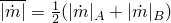

是*A*和*B*处接触表面单位面积质量流率大小的平均值（此变量在Abaqus/Explicit分析中不考虑），和

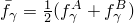

是*A*和*B*处任何预定义场变量的平均值。

##### 将间隙电导定义为间隙的函数

您可以创建一个数据表来定义*k*对上述变量的依赖关系。Abaqus中的默认设置是使*k*成为间隙*d*的函数。当*k*是间隙间隙*d*的函数时，表格数据必须从零间隙（闭合间隙）开始，并随着*d*增加定义*k*。必须给出至少两对点来将*k*定义为间隙的函数。*k*的值在最后一个数据点之后立即降为零，因此当间隙大于与最后一个数据点对应的值时没有热传导。如果间隙电导也未定义为接触压力的函数，则*k*将对所有压力保持恒定的零间隙值，如图37.2.1-1(a)所示。

| **输入文件用法：** | ``` [*GAP CONDUCTANCE*](../key/key-link.md#usb-kws-mgapconduct) , *d*,  ``` |
| --- | --- |

| **Abaqus/CAE用法：** | 相互作用模块：接触属性编辑器：****热********热传导****：**定义：表格**，**仅使用间隙依赖数据** |
| --- | --- |

**图37.2.1-1** 定义间隙电导作为间隙或接触压力函数的输入数据示例。

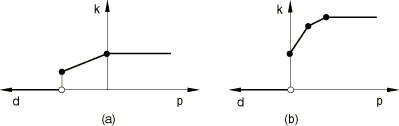

##### 将间隙电导定义为接触压力的函数

您可以将*k*定义为接触压力*p*的函数。当*k*是界面上接触压力的函数时，表格数据必须从零接触压力开始（或者对于可以承受拉力的接触，从最负压力开始），并随着*p*增加定义*k*。对于数据点定义区间之外的接触压力，*k*保持恒定。如果间隙电导也未定义为间隙的函数，则*k*对于所有正间隙值为零，在零间隙处不连续，如图37.2.1-1(b)所示。

| **输入文件用法：** | ``` [*GAP CONDUCTANCE*](../key/key-link.md#usb-kws-mgapconduct), PRESSURE , *p*,  ``` |
| --- | --- |

| **Abaqus/CAE用法：** | 相互作用模块：接触属性编辑器：****热********热传导****：**定义：表格**，**仅使用压力依赖数据** |
| --- | --- |

##### 间隙电导作为间隙和接触压力两者的函数

*k*可以依赖于间隙和压力。在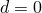和处允许*k*有不连续。在零间隙和零压力状态下，使用与零压力数据点对应的*k*值，如图37.2.1-2(a)所示。

**图37.2.1-2** 定义间隙电导作为间隙和接触压力两者的函数的输入数据示例。

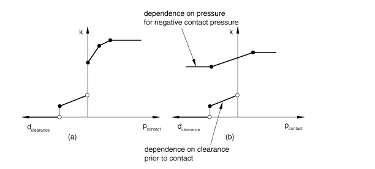

在不分离接触的情况下，一旦发生接触，电导始终基于定义压力依赖性的曲线部分计算。对于数据点定义区间之外的接触压力，间隙电导*k*保持恒定，如图37.2.1-2(b)所示。即使未包含负压力的数据点，*k*的压力依赖性也会扩展到负压力区域。

| **输入文件用法：** | ``` [*GAP CONDUCTANCE*](../key/key-link.md#usb-kws-mgapconduct) , *d*,  [*GAP CONDUCTANCE*](../key/key-link.md#usb-kws-mgapconduct), PRESSURE , *p*,  ``` |
| --- | --- |
| | 例如，以下输入为零间隙数据点定义，为初始零压力数据点定义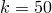： ``` [*SURFACE INTERACTION*](../key/key-link.md#usb-kws-hsurfaceinteraction), NAME=*name* [*GAP CONDUCTANCE*](../key/key-link.md#usb-kws-mgapconduct) 20.0, 0.0 10.0, 0.1 … [*GAP CONDUCTANCE*](../key/key-link.md#usb-kws-mgapconduct), PRESSURE 50.0, 0.0 65.0, 100.0 70.0, 250.0 … ``` |

| **Abaqus/CAE用法：** | 相互作用模块：接触属性编辑器：****热********热传导****：**定义：表格**，**同时使用间隙和压力依赖数据** |
| --- | --- |

##### 在Abaqus/Standard中使用间隙电导模拟表面的对流热传递

通常，质量流率只在Abaqus/Standard中为与强制对流单元关联的节点定义（见["解耦热传递分析"中的"通过网格的强制对流"第6.5.2节"](pt03ch06s05at18.md#usb-anl-aheattransfer-forcedconvection)）。但是，可以为模型中的任何节点定义质量流率。通过使用*k*对界面处平均质量流率的依赖关系（除了其他依赖关系），接触属性定义可以模拟固体与流动流体之间边界层的对流热传递。如果仅为界面一侧的节点给出质量流率（这是模拟对流热传递时的典型情况），则用于定义*k*的平均质量流率将为指定大小的一半。

| **输入文件用法：** | ``` [*GAP CONDUCTANCE*](../key/key-link.md#usb-kws-mgapconduct) *k*, *d*, ,  ``` |
| --- | --- |

| **Abaqus/CAE用法：** | 相互作用模块：接触属性编辑器：****热********热传导****：**定义**：**表格**，**间隙依赖**和/或**压力依赖**，打开****使用质量流率依赖数据（仅Standard）**** |
| --- | --- |

##### 定义间隙电导为预定义场变量的函数

除了前面提到的依赖关系外，间隙电导可以依赖于任意数量的预定义场变量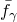。要使间隙电导依赖于场变量，每个场变量值至少需要两个数据点。

| **输入文件用法：** | ``` [*GAP CONDUCTANCE*](../key/key-link.md#usb-kws-mgapconduct), DEPENDENCIES=*n* *k*, *d*, , ,  ``` |
| --- | --- |

| **Abaqus/CAE用法：** | 相互作用模块：接触属性编辑器：****热********热传导****：**定义：表格**，**间隙依赖**和/或**压力依赖**，**场变量数量**：*n* |
| --- | --- |

#### 使用用户子程序[`GAPCON`](../sub/sub-link.md#sub-xsl-gapcon)定义间隙电导

在Abaqus/Standard中，*k*可以在用户子程序[`GAPCON`](../sub/sub-link.md#sub-xsl-gapcon)中定义。在这种情况下，在指定*k*的依赖关系方面有更大的灵活性。不再需要将*k*定义为两个表面温度、质量流率或场变量平均值的函数。

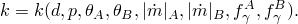

| **输入文件用法：** | ``` [*GAP CONDUCTANCE*](../key/key-link.md#usb-kws-mgapconduct), USER ``` |
| --- | --- |

| **Abaqus/CAE用法：** | 相互作用模块：接触属性编辑器：****热********热传导****：**定义：用户定义** |
| --- | --- |

#### 定义间隙电导强烈依赖于温度

如果*k*强烈依赖于温度，则计算中的非对称项开始变得越来越重要。在Abaqus/Standard中使用步骤的非对称矩阵存储和求解方案可以提高分析的收敛率（见["定义分析，" 第6.1.2节"](pt03ch06s01abo05.md)）。

#### 结构单元间隙电导的温度和场变量依赖性

梁和壳单元中的温度和场变量分布通常可以包括单元横截面的梯度。这些单元之间的接触发生在参考表面；因此，在确定间隙电导时不考虑单元中的温度和场变量梯度，即使在属性也依赖于间隙的情况下。

### 当间隙小时建模表面之间的辐射

Abaqus假设紧密接触表面之间的辐射热传递发生在表面之间的法向方向。在使用基于表面的接触的模型中，此法向对应于主表面法向（见["Abaqus/Standard中的接触公式，" 第38.1.1节"](pt09ch38s01aus177.md)；["在Abaqus/Explicit中定义接触对，" 第36.5.1节"](pt09ch36s05aus160.md)；和["表面概述，" 第2.3.1节"](pt01ch02s03aus16.md)）。在使用Abaqus/Standard中可用的接触单元的模型中，单元的连接性定义了法向方向。

Abaqus中的间隙辐射功能旨在模拟跨越狭窄间隙的表面之间的辐射。在Abaqus/Standard中有一个更通用的建模辐射功能（见["腔体辐射，" 第41.1.1节"](pt09ch41s01aus187.md)）。

辐射热传递定义为通过有效视角因子对表面之间间隙的函数。Abaqus即使在表面接触时也保持辐射热通量。这只会导致轻微的不准确，因为通常传导的热通量比辐射热通量大得多。

Abaqus将对应点之间单位表面面积的热流定义为


其中*q*是从表面*A*到表面*B*穿过该点处间隙的单位面积热通量，和是两个表面的温度，是所用温度标尺的绝对零度，系数*C*由下式给出


其中是Stefan-Boltzmann常数，和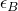是表面发射率，*F*是有效视角因子，对应于从从属表面观察主表面。

视角因子*F*必须定义为间隙*d*的函数，值应在0.0和1.0之间。需要至少两对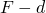点来定义视角因子，表格数据必须从零间隙（闭合间隙）开始，并随着间隙增加定义视角因子。*F*的值在最后一个数据点之后立即降为零，因此当间隙大于与最后一个数据点对应的值时没有辐射热传递（见图37.2.1-3）。

**图37.2.1-3** 定义视角因子作为间隙函数的输入数据示例。

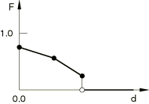

| **输入文件用法：** | ``` [*GAP RADIATION*](../key/key-link.md#usb-kws-mgapradiation) ,  ,  ,  … ``` |
| --- | --- |

| **Abaqus/CAE用法：** | 相互作用模块：接触属性编辑器：****热********辐射****：**主表面发射率**：，**从表面发射率**：，**视角因子**和**间隙** |
| --- | --- |

#### 指定绝对零度的值

您必须指定的值。

| **输入文件用法：** | ``` [*PHYSICAL CONSTANTS*](../key/key-link.md#usb-kws-mphysicalconsts), ABSOLUTE ZERO= ``` |
| --- | --- |

| **Abaqus/CAE用法：** | 任何模块：****模型********编辑属性*********model_name*****：**绝对零度温度**： |
| --- | --- |

#### 指定Stefan-Boltzmann常数

您必须指定Stefan-Boltzmann常数。

| **输入文件用法：** | ``` [*PHYSICAL CONSTANTS*](../key/key-link.md#usb-kws-mphysicalconsts), STEFAN BOLTZMANN= ``` |
| --- | --- |

| **Abaqus/CAE用法：** | 任何模块：****模型********编辑属性*********model_name*****：**Stefan-Boltzmann常数**： |
| --- | --- |

#### 在Abaqus/Standard中提高收敛性

由于辐射产生的热通量是温度的强非线性函数，辐射方程是强非对称的，使用步骤的非对称矩阵存储和求解方案可以提高Abaqus/Standard中的收敛率（见["定义分析，" 第6.1.2节"](pt03ch06s01abo05.md)）。

### 建模由非热表面相互作用产生的热量

在全耦合温度-位移、全耦合热-电-结构或耦合热-电模拟中，Abaqus允许由于接触表面的机械或电相互作用产生的能量耗散而产生热量。在全耦合温度-位移分析和全耦合热-电-结构分析中，热量来源于摩擦滑动；在耦合热-电和全耦合热-电-结构分析模拟中，热量来源于穿过界面的电流流动。默认情况下，Abaqus将所有耗散的能量释放为表面之间的热量，并将其平均分配给两个相互作用的表面。

您可以指定转换为热量的耗散能量分数（默认值为1.0），以及表面之间热量分配的加权因子*f*（默认值为0.5）。通常包括将机械能转换为热能的因子。

*f*=1.0表示所有产生的热量流入接触对的第一个（从）表面。*f*=0.0表示所有产生的热量流入相对的（主）表面。除非有效的实验数据另有建议，否则最好假设*f*=0.5的默认值，因为该值在表面之间平均分配产生的热量。

如果使用用户子程序[`UINTER`](../sub/sub-link.md#sub-xsl-uinter)、[`VUINTER`](../sub/sub-link.md#sub-xsl-vuinter)或[`VUINTERACTION`](../sub/sub-link.md#sub-xsl-vuinteraction)来定义界面本构行为，则所有间隙热产生效应将被关闭；您必须在用户子程序中提供额外的热通量来建模这些效应。

| **输入文件用法：** | ``` [*GAP HEAT GENERATION*](../key/key-link.md#usb-kws-mgapheatgener) , *f* ``` |
| --- | --- |

| **Abaqus/CAE用法：** | 相互作用模块：接触属性编辑器：****热********热产生****：**指定**：和*f* |
| --- | --- |

#### 由摩擦滑动产生的热量

在耦合热-机械和耦合热-电-结构表面相互作用中，摩擦能量耗散率为


其中是摩擦应力，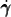是滑移率。每个表面释放的热量假设为

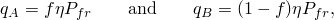

其中和*f*如上定义。流入从表面的热通量为，流入主表面的热量为。

#### 由Abaqus/Standard中电流流动产生的热量

在耦合热-电分析（见["耦合热-电分析，" 第6.7.3节"](pt03ch06s07at22.md)）和全耦合热-电-结构分析（见["全耦合热-电-结构分析，" 第6.7.4节"](pt03ch06s07at23.md)）中，电流穿过界面流动产生的电能耗散率为


其中*J*是电流密度，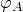和和*f*与摩擦耗散中的定义相同。同样，流入从表面的热通量为，流入主表面的热量为。

### 热接触属性模型的基于表面的相互作用变量

Abaqus提供了许多与表面热相互作用相关的输出变量。在Abaqus/Standard中，这些变量的值始终在从表面的节点处给出。在Abaqus/Explicit中，这些变量可以为主表面和从表面输出，尽管它们不适用于解析表面。这些变量仅适用于使用基于表面的接触定义的模拟。它们可以请求作为表面输出到数据、结果或输出数据库文件（详见["Abaqus/Standard的表面输出"中的"输出到数据和结果文件，" 第4.1.2节"](pt02ch04s01aus39.md#usb-out-oprintfile-surface)，和["Abaqus/Standard和Abaqus/Explicit中的表面输出"中的"输出到输出数据库，" 第4.1.3节"](pt02ch04s01aus40.md#usb-out-odboutput-surface)）。

#### 热通量的基于表面相互作用变量

以下变量适用于可以发生热传递的任何模拟（全耦合温度-位移、全耦合热-电-结构、耦合热-电或纯热传递分析）：

| HFL | 离开表面的单位面积热通量。 |
| --- | --- |

| HFLA | HFL乘以节点面积。 |
| --- | --- |

| HTL | 时间积分的HFL。 |
| --- | --- |

| HTLA | 时间积分的HFLA。 |
| --- | --- |

每当请求表面输出到数据或结果文件且存在热表面相互作用时，Abaqus/Standard默认提供所有这些变量。

这些变量也可以在Abaqus/CAE的Visualization模块中的等值线图中显示（Abaqus/Viewer）。

#### 由摩擦滑动产生的热量的基于表面相互作用变量

以下变量适用于存在接触表面之间摩擦相互作用的全耦合温度-位移模拟，或使用用户子程序[`UINTER`](../sub/sub-link.md#sub-xsl-uinter)、[`VUINTER`](../sub/sub-link.md#sub-xsl-vuinter)或[`VUINTERACTION`](../sub/sub-link.md#sub-xsl-vuinteraction)：

| SFDR | 由于摩擦耗散而进入表面的单位面积热通量（包括两个表面的热通量，和）。当使用用户子程序[`UINTER`](../sub/sub-link.md#sub-xsl-uinter)、[`VUINTER`](../sub/sub-link.md#sub-xsl-vuinter)或[`VUINTERACTION`](../sub/sub-link.md#sub-xsl-vuinteraction)定义界面热本构行为时，此量表示由摩擦和其他耗散效应导致的总能量耗散产生的热通量。间隙热产生效应被关闭。 |
| --- | --- |

| SFDRA | SFDR乘以节点面积。 |
| --- | --- |

| SFDRT | 时间积分的SFDR。 |
| --- | --- |

| SFDRTA | 时间积分的SFDRA。 |
| --- | --- |

| WEIGHT | 表面之间热通量分配的加权因子*f*（仅在Abaqus/Standard中可用；当使用用户子程序[`UINTER`](../sub/sub-link.md#sub-xsl-uinter)定义界面本构行为时不可用）。 |
| --- | --- |

当请求表面输出到数据或结果文件时，Abaqus/Standard默认不提供这些变量；您必须指定变量标识符。

这些变量的等值线图也可以在Abaqus/CAE的Visualization模块中创建（Abaqus/Viewer）。

#### 由电流产生的热量的基于表面相互作用变量

以下变量适用于任何耦合热-电和任何全耦合热-电-结构模拟：

| SJD | 由电流产生的单位面积热通量，包括两个表面的热通量（和）。 |
| --- | --- |

| SJDA | SJD乘以面积。 |
| --- | --- |

| SJDT | 时间积分的SJD。 |
| --- | --- |

| SJDTA | 时间积分的SJDA。 |
| --- | --- |

| WEIGHT | 表面之间热通量分配的加权因子*f*。 |
| --- | --- |

当请求表面输出到数据或结果文件时，Abaqus/Standard默认不提供这些变量；您必须指定变量标识符。

这些变量的等值线图也可以在Abaqus/CAE的Visualization模块中绘制（Abaqus/Viewer）。

### 热间隙单元的热相互作用变量

Abaqus/Standard提供穿过热间隙单元的单位面积热通量作为输出。将变量标识符HFL的单元输出请求到数据、结果或输出数据库文件（详见["输出到数据和结果文件"中的"单元输出"第4.1.2节"](pt02ch04s01aus39.md#usb-out-oprintfile-elementoutput)，和["输出到输出数据库"中的"单元输出"第4.1.3节"](pt02ch04s01aus40.md#usb-out-odboutput-elementoutput)）。唯一的非零分量将是HFL1：沿间隙单元定义的界面没有切向热通量。HFL1的正值表示热量流向单元主表面侧的法向方向（关于DGAP单元此法向的定义，请参阅["间隙接触单元，" 第40.2.1节"](pt09ch40s02alm64.md)）。

可以使用Abaqus/CAE绘制穿过热接触单元的热通量等值线。

### 涉及刚体的热相互作用

在["刚性体定义，" 第2.4.1节"](pt01ch02s04aus22.md)中讨论了涉及刚体的热相互作用建模时需要考虑的各种因素。例如，Abaqus/Standard不允许对解析刚性表面进行热相互作用建模。

### 使用基于节点表面的热相互作用建模

以下限制适用于Abaqus/Standard中的全耦合热-电-结构和全耦合热应力分析（见["全耦合热应力分析，" 第6.5.3节"](pt03ch06s05at19.md)）：
- 涉及基于节点表面的接触对不会发生热流。
- 涉及基于节点表面的接触对不会产生热量。

这些限制不适用于Abaqus/Explicit，也不适用于Abaqus/Standard中涉及热相互作用的其他分析类型（见["热传递分析过程概述，" 第6.5.1节"](pt03ch06s05abo08.md)）。

但是，在允许的情况下，使用基于节点表面进行热相互作用时要谨慎：Abaqus根据必须考虑与每个节点关联的实际接触表面面积的节点热通量来计算体之间的热相互作用。在Abaqus/Standard中，必须为基于节点表面中的每个节点精确指定此面积以计算正确的热通量；在Abaqus/Explicit中，为基于节点表面的每个节点分配单位面积（见["基于节点的表面定义，" 第2.3.3节"](pt01ch02s03aus18.md)）。

### 具有包含多个温度自由度的节点表面之间的热相互作用

当参与热相互作用的表面定义在具有多个温度自由度的壳单元上时，给定节点处用于热相互作用的温度自由度的选择取决于表面的定义方式。对于基于单元的表面，选择最接近表面的温度自由度；即，底面节点处的第一个温度自由度，顶部表面节点处的最后一个温度自由度。对于基于节点的表面，始终为热相互作用选择节点处的第一个温度自由度。


