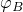
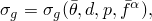
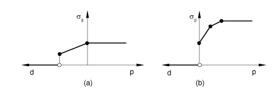
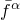

# 37.3.1 电接触属性


**产品：** Abaqus/Standard  Abaqus/CAE

##### **参考**

- ["接触相互作用分析概述，" 第36.1.1节"](pt09ch36s01abo33.md)
- ["热接触属性，" 第37.2.1节"](pt09ch37s02aus174.md)
- ["GAPELECTR，" Abaqus用户子程序参考指南第1.1.11节"](../sub/sub-link.md#sub-rtn-ugapelectr)
- [*GAP ELECTRICAL CONDUCTANCE*](../key/key-link.md#usb-kws-mgapelectconduct)
- [*SURFACE INTERACTION*](../key/key-link.md#usb-kws-hsurfaceinteraction)
- ["定义接触相互作用属性中的电接触属性选项"中的"为电接触属性选项指定间隙电导" Abaqus/CAE用户指南第15.14.1节"](../usi/usi-link.md#usi-itn-help-prop-contact-elec-conductance)

### 概述

两个体之间的电传导：
- 与穿过界面的电势差成正比；
- 是表面之间间隙的函数；
- 可以是接触压力的函数；
- 可以是表面上温度和/或预定义场变量的函数；和
- 可以在界面产生热量。

请参阅["耦合热-电分析，" 第6.7.3节"](pt03ch06s07at22.md)和["全耦合热-电-结构分析，" 第6.7.4节"](pt03ch06s07at23.md)，了解耦合热-电和全耦合热-电-结构分析的详细信息。

### 在接触属性定义中包含间隙电导属性

您可以在基于表面的接触的接触属性定义中包含电导属性。

| **输入文件用法：** | 同时使用以下两个选项： |
| --- | --- |
| | ``` [*SURFACE INTERACTION*](../key/key-link.md#usb-kws-hsurfaceinteraction), NAME=*name* [*GAP ELECTRICAL CONDUCTANCE*](../key/key-link.md#usb-kws-mgapelectconduct) ``` |

| **Abaqus/CAE用法：** | 相互作用模块：接触属性编辑器：****电气********电导**** |
| --- | --- |

### 建模表面之间的电导

Abaqus/Standard将流经两个表面之间的电流建模为


其中*J*是流经一个表面上点*A*到另一个表面上点*B*穿过界面的电流密度，和是表面上相对点的电势，是间隙电导。点*A*对应于接触对从表面上的节点。点*B*是与*A*接触的主表面上的点。

您可以直接提供电导或在用户子程序[`GAPELECTR`](../sub/sub-link.md#sub-xsl-gapelectr)中提供。

#### 直接定义*σg*

当直接定义间隙电导时，Abaqus/Standard假设



其中


是*A*和*B*处表面温度的平均值，

*d*

是*A*和*B*之间的间隙，

*p*

是穿过*A*和*B*之间界面的接触压力，和


是*A*和*B*处任何预定义场变量的平均值。

##### 将间隙电导定义为间隙的函数

您可以创建一个数据表来定义对上述变量的依赖关系。Abaqus中的默认设置是使成为间隙*d*的函数。当是间隙间隙*d*的函数时，表格数据必须从零间隙（闭合间隙）开始，并将定义为间隙的函数。对于数据点定义区间之外的间隙，的值保持恒定。如果间隙电导也未定义为接触压力的函数，则对于所有压力，将保持在零间隙值恒定，如图37.3.1-1(a)所示。

**图37.3.1-1** 将间隙电导定义为间隙(a)或接触压力(b)函数的示例。



| **输入文件用法：** | ``` [*GAP ELECTRICAL CONDUCTANCE*](../key/key-link.md#usb-kws-mgapelectconduct) , ,  ``` |
| --- | --- |

| **Abaqus/CAE用法：** | 相互作用模块：接触属性编辑器：****电气********电导****；**定义：表格**；**仅使用间隙依赖数据** |
| --- | --- |

##### 将间隙电导定义为接触压力的函数

您可以将定义为接触压力*p*的函数。当是界面上接触压力的函数时，表格数据必须从零接触压力开始（或者对于可以承受拉力的接触，从最负压力开始），并随着*p*增加定义。对于数据点定义区间之外的接触压力，的值保持恒定。如果间隙电导也未定义为间隙的函数，则对于所有正间隙值，为零，在零间隙处不连续，如图37.3.1-1(b)所示。

| **输入文件用法：** | ``` [*GAP ELECTRICAL CONDUCTANCE*](../key/key-link.md#usb-kws-mgapelectconduct), PRESSURE , ,  ``` |
| --- | --- |

| **Abaqus/CAE用法：** | 相互作用模块：接触属性编辑器：****电气********电导****；**定义：表格**；**仅使用压力依赖数据** |
| --- | --- |

##### 间隙电导作为间隙和接触压力两者的函数

您可以定义依赖于间隙和压力。在和处允许有不连续。一旦发生接触，电导始终基于定义压力依赖性的曲线部分计算。对于数据点定义区间之外的接触压力，间隙电导保持恒定。即使未包含负压力的数据点，的压力依赖性也会扩展到负压力区域。

| **输入文件用法：** | 同时使用以下两个选项： |
| --- | --- |
| | ``` [*GAP ELECTRICAL CONDUCTANCE*](../key/key-link.md#usb-kws-mgapelectconduct) , ,  [*GAP ELECTRICAL CONDUCTANCE*](../key/key-link.md#usb-kws-mgapelectconduct), PRESSURE , ,  ``` |

| **Abaqus/CAE用法：** | 相互作用模块：接触属性编辑器：****电气********电导****；**定义：表格**；**同时使用间隙和压力依赖数据** |
| --- | --- |

##### 定义间隙电导为预定义场变量的函数

间隙电导可以依赖于任意数量的预定义场变量。默认情况下，假设电导率仅依赖于表面分离，可能还依赖于平均界面温度。

| **输入文件用法：** | ``` [*GAP ELECTRICAL CONDUCTANCE*](../key/key-link.md#usb-kws-mgapelectconduct), DEPENDENCIES=*n* ``` |
| --- | --- |

| **Abaqus/CAE用法：** | 相互作用模块：接触属性编辑器：****电气********电导****；**定义：表格**，**间隙依赖**和/或**压力依赖**，**场变量数量**：*n* |
| --- | --- |

#### 使用用户子程序[`GAPELECTR`](../sub/sub-link.md#sub-xsl-gapelectr)定义*σg*

当在用户子程序[`GAPELECTR`](../sub/sub-link.md#sub-xsl-gapelectr)中定义时，在指定的依赖关系方面比使用直接表格输入有更大的灵活性。例如，不再需要将定义为两个表面温度或场变量平均值的函数：


| **输入文件用法：** | ``` [*GAP ELECTRICAL CONDUCTANCE*](../key/key-link.md#usb-kws-mgapelectconduct), USER ``` |
| --- | --- |

| **Abaqus/CAE用法：** | 相互作用模块：接触属性编辑器：****电气********电导****；**定义：用户定义** |
| --- | --- |

### 建模表面之间电传导产生的热量

Abaqus/Standard可以在耦合热-电和全耦合热-电-结构分析中包含表面之间电传导产生的热量的影响。默认情况下，所有耗散的电能都转换为热量并平均分配给两个表面。您可以修改转换为热量的电能量分数以及两个表面之间的分布；有关详细信息，请参阅["热接触属性"中的"建模由非热表面相互作用产生的热量"第37.2.1节"](pt09ch37s02aus174.md#usb-cni-athermalinteraction-gapheatgen)。

### 电接触属性模型的基于表面输出变量

Abaqus/Standard提供与表面电相互作用相关的以下输出变量：

| ECD | 离开从表面的单位面积电流。 |
| --- | --- |

| ECDA | ECD乘以与从节点关联的面积。 |
| --- | --- |

| ECDT | ECD的时间积分。 |
| --- | --- |

| ECDTA | ECDA的时间积分。 |
| --- | --- |

这些变量的值始终在从表面的节点处给出。它们可以请求作为表面输出到数据、结果或输出数据库文件（详见["Abaqus/Standard的表面输出"中的"输出到数据和结果文件，" 第4.1.2节"](pt02ch04s01aus39.md#usb-out-oprintfile-surface)，和["Abaqus/Standard和Abaqus/Explicit中的表面输出"中的"输出到输出数据库，" 第4.1.3节"](pt02ch04s01aus40.md#usb-out-odboutput-surface)）。

这些变量的等值线图也可以在Abaqus/CAE的Visualization模块中显示（Abaqus/Viewer）。


