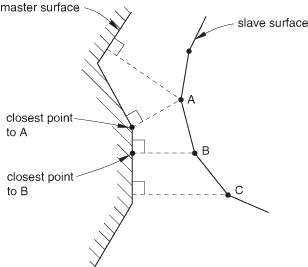
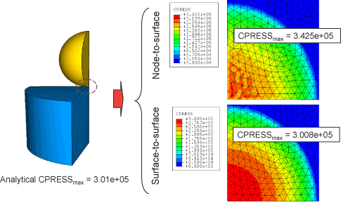
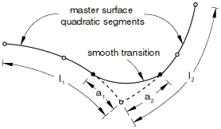
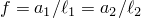
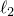
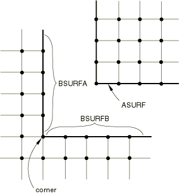
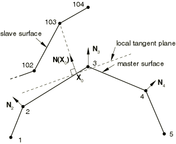
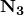

# 38.1.1 Abaqus/Standard中的接触公式


**产品：** Abaqus/Standard  Abaqus/CAE

##### **参考**

- ["曲面概述，" 第2.3.1节"](pt01ch02s03aus16.md)
- ["在Abaqus/Standard中定义通用接触相互作用，" 第36.2.1节"](pt09ch36s02aus139.md)
- ["在Abaqus/Standard中定义接触对，" 第36.3.1节"](pt09ch36s03aus145.md)
- [*CONTACT*](../key/key-link.md#usb-kws-hcontact)
- [*CONTACT PAIR*](../key/key-link.md#usb-kws-hcontactpair)
- ["定义通用接触，" Abaqus/CAE用户指南第15.13.1节"](../usi/usi-link.md#usi-itn-help-general)
- ["定义面到面接触，" Abaqus/CAE用户指南第15.13.7节"](../usi/usi-link.md#usi-itn-help-surftosurf)
- ["定义自接触，" Abaqus/CAE用户指南第15.13.8节"](../usi/usi-link.md#usi-itn-help-self)
- ["使用接触和约束检测，" Abaqus/CAE用户指南第15.16节"](../usi/usi-link.md#usi-itn-detectioneditor)

### 概述

Abaqus/Standard提供了多种接触公式。每个公式基于接触离散化、跟踪方法以及分配给接触曲面的"主"和"从"角色的选择。对于通用接触相互作用，离散化、跟踪方法和曲面角色分配由Abaqus/Standard自动选择；对于接触对，您可以使用["在Abaqus/Standard中定义接触对，" 第36.3.1节"](pt09ch36s03aus145.md)中描述的界面指定接触公式的这些方面。默认接触公式适用于大多数情况，但在某些情况下您可能希望选择其他公式。本节详细讨论Abaqus/Standard在接触模拟中使用的公式。

跟踪方法的选择对接触曲面的相互作用方式有很大影响。在Abaqus/Standard中，有两种跟踪方法可用于考虑机械接触模拟中两个相互作用曲面的相对运动：
- 有限滑动，这是最通用的方法，允许曲面之间的任意运动（参见["变形体之间的有限滑动相互作用，" Abaqus理论指南第5.1.2节"](../stm/stm-link.md#stm-ifc-slidecontactelem)，和["变形体与刚体之间的有限滑动相互作用，" Abaqus理论指南第5.1.3节"](../stm/stm-link.md#stm-ifc-defbodyrigidsurf)）；和
- 小滑动，它假设尽管两个物体可能发生大运动，但一个曲面沿另一个曲面的滑动相对较小（参见["物体之间的小滑动相互作用，" Abaqus理论指南第5.1.1节"](../stm/stm-link.md#stm-ifc-smslidcontact)）。

对于上述每种跟踪方法，您可以在节点到曲面接触离散化和真正的面到面接触离散化之间进行选择。

### 通用接触的公式

Abaqus/Standard中的通用接触始终使用有限滑动、面到面接触公式。此公式也可用于接触对，但不是默认公式。本节中关于有限滑动、面到面接触的讨论同样适用于通用接触和接触对。

在通用接触域中，主和从角色自动分配给曲面，尽管可以覆盖这些默认分配。主曲面和从曲面的行为在通用接触和接触对相互作用中是一致的。通用接触域中主和从曲面的规范在["Abaqus/Standard中通用接触的数值控制，" 第36.2.6节"](pt09ch36s02aus144.md)中有详细说明。

### 接触对曲面的离散化

Abaqus/Standard在相互作用曲面上的各个位置施加条件约束，以模拟接触条件。这些约束的位置和条件取决于整体接触公式中使用的接触离散化。Abaqus/Standard提供两种接触离散化选项：传统的"节点到曲面"离散化和真正的"面到面"离散化。

#### 节点到曲面接触离散化

使用传统的节点到曲面离散化，接触条件的建立使得接触界面上每一侧的每个"从"节点有效地与对面"主"曲面上的投影点相互作用（参见[图38.1.1-1](pt09ch38s01aus177.md#acontact-interaction)）。因此，每个接触条件涉及单个从节点和一组附近的主节点，值从这些主节点插值到投影点。

**图38.1.1-1** 节点到曲面接触离散化。



传统节点到曲面离散化具有以下特征：
- 从节点被约束不得穿透主曲面；然而，主曲面的节点原则上可以穿透从曲面（例如，参见[图38.1.1-2](pt09ch38s01aus177.md#acontact-compare-penetration)右上角的情况）。**图38.1.1-2** 不同主从分配下节点到曲面和面到面接触离散化的接触 Enforcement 比较。
- 接触方向基于主曲面的法线。
- 从曲面所需的信息只是与每个节点关联的位置和表面积；从曲面法线方向和从曲面曲率不相关。因此，从曲面可以定义为一组节点——基于节点的曲面。
- 即使接触对定义中未使用基于节点的曲面，也可使用节点到曲面离散化。

#### 面到面接触离散化

面到面离散化考虑从曲面和主曲面在接触约束区域中的形状。面到面离散化具有以下关键特征：
- 面到面公式在从节点附近的区域平均意义上而非仅在单个从节点处强制执行接触条件。平均区域大致以从节点为中心，因此每个接触约束主要考虑一个从节点，但也会考虑相邻从节点。可能在单个节点处观察到一些穿透；但是，使用此离散化不会发生主节点穿透从曲面的大规模、未检测到的穿透。[图38.1.1-2](pt09ch38s01aus177.md#acontact-compare-penetration)比较了具有不同网格精化的接触体上节点到曲面和面到面接触的接触 Enforcement。
- 接触方向基于从节点周围区域的从曲面平均法线。
- 如果接触对定义中使用了基于节点的曲面，则面到面离散化不适用。

#### 选择接触离散化

一般来说，如果接触曲面合理地代表了曲面几何形状，面到面离散化比节点到曲面离散化提供更准确的应力和压力结果。[图38.1.1-3](pt09ch38s01aus177.md#acontact-compare-cpress)显示了一个示例，说明与节点到曲面接触相比，面到面接触的压力精度有所提高。

**图38.1.1-3** 节点到曲面和面到面接触离散化的接触压力精度比较。



由于节点到曲面离散化只是抵抗从节点穿透主曲面，力往往集中在这些从节点上。这导致整个曲面上的压力分布出现峰值和谷值。面到面离散化在从曲面有限区域的平均意义上抵抗穿透，这具有平滑效应。随着网格的细化，离散化之间的差异减小，但对于给定的网格精化，面到面方法往往提供更准确的应力。

使用面到面离散化的接触对节点到曲面接触的曲面的主从指定也不太敏感（参见["在双曲面接触对中选择主和从角色](pt09ch38s01aus177.md#usb-cni-acontactpairform-masterslave)"下文）。[图38.1.1-4](pt09ch38s01aus177.md#usb-acontact-block)显示了一个涉及具有不同网格密度的两个块的简单模型。

**图38.1.1-4** 用于比较不同主和从曲面指定的测试模型。


底块固定在地面上，均匀压力100 [Pa](../popups/usb-int-iconventions-unitsym.md)作用于顶块顶面。分析上，顶块应在整个接触界面上对底块施加均匀的100 [Pa](../popups/usb-int-iconventions-unitsym.md)压力。[表38.1.1-1](pt09ch38s01aus177.md#usb-cni-acontactpair-pressure)比较了不同接触离散化和从曲面组合的Abaqus分析结果。

**表38.1.1-1** 各种离散化/从曲面组合与分析结果的误差（百分比）。
| 接触离散化 | 从曲面 | CPRESS最大误差 |
| --- | --- | --- |
| 节点到曲面 | 顶块 | 13% |
| 底块 | 31% |
| 面到面 | 顶块 | ~1% |
| 底块 | ~1% |

如果由于粗网格的使用，曲面几何形状表示不佳，无论使用面到面接触还是节点到曲面接触，都可能存在显著不准确。在某些情况下，面到面接触可用的曲面平滑技术可以显著改善使用粗网格获得的结果。有关面到面接触的曲面平滑选项的讨论，请参见["Abaqus/Standard中的接触曲面平滑，" 第38.1.3节"](pt09ch38s01aus179.md)。

面到面离散化通常每个约束涉及更多节点，因此可能增加求解成本。在大多数应用中，额外成本很小，但 在某些情况下成本可能变得显著。以下因素（特别是组合时）可能导致面到面接触成本高昂：
- 很大一部分模型参与接触。
- 主曲面比从曲面更精细。
- 多层壳参与接触，使得一个接触对的主曲面充当另一个接触对的从曲面。

面到面公式主要用于接触曲面法线方向大致相反的常见情况。节点到曲面接触公式通常更适合于处理涉及特征边缘或角落的接触（如果在主动接触区域相应的从属和主网格面法线方向大致不是相反的）。

### 接触跟踪方法

在Abaqus/Standard中，有两种跟踪方法可用于考虑机械接触模拟中两个相互作用曲面的相对运动。

#### 有限滑动跟踪方法

有限滑动接触是最通用的跟踪方法，允许接触曲面的任意相对分离、滑动和旋转。对于有限滑动接触，随着接触曲面的相对切向运动，当前主动接触约束的连接会发生变化。有关Abaqus/Standard如何计算有限滑动接触的详细说明，请参阅本节后面的["使用有限滑动跟踪方法](pt09ch38s01aus177.md#usb-cni-acontactpairform-finite)"。

#### 小滑动跟踪方法

小滑动接触假设一个曲面沿另一个曲面的滑动相对较小，基于每个约束的主曲面的线性化近似。小滑动接触的约束所涉及的节点组在整个分析过程中是固定的，尽管这些约束的主动/非主动状态通常可以在分析过程中改变。如果近似值合理，您应该考虑使用小滑动接触，因为可以节省计算成本并提高稳健性。有关Abaqus/Standard如何计算小滑动接触的详细说明，请参阅本节后面的["使用小滑动跟踪方法](pt09ch38s01aus177.md#usb-cni-acontactpairform-smsliding)"。

### 在双曲面接触对中选择主和从角色

Abaqus/Standard强制执行与接触曲面主和从角色分配相关的以下规则：
- 分析刚性曲面和基于刚性元素的曲面必须始终是主曲面。
- 基于节点的曲面只能作为从曲面，并且始终使用节点到曲面接触。
- 从曲面必须始终附着在变形体或定义为刚性的变形体上。
- 接触对中的两个曲面不能同时是刚性曲面，但定义为刚性的变形曲面除外（参见["刚体定义，" 第2.4.1节"](pt01ch02s04aus22.md)）。

当接触对中的两个曲面都是基于元素的并附着在变形体或定义为刚性的变形体上时，您必须选择哪个曲面作为从曲面，哪个作为主曲面。对于节点到曲面接触，这个选择尤其重要。一般来说，如果较小的曲面接通较大的曲面，最好选择较小的曲面作为从曲面。如果无法做出区分，则应将主曲面选择为较刚性物体的曲面，或者如果两个曲面在结构上具有相当刚度，则选择网格较粗的曲面。选择主和从曲面时应考虑结构的刚度，而不仅仅是材料。例如，薄金属板可能比更大的橡胶块更软，即使钢的材料模量比橡胶材料大。如果两个曲面的刚度和网格密度相同，首选选择并不总是显而易见的。

主和从角色的选择在面到面接触公式中比在节点到曲面接触公式中对结果的影响要小得多。但是，如果两个曲面具有不同的网格精化，主和从角色的分配对面到面接触的性能有显著影响；如果从曲面比主曲面粗糙得多，求解可能会变得相当昂贵。

### 影响接触公式的基本选择

接触离散化和跟踪方法的选择对分析有很大影响。除了已经讨论过的特性外，某些离散化和跟踪方法的组合有其自身的特性和限制。这些特性总结在[表38.1.1-2](pt09ch38s01aus177.md#table-formulation-comparison)中。您还应考虑与各种接触公式相关的求解成本。

**表38.1.1-2** 接触公式特性比较。
| 特性 | 接触公式 |
| --- | --- |
| 节点到曲面 | 面到面 |
| 有限滑动 | 小滑动 | 有限滑动 | 小滑动 |
| 默认考虑壳厚度 | 否 | 是 | 是 | 是 |
| 允许自接触 | 是 | 否 | 是 | 否 |
| 允许双侧曲面 | 仅从曲面 | 仅从曲面 | 是1 | 是 |
| 默认曲面平滑 | 主曲面某种程度的平滑 | 对于锚点是；每个约束使用主曲面的平坦近似 | 否 | 对于锚点否；每个约束使用主曲面的平坦近似 |
| 默认约束 Enforcement 方法 | 三维自接触使用增强拉格朗日方法；否则使用直接方法 | 直接方法 | 惩罚方法 | 直接方法 |
| 确保带摩擦的偏移参考表面的力矩平衡 | 否 | 否 | 是 | 是 |
| 1仅当使用基于路径的跟踪算法时，才允许双侧主曲面（参见["基于路径的与基于状态的跟踪算法](pt09ch38s01aus177.md#usb-cni-acontactpairform-tracking)"）。如果主曲面不是用户定义的，则两个跟踪算法都允许双侧从曲面。 |

#### 考虑壳厚度

大多数接触公式在计算接触约束时会考虑壳的曲面厚度。但是，有限滑动、节点到曲面公式不会考虑壳厚度。这些计算在["在Abaqus/Standard中为接触对分配曲面属性，" 第36.3.2节"](pt09ch36s03aus146.md#usb-cni-acontactpair-thickness)中的"考虑壳和膜厚度"下有详细讨论。

#### 允许自接触

自接触通常是模型中大变形的结果。通常很难预测哪些区域将参与接触，或者它们将如何相对移动。因此，自接触不能使用小滑动跟踪方法。

#### 允许双侧曲面

基于类壳元素的双侧接触曲面默认允许作为面到面接触公式的从和/或主曲面，并且允许作为节点到面接触公式的从曲面。对于具有可选基于状态的跟踪算法（参见["基于路径的与基于状态的跟踪算法](pt09ch38s01aus177.md#usb-cni-acontactpairform-tracking)"下文）的面到面公式或节点到曲面接触公式，类壳曲面要作为主曲面，曲面必须定义为单侧（有关更多信息，请参见["基于元素的曲面定义中的定义单侧曲面，" 第2.3.2节"](pt01ch02s03aus17.md#usb-int-adeformablesurf-single-sided)，和["在Abaqus/Standard中定义接触对，" 第36.3.1节"](pt09ch36s03aus145.md#usb-cni-acontactpair-orient)中的"类壳曲面的方向考虑"）。

#### 曲面平滑

当使用节点到曲面离散化时，锯齿状主曲面的角落或小凸起允许穿透基于节点的曲面中节点之间的空间。有时，从节点沿主曲面滑动的过程中可能会被这些角落"卡住"。因此，Abaqus/Standard自动平滑用于节点到曲面离散化接触计算的主曲面，以减少这种现象。详细信息在本节后面的["为有限滑动、节点到曲面公式平滑主曲面](pt09ch38s01aus177.md#usb-cni-acontactpairform-smoothing)"中进一步讨论。

默认情况下，使用面到面离散化时不会发生曲面平滑。面到面离散化在从曲面附近区域的平均意义上考虑接触条件，这往往减轻了与主曲面的小凸起穿透从曲面相关的问题，并在约束级别引入了一些固有的平滑特性。但是，当使用相对粗糙的网格时，这种固有平滑通常不能显著减轻与曲面几何表示不佳相关的错误。在某些情况下，面到面接触可用的非默认圆周或球面曲面平滑方法可以显著改善使用粗网格获得的结果（参见["Abaqus/Standard中的接触曲面平滑，" 第38.1.3节"](pt09ch38s01aus179.md)）。

#### 约束 Enforcement 方法

在许多情况下，Abaqus/Standard默认严格强制执行先前讨论的接触约束。然而，严格强制接触约束有时可能导致过度约束问题（例如，参见["过度约束检查，" 第35.6.1节"](pt08ch35s06aus138.md)）或收敛困难。为了解决这些问题并允许降低求解成本（通常对求解准确性的影响很小），Abaqus/Standard还提供了基于惩罚的约束强制执行方法。数值约束强制执行方法（和默认值）在["Abaqus/Standard中的接触约束强制执行方法，" 第38.1.2节"](pt09ch38s01aus178.md)中有详细讨论。

#### 力矩平衡

根据牛顿第三运动定律，接触力应该是自平衡的；也就是说，作用在相应曲面上的净接触力对于每个主动接触约束应该大小相等、方向相反，并有效地通过一个公共点起作用。基于面到面接触离散化的接触约束始终表现出这种特性。基于节点到曲面离散化的接触约束总是产生零净力，但在某些情况下可能在数值解中产生净力矩。如果在摩擦约束和偏移参考表面之间存在偏移，则与节点到曲面接触约束相关的摩擦力将产生净力矩。以下因素可能导致在接触约束处于主动状态时相应接触曲面的节点之间存在法线方向偏移：
- 软化的压力-闭合行为的存在（由于用户指定的软化压力-闭合模型或约束强制执行方法的使用，例如表现出数值软化的惩罚方法）。
- 考虑壳或膜厚度的接触计算（对于有限滑动、节点到曲面公式不允许）。
- 用户指定的初始接触间隙（参见["在小滑动接触中定义精确的初始间隙或过盈，" 第36.3.5节"](pt09ch36s03aus149.md#usb-cni-aadjustsurfaces-clearance)）。
- 特殊用途接触元素的各种使用，例如管对管接触元素（参见["使用元素的接触建模，" 第40.1.1节"](pt09ch40s01abo34.md)，和["管对管接触元素，" 第40.3.1节"](pt09ch40s03alm65.md)），导致相互作用的节点之间存在一些法线距离。

虽然这是不可取的，但有时与节点到曲面接触约束一起发生的净力矩通常对分析结果没有显著不利影响。

#### 接触离散化方法对求解成本的影响

没有简单的方法来预测哪种接触离散化方法将导致更低的总体求解成本。基本趋势包括：
- 节点到曲面接触离散化每个迭代的成本往往低于面到面接触离散化（因为面到面接触离散化通常每个约束涉及更多节点）。
- 具有有限滑动接触的接触条件在使用面到面接触离散化时往往比使用节点到曲面接触离散化时以更少的迭代收敛（因为面到面接触离散化在滑动时具有更连续的行为）。

### 使用有限滑动跟踪方法

有限滑动跟踪方法允许曲面的任意分离、滑动和旋转。Abaqus/Standard接触对默认使用有限滑动、节点到曲面接触公式。Abaqus/Standard中的通用接触始终使用有限滑动、面到面接触公式。

#### 示例

考虑[图38.1.1-5](pt09ch38s01aus177.md#acontactingbodies)中所示的情况，其中曲面`ASURF`作为曲面`BSURF`在有限滑动、节点到曲面接触对中的从曲面。

**图38.1.1-5** 接触体。


在此示例中，从节点101可以在主曲面`BSURF`上的任何地方进入接触。在接触时，它被约束沿`BSURF`滑动，不考虑该曲面的方向和变形。这种行为是可能的，因为Abaqus/Standard在物体变形时跟踪节点101相对于主曲面`BSURF`的位置。[图38.1.1-6](pt09ch38s01aus177.md#atanginter-fin-sliding)显示了节点101与其主曲面`BSURF`之间接触的可能演变。

**图38.1.1-6** 有限滑动接触中节点101的轨迹。


在时间时，节点101与端节点为201和202的元素面接触。此时的载荷传递发生在节点101与节点201和202之间。后来，在时间，节点101可能发现自己与端节点为501和502的元素面接触。然后，载荷传递将发生在节点101与节点501和502之间。

#### 基于路径的与基于状态的跟踪算法

下面提供了Abaqus/Standard中可用跟踪算法的简要说明，以便您了解其特性和可用选项。

##### 基于路径的跟踪算法

"基于路径的"跟踪算法仔细考虑从曲面上的点相对于主曲面在每个增量中的相对路径，并允许双侧壳和膜主曲面。基于路径的跟踪算法仅适用于涉及基于元素的主曲面的有限滑动、面到面接触相互作用，是这些相互作用的默认算法。基于路径的算法有时比基于状态的算法更有效，用于涉及自接触或大增量相对运动的分析。

| **输入文件用法：** | 使用以下选项指定基于路径的跟踪算法的使用： |
| --- | --- |
| | ``` [*CONTACT PAIR*](../key/key-link.md#usb-kws-hcontactpair), INTERACTION=*interaction_property_name*, TYPE=SURFACE TO SURFACE, TRACKING=PATH ``` |

| **Abaqus/CAE用法：** | 相互作用模块：面到面接触或自接触相互作用编辑器：**离散化方法**：**面到面**，**接触跟踪**：**两个配置（路径）** |
| --- | --- |

##### 基于状态的跟踪算法

"基于状态的"跟踪算法基于与增量开始时关联的跟踪状态以及与预测配置关联的几何信息来更新跟踪状态。该算法适用于大多数有限滑动分析，但需要使用单侧曲面，偶尔在跟踪大增量运动时会有困难。如果增量相对运动超过主曲面的尺寸，或者增量运动穿过主曲面的角落，基于状态的跟踪可能会遗漏检测接触；指定增量大小的上限有助于避免这些问题。基于状态的跟踪算法是：
- 有限滑动、节点到曲面接触对可用的唯一跟踪算法；
- 涉及分析刚性主曲面的有限滑动接触相互作用可用的唯一跟踪算法；
- 涉及基于元素的主曲面的有限滑动、面到面接触对的非默认选项。

| **输入文件用法：** | 使用以下选项指定基于状态的跟踪算法的使用： |
| --- | --- |
| | ``` [*CONTACT PAIR*](../key/key-link.md#usb-kws-hcontactpair), INTERACTION=*interaction_property_name*, TYPE=SURFACE TO SURFACE, TRACKING=STATE ``` |

| **Abaqus/CAE用法：** | 相互作用模块：面到面接触或自接触相互作用编辑器：**离散化方法**：**面到面**，**接触跟踪**：**单个配置（状态）** |
| --- | --- |

#### 为有限滑动、节点到曲面公式平滑主曲面

有限滑动、节点到曲面接触公式要求主曲面在所有点上具有连续的曲面法线。如果在不具有连续曲面法线的主曲面上使用有限滑动、节点到曲面接触分析，可能会导致收敛问题；从节点往往会在主曲面法线不连续的点被"卡住"。Abaqus/Standard自动平滑基于元素的主曲面（参见下面的["平滑变形主曲面和使用刚性元素定义的刚性曲面](pt09ch38s01aus177.md#usb-cni-acontactpairform-smooth)"）用于有限滑动、节点到曲面接触模拟，包括使用滑移线的模型。您需要创建光滑的分析刚性曲面（参见["分析刚性曲面定义，" 第2.3.4节"](pt01ch02s03aus19.md)）。有限滑动、面到面公式不需要对主曲面法线进行这种平滑。

##### 平滑变形主曲面和使用刚性元素定义的刚性曲面

对于具有平面或轴对称变形主曲面的有限滑动、节点到曲面接触模拟，Abaqus/Standard将用抛物线曲线平滑两个一阶元素面之间的不连续过渡。两个二阶元素面之间的不连续过渡用连接位于元素面上两点的三次曲线平滑。此平滑显示在[图38.1.1-7](pt09ch38s01aus177.md#atanginter-lin-smoothing)中（对于一阶元素（线性段））和[图38.1.1-8](pt09ch38s01aus177.md#atanginter-quad-smoothing)中（对于二阶元素（抛物线段））。对于具有三维变形主曲面和使用刚性元素的刚性主曲面的有限滑动、节点到曲面模拟，Abaqus/Standard将平滑主曲面网格面之间不连续的曲面法线过渡。

**图38.1.1-7** 线性段之间的平滑。


**图38.1.1-8** 二次段之间的平滑。



您可以通过指定分数*f*来控制节点到曲面接触模拟中或使用滑移线和接触元素的分析中主曲面的平滑程度。*f*的默认值是0.2。

对于平面或轴对称变形主曲面，，其中和是连接到曲面节点的元素面的长度，（参见[图38.1.1-7](pt09ch38s01aus177.md#atanginter-lin-smoothing)和[图38.1.1.1-8](pt09ch38s01aus177.md#atanginter-quad-smoothing)）。Abaqus/Standard将在距离不连续所在节点和处构建抛物线或三次段；此平滑段将用于接触计算。因此，接触曲面将不同于网格元素几何形状。平滑仅影响变形主曲面的法线在连接两个元素的节点处不连续的段：它不影响二阶元素面上位于节点旁边的两个段。

对于三维、基于元素的主曲面，*f*定义为网格面尺寸的分数，如[图38.1.1-9](pt09ch38s01aus177.md#atanginter-normal)所示。边界虚线内的点的法线向量计算为垂直于网格面。在此区域之外，法线相对于相邻网格面进行平滑，使用[图38.1.1-7](pt09ch38s01aus177.md#atanginter-lin-smoothing)和[图38.1.1-8](pt09ch38s01aus177.md#atanginter-quad-smoothing)所示的二维方法的推广。不会平滑三维网格面的物理几何形状；只有与网格面关联的曲面法线定义会受到平滑操作的影响。基于刚性类型元素的曲面的法线方向平滑算法的实现与基于其他元素类型的曲面略有不同（参见["刚性元素，" 第30.3.1节"](pt06ch30s03alm23.md)）。这种差异通常对收敛行为或求解结果影响最小；但是，例如，在其他方面相同的分析中，刚体在一个案例中使用R3D4元素建模，在另一个案例中使用分配给刚体的S4R元素建模，有时可能会观察到不同的求解行为。

**图38.1.1-9** 三维主曲面的平滑。


| **输入文件用法：** | 对节点到曲面接触模拟使用以下选项： |
| --- | --- |
| | ``` [*CONTACT PAIR*](../key/key-link.md#usb-kws-hcontactpair), INTERACTION=*interaction_property_name*, SMOOTH=*f* ``` 使用滑移线和接触元素时使用以下选项： ``` [*SLIDE LINE*](../key/key-link.md#usb-kws-mslideline), ELSET=*name*, SMOOTH=*f* ``` |

| **Abaqus/CAE用法：** | 相互作用模块：****相互作用********创建****：**面到面接触（标准）**或**自接触（标准）**：**主曲面平滑程度**：*f* |
| --- | --- |

##### 沿对称边缘平滑变形主曲面

当二维或轴对称变形主曲面在对称平面处结束且使用节点到曲面离散化时，如果对称端处的边界条件以对称"类型"边界XSYMM或YSYMM指定，Abaqus/Standard将平滑并计算端段的正确曲面法线和平面。正切平面。此平滑过程通过相对于对称平面对端段进行反射，并在端段和反射段之间构建抛物线或三次段来实现。因此，接触曲面在端部附近可能与网格元素几何形状不同。无论是否定义对称边界条件，Abaqus/Standard都会自动调整轴对称主曲面在处的曲面法线和平面。有限滑动、面到面公式对在对称平面处结束的曲面没有特殊处理。请参阅["Abaqus/Standard中的接触公式，" 第38.1.1节"](pt09ch38s01aus177.md#usb-cni-acontactpairform-symmssntos)中小滑动、节点到曲面公式如何处理在对称平面处结束的主曲面。请参阅["Abaqus/Standard中的接触公式，" 第38.1.1节"](pt09ch38s01aus177.md#usb-cni-acontactpairform-ssstos)中小滑动、节点到曲面公式如何处理在对称平面处结束的从曲面。

##### 覆盖有限滑动、节点到曲面接触的默认平滑行为

要在二维中建模具有角落的主曲面（三维中的折叠线），请将曲面分成多个曲面。这种技术防止Abaqus/Standard平滑角落或折叠线，并允许Abaqus/Standard在从节点与主曲面的内部角落或折叠接触时引入与每个曲面相关的约束。

要准确建模[图38.1.1-10](pt09ch38s01aus177.md#atanginter-corner)所示的有角落的主曲面，必须定义两个接触对：第一个接触对的从曲面是`ASURF`，主曲面是`BSURFA`；第二个接触对的从曲面是`ASURF`，主曲面是`BSURFB`。

**图38.1.1-10** 带有角落的主曲面。



#### 几何线性分析中的有限滑动

有限滑动模拟通常包括非线性几何效应，因为这种模拟通常涉及大变形和大旋转。但是，也可以在几何线性分析中使用有限滑动跟踪方法（参见["几何非线性，" 第6.1.3节"](pt03ch06s01aus44.md#usb-anl-alinearnonlinear-nlgeom)）。在有限滑动、几何线性分析中，曲面之间的载荷传递路径和接触方向会更新。此功能用于分析两个不发生大旋转的刚性体之间的有限滑动。

#### 有限滑动接触模拟中的非对称项

当三维网格面曲面接触时，节点到曲面离散化产生的法向接触约束在系统方程中产生非对称项。这些项在主曲面上具有较大网格面法线差异的区域中对收敛率有很大影响。

面到面离散化产生的法向接触约束在二维和三维情况下都会在系统方程中产生非对称项。这些项在主和从曲面不相互平行的区域中对收敛率有很大影响。

在这两种情况下，您都应该对该步骤使用非对称求解方案来提高模拟的收敛率（参见["定义分析，" 第6.1.2节"](pt03ch06s01abo05.md#usb-anl-unsymm)中的"Abaqus/Standard中的矩阵存储和求解方案"）。

涉及强摩擦效应的接触模拟也可能产生非对称项。详细信息请参见["摩擦行为，第37.1.5节"](pt09ch37s01aus169.md#usb-cni-afriction-unsymmetric)中的"系统方程中的非对称项"。

### 使用小滑动跟踪方法

对于一大类接触问题，即使可能需要考虑几何非线性，有限滑动方法的通用跟踪也是不必要的。Abaqus/Standard为这类问题提供了小滑动跟踪方法。对于几何非线性分析，此公式假设曲面可能发生任意大旋转，但从节点将在整个分析过程中与主曲面的相同局部区域相互作用。对于几何线性分析，小滑动方法简化为无穷小滑动和旋转方法，假设曲面的相对运动和接触体的绝对运动都很小。

Abaqus/Standard尝试将主曲面的平面近似与每个小滑动接触对的从节点相关联。接触相互作用考虑在给定从节点（或对于面到面公式的从节点附近区域）与相关的局部切平面之间。[图38.1.1-11](pt09ch38s01aus177.md#atanginter-anchor-pt)显示了小滑动、节点到曲面公式的示例（从节点通常被约束不得穿透此局部切平面）。每个局部切平面，在二维中是一条线，由主曲面上的锚点和该锚点处的方向向量定义（参见[图38.1.1-11](pt09ch38s01aus177.md#atanginter-anchor-pt)）。

**图38.1.1-11** 用于节点103的小滑动、节点到曲面公式的锚点和局部切平面定义。



用于定义锚点的算法如下所述。如果无法为特定从节点确定锚点，则不会对该从节点强制执行接触约束。

每个从节点都有一个局部切平面，这意味着对于小滑动跟踪方法，Abaqus/Standard不必沿着整个主曲面监视从节点的可能接触。因此，小滑动接触通常在计算上比有限滑动接触便宜。成本节省在三维接触问题中往往最为显著。

#### 小滑动、节点到曲面接触

对于节点到曲面接触，Abaqus/Standard选择从节点局部切平面的锚点，使得从锚点到从节点的向量与主曲面上平滑变化的法向量重合。锚点在分析开始前使用模型的初始配置选择。

##### 平滑变化的主曲面法线

该算法要求主曲面具有平滑变化的法向量，其中是主曲面上的任意点。定义的第一步是构造主曲面每个节点的单位法向量。Abaqus/Standard通过组合构成主曲面的元素面的法向量来形成这些节点法向量；只有曲面定义中的元素面才会对节点法线和产生影响。Abaqus/Standard使用初始节点坐标来计算这些法向量。

[图38.1.1-11](pt09ch38s01aus177.md#atanginter-anchor-pt)显示了主曲面的节点单位法线、从节点的锚点以及与从节点103关联的局部切平面。Abaqus/Standard使用节点单位法线和，以及包含这两个节点的元素形函数，在2–3元素面上构造。Abaqus/Standard选择节点103的局部切平面的锚点，使得穿过节点103。是节点103的接触方向，定义局部切平面的方向。在这个例子中，和在许多情况下一样，局部切平面只是实际网格几何形状的近似。

##### 修改主曲面法线

在主曲面上定义用户指定的节点法线（参见["节点处的法线定义，" 第2.1.4节"](pt01ch02s01aus08.md)）可以在某些情况下改善为小滑动、节点到曲面公式计算的局部切平面。例如，对应于相邻网格面平均法线的默认节点法线可能导致周长节点处的真实曲面法线方向出现显著偏差，如[图38.1.1-12](pt09ch38s01aus177.md#atanginter-concen-cyl)所示。节点法线不沿对称平面指向，这意味着从节点100永远不会与主曲面接触。在小滑动问题中，如果从节点在分析开始时未能与主曲面交叉，则它将自由穿透主曲面，因为不会形成局部切平面。

**图38.1.1-12** 同心圆柱体小滑动模型中节点1处的主曲面法线。使用默认的，从节点100永远不会接触`CSURF`。


在主曲面`CSURF`上的节点1处定义用户指定的法线（1.00E+00, 0.00E+00, 0.00E+00）将纠正问题，如[图38.1.1-13](pt09ch38s01aus177.md#atanginter-mod-normal)所示。此方法允许从节点100看到主曲面，并将使用正确的接触法线方向。如果在对称"类型"格式（XSYMM、YSYMM或ZSYMM——参见["Abaqus/Standard和Abaqus/Explicit中的边界条件，" 第34.3.1节"](pt07ch34s03aus118.md)）的边界条件下指定了这些节点，则会自动调整周长节点处的主曲面法线以沿对称平面。

**图38.1.1-13** 修改后的`CSURF`节点1处的主曲面法线现在允许从节点100接触`CSURF`。


#### 小滑动、面到面接触

与面到面方法的一个关键区别是，每个接触约束涉及多个从节点（除非从曲面基于垫片元素，如下所述）。这与面到面公式在从节点附近的区域平均意义上而非仅在单个从节点处强制执行接触条件有关（参见上面的["面到面接触离散化](pt09ch38s01aus177.md#usb-cni-acontactpairform-stos)"）。小滑动、面到面接触公式是有限滑动、面到面公式的极限情况，使用主曲面每个从曲面平均区域的平面近似。小滑动接触的从节点约束参与因子保持不变。小滑动、面到面接触公式的特殊版本用于从曲面基于垫片元素的情况，以避免触发垫片元素中不稳定变形模式的趋势。此特殊公式每个接触约束只有一个从节点，并保持面到面公式的精度优势，但不太适合扩展到有限滑动，否则不如常规小滑动、面到面公式适用。（有限滑动、面到面公式每个约束总是使用多个从节点，不推荐用于涉及垫片元素的接触。）

小滑动、面到面接触公式以类似于小滑动、节点到曲面接触公式的方式确定主锚点和法线方向；但是，存在一些差异。对于面到面方法，锚点大致对应于从曲面的平均区域投影到主曲面上的区域中心。此投影沿从曲面法线方向发生。此方法不使用平滑的主曲面节点法线。锚点位置通常不显著依赖于是否使用节点到面或面到面离散化，除非曲面在初始配置中显著分离且不平行（在这种情况下，小滑动接触可能不合适）。

即使您指定了使用面到面方法，Abaqus/Standard在以下情况下会自动为各个小滑动接触约束恢复到节点到面方法：
- 如果从曲面是基于节点的曲面；
- 如果沿从曲面法线方向的投影与主曲面不相交（但可以使用上面为小滑动、节点到曲面公式讨论的插值主曲面法线方向算法找到锚点）；或
- 如果单侧从和主曲面具有大致相同方向的曲面法线。

对于基于面到面离散化的约束，不需要与对称平面上的节点关联的约束平行于对称平面。因此，通常不需要指定特定的法线方向。与节点到曲面接触的情况一样，接触方向从锚点指向从节点，切平面垂直于该方向。小滑动、面到面公式的接触法线会自动调整，以沿对称平面对每个具有对称"类型"格式（XSYMM、YSYMM或ZSYMM——参见["Abaqus/Standard和Abaqus/Explicit中的边界条件，" 第34.3.1节"](pt07ch34s03aus118.md)）的边界条件指定的从节点。

#### 局部切平面的方向

局部切平面根据定义垂直于接触方向。您可以覆盖默认接触方向，以指定具有空间变化间隙或过盈定义的方向（参见["在Abaqus/Standard接触对中调整初始曲面位置和指定初始间隙，" 第36.3.5节"](pt09ch36s03aus149.md#usb-cni-aadjustsurfaces-clearance-normal)中的"指定用于接触计算的曲面法线"）。

一旦定义了接触方向，局部切平面相对于主曲面网格面的方向就保持固定。因为小滑动接触考虑非线性几何效应，Abaqus/Standard持续更新局部切平面的方向以考虑旋转，并且假设主曲面是变形的，还要考虑主曲面的变形。锚点相对于主曲面上周围节点的位置不会随着主曲面的变形而改变。

#### 载荷传递

在小滑动分析中，每个约束只能将载荷传递到主曲面上有限数量的节点。这些主曲面节点的选择基于它们相对于锚点的初始邻近度。传递到每个主曲面节点的载荷大小基于在当前变形配置中相对于从曲面上的作用中心（对应于节点到曲面公式的从节点）的邻近度。例如，在[图38.1.1-11](pt09ch38s01aus177.md#atanginter-anchor-pt)中，如果使用节点到曲面离散化，节点103将载荷传递给主曲面上的节点2和3（如果使用面到面离散化，载荷可能传递到其他附近的主节点）。因此，如果节点103接触局部切平面，则更大份额的力将传递给距从节点更近的主曲面节点2或3。

当约束的从曲面上的作用中心沿其局部切平面滑动时，Abaqus/Standard更新主曲面节点之间的分布。但是，永远不会向与给定小滑动约束关联的原始节点列表添加其他主曲面节点。约束将继续把载荷传递到原始主曲面节点列表，无论滑动距离如何。[图38.1.1-14](pt09ch38s01aus177.md#atanginter-excess-sliding)显示了小滑动被使用但曲面的相对切向运动不是"小"时可能出现的潜在问题。它显示了[图38.1.1-5](pt09ch38s01aus177.md#acontactingbodies)中从节点101与其主曲面`BSURF`之间接触的可能演变。使用单位法向量和，为从节点101找到锚点；出于此示例的目的，假设它位于201–202面的中点。有了的位置，节点101的局部切平面与201–202面平行。无论节点101沿局部切平面滑动多远，载荷传递始终发生在节点101与节点201和202之间。因此，如果节点101如[图38.1.1-14](pt09ch38s01aus177.md#atanginter-excess-sliding)所示移动，当它实际上已经滑离构成主曲面`BSURF`的网格时，它将继续把载荷传递给节点201和202。

**图38.1.1-14** 小滑动接触分析中的过度滑动。


#### 什么可以被视为小滑动

小滑动接触模拟中的接触对不应严重违反上述假设或限制。遵守以下准则：
- 从节点应从其对应的锚点滑动小于一个元素长度，但仍接触其局部切平面。如果主曲面高度弯曲，从节点应只滑动元素长度的一小部分。从节点处的累积滑移（CSLIP）可以很好地估计从节点移动了多远。
- 由Abaqus/Standard形成的局部切平面应该是网格几何形状的良好近似；如有必要，定义用户指定的法线（["节点处的法线定义，" 第2.1.4节"](pt01ch02s01aus08.md)）以改善平滑变化的主曲面法线。
- 主曲面的旋转和变形不应导致局部切平面在分析过程中成为主曲面的较差表示。

#### 在小滑动问题中选择主和从曲面

["在Abaqus/Standard中定义接触对，" 第36.3.1节"](pt09ch36s03aus145.md)中给出的基本准则仍应在小滑动模拟中遵循——从曲面应该是更精细的曲面或更变形体上的曲面。然而，在小滑动模拟中，定义主曲面时需要更多考虑。使用小滑动接触，每个从节点将主曲面视为平面，这可能与曲面的真实形状显著不同，即使在锚点附近的局部区域也是如此。在某些情况下，局部切平面在初始配置中提供了对主曲面的良好局部近似，但主曲面的变形和旋转可能导致局部切平面成为主曲面的较差表示。[图38.1.1-15](pt09ch38s01aus177.md#atanginter-master-deform)显示了一个示例，其中主曲面的变形导致这种情况。

**图38.1.1-15** 小滑动接触分析中的主曲面变形可能导致局部切平面出现问题。


通过在主曲面上使用更精细的网格，可以在一定程度上最小化此问题，从而提供更多元素面来控制切平面的运动。不应需要过多的网格细化，因为只应发生小滑动。

#### 无穷小滑动

如前所述，对于几何线性分析，小滑动跟踪方法简化为无穷小滑动跟踪方法。无穷小滑动假设曲面的相对运动和模型的绝对运动都很小。局部切平面的方向不会更新，载荷传递路径和分配给每个主曲面节点的权重在无穷小滑动模拟期间保持不变。

与小滑动的情况一样，您可以在节点到曲面和面到面离散化之间进行选择，以及无穷小滑动跟踪方法。相同的用户界面适用，默认是节点到曲面离散化。

### 曲面上的局部切线方向

接触曲面上的局部切线方向是Abaqus计算接触相互作用中切向行为的参考方向。Abaqus/Standard默认计算两个局部切线方向的初始方向。在几何非线性分析中，局部切线方向随接触曲面旋转。

#### 计算二维曲面的初始局部切线方向

二维和标准轴对称模型只有一个局部切线方向，。Abaqus/Standard通过模型平面内向量的叉乘（0.、0.、1.0）和接触法线向量来定义此方向的方向。

由广义轴对称体组成的模型具有第二个局部切线方向，，以考虑与接触体之间周向扭转相对差异相关的滑移分量。曲面上任意点处的第一个局部切线方向始终在局部*r*–*z*平面中切于主曲面。第二个局部切线方向垂直于该平面在局部周向方向上。有关广义轴对称模型的更多信息，请参阅["广义轴对称应力/位移元素与扭转"中的"选择元素的维度，" 第27.1.2节"](pt06ch27s01aus111.md#usb-elm-edimension-axisymmetric-gen)。

#### 计算三维曲面的初始局部切线方向

默认情况下，Abaqus/Standard使用以下约定确定两个局部切线方向和的初始方向：

**有限滑动、面到面公式**：两个局部切线方向的默认初始方向基于从曲面法线，使用计算曲面切线的标准约定（参见["约定，" 第1.2.2节"](pt01ch01s02aus02.md)），并假设接触法线对应于从曲面的负法线。

**有限滑动、节点到面公式**：对于涉及基于三维梁类型元素的从曲面的接触，第一和第二局部切线方向分别沿梁的长度方向和横切梁的方向定义。对于涉及分析刚性曲面和不是基于三维梁类型元素的从曲面的接触，第一局部切线方向沿用于生成分析刚性曲面的横截面方向，第二局部切线方向垂直于接触发生的横截面平面。在其他情况下，两个局部切线方向的默认初始方向首先通过计算试探性和方向来确定。对于基于元素从曲面，试探性方向基于从曲面使用计算曲面切线的标准约定。对于基于节点的从曲面，每个节点处的试探性和方向设置为其分别与全局*x*-和*y*-轴重合。Abaqus/Standard构造、和（其中）的正交 triad，然后将此 triad 旋转，使得与主曲面上跟踪点处的主曲面法线对齐。

**小滑动、面到面公式**：两个局部切线方向的默认初始方向基于从曲面法线，使用计算曲面切线的标准约定，但涉及分析刚性曲面的接触除外，在这种情况下，局部切线方向基于主曲面法线。

**小滑动、节点到面公式**：两个局部切线方向的默认初始方向在主曲面上每个点处基于主曲面法线计算，使用计算曲面切线的标准约定。

#### 定义接触对曲面的替代初始局部切线方向

如果默认局部切线方向不便于规定各向异性摩擦模型或查看接触输出，您可以为三维接触对曲面定义局部切线方向。您不能为以下类型的曲面重新定义局部切线方向：
- 通用接触域中的曲面
- 分析刚性曲面
- 二维曲面

您通过将方向定义（参见["方向，" 第2.2.5节"](pt01ch02s02aus15.md)）与接触对曲面关联来定义局部切线方向。您只能为接触对的一个曲面分配方向。可以定义方向的曲面与计算默认方向的曲面相同（参见前面给出的约定）。例如，只能在为变形体对变形体有限滑动接触的从曲面上定义方向。如果还给出第二个方向，则会发出错误消息。因此，不可能为变形体从曲面与分析刚性曲面之间的有限滑动接触重新定义局部切线方向。

如果从接触对从曲面是由三维桁架类型元素或没有旋转自由度的节点列表生成的，则如果从曲面经历有限运动，分配给它的方向不会旋转。在这种情况下，在输入处理过程中会发出警告消息。

| **输入文件用法：** | ``` [*CONTACT PAIR*](../key/key-link.md#usb-kws-hcontactpair), INTERACTION=*interaction_property_name* *slave surface name*, *master surface name*, *orientation for slave surface* *slave surface name*, *master surface name*, , *orientation for master surface* ``` |
| --- | --- |

| **Abaqus/CAE用法：** | 您不能在Abaqus/CAE中为接触对定义替代局部切线方向。 |
| --- | --- |

#### 局部切线方向的演变

对于几何非线性分析，局部切线方向随最初计算这些方向或使用上述方向定义重新定义这些方向的曲面旋转，但小滑动、面到面公式的局部切线方向随主曲面旋转。这些旋转的局部切线方向进一步旋转，以确保使用旋转的局部切线方向的叉乘计算的法线向量对应于从节点接触时主曲面处的法线向量。


