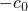
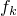
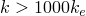
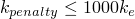
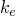

# 38.1.2 Abaqus/Standard中的接触约束强制执行方法


**产品：** Abaqus/Standard  Abaqus/CAE

##### **参考**

- ["在Abaqus/Standard中定义通用接触相互作用，" 第36.2.1节"](pt09ch36s02aus139.md)
- ["在Abaqus/Standard中定义接触对，" 第36.3.1节"](pt09ch36s03aus145.md)
- ["机械接触属性概述，" 第37.1.1节"](pt09ch37s01aus165.md)
- ["接触压力-闭合关系，" 第37.1.2节"](pt09ch37s01aus166.md)
- [*SURFACE BEHAVIOR*](../key/key-link.md#usb-kws-hsurfacebehavior)
- [*CONTACT CONTROLS*](../key/key-link.md#usb-kws-hcontactcontrols)
- ["定义通用接触，" Abaqus/CAE用户指南第15.13.1节](../usi/usi-link.md#usi-itn-help-general)
- ["定义面到面接触，" Abaqus/CAE用户指南第15.13.7节](../usi/usi-link.md#usi-itn-help-surftosurf)
- ["定义接触相互作用属性，" Abaqus/CAE用户指南第15.14.1节](../usi/usi-link.md#usi-itn-property-contact)

### 概述

Abaqus/Standard中的接触约束强制执行方法：
- 作为曲面相互作用定义的一部分进行指定；
- 确定如何在分析中数值解析由物理压力-闭合关系（参见["接触压力-闭合关系，" 第37.1.2节"](pt09ch37s01aus166.md)）施加的接触约束；
- 可以严格强制执行或近似物理压力-闭合关系；
- 可以修改以解决由于过度约束而导致的收敛困难；和
- 有时利用拉格朗日乘子自由度。

本节详细讨论Abaqus/Standard中法向接触的可用约束强制执行方法。Abaqus/Standard中的摩擦约束强制执行方法独立于法向接触约束的强制执行方法分配，并在["摩擦行为，" 第37.1.5节"](pt09ch37s01aus169.md)中讨论。拉格朗日乘子在接触计算中的使用也在本节中介绍。

### Abaqus/Standard中可用的约束强制执行方法

Abaqus/Standard提供三种接触约束强制执行方法：
- 直接方法尝试严格强制执行每个约束的给定压力-闭合行为，无需近似或使用增强迭代。
- 惩罚方法是对硬接触的刚性近似。
- 增强拉格朗日方法使用与惩罚方法相同类型的刚性近似，但也使用增强迭代来提高近似的准确性。

默认约束强制执行方法取决于相互作用特性，如下所示：
- 如果"硬"压力-闭合关系生效，则默认使用有限滑动、面到面接触（包括通用接触）的惩罚方法。
- 如果"硬"压力-闭合关系生效，则默认使用具有节点到曲面离散化的三维自接触的增强拉格朗日方法。
- 在所有其他情况下，直接方法是默认值。

选择接触强制执行方法时，应考虑以下因素：
- 直接方法必须用于具有"软化"压力-闭合关系的接触对（参见["接触压力-闭合关系，" 第37.1.2节"](pt09ch37s01aus166.md)）。
- 直接方法严格强制执行与约束公式一致的指定压力-闭合行为
- 惩罚或增强拉格朗日约束强制执行方法有时可以提供更有效的解决方案（通常由于每次迭代的计算成本降低以及每个分析的迭代总数减少），代价是（通常是小的）求解精度牺牲。参见下面关于惩罚和增强拉格朗日方法的讨论。
- 应避免由于重叠接触定义或接触与其他约束类型的组合而导致的过度约束（参见["过度约束检查，" 第35.6.1节"](pt08ch35s06aus138.md)），用于直接强制的硬接触。

### 直接方法

直接方法严格强制执行每个约束的给定压力-闭合行为，无需近似或使用增强迭代。

| **输入文件用法：** | 同时使用以下两个选项： |
| --- | --- |
| | ``` [*SURFACE INTERACTION*](../key/key-link.md#usb-kws-hsurfaceinteraction), NAME=*interaction_property_name* [*SURFACE BEHAVIOR*](../key/key-link.md#usb-kws-hsurfacebehavior), DIRECT ``` |

| **Abaqus/CAE用法：** | 相互作用模块：接触属性编辑器：****机械********法向行为****：****约束强制执行方法****：****直接（标准）** |
| --- | --- |

#### 直接方法用于硬压力-闭合行为

直接方法可用于严格强制执行"硬"压力-闭合关系。在这种情况下，始终使用拉格朗日乘子。

#### 直接方法用于软化压力-闭合关系

直接方法是可用于强制执行"软化"压力-闭合关系的唯一方法。直接方法可用于建模软化接触行为，无论接触公式的类型如何；但是，使用容易过度约束的接触公式建模刚性界面行为可能很困难。如果压力-闭合曲线的斜率超过底层元素刚度的1000倍（由Abaqus/Standard计算），则使用拉格朗日乘子；否则，在没有拉格朗日乘子的情况下强制执行约束。因此，拉格朗日乘子的使用取决于接触压力。软化压力-闭合关系在["接触压力-闭合关系，" 第37.1.2节"](pt09ch37s01aus166.md)中有更详细的讨论。

#### 直接方法的局限性

由于对接触约束的严格解释，使用直接强制方法的硬接触模拟容易出现过度约束问题。因此，具有节点到曲面离散化的三维自接触定义的接触对不能使用直接强制的硬接触。在这种情况下，您可以使用替代强制方法或具有软化压力-闭合关系的直接方法。

您可能会在对称主从接触对（参见["使用对称主从接触对改善接触建模"中的"在Abaqus/Standard中定义接触对，" 第36.3.1节"](pt09ch36s03aus145.md#usb-cni-acontactpair-symm)）中遇到类似的过度约束问题。尽管直接强制的硬接触是这些接触对的默认值，但建议您使用替代强制方法或软化接触关系。

某些二阶元素面在直接强制的硬接触关系中表现不佳。有关此问题的详细信息，请参阅["Abaqus/Standard中与接触建模相关的常见困难"中的"具有二阶面和节点到曲面公式的三维曲面，" 第39.1.2节"](pt09ch39s01aus184.md#usb-cni-acontacttrouble-3dsurf)。

### 惩罚方法

惩罚方法近似硬压力-闭合行为。使用此方法，接触力与穿透距离成正比，因此会发生一定程度的穿透。惩罚方法的优点包括：
- 与惩罚方法相关的数值软化可以减轻过度约束问题并减少分析所需的迭代次数。
- 可以实现惩罚方法而不使用拉格朗日乘子，这允许提高求解器效率。

#### 选择惩罚方法

Abaqus/Standard提供惩罚方法的线性和非线性变体。使用线性惩罚方法，所谓的惩罚刚度是恒定的，因此压力-闭合关系是线性的。使用非线性惩罚方法，惩罚刚度在线性增加的低初始刚度恒定区域和高最终刚度恒定区域之间增加，导致非线性压力-闭合关系。默认惩罚方法是线性的。

[图38.1.2-1](pt09ch38s01aus178.md#exx-surface-behavior-nonlpen2)显示了在默认设置下线性和非线性压力-闭合关系的比较。

**图38.1.2-1** 在默认设置下线性和非线性压力-闭合关系的比较。


##### 线性惩罚方法

使用线性惩罚方法时，Abaqus/Standard默认将惩罚刚度设置为底层元素刚度的10倍。您可以缩放或重新分配惩罚刚度，如下面["修改线性惩罚刚度](pt09ch38s01aus178.md#usb-cni-acontactconstraints-mod-lin-stiff)"中所讨论的。默认惩罚刚度导致的接触穿透在大多数情况下不会显著影响结果；但是，这些穿透有时可能导致一定程度的应力不准确（例如，使用位移控制加载和粗网格时）。线性惩罚方法是有限滑动、面到面接触公式的默认方法。

| **输入文件用法：** | 使用以下两个选项指定线性惩罚方法： |
| --- | --- |
| | ``` [*SURFACE INTERACTION*](../key/key-link.md#usb-kws-hsurfaceinteraction), NAME=*interaction_property_name* [*SURFACE BEHAVIOR*](../key/key-link.md#usb-kws-hsurfacebehavior), PENALTY=LINEAR ``` |

| **Abaqus/CAE用法：** | 相互作用模块：接触属性编辑器：****机械********法向行为****：****约束强制执行方法****：****惩罚（标准）****，****行为****：****线性** |
| --- | --- |

##### 非线性惩罚方法

使用非线性惩罚方法，压力-闭合曲线有四个不同的区域，如[图38.1.2-2](pt09ch38s01aus178.md#exx-surface-behavior-nonlpen1)所示。

**图38.1.2-2** 非线性惩罚压力-闭合关系。


- 非主动接触区域：对于大于的间隙，接触压力保持为零。的默认设置为零。
- 恒定初始惩罚刚度区域：对于到范围内的穿透（闭合），接触压力线性变化，斜率等于。默认初始惩罚刚度等于底层元素刚度。的默认值是Abaqus/Standard计算的代表典型网格面大小的特征长度的1%。
- 刚化区域：对于到范围内的穿透，接触压力二次变化，而惩罚刚度从线性增加到。默认最终惩罚刚度等于底层元素刚度的100倍。的默认值是用于计算（如上所述）的相同特征长度的3%。
- 恒定最终惩罚刚度区域：对于大于的穿透，接触压力线性变化，斜率等于。

低初始惩罚刚度通常会导致牛顿迭代更好的收敛和更好的稳健性，而较高的最终刚度在接触压力增加时将过闭合保持在可接受的水平。

| **输入文件用法：** | 使用以下两个选项指定非线性惩罚方法： |
| --- | --- |
| | ``` [*SURFACE INTERACTION*](../key/key-link.md#usb-kws-hsurfaceinteraction), NAME=*interaction_property_name* [*SURFACE BEHAVIOR*](../key/key-link.md#usb-kws-hsurfacebehavior), PENALTY=NONLINEAR ``` |

| **Abaqus/CAE用法：** | 相互作用模块：接触属性编辑器：****机械********法向行为****：****约束强制执行方法****：****惩罚（标准）****，****行为****：****非线性** |
| --- | --- |

#### 修改惩罚刚度

如果您有兴趣研究修改惩罚刚度的影响，通常建议您考虑数量级的变化。默认情况下，将惩罚刚度提高到上述阈值以上将引入拉格朗日乘子。

##### 修改线性惩罚刚度

作为曲面行为定义的一部分，您可以指定线性惩罚刚度，通过指定接触压力为零的间隙来移动压力-闭合关系，或按因子缩放默认或指定的惩罚刚度。

| **输入文件用法：** | 在曲面行为定义中修改线性惩罚行为： |
| --- | --- |
| | ``` [*SURFACE BEHAVIOR*](../key/key-link.md#usb-kws-hsurfacebehavior), PENALTY=LINEAR *penalty stiffness*, *clearance at zero pressure*, *factor* ``` |

| **Abaqus/CAE用法：** | 在曲面行为定义中修改线性惩罚行为： |
| --- | --- |
| | 相互作用模块：接触属性编辑器：****机械********法向行为****：****约束强制执行方法：****惩罚（标准）****，****行为：****线性****，****刚度值：****指定：****惩罚刚度****，****刚度比例因子：****因子****，****接触压力为零时的间隙：****零压力时的间隙** |

##### 修改非线性惩罚刚度

作为曲面行为定义的一部分，您可以指定最终非线性惩罚刚度，通过指定接触压力为零的间隙来移动压力-闭合关系，或按因子缩放默认或指定的惩罚刚度。此外，您可以直接控制初始与最终惩罚刚度的比率、比例因子以及决定和的比率。

| **输入文件用法：** | 在曲面行为定义中修改非线性惩罚行为： |
| --- | --- |
| | ``` [*SURFACE BEHAVIOR*](../key/key-link.md#usb-kws-hsurfacebehavior), PENALTY=NONLINEAR *final penalty stiffness*, *clearance at zero pressure*, *factor*, *upper quadratic limit scale factor*, *ratio of initial penalty stiffness over final penalty stiffness*, *lower quadratic limit ratio* ``` |

| **Abaqus/CAE用法：** | 在曲面行为定义中修改非线性惩罚行为： |
| --- | --- |
| | 相互作用模块：接触属性编辑器：****机械********法向行为****：****约束强制执行方法：****惩罚（标准）****，****行为：****非线性****，****最大刚度值：****指定：****最终惩罚刚度****，****刚度比例因子：****因子****，****初始/最终刚度比：****初始惩罚刚度与最终惩罚刚度的比率****，****上二次极限比例因子：****上二次极限比例因子****，****下二次极限比：****下二次极限比****，****接触压力为零时的间隙：****零压力时的间隙** |

##### 在每步基础上缩放惩罚刚度

您也可以在每步基础上缩放惩罚刚度，这将作为曲面行为定义的一部分指定的比例因子的额外乘数。

| **输入文件用法：** | 在每步基础上缩放惩罚刚度： |
| --- | --- |
| | ``` [*CONTACT CONTROLS*](../key/key-link.md#usb-kws-hcontactcontrols), STIFFNESS SCALE FACTOR=*factor* ``` |

| **Abaqus/CAE用法：** | 在每步基础上缩放惩罚刚度： |
| --- | --- |
| | 相互作用模块：Abaqus/Standard接触控制编辑器：****增强拉格朗日****：****刚度比例因子：****因子** |

##### 在第一个增量迭代中调整惩罚刚度

如果在初始加载时接触状态在大部分接触区域发生变化，则分析第一个增量中出现收敛困难是很常见的。一种在不影响准确性的情况下提高收敛行为的方法是：在第一个增量的早期迭代中使用降低的惩罚刚度，并在第一个增量的最终迭代和后续增量的所有迭代中返回默认惩罚刚度。在早期迭代中使用降低的惩罚刚度有助于稳健地找到近似的接触状态分布，而后期迭代的目标是找到准确的解决方案，该解决方案作为第一个增量的收敛解决方案报告。

| **输入文件用法：** | 在第一个增量内缩放惩罚刚度： |
| --- | --- |
| | ``` [*CONTACT CONTROLS*](../key/key-link.md#usb-kws-hcontactcontrols), STIFFNESS SCALE FACTOR=USER ADAPTIVE ``` |

#### 惩罚方法的局限性

惩罚方法不能用于脱粘曲面。

如果指定了惩罚方法，在具有以下过程的分析步骤中始终使用拉格朗日乘子：
- 设计灵敏度分析（参见["设计灵敏度分析，" 第19.1.1节"](pt04ch19s01aus107.md)）
- 直接稳态动态分析（参见["直接求解稳态动态分析，" 第6.3.4节"](pt03ch06s03at09.md)）
- 准牛顿方法（参见["非线性问题的收敛准则，" 第7.2.3节"](pt03ch07s02aus51.md)）

如果使用表面元素在外子结构外部定义接触曲面（参见["如果存在子结构时的接触建模，" 第36.3.9节"](pt09ch36s03aus153.md)），Abaqus/Standard将底层元素刚度解释为零。这可能导致确定默认惩罚刚度困难，并可能在分析期间导致数值问题。

### 增强拉格朗日方法

线性惩罚方法可以在增强迭代方案中使用，以降低穿透距离。所谓的增强拉格朗日方法仅适用于硬压力-闭合关系。以下描述了使用此方法每个增量中发生的序列：

1. Abaqus/Standard使用惩罚方法找到收敛解。
2. 如果从节点穿透主曲面超过指定的穿透容差，则接触压力被"增强"，并执行另一系列迭代直到再次达到收敛。
3. Abaqus/Standard继续增强接触压力并找到相应的收敛解，直到实际穿透小于穿透容差。

增强拉格朗日方法在某些情况下可能需要额外迭代；但是，此方法可以使接触条件的解析更容易，避免过度约束问题，同时保持较小的穿透。增强拉格朗日方法是具有节点到曲面离散化的三维自接触的默认方法。

默认穿透容差是特征界面长度的千分之一，但以下情况除外：
- 如果您指定惩罚刚度比例因子小于1.0（使用下面讨论的界面），Abaqus/Standard将自动按因子缩放默认穿透容差（将大于或等于1.0）；
- 有限滑动、面到面接触的默认穿透容差是特征界面长度的百分之五，受上一条bullet中讨论的缩放约束。

增强拉格朗日方法的默认惩罚刚度是底层元素刚度的1000倍。如果惩罚刚度超过Abaqus/Standard计算的底层元素刚度的1000倍，则对增强拉格朗日方法使用拉格朗日乘子；否则，不使用拉格朗日乘子。因此，增强拉格朗日方法不使用拉格朗日乘子（具有默认惩罚刚度时）。

| **输入文件用法：** | 使用以下两个选项： |
| --- | --- |
| | ``` [*SURFACE INTERACTION*](../key/key-link.md#usb-kws-hsurfaceinteraction), NAME=*interaction_property_name* [*SURFACE BEHAVIOR*](../key/key-link.md#usb-kws-hsurfacebehavior), AUGMENTED LAGRANGE ``` |

| **Abaqus/CAE用法：** | 相互作用模块：接触属性编辑器：****机械********法向行为****：****约束强制执行方法：****增强拉格朗日（标准）** |
| --- | --- |

#### 修改增强拉格朗日方法的穿透容差

您可以通过指定绝对或相对穿透容差来修改增强拉格朗日方法的穿透容差。相对穿透容差是相对于Abaqus/Standard计算的特征长度指定的。上面讨论了默认穿透容差。如果您将惩罚刚度比例因子设置为小于1.0的值（上面也讨论过），默认穿透容差会自动增加；但是，Abaqus/Standard不会调整任何直接指定的穿透容差。选择非常小的穿透容差可能导致过多的增强迭代。

| **输入文件用法：** | 指定绝对穿透容差： |
| --- | --- |
| | ``` [*CONTACT CONTROLS*](../key/key-link.md#usb-kws-hcontactcontrols), ABSOLUTE PENETRATION TOLERANCE=*tolerance* ``` 指定相对穿透容差： ``` [*CONTACT CONTROLS*](../key/key-link.md#usb-kws-hcontactcontrols), RELATIVE PENETRATION TOLERANCE=*tolerance* ``` |

| **Abaqus/CAE用法：** | 相互作用模块：Abaqus/Standard接触控制编辑器：****增强拉格朗日****：****穿透容差：绝对：****容差**或****相对：****容差** |
| --- | --- |

#### 修改增强拉格朗日方法的惩罚刚度

与惩罚方法一样，您可以在曲面行为定义中指定惩罚刚度，通过指定接触压力为零的间隙来移动压力-闭合关系，或按因子缩放默认或指定的惩罚刚度。您也可以在每步基础上缩放惩罚刚度，这将作为曲面行为定义的一部分指定的比例因子的额外乘数。选择非常低的惩罚刚度可能导致过多的增强迭代。

| **输入文件用法：** | 在曲面行为定义中修改惩罚行为： |
| --- | --- |
| | ``` [*SURFACE BEHAVIOR*](../key/key-link.md#usb-kws-hsurfacebehavior), AUGMENTED LAGRANGE *penalty stiffness*, *clearance at zero pressure*, *factor* ``` 在每步基础上缩放惩罚刚度： ``` [*CONTACT CONTROLS*](../key/key-link.md#usb-kws-hcontactcontrols), STIFFNESS SCALE FACTOR=*factor* ``` |

| **Abaqus/CAE用法：** | 在曲面行为定义中修改惩罚行为： |
| --- | --- |
| | 相互作用模块：接触属性编辑器：****机械********法向行为****：****约束强制执行方法：****增强拉格朗日（标准）****，****刚度值：****指定：****惩罚刚度****，****刚度比例因子：****因子****，****接触压力为零时的间隙：****零压力时的间隙** 在每步基础上缩放惩罚刚度： 相互作用模块：Abaqus/Standard接触控制编辑器：****增强拉格朗日****：****刚度比例因子：****因子** |

#### 修改增强拉格朗日方法的允许增强次数

您可以定义增强拉格朗日方法的允许增强次数。

| **输入文件用法：** | ``` [*CONTROLS*](../key/key-link.md#usb-kws-hcontrols), PARAMETERS=TIME INCREMENTATION , , , , , , , , , , , ,  ``` |
| --- | --- |

| **Abaqus/CAE用法：** | 在Abaqus/CAE中定义增强拉格朗日方法的允许增强次数不受支持。 |
| --- | --- |

#### 增强拉格朗日方法的局限性

增强拉格朗日方法不能用于脱粘曲面。

如果指定了增强拉格朗日方法，在具有以下过程的分析步骤中始终使用拉格朗日乘子：
- 设计灵敏度分析（参见["设计灵敏度分析，" 第19.1.1节"](pt04ch19s01aus107.md)）
- 直接稳态动态分析（参见["直接求解稳态动态分析，" 第6.3.4节"](pt03ch06s03at09.md)）
- 准牛顿方法（参见["非线性问题的收敛准则，" 第7.2.3节"](pt03ch07s02aus51.md)）

如果使用表面元素在外子结构外部定义接触曲面（参见["如果存在子结构时的接触建模，" 第36.3.9节"](pt09ch36s03aus153.md)），Abaqus/Standard将底层元素刚度解释为零。这可能导致确定默认惩罚刚度困难，并可能在分析期间导致数值问题。

### 各种方法对拉格朗日乘子自由度的使用

使用拉格朗日乘子强制执行接触约束可能会显著增加求解成本，但它们还防止了与高接触刚度相关的病态数值错误。Abaqus/Standard自动选择约束方法是否使用拉格朗日乘子，基于接触刚度与底层元素刚度的比较。[表38.1.2-1](pt09ch38s01aus178.md#table-lagrange-defaults)总结了拉格朗日乘子的使用。惩罚和增强拉格朗日近似的硬接触相关联的默认接触刚度不使用拉格朗日乘子。与接触相关的任何拉格朗日乘子仅存在于主动接触约束，因此方程的数量可能随着接触状态的变化而变化。

**表38.1.2-1** 约束执行方法中拉格朗日乘子的使用。
| 约束方法 | 使用拉格朗日乘子 |
| --- | --- |
| 是 | 否1 |
| 直接，硬接触 | 始终 | 从不 |
| 直接，指数软化接触 | 如果 | 如果 |
| 直接，线性软化接触 | 如果 | 如果 |
| 直接，表格软化接触 | 如果 | 如果 |
| 惩罚，硬接触 | 如果 | 如果 |
| 增强拉格朗日，硬接触 | 如果 | 如果 |
|  = 压力-闭合关系斜率 |
|  = 惩罚刚度 |
|  = 底层元素刚度 |
| 1在以下情况下，无论约束执行方法或刚度如何，始终使用拉格朗日乘子：设计灵敏度分析、直接稳态动力学分析、使用准牛顿方法的分析。 |


