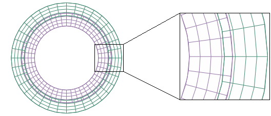

# 38.1.3 Abaqus/Standard中接触曲面的平滑


**产品：** Abaqus/Standard  Abaqus/CAE

##### **参考**

- ["在Abaqus/Standard中定义通用接触相互作用，" 第36.2.1节"](pt09ch36s02aus139.md)
- ["在Abaqus/Standard中定义接触对，" 第36.3.1节"](pt09ch36s03aus145.md)
- [*CONTACT*](../key/key-link.md#usb-kws-hcontact)
- [*CONTACT PAIR*](../key/key-link.md#usb-kws-hcontactpair)
- [*SURFACE PROPERTY ASSIGNMENT*](../key/key-link.md#usb-kws-hsurfpropassign)
- [*SURFACE SMOOTHING*](../key/key-link.md#usb-kws-msurfacesmoothing)

### 概述

使用有限元方法，弯曲的几何曲面自然地被近似为一组连接的网格面元素面的faceted组。使用faceted曲面几何形状而不是真实曲面几何形状可能导致接触相互作用中的接触应力不准确，特别是在faceted与真实曲面之间的差异大小相对于接触部件的变形不小的情况下。接触应力输出在许多Abaqus/Standard应用中至关重要；例如，接触压力的分布可用于识别磨损模式和峰值压力值，以确定机械零件的相对寿命。此外，曲面网格边界处曲面法线方向的不连续可能导致收敛困难。

Abaqus/Standard提供了克服与接触相互作用中faceted曲面相关的精度和收敛困难的技术。这些技术允许具有不连续曲面法线的离散曲面在分析过程中更接近地近似具有连续法线的平滑曲面的行为。节点到曲面接触中使用的平滑技术不同于面到面和通用接触中使用的平滑技术：
- 节点到曲面接触平滑默认应用，影响整个主曲面。
- 面到面接触平滑默认不应用，但可以应用于几何形状大致轴对称的任何曲面区域。

面到面接触通常给出最准确的结果。

### 节点到曲面接触对的主曲面平滑

节点到曲面接触对中的曲面平滑提高了数值稳定性，有时提高了求解精度。从节点沿主曲面移动时容易"卡住"在尖角上，导致收敛困难。由于这种行为，Abaqus/Standard自动平滑节点到曲面接触对中的主曲面。此平滑技术重新计算网格边缘沿线的主曲面法线，并根据曲面类型可能影响曲面几何形状。节点到曲面接触公式平滑的详细信息在["Abaqus/Standard中的接触公式"中的"为有限滑动、节点到曲面公式平滑主曲面"第38.1.1节"](pt09ch38s01aus177.md#usb-cni-acontactpairform-smoothing)和["Abaqus/Standard中的接触公式"中的"使用小滑动跟踪方法"第38.1.1节"](pt09ch38s01aus177.md#usb-cni-acontactpairform-smsliding)中讨论。

### 面到面接触的接触曲面平滑

在面到面接触中，平滑曲面通常不是确保分析收敛所必需的；因此，默认情况下，这些曲面不应用平滑。但是，可以使用可选的平滑技术来提高轴对称（或近似轴对称）曲面在面到面接触相互作用中的接触应力和压力精度。

面到面接触平滑可以应用于特定曲面区域。这些区域必须大致轴对称（曲面上的所有点大致对称于单个轴）、大致球形（曲面上的所有点大致距单个点等距）或部分toroidal曲面。[图38.1.3-1](pt09ch38s01aus179.md#usb-cni-smooth-surfs)中的销插入模型可以从面到面接触平滑中受益：销的主体和孔是轴对称曲面，销的头部是球形曲面。如果曲面不是完美轴对称或球形的，面到面接触平滑也是有效的；例如，如果销体略微椭圆形。

**图38.1.3-1** 具有曲面平滑的面到面接触模型。


#### 对面到面接触对应用接触平滑

通过创建曲面平滑定义来启用接触对的面到面接触平滑。接触对定义引用此平滑定义以在接触公式中应用几何校正（模型的物理几何形状不变）。

曲面平滑定义列出了接触对曲面中必须平滑的所有faceted区域，以及应应用于每个区域的几何校正方法。可以采用三种几何校正方法：
- 圆周平滑方法适用于在二维中近似圆的一部分或在三维中近似旋转曲面的一部分的曲面。
- 球面平滑方法适用于在三维中近似球的一部分的曲面。
- toroidal平滑方法适用于在三维中近似环面的一部分的曲面（即，围绕轴旋转的圆弧）。

每个面到面接触对引用单个平滑定义；因此，平滑定义必须列出接触对的所有平滑区域和适用于每个区域的几何校正方法。几何校正可以应用于主曲面和从曲面；您也可以将校正应用于每个曲面的选定区域。曲面平滑定义可以包括多个区域，每个区域使用不同的几何校正方法。对于每个区域，您必须指定适当的几何校正方法和近似旋转轴（对于圆周或toroidal平滑）或近似球面中心（对于球面平滑）。对于toroidal平滑，您还必须指定圆弧中心距旋转轴的距离，连接点（Xa, Ya, Za）和圆弧中心的线应垂直于旋转轴。

| **输入文件用法：** | 使用以下两个选项来应用面到面接触平滑： |
| --- | --- |
| | ``` [*CONTACT PAIR*](../key/key-link.md#usb-kws-hcontactpair), GEOMETRIC CORRECTION=*smoothing_name* [*SURFACE SMOOTHING*](../key/key-link.md#usb-kws-msurfacesmoothing), NAME=*smoothing_name* *data lines to define smoothing regions (see below)* Use the following data line to apply circumferential smoothing to surface regions with an axis of symmetry passing through points (Xa, Ya, Za) and (Xb, Yb, Zb): *slave_region*, *master_region*, CIRCUMFERENTIAL, *Xa*, *Ya*, *Za*, *Xb*, *Yb*, *Zb* Use the following data line to apply spherical smoothing to surface regions with a spherical center at point (Xa, Ya, Za): *slave_region*, *master_region*, SPHERICAL, *Xa*, *Ya*, *Za* Use the following data line to apply toroidal smoothing to surface regions with an axis of symmetry passing through points (Xa, Ya, Za) and (Xb, Yb, Zb) with the center of the revolved circular arc at a distance *R* from the axis of symmetry: *slave_region*, *master_region*, TOROIDAL, *Xa*, *Ya*, *Za*, *Xb*, *Yb*, *Zb*, *R* Repeat the data lines as many times as necessary to define the appropriate geometry corrections for all surfaces in the contact pair. ``` |

| **Abaqus/CAE用法：** | Abaqus/CAE可以自动识别接触相互作用中将从接触平滑中受益的任何圆周、球形或toroidal曲面，并应用必要的几何校正方法。 |
| --- | --- |
| | 相互作用模块：接触相互作用编辑器：****曲面平滑****：****在适用时自动平滑3D几何曲面**** 面到面接触平滑不能应用于孤儿网格模型上的曲面。 |

##### 示例

为了提高[图38.1.3-1](pt09ch38s01aus179.md#usb-cni-smooth-surfs)中模型的接触压力精度，可以对主曲面和从曲面应用接触平滑。销（从曲面）需要两种不同的几何校正方法，因此定义了与从曲面区域对应的附加曲面。为销的尖端定义了球面平滑。由于销体和孔共享旋转轴，因此对这两个曲面应用单一圆周平滑技术。即使销和孔的横截面形状偏离完美圆形，此曲面平滑定义也适用。

```
[*CONTACT PAIR*](../key/key-link.md#usb-kws-hcontactpair), TYPE=SURFACE TO SURFACE, INTERACTION=FRICTION1, 
   GEOMETRIC CORRECTION=SMOOTH1
PIN, HOLE
[*SURFACE INTERACTION*](../key/key-link.md#usb-kws-hsurfaceinteraction), NAME=FRICTION1
[*SURFACE SMOOTHING*](../key/key-link.md#usb-kws-msurfacesmoothing), NAME=SMOOTH1
PIN_TIP, , SPHERICAL, *X*b, *Y*b, *Z*b
PIN_BODY, HOLE, CIRCUMFERENTIAL, *X*a, *Y*a, *Z*a, *X*b, *Y*b, *Z*b
```

#### 对通用接触曲面应用接触平滑

可以使用曲面属性分配为通用接触域中的曲面指定接触平滑。单个曲面属性分配指定所有要平滑的曲面以及每个曲面适当的几何校正方法。通用接触使用与接触对相同的三种几何校正方法：
- 圆周平滑方法适用于在二维中近似圆的一部分或在三维中近似旋转曲面的一部分的曲面。
- 球面平滑方法适用于在三维中近似球的一部分的曲面。
- toroidal平滑方法适用于在三维中近似环面的一部分的曲面（即，围绕轴旋转的圆弧）。

对于每个曲面，您必须指定适当的几何校正方法和近似旋转轴（对于圆周或toroidal平滑）或近似球面中心（对于球面平滑）。对于toroidal平滑，您还必须指定圆弧中心距旋转轴的距离，连接点（Xa, Ya, Za）和圆弧中心的线应垂直于旋转轴。

| **输入文件用法：** | ``` [*SURFACE PROPERTY ASSIGNMENT*](../key/key-link.md#usb-kws-hsurfpropassign), PROPERTY=GEOMETRIC CORRECTION *data lines to define smoothing regions (see below)* Use the following data line to apply circumferential smoothing to a surface with an axis of symmetry passing through points (Xa, Ya, Za) and (Xb, Yb, Zb): *surface*, CIRCUMFERENTIAL, *Xa*, *Ya*, *Za*, *Xb*, *Yb*, *Zb* Use the following data line to apply spherical smoothing to a surface with a spherical center at point (Xa, Ya, Za): *surface*, SPHERICAL, *Xa*, *Ya*, *Za* Use the following data line to apply toroidal smoothing to a surface with an axis of symmetry passing through points (Xa, Ya, Za) and (Xb, Yb, Zb) with the center of the revolved circular arc at a distance *R* from the axis of symmetry: *surface*, TOROIDAL, *Xa*, *Ya*, *Za*, *Xb*, *Yb*, *Zb*, *R* Repeat the data lines as many times as necessary to define the appropriate geometry corrections for all surfaces in the contact domain. ``` |
| --- | --- |

| **Abaqus/CAE用法：** | 接触曲面平滑只能应用于Abaqus/CAE中的本机几何模型。默认情况下，Abaqus/CAE自动检测通用接触域中可以平滑的所有圆周、球形和toroidal曲面，并应用适当的平滑。 |
| --- | --- |
| | 使用以下选项防止模型自动曲面平滑：相互作用模块：****创建相互作用****：****通用接触（标准）****：****曲面属性****：****曲面平滑分配：编辑****：关闭****自动为几何面分配平滑**** 使用以下选项手动将平滑应用于曲面：相互作用模块：****创建相互作用****：****通用接触（标准）****：****曲面属性****：****曲面平滑分配：编辑****：选择曲面，单击箭头将曲面转移到平滑分配列表。在****平滑选项****列中，选择****旋转****以应用圆周平滑，选择****球面****以应用球面平滑，选择****toroidal****以应用toroidal平滑，或选择****无****以防止曲面平滑。 |

#### 使用面到面接触平滑的注意事项

面到面接触平滑技术假设曲面节点的初始位置位于真实初始曲面几何形状上，高阶元素的边中节点除外。即使高阶元素的边中节点不在真实初始几何形状上，此平滑技术仍然有效（使用Abaqus/CAE网格化的模型始终将边中节点放置在真实初始几何形状上，但其他网格前处理器可能不是这种情况）。

面到面接触平滑的效果往往在涉及小变形和接触区域一阶元素粗网格离散化的分析中最为显著；但是，即使网格相当精细或使用高阶元素，接触应力解决方案也常见显著改善。对于大变形分析，此平滑技术通常对解决方案影响不大。但是，在某些情况下，平滑会在大变形后降低解决方案准确性；因此，不建议将面到面接触平滑用于大变形分析。面到面接触平滑的有效性不会因接触曲面之间的相对运动而降低；例如，该平滑技术适用于涉及大滑动但小变形的情况。

### 接触曲面平滑的效果

接触曲面平滑的影响可以通过一个简单的同心圆柱体过盈配合模型来证明，该模型使用不同大小的一阶元素建模，如[图38.1.3-2](pt09ch38s01aus179.md#usb-cni-rings)所示。真实曲面几何形状与faceted曲面几何形状之间的差异导致接触压力解决方案中出现噪声。如果过盈距离和 resulting 变形距离相对于几何差异较小，则此噪声可能对解决方案的准确性产生重大影响。尽管面到面接触通常比节点到面接触更好地处理这些差异，但最大偏差与分析压力解决方案相差高达100%并不罕见。噪声的影响在较大变形中变得不那么明显，但永远不会完全消除。

**图38.1.3-2** 过盈配合模型的初始网格几何形状。



使用面到面接触对建模过盈配合并使用圆周接触平滑始终产生低噪声压力结果，无论过盈距离大小如何，都在分析解决方案的3%以内。小变形分析的效果显著，但即使对于较大变形也能观察到改善。

对于节点到面接触对，将平滑分数增加到最大值0.5可在二维模型中略微减少压力解决方案中的噪声。在三维模型中增加平滑因子对精度影响不大，因为三维节点到曲面平滑不对物理曲面进行平滑；有关更多信息，请参见["Abaqus/Standard中的接触公式"中的"为有限滑动、节点到曲面公式平滑主曲面"第38.1.1节"](pt09ch38s01aus177.md#usb-cni-acontactpairform-smoothing)。


