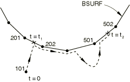
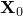
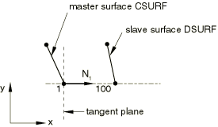
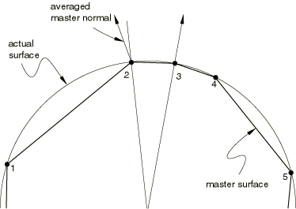
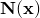
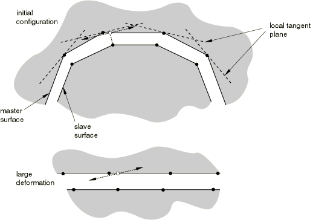

# 38.2.2 Abaqus/Explicit中接触对的接触公式


**产品：** Abaqus/Explicit  Abaqus/CAE

##### **参考**

- ["曲面概述，" 第2.3.1节"](pt01ch02s03aus16.md)
- ["在Abaqus/Explicit中定义接触对，" 第36.5.1节"](pt09ch36s05aus160.md)
- [*CONTACT PAIR*](../key/key-link.md#usb-kws-hcontactpair)
- ["定义面到面接触，" Abaqus/CAE用户指南第15.13.7节"](../usi/usi-link.md#usi-itn-help-surftosurf)

### 概述

Abaqus/Explicit中接触对算法的接触公式包括：
- 接触曲面权重（平衡或纯主从）；和
- 滑动公式（有限、小或无穷小）。

您还可以指定用于在接触对中强制执行接触约束的方法；这些方法在["Abaqus/Explicit中的接触约束强制执行方法，" 第38.2.3节"](pt09ch38s02aus182.md)中讨论。

### 接触曲面权重

纯主从和平衡主从接触算法在Abaqus/Explicit中都可用。默认情况下，Abaqus/Explicit将根据形成接触对的两个曲面的性质以及是否使用运动学或惩罚强制执行接触约束来决定对任何给定接触对使用哪种算法。在某些情况下，您可以覆盖默认值。

#### 接触对权重的默认选择

默认情况下，Abaqus/Explicit在以下情况下使用纯主从、运动学接触算法（以下每种情况中列出的第一个曲面被指定为主曲面）：
- 刚性曲面接触变形曲面时；
- 基于元素的曲面接触基于节点的曲面时；或
- 基于连续体元素的曲面接触基于壳或膜元素的曲面时。

默认情况下，Abaqus/Explicit在以下情况下使用平衡主从、运动学接触算法：
- 当单个曲面接触自身时（称为自接触或单曲面接触）；或
- 当两个具有相似元素网格化的变形曲面（也就是说，两个曲面都有壳或膜，或者都有连续体元素）相互接触时。

如果指定了惩罚接触算法，Abaqus/Explicit在以下情况下默认使用纯主从权重（以下每种情况中列出的第一个曲面被指定为主曲面）：
- 分析刚性曲面接触变形曲面时；或
- 分析刚性曲面或基于元素的曲面接触基于节点的曲面时。

如果指定了惩罚接触算法，Abaqus/Explicit在以下情况下选择平衡主从权重：
- 当单个曲面接触自身时（称为自接触或单曲面接触）；或
- 当两个基于元素的曲面相互接触时。

平衡主从权重意味着两组接触计算产生的校正被平等加权。

##### 修改接触对权重的默认选择

选择运动学接触方法时，仅当两个独立的变形、基于元素的曲面相互接触时（对应于上一节中给出的运动学接触列表中的最后一种情况），您可以覆盖默认的接触对权重。

在决定是否覆盖默认选择时，应考虑以下方面。首先，平衡主从接触算法需要更多计算时间，但通常更准确。其次，当密度相差数量级时，密度较小的物体应该是纯从曲面。如果密度大得多的物体上的曲面被加权为从曲面，则可能产生接触诱导噪声。最后，为了避免硬接触的大量穿透，具有较细网格的曲面不应该是纯主从接触对中的主曲面。

选择惩罚接触方法时，您可以选择指定纯主从权重以减少计算时间。当两个原本平的曲面相互接触时，如果较精细的曲面作为从曲面，与平衡主从权重相比，纯主从权重可能产生更均匀的穿透距离分布（从而产生更均匀的压力分布）。如果接触曲面的网格密度差异显著，这一点会特别明显——使用平衡权重时，穿透在粗网格曲面节点附近会较小。但是，平衡主从权重在大多数情况下提供更好的接触约束强制执行。

您定义权重因子*f*来指定主从权重。设置*f*=1.0将接触对中的第一个曲面指定为主曲面，第二个曲面指定为从曲面。设置*f*=0.0将接触对中的第一个曲面指定为从曲面，第二个曲面指定为主曲面。指定0到1.0之间的任何*f*值都会调用平衡主从接触算法。当*f*=0.5时（这是平衡主从接触对的默认值），Abaqus/Explicit平等地加权每组校正。相比之下，Abaqus/Standard使用纯主从接触算法；必须始终首先给出从曲面，如上面的*f*=0.0情况。

| **输入文件用法：** | ``` [*CONTACT PAIR*](../key/key-link.md#usb-kws-hcontactpair), WEIGHT=*f* ``` |
| --- | --- |

| **Abaqus/CAE用法：** | 相互作用模块：相互作用编辑器：****权重因子指定**** *f* |
| --- | --- |

### 滑动公式

在Abaqus/Explicit中，有三种方法可以考虑形成接触对的两个曲面的相对运动：
- 有限滑动，这是最通用的方法，允许曲面的任意运动；
- 小滑动，它假设尽管两个物体可能发生大运动，但一个曲面沿另一个曲面的滑动相对较小；或
- 无穷小滑动和旋转，它假设曲面的相对运动和接触体的绝对运动都很小。

小滑动和无穷小滑动公式不能用于使用惩罚接触算法的接触对，也不能用于自接触或分析刚性曲面。

#### 使用有限滑动公式

有限滑动公式允许曲面的任意分离、滑动和旋转。Abaqus/Explicit默认使用此公式。对于自接触或涉及分析刚性曲面的接触，只有有限滑动方法可用。

| **输入文件用法：** | ``` [*CONTACT PAIR*](../key/key-link.md#usb-kws-hcontactpair) ``` |
| --- | --- |

| **Abaqus/CAE用法：** | 相互作用模块：相互作用编辑器：****滑动公式：有限滑动**** |
| --- | --- |

##### 示例

以下输入定义了[图38.2.2-1](pt09ch38s02aus181.md#aexpcontactingbodies)所示曲面`ASURF`和`BSURF`之间的有限滑动接触，`ASURF`作为从曲面：

```
[*SURFACE*](../key/key-link.md#usb-kws-msurface),NAME=ASURF
ESETA,
[*SURFACE*](../key/key-link.md#usb-kws-msurface),NAME=BSURF
ESETB,
[*CONTACT PAIR*](../key/key-link.md#usb-kws-hcontactpair),INTERACTION=PAIR1, WEIGHT=0.0
ASURF, BSURF
[*SURFACE INTERACTION*](../key/key-link.md#usb-kws-hsurfaceinteraction),NAME=PAIR1
```

**图38.2.2-1** 接触体。


在[图38.2.2-1](pt09ch38s02aus181.md#aexpcontactingbodies)所示的示例中，从节点101可以在主曲面`BSURF`上的任何地方进入接触。在接触时，它被约束沿`BSURF`滑动，不考虑该曲面的方向和变形。这种行为是可能的，因为Abaqus/Explicit在物体变形时跟踪节点101相对于主曲面`BSURF`的位置。[图38.2.2-2](pt09ch38s02aus181.md#aexptanginter-fin-sliding)显示了节点101与其主曲面`BSURF`之间接触的可能演变。节点101在时间时与端节点为201和202的元素面接触。此时的载荷传递发生在节点101与节点201和202之间。后来，在时间，节点101可能发现自己与端节点为501和502的元素面接触。然后，载荷传递将发生在节点101与节点501和502之间。

**图38.2.2-2** 有限滑动接触中节点101的轨迹。



##### 几何线性分析中的有限滑动

有限滑动模拟通常包括非线性几何效应，因为这种模拟通常涉及大变形和大旋转。但是，也可以在几何线性分析中使用有限滑动公式（参见["几何非线性，" 第6.1.3节"](pt03ch06s01aus44.md#usb-anl-alinearnonlinear-nlgeom)）。在有限滑动、几何线性分析中，曲面之间的载荷传递路径和接触方向会更新。此功能用于分析两个不发生大旋转的刚性体之间的有限滑动。

#### 使用小滑动公式

对于一大类接触问题，即使可能需要考虑几何非线性，有限滑动公式的通用跟踪也是不必要的。Abaqus/Explicit为这类问题提供了*小滑动*接触公式。此公式假设曲面可能发生任意大旋转，但从节点将在整个分析过程中与主曲面的相同局部区域相互作用。使用小滑动接触公式的接触对必须在模拟的第一步中定义，尽管它们可以在第一步之后保持活动。

对于应使用小滑动接触公式的步骤，应使用大位移公式（默认值）。

在小滑动分析中，每个从节点与其自己的主曲面局部切平面相互作用（参见[图38.2.2-3](pt09ch38s02aus181.md#atanginter-anchor-xpl)）。从节点被约束不得穿透此局部切平面。每个局部切平面，在二维中是一条线，由主曲面上的锚点和该锚点处的方向向量定义（参见[图38.2.2-3](pt09ch38s02aus181.md#atanginter-anchor-xpl)）。

**图38.2.2-3** 节点103的锚点和局部切平面定义。


每个从节点都有一个局部切平面，这意味着对于小滑动公式，Abaqus/Explicit不必沿着整个主曲面监视从节点的可能接触。因此，小滑动接触在计算上比有限滑动接触便宜。成本节省在三维接触问题中最为显著。

当小滑动公式调用平衡主从接触算法时，将为两个曲面计算锚点和切平面。

| **输入文件用法：** | 同时使用以下两个选项： |
| --- | --- |
| | ``` [*STEP*](../key/key-link.md#usb-kws-hstep), NLGEOM=YES … [*CONTACT PAIR*](../key/key-link.md#usb-kws-hcontactpair), SMALL SLIDING ``` 例如，以下选项定义[图38.2.2-1](pt09ch38s02aus181.md#aexpcontactingbodies)所示两个体之间的小滑动接触： ``` [*STEP*](../key/key-link.md#usb-kws-hstep), NLGEOM=YES … [*SURFACE*](../key/key-link.md#usb-kws-msurface), NAME=ASURF ESETA, [*SURFACE*](../key/key-link.md#usb-kws-msurface), NAME=BSURF ESETB, [*CONTACT PAIR*](../key/key-link.md#usb-kws-hcontactpair), SMALL SLIDING, WEIGHT=0.0 ASURF, BSURF ``` |

| **Abaqus/CAE用法：** | 相互作用模块：相互作用编辑器：****滑动公式：小滑动****步骤模块：步骤编辑器：****Nlgeom：开**** |
| --- | --- |

##### 锚点和切平面定义

锚点和切平面方向在分析开始前使用模型的初始配置选择。锚点和切平面方向在接触对处于活动状态的所有步骤中相对于主曲面网格面保持固定。对于其最近点位于原始配置中主曲面自由周长上且不投影到任何主曲面网格面上的从节点，不强制执行接触约束。

Abaqus/Explicit选择主曲面上最近的点作为锚点。切平面方向默认从主曲面节点处的法线计算，或者您可以直接指定。
- 主曲面法线：定义切平面方向的第一步是构造主曲面每个节点的单位法向量。Abaqus/Explicit通过组合构成主曲面的元素面的法向量来形成这些节点法线；只有曲面定义中的元素面才会对节点法线产生影响。然后根据主曲面节点法线和锚点处的元素形函数计算切平面方向。[图38.2.2-3](pt09ch38s02aus181.md#atanginter-anchor-xpl)显示了主曲面的节点单位法线、锚点以及与从节点103关联的局部切平面。Abaqus/Explicit使用主曲面上的最近点作为锚点。是节点103的接触方向，定义局部切平面的方向。在这个例子中，和在许多情况下一样，局部切平面只是实际网格几何形状的近似。
- 对称平面上的主曲面法线：有时，主曲面法线和Abaqus/Explicit计算的局部切平面不适合所需的分析。最常见的计算不当曲面法线的情况是弯曲主曲面在对称平面处结束，边界条件以直接格式而非对称"类型"格式（XSYMM、YSYMM或ZSYMM——参见["Abaqus/Standard和Abaqus/Explicit中的边界条件，" 第34.3.1节"](pt07ch34s03aus118.md)）指定。在这种情况下，正确的法线应该在对称平面中；但是，由于邻接对称平面的曲面网格面通常与平面形成角度，法线将投影离开对称平面。这种行为的影响可能是从节点不投影到任何主曲面网格面上（称从节点不与主曲面"相交"）。对于这样的从节点，不强制执行接触约束。但是，如果使用了对称"类型"格式的边界条件，则按以下所述强制执行接触约束。有限滑动公式对在对称平面处结束的主曲面没有特殊处理。[图38.2.2-4](pt09ch38s02aus181.md#aexptanginter-concen-cyl)显示了两个相互接触的同心圆柱体；选择内圆柱体作为主曲面`CSURF`，并使用半对称模型。由于Abaqus/Explicit从近似的有限元模型计算节点法线，节点法线不沿对称平面指向，这意味着从节点100在主曲面周长内没有锚点。节点100是否强制执行接触取决于对称边界条件如何指定。如果指定了各个分量而不是对称"类型"边界条件，从节点100将自由穿透主曲面。如果使用了对称"类型"格式，则主曲面对称平面上的节点处的主法线将被校正以沿对称平面，并按[图38.2.2-5](pt09ch38s02aus181.md#aexptanginter-mod-normal)所示在切平面上强制执行接触。在节点1处定义YSYMM"类型"边界条件以指定对称平面，将允许从节点100看到主曲面`CSURF`。**图38.2.2-4** 同心圆柱体小滑动模型中节点1处的主曲面法线。使用默认的，从节点100永远不会接触`CSURF`。 **图38.2.2-5** 修改后的`CSURF`节点1处的主曲面法线现在允许从节点100接触`CSURF`。
- 修改局部切平面方向：在某些情况下，从主曲面平均法线定义的接触方向不能准确地定义接触曲面。最常见的例子是用非均匀长度网格面网格化的圆形曲面。[图38.2.2-6](pt09ch38s02aus181.md#atanginter-aver-mast-normal)显示了平均主法线如何在径向方向上不能正确定向。**图38.2.2-6** 不规则网格化圆形曲面的方向不当的平均主曲面法线。 在这种情况下，您应该通过定义空间变化的初始间隙（参见["在Abaqus/Explicit中调整接触对的初始表面位置和指定初始间隙，" 第36.5.4节"](pt09ch36s05aus163.md#usb-cni-aexpadjustsurfaces-clearance)中的"精确指定初始间隙值"）为每个从节点直接指定接触方向。使用初始间隙定义重新定向切平面不会影响锚点位置。

##### 局部切平面旋转

局部切平面始终垂直于接触方向。接触方向取为主曲面上锚点处的插值法线，或取自空间变化的间隙定义指定的方向（参见["在Abaqus/Explicit中调整接触对的初始表面位置和指定初始间隙，" 第36.5.4节"](pt09ch36s05aus163.md#usb-cni-aexpadjustsurfaces-clearance)中的"精确指定初始间隙值"）。一旦定义了接触方向，局部切平面相对于主曲面网格面的方向就保持固定。因为小滑动公式考虑非线性几何效应，Abaqus/Explicit持续更新局部切平面的方向以考虑主曲面网格面的旋转。锚点相对于主曲面上周围节点的位置不会随着主曲面的变形而改变。

##### 载荷传递

在小滑动分析中，从节点将载荷传递到包含锚点的主曲面网格面的节点，传递到每个节点的载荷大小按其与锚点的接近度加权。例如，在[图38.2.2-3](pt09ch38s02aus181.md#atanginter-anchor-xpl)中，节点103将载荷传递给主曲面上的节点2和节点3。因此，如果节点103撞击局部切平面，更大份额的力将传递给节点3，因为它更接近锚点。

当从节点沿其局部切平面滑动时，Abaqus/Explicit不会更新给定从节点向其关联主曲面节点传递的载荷分布；分布仅基于锚点的位置。这与Abaqus/Standard中的小滑动公式不同，后者确实会在滑动发生时更新主曲面节点的载荷分布，因此对于每个主动接触约束，无论滑动量如何，与作用在从节点和主节点上的接触力相关的净力矩为零。在Abaqus/Explicit的小滑动公式中，滑动发生后，与接触力相关的某些净力矩将存在。如果滑动相对于元素尺寸确实很小，则此净力矩不显著；否则，它可能导致非物理行为和糟糕的能量计算。

[图38.2.2-7](pt09ch38s02aus181.md#aexptanginter-excess-sliding)显示了小滑动被使用但曲面的相对切向运动不是"小"时可能出现的潜在问题。

**图38.2.2-7** 小滑动接触分析中的过度滑动。


它显示了[图38.2.2-1](pt09ch38s02aus181.md#aexpcontactingbodies)中从节点101与其主曲面`BSURF`之间接触的可能演变。使用单位法向量和，为从节点101找到锚点；出于此示例的目的，假设它位于201–202面的中点。有了的位置，节点101的局部切平面与201–202面平行。载荷传递始终发生在原始锚点处的节点201和202之间，无论节点101沿局部切平面滑动多远。因此，如果节点101如[图38.2.2-7](pt09ch38s02aus181.md#aexptanginter-excess-sliding)所示移动，当它实际上已经滑离构成主曲面`BSURF`的网格时，它将继续同等比例地把载荷传递给节点201和202。

##### 什么可以被视为小滑动

小滑动接触模拟中的接触对不应严重违反上述假设或限制。遵守以下准则：
- 从节点应从其对应的锚点滑动小于一个元素长度，但仍接触其局部切平面。如果主曲面高度弯曲，从节点应只滑动元素长度的一小部分。
- 由Abaqus/Explicit形成的局部切平面应该是网格几何形状的良好近似；如有必要，使用初始间隙定义（["在Abaqus/Explicit中调整接触对的初始表面位置和指定初始间隙，" 第36.5.4节"](pt09ch36s05aus163.md#usb-cni-aexpadjustsurfaces-clearance)中的"精确指定初始间隙值"）来改善切平面方向。
- 主曲面的旋转和变形不应导致局部切平面在分析过程中成为主曲面的较差表示。

##### 小滑动问题中的主曲面网格细化

本节前面给出的纯主从接触的基本准则仍应在小滑动模拟中遵循。但是，在小滑动模拟中，需要更多地考虑主曲面的细化程度。

平滑变化的主曲面法线以及与之形成的局部切平面对小滑动分析的成功至关重要。如前所述，有几种方法可以修改；但是，它们仅控制局部切平面的初始配置。主曲面的变形和旋转可能导致局部切平面成为主曲面的较差表示。[图38.2.2-8](pt09ch38s02aus181.md#aexptanginter-master-deform)显示了一个示例，其中主曲面的变形导致这种情况。

**图38.2.2-8** 小滑动接触分析中的主曲面变形可能导致局部切平面出现问题。



通过在主曲面上使用更精细的网格，可以在一定程度上最小化此问题，从而提供更多元素面来控制切平面的运动。不应需要过多的网格细化，因为只应发生小滑动。

#### 使用无穷小滑动公式

无穷小滑动和小滑动公式之间的区别在于，无穷小滑动公式忽略非线性几何效应。要指定无穷小滑动公式，您需要选择小滑动接触公式和分析步骤的小位移公式。

无穷小滑动假设曲面的相对运动和模型的绝对运动都很小。局部切平面的方向不会更新，载荷传递路径和分配给每个主曲面节点的权重在无穷小滑动模拟期间保持不变。

| **输入文件用法：** | 同时使用以下两个选项： |
| --- | --- |
| | ``` [*STEP*](../key/key-link.md#usb-kws-hstep), NLGEOM=NO … [*CONTACT PAIR*](../key/key-link.md#usb-kws-hcontactpair), SMALL SLIDING ``` |

| **Abaqus/CAE用法：** | 相互作用模块：相互作用编辑器：****滑动公式：小滑动****步骤模块：步骤编辑器：****Nlgeom：关**** |
| --- | --- |

### 接触跟踪算法

与Abaqus/Explicit接触对相关的大部分计算成本来自用于跟踪两个接触曲面相对运动的算法。根据所使用的滑动公式，Abaqus/Explicit中的接触对算法有两种跟踪方法：有限滑动和小/无穷小滑动。

#### 有限滑动跟踪

Abaqus/Explicit旨在模拟高度非线性事件或过程。因为一个曲面上的节点可能接触对面上的任何网格面，所以Abaqus/Explicit必须使用复杂的搜索算法来跟踪曲面的运动。

接触搜索算法设计为稳健的，但在计算上是高效的。此算法假设曲面之间的增量相对切向运动不会显著超过主曲面网格面的尺寸，但对曲面之间的整体相对运动没有限制。由于显式动态分析中使用的小时间增量，增量运动超过网格面尺寸的情况很少见。在涉及超过材料波速的相对曲面速度的情况下，可能需要减小时间增量。

接触搜索算法在每个步骤开始时使用全局搜索，对于其他增量使用分层全局/局部搜索算法。默认接触搜索算法可以处理大多数典型接触情况。但是，有些情况需要特别注意。我们将考虑纯主从接触对进行讨论。对于平衡主从接触对，每个接触对执行两次接触搜索计算。

##### 全局接触搜索

全局搜索为给定接触对中的每个从节点确定全局最近的主曲面网格面。使用桶排序算法来最小化这些搜索的计算成本。[图38.2.2-9](pt09ch38s02aus181.md#acontact-2d-global)显示了一个二维示例，未考虑"桶"。

**图38.2.2-9** 二维中的全局搜索。


全局搜索计算节点50与节点50相同桶中的所有主曲面网格面的距离。它确定节点50在主曲面上最近的面是元素10的面。节点100是该面上最接近节点50的节点，被指定为跟踪的主曲面节点。对每个从节点执行此搜索，将每个节点与相同桶中的主曲面上所有网格面进行比较。

默认情况下，Abaqus/Explicit每100个增量对双曲面接触对执行一次全局搜索。全局搜索的频率可以手动调整，如["Abaqus/Explicit中接触对的接触控制，" 第36.5.5节"](pt09ch36s05aus164.md)中所讨论。尽管有桶排序算法，全局搜索在计算上仍然昂贵：在每个增量中执行全局接触搜索会使许多Abaqus/Explicit接触分析的运行时间增加一倍以上。

##### 局部接触搜索

Abaqus/Explicit使用局部接触搜索来跟踪分析大部分增量期间曲面的运动。在这种方少中，给定的从节点仅搜索附加到先前跟踪的主曲面节点的网格面。Abaqus/Explicit确定哪个相邻网格面最接近从节点。然后确定该面上最接近从节点的主曲面节点，并更新跟踪的主曲面节点。如果最接近的主曲面节点与先前跟踪的主曲面节点不同，Abaqus/Explicit会执行另一次局部搜索迭代。

在[图38.2.2-10](pt09ch38s02aus181.md#acontact-2d-local)所示的示例中，节点50在一个增量期间如图移动。在搜索的第一次迭代中，Abaqus/Explicit发现元素10上的主曲面网格面仍然是附加到节点100的那些面中最接近的面，但节点101现在是跟踪的主曲面节点。因为先前跟踪的节点是节点100，Abaqus/Explicit执行另一次迭代。在第二次迭代中，发现新元素元素11是最接近的网格面，最接近的主曲面节点是102。执行另一次迭代，因为跟踪的主曲面节点的身份发生了变化。在第三次迭代中，跟踪节点的身份没有改变，因此Abaqus/Explicit指定节点102作为从节点50的跟踪主曲面节点。

局部搜索在计算上比全局搜索便宜得多。在接触没有被正确强制执行的情况下，可以使用稍微昂贵一些的局部搜索算法；替代算法在["Abaqus/Explicit中接触对的接触控制，" 第36.5.5节"](pt09ch36s05aus164.md)中讨论。

**图38.2.2-10** 二维中的局部搜索。


##### 自接触对的跟踪方法

Abaqus/Explicit对自接触模拟使用与双曲面接触类似的接触搜索方法；但是，自接触问题通常需要更频繁的全局搜索。默认情况下，自接触的接触对每四个增量使用一次全局接触搜索，而双曲面接触对每100个增量使用一次；全局搜索的频率可以手动调整（参见["Abaqus/Explicit中接触对的接触控制，" 第36.5.5节"](pt09ch36s05aus164.md)）。如果在全局跟踪期间发现多个彼此不连接的面接近某个从节点，全局跟踪将自动比指定的增量数更频繁地执行。尽管有这些预防措施，如果您指定的搜索频率显著低于默认值，自接触算法将变得不那么稳健。

#### 小滑动（或无穷小滑动）跟踪方法

当调用小滑动或无穷小滑动接触方法时（参见["Abaqus/Explicit中接触对的接触公式"中的"滑动公式"第38.2.2节"](pt09ch38s02aus181.md#usb-cni-aexpcontactpairform-sliding)），Abaqus/Explicit在第一步开始时执行一次全局搜索，以确定给定接触对中每个从节点的全局最近主曲面网格面。一旦确定了最近的网格面，该网格面上最近的点就定义了锚点。对于不投影到任何主曲面网格面上的从节点，不会应用接触约束。在步骤期间或接触对保持活动的后续步骤中，不会执行进一步跟踪。这使得小滑动/无穷小滑动接触方法在计算上比有限滑动接触方法便宜。成本节省在三维接触问题中最为显著。


