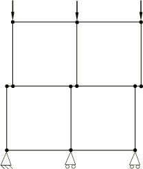
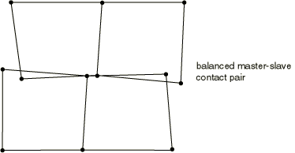
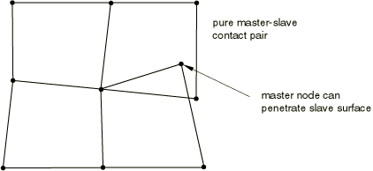
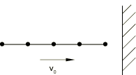

# 38.2.3 Abaqus/Explicit中的接触约束强制执行方法


**产品：** Abaqus/Explicit  Abaqus/CAE

##### **参考**

- ["在Abaqus/Explicit中定义通用接触相互作用，" 第36.4.1节"](pt09ch36s04aus155.md)
- ["在Abaqus/Explicit中定义接触对，" 第36.5.1节"](pt09ch36s05aus160.md)
- [*CONTACT*](../key/key-link.md#usb-kws-hcontact)
- [*CONTACT PAIR*](../key/key-link.md#usb-kws-hcontactpair)
- ["为通用接触指定主从分配，" Abaqus/CAE用户指南第15.13.6节"](../usi/usi-link.md#usi-itn-help-general-contform)

### 概述

Abaqus/Explicit使用两种不同的方法来强制执行接触约束：
- 运动学接触算法使用运动学子测/校正接触算法严格强制执行接触约束（例如，不允许穿透）。
- 惩罚接触算法对接触约束的强制执行较弱，但允许处理更一般类型的接触。

Abaqus/Explicit中的接触对默认使用运动学强制执行，但可以为单个接触对指定惩罚强制执行。通用接触始终使用惩罚强制执行。两种方法都在接触体之间保持动量。

### 运动学接触算法

下面总结了Abaqus/Explicit用于使用接触对算法强制执行接触的默认运动学算法。它是一种预测器/校正器算法，因此对稳定时间增量没有影响。通过首先考虑纯主从接触对来描述该算法会更容易。

#### 纯主从接触对中接触条件的运动学强制执行

在这种情况下，在每个分析增量中，Abaqus/Explicit首先不考虑接触条件将模型的运动学状态推进到预测配置。然后，Abaqus/Explicit确定预测配置中哪些从节点穿透主曲面。每个从节点穿透的深度、与之关联的质量以及时间增量用于计算抵抗穿透所需的反作用力。对于硬接触，这就是如果在增量期间施加了反作用力，将导致从节点正好接触主曲面的力。下一步取决于所使用的主曲面类型。
- 当主曲面由元素面形成时，所有从节点的反作用力被分配到主曲面上的节点。每个接触从节点的质量也被分配到主曲面节点，并添加到它们的质量中，以确定接触界面的总惯性质量。Abaqus/Explicit使用这些分布的力和质量来计算主曲面节点的加速度校正。然后使用每个节点的预测穿透、时间增量以及主曲面节点的加速度校正来确定从节点的加速度校正。Abaqus/Explicit使用这些加速度校正来获得强制执行接触约束的校正配置。
- 对于分析刚性主曲面，所有从节点的反作用力作为广义力施加到相关刚体上。每个接触从节点的质量被添加到刚体上，以确定接触界面的总惯性质量。广义力和附加质量用于计算分析刚性主曲面的加速度校正。然后通过主曲面的校正运动来确定从节点的加速度校正。

使用硬运动学接触时，纯主从算法仍然允许主曲面在校正配置中穿透从曲面（参见[图38.2.3-1](pt09ch38s02aus182.md#aexpcontactpair-mast-surf-pen)）。

**图38.2.3-1** 由于粗离散化，纯主从接触对中主曲面对从曲面的穿透。


在从曲面上使用足够精细的网格将最小化此类穿透。软化运动学接触将允许穿透，因为校正旨在满足从节点处的压力-闭合关系，而非零穿透条件。

#### 平衡主从接触对中接触条件的运动学强制执行

平衡主从接触对的运动学接触算法应用纯主从校正的线性组合，加权平均，完全按照上述方式计算。一组校正计算考虑一个曲面作为主曲面，另一组校正计算考虑同一曲面作为从曲面。然后Abaqus/Explicit应用两个值的加权平均值。每次校正的确切权重取决于为接触对指定的权重因子（参见["Abaqus/Explicit中接触对的接触公式"中的"接触曲面权重"第38.2.2节"](pt09ch38s02aus181.md#usb-cni-acontactpair-exppair)）。平衡主从接触的默认值是平等地加权每个校正。

硬运动学接触将最小化曲面的穿透。但是，在应用初始加权校正后，曲面可能仍有一些穿透。因此，对于使用硬运动学接触的平衡主从接触对，Abaqus/Explicit使用第二次接触校正来解析任何剩余的过闭合。再次考虑两种主从分配组合，但在组合形成第二次应用的加速度校正时不使用权重因子。如果在第一次校正后存在一些残余穿透，第二次校正期间可能在接触曲面之间创建一些小间隙：第二次校正后的间隙大小通常远小于第一次校正后的穿透。[图38.2.3-2](pt09ch38s02aus182.md#anormal-exp-2ndcor-initial)到[图38.2.3-5](pt09ch38s02aus182.md#anormal-exp-pure)说明了第二次校正的效果。

在使用软化运动学接触公式的情况下，不进行上述第二次接触校正。这可能导致穿透值可能与压力-闭合曲线不完全同步。此外，如果在非粘附滑动发生时不精确反映指定的摩擦系数，摩擦剪力（如果有的话）可能无法精确反映指定的摩擦系数。使用纯主从运动学公式来避免这些不准确性。

**图38.2.3-2** 第二次接触校正的效果；初始配置。



**图38.2.3-3** 使用第二次接触校正时的最终配置。


**图38.2.3-4** 如果省略第二次接触校正时的最终配置。



**图38.2.3-5** 使用纯主从接触对时的最终配置。主曲面定义在底部元素上。



#### 硬运动学接触的能量考虑

运动学接触算法严格强制执行接触约束并保持动量。为了用离散模型实现这些特性，冲击时吸收了一些能量。例如，考虑[图38.2.3-6](pt09ch38s02aus182.md#anormal-exp-beamimpact)所示的撞击固定刚性墙的多个元素建模的线性弹性梁。领先节点的动能 在冲击时被接触算法吸收。应力波穿过桁架，桁架最终从墙壁反弹。反弹后的动能小于冲击前的动能，因为接触节点在冲击时损失了能量。随着网格的细化，这种能量损失减少，因为桁架领先节点的质量和动能变得不那么显著。

**图38.2.3-6** 梁撞击固定刚性墙。



接触力也可以在冲击时施加负外部功，因为接触力在发生冲击的整个增量中作用，包括冲击前的增量部分。反向接触力大小相等，但作用的距离不同，从而产生非零净功。这些力的净外部功为负，净外部功的绝对值不超过接触节点在冲击时的动能损失。这些能量在大多数模型中不显著，但在高速冲击中可能显著，建议在接触界面附近进行高网格细化。

### 惩罚接触算法

惩罚接触算法对接触约束的强制执行不如运动学接触算法严格，但惩罚算法允许处理更一般类型的接触（例如，两个刚体之间的接触）。惩罚接触方法非常适合非常通用的接触建模，包括以下情况：
- 每个节点的多次接触，
- 刚体之间的接触，和
- 也参与其他类型约束（如MPC）的曲面的接触。

由于惩罚算法向模型引入额外的刚度行为，此刚度可能影响稳定时间增量。Abaqus/Explicit自动考虑惩罚刚度在自动时间增量中的影响，尽管这种影响通常很小，如下所述。

惩罚强制执行方法始终被通用接触算法使用。对于接触对，您可以将惩罚方法指定为默认运动学强制执行方法的替代方法。当选择惩罚方法来强制执行法向接触约束时，它也用于强制执行粘附摩擦（参见["摩擦行为，" 第37.1.5节"](pt09ch37s01aus169.md)）。

| **输入文件用法：** | 使用以下选项为接触对选择惩罚接触算法： |
| --- | --- |
| | ``` [*CONTACT PAIR*](../key/key-link.md#usb-kws-hcontactpair), MECHANICAL CONSTRAINT=PENALTY *surface_1*, *surface_2* ``` |

| **Abaqus/CAE用法：** | 相互作用模块：相互作用编辑器：****机械约束公式：惩罚接触方法**** |
| --- | --- |

#### 纯主从曲面权重的接触条件惩罚强制执行

惩罚接触算法在当前配置中搜索从节点穿透，包括节点到面、节点到分析刚性曲面和边缘到边缘穿透。对于节点到面接触，作为穿透距离函数的力被施加到从节点以抵抗穿透，而大小相等方向相反的力作用在穿透点处的主曲面上。作用在穿透点处的主曲面接触力被分布到被穿透的主曲面面的节点上。对于节点到分析刚性曲面的接触，作为穿透距离函数的力被施加到从节点以抵抗穿透，而大小相等方向相反的力作用在穿透点处的分析刚性曲面上。作用在分析刚性曲面穿透点处的接触力在对应于分析刚性曲面的刚体的参考节点处产生等效力和力矩。对于边缘到边缘接触，反向接触力被分布到两个接触边缘的节点上。

与纯主从运动学接触算法一样，纯主从惩罚接触算法对穿透从曲面面的主曲面节点没有抵抗力。在从曲面上使用足够精细的网格将有助于纠正此问题。

#### 平衡主从曲面权重的接触条件惩罚强制执行

平衡主从接触曲面的惩罚接触算法计算的接触力是纯主从力的线性组合，按照上述方式计算。一组力计算考虑一个曲面作为主曲面，另一组力计算考虑同一曲面作为从曲面。然后Abaqus/Explicit应用两个值的加权平均值。与每组力一起使用的权重取决于为曲面指定的权重因子（参见["Abaqus/Explicit中通用接触的接触公式，" 第38.2.1节"](pt09ch38s02aus180.md)和["Abaqus/Explicit中接触对的接触公式，" 第38.2.2节"](pt09ch38s02aus181.md)）。平衡主从接触对和通用接触的默认值是平等地加权两组力。

#### 缩放惩罚刚度

将接触力与穿透距离关联的"弹簧"刚度由Abaqus/Explicit为硬惩罚接触自动选择，使得对时间增量的影响最小，但在大多数分析中允许的穿透并不显著。默认惩罚刚度基于底层元素的代表性刚度。将比例因子应用于此代表性刚度以设置默认惩罚。因此，穿透距离通常大于元素在接触界面法向上的弹性变形。在纯弹性问题中，这种穿透会显著影响应力解决方案，如["赫兹接触问题，" Abaqus基准指南第1.1.11节"](../bmk/bmk-link.md#bmk-anl-hertzcontact)所示。

当基于元素或基于节点的刚体参与接触相互作用时，为了数值稳定性，Abaqus/Explicit将通过考虑刚体的整体惯性属性在刚体上每个接触节点处计算惩罚。因此，接触惩罚将与这些元素未转换为刚体时的情况不同，因此两种情况中的穿透可能不同。

您可以指定缩放默认惩罚刚度的因子，如["Abaqus/Explicit中通用接触的接触控制，" 第36.4.5节"](pt09ch36s04aus159.md)和["Abaqus/Explicit中接触对的接触控制，" 第36.5.5节"](pt09ch36s05aus164.md)中所述。此缩放可能影响自动时间增量。使用大的比例因子可能会增加分析所需的计算时间，因为维持数值稳定性所必需的时间增量减少。

### 在运动学和惩罚接触算法之间选择

惩罚接触算法可以模拟运动学接触算法无法模拟的某些类型的接触。基于元素的刚性曲面在惩罚算法中不限于仅作为主曲面（如在运动学算法中所做的那样）。因此，惩罚方法允许刚曲面之间的接触建模，除非两个曲面都是分析刚性曲面或两个曲面都是基于节点的。

如果在线性约束方程、多点约束、基于曲面的绑定约束或连接器元素为刚体上的节点定义时，所有涉及刚体的接触对必须使用惩罚接触算法。对于所有其他情况，Abaqus/Explicit独立于接触约束强制执行方程、多点约束、绑定约束、嵌入元素约束和运动学约束（使用连接器元素定义）；因此，如果一个自由度除了参与接触约束外还参与线性约束方程、多点约束、绑定约束、嵌入元素约束或运动学约束，接触约束通常将覆盖这些约束（参见["Abaqus/Explicit中使用接触对的接触建模常见困难"中的"与多点约束的冲突"第39.2.2节"](pt09ch39s02aus186.md#usb-cni-aexpcontacttrouble-mpc-conflicts)）。因此，如果需要严格强制执行这些约束，建议使用惩罚接触算法。

当使用默认硬、运动学接触算法且接触节点的动能丢失时，冲击是塑性的。这种能量损失对于细化网格不显著，但对于粗网格可能显著。惩罚接触和软化运动学接触向接触强制执行引入数值软化，类似于向接触界面添加弹性弹簧，这意味着这些算法在冲击时不消耗能量（存储在弹簧中的能量是可恢复的）。算法之间的这种区别在点质量（其上无作用力）撞击固定刚性墙时特别明显：对于惩罚接触和软化运动学接触，点质量会弹回，但对于硬运动学接触，点质量将粘在墙上。

运动学和惩罚接触之间的另一个区别是，临界时间增量不受运动学接触的影响，但可能受惩罚接触影响。对于硬惩罚接触，默认惩罚刚度的选择使得接触力正在传输的增量中，接触曲面网格面的可变形父元素的稳定时间增量有效地减少约4%；基于节点的曲面节点的默认惩罚刚度需要元素逐个时间增量减少1%以确保数值稳定性。刚体之间的惩罚刚度默认选择为对稳定时间增量没有影响。如果默认惩罚刚度被惩罚比例因子或软化接触行为覆盖（参见["接触压力-闭合关系，" 第37.1.2节"](pt09ch37s01aus166.md)），则时间增量基于接触界面中活动的最大刚度进行修改。增加惩罚刚度可能会显著减少稳定时间增量（参见[表38.2.3-1](pt09ch38s02aus182.md#table-scalefactors-cp)）。如果整体稳定时间增量不由接触界面上的元素控制，惩罚接触算法通常不会影响时间增量。

惩罚接触和软化运动学接触不能与可断裂粘结模型一起使用；必须将此模型使用硬运动学接触。

**表38.2.3-1** 比例因子对时间增量的影响。
| 惩罚比例因子 | 有接触的时间增量与无接触的时间增量之比的下限 |
| --- | --- |
| 1.0 | 0.96 |
| 10.0 | 0.34 |
| 100.0 | 0.13 |
| 1000.0 | 0.04 |
| 10000.0 | 0.013 |


