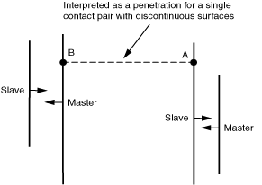
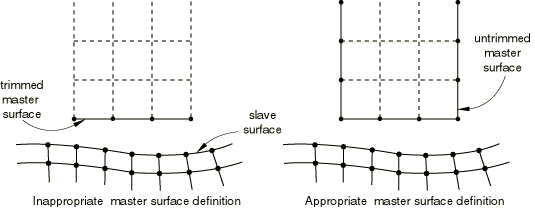
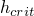
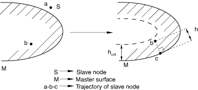
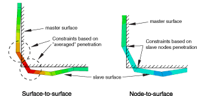

# 39.1.2 Abaqus/Standard中接触建模的常见困难


**产品：** Abaqus/Standard  Abaqus/CAE  

##### **参考资料**

- ["在Abaqus/Standard中定义通用接触相互作用，" 第36.2.1节](pt09ch36s02aus139.md)
- ["在Abaqus/Standard中定义接触对，" 第36.3.1节](pt09ch36s03aus145.md)
- [*CONTACT](../key/key-link.md#usb-kws-hcontact)
- [*CONTACT PAIR](../key/key-link.md#usb-kws-hcontactpair)
- [*CONTACT INITIALIZATION DATA](../key/key-link.md#usb-kws-hcontactinitdata)
- ["定义通用接触，" Abaqus/CAE用户指南第15.13.1节](../usi/usi-link.md#usi-itn-help-general)
- ["定义表面到表面接触，" Abaqus/CAE用户指南第15.13.7节](../usi/usi-link.md#usi-itn-help-surftosurf)
- ["使用接触和约束检测，" Abaqus/CAE用户指南第15.16节](../usi/usi-link.md#usi-itn-detectioneditor)

### 概述

本节重点介绍在Abaqus/Standard中建模接触相互作用时最常遇到的困难。提供了关于如何规避这些问题的建议。

### 解决初始接触条件的困难

重要的是要理解Abaqus/Standard如何在分析开始时解释和解决接触条件。如有必要，您可以在消息文件中检查初始接触条件（参见["Abaqus/Standard消息文件" "输出，" 第4.1.1节](pt02ch04s01aus38.md#usb-out-ooutput-message-std)）。无意的接触开口或过闭合可能导致对表面几何的误解、模型中的无意运动以及分析不收敛。

#### 消除初始接触开口和过闭合

当对两个多面体表面建模接触时，个别节点处可能出现小间隙或穿透是很常见的。当两个表面具有不同的网格时，这个问题尤其常见。Abaqus/Standard使用两种默认方法来处理初始穿透：
- 在通用接触中，自动调整小的初始过闭合以消除穿透。
- 在接触对中，初始过闭合被解释为干涉配合并相应解决（参见下面的["解决大干涉配合"](pt09ch39s01aus184.md#usb-cni-acontacttrouble-intfit)）。

您可以通过让Abaqus/Standard调整从表面的位置来提高接触模拟的准确性，以确保所有应该最初与主表面接触的从节点开始时就接触而没有任何穿透（参见["在Abaqus/Standard中控制初始接触状态，" 第36.2.4节](pt09ch36s02aus142.md)，和["在Abaqus/Standard接触对中调整初始表面位置和指定初始间隙，" 第36.3.5节](pt09ch36s03aus149.md)）。当预期的初始间隙或过闭合与接触体中的典型尺寸相比较小且使用小滑动接触对时，您可以精确指定间隙或过闭合（参见["为小滑动接触定义精确的初始间隙或过闭合" "在Abaqus/Standard接触对中调整初始表面位置和指定初始间隙，" 第36.3.5节](pt09ch36s03aus149.md#usb-cni-aadjustsurfaces-clearance)）。

小滑动接触跟踪方法比有限滑动跟踪方法对接触界面处的初始局部间隙更敏感。在小滑动接触中，每个从节点与从主表面的有限元近似定义的接触平面相互作用，如["Abaqus/Standard中的接触公式，" 第38.1.1节](pt09ch38s01aus177.md)中所讨论的。只有当每个从节点可以投射到主表面上时，Abaqus/Standard才能定义这些平面。让这些从节点开始模拟时与主表面接触，可以让Abaqus/Standard为从节点形成最准确的接触平面。

#### 大意外初始过闭合

接触初始化算法偶尔可能会推断出您不希望存在初始过闭合的大初始过闭合。例如，指定错误的表面法线可能导致接触初始化算法将物理间隙解释为穿透，如["在Abaqus/Standard中定义接触对，" 第36.3.1节](pt09ch36s03aus145.md#usb-cni-acontactpair-orient)中的"壳状表面的方向考虑"中所讨论的。表面或接触定义的微小变化通常会避免不良过闭合，但这些情况通常需要一些诊断以确定如何避免问题。

##### 识别意外过闭合的位置

解决大初始过闭合的第一步是识别问题的位置：
- 如果初始过闭合被视为在第一个增量中解决的干涉配合（Abaqus/Standard的默认行为；参见["在Abaqus/Standard中建模接触干涉配合，" 第36.3.4节](pt09ch36s03aus148.md)），初始输出帧的接触开口距离输出变量（COPEN）等值线图将显示哪些区域有初始过闭合（穿透对应于COPEN的负值）。
- 如果使用无应变调整来解析初始过闭合，初始输出帧的输出变量STRAINFREE等值线图将显示调整发生的位置（参见["Abaqus/Standard分析中的接触诊断，" 第39.1.1节](pt09ch39s01aus183.md)，获取关于此输出变量的进一步讨论）。但是，大的无应变调整可能导致网格变得高度扭曲，使得难以完全诊断问题；在这种情况下，执行数据检查分析（参见["Abaqus/Standard、Abaqus/Explicit和Abaqus/CFD执行，" 第3.2.2节](pt01ch03s02abx02.md)），将初始过闭合视为在第一个增量中解决的干涉配合（而不是无应变调整）来促进诊断（如上所述）。

一旦您识别了意外初始过闭合的位置，将Abaqus/CAE中的显示限制在涉及初始过闭合的相互作用的主表面和从表面上，有助于识别意外初始过闭合的原因（参见["管理显示组，" Abaqus/CAE用户指南第78.2节](../usi/usi-link.md#usv-dgp-hlp)，获取关于显示组选项的讨论）。查看表面法线（参见["显示单元和表面法线，" Abaqus/CAE用户指南第55.7节](../usi/usi-link.md#usv-custom-normals)）可能有助于确定意外过闭合是否由于错误的表面法线。

##### 不连续表面上的过闭合

[图39.1.2-1](pt09ch39s01aus184.md#acontact-unintended-penet-nls)显示了一个大意外初始过闭合的示例。在这种情况下，具有不连续表面的单个接触对应在两个不同区域强制执行接触（[表36.3.1-1](pt09ch36s03aus145.md#table-connectivity-restrictions) ["在Abaqus/Standard中定义接触对，" 第36.3.1节](pt09ch36s03aus145.md#usb-cni-acontactpair-orient)中的"壳状表面的方向考虑"显示了哪些接触公式允许不连续表面）。[图39.1.2-1](pt09ch39s01aus184.md#acontact-unintended-penet-nls)中的箭头显示了每个表面区域的正法线方向。表面到表面接触公式沿从表面法线方向（正方向和负方向）搜索主表面上可能的相互作用点。从A点发出的搜索在此示例中识别B点作为A的唯一可能相互作用点。接触对将其解释为有效穿透，因为没有找到更好的相互作用位置候选且A和B点处的表面法线相对。避免此意外过闭合的方法包括：
- 为两个不同接触区域中的每一个定义具有连续表面的单独接触对；和
- 指定通用接触，它会过滤掉几乎所有意外的初始过闭合。

**图39.1.2-1** 由于涉及不连续表面的建模错误导致的意外初始过闭合示例。



##### 三维表面上的过闭合

对于具有复杂表面的三维模型，意外初始过闭合的原因可能不那么明显。克服这个问题的最重要步骤是识别相应表面中参与意外初始过闭合的区域。对于没有无应变调整的表面到表面接触对，主表面的一个部分应该显示在从表面后面（与从表面法线方向相反），距离与报告的（负）COPEN值一致。对于节点到表面接触对，主表面上相互作用点的方向通常对应于从表面和主表面之间的局部最小距离。

#### 解决大干涉配合

如前所述，Abaqus/Standard可以选择将初始过闭合解释为干涉配合。您应该使用上述方法之一来消除由于网格离散化错误或定义接触表面的错误而导致的无意初始过闭合。在某些情况下，干涉配合可能是预期的，但可能太大，无法使用Abaqus/Standard用于接触对的默认方法稳健地解析（该方法是在单个增量中解析过闭合）。在这种情况下，您应该修改接触模型以允许多增量解析过闭合（详细信息，参见["在Abaqus/Standard中建模接触干涉配合，" 第36.3.4节](pt09ch36s03aus148.md)）。如果您选择让初始过闭合作为通用接触的干涉配合，它们会自动在多个增量中解析（参见["在Abaqus/Standard中控制初始接触状态，" 第36.2.4节](pt09ch36s02aus142.md)）。

#### 防止接触模拟中的刚体运动

动态分析中的刚体运动通常不是问题。在静态问题中，当物体没有充分约束时会发生刚体运动。"数值奇异"警告消息和非常大的位移表示静态分析中的无约束运动。因此，如果在静态问题中使用接触来约束刚体运动，请确保适当的表面配对最初处于接触状态（参见["在Abaqus/Standard中控制初始接触状态，" 第36.2.4节](pt09ch36s02aus142.md)，和["在Abaqus/Standard接触对中调整初始表面位置和指定初始间隙，" 第36.3.5节](pt09ch36s03aus149.md)）。如有必要，定义模型几何以为接触对提供小的初始过闭合，或者使用边界条件在第一步中将结构移动到接触中。边界条件（在后续步骤中不必要）可以在身体通过与其他组件的接触得到充分约束后移除。类似地，如果刚体仅表示平移，则约束其旋转自由度。

摩擦粘滞可以约束刚体运动。但是，必须先产生接触压力才能生成摩擦。因此，当表面首次接触时，摩擦对约束刚体运动无效。您必须通过定义边界条件或通过软弹簧或缓冲器接地来临时消除刚体运动。

如果您无法通过建模技术防止刚体运动，Abaqus/Standard提供了一些工具来自动稳定接触模拟中的刚体。这些工具在["自动稳定化接触问题中的刚体运动" "在Abaqus/Standard中调整接触控制，" 第36.3.6节](pt09ch36s03aus150.md#usb-cni-acontacttrouble-stabilize)中讨论。

### 定义不良的表面

在分析过程中，您可能会注意到接触表面之间存在不良行为（过度穿透、意外开口、力应用不准确等）。这种行为通常会导致不收敛和分析终止。这些问题可能由与网格、单元选择和表面几何相关的多种原因引起。

#### 在主表面上定义重复节点

当为有限滑动应用定义三维表面时，避免使用相同坐标定义两个表面节点。这样的定义可能在表面中产生缝隙或裂缝，如[图39.1.2-2](pt09ch39s01aus184.md#acontact-mesh-crack)所示。

**图39.1.2-2** 双重定义的表面节点示例。


如果使用Abaqus/CAE中的默认绘图选项查看，此表面将看起来是一个有效的连续表面；但是，如果此表面用作有限滑动的节点到表面接触的主表面，沿此表面滑动的从节点可能会穿过此裂缝并"卡在"主表面后面。类似的问题可能发生在有限滑动、表面到表面接触中。通常，收敛问题会导致Abaqus/Standard终止分析。

使用Abaqus/CAE可视化模块中的边缘显示选项来识别模型中使用的表面上任何不需要的裂缝。裂缝将显示为表面内部的额外周线。在前处理器中创建模型时，通过等价节点可以轻松避免重复节点。

#### 避免沿表面周界的接触问题

建模有限滑动接触时，确保主表面定义扩展得足够远，以考虑预期接触部件的所有运动。应该避免在主表面周界处使用节点到表面接触公式进行接触。Abaqus/Standard假设配合从表面节点可以从主表面的自由边缘滑落，如果从节点缠绕并从后方接近其配合主表面，这可能会导致问题。[图39.1.2-3](pt09ch39s01aus184.md#acontact-mast-surf-ext)说明适当和不适当的主表面定义。

**图39.1.2-3** 主表面扩展示例。



从主表面滑落的从节点在一个迭代中可能发现在下一次迭代中与表面接触；这种现象称为跳动。如果跳动继续，Abaqus/Standard可能找不到解。对于表面到表面公式方法，这个问题不太可能发生，因为每个接触约束基于从表面区域而不是单个从节点。请求详细的接触打印输出到消息（`.msg`）文件，以监控可能从主表面滑落的从节点的历史（参见["Abaqus/Standard消息文件" "输出，" 第4.1.1节](pt02ch04s01aus38.md#usb-out-ooutput-message-std)）。消息文件输出将显示从节点处接触的循环打开和闭合，这表明需要修改主表面的位置。

对于节点到表面接触，您可以扩展主表面超出物理体边界以避免跳动问题。某些接触单元（如滑移线和刚表面接触单元）也可能发生跳动。滑移线接触单元也可以扩展。详细信息，参见["延伸主表面和滑移线，" 第36.3.8节](pt09ch36s03aus152.md)。

##### 从小滑动主表面滑落

在小滑动接触问题中，从主表面边缘滑落不是问题，因为从节点不在实际表面上滑动。相反，每个从节点与一个平的、无限的接触平面相互作用。该平面与在未变形配置中最接近从节点的为主表面节点集关联。 关于小滑动接触的详细信息，参见["Abaqus/Standard中的接触公式，" 第38.1.1节](pt09ch38s01aus177.md)。

##### 从具有界面单元的表面滑落

从具有界面单元的表面边缘滑落不是问题，因为从节点在一个平的、无限的接触平面上滑动。

#### 使用网格粗糙的表面

由非常粗糙的网格创建的表面会导致若干问题。其中一些问题取决于您对接触离散化的选择，如下文["接触公式之间的差异"](pt09ch39s01aus184.md#usb-cni-acontacttrouble-disc)中更详细地讨论。

##### 具有粗糙网格的从表面的穿透

当粗糙网格表面用作节点到表面接触的从表面时，主表面节点可以大量穿透从表面而没有阻力（参见[图39.1.2-4](pt09ch39s01aus184.md#acontact-mast-surf-pen)）。这种情况在非匹配网格接触时很常见。细化从表面往往可以缓解此问题。

**图39.1.2-4** 由于从表面的粗糙网格导致的节点到表面接触中主表面穿透从表面。


表面到表面接触通常会抵抗主节点穿透粗糙从表面；但是，如果从网格明显比主网格粗糙，则此公式可能会增加显著的计算费用（参见["Abaqus/Standard中的接触公式，" 第38.1.1节](pt09ch38s01aus177.md)，获取进一步讨论）。

##### 接触发生在单个单元处

如果表面上的网格太粗糙，接触相互作用可能完全发生在单个单元的边界内。这通常发生在两个接触表面具有不同曲率时，如[图39.1.2-5](pt09ch39s01aus184.md#usb-acontact-indent)中所描述。

**图39.1.2-5** 主表面在单个单元面处接触从表面。


这种相互作用的结果是不可靠的，通常不现实。如果[图39.1.2-5](pt09ch39s01aus184.md#usb-acontact-indent)中的模型使用节点到表面接触，主表面会毫无阻力地穿透从表面，直到遇到从节点，如上所述。如果主从分配被反转，则接触约束施加在单个从节点处；这种集中导致接触压力的计算不准确地偏高。如果模型使用表面到表面接触，则不太可能发生过穿透。但是，由于仅涉及少量约束点，用于强制执行表面到表面接触的平均算法表现不佳。结果导致不准确的接触应力和压力计算。

如果接触发生在单个单元处，请细化网格以将相互作用扩展到多个单元面。

##### 粗糙网格主表面和小滑动接触

在小滑动模拟中，粗糙网格的曲线主表面可能导致不可接受的解精度，这是由于"主平面"的近似性质。使用更精细的网格定义主表面将提高小滑动问题的整体解精度。但是，除非使用完全匹配的网格，否则即使在细化模型中仍可能观察到接触应力的局部振荡。

##### 具有二阶热传递单元的非匹配表面网格

如果使用二阶热传递单元来建模热界面且表面间的网格不匹配，则可能出现不准确的局部结果。当一个表面上的单元的边中节点最接近另一表面上的单元的角节点时，会获得最差的结果。如果必须在模型中使用非匹配网格，请使用一阶单元或使用更精细的网格。

#### 具有二阶面和节点到表面公式的三维表面

二阶单元不仅提供更高的准确性，而且还能更有效地捕获应力集中，比一阶单元更好地建模几何特征。基于二阶单元类型的表面与表面到表面接触公式配合良好，但在某些情况下，与节点到表面公式配合不佳（参见["Abaqus/Standard中的接触公式，" 第38.1.1节](pt09ch38s01aus177.md)，获取关于这些接触公式的讨论）。

某些二阶单元类型不适合与节点到表面接触公式和"硬"接触条件的严格强制结合使用，因为当压力作用在单元面上时，等效节点力的分布。[图39.1.2-6](pt09ch39s01aus184.md#eq-nodal-loads-contacttrouble)中所示，没有面中节点的二阶单元面上施加的恒定压力会在角节点处产生与压力相反作用的力。

**图39.1.2-6** "硬"接触模拟中二阶单元面上恒定压力产生的等效节点载荷。


Abaqus/Standard基于作用在各个从节点上的接触力为节点到表面接触公式做出重要决定；二阶单元中节点力的模糊性可能导致Abaqus/Standard做出错误决定。为了规避这个问题，Abaqus/Standard自动将形成从表面的大多数没有面中节点的三维二阶单元（即坐井单元）转换为具有面中节点的单元。对于三维18节点垫片单元，如果连接中未给出面中节点，也会自动生成面中节点。面中节点的存在导致对接触算法明确的节点力分布。

单元族C3D20(RH)、C3D15(H)、S8R5和M3D8分别转换为族C3D27(RH)、C3D15V(H)、S9R5和M3D9。由于Abaqus/Standard不转换二阶耦合温度-位移、耦合热-电-结构和耦合孔隙压力-位移单元，因此您应该指定惩罚或增广拉格朗日约束强制方法来近似硬压力-过闭合行为（参见["Abaqus/Standard中的接触约束强制方法，" 第38.1.2节](pt09ch38s01aus178.md)）。当在任何用户定义节点处规定值时，Abaqus/Standard会在自动生成的面中节点处插值节点量（如温度和场变量）。如果从表面用于绑定接触对，则Abaqus/Standard不会转换二阶坐井单元。

二阶四面体单元（C3D10和C3D10I）在其角节点处具有零接触力。不允许二阶三角形从面、节点到表面接触公式和"硬"接触条件严格强制相结合，以避免此组合可能发生的高可能性收敛问题和接触压力预测不良。为避免此组合，请使用以下至少一种替代方法：
- 使用表面到表面接触公式（通常推荐）而不是节点到表面接触公式；
- 使用惩罚约束强制方法（通常推荐）或增广拉格朗日约束强制方法，而不是"硬"接触条件的严格强制；或
- 使用改进的10节点四面体单元（C3D10M）而不是二阶四面体单元。

### 接触模拟中的过多迭代

Abaqus/Standard提供了多种调整求解器迭代方案的方法，有时能以最小的精度影响获得更高效的分析。

#### 在弱确定接触条件中转换严重不连续迭代

默认情况下，Abaqus/Standard继续迭代，直到与接触状态变化相关的严重不连续足够小（或者不发生严重不连续）且平衡（通量）容差得到满足。或者，您可以选择不同的方法，让Abaqus/Standard继续迭代直到不发生严重不连续。这两种方法在["Abaqus/Standard中的严重不连续" "定义分析，" 第6.1.2节](pt03ch06s01abo05.md#usb-anl-aover-sdiconvert)中有更详细的讨论。严重不连续迭代的默认处理减少了与接触状态之间跳动相关的过度迭代的可能性，当接触条件弱确定时。一个具有弱确定接触条件的区域示例是接触薄板的平冲头的中心附近。

#### 在未收敛迭代中基于穿透距离控制增量大小

对于大多数类型的接触，如果在迭代期间任何接触对计算的穿透超过特定距离（），Abaqus/Standard放弃该增量并使用更小的增量大小重试。对于有限滑动、表面到表面接触（包括通用接触）和几何线性分析中的小滑动接触，没有临界穿透距离。

 的默认值是包围特征表面单元面的球体的半径。在计算默认值时，Abaqus/Standard仅使用接触对的从表面。模型中每个接触对的 值打印在数据（`.dat`）文件中。虽然默认的 值应该足以满足大多数接触模拟，但在某些情况下可能需要更改给定接触对的默认值。这些情况包括：
- 主表面高度弯曲的模型。 的默认值有时可能导致[图39.1.2-7](pt09ch39s01aus184.md#hcrit)所示的情况。在迭代求解过程中，最初在*a*点的从节点可能移动到*b*点，以小于 的过闭合穿透主表面。Abaqus/Standard可能尝试将从节点移动到主表面上的*c*点。为避免这种情况，请为 指定一个较小的值，以强制Abaqus/Standard放弃增量并尝试更小的增量大小。
**图39.1.2-7** 高度弯曲主表面上临界穿透距离的影响。

- Abaqus/Standard无法计算合理的 的模型，因为使用了基于节点的表面。如果模型中有其他具有表面的接触对，Abaqus/Standard使用所有从表面单元面的平均尺寸。如果没有其他接触对，Abaqus/Standard使用整个模型的特征单元尺寸。
- 从表面中接触面尺寸差异很大的模型。
- 与典型表面尺寸相比，从表面网格非常精细的模型，因此可以轻松解析比默认 大得多的过闭合。
- 具有软化接触的接触对允许显著穿透的模型（参见["接触压力-过闭合关系，" 第37.1.2节](pt09ch37s01aus166.md)）。

| **输入文件用法：** | ``` [*CONTACT PAIR](../key/key-link.md#usb-kws-hcontactpair), HCRIT= ``` |
| --- | --- |

| **Abaqus/CAE用法：** | 您无法在Abaqus/CAE中调整 的默认值。 |
| --- | --- |

### 解释接触模拟结果的困难

尽管涉及接触的分析运行完成，但结果可能看起来不现实。这有时是由于建模错误，有时是由于某些接触公式的专门输出格式。除了降低接触输出外，下面讨论的因素也往往降低收敛行为，因此避免这些因素可能会改善收敛行为。

#### 在"硬"接触模拟中使用二阶单元时的振荡接触压力

当组成接触相互作用的两个可变形表面使用非常不同的网格密度时，很可能发生不均匀的接触压力分布。当"硬"接触建模且两个表面都用二阶单元（包括改进的二阶四面体单元）建模时，不均匀性可能特别明显。在这种情况下，接触压力可能出现振荡和"尖峰"。通过使用惩罚型接触约束强制方法，可以为用二阶单元建模的表面获得更平滑的接触压力（参见["Abaqus/Standard中的接触约束强制方法，" 第38.1.2节](pt09ch38s01aus178.md)）。

#### 在对称轴上使用二阶轴对称单元时的不准确接触应力

对于二阶轴对称单元，接触面积在位于对称轴上的节点处为零（）。为避免由零接触面积引起的数值奇异问题，Abaqus/Standard计算接触面积，就好像节点距离对称轴一小段距离。这可能导致对位于对称轴上的节点计算的局部接触应力不准确。

#### 自接触

表面与其自身的接触（自接触）用于原始几何与发生接触的（变形）几何非常不同的情况。然后，您将很难预测表面的哪些部分将彼此接触。只要有可能，声明表面的某些部分为主表面而某些部分为从表面总是计算上更经济的。同样的不可预测性使得无法先验地确定哪一侧将是主表面，哪一侧将是从表面。因此，Abaqus/Standard使用对称接触模型：表面的每个单个节点都可以是从节点，并且可以同时相对于所有其他节点属于主段。

因为每个表面同时充当从表面和主表面，所以对称接触分析的结果可能令人困惑且不一致。这些困难在["使用对称主-从接触对改善接触建模" "在Abaqus/Standard中定义接触对，" 第36.3.1节](pt09ch36s03aus145.md#usb-cni-acontactpair-symm)中有更完整的讨论。

#### 过度约束模型

过度约束是指多个运动约束超过它们所作用的自由度数目的情况。过度约束通常导致不准确的解或无法获得收敛解。严格使用直接约束强制方法（使用拉格朗日乘子）强制执行的接触条件有时会参与过度约束。参见["过度约束检查，" 第35.6.1节](pt08ch35s06aus138.md)，获取关于过度约束的详细讨论和示例以及Abaqus/Standard将如何基于以下分类处理过度约束：
- 在模型预处理器中检测到的过度约束
- 在分析期间检测并解决的过度约束
- 在方程求解器中检测到的过度约束

Abaqus/Standard将自动解析许多类型的过度约束；但是，许多涉及接触的过度约束无法解析并将暴露给方程求解器。方程求解器通常会因此发出"零主元"或"数值奇异"警告消息；当发生这种情况时，Abaqus/Standard将提供一条警告消息，其中包含有助于确定导致过度约束的原因的信息，以便您可以解决它。偶尔过度约束不会产生警告消息；这并不一定意味着过度约束没有对分析产生不利影响。

##### 涉及软化接触的过度约束

具有软化行为或使用惩罚或增广拉格朗日方法强制的接触条件不会与其他约束结合导致"严格过度约束"；但是，"软化过度约束"可以：
- 如果与接触相关的刚度贡献比典型单元的刚度贡献高几个数量级，则在方程求解器中导致零主元或病态；
- 阻止使用增广拉格朗日方法实现严格的穿透容差；和
- 导致接触应力解振荡，特别是如果接触刚度高的话。

某些类型的接触默认使用惩罚或增广拉格朗日方法来近似硬压力-过闭合行为，因为普遍存在冗余或"竞争"接触条件。关于可用的约束强制方法和默认行为的讨论，参见["Abaqus/Standard中的接触约束强制方法，" 第38.1.2节](pt09ch38s01aus178.md)。

##### 由于过度约束导致的不准确接触力

如果接触对中的节点被过度约束但方程求解器确实找到了解，则接触力变得不确定，可能变得过高，特别是在绑定接触对中。检查消息报告中报告的时间平均力（或力矩，或通量），或使用Abaqus/CAE交互式查看诊断信息（更多信息，参见[Abaqus/CAE用户指南第41章，"查看诊断输出"](../usi/usi-link.md#usv-output)）。如果它比残差力（或力矩，或通量）大几个数量级，则可能发生了过度约束，不能保证Abaqus/Standard找到了正确的解。模型过度约束的另一个迹象是分析在每个增量中的单次迭代中开始收敛，而非线性应该需要至少几次迭代。只能通过更改涉及的接触定义或其他约束类型来避免过度约束。

##### 由于在单个节点上定义了多个表面相互作用而导致的过度约束

接触过度约束的自动解析有时取决于两个接触对是否引用相同的表面相互作用定义。例如，考虑两个接触对具有公共主表面并共享一些从节点（可能在两个从表面的公共边缘上）的情况。如果两个接触对引用不同的表面相互作用定义（即使表面相互作用是等效的），则会在公共从节点处发生过度约束；但是，如果两个接触对引用相同的表面相互作用定义，Abaqus/Standard自动避免这些过度约束。（参见["为Abaqus/Standard中的接触对分配接触属性，" 第36.3.3节](pt09ch36s03aus147.md)，获取关于如何为接触对分配表面相互作用定义的讨论。）

### 接触公式之间的差异

Abaqus/Standard中可用的不同接触公式（参见["Abaqus/Standard中的接触公式，" 第38.1.1节](pt09ch38s01aus177.md)）允许在建模接触模拟时具有很大的灵活性。但是，仅在接触公式不同的两个几乎相同的模拟有时会产生不同的结果。这主要是因为接触公式以不同的方式解释接触条件。某些公式更适合特定情况。

#### 穿透差异

节点到表面和表面到表面离散化之间最明显的差异是表面之间发生的穿透量。这是因为节点到表面离散化仅在从节点处计算穿透，而表面到表面离散化在有限区域上以平均意义计算穿透。例如，当从表面滑过主表面的凸出部分时，与节点到表面离散化相比，表面到表面离散化中的从表面往往会有点更高，如[图39.1.2-8](pt09ch39s01aus184.md#usb-cni-comparepenet1)所示（在主表面的凹入部分则相反）（[图39.1.2-9](pt09ch39s01aus184.md#usb-cni-comparepenet2)显示了由于计算穿透的不同方法，两种接触离散化基本不同的情况）。两种离散化都随着网格细化收敛到相同的行为。

**图39.1.2-8** 主表面凸曲率示例中接触离散化的比较（成形应用）。


计算穿透的差异有时会从根本上影响分析的结果。在将模型从一个接触公式转换为另一个接触公式时，请注意这种可能性。预先存在的模型的各个方面，如摩擦系数或压力-过闭合关系，可能无意中"调整"为特定接触公式的行为。

**图39.1.2-9** 具有相对灵活的从表面缠绕主表面角落的示例中接触离散化的比较。



#### 单点接触

[图39.1.2-10](pt09ch39s01aus184.md#usb-cni-pointcontact)显示了一个圆形刚体被推入变形体的示例。

**图39.1.2-10** 两个物体最初在单点接触的示例。


在所示的初始配置中，两个物体在对应于从节点位置的单个点处接触。以下场景可能适用于分别使用节点到表面和表面到表面离散化分析此模型：
- 使用节点到表面离散化，第一次迭代使用一个活动接触约束执行。以合理的迭代和增量次数获得收敛解。
- 使用表面到表面离散化，穿透在表面区域的平均意义上计算，因此即使表面在其中一个从节点处接触，所有潜在接触约束都计算出正间隙距离。但是，有限滑动、表面到表面接触公式检测到表面最初接触，默认情况下自动在与间隙距离为零的邻域中激活局部接触阻尼。没有这种阻尼，Abaqus/Standard可能由于无约束刚体模式而无法获得收敛解。这种接触阻尼对收敛解的影响通常可以忽略不计，并且在步骤结束时完全移除阻尼。

如果您停用有限滑动、表面到表面公式的自动局部阻尼——或者如果您使用的是小滑动、表面到表面公式——您应该使用上述["解决初始接触条件的困难"](pt09ch39s01aus184.md#usb-cni-acontacttrouble-initial)中的技术之一来消除表面之间的人为初始间隙并防止分析中的刚体模式。

| **输入文件用法：** | 使用以下选项停用接触对定义的人为表面间隙处的自动局部接触阻尼： |
| --- | --- |
|  | ``` [*CONTACT PAIR](../key/key-link.md#usb-kws-hcontactpair), MINIMUM DISTANCE=NO ``` 使用以下选项停用通用接触定义的人为表面间隙处的自动局部接触阻尼： ``` [*CONTACT INITIALIZATION DATA](../key/key-link.md#usb-kws-hcontactinitdata), MINIMUM DISTANCE=NO ``` |

| **Abaqus/CAE用法：** | 您无法在Abaqus/CAE中停用人为表面间隙处的自动局部接触阻尼。 |
| --- | --- |

#### 接触法线方向的差异

节点到表面离散化使用基于主表面法线的接触法线方向，而表面到表面离散化使用基于从表面法线（在从节点附近区域内平均）的接触法线方向。对于大多数活动接触定义，从表面和主表面几乎平行，因此主从法线大致对齐；在这种情况下，接触法线的确定方式的差异不显著。然而，在某些情况下，接触法线的差异可能显著。
- 在建模大干涉配合时，表面到表面离散化有时会导致从表面在解析过闭合时的切向运动。这种切向运动可能对分析产生不良影响。详细信息，参见["在Abaqus/Standard中控制初始接触状态，" 第36.2.4节](pt09ch36s02aus142.md)，和["在Abaqus/Standard中建模接触干涉配合，" 第36.3.4节](pt09ch36s03aus148.md)。
- 涉及表面几何边缘的接触约束有时会根据使用的接触离散化方法使用显著不同的接触法线，因为从表面和主表面的法线可能不会直接相对。
- 如果接触表面不平行，接触开口距离输出变量（COPEN）可能根据使用的接触公式类型而显著变化。对于节点到表面离散化，报告的开口距离近似于到主表面的最近距离；对于表面到表面离散化，报告的开口距离对应于从表面沿从法线方向到主表面的距离。如果从表面发出的沿从法线方向的射线与主表面不相交，则表面到表面离散化的开口距离未定义（如["使用小滑动跟踪方法" "Abaqus/Standard中的接触公式，" 第38.1.1节](pt09ch38s01aus177.md#usb-cni-acontactpairform-smsliding)中所讨论的，如果对于小滑动、表面到表面公式不能形成这种情况的小滑动约束，Abaqus/Standard自动为单个约束恢复到节点到表面方法）。

#### 角落处的接触

有限滑动、表面到表面公式通常比其他接触公式更适合建模角落附近的接触。在[图39.1.2-11](pt09ch39s01aus184.md#usb-cni-cornercontactcompare)所示的示例中，从表面位于"外部"物体上（即具有凹角的物体）。使用节点到表面离散化，单个约束以主表面的"平均"法线方向作用在角落从节点处，这通常导致接触解析不良、非物理响应，甚至分析提前终止。然而，表面到表面离散化在各个面上产生两个约束在角落附近，如[图39.1.2-11](pt09ch39s01aus184.md#usb-cni-cornercontactcompare)所示，从而产生更稳定的接触行为。

**图39.1.2-11** 具有相应内部和外部角落的邻接表面的示例中接触公式的比较。


