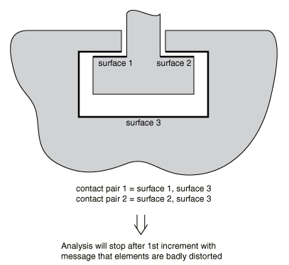
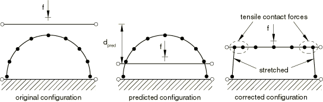
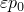

# 39.2.2 Abaqus/Explicit中使用接触对的接触建模常见困难

**产品：** Abaqus/Explicit  Abaqus/CAE  

##### **参考资料**

- ["在Abaqus/Explicit中定义接触对，" 第36.5.1节](pt09ch36s05aus160.md)
- [*CONSTRAINT CONTROLS](../key/key-link.md#usb-kws-hconstraintcontrols)
- [*CONTACT PAIR](../key/key-link.md#usb-kws-hcontactpair)

### 概述

本节重点介绍在Abaqus/Explicit中使用接触对建模接触相互作用时最常遇到的困难。这些问题在使用通用接触算法时大多不相关；有关通用接触相互作用的问题的详细信息，参阅["在Abaqus/Explicit中定义通用接触相互作用，" 第36.4.1节](pt09ch36s04aus155.md)。提供了关于如何规避这些问题的建议。

### 在主表面上定义重复节点

当定义由单元面形成的三维表面时，避免使用相同坐标定义两个表面节点。这样的定义可能在表面中产生缝隙或裂缝，如[图39.2.2-1](pt09ch39s02aus186.md#aexpcontact-mesh-crack)所示。

**图39.2.2-1** 双重定义的表面节点示例。

如果使用Abaqus/CAE中的默认绘图选项查看，此表面将看起来是一个有效的连续表面；但是，沿此表面滑动的节点可能会穿过此裂缝并违反接触条件。如果发生这种情况，Abaqus/Explicit将通过在检测到过闭合后对节点施加大的加速度来强制接触条件。由此产生的大加速度可能产生嘈杂的解或导致单元严重扭曲。

使用Abaqus/CAE可视化模块中的边缘显示选项来识别模型中使用的表面上任何不需要的裂缝。裂缝将显示为表面内部的额外周线。在前处理器中创建模型时，通过等价节点可以轻松避免重复节点。

### 使用不充分的表面定义来满足所需的接触条件

偶尔，表面定义可能不适合对问题中的所需接触条件进行建模。[图39.2.2-2](pt09ch39s02aus186.md#acontact-exp-inad-surf)显示了两个零件之间简单连接的三维模型。

**图39.2.2-2** 不适合所需接触条件的表面定义。

图中所示的表面不适合所示的所需接触条件。在模拟开始时，Abaqus/Explicit会检测到表面3上的某些节点在表面1和2后面。当强制执行接触条件时，表面运动可能导致单元严重扭曲。解决这个问题的一种方法如[图39.2.2-3](pt09ch39s02aus186.md#acontact-exp-adeq-surf)所示。

**图39.2.2-3** 适合所需接触条件的表面定义。

该图中的表面适合所需的接触定义。其他解决方案（如使用纯主-从接触对）对于此问题存在，可能更适合，具体取决于预期模拟的细节。

### 使用网格粗糙的表面

若干问题是由非常粗糙的网格创建的表面引起的。

#### 使用硬表面行为时粗糙离散表面的穿透

当粗糙离散表面用作纯主-从接触对中的从表面且具有硬表面行为时，由于主表面大量穿透从表面，可能产生不准确的结果。这种情况如[图39.2.2-4](pt09ch39s02aus186.md#aexpcontact-mast-surf-pen)所示。如果接触对可以切换到平衡主-从接触对，则可以最小化此问题。但是，Abaqus/Explicit中的某些接触对必须始终使用纯主-从公式。在这些情况下，大量穿透的唯一解决方案是细化从表面。

**图39.2.2-4** 由于粗糙离散化导致主表面穿透从表面。

#### 粗糙离散刚表面的问题

对于由单元面形成的刚表面，如果使用的单元太少来表示曲线几何，则可能获得不准确的结果。当在曲线几何上使用非常粗糙的网格时，从节点可能"卡在"尖锐的顶点上。

一般来说，使用合理数量的单元面来表示曲面不会增加模拟的计算时间。但是，大量单元面可能会显著增加Abaqus/Explicit模拟所需的内存。当可以建模特定曲线表面几何时，使用解析刚表面可以以更低的计算成本提供更准确的几何描述；参见["解析刚表面定义，" 第2.3.4节](pt01ch02s03aus19.md)。

#### 刚体-刚体相互作用中的惩罚接触行为敏感性

接触惩罚 generally由稳定时间增量考虑和节点 involved in接触的质量决定。为了在刚体相互接触时计算可靠的接触惩罚，Abaqus/Explicit通过在可能参与接触的所有节点上分布刚体的质量来全面考虑刚体的惯性特性。因此，最终接触惩罚将取决于刚体中包含在接触定义中的实际刚表面的尺寸。因此，接触响应（力、穿透）将在一定程度上取决于您在定义刚体上的接触表面时的选择。如果发生大穿透，为刚体指定现实的惯性属性 generally有助于解决问题。或者，您可以使用惩罚的缩放因子来以更准确的方式强制接触。

### 与边界条件的冲突

如果边界约束应用于接触对两个表面上的接触节点（沿接触约束活跃的方向），边界约束可能覆盖接触约束。对于运动学接触，接触力相关量将输出为在单个增量中解决接触约束所需的力，如果边界约束违反接触约束，则会导致这些输出量的误导性结果。惩罚接触的接触力输出不显示此行为，因为接触力仅与当前穿透成正比，不取决于时间增量。边界约束不受接触约束的影响。

### 与多点约束的冲突

将多点约束（MPC）与作为活动运动学接触对一部分的表面上的节点一起使用可能会在模型中产生冲突的运动学约束。Abaqus/Explicit不会阻止您在形成表面的节点上使用多点约束。如果接触约束和MPC形成的约束正交，则模拟不会有问题。如果它们不是正交的，则解可能是嘈杂的，因为Abaqus/Explicit试图满足冲突的约束。由于在每个增量中运动学接触约束在MPC之后应用，运动学接触表面上的MPC可能略微不合规。

在MPC和惩罚接触相互作用的情况下，MPC被严格强制执行，接触对中的任何不合规将由惩罚力抵抗。

### 具有硬接触的壳节点上的冲突接触约束

当壳或薄膜被使用两个具有硬接触行为的运动学接触对夹在两个主表面之间时，其中一个接触约束将不会被精确强制。在准静态分析中，可以观察到被夹住的从节点围绕"平衡"穿透深度振荡，衰减率取决于时间增量以及被夹住节点的质量与主表面质量的比值。减小时间增量大小将增加衰减率（将更快达到准静态平衡）。减少主表面节点的质量（或增加被夹节点的质量）也将增加衰减率，尽管从质量与主质量的high比值也可能导致运动学接触的数值困难，如下文["接触表面之间的大质量不匹配"](pt09ch39s02aus186.md#usb-cni-aexpcontacttrouble-largemassmismatch)中讨论的。逐渐向模型施加载荷将减少振荡的振幅。在大多数分析中，不希望任意改变时间增量或节点质量，因此振荡的衰减率将是固定的。要么可以修改加载率，要么可以使用带有接触阻尼的软化接触模型来控制这种振荡行为。

准静态平衡穿透大小，，大致由给出

其中*f*是法向接触力，是增量大小，*m*是被夹节点的重量。准静态平衡穿透如果与壳或薄膜厚度相比很小，将是最小的。在分析期间改变时间增量大小或被夹表面上的载荷会导致准静态平衡穿透发生变化，这可能负责节点的大加速度，并可能导致解噪声（通常，此行为表现为接触结果（如CPRESS）的跳跃）。对于被夹表面，类似的嘈杂行为可能跨过step边界发生，即使时间增量大小在step边界上是一致的。

如果使用一个运动学接触对和一个惩罚接触对来建模相同类型的夹紧问题，则运动学约束被精确强制，并且惩罚接触对中的穿透静态值比当两个接触对都使用运动学接触时发生的要大（假设惩罚刚度被设置为使得分析对于所使用的时间增量是数值稳定的）。

### 固体节点上的多个运动学接触约束

如果未连接到壳或薄膜元素的节点（即连接到实体单元或点质量的节点）同时作为两个或多个运动学接触约束的从节点，则 resulting的接触校正可能错误，可能导致分析因单元过度扭曲而中止。"未连接到壳或薄膜元素"是指例如连接到实体单元的节点。大多数实体节点通常不参与同时接触，但有三个或更多物体在角落相遇的情况是常见的例外。可以通过使用惩罚接触来避免此限制。例如，如果实体表面在两个接触对中充当从表面，并且个别从节点可能同时接触，则应为其中一个或两个接触对指定惩罚强制。

### 冗余和退化接触约束

冗余接触约束是由重叠或相邻表面引起的。例如，如果在单个表面和多个重叠表面之间指定接触，则重叠表面公共节点的关联接触约束是冗余的。当接触对的从表面和主表面包含公共节点时会发生退化接触约束（约束不能在节点与其自身之间形成）。

如果指定了冗余运动学接触约束，且两个接触对都使用纯主-从接触、从表面不共享小面且表面相互作用和接触对集名称相同，则Abaqus/Explicit将合并约束。如果接触对定义不同，分析将终止，并且必须从模型定义中删除一个冗余约束才能继续分析。

冗余惩罚接触约束可能导致过多的初始过闭合调整，在初始过闭合的位置产生间隙。要纠正此行为，必须从模型定义中删除其中一个约束。

涉及惩罚接触对和运动学接触对的冗余接触约束会导致分析效率低下。运动学接触约束将覆盖惩罚接触约束，但惩罚接触约束仍将在自动时间增量估计中被考虑。

如果两面接触对中的表面包含公共节点，则无法为每个共享节点生成接触约束。这相当于定义共享节点与每个表面之间的自接触。但是，两面接触逻辑（与专用自接触逻辑不同）会错误地检测每个共享节点与其自身之间的接触。当发生这种情况时，Abaqus/Explicit重新定义从表面，以便共享节点不会在接触对中充当从节点。但是，共享节点仍将用于接触对中主表面的定义。

### 接触表面之间的大质量不匹配

在准静态模拟中，刚体通常被分配非常小的质量，因为质量对物理问题影响很小。但是，指定小的刚体质量会对运动学接触强制方法产生不利影响。施加到具有非常小质量的刚体上的力可能在增量中导致刚体的大预测位移，然后在强制接触约束之前，因此可能在运动学接触的"预测"配置中存在显著穿透，如[图39.2.2-5](pt09ch39s02aus186.md#acontact-compress-arch)所示。

**图39.2.2-5** 由于小刚体质量导致的接触算法的不良数值行为。

对于硬运动学接触，每个在预测配置中穿透其主表面的从节点将在校正配置中被带到其跟踪点在主表面上的位置，这在接触区域的外部从节点处产生法向接触力。可以通过增加刚体质量来避免这种不良影响，这将减少预测的位移增量。小的刚体质量也可能对惩罚接触的强制产生不良影响，因为会分配小的惩罚刚度。

对于可变形体-可变形体接触，如果主节点的质量比从节点的质量小几个数量级，也可能发生类似的不良数值行为。在这种情况下，通过使用纯主-从算法（主表面包含更重节点的表面）通常可以避免此问题。

### 硬接触的有限计算机精度相关的接触噪声

某些接触噪声可能发生在硬接触模型中，因为计算机精度有限。这种噪声在分析中很少显著，但如果使用初始位移使网格符合接触约束，则在分析开始时可能很明显。例如，如果对初始过闭合进行了的调整，在第一个增量中仍可能存在最多的穿透，其中是"机器epsilon"。给定计算机的机器epsilon定义为可添加到1的最小正数，且计算结果大于1；在大多数系统上，对于单精度大约为6E-8，对于双精度大约为1E-16。使用运动学接触算法，您可以属性最多的初始加速度为有限机器精度，其中是时间增量。对于单精度分析，其中=1E-6秒，最多6E-2 sec²的初始加速度可以归因于有限的机器精度。这些加速度通常可以忽略不计。可以通过以双精度进行分析或将节点坐标指定为更符合接触约束来减少。

### 对称平面附近的有限滑动接触

当具有有限滑动的纯主-从接触约束定义在主表面对称平面附近时，在某些情况下，角从节点（[图39.2.2-6](pt09ch39s02aus186.md#acontact-mast-symm)中的节点*A*）可以沿对称平面自由滑动而不经历接触。如果主表面缠绕角落（节点1），从节点*A*可能"跟踪"对称平面上的主段（1-6），而不是主段（1-2）。结果可能是接触约束的不准确表示，如阴影区域所示。

**图39.2.2-6** 对称平面附近的接触。主表面缠绕角落。

如果主表面不缠绕角落（[图39.2.2-7](pt09ch39s02aus186.md#acontact-mast-symm-type)中的节点1），接触逻辑可能根据为主表面节点1在对称平面上定义的边界条件类型给出不同结果。如果主节点上的对称边界条件使用边界"类型"格式指定（即XSYMM、YSYMM或ZSYMM——参见["Abaqus/Standard和Abaqus/Explicit中的边界条件，" 第34.3.1节](pt07ch34s03aus118.md)），则主表面有效延伸到对称平面之外（[图39.2.2-7](pt09ch39s02aus186.md#acontact-mast-symm-type)）；因此，从节点*A*将被检测为"穿透"节点（穿透距离*a*）。因此，将在从节点*A*上施加校正力以将其推到主表面下方。

**图39.2.2-7** 主表面延伸到对称平面，因为节点1处的对称边界条件使用边界类型XSYMM指定。

如果主节点1上的对称边界条件使用"直接"格式指定（即指定固定和平移和旋转的组件），则主表面不会延伸到对称平面之外（[图39.2.2-8](pt09ch39s02aus186.md#acontact-mast-symm-direct)），并且可能无法正确强制接触。

**图39.2.2-8** 主表面不会延伸到对称平面，因为节点1处的对称边界条件使用直接格式指定。

为确保在对称平面附近正确强制有限滑动接触，请使用平衡主-从接触，或者使用不将表面延伸到对称平面上的纯主-从接触，并在主表面节点周界上使用对称"类型"边界条件，如上所述。小滑动接触在对称平面附近的特殊情况在["Abaqus/Explicit中接触对的接触公式，" 第38.2.2节](pt09ch38s02aus181.md)中讨论。

### 精确指定初始间隙值

您可以为从表面节点精确指定初始间隙和接触方向（参见["精确指定初始间隙值" "调整初始表面位置和在Abaqus/Explicit接触对中指定初始间隙，" 第36.5.4节](pt09ch36s05aus163.md#usb-cni-aexpadjustsurfaces-clearance)）。基于从节点坐标和主表面计算的每个从节点的初始间隙或过闭合值将被您指定的值覆盖；从节点坐标不变。当从节点坐标无法足够精确地计算初始间隙时，此技术允许精确指定初始间隙（和可能的接触方向）；例如，如果初始间隙与坐标值相比非常小。它只能用于小滑动接触分析（["Abaqus/Explicit中接触对的接触公式，" 第38.2.2节](pt09ch38s02aus181.md))。

当为接触对调用平衡-主-从接触算法时，可以在一个或两个表面上定义初始间隙。仅作为主表面的接触表面上定义的初始间隙将被忽略。

### 可视化小滑动接触对的精确初始间隙

当为小滑动接触对指定精确初始间隙时，Abaqus/Explicit不会调整从表面的坐标（参见["调整初始表面位置和在Abaqus/Explicit接触对中指定初始间隙，" 第36.5.4节](pt09ch36s05aus163.md)）。因此，指定的间隙无法在后处理器（如Abaqus/CAE的可视化模块）中看到。因此，根据表面的初始几何和间隙或过闭合的大小，表面可能在后处理器中显示为打开或闭合，而实际上它们实际上刚刚接触。

