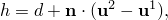
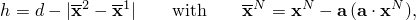
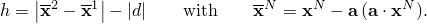
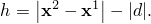
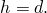

# 40.2.1 间隙接触单元


**产品：** Abaqus/Standard

##### **参考资料**

- ["间隙单元库，" 40.2.2节](pt09ch40s02ael49.md)
- [*GAP](../key/key-link.md#usb-kws-mgap)

### 概述

间隙单元：
- 允许两个节点之间的接触；
- 允许节点处于接触状态（间隙闭合）或分离状态（间隙张开），并针对特定方向和分离条件；
- 始终在三维空间中定义，但也可用于二维和轴对称模型；
- 允许在任何类型的单元上定义接触，包括子结构和用户定义单元；
- 可用于模拟固定方向或旋转方向中的接触；
- 可用于在耦合温度-位移模拟中，在空间固定方向上模拟节点到节点的接触和热相互作用；以及
- 可用于传热分析中模拟节点到节点的热相互作用。

Abaqus/Standard中接触建模的详细讨论，请参阅[第36章，"定义接触相互作用"](pt09ch36.md)。

### 选择和定义间隙单元

GAPUNI单元在接触方向在空间中固定时，用于模拟两个节点之间的接触。GAPCYL单元在接触方向与某轴正交时，用于模拟两个节点之间的接触。GAPSPHER单元在接触方向在空间中任意时，用于模拟两个节点之间的接触。GAPUNIT单元在接触方向在空间中固定时，用于模拟两个节点之间的接触和热相互作用。DGAP单元在传热分析中用于模拟两个节点之间的热相互作用。

通过指定形成间隙的两个节点并提供定义初始状态以及必要时的间隙方向的几何数据来定义间隙单元。

### 定义间隙单元的属性

必须将间隙行为与一组间隙单元相关联。

| **输入文件用法：** | ``` [*GAP](../key/key-link.md#usb-kws-mgap), ELSET=*element_set_name* ``` |
| --- | --- |

#### GAPUNI和GAPUNIT单元

使用GAPANI和GAPUNIT单元建模的界面的接触行为由间隙的初始分离距离（间隙）*d*和接触方向定义。在耦合温度-位移分析中，GAPUNIT单元具有允许模拟热相互作用的温度自由度。

##### GAPUNI节点之间的间隙

Abaqus/Standard将间隙两个节点之间的当前间隙*h*定义为



其中和分别是形成GAPUNI单元的第一个和第二个节点的总位移。[图40.2.1-1](pt09ch40s02alm64.md#egap-gapuni)显示了GAPUNI单元的配置。当*h*变为负值时，间隙接触单元闭合，并施加约束。

**图40.2.1-1** GAPUNI和GAPUNIT接触单元。


您需要为*d*指定一个值。如果提供正值，则间隙最初是张开的。如果*d*=0，则间隙最初是闭合的。如果*d*为负值，则认为间隙在分析开始时处于过盈状态，并定义了一个初始过盈配合问题。使用间隙单元建模过盈配合问题的详细信息将在下面讨论。

| **输入文件用法：** | ``` [*GAP](../key/key-link.md#usb-kws-mgap) *d* ``` |
| --- | --- |

##### 指定接触方向

您可以指定接触方向。否则，Abaqus/Standard将使用形成单元的两个节点的初始位置和来计算间隙方向：


如果（如果两个间隙单元节点具有相同的初始坐标），则会发出错误消息。在这种情况下，您必须定义。如果分析开始时间隙处于过盈状态，法向通常从元素的第一个节点指向第二个节点。在这种情况下，请指定，以使间隙单元使用正确的接触方向。

如果您指定间隙方向而不是让Abaqus/Standard计算它，则接触计算仅考虑、间隙单元节点的位移以及元素定义中节点的顺序：节点的初始坐标在计算中不起作用。

在分析过程中，的方向不会改变。

| **输入文件用法：** | ``` [*GAP](../key/key-link.md#usb-kws-mgap) , *X方向余弦*, *Y方向余弦*, *Z方向余弦* ``` |
| --- | --- |

##### GAPUNI单元输出的局部坐标系

Abaqus/Standard将穿过间隙传递的压力以及与接触方向正交的剪应力作为GAPANI单元的单元输出进行报告。您必须为这些单元提供相关的接触面积，以便Abaqus/Standard计算压力和剪应力值。它还报告间隙中的当前间隙*h*以及与接触方向正交的GAPUNI节点的相对运动。相对运动和剪应力在局部表面方向中报告，这些方向是使用Abaqus定义空间中表面方向的标准约定形成的（请参阅["约定，"第1.2.2节](pt01ch01s02aus02.md)）。接触方向定义了形成局部轴的表面空间。

| **输入文件用法：** | ``` [*GAP](../key/key-link.md#usb-kws-mgap) , , , , *横截面积* ``` |
| --- | --- |

#### GAPCYL单元

GAPCYL单元可用于模拟两种非常不同的接触情况：两个刚性管之间的接触，其中较小的管位于较大的管内部，以及沿其外表面接触的两个刚性管之间的接触。两种情况都显示在[图40.2.1-2](pt09ch40s02alm64.md#egap-gapcyl-gapspher)中。

**图40.2.1-2** GAPCYL/GAPSPHER接触单元的间隙。


GAPCYL单元的行为由节点之间的初始分离距离*d*、单元节点的当前位置以及GAPCYL单元的轴定义。GAPCYL单元的轴定义了接触方向所在的平面。您需要指定*d*和GAPCYL单元轴的方向余弦。

不允许值：这会强制节点之间的距离在所有时间正好为零，这不对应于接触问题。

| **输入文件用法：** | ``` [*GAP](../key/key-link.md#usb-kws-mgap) *d*, *X方向余弦*, *Y方向余弦*, *Z方向余弦* ``` |
| --- | --- |

##### 情况1定义间隙清除（当*d*为正时）

如果*d*为正，则GAPCYL单元模拟两个不同直径的刚性管之间的接触，其中较小的管位于较大的管内部（请参阅[图40.2.1-2](pt09ch40s02alm64.md#egap-gapcyl-gapspher)中的情况1）。在这种情况下，*d*是最大允许分离。每个管由其轴上的一个节点表示，轴由GAPCYL单元连接；*d*对应于管的半径差。当两个节点在任何方向上分离超过*d*时（在GAPCYL单元轴定义的平面中），间隙闭合。

对于情况1，Abaqus/Standard将GAPCYL单元中的当前间隙开口*h*定义为



其中是节点*N*的当前位置，*d*是指定的初始分离，*a*是GAPCYL单元的轴。

如果管轴的初始位置使得它们之间的距离小于*d*，则GAPCYL单元最初是张开的。如果距离等于*d*，则单元最初是闭合的；如果距离大于*d*，则定义初始过盈（干涉）。使用间隙单元建模过盈配合问题的详细信息将在下面讨论。

##### 情况2定义间隙清除（当*d*为负时）

如果*d*为负，则GAPCYL单元模拟两个平行刚性圆柱体之间的外部接触（请参阅[图40.2.1-2](pt09ch40s02alm64.md#egap-gapcyl-gapspher)中的情况2）。在这种情况下，是节点的最小允许分离。每个圆柱体由其轴上的一个节点表示，由GAPCYL单元连接；对应于圆柱体半径之和。当两个节点在GAPCYL单元轴定义的平面中的任何方向上相互接近到时，间隙闭合。

对于情况2，Abaqus/Standard将GAPCYL单元中的当前间隙开口*h*定义为



如果圆柱体轴的初始位置使得它们之间的距离大于，则GAPCYL单元最初是张开的。如果距离等于，则单元最初是闭合的；如果距离小于，则定义初始过盈（干涉）。使用间隙单元建模过盈配合问题的详细信息将在下面讨论。

##### GAPCYL单元输出的局部坐标系

Abaqus/Standard将穿过间隙传递的压力以及与接触方向正交的剪应力作为GAPCYL单元的单元输出进行报告。您必须为这些单元提供相关的接触面积，以便Abaqus/Standard计算压力和剪应力值。它还报告间隙中的当前间隙*h*以及与接触方向正交的单元节点的相对运动。相对运动和剪应力在局部表面方向中报告，这些方向是使用Abaqus定义空间中表面方向的标准约定形成的（请参阅["约定，"第1.2.2节](pt01ch01s02aus02.md)）。接触方向定义了形成局部轴的表面空间，滑移是根据表面方向中的相对运动计算的。

Abaqus/Standard会根据形成单元的节点的运动更新GAPCYL单元的接触方向。但是，在分析过程中不会更新方向。

| **输入文件用法：** | ``` [*GAP](../key/key-link.md#usb-kws-mgap) , , , , *横截面积* ``` |
| --- | --- |

#### GAPSPHER单元

GAPSPHER单元可用于模拟两种非常不同的接触情况：两个刚性球体之间的接触，其中较小的球体位于较大的空心球体内部，以及沿其外表面接触的两个刚性球体之间的接触。两种情况都显示在[图40.2.1-2](pt09ch40s02alm64.md#egap-gapcyl-gapspher)中。

GAPSPHER单元的行为由节点之间的最小或最大分离距离*d*以及单元节点的当前位置定义。您需要指定最小或最大分离距离*d*。接触方向由节点的当前位置定义。

不允许值：这会强制节点之间的距离在所有时间正好为零，这不对应于接触问题。

| **输入文件用法：** | ``` [*GAP](../key/key-link.md#usb-kws-mgap) *d* ``` |
| --- | --- |

##### 情况1定义间隙清除（当*d*为正时）

如果*d*为正，则GAPSPHER单元模拟一个刚性球体在另一个（更大的）空心刚性球体内部的接触（请参阅[图40.2.1-2](pt09ch40s02alm64.md#egap-gapcyl-gapspher)中的情况1）。在这种情况下，*d*是形成间隙的节点的最大允许分离。每个球体由其中心的一个节点表示，中心由GAPSPHER单元连接；*d*对应于球体的半径差。当两个节点分离超过*d*时，间隙闭合。

对于情况1，Abaqus/Standard将当前间隙开口*h*定义为


其中是节点*N*的当前位置，*d*是指定的分离。

如果管轴的初始位置使得它们之间的距离小于*d*，则GAPSPHER单元最初是张开的。如果距离等于*d*，则单元最初是闭合的；如果距离大于*d*，则定义初始过盈（干涉）。使用间隙单元建模过盈配合问题的详细信息将在下面讨论。

##### 情况2定义间隙清除（当*d*为负时）

如果*d*为负，则GAPSPHER单元模拟两个刚性球体之间的外部接触（请参阅[图40.2.1-2](pt09ch40s02alm64.md#egap-gapcyl-gapspher)中的情况2）。在这种情况下，是形成间隙的节点的最小允许分离。每个球体由其中心的一个节点表示，由GAPSPHER单元连接；对应于球体半径之和。当两个节点相互接近到时，间隙闭合。

对于情况2，Abaqus/Standard将当前间隙开口*h*定义为



如果圆柱体轴的初始位置使得它们之间的距离大于，则GAPSPHER单元最初是张开的。如果距离等于，则单元最初是闭合的；如果距离小于，则定义初始过盈（干涉）。使用间隙单元建模过盈配合问题的详细信息将在下面讨论。

##### GAPSPHER单元输出的局部坐标系

Abaqus/Standard将穿过间隙传递的压力以及与接触方向正交的剪应力作为GAPSPHER单元的单元输出进行报告。您必须为这些单元提供相关的接触面积，以便Abaqus/Standard计算压力和剪应力值。它还报告间隙中的当前间隙*h*以及与接触方向正交的单元节点的相对运动。相对运动和剪应力在局部表面方向中报告，这些方向是使用Abaqus定义空间中表面方向的标准约定形成的；请参阅["约定，"第1.2.2节](pt01ch01s02aus02.md)。接触方向定义了形成局部轴的表面空间，滑移是根据表面方向中的相对运动计算的。

Abaqus/Standard会根据形成单元的节点的运动更新GAPSPHER单元的接触方向。

| **输入文件用法：** | ``` [*GAP](../key/key-link.md#usb-kws-mgap) , , , , *横截面积* ``` |
| --- | --- |

#### DGAP单元

DGAP单元用于在传热分析中模拟两个节点之间的热相互作用。所建模的相互作用的行为由间隙的初始分离距离（间隙）*d*定义。

##### DGAP节点之间的间隙

Abaqus/Standard将间隙两个节点之间的间隙*h*定义为



由于传热分析中没有位移，间隙保持不变。间隙仅用于与间隙相关的热相互作用。

您需要为*d*指定一个值。如果提供正值，则间隙最初是张开的。如果*d*=0，则间隙最初是闭合的。如果*d*为负值，则认为间隙处于过盈状态，但不会执行过盈配合。不需要指定接触方向：在分析中忽略任何指定的接触方向。您必须为这些单元提供相关的接触面积，以便Abaqus/Standard计算热通量值。

| **输入文件用法：** | ``` [*GAP](../key/key-link.md#usb-kws-mgap) *d*, , , , *横截面积* ``` |
| --- | --- |

### 使用间隙单元定义非默认机械相互作用

使用间隙单元建模的问题的默认机械相互作用模型是"硬"无摩擦接触。您可以分配可选的机械相互作用模型。以下机械相互作用模型可用：
- 摩擦。详细信息请参阅["摩擦行为，"第37.1.5节](pt09ch37s01aus169.md)。
- 修正的"硬"接触、软化接触和粘性阻尼。详细信息请参阅["接触压力-闭合关系，"第37.1.2节](pt09ch37s01aus166.md)和["接触阻尼，"第37.1.3节](pt09ch37s01aus167.md)。

### 使用GAPUNIT和DGAP单元定义热表面相互作用

您可以为这些单元分配热相互作用模型。以下热相互作用模型可用：
- 间隙传导。
- 间隙辐射。
- 间隙热生成。

这些热相互作用模型在["热接触属性，"第37.2.1节](pt09ch37s02aus174.md)中讨论。

### 使用间隙单元建模大初始干涉

指定大的负初始过盈（干涉）可能导致收敛问题，因为Abaqus/Standard尝试在单个增量中解决过盈。您可以规定允许的干涉量，以允许Abaqus/Standard逐渐解决过盈。有关建模干涉配合问题的更多详细信息，请参阅["在Abaqus/Standard中建模接触干涉配合，"第36.3.4节](pt09ch36s03aus148.md)。

| **输入文件用法：** | ``` [*CONTACT INTERFERENCE](../key/key-link.md#usb-kws-hcontactinterfer), TYPE=ELEMENT ``` |
| --- | --- |


# 40.2 间隙接触单元


- ["间隙接触单元，"第40.2.1节](pt09ch40s02alm64.md)
- ["间隙单元库，"第40.2.2节](pt09ch40s02ael49.md)


# 40.3 管对管接触单元


- ["管对管接触单元，"第40.3.1节](pt09ch40s03alm65.md)
- ["管对管接触单元库，"第40.3.2节](pt09ch40s03ael50.md)


# 40.3.1 管对管接触单元


**产品：** Abaqus/Standard

##### **参考资料**

- ["管对管接触单元库，"第40.3.2节](pt09ch40s03ael50.md)
- [*INTERFACE](../key/key-link.md#usb-kws-minterface)
- [*SLIDE LINE](../key/key-link.md#usb-kws-mslideline)

### 概述

管对管单元：
- 模拟两根管道或管之间的有限滑动相互作用，其中一根管位于另一根内部，或者两根平行放置的管或棒沿其外表面相互接触；
- 是滑移线接触单元，因为它们假定两根管或管的相对运动主要沿着由其中一根管的轴定义的线（假定管或管轴的相对旋转很小）；
- 可与管道、梁或桁架单元一起使用；以及
- 不考虑管或管道横截面的变形。

[第36章"定义接触相互作用"](pt09ch36.md)包含接触建模的一般讨论。

### 典型应用

管对管接触单元可用于模拟两类特定的管对管接触问题：内部（管内管）接触和外部接触，其中两根管大致平行并沿其外表面相互接触。

### 选择合适的单元

将ITT21单元与二维梁、管道或桁架单元一起使用。将ITT31单元与三维梁、管道或桁架单元一起使用。这些单元中的每一个都由单个节点定义。

### 将管对管接触单元与滑移线关联

您必须指明哪一组管对管接触单元将与特定的滑移线相互作用。有关定义滑移线的详细信息将在下面讨论。

| **输入文件用法：** | ``` [*SLIDE LINE](../key/key-link.md#usb-kws-mslideline), ELSET=*element_set_name* ``` |
| --- | --- |

### 定义单元的截面属性

必须将几何截面属性与一组管对管接触单元相关联。

| **输入文件用法：** | ``` [*INTERFACE](../key/key-link.md#usb-kws-minterface), ELSET=*element_set_name* ``` |
| --- | --- |

#### 定义管道内部的管道之间接触的径向间隙

定义管道之间的径向间隙。给出一个正值，以模拟当一根管道（带有管对管接触单元的管道）位于另一根管道内部时两根管道之间的接触。该值是外管内半径与内管外半径之差。

| **输入文件用法：** | ``` [*INTERFACE](../key/key-link.md#usb-kws-minterface) *radial_clearance* ``` |
| --- | --- |

#### 定义两根管道外表面之间接触的径向间隙

通过为径向间隙指定负值来模拟外部管对管接触。该值的幅度必须是两根管道或棒的外部半径之和。

### 接触输出变量的局部基

ITT元素的元素输出变量在与滑移线关联的局部坐标系中给出。第一个切向向量由形成滑移线的节点序列定义。接触方向是滑移线的法向，指向ITT单元的节点。对于ITT31单元，Abaqus/Standard会形成第二个切向向量，它既垂直于又垂直于。随着单元的移动，局部坐标系将随滑移线的轴旋转。

### 选择哪根管道（梁或桁架）具有滑移线

在内部管对管接触的情况下，滑移线可以放在内管或外管上。通常，滑移线应该与外管相关联（请参阅[图40.3.1-1](pt09ch40s03alm65.md#eitt-slide-line)）；但是，如果内管比外管更硬，则滑移线应该附着在内管上。

**图40.3.1-1** 内部管对管接触示例。


如果接触发生在管道的外表面，则如果材料或管道半径不同，滑移线应该与较硬的管道相关联；如果相同，则与具有较粗网格的管道相关联。

### 定义滑移线

您可以指定组成滑移线的节点，或者可以按如下所述生成它们。如果您选择直接指定节点，则必须按定义连续滑移线的顺序指定它们。节点序列为滑移线定义切向向量。滑移线必须由线性段组成。

| **输入文件用法：** | ``` [*SLIDE LINE](../key/key-link.md#usb-kws-mslideline), ELSET=*element_set_name*, TYPE=LINEAR *first_node_number, second_node_number, etc.* ``` |
| --- | --- |

#### 生成滑移线节点

或者，您可以指示应生成滑移线节点，并仅指定第一个节点编号、最后一个节点编号以及节点编号之间的增量。

| **输入文件用法：** | ``` [*SLIDE LINE](../key/key-link.md#usb-kws-mslideline), GENERATE *first_node_number, last_node_number, increment_between_node_numbers* ``` |
| --- | --- |

#### 平滑滑移线

通过平滑滑移线段之间表面切向的不连续性，通常可以改善收敛性，从而沿滑移线提供平滑变化的切线。有关平滑滑移线的详细信息，请参阅["Abaqus/Standard中的接触公式，"第38.1.1节](pt09ch38s01aus177.md)。

### 使用管对管接触单元定义非默认机械表面相互作用

默认情况下，Abaqus/Standard对管对管接触单元使用"硬"无摩擦接触。您可以分配可选的机械表面相互作用模型。以下机械表面相互作用模型可用：
- 摩擦。详细信息请参阅["摩擦行为，"第37.1.5节](pt09ch37s01aus169.md)。
- 修正的"硬"接触、软化接触和粘性阻尼。详细信息请参阅["接触压力-闭合关系，"第37.1.2节](pt09ch37s01aus166.md)和["接触阻尼，"第37.1.3节](pt09ch37s01aus167.md)。


# 40.4 滑移线接触单元


- ["滑移线接触单元，"第40.4.1节](pt09ch40s04alm66.md)
- ["轴对称滑移线单元库，"第40.4.2节](pt09ch40s04ael51.md)


