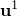
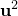
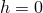
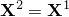

# 40.2.1 间隙接触单元


**产品：** Abaqus/Standard

##### **参考资料**

- ["间隙单元库，" 第40.2.2节](pt09ch40s02ael49.md)
- [*GAP](../key/key-link.md#usb-kws-mgap)

### 概述

间隙单元：
- 可以模拟两个节点之间的接触；
- 允许节点在特定方向和分离条件下处于接触状态（间隙闭合）或分离状态（间隙张开）；
- 始终在三维空间中定义，但也可用于二维和轴对称模型；
- 允许在任何类型的单元上定义接触，包括子结构和用户定义单元；
- 可用于模拟固定方向或旋转方向中的接触；
- 可用于在耦合温度-位移模拟中模拟固定空间方向上的节点对节点接触和热相互作用；以及
- 可用于在热传递分析中模拟节点对节点热相互作用。

Abaqus/Standard中接触建模的一般讨论请参阅[第36章"定义接触相互作用"](pt09ch36.md)。

### 选择和定义间隙单元

GAPUNI单元用于模拟接触方向固定在空间中的两个节点之间的接触。GAPCYL单元用于模拟接触方向与某轴正交的两个节点之间的接触。GAPSPHER单元用于模拟接触方向在空间中任意方向的两个节点之间的接触。GAPUNIT单元用于模拟接触方向固定在空间中的两个节点之间的接触和热相互作用。DGAP单元用于在热传递分析中模拟两个节点之间的热相互作用。

间隙单元通过指定形成间隙的两个节点并提供定义初始状态和（如果需要）间隙方向的几何数据来定义。

### 定义间隙单元的属性

必须将间隙行为与一组间隙单元相关联。

| **输入文件用法：** | ``` [*GAP](../key/key-link.md#usb-kws-mgap), ELSET=*element_set_name* ``` |
| --- | --- |

#### GAPUNI和GAPUNIT单元

使用GAPUNI和GAPUNIT单元建模的界面接触行为由间隙的初始分离距离（间隙）*d*和接触方向定义。此外，GAPUNIT单元具有允许在耦合温度-位移分析中模拟热相互作用的温度自由度。

##### GAPUNI节点之间的间隙

Abaqus/Standard将间隙两个节点之间的当前间隙*h*定义为


其中和是形成GAPUNI单元的第一个和第二个节点的总位移。[图40.2.1-1](pt09ch40s02alm64.md#egap-gapuni)显示了GAPUNI单元的配置。当*h*变为负值时，间隙接触单元闭合，并施加约束。

**图40.2.1-1** GAPUNI和GAPUNIT接触单元。


您需要为*d*指定一个值。如果提供正值，间隙最初是张开的。如果*d*=0，间隙最初是闭合的。如果*d*为负值，则认为间隙在分析开始时处于过盈状态，并定义初始过盈配合问题。以下将讨论使用间隙单元建模过盈配合问题的详细信息。

| **输入文件用法：** | ``` [*GAP](../key/key-link.md#usb-kws-mgap) *d* ``` |
| --- | --- |

##### 指定接触方向

您可以指定接触方向。否则，Abaqus/Standard将使用形成单元的两个节点的初始位置来计算间隙方向：和：


如果（如果两个间隙单元节点具有相同的初始坐标），则会发出错误消息。在这种情况下，您必须定义。法向通常从单元的第一个节点指向第二个节点，除非间隙在分析开始时处于过盈状态。在这种情况下，请指定以便为间隙单元使用正确的接触方向。

如果您指定间隙方向而不是让Abaqus/Standard计算它，则接触计算仅考虑、间隙单元节点的位移以及单元定义中节点的顺序：节点的初始坐标在计算中不起作用。

的方向在分析过程中不会改变。

| **输入文件用法：** | ``` [*GAP](../key/key-link.md#usb-kws-mgap) , *X**-方向余弦*, *Y**-方向余弦*, *Z**-方向余弦* ``` |
| --- | --- |

##### GAPUNI单元输出的局部基系统

Abaqus/Standard将跨间隙传递的压力以及与接触方向正交的剪应力报告为GAPUNI单元的单元输出。您必须为这些单元提供相关的接触面积，以便Abaqus/Standard计算压力和剪应力值。它还报告间隙中的当前间隙*h*以及GAPUNI节点在接触方向上的相对运动。相对运动和剪应力在使用Abaqus定义空间中表面方向的标准约定形成的局部表面方向中报告（请参阅["约定，" 第1.2.2节](pt01ch01s02aus02.md)）。接触方向定义了一个表面，局部轴在该表面上形成。

| **输入文件用法：** | ``` [*GAP](../key/key-link.md#usb-kws-mgap) , , , , *横截面积* ``` |
| --- | --- |

#### GAPCYL单元

GAPCYL单元可用于模拟两种非常不同的接触情况：两个刚性管之间的接触，其中较小的管位于较大的管内部，以及两个刚性管沿其外表面之间的接触。两种情况均示于[图40.2.1-2](pt09ch40s02alm64.md#egap-gapcyl-gapspher)中。

**图40.2.1-2** GAPCYL/GAPSPHER接触单元的间隙。


GAPCYL单元的行为由节点之间的初始分离距离*d*、单元节点的当前位置以及GAPCYL单元的轴定义。GAPCYL单元的轴定义了接触方向所在的平面。您需要指定*d*和GAPCYL单元轴的方向余弦。

不允许值：它会强制节点之间的距离在所有时间都恰好为零，这不对应于接触问题。

| **输入文件用法：** | ``` [*GAP](../key/key-link.md#usb-kws-mgap) *d*, *X**-方向余弦*, *Y**-方向余弦*, *Z**-方向余弦* ``` |
| --- | --- |

##### 为情况1定义间隙（当*d*为正时）

如果*d*为正，GAPCYL单元模拟两个不同直径的刚性管之间的接触，其中较小的管位于较大的管内部（请参阅[图40.2.1-2](pt09ch40s02alm64.md#egap-gapcyl-gapspher)中的情况1）。在这种情况下，*d*是最大允许分离。每个管由其轴上的一个节点表示，轴由GAPCYL单元连接；*d*对应于管的半径差。当两个节点在由GAPCYL单元轴定义的平面中分离超过*d*时，间隙闭合。

对于情况1，Abaqus/Standard将GAPCYL单元中的当前间隙*h*定义为


其中是节点*N*的当前位置，*d*是指定的初始分离，*a*是GAPCYL单元的轴。

如果管轴的初始位置使得它们之间的距离小于*d*，则GAPCYL单元最初是张开的。如果距离等于*d*，则单元最初是闭合的；如果距离大于*d*，则定义初始过盈（干扰）。以下将讨论使用间隙单元建模过盈配合问题的详细信息。

##### 为情况2定义间隙（当*d*为负时）

如果*d*为负，GAPCYL单元模拟两个平行刚性圆柱体之间的外部接触（请参阅[图40.2.1-2](pt09ch40s02alm64.md#egap-gapcyl-gapspher)中的情况2）。在这种情况下，是节点的最小允许分离。每个圆柱体由其轴上的一个节点表示，由GAPCYL单元连接；对应于圆柱体半径之和。当两个节点在由GAPCYL单元轴定义的平面中接近到小于时，间隙闭合。

对于情况2，Abaqus/Standard将GAPCYL单元中的当前间隙*h*定义为


如果圆柱体轴的初始位置使得它们之间的距离大于，则GAPCYL单元最初是张开的。如果距离等于，则单元最初是闭合的；如果距离小于，则定义初始过盈（干扰）。以下将讨论使用间隙单元建模过盈配合问题的详细信息。

##### GAPCYL单元输出的局部基系统

Abaqus/Standard将跨间隙传递的压力以及与接触方向正交的剪应力报告为GAPCYL单元的单元输出。您必须为这些单元提供相关的接触面积，以便Abaqus/Standard计算压力和剪应力值。它还报告间隙中的当前间隙*h*以及单元节点在接触方向上的相对运动。相对运动和剪应力在使用Abaqus定义空间中表面方向的标准约定形成的局部表面方向中报告（请参阅["约定，" 第1.2.2节](pt01ch01s02aus02.md)）。接触方向定义了一个表面，局部轴在该表面上形成，滑移从表面方向中的相对运动计算。

Abaqus/Standard根据形成单元的节点的运动更新GAPCYL单元的接触方向。但是，的方向在分析过程中不会更新。

| **输入文件用法：** | ``` [*GAP](../key/key-link.md#usb-kws-mgap) , , , , *横截面积* ``` |
| --- | --- |

#### GAPSPHER单元

GAPSPHER单元可用于模拟两种非常不同的接触情况：两个刚性球体之间的接触，其中较小的球体位于较大的空心球体内部，以及两个刚性球体沿其外表面之间的接触。两种情况均示于[图40.2.1-2](pt09ch40s02alm64.md#egap-gapcyl-gapspher)中。

GAPSPHER单元的行为由节点之间的最小或最大分离距离*d*以及单元节点的当前位置定义。您需要指定最小或最大分离距离*d*。接触方向由节点的当前位置定义。

不允许值：它会强制节点之间的距离在所有时间都恰好为零，这不对应于接触问题。

| **输入文件用法：** | ``` [*GAP](../key/key-link.md#usb-kws-mgap) *d* ``` |
| --- | --- |

##### 为情况1定义间隙（当*d*为正时）

如果*d*为正，GAPSPHER单元模拟位于另一个（较大的）空心刚性球体内部的刚性球体之间的接触（请参阅[图40.2.1-2](pt09ch40s02alm64.md#egap-gapcyl-gapspher)中的情况1）。在这种情况下，*d*是形成间隙的节点的最大允许分离。每个球体由其中心的节点表示，中心由GAPSPHER单元连接；*d*对应于球体的半径差。当两个节点分离超过*d*时，间隙闭合。

对于情况1，Abaqus/Standard将当前间隙*h*定义为


其中是节点*N*的当前位置，*d*是指定的分离。

如果球体轴的初始位置使得它们之间的距离小于*d*，则GAPSPHER单元最初是张开的。如果距离等于*d*，则单元最初是闭合的；如果距离大于*d*，则定义初始过盈（干扰）。以下将讨论使用间隙单元建模过盈配合问题的详细信息。

##### 为情况2定义间隙（当*d*为负时）

如果*d*为负，GAPSPHER单元模拟两个刚性球体之间的外部接触（请参阅[图40.2.1-2](pt09ch40s02alm64.md#egap-gapcyl-gapspher)中的情况2）。在这种情况下，是形成间隙的节点的最小允许分离。每个球体由其中心的节点表示，由GAPSPHER单元连接；对应于球体半径之和。当两个节点接近到小于时，间隙闭合。

对于情况2，Abaqus/Standard将当前间隙*h*定义为


如果球体轴的初始位置使得它们之间的距离大于，则GAPSPHER单元最初是张开的。如果距离等于，则单元最初是闭合的；如果距离小于，则定义初始过盈（干扰）。以下将讨论使用间隙单元建模过盈配合问题的详细信息。

##### GAPSPHER单元输出的局部基系统

Abaqus/Standard将跨间隙传递的压力以及与接触方向正交的剪应力报告为GAPSPHER单元的单元输出。您必须为这些单元提供相关的接触面积，以便Abaqus/Standard计算压力和剪应力值。它还报告间隙中的当前间隙*h*以及单元节点在接触方向上的相对运动。相对运动和剪应力在使用Abaqus定义空间中表面方向的标准约定形成的局部表面方向中报告；请参阅["约定，" 第1.2.2节](pt01ch01s02aus02.md)。接触方向定义了一个表面，局部轴在该表面上形成，滑移从表面方向中的相对运动计算。

Abaqus/Standard根据形成单元的节点的运动更新GAPSPHER单元的接触方向。

| **输入文件用法：** | ``` [*GAP](../key/key-link.md#usb-kws-mgap) , , , , *横截面积* ``` |
| --- | --- |

#### DGAP单元

DGAP单元用于在热传递分析中模拟两个节点之间的热相互作用。被建模相互作用的行为由间隙的初始分离距离（间隙）*d*定义。

##### DGAP节点之间的间隙

Abaqus/Standard将间隙两个节点之间的间隙*h*定义为


由于热传递分析中没有位移，间隙保持不变。间隙仅用于与间隙相关的热相互作用。

您需要为*d*指定一个值。如果提供正值，间隙最初是张开的。如果*d*=0，间隙最初是闭合的。如果*d*为负，则认为间隙处于过盈状态，但不执行过盈配合。无需指定接触方向：在分析中忽略指定的任何接触方向。您必须为这些单元提供相关的接触面积，以便Abaqus/Standard计算热通量值。

| **输入文件用法：** | ``` [*GAP](../key/key-link.md#usb-kws-mgap) *d*, , , , *横截面积* ``` |
| --- | --- |

### 使用间隙单元定义非默认机械相互作用

使用间隙单元建模的问题的默认机械相互作用模型是"硬"无摩擦接触。您可以分配可选的机械相互作用模型。以下机械相互作用模型可用：
- 摩擦。详细信息请参阅["摩擦行为，" 第37.1.5节](pt09ch37s01aus169.md)。
- 修正的"硬"接触、软化接触和粘性阻尼。详细信息请参阅["接触压力-闭合关系，" 第37.1.2节](pt09ch37s01aus166.md)和["接触阻尼，" 第37.1.3节](pt09ch37s01aus167.md)。

### 使用GAPUNIT和DGAP单元定义热表面相互作用

您可以为这些单元分配热相互作用模型。以下热相互作用模型可用：
- 间隙传导。
- 间隙辐射。
- 间隙热生成。

这些热相互作用模型在["热接触属性，" 第37.2.1节](pt09ch37s02aus174.md)中讨论。

### 使用间隙单元建模大的初始过盈

指定大的初始过盈（干扰）可能导致收敛问题，因为Abaqus/Standard试图在单个增量中解决过盈。您可以规定允许的干扰，以允许Abaqus/Standard逐渐解决过盈。有关建模过盈配合问题的详细信息，请参阅["在Abaqus/Standard中建模接触过盈配合，" 第36.3.4节](pt09ch36s03aus148.md)。

| **输入文件用法：** | ``` [*CONTACT INTERFERENCE](../key/key-link.md#usb-kws-hcontactinterfer), TYPE=ELEMENT ``` |
| --- | --- |


