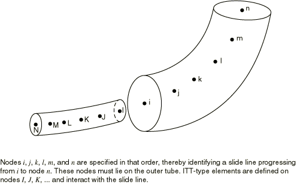

# 40.3.1 管对管接触单元


**产品：** Abaqus/Standard

##### **参考资料**

- ["管对管接触单元库，" 第40.3.2节](pt09ch40s03ael50.md)
- [*INTERFACE](../key/key-link.md#usb-kws-minterface)
- [*SLIDE LINE](../key/key-link.md#usb-kws-mslideline)

### 概述

管对管单元：
- 可以模拟两根管道或管之间的有限滑动相互作用，其中一根管位于另一根内部，或者两根平行放置的管或棒沿其外表面相互接触；
- 是滑移线接触单元，因为它们假定两根管或管的相对运动主要沿着由其中一根管的轴定义的线（假定管或管轴的相对旋转很小）；
- 可与管道、梁或桁架单元一起使用；以及
- 不考虑管或管道横截面的变形。

[第36章"定义接触相互作用"](pt09ch36.md)包含接触建模的一般讨论。

### 典型应用

管对管接触单元可用于模拟两类特定的管对管接触问题：内部（管内管）接触和外部接触，其中两根管大致平行并沿其外表面相互接触。

### 选择合适的单元

将ITT21单元与二维梁、管道或桁架单元一起使用。将ITT31单元与三维梁、管道或桁架单元一起使用。这些单元中的每一个都由单个节点定义。

### 将管对管接触单元与滑移线关联

您必须指明哪一组管对管接触单元将与特定的滑移线相互作用。有关定义滑移线的详细信息将在下面讨论。

| **输入文件用法：** | ``` [*SLIDE LINE](../key/key-link.md#usb-kws-mslideline), ELSET=*element_set_name* ``` |
| --- | --- |

### 定义单元的截面属性

必须将几何截面属性与一组管对管接触单元相关联。

| **输入文件用法：** | ``` [*INTERFACE](../key/key-link.md#usb-kws-minterface), ELSET=*element_set_name* ``` |
| --- | --- |

#### 定义管道内部的管道之间接触的径向间隙

定义管道之间的径向间隙。给出一个正值，以模拟当一根管道（带有管对管接触单元的管道）位于另一根管道内部时两根管道之间的接触。该值是外管内半径与内管外半径之差。

| **输入文件用法：** | ``` [*INTERFACE](../key/key-link.md#usb-kws-minterface) *radial_clearance* ``` |
| --- | --- |

#### 定义两根管道外表面之间接触的径向间隙

通过为径向间隙指定负值来模拟外部管对管接触。该值的幅度必须是两根管道或棒的外部半径之和。

### 接触输出变量的局部基

ITT元素的元素输出变量在与滑移线关联的局部坐标系中给出。第一个切向向量由形成滑移线的节点序列定义。接触方向是滑移线的法向，指向ITT单元的节点。对于ITT31单元，Abaqus/Standard会形成第二个切向向量，它既垂直于又垂直于。随着单元的移动，局部坐标系将随滑移线的轴旋转。

### 选择哪根管道（梁或桁架）具有滑移线

在内部管对管接触的情况下，滑移线可以放在内管或外管上。通常，滑移线应该与外管相关联（请参阅[图40.3.1-1](#eitt-slide-line)）；但是，如果内管比外管更硬，则滑移线应该附着在内管上。

**图40.3.1-1** 内部管对管接触示例。



如果接触发生在管道的外表面，则如果材料或管道半径不同，滑移线应该与较硬的管道相关联；如果相同，则与具有较粗网格的管道相关联。

### 定义滑移线

您可以指定组成滑移线的节点，或者可以按如下所述生成它们。如果您选择直接指定节点，则必须按定义连续滑移线的顺序指定它们。节点序列为滑移线定义切向向量。滑移线必须由线性段组成。

| **输入文件用法：** | ``` [*SLIDE LINE](../key/key-link.md#usb-kws-mslideline), ELSET=*element_set_name*, TYPE=LINEAR *first_node_number, second_node_number, etc.* ``` |
| --- | --- |

#### 生成滑移线节点

或者，您可以指示应生成滑移线节点，并仅指定第一个节点编号、最后一个节点编号以及节点编号之间的增量。

| **输入文件用法：** | ``` [*SLIDE LINE](../key/key-link.md#usb-kws-mslideline), GENERATE *first_node_number, last_node_number, increment_between_node_numbers* ``` |
| --- | --- |

#### 平滑滑移线

通过平滑滑移线段之间表面切向的不连续性，通常可以改善收敛性，从而沿滑移线提供平滑变化的切线。有关平滑滑移线的详细信息，请参阅["Abaqus/Standard中的接触公式，" 第38.1.1节](pt09ch38s01aus177.md)。

### 使用管对管接触单元定义非默认机械表面相互作用

默认情况下，Abaqus/Standard对管对管接触单元使用"硬"无摩擦接触。您可以分配可选的机械表面相互作用模型。以下机械表面相互作用模型可用：
- 摩擦。详细信息请参阅["摩擦行为，" 第37.1.5节](pt09ch37s01aus169.md)。
- 修正的"硬"接触、软化接触和粘性阻尼。详细信息请参阅["接触压力-闭合关系，" 第37.1.2节](pt09ch37s01aus166.md)和["接触阻尼，" 第37.1.3节](pt09ch37s01aus167.md)。

