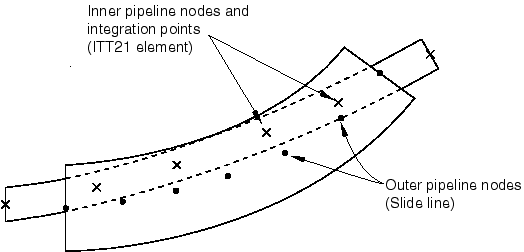
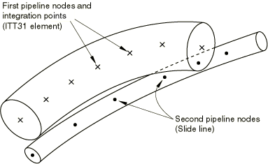

# 40.3.2 管-管接触单元库


**产品：** Abaqus/Standard  

##### **参考资料**

- ["管-管接触单元，" 第40.3.1节](pt09ch40s03alm65.md)
- [*INTERFACE](../key/key-link.md#usb-kws-minterface)
- [*SLIDE LINE](../key/key-link.md#usb-kws-mslideline)

### 概述

本节提供Abaqus/Standard中可用管-管接触单元的参考。

### 单元类型

| ITT21 | 与二维梁和管道单元一起使用的管-管单元 |
| --- | --- |

| ITT31 | 与三维梁和管道单元一起使用的管-管单元 |
| --- | --- |

##### 活跃自由度

ITT21：1、2

ITT31：1、2、3

##### 其他解变量

ITT21：两个与接触力相关的变量。

ITT31：三个与接触力相关的变量。

### 所需的节点坐标

ITT21：*X*、*Y*

ITT31：*X*、*Y*、*Z*

### 单元属性定义

| **输入文件用法：** | 使用以下选项识别第二（外部）管道，指定ITT接触单元在其上的第一（内部）管道可以与之相互作用： |
| --- | --- |
|  | ``` [*SLIDE LINE](../key/key-link.md#usb-kws-mslideline) ``` 使用以下选项在建模一个管道在另一个管道内滑动时给出管道之间的径向间隙： ``` [*INTERFACE](../key/key-link.md#usb-kws-minterface) ``` 当单元对两个管道的外表面之间的接触进行建模时，管道的外半径之和给定为负数。 |

### 基于单元的加载

无。

### 单元输出

#### 应力分量

| S11 | 两个管道之间的法向力分量。 |
| --- | --- |

| S12 | 两个管道之间的剪切力，平行于第二（外部）管道的轴线。 |
| --- | --- |

| S13 | 两个管道之间的剪切力，垂直于接触方向和第二（外部）管道的轴线（仅适用于ITT31）。 |
| --- | --- |

#### 应变分量

| E11 | 垂直于第二（外部）管道中心线切线的表面过闭合。 |
| --- | --- |

| E12 | 两个管道之间的累积相对切向运动，平行于第二（外部）管道的轴线。 |
| --- | --- |

| E13 | 两个管道之间的累积相对切向运动，垂直于接触方向和第二（外部）管道的轴线（仅适用于ITT31）。 |
| --- | --- |

### 节点排序和积分点编号

#### 2D内部管接触



#### 2D外部管接触


#### 3D内部管接触


#### 3D外部管接触



