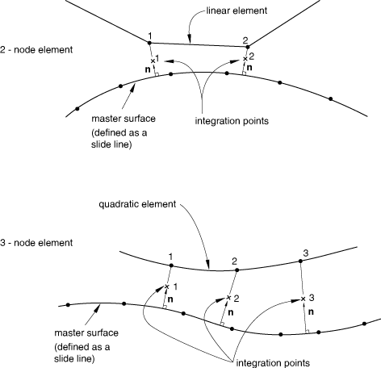

# 40.4.2 轴对称滑移线单元库


**产品：** Abaqus/Standard  

##### **参考资料**

- ["滑移线接触单元，" 第40.4.1节](pt09ch40s04alm66.md)
- [*INTERFACE](../key/key-link.md#usb-kws-minterface)
- [*SLIDE LINE](../key/key-link.md#usb-kws-mslideline)

### 概述

本节提供Abaqus/Standard中可用轴对称滑移线单元的参考。

### 单元类型

| ISL21A | 与一阶轴对称单元一起使用的2节点单元 |
| --- | --- |

| ISL22A | 与二阶轴对称单元一起使用的3节点单元 |
| --- | --- |

##### 活跃自由度

节点处的1、2

##### 其他解变量

每个节点处两个与接触应力相关的变量。

### 所需的节点坐标

*r*、*z*

### 单元属性定义

| **输入文件用法：** | 使用以下选项识别滑移线（主表面），滑移线单元与之相互作用： |
| --- | --- |
|  | ``` [*SLIDE LINE](../key/key-link.md#usb-kws-mslideline) ``` 使用以下选项定义滑移线单元的截面属性： ``` [*INTERFACE](../key/key-link.md#usb-kws-minterface) ``` |

### 基于单元的加载

无。

### 单元输出

#### 应力分量

| S11 | 身体上的节点与滑移线之间的压力。 |
| --- | --- |

| S12 | 身体上的节点与滑移线之间的剪切应力。 |
| --- | --- |

#### 应变分量

| E11 | 身体上的节点与滑移线之间的分离。 |
| --- | --- |

| E12 | 身体上的节点与滑移线之间的累积相对切向位移。 |
| --- | --- |

### 节点排序和积分点编号



