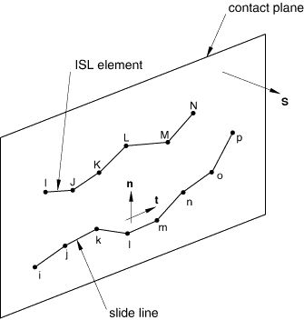
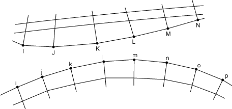
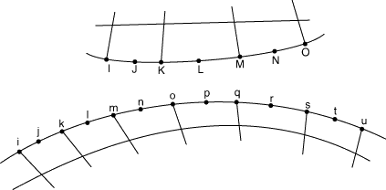

# 40.4.1 滑移线接触单元


**产品：** Abaqus/Standard

##### **参考资料**

- ["轴对称滑移线单元库，" 第40.4.2节](pt09ch40s04ael51.md)
- [*INTERFACE](../key/key-link.md#usb-kws-minterface)
- [*SLIDE LINE](../key/key-link.md#usb-kws-mslideline)

### 概述

滑移线单元：
- 可以模拟当滑动沿位于特定平面中的线（"滑移线"）发生时，两个变形体之间的有限滑动相互作用；
- 假定与滑移线正交的切向运动为零或很小（Abaqus/Standard将此类运动视为无限小）；
- 可与轴对称应力/位移单元一起使用；
- 建议用于特定应用，例如当接触面是子结构的表面时，或者当CAXA或SAXA单元参与接触时；
- 可用于一阶和二阶单元；以及
- 使用与表面接触中相同的"主-从"概念来强制执行接触约束。

有关接触建模的一般讨论，请参阅[第36章，"定义接触相互作用"](pt09ch36.md)。

### 使用滑移线模拟变形体之间的接触

确定接触区域的位置以及接触结构之间的表面牵引力是Abaqus模拟的常见目标（请参阅[图40.4.1-1](#eslideline-def)）。当两个结构都是变形的且结构的有限滑动沿明确定义的线发生时，滑移线和滑移线接触单元可以提供这些信息。

**图40.4.1-1** 变形结构之间的相互作用。


### 接触应力和结构相对运动的局部坐标系

Abaqus/Standard在与滑移线表面关联的局部坐标系中报告结构之间的接触应力和结构的相对运动。局部坐标系由滑移线的法向定义，以及两个正交的局部切向方向（请参阅[图40.4.1-2](#eslideline-local-sys)）。

**图40.4.1-2** 界面接触法向和剪切牵引力的局部系统。


#### 定义局部坐标系

形成滑移线的节点序列定义切向。滑移线法向和形成的平面称为接触平面。Abaqus/Standard将滑移线法向定义为（请参阅[图40.4.1-3](#eslideline-local-basis)），其中是正交于接触平面的向量。

如图所示，滑移线是使用节点*i*、*j*、*k*、...、*p*创建的，按该顺序指定，从而识别滑移线切向。节点*I*、*J*、*K*、...、*N*是与此滑移线相关联的滑移线单元的节点。滑移线法向通过指定定义，即接触平面的法向来定义。

**图40.4.1-3** 定义滑移线的局部基。



滑移线的切向与局部坐标系的第一局部切向方向重合。第二局部切向方向与的方向相反。

### 滑移线和滑移线单元的主-从概念

在创建包含滑移线单元的模型时，记住Abaqus/Standard使用严格的"主-从"概念来强制执行接触约束是有用的。滑移线接触单元形成"从"表面。指定用于定义滑移线的节点定义了"主"表面。滑移线单元的节点被约束不能穿透主表面。

选择主表面和从表面的考虑因素与是否使用表面或单元来定义接触无关。主表面应选择为较硬体的表面（如果材料不同），或选择为具有较粗网格的表面。如果两个表面上的材料和网格密度相同，则选择是任意的。

### 定义滑移线（主表面）

您可以指定组成滑移线的节点，或者可以按如下所述生成它们。如果您选择直接指定节点，则必须按定义连续滑移线的顺序指定它们。节点序列为滑移线定义切向向量。滑移线可以由线性或抛物线段组成，具体取决于模型是由一阶还是二阶单元组成。在任一情况下，通过平滑滑移线可以改善收敛性。

#### 定义线性滑移线

当结构的表面用一阶单元网格划分时，定义由线性单元段组成的滑移线。如图所示，节点*i*、*j*、*k*、...、*p*按该顺序指定，从而识别从*i*穿过*p*的滑移线。节点*I*、*J*、*K*、...、*N*是与此滑移线相关联的ISL型单元的节点。

| **输入文件用法：** | ``` [*SLIDE LINE](../key/key-link.md#usb-kws-mslideline), ELSET=*element_set_name*, TYPE=LINEAR *first_node_number, second_node_number, etc.* ``` |
| --- | --- |

**图40.4.1-4** 一阶（线性）滑移线示例。



#### 定义抛物线滑移线

当结构的表面用二阶单元网格划分时，定义由二阶单元段组成的滑移线。在这种情况下，滑移线应由奇数个节点组成。如图所示，节点*i*、*j*、*k*、...、*u*按该顺序指定，从而识别从*i*穿过*u*的滑移线。节点*I*、*J*、*K*、...、*O*是与此滑移线相关联的ISL型单元的节点。

**图40.4.1-5** 二阶（抛物线）滑移线示例。



| **输入文件用法：** | ``` [*SLIDE LINE](../key/key-link.md#usb-kws-mslideline), ELSET=*element_set_name*, TYPE=PARABOLIC *first_node_number, second_node_number, etc.* ``` |
| --- | --- |

#### 生成滑移线节点

或者，您可以指示应生成滑移线节点，并仅指定第一个节点编号、最后一个节点编号以及节点编号之间的增量。

| **输入文件用法：** | ``` [*SLIDE LINE](../key/key-link.md#usb-kws-mslideline), ELSET=*element_set_name*, GENERATE *first_node_number, last_node_number, increment_between_node_numbers* ``` |
| --- | --- |

#### 平滑滑移线

通过平滑滑移线段之间表面切向的不连续性，通常可以改善收敛性，从而沿滑移线提供平滑变化的切线。有关平滑滑移线的详细信息，请参阅["Abaqus/Standard中的接触公式，" 第38.1.1节](pt09ch38s01aus177.md)。

### 定义滑移线单元（从表面）

许多有限滑动接触模拟可以使用[第36章"定义接触相互作用"](pt09ch36.md)中所述的基于表面的接触方法来定义模型。轴对称应力/位移和耦合温度-位移滑移线单元仅推荐用于特定应用，例如当接触面是子结构的表面时，或者当CAXA或SAXA单元参与接触时（请参阅["如果存在非对称-轴对称单元时的接触建模，" 第36.3.10节](pt09ch36s03aus154.md)）。

滑移线接触单元定义从表面。从表面上每个节点关联的接触面积是使用滑移线接触单元的当前长度和分配给单元的恒定"宽度"计算的，这取决于底层有限单元。

### 将滑移线单元与滑移线关联

您必须将滑移线与一组滑移线接触单元相关联。有关定义滑移线的详细信息将在下面讨论。

| **输入文件用法：** | ``` [*SLIDE LINE](../key/key-link.md#usb-kws-mslideline), ELSET=*element_set_name* ``` |
| --- | --- |

### 定义滑移线单元的截面属性

必须将截面属性与一组滑移线单元相关联。

轴对称滑移线单元没有截面数据。

| **输入文件用法：** | ``` [*INTERFACE](../key/key-link.md#usb-kws-minterface), ELSET=*element_set_name* ``` |
| --- | --- |

### 使用滑移线单元定义非默认机械表面相互作用

默认情况下，Abaqus/Standard对滑移线单元使用"硬"无摩擦接触。您可以分配可选的机械表面相互作用模型。以下机械表面相互作用模型可用：
- 摩擦。详细信息请参阅["摩擦行为，" 第37.1.5节](pt09ch37s01aus169.md)。
- 修正的"硬"接触、软化接触和粘性阻尼。详细信息请参阅["接触压力-闭合关系，" 第37.1.2节](pt09ch37s01aus166.md)和["接触阻尼，" 第37.1.3节](pt09ch37s01aus167.md)。

### 获取可通过轴对称滑移线传输的"最大扭矩"

当使用轴对称单元（CAX和CGAX单元类型的滑移线）建模接触时，Abaqus/Standard可以计算可通过轴对称滑移线传输的最大扭矩。这种能力在建模螺纹连接器时通常很感兴趣。最大扭矩*T*定义为


其中*p*是穿过界面的压力，*r*是界面上一点的半径，*s*是*r*–*z*平面中沿界面的当前距离。这种"扭矩"定义有效地假定摩擦系数为单位值。

您可以请求将此扭矩输出写入数据（`.dat`）文件。为模型中的每个滑移线提供数据。您可以指定输出频率以限制Abaqus/Standard将此输出写入数据文件的频率。默认输出频率为1。

对于使用轴对称单元的基于表面的接触，输出变量CTRQ提供了与此扭矩输出请求类似的功能（请参阅["在Abaqus/Standard中定义接触对，" 第36.3.1节](pt09ch36s03aus145.md)）。

| **输入文件用法：** | ``` [*TORQUE PRINT](../key/key-link.md#usb-kws-htorqueprint), FREQUENCY=*n* ``` |
| --- | --- |


