# 2.1.1 Node definition


**Products: **Abaqus/Standard  Abaqus/Explicit  

##### **References**

- [*NCOPY](../key/key-link.md#usb-kws-mncopy)
- [*NFILL](../key/key-link.md#usb-kws-mnfill)
- [*NGEN](../key/key-link.md#usb-kws-mngen)
- [*NMAP](../key/key-link.md#usb-kws-mnmap)
- [*NODE](../key/key-link.md#usb-kws-mnode)
- [*NSET](../key/key-link.md#usb-kws-mnset)
- [*SYSTEM](../key/key-link.md#usb-kws-msystem)

### Overview

This section describes the methods for defining nodes in an Abaqus input file. In a preprocessor such as Abaqus/CAE, you define the model geometry rather than the nodes and elements; when you mesh the geometry, the preprocessor automatically creates the nodes and elements needed for analysis. Although the concepts discussed in this section apply in general to the node definitions in the input file that is created by Abaqus/CAE, the methods and techniques described here apply only if you are creating the input file manually.

Node definition consists of:
- assigning a node number to the node;
- optionally specifying a local coordinate system in which to define nodes;
- defining individual nodes by specifying their coordinates;
- grouping nodes into node sets;
- creating nodes from existing nodes by generating them incrementally, by copying existing nodes, or by filling in nodes between the bounds of a region; and
- mapping a set of nodes from one coordinate system to another.

If any node is specified more than once, the last specification given is used.

Abaqus will eliminate all unnecessary nodes before proceeding with the analysis. This feature is useful because it allows points to be defined as nodes for mesh generation purposes only.

### Assigning a node number to the node

Each individual node must have a numeric label called the node number, which is assigned when the node is defined. The node number must be a positive integer, and the maximum node number allowed is 999999999 (for information on integer input, see ["Input syntax rules," Section 1.2.1](pt01ch01s02aus01.md)). The nodes do not need to be numbered continuously.

An Abaqus model can be defined in terms of an assembly of part instances (see ["Defining an assembly," Section 2.10.1](pt01ch02s10aus28.md)). In such a model all nodes must belong to either a part, part instance, or, in the case of reference nodes, to the assembly. Node numbers must be unique within a part, part instance, or the assembly; but they can be repeated in different parts or part instances.

### Specifying a local coordinate system in which to define nodes

Sometimes it is convenient to define nodal coordinates in a local coordinate system and then transform these coordinates to the global coordinate system. You can define a nodal coordinate system; Abaqus will translate and rotate the local () coordinate values into the global coordinate system. The transformation is done immediately after input and will be applied to all nodal coordinates entered or generated after the nodal coordinate system is defined.

The transformation affects only the input of nodal coordinates in node definitions. Nodal coordinate system definitions cannot be used
- for applying loads and boundary conditions---see ["Transformed coordinate systems," Section 2.1.5](pt01ch02s01aus09.md), instead; or
- for output of components of stress, strain, and element section forces---see ["Orientations," Section 2.2.5](pt01ch02s02aus15.md), instead.

In addition to defining nodal coordinate systems, you can define individual nodes or node sets in local rectangular, cylindrical, or spherical systems (see ["Specifying a local coordinate system for the nodal coordinates](pt01ch02s01aus05.md#usb-int-inode-define-csys)”). If a nodal coordinate system is in effect and you specify a local coordinate system for a particular node or node set definition, the input coordinates are first transformed according to the local system specified in the node definition and then according to the nodal coordinate system.

#### Defining the nodal coordinate system

You set up the coordinate system specification by specifying the global coordinates of three points in the local system: the origin of the local system (point *a* in [Figure 2.1.1--1](pt01ch02s01aus05.md#ksystem)), a point on the local -axis (point *b* in [Figure 2.1.1--1](pt01ch02s01aus05.md#ksystem)), and a point in the 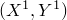 plane of the local system on (or near) the local -axis (point *c* in [Figure 2.1.1--1](pt01ch02s01aus05.md#ksystem)). 

**Figure 2.1.1–1** Nodal coordinate system.


If only one point (the origin) is given, Abaqus assumes that you need a translation only. If only two points are given, the direction of the -axis will be the same as that of the *Z*-axis; that is, the -axis will be projected onto the  plane.

To change the nodal coordinate system that is in effect, define another nodal coordinate system; to revert to input in the global coordinate system, use a nodal coordinate system definition without any associated data.

| **Input File Usage: ** | Use the following option to define a nodal coordinate system: |
| --- | --- |
|  | ``` [*SYSTEM](../key/key-link.md#usb-kws-msystem) , , , , ,  , ,  ``` For example, in the following input, nodes 1 through 3 are defined in the first nodal coordinate system, nodes 4 and 5 are defined in the second nodal coordinate system, and nodes 6 and 7 are defined in the global coordinate system: ``` [*SYSTEM](../key/key-link.md#usb-kws-msystem) 0, 0, 0, 5, 5, 5 [*NODE](../key/key-link.md#usb-kws-mnode) 1, 0, 0, 1 2, 0, 0, 2 3, 0, 1, 2 [*SYSTEM](../key/key-link.md#usb-kws-msystem) 2, 3, 4 [*NODE](../key/key-link.md#usb-kws-mnode) 4, 0, 0, 1 5, 1, 4, 0 [*SYSTEM](../key/key-link.md#usb-kws-msystem) [*NODE](../key/key-link.md#usb-kws-mnode) 6, 1, 0, 1 7, 0, 4, 2 ``` |

#### Defining a nodal coordinate system within part definitions

When you define a nodal coordinate system within a part (or part instance) definition, it is in effect only within that part (or part instance) definition. Nodes defined in other parts are not affected.

You specify the local () coordinate values relative to the part coordinate system, which subsequently may be translated and/or rotated according to the positioning data given for the instance (see ["Defining an assembly," Section 2.10.1](pt01ch02s10aus28.md)).

### Defining individual nodes by specifying their coordinates

You can define individual nodes by specifying the node number and the coordinates that define the node. Abaqus uses a right-handed, rectangular Cartesian coordinate system for all nodes except for axisymmetric models, when the coordinates of the nodes must be given as the radial and axial positions. For more information about direction definitions, see ["Conventions," Section 1.2.2](pt01ch01s02aus02.md).

In a model defined in terms of an assembly of part instances, give nodal coordinates in the local coordinate system of the part (or part instance). See ["Defining an assembly," Section 2.10.1](pt01ch02s10aus28.md).

| **Input File Usage: ** | ``` [*NODE](../key/key-link.md#usb-kws-mnode) ``` |
| --- | --- |

#### Reading node definitions from a file

Node definitions can be read into Abaqus from an alternate file. The syntax of such file names is described in ["Input syntax rules," Section 1.2.1](pt01ch01s02aus01.md).

| **Input File Usage: ** | ``` [*NODE](../key/key-link.md#usb-kws-mnode), INPUT=*file_name* ``` |
| --- | --- |

#### Specifying a local coordinate system for the nodal coordinates

You can specify that a local rectangular Cartesian, cylindrical, or spherical coordinate system be used for a particular node definition. These coordinate systems are shown in [Figure 2.1.1--2](pt01ch02s01aus05.md#kngen).

**Figure 2.1.1–2** Coordinate systems.


This coordinate system specification is entirely local to the node definition. As the nodal data are read, the coordinates are transformed to rectangular Cartesian coordinates immediately. If a nodal coordinate system is also in effect (see ["Specifying a local coordinate system in which to define nodes](pt01ch02s01aus05.md#usb-int-inode-system-option)”), these are local rectangular Cartesian coordinates as defined by the nodal coordinate system, which are subsequently transformed to global Cartesian coordinates.

| **Input File Usage: ** | Use the following option to specify the nodal coordinates in a rectangular Cartesian system (this is the default): |
| --- | --- |
|  | ``` [*NODE](../key/key-link.md#usb-kws-mnode), SYSTEM=R ``` Use the following option to specify the nodal coordinates in a cylindrical system: ``` [*NODE](../key/key-link.md#usb-kws-mnode), SYSTEM=C ``` Use the following option to specify the nodal coordinates in a spherical system: ``` [*NODE](../key/key-link.md#usb-kws-mnode), SYSTEM=S ``` For example, the following lines define node number 1 with coordinates (10cos20, 10sin20, 5.) in a local cylindrical system (*R*, , *Z*): ``` [*NODE](../key/key-link.md#usb-kws-mnode), NSET=DISC, SYSTEM=C 1, 10., 20., 5. ``` If the following lines appeared in the input file before the above node definition, the coordinates of node 1 would be transformed first to rectangular Cartesian coordinates in the nodal coordinate system defined by the [*SYSTEM](../key/key-link.md#usb-kws-msystem) option and then to coordinates in the global system: ``` [*SYSTEM](../key/key-link.md#usb-kws-msystem) 2, 0, 2 ``` |

### Grouping nodes into node sets

Node sets are used as convenient cross-references when defining loads, constraints, properties, etc. Node sets are the fundamental references of the model and should be used to assist the input definition. The members of a node set can be individual nodes or other node sets. An individual node can belong to several node sets.

Nodes can be grouped into node sets when they are created or after they have already been defined. In either case each node set is assigned a name. Node set names can be up to 80 characters long.

The same name can be used for a node set and for an element set.

By default, the nodes within a node set will be arranged in ascending order, and duplicate nodes will be removed. Such a set is called a sorted node set. You may choose to create an unsorted node set as described later, which is often useful for features that match two or more node sets. For example, if you define multi-point constraints (["General multi-point constraints," Section 35.2.2](pt08ch35s02aus130.md)) between two node sets, a constraint will be created between the first node in Set 1 and the first node in Set 2, then between the second node in Set 1 and the second node in Set 2, etc. It is important to ensure that the nodes are combined in the desired way. Therefore, it is sometimes better to specify that a node set be stored in unsorted order.

Once nodes are assigned to a node set, additional nodes can be added to the same node set; however, nodes cannot be removed from a node set.

#### Creating an unsorted node set

You can choose to assign nodes to a new node set (or to add nodes to an existing node set) in the order in which they are given. The node numbers will not be rearranged, and duplicates will not be removed.

This unsorted node set will affect node copies, node fills, linear constraint equations, multi-point constraints, and substructure nodes associated with retained degrees of freedom. An unsorted node set can be created only by directly defining an unsorted node set as described here or by copying an unsorted node set. Any additions or modifications to a node set using other means will result in a sorted node set.

| **Input File Usage: ** | ``` [*NSET](../key/key-link.md#usb-kws-mnset), NSET=*name*, UNSORTED ``` |
| --- | --- |

#### Assigning nodes to a node set as they are created

There are several ways that nodes can be assigned to node sets as they are created.

| **Input File Usage: ** | Use any of the following options: |
| --- | --- |
|  | ``` [*NODE](../key/key-link.md#usb-kws-mnode), NSET=*name* [*NCOPY](../key/key-link.md#usb-kws-mncopy), NEW SET=*name* [*NFILL](../key/key-link.md#usb-kws-mnfill), NSET=*name* [*NGEN](../key/key-link.md#usb-kws-mngen), NSET=*name* [*NMAP](../key/key-link.md#usb-kws-mnmap), NSET=*name* ``` |

#### Assigning previously defined nodes to a node set

You can assign nodes that you have defined previously (by specifying their coordinates, by filling in nodes between two bounds, or by generating them incrementally) to a node set by listing the nodes forming the set directly, by generating the node set, or by generating a node set from an element set.

##### Listing the nodes that define the set directly

You can list the nodes that form a node set directly. Previously defined node sets, as well as individual nodes, can be assigned to node sets.

| **Input File Usage: ** | ``` [*NSET](../key/key-link.md#usb-kws-mnset), NSET=*name* ``` |
| --- | --- |
|  | For example, the following lines add nodes 1, 3, 10, 11, and all the nodes in set `A11` to set `A12`: ``` [*NSET](../key/key-link.md#usb-kws-mnset), NSET=A12 1, 3 10, 11, A11 ``` Node set `A11` can be assigned to node set `A12` only if the definition of `A11` occurs before the definition of `A12`. All the nodes in node set `A12` will be sorted into ascending numerical order. If the UNSORTED parameter were included on the [*NSET](../key/key-link.md#usb-kws-mnset) option, node set `A12` would contain the nodes in the order in which they are specified on the data lines. |

##### Generating the node set

To generate a node set, you must specify a first node, ; a last node, ; and the increment in node numbers between these nodes, *i*. All nodes going from  to  in increments of *i* will be added to the set. Therefore, *i* must be an integer such that 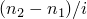 is a whole number (not a fraction). The default is .

| **Input File Usage: ** | ``` [*NSET](../key/key-link.md#usb-kws-mnset), NSET=*name*, GENERATE ``` |
| --- | --- |
|  | For example, the following lines add all nodes from 100 to 120 in increments of 10 to set `A13`: ``` [*NSET](../key/key-link.md#usb-kws-mnset), NSET=A13, GENERATE 100, 120, 10 ``` |

##### Generating a node set from an element set

You can specify the name of a previously defined element set (["Element definition," Section 2.2.1](pt01ch02s02aus11.md)), in which case the nodes that define the elements contained in this element set will be assigned to the specified node set. This method can be used only to define sorted node sets.

| **Input File Usage: ** | ``` [*NSET](../key/key-link.md#usb-kws-mnset), NSET=*name*, ELSET=*name* ``` |
| --- | --- |
|  | For example, the following lines add all nodes that define elements 50 and 100 (nodes 1, 2, 3, and 4) to node set `A14`: ``` [*ELEMENT](../key/key-link.md#usb-kws-melement), TYPE=B21 50, 1, 2 100, 3, 4 [*ELSET](../key/key-link.md#usb-kws-melset), ELSET=B1 50, 100 [*NSET](../key/key-link.md#usb-kws-mnset), NSET=A14, ELSET=B1 ``` Element set `B1` can be assigned to node set `A14` since the definition of `B1` occurs before the definition of `A14`. |

##### Limitation on updating node sets that are used to define other node sets

If a node set is constructed from previously defined node sets, subsequent updates to these sets are not taken into account.

| **Input File Usage: ** | ``` [*NSET](../key/key-link.md#usb-kws-mnset), NSET=*name* ``` |
| --- | --- |
|  | For example, the following lines add nodes 1 and 2, but not 3, to the set `SET-AB` while adding nodes 1 and 3 to set `SET-A`: ``` [*NSET](../key/key-link.md#usb-kws-mnset), NSET=SET-A 1, [*NSET](../key/key-link.md#usb-kws-mnset), NSET=SET-B 2, [*NSET](../key/key-link.md#usb-kws-mnset), NSET=SET-AB SET-A, SET-B [*NSET](../key/key-link.md#usb-kws-mnset), NSET=SET-A 3, ``` |

#### Defining part and assembly sets

In a model defined in terms of an assembly of part instances, all node sets must be defined within a part, part instance, or the assembly definition. If a node set is defined within a part (or part instance) definition, you can refer to the node numbers directly. To define an assembly-level node set, you must identify the nodes to be added to the set by prefixing each node number with the part instance name and a “.” (as explained in ["Defining an assembly," Section 2.10.1](pt01ch02s10aus28.md)). An assembly-level node set can have the same name as a part-level node set.

##### Example

The following input defines a node set, `set1`, that belongs to part `PartA` and will be inherited by every instance of `PartA`:

```
*PART, NAME=PartA
   ...
   *NSET, NSET=set1
    1,3,26,500
*END PART
```

A node set with the same name is defined at the assembly level as follows:
```
*ASSEMBLY, NAME=Assembly-1
   *INSTANCE, NAME=PartA-1, PART=PartA
    ...
   *END INSTANCE
   *INSTANCE, NAME=PartA-2, PART=PartA
    ...
   *END INSTANCE
   *NSET, NSET=set1
    PartA-1.1, PartA-1.3, PartA-1.26, PartA-1.500
    PartA-2.1, PartA-2.3, PartA-2.26, PartA-2.500
*END ASSEMBLY
```

Assembly-level node set `set1` contains all the nodes from node sets `set1` belonging to part instances `PartA-1` and `PartA-2`. Therefore, the nodes are assigned to two separate node sets: one at the part instance level and one at the assembly level. An assembly-level node set called `set1` could be created with entirely different nodes than those that belong to the part set; part- and assembly-level node sets are independent. However, since in this example the same nodes are assigned to both the part- and assembly-level node sets `set1`, the assembly-level set could alternatively be defined by
```
*ASSEMBLY, NAME=Assembly-1
   *INSTANCE, NAME=PartA-1, PART=PartA
    ...
   *END INSTANCE
   *INSTANCE, NAME=PartA-2, PART=PartA
    ...
   *END INSTANCE
   *NSET, NSET=set1
    PartA-1.set1, PartA-2.set1
*END ASSEMBLY
```

This node set definition is equivalent to the previous example, where the nodes are listed individually.

##### Alternate method for defining assembly-level node sets

Sometimes it is not convenient to define an assembly-level node set by referring to part-level node sets. In such cases a set definition containing many nodes can get quite lengthy. Therefore, an alternate method is provided.

| **Input File Usage: ** | ``` [*NSET](../key/key-link.md#usb-kws-mnset), NSET=*NsetName*, INSTANCE=*InstanceName* ``` |
| --- | --- |
|  | The following example shows two equivalent ways to define an assembly-level node set; once by prefixing each node number with a part instance name (as shown above) and once using the more compact INSTANCE notation: ``` *ASSEMBLY, NAME=Assembly-1 *INSTANCE, NAME=PartA-1, PART=PartA ... *END INSTANCE *INSTANCE, NAME=PartA-2, PART=PartA ... *END INSTANCE *NSET, NSET=set2 PartA-1.11, PartA-1.12, PartA-1.13, PartA-1.14, PartA-2.21, PartA-2.22, PartA-2.23, PartA-2.24 *NSET, NSET=set3, INSTANCE=PartA-1 11, 12, 13, 14 *NSET, NSET=set3, INSTANCE=PartA-2 21, 22, 23, 24 *END ASSEMBLY ``` When the [*NSET](../key/key-link.md#usb-kws-mnset) option is used more than once with the same name, as it is with `set3`, the nodes in the second use of [*NSET](../key/key-link.md#usb-kws-mnset) are appended to the set created by the first use of [*NSET](../key/key-link.md#usb-kws-mnset). |

#### Internal node sets created by Abaqus/CAE

In Abaqus/CAE many modeling operations are performed by picking geometry with the mouse. For example, a concentrated load can be applied by picking a point on a geometric part instance. Since the [*CLOAD](../key/key-link.md#usb-kws-hcload) option refers to a node set, this “picked” geometry must be translated into a node set in the input file. Such sets are assigned a name by Abaqus/CAE and marked as internal. You can view these internal sets using display groups in the Visualization module of Abaqus/CAE (see [Chapter 78, "Using display groups to display subsets of your model," of the Abaqus/CAE User's Guide](../usi/usi-link.md#uss-dgp)).

| **Input File Usage: ** | ``` [*NSET](../key/key-link.md#usb-kws-mnset), NSET=*NsetName*, INTERNAL ``` |
| --- | --- |

### Transferring of node sets

If the results of an Abaqus/Explicit analysis are imported into an Abaqus/Standard analysis (or vice versa) or results from an Abaqus/Standard analysis are imported into another Abaqus/Standard analysis (see ["Transferring results between Abaqus analyses: overview," Section 9.2.1](pt04ch09s02aus54.md)), all node set definitions in the original analysis are imported by default. Alternatively, you can import only selected node set definitions; see ["Importing element set and node set definitions" in "Transferring results between Abaqus analyses: overview," Section 9.2.1](pt04ch09s02aus54.md#usb-anl-atransferoverview-elsetnodeset), for details.

If a three-dimensional model is generated from a symmetric model (see ["Symmetric model generation," Section 10.4.1](pt04ch10s04aus63.md)), all node sets in the original model will be used (and expanded) in the generated model.

### Creating nodes from existing nodes by generating them incrementally

You can generate nodes incrementally from existing nodes. All of the nodes along a straight or curved line can be generated by giving the coordinates of the two end nodes and defining the type of curve.

The two end nodes must already be defined, usually by specifying their coordinates, but it is also possible to have them defined by an earlier generation.

#### Defining a straight line between the two end nodes

To define a straight line between the two end nodes, specify the number of the first end node, ; the number of the last end node, ; and the increment in node numbers between each node along the line, *i*. Therefore, *i* must be an integer such that  is a whole number (not a fraction). The default is .

| **Input File Usage: ** | ``` [*NGEN](../key/key-link.md#usb-kws-mngen) ``` |
| --- | --- |
|  | For example, in the following input node number 1 with coordinates (0., 0., 0.) and node number 6 with coordinates (10., 0., 0.) are defined and nodes 2, 3, 4, and 5 with coordinates (2., 0., 0.), (4., 0., 0.), (6., 0., 0.), and (8., 0., 0.), respectively, are generated automatically: ``` [*NODE](../key/key-link.md#usb-kws-mnode) 1, 0., 0., 0. 6, 10., 0., 0. [*NGEN](../key/key-link.md#usb-kws-mngen) 1, 6, 1 ``` |

#### Defining a circular arc between the two end nodes

To define a circular arc between the two end nodes, specify the number of the first end node, ; the number of the last end node, ; and the increment in node numbers between each node along the arc, *i*. Therefore, *i* must be an integer such that  is a whole number (not a fraction). The default is .

In addition, you must specify the coordinates of one extra point, the center of the circle, either by giving the node number of a node that has already been defined or by giving the nodal coordinates directly. If both are supplied, the node number will take precedence over the coordinates.

If the coordinates are defined directly, they can be specified in a local coordinate system as described later.

The coordinates of the end nodes will be adjusted radially if the circle cannot be passed through both points. An arc of a circle of 180 through 360 will require more extensive definition. For this case you must define the plane of the circular disc by giving the normal to the disc; the nodes will then be numbered according to the right-hand rule about this normal.

| **Input File Usage: ** | ``` [*NGEN](../key/key-link.md#usb-kws-mngen), LINE=C ``` |
| --- | --- |

#### Defining a parabola between the two end nodes

To define a parabola between the two end nodes, specify the number of the first end node, ; the number of the last end node, ; and the increment in node numbers between each node along the parabola, *i*. Therefore, *i* must be an integer such that  is a whole number (not a fraction). The default is .

In addition, you must specify the coordinates of one extra point, the midpoint on the arc between the two end points, either by giving the node number of a node that has already been defined or by giving the nodal coordinates directly. If both are supplied, the node number will take precedence over the coordinates.

If the coordinates are defined directly, they can be specified in a local coordinate system as described later.

| **Input File Usage: ** | ``` [*NGEN](../key/key-link.md#usb-kws-mngen), LINE=P ``` |
| --- | --- |

#### Defining the extra point and the normal direction in a local coordinate system

You can specify the coordinates of the extra point that is required for a circle or a parabola in a local rectangular Cartesian system, a cylindrical system, or a spherical system. These coordinate systems are shown in [Figure 2.1.1--2](pt01ch02s01aus05.md#kngen).

If a nodal coordinate system is in effect (see ["Specifying a local coordinate system in which to define nodes](pt01ch02s01aus05.md#usb-int-inode-system-option)”), the coordinates and normal direction specified in the node definition are assumed to be in the nodal coordinate system. If a nodal coordinate system is in effect and you specify the extra point for a circle or parabola in a local coordinate system, the input is first transformed according to the local system specified in the node definition and subsequently according to the nodal coordinate system.

| **Input File Usage: ** | Use the following option to specify the extra point in a rectangular Cartesian system (this is the default): |
| --- | --- |
|  | ``` [*NGEN](../key/key-link.md#usb-kws-mngen), SYSTEM=RC ``` Use the following option to specify the extra point in a cylindrical system: ``` [*NGEN](../key/key-link.md#usb-kws-mngen), SYSTEM=C ``` Use the following option to specify the extra point in a spherical system: ``` [*NGEN](../key/key-link.md#usb-kws-mngen), SYSTEM=S ``` |

### Creating nodes by copying existing nodes

You can create new nodes by copying existing nodes. The coordinates of the new nodes can be translated and rotated, reflected from the nodes being copied, or projected from the nodes being copied by using a polar projection with respect to a pole node.

You must identify the existing node set to copy and specify an integer constant, *n*, that will be added to the node numbers of existing nodes to define node numbers for the nodes being created.

You can assign the newly created nodes to a node set. If you do not specify a node set name for the newly created nodes, they are not assigned to a node set.

| **Input File Usage: ** | ``` [*NCOPY](../key/key-link.md#usb-kws-mncopy), OLD SET=*name*, CHANGE NUMBER=*n*, NEW SET=*new_name* ``` |
| --- | --- |

#### Translating and rotating the coordinates of the old nodes

You can create new nodes by translating and/or rotating the nodes in the old node set (see [Figure 2.1.1--3](pt01ch02s01aus05.md#kncopy-shift)). You specify the value of the translation in the *X*-, *Y*-, and *Z*-directions.

**Figure 2.1.1–3** Translation and rotation of existing nodes.


In addition, you specify the coordinates of the first point defining the rotation axis (point *a* in [Figure 2.1.1--3](pt01ch02s01aus05.md#kncopy-shift)), the coordinates of the second point defining the rotation axis (point *b* in [Figure 2.1.1--3](pt01ch02s01aus05.md#kncopy-shift)), and the angle of rotation (in degrees) about the *a*–*b* axis. The rotation can be applied multiple times as described later.

If you specify both translation and rotation, the translation is applied once before the rotation.

| **Input File Usage: ** | ``` [*NCOPY](../key/key-link.md#usb-kws-mncopy), OLD SET=*name*, CHANGE NUMBER=*n*, SHIFT ``` |
| --- | --- |

##### Applying the rotation multiple times

You can specify the number of times the rotation should be applied, *m*. For example, if nodes are to be created at angles of 30, 60, and 90, set *m*=3. The identifiers of the nodes created are incremented sequentially by the value of *n*, as described above.

| **Input File Usage: ** | ``` [*NCOPY](../key/key-link.md#usb-kws-mncopy), OLD SET=*name*, CHANGE NUMBER=*n*, SHIFT, MULTIPLE=*m* ``` |
| --- | --- |

#### Reflecting the coordinates of the old nodes

You can create new nodes by reflecting the coordinates of the old nodes through a line, a plane, or a point.

##### Reflecting the coordinates through a line

To reflect the old nodal coordinates through a line, you specify the coordinates of points *a* and *b* (see [Figure 2.1.1--4](pt01ch02s01aus05.md#kncopy-reflect-line)).

| **Input File Usage: ** | ``` [*NCOPY](../key/key-link.md#usb-kws-mncopy), OLD SET=*name*, CHANGE NUMBER=*n*, REFLECT=LINE ``` |
| --- | --- |

**Figure 2.1.1–4** Reflection of coordinates through a line.

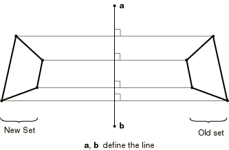

##### Reflecting the coordinates through a plane

To reflect the old nodal coordinates through a plane, you specify the coordinates of points *a*, *b*, and *c* (see [Figure 2.1.1--5](pt01ch02s01aus05.md#kncopy-reflect-mirror)).

| **Input File Usage: ** | ``` [*NCOPY](../key/key-link.md#usb-kws-mncopy), OLD SET=*name*, CHANGE NUMBER=*n*, REFLECT=MIRROR ``` |
| --- | --- |

**Figure 2.1.1–5** Reflection of coordinates through a plane.


##### Reflecting the coordinates through a point

To reflect the old nodal coordinates through a point, you specify the coordinates of point *a* (see [Figure 2.1.1--6](pt01ch02s01aus05.md#kncopy-reflect-point)).

| **Input File Usage: ** | ``` [*NCOPY](../key/key-link.md#usb-kws-mncopy), OLD SET=*name*, CHANGE NUMBER=*n*, REFLECT=POINT ``` |
| --- | --- |

**Figure 2.1.1–6** Reflection of coordinates through a point.


#### Projecting the nodes in the old set from a pole node

You can create new nodes by projecting the nodes in the old set from a pole node. Each new node will be located such that the corresponding old node is equidistant between the pole node and the new node. The pole node (see [Figure 2.1.1--7](pt01ch02s01aus05.md#kncopy-pole)) is identified by giving its number or, alternatively, its coordinates.

**Figure 2.1.1–7** Projection of existing nodes from a pole node.


This method is particularly useful for creating nodes that are associated with infinite elements (["Infinite elements," Section 28.3.1](pt06ch28s03alm03.md)). In this case the pole node should be located at the center of the far-field solution.

| **Input File Usage: ** | ``` [*NCOPY](../key/key-link.md#usb-kws-mncopy), OLD SET=*name*, CHANGE NUMBER=*n*, POLE ``` |
| --- | --- |

### Creating nodes by filling in nodes between two bounds

You can create nodes by filling in nodes between two bounds. In this case you specify the two node sets whose members form the bounds, the number of intervals along each line between the bounding nodes, and the increment in node numbers from the node number at the first bound set end.

Let *l* equal the number of lines of nodes to be created between the two bounding node sets; the number of intervals along each line between the bounding nodes is then given by 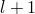.

Let *n* equal the increment in node numbers from the node number at the first bound set end; for each node (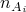) in the first bounding node set, the corresponding node in the other bounding node set () must be numbered such that  is a whole number.

The node sets that define the bounds of the region are used as they exist at the time the node fill definition appears in the input file: only those nodes that have been added to the sets prior to the node fill definition are used. Both sorted and unsorted node sets can be used. Nodes that have not yet been given coordinates are assumed to be at the origin, (0.,0.,0.).

The nodes created by this method lie on straight lines between corresponding nodes in the two sets. If the sets do not have the same number of nodes, the extra nodes in the longer set are ignored. By default, the spacing between nodes along the lines is uniform.

| **Input File Usage: ** | ``` [*NFILL](../key/key-link.md#usb-kws-mnfill) ``` |
| --- | --- |

#### Example

For example, [Figure 2.1.1--8](pt01ch02s01aus05.md#inode-nfill-3d-exa) shows a simple quarter-cylinder model. 

**Figure 2.1.1–8** Filling a three-dimensional region.

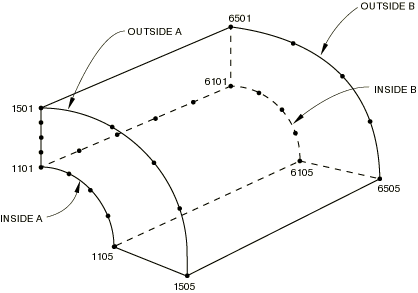

The quarter circles `INSIDEA` (nodes 1101–1105), `OUTSIDEA` (nodes 1501–1505), `INSIDEB` (nodes 6101–6105), and `OUTSIDEB` (6501–6505) have already been defined by specifying their coordinates directly or generating them incrementally. The region is filled by first filling the end planes and placing the nodes on those planes into sets `A` and `B` and then filling between those sets with the following options:
```
[*NFILL](../key/key-link.md#usb-kws-mnfill), NSET=A
INSIDEA, OUTSIDEA, 4, 100
[*NFILL](../key/key-link.md#usb-kws-mnfill), NSET=B
INSIDEB, OUTSIDEB, 4, 100
[*NFILL](../key/key-link.md#usb-kws-mnfill)
A, B, 5, 1000
```

#### Concentrating the nodes toward one bound or the other

You can concentrate the nodes toward one bound or the other by specifying *b*, the ratio of adjacent distances between nodes along each line of nodes generated as the nodes go from the first bounding node set to the second.

Thus, if *b* is less than one, the nodes are concentrated toward the first bounding node set; if *b* is greater than one, the nodes are concentrated toward the second bounding set. The value of *b* must be positive.

The bias intervals along the line from the first bounding node are *L*, , 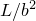, , , 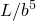, … (where *L* is the length of the first interval). In Abaqus/Standard the bias value can be applied at every interval along the line or at every second interval along the line as described later.

| **Input File Usage: ** | ``` [*NFILL](../key/key-link.md#usb-kws-mnfill), BIAS=*b* ``` |
| --- | --- |

##### Example

For example, suppose the lines of nodes shown in [Figure 2.1.1--9](pt01ch02s01aus05.md#inode-nfill-bias-exa) have already been generated by other methods and placed into node sets `INSIDE` and `OUTSIDE`. 

**Figure 2.1.1–9** Node sets defining bias example.


The following option will fill the region as shown in [Figure 2.1.1--10](pt01ch02s01aus05.md#inode-nfill-bias-exa-res):
```
[*NFILL](../key/key-link.md#usb-kws-mnfill), BIAS=0.6
INSIDE, OUTSIDE, 5, 100
```

**Figure 2.1.1–10** Result of bias example.


##### Applying the bias value at every second interval along the line

In Abaqus/Standard you can apply the bias value at every second interval along the line. In this case the nodes will be positioned along the line correctly for use with second-order elements, so that the midside nodes are at the middle of the interval between the corner nodes of the elements.

The bias intervals along the line from the first bounding node are *L*, *L*, , , , , … (where *L* is the length of the first interval).

| **Input File Usage: ** | ``` [*NFILL](../key/key-link.md#usb-kws-mnfill), BIAS=*b*, TWO STEP ``` |
| --- | --- |

#### Creating quarter-point spacing

In Abaqus/Standard you can create quarter-point spacing for fracture mechanics calculations with second-order isoparametric elements (["Fracture mechanics: overview," Section 11.4.1](pt04ch11s04abo13.md)). This spacing gives a square root singularity in the strain field at the crack tip by placing the first node away from that point at one-quarter of the distance to the second point. The remaining nodes on each line are spaced so that the size of the elements will grow as the square of the distance from the singularity, with the midside nodes exactly at the midsides of the elements. This spacing produces a reasonable mesh gradation for this type of problem; however, better results can be obtained for crude meshes by making the size of the crack element smaller than the quarter-point spacing technique does.

| **Input File Usage: ** | ``` [*NFILL](../key/key-link.md#usb-kws-mnfill), SINGULAR ``` |
| --- | --- |

##### Example

[Figure 2.1.1--11](pt01ch02s01aus05.md#inode-nfill-sing-exa-pt1) shows a simple fracture mechanics example. 

**Figure 2.1.1–11** Node fill used in a singular problem.


(The mesh shown is very coarse, and a finer mesh would probably be used in an actual case.) The nodes on the top edge have been placed in node set `TOP`, those on the horizontal line at the upper end of the focused region are in node set `MID`, all of the nodes around the focused region are in node set `OUTER`, and there are multiple nodes at the crack tip in node set `TIP`. The following options are used to fill in the region as shown in [Figure 2.1.1--12](pt01ch02s01aus05.md#inode-nfill-sing-exa-pt2) (note the quarter-point nodes adjacent to the crack tip): 
```
[*NFILL](../key/key-link.md#usb-kws-mnfill), BIAS=0.8
MID, TOP, 4, 100
[*NFILL](../key/key-link.md#usb-kws-mnfill), SINGULAR=1
TIP, OUTER, 5, 20
```

**Figure 2.1.1–12** Node fill used in a singular problem.

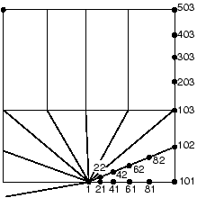

### Mapping a set of nodes from one coordinate system to another

You can map a set of nodes from one coordinate system to another. You can also rotate, translate, or scale the nodes in a set by using a more direct method instead of coordinate system mapping. These capabilities are useful for many geometric situations: a mesh can be generated quite easily in a local coordinate system (for example, on the surface of a cylinder) using other methods and then can be mapped into the global (*X*, *Y*, *Z*) system. In other cases some parts of your model need to be translated or rotated along a given axis or scaled with respect to one point.

The mapping capability cannot be used in a model defined in terms of an assembly of part instances.

The following different mappings are provided: a simple scaling; a simple shift and/or rotation; skewed Cartesian; cylindrical; spherical; toroidal; and, in Abaqus/Standard only, blended quadratic. The first five of these mappings are shown in [Figure 2.1.1--13](pt01ch02s01aus05.md#knmap-coordsys). 

**Figure 2.1.1–13** Coordinate systems; angles are in degrees.

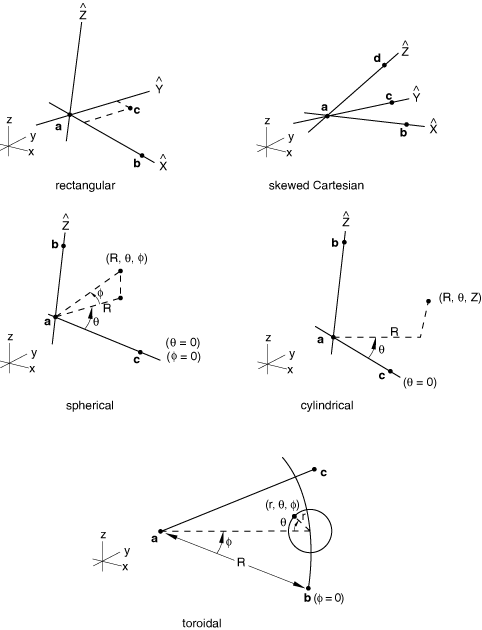

Blended quadratic mapping is shown in [Figure 2.1.1--14](pt01ch02s01aus05.md#inode-nmap-blended). 

**Figure 2.1.1–14** Use of blended quadratic mapping to develop a solid mesh onto a curved block.


In all cases the coordinates of the nodes in the set are assumed to be defined in the local system: these local coordinates at each node are replaced with the global Cartesian (*X*, *Y*, *Z*) coordinates defined by the mapping. All angular coordinates should be given in degrees. 

You can use either coordinates or node numbers to define the new coordinate system, the axis of rotation and translation, or the reference point used for scaling.

The mapping capability can be used several times in succession on the same nodes, if required.

#### Scaling the local coordinates before they are mapped

For all mappings except the blended quadratic mapping, you can specify a scaling factor to be applied to the local coordinates before they are mapped.

This facility is useful for “stretching” some of the coordinates that are given. For example, in cases where the local system uses some angular coordinates and some distance coordinates (cylindrical, spherical, etc.), it may be preferable to generate the mesh in a system that uses distance measures in the angular directions and then scale onto the angular coordinate system for the mapping.

 Two different scaling methods are available.

##### Specifying the scaling factors directly

A first method of scaling the nodes with respect to the origin of the local system is to specify the scale factors directly. In this case the scaling is done at the same time as the mapping from one coordinate system to another.

| **Input File Usage: ** | ``` [*NMAP](../key/key-link.md#usb-kws-mnmap), NSET=*name* *first data line* *second data line* *scale factor for first local coord, scale factor for second local coord, scale factor for third local coord* ``` |
| --- | --- |

##### Specifying the scaling with respect to a reference point

Alternatively, you can scale with respect to a point other than the origin. The reference point with respect to which the scaling is done can be defined by using either its coordinates or the user node number.

| **Input File Usage: ** | Use the following option to define the scaling reference point by using its coordinates (default): |
| --- | --- |
|  | ``` [*NMAP](../key/key-link.md#usb-kws-mnmap), TYPE=SCALE, DEFINITION=COORDINATES *X-coordinate of reference point, Y-coordinate of reference point, Z-coordinate of reference point * *scale factor for first local coord, scale factor for second local coord, scale factor for third local coord* ``` Use the following option to define the scaling reference point by using its node number: ``` [*NMAP](../key/key-link.md#usb-kws-mnmap), TYPE=SCALE, DEFINITION=NODES *Local node number of the reference point* *scale factor for first local coord, scale factor for second local coord, scale factor for third local coord* ``` |

#### Introducing a simple shift and/or rotation by mapping from one coordinate system to another

In the case of a simple shift and/or rotation, point *a* in [Figure 2.1.1--13](pt01ch02s01aus05.md#knmap-coordsys) defines the origin of the local rectangular coordinate system defining the map. The local -axis is defined by the line joining points *a* and *b*. The local –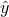 plane is defined by the plane passing through points *a*, *b*, and *c*.

| **Input File Usage: ** | ``` [*NMAP](../key/key-link.md#usb-kws-mnmap), NSET=*name*, TYPE=RECTANGULAR ``` |
| --- | --- |

#### Introducing a pure shift by specifying the axis and magnitude of the translation

You can define a pure translation (or shift) to move a set of nodes  by a prescribed value along a desired axis. You must specify the axis of translation by providing either the coordinates or the two node numbers defining this axis, and you must prescribe the magnitude of the translation.

| **Input File Usage: ** | Use the following option to specify the axis of translation using coordinates (default): |
| --- | --- |
|  | ``` [*NMAP](../key/key-link.md#usb-kws-mnmap), NSET=*name*, TYPE=TRANSLATION, DEFINITION=COORDINATES ``` Use the following option to specify the axis of translation using node numbers: ``` [*NMAP](../key/key-link.md#usb-kws-mnmap), NSET=*name*, TYPE=TRANSLATION, DEFINITION=NODES ``` |

#### Introducing a pure rotation by specifying the axis, origin, and angle of the rotation

You can define a rotation of a set of nodes by providing the axis of rotation, the origin of rotation, and the magnitude of the rotation. You must specify the axis of rotation by providing either the coordinates or the two node numbers defining this axis. You must specify the origin of the rotation by providing either the coordinates or the node number at the origin of rotation. Finally, you must specify the angle of the rotation in degrees.

| **Input File Usage: ** | Use the following option to specify the axis of rotation using coordinates (default): |
| --- | --- |
|  | ``` [*NMAP](../key/key-link.md#usb-kws-mnmap), NSET=*name*, TYPE=ROTATION, DEFINITION=COORDINATES ``` Use the following option to specify the axis of rotation using node numbers: ``` [*NMAP](../key/key-link.md#usb-kws-mnmap), NSET=*name*, TYPE=ROTATION, DEFINITION=NODES ``` |

#### Mapping from cylindrical coordinates

For mapping from cylindrical coordinates, point *a* in [Figure 2.1.1--13](pt01ch02s01aus05.md#knmap-coordsys) defines the origin of the local cylindrical coordinate system defining the map. The line going through point *a* and point *b* defines the -axis of the local cylindrical coordinate system. The local – plane for  is defined by the plane passing through points *a*, *b*, and *c*.

| **Input File Usage: ** | ``` [*NMAP](../key/key-link.md#usb-kws-mnmap), NSET=*name*, TYPE=CYLINDRICAL ``` |
| --- | --- |

#### Mapping from skewed Cartesian coordinates

For mapping from skewed Cartesian coordinates, point *a* in [Figure 2.1.1--13](pt01ch02s01aus05.md#knmap-coordsys) defines the origin of the local diamond coordinate system defining the map. The line going through point *a* and point *b* defines the -axis of the local coordinate system. The line going through point *a* and point *c* defines the -axis of the local coordinate system. The line going through point *a* and point *d* defines the -axis of the local coordinate system. 

| **Input File Usage: ** | ``` [*NMAP](../key/key-link.md#usb-kws-mnmap), NSET=*name*, TYPE=DIAMOND ``` |
| --- | --- |

#### Mapping from spherical coordinates

For mapping from spherical coordinates, point *a* in [Figure 2.1.1--13](pt01ch02s01aus05.md#knmap-coordsys) defines the origin of the local spherical coordinate system defining the map. The line going through point *a* and point *b* defines the polar axis of the local spherical coordinate system. The plane passing through point *a* and perpendicular to the polar axis defines the  plane. The plane passing through points *a*, *b*, and *c* defines the local  plane.

| **Input File Usage: ** | ``` [*NMAP](../key/key-link.md#usb-kws-mnmap), NSET=*name*, TYPE=SPHERICAL ``` |
| --- | --- |

#### Mapping from toroidal coordinates

For mapping from toroidal coordinates, point *a* in [Figure 2.1.1--13](pt01ch02s01aus05.md#knmap-coordsys) defines the origin of the local toroidal coordinate system defining the map. The axis of the local toroidal system lies in the plane defined by points *a*, *b*, and *c*. The *R*-coordinate of the toroidal system is defined by the distance between points *a* and *b*. The line between points *a* and *b* defines the  position. For every value of  the -coordinate is defined in a plane perpendicular to the plane defined by the points *a*, *b*, and *c* and perpendicular to the axis of the toroidal system.  lies in the plane defined by the points *a*, *b*, and *c*.

| **Input File Usage: ** | ``` [*NMAP](../key/key-link.md#usb-kws-mnmap), NSET=*name*, TYPE=TOROIDAL ``` |
| --- | --- |

#### Mapping by means of blended quadratics

To map by means of blended quadratics in Abaqus/Standard, you define the new (mapped) coordinates of up to 20 “control nodes”: these are the corner and midedge nodes of the block of nodes being mapped. The mapping in this case is like that of a 20-node brick isoparametric element. Any of the midedge nodes can be omitted, thus allowing linear interpolation along that edge of the block. Abaqus/Standard does not check whether the nodes in the set lie within the physical space of the block defined by the corner and midedge nodes: these control nodes simply define mapping functions that are then applied to all of the nodes in the set.

The control nodes should define a “well”-shaped block; for example, midedge nodes should be close to the midpoint of the edge. Otherwise, the mapping can be very distorted. For example, the nodes of a crack-tip 20-node element with midside nodes at the quarter points will not map correctly and, therefore, should not be used as the control nodes.

Blended mapping is only available for three-dimensional analyses.

| **Input File Usage: ** | ``` [*NMAP](../key/key-link.md#usb-kws-mnmap), NSET=*name*, TYPE=BLENDED ``` |
| --- | --- |


