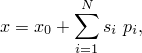

# 2.1.2 Parametric shape variation


**Products: **Abaqus/Standard  Abaqus/Explicit  

##### **References**

- ["Parametric input," Section 1.4.1](pt01ch01s04aus04.md)
- [*PARAMETER SHAPE VARIATION](../key/key-link.md#usb-kws-mparametershape)

### Overview

Shape parametrization can be accomplished in an Abaqus input file by: 
- parametrizing nodal coordinates; or
- relating nodal coordinates to shape parameters using shape variations.

The different approaches to shape parametrization are described in this section.

### Parametrization of nodal coordinates

Any individual nodal coordinates can be parametrized directly. This is usually of limited value because it often leads to designs with irregular shape that cannot be manufactured easily. In addition, parametrization of individual nodal coordinates generally requires an excessive number of parameters to define the parametrized shape.

Parametrization of nodal coordinates used in conjunction with node generation in Abaqus provides a more practical method of shape parametrization. However, this method is still of somewhat limited practical use because the simple node generation capabilities available in Abaqus cannot describe complex shapes.

#### Direct parametrization of individual nodal coordinates

The simplest form of parametrization of nodal coordinates is to define individual parameters and use them in place of the nodal coordinates to be parametrized, as described in ["Parametric input," Section 1.4.1](pt01ch01s04aus04.md). For example,

```
[*PARAMETER](../key/key-link.md#usb-kws-mparameter)
x_coord_node_1 = 10.
y_coord_node_1 = 20.
[*NODE](../key/key-link.md#usb-kws-mnode)
1, <x_coord_node_1>, <y_coord_node_1>
```

#### Parametrization of nodal coordinates using node generation

Shape parametrization can be accomplished by parametrizing the coordinates of some nodes, then using these nodes to generate other nodes and their coordinates. For example:

```
[*PARAMETER](../key/key-link.md#usb-kws-mparameter)
x_coord_node_1 = 10.
x_coord_node_11 = 20.
[*NODE](../key/key-link.md#usb-kws-mnode)
1, <x_coord_node_1>, 50.
11, <x_coord_node_11>, 50.
[*NGEN](../key/key-link.md#usb-kws-mngen)
1, 11, 1
```

This method of shape parametrization reduces the number of user-defined parameters necessary for shape parametrization by implicitly making the nodal coordinates of the generated nodes dependent on the shape parameters.

### Shape change by linear combination of shape variations

The definition of shape in Abaqus includes a basic shape plus any number of additional shape variations that are added to the basic shape using a linear combination. Mathematically, we can express the nodal coordinates, , as 



where  is the basic shape,  is the  shape variation, and  is the value of the  shape parameter. This calculation is always done in the global rectangular Cartesian coordinate system. Although it is not necessarily so, it is frequently the case that the input to define a shape variation is simply the gradient of the basic shape  taken with respect to the corresponding shape parameter.

You specify the basic shape of a model in the Abaqus input file by providing nodal definitions either directly or through node generation; see ["Node definition," Section 2.1.1](pt01ch02s01aus05.md).

You can specify shape variations and associated shape parameters, as described here.

In addition, you can specify perturbations of the shape as a linear combination of other shapes (for example, buckling mode shapes); see ["Introducing a geometric imperfection into a model," Section 11.3.1](pt04ch11s03aus67.md).

The definition of the nodal coordinates for a model in the Abaqus input file is then possible using a combination of four types of methods: 
- You can directly define individual nodes and their respective coordinates; these coordinates are part of the definition of the basic shape, , and can be parametrized.
- Node generation can be used to create nodes and their coordinates according to geometrically simple mappings that rely on existing node definitions; these generated coordinates are also part of the definition of the basic shape, . If necessary, the node generation input can be parametrized.
- Parameter shape variations can be used to vary the coordinates of nodes defined using the above methods.
- Geometric imperfections can be used to perturb nodal coordinates previously defined using any combination of the above three types of methods.

### Shape parametrization using shape variations

Instead of parametrizing nodal coordinates directly, you can specify shape variations. Each shape variation must be associated with a single shape parameter. The names of the parameters associated with the shape variations must be chosen such that the names remain unique when interpreted in a case-insensitive manner. The values of the shape parameters are assigned using parameter definitions.

A parameter shape variation can be defined more than once for the same parameter so that different parts of a shape variation can be specified separately. In these cases if the same node is specified in multiple parameter shape variation definitions, the last definition for the node prevails.

A node that is specified under a parameter shape variation definition that has not also been defined directly or through node generation will be ignored.

You can specify shape variations using a combination of three possibilities: directly specifying them, reading them from an alternate input file, and reading them from the results files of auxiliary analyses. These methods are described in the following sections.

#### Defining shape variations directly or reading them from an alternate input file

You can define the shape variation data directly by specifying the node number and corresponding variations of coordinate components. Alternatively, the data can be given in an ASCII file.

| **Input File Usage: ** | Use the following option to specify the shape variation data directly: |
| --- | --- |
|  | ``` [*PARAMETER SHAPE VARIATION](../key/key-link.md#usb-kws-mparametershape), PARAMETER=*name* ``` Use the following option to specify the shape variation data in an alternate input file: ``` [*PARAMETER SHAPE VARIATION](../key/key-link.md#usb-kws-mparametershape), PARAMETER=*name*, INPUT=*input file* ``` |

##### Defining shape variations in alternative coordinate systems

By default, the shape variation data are interpreted in the global rectangular Cartesian coordinate system. You can specify the shape variation data (either directly or in an alternate input file) in cylindrical or spherical coordinate systems. In such cases the computation of the shape variation is done as follows. The nodal coordinate components that define the basic shape are first transformed from the global rectangular Cartesian coordinate system in which they are stored to the specified coordinate system. The shape variation coordinate components are then added to give updated coordinate components, which are transformed back to the global rectangular Cartesian coordinate system. Finally, the shape variation is taken as the difference between the updated coordinate components and the original coordinate components, using the components expressed in the global rectangular Cartesian coordinate system. The value of the shape parameter associated with the shape variation is not used at any point in the calculation of the shape variation.

| **Input File Usage: ** | Use the following option to specify the shape variation data in a rectangular coordinate system (the default): |
| --- | --- |
|  | ``` [*PARAMETER SHAPE VARIATION](../key/key-link.md#usb-kws-mparametershape), PARAMETER=*name*, SYSTEM=R ``` Use the following option to specify the shape variation data in a cylindrical coordinate system: ``` [*PARAMETER SHAPE VARIATION](../key/key-link.md#usb-kws-mparametershape), PARAMETER=*name*, SYSTEM=C ``` Use the following option to specify the shape variation data in a spherical coordinate system: ``` [*PARAMETER SHAPE VARIATION](../key/key-link.md#usb-kws-mparametershape), PARAMETER=*name*, SYSTEM=S ``` |

#### Using auxiliary analyses to generate shape variations

Auxiliary models are additional finite element models that are used to generate shape variations for a primary model. Rather than defining shape variations directly on a node-by-node basis, auxiliary models can be used to simplify this process. Auxiliary analyses are finite element analyses of these auxiliary models.

An auxiliary model usually has the same geometry, element connectivity, and material type as the primary model. However, the boundary conditions are usually different. Applying loading to an auxiliary model results in sets of displacements that we may interpret as shape variations. For example, we may be interested in studying the sensitivity of the nonlinear buckling behavior of a structure with respect to imperfections in the structure. In this case we could perform an auxiliary eigenvalue linear buckling analysis and then use the resulting mode shapes as shape variations to be added to the basic geometry of the primary model. (This particular problem could also be addressed by using a geometric imperfection.)

Abaqus reads the shape variation data from auxiliary analyses through the user node labels. Abaqus does not check model compatibility between both analysis runs. Shape variation data cannot be read from the results file for models defined in terms of an assembly of part instances (["Defining an assembly," Section 2.10.1](pt01ch02s10aus28.md)).

##### Reading shape variations from a static analysis results file

To define a shape variation based on the deformed geometry of a previous static analysis, specify the results file and step from a previous static analysis. Optionally, you can specify the increment number from which displacement data are read. (By default, Abaqus will read data from the last increment available for the specified step on the results file.) In addition, you can read shape variation data for a specified node set.

| **Input File Usage: ** | ``` [*PARAMETER SHAPE VARIATION](../key/key-link.md#usb-kws-mparametershape), PARAMETER=*name*, FILE=*results file*, STEP=*step*, INC=*inc*, NSET=*name* ``` |
| --- | --- |

##### Reading shape variations from an eigenvalue analysis results file

To define a shape variation based on a mode shape from a previous eigenvalue analysis, specify the results file and step from a previous eigenfrequency extraction or eigenvalue buckling prediction analysis. Optionally, you can specify the mode number from which eigenvector data are read. (By default, Abaqus will read data from the first eigenvector available for the specified step on the results file.) In addition, you can read eigenmode data for a specified node set.

| **Input File Usage: ** | ``` [*PARAMETER SHAPE VARIATION](../key/key-link.md#usb-kws-mparametershape), PARAMETER=*name*, FILE=*results file*, STEP=*step*, MODE=*mode*, NSET=*name* ``` |
| --- | --- |

### Shape parametrization and design sensitivity analysis

For the purpose of design sensitivity analysis with Abaqus/Design (["Design sensitivity analysis," Section 19.1.1](pt04ch19s01aus107.md)) if the parameter specified for a parameter shape variation is also specified as a design parameter, the shape variation is used to define the design gradient of the nodal coordinates and nodal normals with respect to the design parameter. If you wish to perform design sensitivity analysis for the basic shape, all shape parameters must be given a value of zero. In addition, if *any* parameter specified in a parameter shape variation definition is also specified as a design parameter, the parameters of *all* parameter shape variations must be specified as design parameters.

In DSA calculations for shell and beam elements Abaqus always computes the design gradients of nodal normals using the design gradients of nodal coordinates. To overwrite the gradients computed by Abaqus, you must provide the nodal normal as part of the node definition and design gradients of the normals using a parameter shape variation. To prescribe a design-independent normal, you must provide a zero design gradient explicitly. For shape variations read from the results file, Abaqus computes the gradients of the normals based on the displacements and ignores the nodal rotations.

For beam elements Abaqus computes the design gradients for the -direction of the beam cross-section using the gradients of the node coordinates and the gradients for the -direction specified using a parameter shape variation. You cannot provide the shape variation for the -direction. Abaqus ignores any such design gradients implicitly provided in either the beam section definition or as an extra node in the beam element connectivity.

In cases where the data defining a shape variation are given in a cylindrical or spherical coordinate system it is important that you understand how the shape variation is calculated from the data. This calculation is described in the previous section.

### Visualization of shape variations

Shape variations can be visualized only after the parametrized input file has been processed by the analysis input file processor. Therefore, at least a data check run must be executed before parameter shape variations can be visualized using Abaqus/CAE.

The shape variations associated with each individual shape parameter can be visualized as displaced shape plots at step zero of the analysis. The basic shape is interpreted as the undeformed shape, and the shape generated by adding the  shape variation to the basic shape is interpreted as the  displaced shape.

The combination of all shape variations added to the basic shape represents the true undeformed shape of the analysis.

### Using Abaqus/CAE to compute shape variations

A capability for computing shape variations is provided by the Abaqus Scripting Interface command `_computeShapeVariations( )`. Using the command requires some familiarity with the Abaqus Scripting Interface and the execution of scripts in Abaqus/CAE. The procedure that must be followed is described and illustrated in ["Design sensitivity analysis: overview," Section 14.1.1 of the Abaqus Example Problems Guide](../exa/exa-link.md#exa-dsa-overview).


