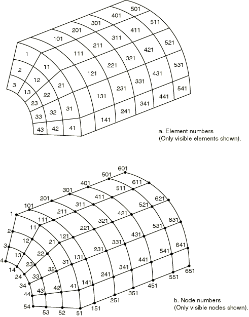

# 2.2.1 Element definition


**Products: **Abaqus/Standard  Abaqus/Explicit  

##### **References**

- [*ELCOPY](../key/key-link.md#usb-kws-melcopy)
- [*ELEMENT](../key/key-link.md#usb-kws-melement)
- [*ELGEN](../key/key-link.md#usb-kws-melgen)
- [*ELSET](../key/key-link.md#usb-kws-melset)

### Overview

This section describes the methods for defining elements in an Abaqus input file. In a preprocessor such as Abaqus/CAE, you define the model geometry rather than the nodes and elements; when you mesh the geometry, the preprocessor automatically creates the nodes and elements needed for analysis. Although the concepts discussed in this section apply in general to the element definitions in the input file that is created by Abaqus/CAE, the methods and techniques described here apply only if you are creating the input file manually.

Element definition consists of:
- assigning an element number to the element;
- defining individual elements by specifying their nodes;
- grouping elements into element sets; and
- creating elements from existing elements by generating them incrementally or by copying existing elements.

If any element is specified more than once, the last specification given is used.

### Assigning an element number to the element

Each individual element must have a numeric label called the element number, which is assigned when the element is defined. The element number must be a positive integer, and the maximum element number allowed is 999999999 (for information on integer input, see ["Input syntax rules," Section 1.2.1](pt01ch01s02aus01.md)). The elements do not need to be numbered continuously.

An Abaqus model can be defined in terms of an assembly of part instances (see ["Defining an assembly," Section 2.10.1](pt01ch02s10aus28.md)). In such a model almost all elements must belong to a part or part instance. The only exceptions are mass, rotary inertia, capacitance, connector, spring, and dashpot elements, which can belong to a part or to the assembly. Element numbers must be unique within a part, part instance, or the assembly; but they can be repeated in different parts or part instances.

### Defining individual elements by specifying their nodes

You can define individual elements by specifying the element number and the nodes that define the element. In addition, you must specify the element type. The element must be chosen from one of the element types specified in [Part VI, "Elements](pt06.md)”; or, in Abaqus/Standard, it can be a user-defined element (["User-defined elements," Section 32.15.1](pt06ch32s15alm60.md)) or a substructure (["Using substructures," Section 10.1.1](pt04ch10s01aus58.md)). 

| **Input File Usage: ** | ``` [*ELEMENT](../key/key-link.md#usb-kws-melement), TYPE=*name* ``` |
| --- | --- |
|  | For example, the following lines create element number 11, which is of type C3D8R, by defining its nodes (2, 3, 9, 7, 5, 8, 12, 16): ``` [*ELEMENT](../key/key-link.md#usb-kws-melement), TYPE=C3D8R 11, 2, 3, 9, 7, 5, 8, 12, 16 ``` |

#### Using large node numbers with elements that use many nodes

The following rules apply when defining elements:
- The connectivity for each element is considered a logical record, and any number of input lines can be used to specify it. Abaqus will read the first line for an element and consider the next line a continuation line if a comma ends the line and the element definition is not complete.
- Any number of continuation lines can be used.
- For elements such as C3D27 with a variable number of nodes (see ["Solid (continuum) elements," Section 28.1.1](pt06ch28s01alm01.md)), the last line should not end with a comma or Abaqus will interpret the next element definition as a continuation of the current element.

 For example,
```
[*ELEMENT](../key/key-link.md#usb-kws-melement), TYPE=C3D20
100001, 100001, 100002, 100003, 100004, 100005, 100006, 100007,
100008, 100009, 100010, 100011, 100012, 100013, 100014, 100015,
100016, 100017, 100018, 100019, 100020
```

#### Reading element definitions from a file

Element definitions can be read into Abaqus from an alternate file. The syntax of such file names is described in ["Input syntax rules," Section 1.2.1](pt01ch01s02aus01.md).

| **Input File Usage: ** | ``` [*ELEMENT](../key/key-link.md#usb-kws-melement), INPUT=*file_name* ``` |
| --- | --- |

#### Reading substructure definitions from a substructure library

Substructure definitions can be read from the substructure library in which the substructure resides (["Using substructures," Section 10.1.1](pt04ch10s01aus58.md)).

| **Input File Usage: ** | ``` [*ELEMENT](../key/key-link.md#usb-kws-melement), FILE=*substructure_library_name* ``` |
| --- | --- |
|  | If the FILE parameter is used without a value, the default substructure library name is used. |

#### Defining axisymmetric elements with asymmetric deformation

You can define a positive offset number that will be used to specify nodes for axisymmetric elements with asymmetric deformation (see ["Choosing the element's dimensionality," Section 27.1.2](pt06ch27s01aus111.md); ["Axisymmetric solid elements with nonlinear, asymmetric deformation," Section 28.1.7](pt06ch28s01ael06.md); and ["Axisymmetric shell elements with nonlinear, asymmetric deformation," Section 29.6.10](pt06ch29s06ael20.md), for more information on axisymmetric elements with asymmetric deformation; they are available only in Abaqus/Standard). The default offset is 100000.

| **Input File Usage: ** | ``` [*ELEMENT](../key/key-link.md#usb-kws-melement), OFFSET=*number* ``` |
| --- | --- |

#### Defining gasket elements

There are several methods for defining gasket elements. (See ["Gasket elements: overview," Section 32.6.1](pt06ch32s06abo30.md); ["Including gasket elements in a model," Section 32.6.3](pt06ch32s06alm48.md); and ["Defining the gasket element's initial geometry," Section 32.6.4](pt06ch32s06alm49.md), for more information on gasket elements; they are available only in Abaqus/Standard.)

In the first method you define individual elements by specifying the element number and the nodes that define the element.

In the second method you specify only the nodes on the bottom surface of the gasket element and a positive offset number that will be used to define the corresponding nodes for the top surface. For the 18-node gasket element you give the first eight nodes followed by the midsurface node; i.e., node 17 in the full element nodal connectivity.

Abaqus/Standard can generate the midface nodes of the 18-node gasket elements automatically if both element faces are part of contact surfaces. To invoke this feature, you enter a blank instead of the actual node numbers in either of the above input methods. Abaqus/Standard will then generate the node numbers and coordinates of the midface nodes automatically.

| **Input File Usage: ** | Use the following option to specify the element number and the nodes that define the element: |
| --- | --- |
|  | ``` [*ELEMENT](../key/key-link.md#usb-kws-melement), TYPE=*name* ``` Use the following option to specify the nodes on the bottom surface of the element and a positive offset number for the top surface: ``` [*ELEMENT](../key/key-link.md#usb-kws-melement), TYPE=*name*, OFFSET=*offset number* ``` |

##### Using solid element connectivity to define gasket elements

The node numbering scheme for gasket elements does not correspond to the node numbering scheme for continuum elements, which can be inconvenient if the mesh generator used does not support gasket elements directly or in thermal-stress analysis where continuum elements are used to model the heat conduction in the gasket. For such cases you can specify that solid element connectivity is used to define the gasket element. By default, it is assumed that the first (S1) face of the solid element coincides with the first (SNEG) face of the gasket element. If the equivalent solid element is oriented differently, specify the face number on the solid element that corresponds to the first face of the gasket element. The solid element must have the same number of nodes on each face as the corresponding gasket element; any nodes between the faces will be ignored. The 18-node gasket element is an exception. If both element faces are part of contact surfaces, the connectivity of a 20-node brick element can be used, and Abaqus/Standard will generate the node numbers and coordinates of the midface nodes automatically.

Abaqus/Standard will transform the solid element connectivity to the normal gasket element connectivity immediately upon reading the data. Hence, all output to the data (`.dat`), results (`.fil`), and output database (`.odb`) files will use the normal gasket element connectivity.

| **Input File Usage: ** | Use the following option to specify solid element connectivity for a gasket element in which the first face of the solid element corresponds to the first face of the gasket element: |
| --- | --- |
|  | ``` [*ELEMENT](../key/key-link.md#usb-kws-melement), TYPE=*name*, SOLID ELEMENT NUMBERING ``` Use the following option to specify solid element connectivity for a gasket element and the face of the solid element that corresponds to the first face of the gasket element: ``` [*ELEMENT](../key/key-link.md#usb-kws-melement), TYPE=*name*, SOLID ELEMENT NUMBERING=*face number* ``` |

##### Examples

The following lines create GK3D12M element number 11 that has node numbers 1, 2, 3, 4, 5, 6, 1001, 1002, 1003, 1004, 1005, and 1006: 

```
[*ELEMENT](../key/key-link.md#usb-kws-melement), TYPE=GK3D12M
11, 1, 2, 3, 4, 5, 6, 1001, 1002, 1003, 1004, 1005, 1006
```

The same element connectivity is also created by the following lines:
```
[*ELEMENT](../key/key-link.md#usb-kws-melement), TYPE=GK3D12M, OFFSET=1000
11, 1, 2, 3, 4, 5, 6
```

The equivalent solid element would be C3D15, with the following input:
```
[*ELEMENT](../key/key-link.md#usb-kws-melement), TYPE=GK3D12M, SOLID ELEMENT NUMBERING
11, 1, 2, 3, 1001, 1002, 1003, 4, 5, 6, 1004, 1005, 1006,  
501, 502, 503
```

where nodes 501, 502, and 503 would not be used.

#### Defining cohesive elements

There are three methods for defining cohesive elements. (See ["Cohesive elements: overview," Section 32.5.1](pt06ch32s05abo29.md); ["Modeling with cohesive elements," Section 32.5.3](pt06ch32s05alm42.md); and ["Defining the cohesive element's initial geometry," Section 32.5.4](pt06ch32s05alm43.md), for more information on cohesive elements.) 
- In the first method you specify the element number and all of the nodes that define the element.
- In the second method you specify only the nodes on the bottom face of the cohesive element and Abaqus will create the remaining nodes, numbering them according to an offset number that you specify.
- In the third method, which is applicable only to pore pressure cohesive elements, you specify the nodes on the bottom and top faces. Abaqus will create the remaining middle-face nodes according to an offset number that you specify.

##### Defining a cohesive element by specifying all nodes

With this method you specify all nodes that define the cohesive element. See ["Two-dimensional cohesive element library," Section 32.5.8](pt06ch32s05ael30.md); ["Three-dimensional cohesive element library," Section 32.5.9](pt06ch32s05ael31.md); and ["Axisymmetric cohesive element library," Section 32.5.10](pt06ch32s05ael32.md), for the element node numbering definition.

| **Input File Usage: ** | Use the following option to specify the element number and the nodes that define the element: |
| --- | --- |
|  | ``` [*ELEMENT](../key/key-link.md#usb-kws-melement), TYPE=*name* ``` For example, the following lines create COH3D8 element number 11 that has node numbers 1, 2, 3, 4, 1001, 1002, 1003, and 1004: ``` [*ELEMENT](../key/key-link.md#usb-kws-melement), TYPE=COH3D8 11, 1, 2, 3, 4, 1001, 1002, 1003, 1004 ``` |

##### Defining a cohesive element by specifying only the bottom face nodes

With this method you specify only the nodes on the bottom face of the cohesive element and a positive offset number. With displacement cohesive elements, the offset number is added to the bottom face node numbers to create the corresponding nodes on the top face. With pore pressure cohesive elements, the offset number first is added to the bottom face node numbers to create the corresponding nodes on the top face, then the offset number is added to the top face node numbers to create the corresponding nodes on the middle face.

| **Input File Usage: ** | Use the following option to specify the nodes on the bottom face of the element and a positive offset number for nodes on the remaining face or faces: |
| --- | --- |
|  | ``` [*ELEMENT](../key/key-link.md#usb-kws-melement), TYPE=*name*, OFFSET=*offset number* ``` For example, the following lines create COH3D8 element number 11 that has node numbers 1, 2, 3, 4, 1001, 1002, 1003, and 1004: ``` [*ELEMENT](../key/key-link.md#usb-kws-melement), TYPE=COH3D8, OFFSET=1000 11, 1, 2, 3, 4 ``` and the following lines create pore pressure cohesive element COH3D8P element number 11 that has node numbers 1, 2, 3, 4, 1001, 1002, 1003, 1004, 2001, 2002, 2003, and 2004 (nodes 1, 2, 3, and 4 define the bottom face; nodes 1001, 1002, 1003, and 1004 define the top face; and nodes 2001, 2002, 2003, and 2004 define the middle face): ``` [*ELEMENT](../key/key-link.md#usb-kws-melement), TYPE=COH3D8P, OFFSET=1000 11, 1, 2, 3, 4 ``` |

##### Defining a pore pressure cohesive element by specifying only the bottom and top face nodes

With this method you specify only the nodes on the bottom and top faces of the pore pressure cohesive element and a positive offset number. The offset number is added to the bottom face node numbers to create the corresponding nodes on the middle face.

| **Input File Usage: ** | Use the following option to specify the nodes on the bottom and top faces of the pore pressure cohesive element and a positive offset number for the remaining middle-face nodes: |
| --- | --- |
|  | ``` [*ELEMENT](../key/key-link.md#usb-kws-melement), TYPE=*name*, OFFSET=*offset number* ``` For example, the following lines create a pore pressure cohesive element COH3D8P element number 11 that has node numbers 1, 2, 3, 4, 1001, 1002, 1003, 1004, 2001, 2002, 2003, and 2004 (nodes 1, 2, 3, and 4 define the bottom face; nodes 1001, 1002, 1003, and 1004 define the top face; and nodes 2001, 2002, 2003, and 2004 define the middle face): ``` [*ELEMENT](../key/key-link.md#usb-kws-melement), TYPE=COH3D8P, OFFSET=2000 11, 1, 2, 3, 4, 1001, 1002, 1003, 1004 ``` |

### Grouping elements into element sets

Element sets are used as convenient cross-references for defining loads, properties, etc. Element sets are the fundamental references of the model and should be used to assist the input definition. The members of an element set can be individual elements or other element sets. An individual element can belong to several element sets.

Elements can be grouped into element sets when they are created or after they have already been defined. In either case each element set is assigned a name. Element set names can be up to 80 characters long.

The same name can be used for a node set and for an element set.

All elements within an element set will be arranged in ascending order of their element number, and duplicates will be removed.

Once elements are assigned to an element set, additional elements can be added to the same element set; however, elements cannot be removed from an element set.

#### Assigning elements to an element set as they are created

There are several ways that elements can be assigned to element sets as they are created.

| **Input File Usage: ** | Use any one of the following options: |
| --- | --- |
|  | ``` [*ELEMENT](../key/key-link.md#usb-kws-melement), ELSET=*name* [*ELGEN](../key/key-link.md#usb-kws-melgen), ELSET=*name* [*ELCOPY](../key/key-link.md#usb-kws-melcopy), NEW SET=*name* ``` |

#### Assigning previously defined elements to an element set

You can assign elements that you have defined previously (by specifying their nodes, by generating them incrementally, or by copying existing elements) to an element set by listing the elements forming the set directly or by generating the element set.

##### Listing the elements that form the set directly

You can list the elements that form the element set directly. Previously defined element sets, as well as individual elements, can be assigned to element sets.

| **Input File Usage: ** | ``` [*ELSET](../key/key-link.md#usb-kws-melset), ELSET=*name* ``` |
| --- | --- |
|  | For example, the following lines add elements 3, 13, and 20 to set `LEFT`: ``` [*ELSET](../key/key-link.md#usb-kws-melset), ELSET=LEFT 20 3, 13 ``` The following lines add elements 5 and 16 to the existing set `LEFT`: ``` [*ELSET](../key/key-link.md#usb-kws-melset), ELSET=LEFT 5, 16 ** The above data line is equivalent to specifying 5, 16, LEFT ``` The following lines add elements 22, 14, and all elements in set `LEFT` to set `B`: ``` [*ELSET](../key/key-link.md#usb-kws-melset), ELSET=B 22, 14, LEFT ``` Thus, element set `B` contains the following elements: 3, 5, 13, 14, 16, 20, and 22. Element set `LEFT` can be assigned to element set `B` since the definition of `LEFT` occurs before the definition of `B`. |

##### Generating the element set

To generate an element set, you must specify a first element, ; a last element, ; and the increment in element numbers between these elements, *i*. All elements going from  to  in steps of *i* will be added to the set. Therefore, *i* must be an integer such that  is a whole number (not a fraction). The default is .

| **Input File Usage: ** | ``` [*ELSET](../key/key-link.md#usb-kws-melset), ELSET=*name*, GENERATE ``` |
| --- | --- |
|  | For example, the following lines add elements 1, 3, 5, …, 19, 21 and elements 39, 49, 59, …, 129, 139 to set `UP`: ``` [*ELSET](../key/key-link.md#usb-kws-melset), ELSET=UP, GENERATE 1, 21, 2 39, 139, 10 ``` |

##### Limitation on updating element sets that are used to define other element sets

If an element set is constructed from previously defined element sets, subsequent updates to these sets are not taken into account. 

| **Input File Usage: ** | ``` [*ELSET](../key/key-link.md#usb-kws-melset), ELSET=*name* ``` |
| --- | --- |
|  | For example, the following lines add elements 1 and 2, but not 3, to the set `SET-AB` while adding elements 1 and 3 to set `SET-A`: ``` [*ELSET](../key/key-link.md#usb-kws-melset), ELSET=SET-A 1, [*ELSET](../key/key-link.md#usb-kws-melset), ELSET=SET-B 2, [*ELSET](../key/key-link.md#usb-kws-melset), ELSET=SET-AB SET-A, SET-B [*ELSET](../key/key-link.md#usb-kws-melset), ELSET=SET-A 3, ``` |

#### Defining part and assembly sets

In a model defined in terms of an assembly of part instances, all element sets must be defined within a part, part instance, or the assembly definition. If an element set is defined within a part (or part instance), you can refer to the element numbers directly. To define an assembly-level element set, you must identify the elements to be added to the set by prefixing each element number with the part instance name and a “.” (as explained in ["Defining an assembly," Section 2.10.1](pt01ch02s10aus28.md)). An assembly-level element set can have the same name as a part-level element set.

##### Example

The following input defines an element set, `set1`, that belongs to part `PartA` and will be inherited by every instance of `PartA`:

```
*PART, NAME=PartA
   ...
   *ELSET, ELSET=set1
    1,3,26,500
*END PART
```

An element set with the same name is defined at the assembly level as follows:
```
*ASSEMBLY, NAME=Assembly-1
   *INSTANCE, NAME=PartA-1, PART=PartA
    ...
   *END INSTANCE
   *INSTANCE, NAME=PartA-2, PART=PartA
    ...
   *END INSTANCE
   *ELSET, ELSET=set1
    PartA-1.1, PartA-1.3, PartA-1.26, PartA-1.500
    PartA-2.1, PartA-2.3, PartA-2.26, PartA-2.500
*END ASSEMBLY
```

Assembly-level element set `set1` contains all the elements from element sets `set1` belonging to part instances `PartA-1` and `PartA-2`. Therefore, the elements are assigned to two separate element sets: one at the part instance level and one at the assembly level. An assembly-level element set called `set1` could be created with entirely different elements than those that belong to the part set; part- and assembly-level element sets are independent. However, since in this example the same elements are assigned to both the part- and assembly-level element sets `set1`, the assembly-level set could alternatively be defined by
```
*ASSEMBLY, NAME=Assembly-1
   *INSTANCE, NAME=PartA-1, PART=PartA
    ...
   *END INSTANCE
   *INSTANCE, NAME=PartA-2, PART=PartA
    ...
   *END INSTANCE
   *ELSET, ELSET=set1
    PartA-1.set1, PartA-2.set1
*END ASSEMBLY
```

This element set definition is equivalent to the previous example, where the elements are listed individually.

##### Alternate method for defining assembly-level element sets

Sometimes it is not convenient to define an assembly-level element set by referring to part-level element sets. In such cases a set definition containing many elements can get quite lengthy. Therefore, an alternate method is provided.

| **Input File Usage: ** | ``` [*ELSET](../key/key-link.md#usb-kws-melset), ELSET=*ElsetName*, INSTANCE=*InstanceName* ``` |
| --- | --- |
|  | The following example shows two equivalent ways to define an assembly-level element set; once by prefixing each element number with a part instance name (as shown above) and once using the more compact INSTANCE notation: ``` *ASSEMBLY, NAME=Assembly-1 *INSTANCE, NAME=PartA-1, PART=PartA ... *END INSTANCE *INSTANCE, NAME=PartA-2, PART=PartA ... *END INSTANCE *ELSET, ELSET=set2 PartA-1.11, PartA-1.12, PartA-1.13, PartA-1.14, PartA-2.21, PartA-2.22, PartA-2.23, PartA-2.24 *ELSET, ELSET=set3, INSTANCE=PartA-1 11, 12, 13, 14 *ELSET, ELSET=set3, INSTANCE=PartA-2 21, 22, 23, 24 *END ASSEMBLY ``` When the [*ELSET](../key/key-link.md#usb-kws-melset) option is used more than once with the same name, as it is with `set3`, the elements in the second use of [*ELSET](../key/key-link.md#usb-kws-melset) are appended to the set created by the first use of [*ELSET](../key/key-link.md#usb-kws-melset). |

#### Internal element sets created by Abaqus/CAE

In Abaqus/CAE many modeling operations are performed by picking geometry with the mouse. For example, a surface can be created by picking a face on a geometric part instance. Since the [*SURFACE](../key/key-link.md#usb-kws-msurface) option refers to an element set, this “picked” geometry must be translated into an element set in the input file. Such sets are assigned a name by Abaqus/CAE and marked as internal. You can view these internal sets using display groups in the Visualization module of Abaqus/CAE (see [Chapter 78, "Using display groups to display subsets of your model," of the Abaqus/CAE User's Guide](../usi/usi-link.md#uss-dgp)).

| **Input File Usage: ** | ``` [*ELSET](../key/key-link.md#usb-kws-melset), ELSET=*ElsetName*, INTERNAL ``` |
| --- | --- |

### Transferring of element sets

If the results of an Abaqus/Explicit analysis are imported into an Abaqus/Standard analysis (or vice versa) or results from an Abaqus/Standard analysis are imported into another Abaqus/Standard analysis (see ["Transferring results between Abaqus analyses: overview," Section 9.2.1](pt04ch09s02aus54.md)), all element set definitions in the original analysis are imported by default. Alternatively, you can import only selected element set definitions; see ["Importing element set and node set definitions" in "Transferring results between Abaqus analyses: overview," Section 9.2.1](pt04ch09s02aus54.md#usb-anl-atransferoverview-elsetnodeset), for details.

If a three-dimensional model is generated from a symmetric model (see ["Symmetric model generation," Section 10.4.1](pt04ch10s04aus63.md)), all element sets in the original model will be used (and expanded) in the generated model.

### Creating elements from existing elements by generating them incrementally

You can generate elements incrementally from existing elements. The newly created elements are always the same element type as that of the master element.

Abaqus first generates a row of elements by copying the node pattern of a given element with prescribed increments in the node and element numbers. This row can then be repeated to form a layer, which can also be repeated to form a block.

To generate a row of elements, you must specify the following information:
- The master element number. The master element must exist at the time that the generation is specified, although it can be an element that has just been defined in this same element generation.
- The number of elements to be defined in the first row generated, including the master element.
- The increment in node numbers of corresponding nodes from element to element in the row. The default is 1. All element node numbers (except special-purpose nodes, discussed later) will increase by the same value.
- The increment in element numbers in the row. The default is 1.

To copy this newly created master row to create a layer of elements, you must specify the following additional information:- The number of rows to be defined, including the master row.
- The increment in node numbers of corresponding nodes from row to row.
- The increment in element numbers of corresponding elements from row to row.

To copy this newly created master layer to create a block of elements, you must specify the following additional information:- The number of layers to be defined, including the master layer.
- The increment in node numbers of corresponding nodes from layer to layer.
- The increment in element numbers of corresponding elements from layer to layer.

| **Input File Usage: ** | ``` [*ELGEN](../key/key-link.md#usb-kws-melgen) ``` |
| --- | --- |
|  | For example, the elements forming the quarter cylinder shown in [Figure 2.2.1--1](pt01ch02s02aus11.md#ielement-elgen-exa) can be generated by the following lines: ``` [*ELGEN](../key/key-link.md#usb-kws-melgen) 1, 3, 1, 1, 5, 10, 10, 6, 100, 100 ``` |

#### Incrementing special-purpose nodes

By default, the following nodes are not incremented: 
- rigid body reference nodes for IRS-type and drag chain elements; and
- nodes used to define the direction of the first cross-section axis for beams or frames in space.

You can specify that all nodes should be incremented. You define the increment between node numbers as described above. Usually the incrementation of all nodes is needed only for nodes used to define the direction of the first cross-section axis for beams in space.

| **Input File Usage: ** | ``` [*ELGEN](../key/key-link.md#usb-kws-melgen), ALL NODES ``` |
| --- | --- |

### Creating elements by copying existing elements

You can create new elements by copying existing elements. You must identify the existing element set to copy and specify an integer constant that will be added to the node numbers of the existing elements to define the node numbers of the new elements. Likewise, you must specify an integer constant that will be added to the element numbers of existing elements to define element numbers for the elements being created.

**Figure 2.2.1–1** Element generation example.



You can assign the newly created elements to an element set. If you do not specify an element set name for the newly created elements, they are not assigned to an element set.

| **Input File Usage: ** | ``` [*ELCOPY](../key/key-link.md#usb-kws-melcopy), OLD SET=*name*, NEW SET=*new_name*, SHIFT NODES=*number*, ELEMENT SHIFT=*number* ``` |
| --- | --- |
|  | For example, the following data lines will generate new elements in set `B` that are copies of all elements in set `A` at the time this option is processed, with 1000 added to each element number and to each node number in the definitions of the new elements. The members of set `A` at the time the line is processed are those elements defined to be in set `A` by all element generation and element set definition lines that appear in the input file prior to this [*ELCOPY](../key/key-link.md#usb-kws-melcopy) option. ``` [*ELCOPY](../key/key-link.md#usb-kws-melcopy), OLD SET=A, NEW SET=B, ELEMENT SHIFT=1000, SHIFT NODES=1000 ``` |

#### Special considerations for continuum elements

When copying existing elements, you can choose to modify the node numbering sequence for the elements being created to avoid creating continuum elements that violate the Abaqus convention for counterclockwise element numbering. This modification is normally required when the nodes have been generated by copying existing nodes (["Creating nodes by copying existing nodes" in "Node definition," Section 2.1.1](pt01ch02s01aus05.md#usb-int-inode-copy)).

| **Input File Usage: ** | ``` [*ELCOPY](../key/key-link.md#usb-kws-melcopy), REFLECT ``` |
| --- | --- |
|  | For example, assume element 1 is in element set `A` and is defined by nodes 1, 2, 3, 4. The following data line will generate element number 11, also in set `A`, with nodes 11, 14, 13, and 12: ``` [*ELCOPY](../key/key-link.md#usb-kws-melcopy), OLD SET=A, NEW SET=A, ELEMENT SHIFT=10, SHIFT NODES=10, REFLECT ``` If the REFLECT parameter is not used, the new element will be defined by the node sequence 11, 12, 13, 14 and will violate the counterclockwise element numbering convention used with continuum elements (see [Figure 2.2.1--2](pt01ch02s02aus11.md#ielement-elcopy-reflect)). |

**Figure 2.2.1–2** Example of modification of node numbering sequence.


