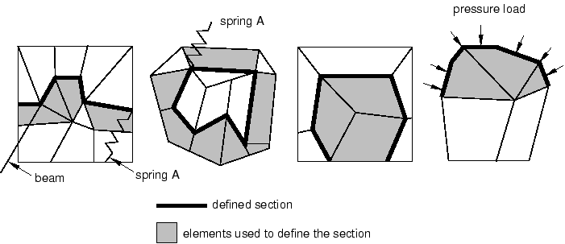
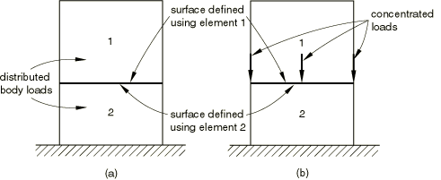

# 4.1.2 Output to the data and results files


**Products: **Abaqus/Standard  Abaqus/Explicit  

##### **References**

- ["Output," Section 4.1.1](pt02ch04s01aus38.md)
- [*CONTACT FILE](../key/key-link.md#usb-kws-hcontactfile)
- [*CONTACT PRINT](../key/key-link.md#usb-kws-hcontactprint)
- [*EL FILE](../key/key-link.md#usb-kws-helfile)
- [*EL PRINT](../key/key-link.md#usb-kws-helprint)
- [*ENERGY FILE](../key/key-link.md#usb-kws-henergyfile)
- [*ENERGY PRINT](../key/key-link.md#usb-kws-henergyprint)
- [*FILE OUTPUT](../key/key-link.md#usb-kws-hexpfileoutput)
- [*MODAL FILE](../key/key-link.md#usb-kws-hmodalfile)
- [*MODAL PRINT](../key/key-link.md#usb-kws-hmodalprint)
- [*NODE FILE](../key/key-link.md#usb-kws-hnodefile)
- [*NODE PRINT](../key/key-link.md#usb-kws-hnodeprint)
- [*RADIATION FILE](../key/key-link.md#usb-kws-hradfile)
- [*RADIATION PRINT](../key/key-link.md#usb-kws-hradprint)
- [*SECTION PRINT](../key/key-link.md#usb-kws-hsectionprint)
- [*SECTION FILE](../key/key-link.md#usb-kws-hsectionfile)

### Overview

Output variables are available for:
- element integration points, element section points, whole elements, and element sets;
- nodes;
- the whole model;
- modes in mode-based dynamics procedures;
- surfaces in Abaqus/Standard; and
- sections in Abaqus/Standard.

All of the output variables are defined in ["Abaqus/Standard output variable identifiers," Section 4.2.1](pt02ch04s02abv01.md), and ["Abaqus/Explicit output variable identifiers," Section 4.2.2](pt02ch04s02xbv01.md). Output quantities from the elements, nodes, and whole model can be written to the data and results files in Abaqus/Standard and to the selected results file in Abaqus/Explicit. In Abaqus/Standard output quantities from eigenmodes, surfaces, and sections can also be written to the data and results files.

For Abaqus models defined in terms of an assembly of part instances (see ["Defining an assembly," Section 2.10.1](pt01ch02s10aus28.md)), output in the data and results files is given in terms of node, element, set, and surface labels generated internally by Abaqus. See ["Output," Section 4.1.1](pt02ch04s01aus38.md), for details on how to relate the internally generated numbers and names to those you specified.

### Requesting output to the data and results files

The following sections discuss the input file syntax for requesting output to the data and results files. Abaqus/CAE automatically requests that a data file containing the default printed output for the current analysis procedure at the end of each step be generated; you cannot control the contents of the data file from within Abaqus/CAE. An analysis from Abaqus/CAE does not create a results file.

#### Output to the Abaqus/Standard data file

Abaqus/Standard analysis results can be written to the data (`.dat`) file. Element output, nodal output, contact surface output, energy output, modal output, and section output are available.

| **Input File Usage: ** | Use any of the following options to request output to the Abaqus/Standard data file: |
| --- | --- |
|  | ``` [*CONTACT PRINT](../key/key-link.md#usb-kws-hcontactprint) [*EL PRINT](../key/key-link.md#usb-kws-helprint) [*ENERGY PRINT](../key/key-link.md#usb-kws-henergyprint) [*MODAL PRINT](../key/key-link.md#usb-kws-hmodalprint) [*NODE PRINT](../key/key-link.md#usb-kws-hnodeprint) [*SECTION PRINT](../key/key-link.md#usb-kws-hsectionprint) ``` These options are discussed in detail below. |

#### Output to the Abaqus/Standard results file

Abaqus/Standard analysis results can be written to the results (`.fil`) file. Element output, nodal output, contact surface output, energy output, modal output, and section output are available.

| **Input File Usage: ** | Use any of the following options to request output to the Abaqus/Standard results file: |
| --- | --- |
|  | ``` [*CONTACT FILE](../key/key-link.md#usb-kws-hcontactfile) [*EL FILE](../key/key-link.md#usb-kws-helfile) [*ENERGY FILE](../key/key-link.md#usb-kws-henergyfile) [*MODAL FILE](../key/key-link.md#usb-kws-hmodalfile) [*NODE FILE](../key/key-link.md#usb-kws-hnodefile) [*SECTION FILE](../key/key-link.md#usb-kws-hsectionfile) ``` These options are discussed in detail below. |

#### Output to the Abaqus/Explicit results file

You can write Abaqus/Explicit analysis results to the selected results (`.sel`) file by specifying a results file output request in conjunction with element output, nodal output, and/or energy output requests, as explained below. A results file output request can appear only once per step but remains in effect in subsequent steps unless it is redefined.

You can convert the selected results file (`*job-name*.sel`) into the results (`*job-name*.fil`) file using the **convert** utility described in ["Obtaining results file output in Abaqus/Explicit" in "Output," Section 4.1.1](pt02ch04s01aus38.md#usb-out-ooutput-expresults), and ["Abaqus/Standard, Abaqus/Explicit, and Abaqus/CFD execution," Section 3.2.2](pt01ch03s02abx02.md).

| **Input File Usage: ** | Use the first option in conjunction with one or more of the subsequent options to request output to the Abaqus/Explicit selected results file: |
| --- | --- |
|  | ``` [*FILE OUTPUT](../key/key-link.md#usb-kws-hexpfileoutput) [*EL FILE](../key/key-link.md#usb-kws-helfile) [*ENERGY FILE](../key/key-link.md#usb-kws-henergyfile) [*NODE FILE](../key/key-link.md#usb-kws-hnodefile) ``` |

##### Output frequency

You can control the frequency of all Abaqus/Explicit results file output for a particular step by specifying the number of intervals during the step at which file output will be written, *n*. The data are always written at the start and end of each step in which a results file output request is active. The times at which the results are written are referred to as time marks.

If the specified number of intervals is 10, Abaqus/Explicit will write results 11 times: the values at the beginning of the step and at the end of 10 equal time intervals throughout the step. The specified number of intervals must be a positive integer.

By default, results will be written at the increment ending immediately after each time mark. Alternatively, you can choose to have the time increment size adjusted so that an increment will end exactly at each of the time marks calculated by dividing the step into *n* equal intervals.

| **Input File Usage: ** | Use the following option to request results at the increments ending immediately after each time interval: |
| --- | --- |
|  | ``` [*FILE OUTPUT](../key/key-link.md#usb-kws-hexpfileoutput), NUMBER INTERVAL=*n*, TIME MARKS=NO ``` Use the following option to request results at the exact time intervals: ``` [*FILE OUTPUT](../key/key-link.md#usb-kws-hexpfileoutput), NUMBER INTERVAL=*n*, TIME MARKS=YES ``` |

### Requesting output in multiple steps

Output requests apply to the step in which they are defined and to all subsequent steps until they are respecified.

One exception occurs when the step type changes from general to linear perturbation (available only in Abaqus/Standard). Output requests defined in general steps apply only to subsequent general steps; output requests defined in linear perturbation steps apply only to subsequent consecutive linear perturbation steps. In other words, output defined in a general step is independent of output defined in a linear perturbation step. Propagation between linear perturbation steps occurs only for consecutive linear perturbation steps. If a general analysis step occurs between perturbation steps, output defined in the first perturbation step will not propagate to the next perturbation step. In addition, section output requests are not propagated among linear perturbation steps in Abaqus/Standard.

### Element output

You can output element variables (stresses, strains, section forces, element energies, etc.) for a particular step to the Abaqus/Standard data (`.dat`) file, the Abaqus/Standard results (`.fil`) file, or the Abaqus/Explicit selected results (`.sel`) file. The output requests can be repeated as often as necessary within a step to define output for different types of element variables, different element sets, etc. The same element (or element set) can appear in several output requests.

In general, element output requests remain in effect for subsequent steps unless they are redefined; the appearance of a single element output request in a step removes all element output requests from a previous step. See ["Output," Section 4.1.1](pt02ch04s01aus38.md), for a discussion of requesting output in multiple general analysis steps or linear perturbation steps.

In Abaqus/Explicit the element output is written to the selected results (`.sel`) file, which must be converted to the results (`.fil`) file as explained above.

| **Input File Usage: ** | Use the following option to output element variables to the Abaqus/Standard data file: |
| --- | --- |
|  | ``` [*EL PRINT](../key/key-link.md#usb-kws-helprint) ``` Use the following option to output element variables to the Abaqus/Standard results file or the Abaqus/Explicit selected results file: ``` [*EL FILE](../key/key-link.md#usb-kws-helfile) ``` |

#### Selecting the element output variables

The following types of element variables are recognized for the purpose of defining output:
- "Element integration point" variables are associated with the integration points at which the material calculations are performed (for example, components of stress and strain). For beams and pipes defined in Abaqus/Standard with a general beam section, integration point variables are available only if the output section points were specified for the section (see ["Using a general beam section to define the section behavior," Section 29.3.7](pt06ch29s03alm12.md)). For first-order heat transfer elements the integration points are located at the corners of the element in heat capacitance calculations.
- "Element section point" variables are associated with the cross-section of a beam, pipe, or a shell (for example, bending moments and membrane forces on the section).
- "Whole element" variables are attributes of an entire element (for example, the total energy content of the element).
- "Whole element set" variables are attributes of an entire element set (for example, the current coordinates of the center of mass); these variables are available only in Abaqus/Standard.

The element variables that can be written to the data and results files are defined in ["Abaqus/Standard output variable identifiers," Section 4.2.1](pt02ch04s02abv01.md), and ["Abaqus/Explicit output variable identifiers," Section 4.2.2](pt02ch04s02xbv01.md).

Abaqus/Standard allows only complete sets of basic variables (for example, all of the stress or strain components) to be written to the results file. Individual variables (such as a particular stress component) cannot be selected and must be obtained by postprocessing. Abaqus/Standard element variables can be written to the data and results files at the integration points, at the centroid, averaged at the nodes, or extrapolated to the nodes.

In Abaqus/Explicit the complete stress or strain tensors can be written to the selected results file, or individual scalar variables such as equivalent plastic strain can be written. Abaqus/Explicit writes element variables to the results file only at the integration points where they are calculated. 

#### Selecting the elements for which output is required

You can specify the element set for which output is being requested. If you do not specify an element set, the output will be printed for all elements and, in Abaqus/Explicit, for all rebars in the model. In Abaqus/Standard output requests for rebars are governed separately, as discussed below.

| **Input File Usage: ** | Use either of the following options: |
| --- | --- |
|  | ``` [*EL PRINT](../key/key-link.md#usb-kws-helprint), ELSET=*element_set_name* [*EL FILE](../key/key-link.md#usb-kws-helfile), ELSET=*element_set_name* ``` |

##### Specifying the section point in beams, pipes, shells, and layered solid elements

For beams, pipes, shells, or layered solid elements in Abaqus/Standard output is provided at the default section points listed in [Part VI, "Elements](pt06.md).” You can specify nondefault output points.

In Abaqus/Explicit output is always provided at all section points for beam, pipe, and shell element output requests.

| **Input File Usage: ** | Use either of the following options in Abaqus/Standard: |
| --- | --- |
|  | ``` [*EL PRINT](../key/key-link.md#usb-kws-helprint) *list of output points* [*EL FILE](../key/key-link.md#usb-kws-helfile) *list of output points* ``` |

##### Requesting output for rebars in a reinforced model

In Abaqus/Standard you can request output for rebars (["Defining reinforcement," Section 2.2.3](pt01ch02s02aus13.md)). If you do not explicitly request rebar output in an Abaqus/Standard model with rebars, the element output requests govern the output for the matrix material only (except for section forces, where the forces in the rebar are included in the force calculation). You can request output for a particular rebar. If you do not specify the name of a rebar, output will be given for all rebars in the specified element set (or in the whole model, if you have not specified an element set).

In beam and continuum elements in Abaqus/Standard rebar output can be obtained at the integration points only. In shell, membrane, and surface elements rebar output is available at the integration points and at the element's centroid.

In Abaqus/Explicit output for the rebars in the specified element set (or the whole model, if you have not specified an element set) is always included for element output requests.

| **Input File Usage: ** | Use either of the following options in Abaqus/Standard: |
| --- | --- |
|  | ``` [*EL PRINT](../key/key-link.md#usb-kws-helprint), REBAR=*rebar_name* [*EL FILE](../key/key-link.md#usb-kws-helfile), REBAR=*rebar_name* ``` |

#### Selecting the position of element integration and section point output in Abaqus/Standard

In Abaqus/Standard integration point variables and section variables can be written to the data and results files in four different positions. By default, output is provided at the integration points.

##### Obtaining element output at the integration points

By default, the variables are output at the integration points where they are calculated. (You can obtain the position of the integration points by using output variable COORD—see ["Abaqus/Standard output variable identifiers," Section 4.2.1](pt02ch04s02abv01.md).)

| **Input File Usage: ** | Use either of the following options: |
| --- | --- |
|  | ``` [*EL PRINT](../key/key-link.md#usb-kws-helprint), POSITION=INTEGRATION POINTS [*EL FILE](../key/key-link.md#usb-kws-helfile), POSITION=INTEGRATION POINTS ``` |

##### Obtaining element output at the centroid of each element

You can choose to output the variables at the centroid of each element (the centroid of the reference surface of a shell element or the midpoint between the end nodes of a beam or a pipe element). Centroidal values are obtained by interpolation of the integration point values if the integration scheme for the element does not include a centroidal integration point.

| **Input File Usage: ** | Use either of the following options: |
| --- | --- |
|  | ``` [*EL PRINT](../key/key-link.md#usb-kws-helprint), POSITION=CENTROIDAL [*EL FILE](../key/key-link.md#usb-kws-helfile), POSITION=CENTROIDAL ``` |

##### Obtaining element output averaged at the nodes

You can choose to extrapolate the variables to the nodes, then average them over all of the elements in the set that contribute to each node. For derived variables, such as the principal stress, Abaqus/Standard will first average the extrapolated tensor components over all of the elements connected to the node to obtain unique components at each node, then calculate the derived value based on the averaged components. 

By default, Abaqus/Standard partitions the elements in the model into averaging regions. The partitioning is based upon the structure of the elements: element type, number of section points, type of material, single layer or composite, etc. Partitioning is not based upon the values of element properties (such as thickness), material orientations, or material constants. Averaging will occur only over elements that contribute to a node and belong to the same averaging region. 

In some situations you may want the averaging regions to take into account the values of element properties. For example, since variables may be discontinuous between elements with different material constants, you may not want elements with different property definitions included in the same averaging region. In such cases you can force Abaqus/Standard to take into account values of element properties by setting the Abaqus environment parameter **average_by_section** to `ON`. However, in problems with many section and/or material definitions the default value of `OFF` will, in general, give much better performance than the nondefault value of  `ON`.

| **Input File Usage: ** | Use either of the following options: |
| --- | --- |
|  | ``` [*EL PRINT](../key/key-link.md#usb-kws-helprint), POSITION=AVERAGED AT NODES [*EL FILE](../key/key-link.md#usb-kws-helfile), POSITION=AVERAGED AT NODES ``` |

##### Obtaining element output extrapolated to the nodes

You can choose to extrapolate the element integration point variables to the nodes of each element independently, without averaging the results from adjoining elements.

| **Input File Usage: ** | Use either of the following options: |
| --- | --- |
|  | ``` [*EL PRINT](../key/key-link.md#usb-kws-helprint), POSITION=NODES [*EL FILE](../key/key-link.md#usb-kws-helfile), POSITION=NODES ``` |

##### Extrapolation and interpolation of element output variables

The shape functions of the element are used for purposes of extrapolation and interpolation of output variables. Extrapolated values are generally not as accurate as the values calculated at the integration points in the areas of high stress gradients, particularly in the case of modified triangles and tetrahedra. Therefore, adequately detailed meshing is necessary around nodes where accurate nodal values of such element results are needed. If a cylindrical or spherical coordinate system is defined for the element (see ["Orientations," Section 2.2.5](pt01ch02s02aus15.md)), the orientation at each integration point may be different. When the values at the integration points are extrapolated to the nodes, the difference in the orientation is not taken into account; therefore, if the orientation varies significantly over the elements connected to a node, the extrapolated values will not be very accurate. If the material orientation undergoes significant spatial variation in a region of the model where the material behavior is truly anisotropic, a finer mesh is required to obtain accurate results even at the integration points. In that situation once the overall solution has converged with respect to the mesh density, the interpolation or extrapolation away from the integration points can also be assumed to be reasonably accurate. Element output for second-order elements with one collapsed side in two dimensions or one collapsed face in three dimensions should not be extrapolated to the nodes.

In a coupled temperature-displacement and a coupled thermal-electrical-structural analysis nodal temperatures (variable NT11) are more accurate than temperatures at the integration point (variable TEMP) extrapolated to the nodes.

For derived variables, such as the Mises equivalent stress, the components are first extrapolated or interpolated, then the derived value is calculated from the extrapolated or interpolated components. However, in linear mode-based dynamic analysis procedures where values are obtained as nonlinear combinations of modal response magnitudes (["Random response analysis," Section 6.3.11](pt03ch06s03at16.md), and ["Response spectrum analysis," Section 6.3.10](pt03ch06s03at15.md)), the nonlinear combinations are first calculated at the integration points. These derived values are extrapolated to the nodes or interpolated to the centroid.

#### Requesting summaries in the Abaqus/Standard data file

By default in Abaqus/Standard, summaries of element variables are printed in the data file. A summary of the maximum and minimum values is printed at the end of each column in an output table. The locations of the maximum and minimum values are also printed. You can choose to suppress this summary.

| **Input File Usage: ** | ``` [*EL PRINT](../key/key-link.md#usb-kws-helprint), SUMMARY=YES *or* NO ``` |
| --- | --- |

#### Requesting totals in the Abaqus/Standard data file

In Abaqus/Standard you can print the sum (total) of each column in an output table to the data file. Totals can be used, for example, to obtain a sum of all the energies in a set of elements. By default, these totals are suppressed.

| **Input File Usage: ** | ``` [*EL PRINT](../key/key-link.md#usb-kws-helprint), TOTALS=YES *or* NO ``` |
| --- | --- |

#### Controlling the frequency of output

In Abaqus/Standard you can control the frequency of element output by specifying the output frequency in increments. Unless a frequency of zero is specified to suppress output, the variables will always be output at the last increment of the step.

In Abaqus/Explicit the frequency of element output is controlled as described in ["Output frequency](pt02ch04s01aus39.md#usb-out-oprintfile-expfrequency)” above.

| **Input File Usage: ** | Use either of the following options in Abaqus/Standard: |
| --- | --- |
|  | ``` [*EL PRINT](../key/key-link.md#usb-kws-helprint), FREQUENCY=*n* [*EL FILE](../key/key-link.md#usb-kws-helfile), FREQUENCY=*n* ``` |

#### Specifying the directions for element output

For components of stress, strain, and similar material variables, 1, 2, and 3 refer to the directions in an orthogonal coordinate system. If a local orientation is not defined for the element, the stress/strain components are in the default directions defined by the convention given in ["Conventions," Section 1.2.2](pt01ch01s02aus02.md): global directions for solid elements; surface directions for shell, membrane, and gasket elements; and axial and transverse directions for beam and pipe elements.

If a local orientation is associated with the element, the element output variable components are in the local directions defined by the orientation (see ["Orientations," Section 2.2.5](pt01ch02s02aus15.md)). In Abaqus/Standard you can request that the local directions be written to the results file if component output is requested for any variable (see ["Output of local directions to the results file](pt02ch04s01aus39.md#usb-out-oprintfile-results-directions)” below). In Abaqus/Explicit the local directions will always be written to the results file when tensor output is requested for any element variable. The local directions are written automatically to the output database file from both Abaqus/Standard and Abaqus/Explicit.

In large-displacement problems the local directions defined in the reference configuration are rotated into the current configuration by the average material rotation. See ["State storage," Section 1.5.4 of the Abaqus Theory Guide](../stm/stm-link.md#stm-int-statestorage), for details.

#### Controlling the output during eigenvalue extraction

You can control element output during natural frequency extraction (["Natural frequency extraction," Section 6.3.5](pt03ch06s03at10.md)), complex eigenvalue extraction (["Complex eigenvalue extraction," Section 6.3.6](pt03ch06s03at11.md)), and eigenvalue buckling analysis (["Eigenvalue buckling prediction," Section 6.2.3](pt03ch06s02at02.md)) by specifying the first and last mode numbers for which output is required. By default, the first mode number is 1 and the last mode number is *N*, where *N* is the number of modes extracted. If you specify the first mode number, the default value for the last mode number is *M*, where *M* is the value specified for the first mode number.

| **Input File Usage: ** | Use either of the following options: |
| --- | --- |
|  | ``` [*EL PRINT](../key/key-link.md#usb-kws-helprint), MODE=*m*, LAST MODE=*n* [*EL FILE](../key/key-link.md#usb-kws-helfile), MODE=*m*, LAST MODE=*n* ``` |

#### Abaqus/Standard data file format

In Abaqus/Standard the printed output of variables is arranged in tables in the data file. For element variables, each row of a table corresponds to a particular location: an element, a node, a section point within an element, or an integration point. The rows that will appear in a particular table are defined by choosing an element set and, possibly, locations within each element in the set.

Each table is defined by a data line of the element output request, which specifies the variables to appear in that table. There is no limit to the number of tables that can be defined. The first columns of a table define the location—the element or node number, integration point number, etc. You choose which data will appear in the remaining columns; up to 9 variables (columns) can appear in a table. For example, output variables S and E cannot be requested on the same data line in a three-dimensional analysis because that would produce 12 columns of output. If all of the entries in a row are zero, the row is not printed.

Each table can contain only one type of output variable (whole element, section, or integration point); one type of element; and only one type of section definition. If an element output request to the data file includes more than one type of output variable, element, or section definition, Abaqus/Standard will split the output automatically into the necessary number of individual tables. All of the tables defined by the first data line of the output request will be printed, then all of the tables defined by the second data line, etc.

#### Results file format

An element header record (the type 1 record described in ["Results file output format," Section 5.1.2](pt02ch05s01afi01.md)) is created for each line of requests for each integration point and section point in an element. In addition to the element header record, a direction record (record type 85) can be written in Abaqus/Standard when complete stress or strain tensor output is requested (see below). In Abaqus/Explicit a direction record is always written when complete stress or strain tensor output is requested.

For Abaqus/Standard file output requests with multiple variables, it is advantageous to specify as many variables as possible on each data line of the element output request (up to 16). By keeping the number of lines of requests to a minimum, extra type 1 and type 85 records are avoided and the size of the results file may be reduced substantially. This is not an issue in Abaqus/Explicit. Element variables must be of the same “type” (element integration point variable; element section variable; whole element variable; etc.) to be entered on a single line—see ["Output," Section 4.1.1](pt02ch04s01aus38.md). In Abaqus/Standard if all results in a file output record are zero, the record is not written to the results file.

##### Output of local directions to the results file

By default, in Abaqus/Standard the local coordinate directions are not written to the results file. If component output is requested, you can write the local coordinate directions to the results file. A direction record of type 85 will be written following the type 1 record.

In Abaqus/Explicit the local coordinate directions are always written to the selected results file as a direction record of type 85 when complete stress or strain tensor output is requested.

Tensor component output is given in the local coordinate system, which may be inherent to the element (as is the case in shells and membranes) or user-defined (["Orientations," Section 2.2.5](pt01ch02s02aus15.md)).

For shell elements a direction record is written for every material point in the section for which component output is requested, and a separate direction record is written for section forces and section strains. For geometrically nonlinear analysis in Abaqus/Standard the record contains the current, updated directions, except for small-strain shells and gasket elements, for which the original directions are given. For three-dimensional beams, direction output is written only if section output has been requested.

Direction output is not provided for trusses, two-dimensional beams, two-dimensional gasket elements, axisymmetric shells, axisymmetric membranes, axisymmetric gasket elements, or for values averaged at nodes. In addition, it is not provided for GK*xx*N-type gasket elements, which have no membrane or transverse shear deformation.

| **Input File Usage: ** | Use the following option in Abaqus/Standard: |
| --- | --- |
|  | ``` [*EL FILE](../key/key-link.md#usb-kws-helfile), DIRECTIONS=YES ``` |

#### Default element output

If you do not specify an element output request to the results file in a step (or in any previous step of the analysis), no element output will be written to the results file; similarly, if you do not specify an element output request to the data file (available only in Abaqus/Standard) in a step (or in any previous step of the analysis), no element output will be written to the data file.

### Node output

You can output nodal variables (displacements, reaction forces, etc.) for a particular step to the Abaqus/Standard data (`.dat`) file, the Abaqus/Standard results (`.fil`) file, or the Abaqus/Explicit selected results (`.sel`) file. The output requests can be repeated as often as necessary within a step to define output for different node sets. The same node (or node set) can appear in several output requests.

In general, nodal output requests remain in effect for subsequent steps unless they are redefined; the appearance of a single nodal output request in a step removes all nodal output requests from a previous step. See ["Output," Section 4.1.1](pt02ch04s01aus38.md), for a discussion of requesting output in multiple general analysis steps or linear perturbation steps.

In Abaqus/Explicit the nodal output is written to the selected results (`.sel`) file, which must be converted to the results (`.fil`) file as explained above.

| **Input File Usage: ** | Use the following option to output nodal variables to the Abaqus/Standard data file: |
| --- | --- |
|  | ``` [*NODE PRINT](../key/key-link.md#usb-kws-hnodeprint) ``` Use the following option to output nodal variables to the Abaqus/Standard results file or the Abaqus/Explicit selected results file: ``` [*NODE FILE](../key/key-link.md#usb-kws-hnodefile) ``` |

#### Selecting the nodal output variables

The nodal variables that can be written to the data and results files are defined in the “Nodal variables” portion of ["Abaqus/Standard output variable identifiers," Section 4.2.1](pt02ch04s02abv01.md), and ["Abaqus/Explicit output variable identifiers," Section 4.2.2](pt02ch04s02xbv01.md).

Abaqus allows only complete sets of basic variables (for example, all of the displacement components) to be written to the results file. Individual variables (such as a particular displacement component) cannot be selected and must be obtained by postprocessing.

#### Selecting the nodes for which output is required

You can specify the node set for which output is being requested. If you do not specify a node set, the output will be printed for all nodes in the model.

| **Input File Usage: ** | Use either of the following options: |
| --- | --- |
|  | ``` [*NODE PRINT](../key/key-link.md#usb-kws-hnodeprint), NSET=*node_set_name* [*NODE FILE](../key/key-link.md#usb-kws-hnodefile), NSET=*node_set_name* ``` |

#### Requesting summaries in the Abaqus/Standard data file

By default in Abaqus/Standard, summaries of nodal variables are printed in the data file. A summary of the maximum and minimum values is printed at the end of each column in an output table. The locations of the maximum and minimum values are also printed. You can choose to suppress this summary.

| **Input File Usage: ** | ``` [*NODE PRINT](../key/key-link.md#usb-kws-hnodeprint), SUMMARY=YES *or* NO ``` |
| --- | --- |

#### Requesting totals in the Abaqus/Standard data file

In Abaqus/Standard you can print the sum (total) of each column in an output table to the data file. Totals can be used, for example, to sum reaction forces at the nodes. By default, these totals are suppressed.

| **Input File Usage: ** | ``` [*NODE PRINT](../key/key-link.md#usb-kws-hnodeprint), TOTALS=YES *or* NO ``` |
| --- | --- |

#### Controlling the frequency of output

In Abaqus/Standard you can control the frequency of nodal output by specifying the output frequency in increments. Unless a frequency of zero is specified to suppress output, the variables will always be output at the last increment of the step.

In Abaqus/Explicit the frequency of nodal output is controlled as described in ["Output frequency](pt02ch04s01aus39.md#usb-out-oprintfile-expfrequency)” above.

| **Input File Usage: ** | Use either of the following options in Abaqus/Standard: |
| --- | --- |
|  | ``` [*NODE PRINT](../key/key-link.md#usb-kws-hnodeprint), FREQUENCY=*n* [*NODE FILE](../key/key-link.md#usb-kws-hnodefile), FREQUENCY=*n* ``` |

#### Specifying the directions for nodal output

For nodal variables 1, 2, and 3 refer to the global directions *X*, *Y*, and *Z*, respectively. For axisymmetric elements 1 and 2 refer to the global directions *r* and *z*.

In Abaqus/Standard components of nodal variables such as reaction forces are output in the global directions unless a local coordinate system has been defined at a node (see ["Transformed coordinate systems," Section 2.1.5](pt01ch02s01aus09.md)). In this case you can specify whether output is desired in global or local directions. The local directions defined by the nodal transformation cannot be written to the results file.

The data in the Abaqus/Explicit selected results file are always output in the global directions, even if a local coordinate system has been defined at a node.

##### Obtaining nodal output in the global directions

In Abaqus/Standard you can request vector-valued nodal variables in the global directions, which is the default for nodal output requests to the results file since most postprocessors assume that components are given in the global system.

| **Input File Usage: ** | Use either of the following options: |
| --- | --- |
|  | ``` [*NODE PRINT](../key/key-link.md#usb-kws-hnodeprint), GLOBAL=YES [*NODE FILE](../key/key-link.md#usb-kws-hnodefile), GLOBAL=YES ``` |

##### Obtaining nodal output in the local directions defined by nodal transformations

In Abaqus/Standard you can request vector-valued nodal variables in the local directions defined by nodal transformations, which is the default for nodal output requests to the data file.

| **Input File Usage: ** | Use either of the following options: |
| --- | --- |
|  | ``` [*NODE PRINT](../key/key-link.md#usb-kws-hnodeprint), GLOBAL=NO [*NODE FILE](../key/key-link.md#usb-kws-hnodefile), GLOBAL=NO ``` |

#### Controlling the output during eigenvalue extraction

You can control nodal output during natural frequency extraction, complex eigenvalue extraction, and eigenvalue buckling analysis by specifying the first and last mode numbers for which output is required, as described above for element output.

| **Input File Usage: ** | Use either of the following options: |
| --- | --- |
|  | ``` [*NODE PRINT](../key/key-link.md#usb-kws-hnodeprint), MODE=*m*, LAST MODE=*n* [*NODE FILE](../key/key-link.md#usb-kws-hnodefile), MODE=*m*, LAST MODE=*n* ``` |

#### Abaqus/Standard data file format

In Abaqus/Standard the printed output of variables is arranged in tables by node set in the data file. For nodal variables each row of a table corresponds to an individual node.

Each table is defined by a data line of the nodal output request, which specifies the variables to appear in that table. There is no limit to the number of tables that can be defined. The first column of each table is the node number. You choose the variables to appear in the remaining columns; up to nine variables (columns) can appear in a table. If all of the entries in a row are zero, the row is not printed. Displacement, velocity, and acceleration components less than a relative tolerance (equal to 100 times the machine precision times the current maximum value in the model) are treated as zero.

#### Results file format

There is no header or direction record for nodes, so it makes little difference whether items are requested on a single line or multiple lines. In Abaqus/Standard if all results in a record are zero, the record is not written to the results file.

#### Default nodal output

If you do not specify a nodal output request to the results file in a step (or in any previous step of the analysis), no nodal output will be written to the results file; similarly if you do not specify a nodal output request to the data file (available only in Abaqus/Standard) in a step (or in any previous step of the analysis), no nodal output will be written to the data file.

### Total energy output

You can output summaries of the energy content of the model to the Abaqus/Standard data (`.dat`) file, the Abaqus/Standard results (`.fil`) file, or the Abaqus/Explicit selected results (`.sel`) file. Energy output requests are not available for the following procedures: 
- ["Eigenvalue buckling prediction," Section 6.2.3](pt03ch06s02at02.md)
- ["Natural frequency extraction," Section 6.3.5](pt03ch06s03at10.md)
- ["Complex eigenvalue extraction," Section 6.3.6](pt03ch06s03at11.md)

Energy output requests remain in effect for subsequent steps. Detailed energy density output is available by using element output requests (see ["Element output](pt02ch04s01aus39.md#usb-out-oprintfile-elementoutput)”).

In Abaqus/Explicit the energy output is written to the selected results (`.sel`) file, which must be converted to the results (`.fil`) file as explained above.

| **Input File Usage: ** | Use the following option to output summaries of the energy content to the Abaqus/Standard data file: |
| --- | --- |
|  | ``` [*ENERGY PRINT](../key/key-link.md#usb-kws-henergyprint) ``` Use the following option to output summaries of the energy content to the Abaqus/Standard results file or the Abaqus/Explicit selected results file: ``` [*ENERGY FILE](../key/key-link.md#usb-kws-henergyfile) ``` |

#### External work calculation due to concentrated follower forces

Abaqus/Standard may generate inaccurate external work (ALLWK) in the presence of a concentrated follower load that rotates with time (see ["Specifying concentrated follower forces" in "Concentrated loads," Section 34.4.2](pt07ch34s04aus121.md#usb-prc-ploadgeneral-follow)). This problem may occur in both static and implicit dynamic analyses and may result in an inaccurate total energy (ETOTAL) history output. Other results (displacements, stresses, strains, etc.) are not affected. The inaccuracy is due to the fact that the increment of work is calculated using the direction of the concentrated load at the end of the increment instead of using an average load over the increment.

#### Selecting the energy output variables

When energy output is requested, all of the total energy quantities listed in ["Abaqus/Standard output variable identifiers," Section 4.2.1](pt02ch04s02abv01.md), or ["Abaqus/Explicit output variable identifiers," Section 4.2.2](pt02ch04s02xbv01.md), are output; the variables cannot be selected individually.

#### Selecting the element set for which total energy output is required

In Abaqus/Standard you can specify the element set for which total energy output is being requested. In this case the energies are summed for all the elements in the specified set. You cannot specify an element set for the following procedures: 
- ["Transient modal dynamic analysis," Section 6.3.7](pt03ch06s03at12.md)
- ["Mode-based steady-state dynamic analysis," Section 6.3.8](pt03ch06s03at13.md)
- ["Response spectrum analysis," Section 6.3.10](pt03ch06s03at15.md)
- ["Random response analysis," Section 6.3.11](pt03ch06s03at16.md)

If you do not specify an element set, the total energies for the whole model will be output. If total energy output for both the whole model and for different element sets is desired, the energy output requests must be repeated; once without a specified element set to request energy output for the whole model and once for each specified element set.

In Abaqus/Explicit you cannot specify selected element sets for an energy output request; the total energies for the whole model will always be output.

| **Input File Usage: ** | Use one of the following options in Abaqus/Standard: |
| --- | --- |
|  | ``` [*ENERGY PRINT](../key/key-link.md#usb-kws-henergyprint), ELSET=*element_set_name* [*ENERGY FILE](../key/key-link.md#usb-kws-henergyfile), ELSET=*element_set_name* ``` |

#### Controlling the frequency of output

In Abaqus/Standard you can control the frequency of energy output by specifying the output frequency in increments. Unless a frequency of zero is specified to suppress output, the variables will always be output at the last increment of the step.

In Abaqus/Explicit the frequency of energy output is controlled as described in ["Output frequency](pt02ch04s01aus39.md#usb-out-oprintfile-expfrequency)” above.

| **Input File Usage: ** | Use either of the following options in Abaqus/Standard: |
| --- | --- |
|  | ``` [*ENERGY PRINT](../key/key-link.md#usb-kws-henergyprint), FREQUENCY=*n* [*ENERGY FILE](../key/key-link.md#usb-kws-henergyfile), FREQUENCY=*n* ``` |

#### Default energy output

Energy output requests must be included for total energy output to be written to the data and results files; no default output is provided.

### Modal output from Abaqus/Standard

You can output generalized coordinate (modal amplitude and phase) values during modal dynamic procedures (see ["Dynamic analysis procedures: overview," Section 6.3.1](pt03ch06s03abo07.md), for an overview of the modal dynamic procedures available in Abaqus/Standard) to the data (`.dat`) file or results (`.fil`) file.

You can also request that eigenvalues be written to the results file during ["Eigenvalue buckling prediction," Section 6.2.3](pt03ch06s02at02.md), or ["Natural frequency extraction," Section 6.3.5](pt03ch06s03at10.md). The eigenvalues are always written to the results file when element or nodal output to the results file is requested; however, modal output requests allow you to write the eigenvalues to the results file without requesting any additional output.

| **Input File Usage: ** | Use the following option to output modal variables to the Abaqus/Standard data file: |
| --- | --- |
|  | ``` [*MODAL PRINT](../key/key-link.md#usb-kws-hmodalprint) ``` Use the following option to output modal variables to the Abaqus/Standard results file: ``` [*MODAL FILE](../key/key-link.md#usb-kws-hmodalfile) ``` |

#### Selecting the modal output variables

The modal variables that can be written to the data and results files are defined in the “Modal variables” portion of ["Abaqus/Standard output variable identifiers," Section 4.2.1](pt02ch04s02abv01.md).

#### Controlling the frequency of output

You can control the frequency of modal output by specifying the output frequency in increments. Unless a frequency of zero is specified to suppress output, the variables will always be output at the last increment of the step.

| **Input File Usage: ** | Use either of the following options: |
| --- | --- |
|  | ``` [*MODAL PRINT](../key/key-link.md#usb-kws-hmodalprint), FREQUENCY=*n* [*MODAL FILE](../key/key-link.md#usb-kws-hmodalfile), FREQUENCY=*n* ``` |

#### Default modal output

Modal output requests must be included for modal results to be written to the data and results files; no default output is provided.

### Surface output from Abaqus/Standard

In Abaqus/Standard you can write variables associated with surfaces in contact, coupled temperature-displacement, coupled thermal-electrical-structural, coupled thermal-electrical, and crack propagation problems to the data and results files. The output requests can be repeated as often as necessary within a step to define output for different contact pairs and different types of surface variables.

See ["Cavity radiation," Section 41.1.1](pt09ch41s01aus187.md), for information on requesting output of surface variables associated with cavity radiation.

Use element output requests (see ["Element output](pt02ch04s01aus39.md#usb-out-oprintfile-elementoutput)”) to obtain data and results file output for contact elements (such as slide line elements; see ["Slide line contact elements," Section 40.4.1](pt09ch40s04alm66.md)).

#### Selecting the surface output variables

The following types of surface variables are recognized for the purpose of defining output:
- "Slave node" variables are associated with the integration points at which the material calculations are performed (for example, the contact stress).
- "Whole surface" variables are attributes of an entire slave surface (for example, the total force due to contact pressure).

The surface variables that can be written to the data and results files are listed in the “Surface variables” portion of ["Abaqus/Standard output variable identifiers," Section 4.2.1](pt02ch04s02abv01.md).

#### Selecting the contact pairs for which output is required

You can select the master and slave surfaces for which output is required, and you can specify a subset of slave nodes for output in addition to the master and slave surfaces or independently. If no surfaces or slave nodes are specified, surface variables are written for all the contact pairs in the model. If you specify the slave surface but not the master surface, output is given for all contact pairs that involve the specified slave surface.

| **Input File Usage: ** | Use either of the following options: |
| --- | --- |
|  | ``` [*CONTACT PRINT](../key/key-link.md#usb-kws-hcontactprint), MASTER=*master*, SLAVE=*slave*, NSET=*node_set* [*CONTACT FILE](../key/key-link.md#usb-kws-hcontactfile), MASTER=*master*, SLAVE=*slave*, NSET=*node_set* ``` |

#### Requesting summaries in the data file

By default, summaries of surface variables are printed in the data file. A summary of the maximum and minimum values is printed at the end of each column in an output table. The locations of the maximum and minimum values are also printed. You can choose to suppress this summary.

| **Input File Usage: ** | ``` [*CONTACT PRINT](../key/key-link.md#usb-kws-hcontactprint), SUMMARY=YES *or* NO ``` |
| --- | --- |

#### Requesting totals in the data file

You can print the sum (total) of each column in an output table to the data file. By default, these totals are suppressed.

| **Input File Usage: ** | ``` [*CONTACT PRINT](../key/key-link.md#usb-kws-hcontactprint), TOTALS=YES *or* NO ``` |
| --- | --- |

#### Controlling the frequency of output

You can control the frequency of surface output by specifying the output frequency in increments. Unless a frequency of zero is specified to suppress output, the variables will always be output at the last increment of the step.

| **Input File Usage: ** | Use either of the following options: |
| --- | --- |
|  | ``` [*CONTACT PRINT](../key/key-link.md#usb-kws-hcontactprint), FREQUENCY=*n* [*CONTACT FILE](../key/key-link.md#usb-kws-hcontactfile), FREQUENCY=*n* ``` |

#### Default surface output

Surface output requests must be included for surface variables associated with contact pairs to be written to the data and results files; no default output is provided.

If a surface output request is defined without any specified output variables, the following variables will be written to the data and results files by default:
- For contact analysis, contact pressure (CPRESS), frictional shear stresses (CSHEAR), contact opening (COPEN), and relative tangential motions (CSLIP); see ["Defining contact pairs in Abaqus/Standard," Section 36.3.1](pt09ch36s03aus145.md).
- For heat transfer analysis, heat flux per unit area (HFL), heat flux (HFLA), time integrated HFL (HTL), and time integrated HFLA (HTLA); see ["Thermal contact properties," Section 37.2.1](pt09ch37s02aus174.md).
- For coupled thermal-electrical analysis, HFL, HFLA, HTL, HTLA, electrical current per unit area (ECD), electrical current (ECDA), time integrated ECD (ECDT), and time integrated ECDA (ECDTA); see ["Electrical contact properties," Section 37.3.1](pt09ch37s03aus175.md).
- For coupled pore fluid-mechanical analysis, CPRESS, CSHEAR, COPEN, CSLIP, pore fluid volume flux per unit area (PFL), pore fluid volume flux (PFLA), time integrated PFL (PTL), and time integrated PFLA (PTLA); see ["Pore fluid contact properties," Section 37.4.1](pt09ch37s04aus176.md).
- For crack propagation analysis, there are no default output quantities; bond failure quantities must be requested explicitly; see ["Crack propagation analysis," Section 11.4.3](pt04ch11s04aus69.md).

#### Data file format

Printed output of variables is arranged in tables. Each table is defined by a data line of the surface output request, which specifies the variables to appear in that table. Each table can contain only one type of output variable (slave node or whole surface). For example, output variables CSTRESS and CFN cannot be requested on the same data line. For the slave node type of output, each row of a table corresponds to a node on the slave surface. The rows that will appear in a particular table will be limited to the node set specified in the output request. The first column of each table defines the location (the node number). The remaining columns contain variables such as contact pressure, frictional shear stresses, contact opening, and relative tangential (slip) motions. For the whole surface type of output, each row of a table corresponds to an entire slave surface. If all of the variables in a row of a table are zero, the row is not printed.

If a contact output request refers to more than one contact pair, a separate table will be generated for each contact pair. All of the tables defined by the first data line of the output request will be printed, then all of the tables defined by the second line, etc.

#### Results file format

A contact output request record (the type 1503 record described in ["Results file output format," Section 5.1.2](pt02ch05s01afi01.md)) is created for each output request. For the slave node type of output, this record is followed by several node header records, each of which contains a node on the slave surface. Each node header record is followed by records that contain output variables. The output will be limited to the node set specified in the output request. For the whole surface type of output, the type 1503 record is followed by only one type 1504 node header record with a node number zero. The node header record is followed by records containing the requested output variables.

If a contact output request refers to more than one contact pair, a separate contact output request record is generated for each contact pair.

### Section output from Abaqus/Standard

In Abaqus/Standard you can output accumulated quantities associated with user-defined sections (see ["Abaqus/Standard output variable identifiers," Section 4.2.1](pt02ch04s02abv01.md)) for a particular step to the data or results file. This facility provides “free body diagram” output, allowing analyses of force flow through a redundant structure. The output requests can be repeated as often as necessary within a step to define output for different sections and different section output variables. You can assign a label to each output request that will be used to identify the output for the section. Section output is not available for eigenfrequency extraction, eigenvalue buckling prediction, complex eigenfrequency extraction, or linear dynamics procedures or in procedures using multiple load cases.

#### Defining the surface section

Section output requests are available only for sections defined using element-based surfaces (see ["Element-based surface definition," Section 2.3.2](pt01ch02s03aus17.md)). Consequently, the sections must be defined using faces of continuum elements although other types of elements (beams, membranes, shells, springs, dashpots, etc.) can be attached to the section.

Calculation of accumulated quantities on the section (such as the total force) involves nodal quantities associated with elements on one side of the section only. Therefore, the surface definition should use elements only from one side of the section (the “base elements,” as defined in ["Prescribed assembly loads," Section 34.5.1](pt07ch34s05aus127.md)), thus precisely identifying the side from which accumulated quantities are computed.

Since the section usually cuts through the mesh in a typical section output request, automatic generation of the surface cannot be used. Specifying the element faces gives exact control over which element faces form the surface, which is essential when defining a cross-section through a solid body.

You must specify the name of the surface for which output is being requested.

Surfaces that are defined in a restart analysis can be used only for section output requests. The newly defined surface cannot be used for any other purpose (such as a contact pair or pre-tension section definition).

| **Input File Usage: ** | Use either of the following options: |
| --- | --- |
|  | ``` [*SECTION PRINT](../key/key-link.md#usb-kws-hsectionprint), NAME=*section_name*, SURFACE=*surface_name* [*SECTION FILE](../key/key-link.md#usb-kws-hsectionfile), NAME=*section_name*, SURFACE=*surface_name* ``` |

##### Example

For example, the following input illustrates a typical section output request to the data file:

```
[*HEADING](../key/key-link.md#usb-kws-mheading)
Section print example
…
[*SURFACE](../key/key-link.md#usb-kws-msurface), NAME=*surface_name*
*Data lines that specify the elements and their associated faces to define the 
surface section*
…
[*STEP](../key/key-link.md#usb-kws-hstep)
…
[*SECTION PRINT](../key/key-link.md#usb-kws-hsectionprint), NAME=*section_name*, 
SURFACE=*surface_name*, …
…
[*END STEP](../key/key-link.md#usb-kws-hendstep)
```

Alternatively, if additional section output requests are needed after the analysis is completed, a restart analysis can be performed to request more output as shown in the following input:
```
[*RESTART](../key/key-link.md#usb-kws-mrestart), READ, …
…
[*SURFACE](../key/key-link.md#usb-kws-msurface), NAME=*surface_name*
*Data lines that specify the elements and their associated faces to define the 
surface section*
…
[*STEP](../key/key-link.md#usb-kws-hstep)
…
[*SECTION PRINT](../key/key-link.md#usb-kws-hsectionprint), NAME=*section_name*, 
SURFACE=*surface_name*, …
…
[*END STEP](../key/key-link.md#usb-kws-hendstep)
```

#### Selecting the coordinate system in which output is desired

You can specify the choice of coordinate system in which the section output is desired. By default, the components of vector quantities associated with the section are obtained with respect to the global system of coordinates. Alternatively, you can specify that output is desired in a local system as defined below.

| **Input File Usage: ** | Use either of the following options: |
| --- | --- |
|  | ``` [*SECTION PRINT](../key/key-link.md#usb-kws-hsectionprint), NAME=*section_name*, SURFACE=*surface_name*, AXES=GLOBAL or LOCAL [*SECTION FILE](../key/key-link.md#usb-kws-hsectionfile), NAME=*section_name*, SURFACE=*surface_name*, AXES=GLOBAL or LOCAL ``` |

#### Defining a coordinate system local to the surface section

You can allow Abaqus/Standard to define the local system, or you can specify it directly.

##### Default local system

The default local system is particularly useful when the section is flat or almost flat. While it can also be used in the case when the defined surface is curved, the default local system may be irrelevant for such problems.

The default system is defined by a straight line in two-dimensional and axisymmetric cases or by a plane in three-dimensional cases, fitted (in a least square sense) through the nodes belonging to the section. The anchor point (origin) of the local system is the centroid of the projection of the surface on the fitted line or plane. The local directions are given by the normal (1-direction) and the tangent direction (the 2-direction in two-dimensional and axisymmetric cases) or the tangent directions (the 2- and 3-directions in three-dimensional cases) to the fitted line or plane. When several straight lines or planes can be fit equally well between the nodes defining the section (for example, a closed circular or spherical surface), the original local directions will be parallel to the global axes.

The positive local 1-direction is selected such that it will form an acute angle with the average normal direction to the section, computed by averaging the positive normals to the element faces defining the section. If the average normal direction is zero (a closed surface), the 1-direction will form an acute angle with the global *x*-axis. If in two-dimensional or axisymmetric cases the 1-direction is within 0.1 of being normal to the global *x*-axis, it will form an acute angle with the global *y*-axis. In three-dimensional cases if the 1-direction is within 0.1 of being normal to the global *X*–*Y* plane, it will form an acute angle with the global *z*-axis.

In two-dimensional and axisymmetric cases the local 2-direction is obtained by rotating the local 1-direction counterclockwise by 90 about the anchor point. For three-dimensional situations the tangent directions of the surface are defined using the Abaqus conventions for local directions on surfaces in space (see ["Conventions," Section 1.2.2](pt01ch01s02aus02.md)).

| **Input File Usage: ** | Use either of the following options to use the default local coordinate system: |
| --- | --- |
|  | ``` [*SECTION PRINT](../key/key-link.md#usb-kws-hsectionprint), NAME=*section_name*, SURFACE=*surface_name*, AXES=LOCAL [*SECTION FILE](../key/key-link.md#usb-kws-hsectionfile), NAME=*section_name*, SURFACE=*surface_name*, AXES=LOCAL ``` |

##### User-specified local system

A user-specified local system is defined by specifying the origin and the directions of the axes. You can specify the origin (anchor point) by giving a node number or by specifying the coordinates of the anchor point.

In two-dimensional and axisymmetric cases the local 2-direction is defined by specifying either a predefined node number or the coordinates of a point (point *a*) on the local 2-direction. The local 1-direction is then obtained by rotating the local 2-axis clockwise by 90 about the anchor point (see [Figure 4.1.2--1](pt02ch04s01aus39.md#oprintfile-localsys-usb-out-oprintfile)). If node numbers are used to define the anchor point or the local directions, they must be connected to the mesh.

**Figure 4.1.2–1** User-defined local coordinate system.


In three-dimensional cases either two predefined nodes or the coordinates of two points can be used to specify the local directions. A rectangular Cartesian coordinate system is then defined by its origin (the anchor point) and these two points. The first point (point *a*) must lie on the local 2-direction, and the second (point *b*) must be in the local 2–3 plane on the side of the local 3-direction. Although it is not necessary, it is intuitive to select the second point such that it is on or near the local 3-direction (see [Figure 4.1.2--1](pt02ch04s01aus39.md#oprintfile-localsys-usb-out-oprintfile)).

If you do not specify the anchor point of the local system, it is taken to be the centroid of the projection of the surface on the fitted line or plane. If you do not specify the directions of the axes, the local system will be anchored at the specified anchor point and its axes will be parallel to the default axes of the projected surface. If neither the anchor point nor the directions are defined, the default local system will be used.

In large-deformation analyses the surface section may rotate significantly during the deformation. By default, when output is requested in a local coordinate system, the system rotates with the average rigid body motion of the elements used to define the surface section (i.e., the local system and the output are updated during the analysis). The anchor point and local directions must then be specified relative to the undeformed configuration. You can choose to obtain vector output in the original local coordinate system instead. This choice is irrelevant in steps in which geometric nonlinearities are not considered.

| **Input File Usage: ** | Use either of the following options to specify the local coordinate system directly: |
| --- | --- |
|  | ``` [*SECTION PRINT](../key/key-link.md#usb-kws-hsectionprint), NAME=*section_name*, SURFACE=*surface_name*, AXES=LOCAL, UPDATE=YES or NO *anchor point definition* *axes definition* [*SECTION FILE](../key/key-link.md#usb-kws-hsectionfile), NAME=*section_name*, SURFACE=*surface_name*, AXES=LOCAL, UPDATE=YES or NO *anchor point definition* *axes definition* ``` |

#### Controlling the frequency of output

You can control the frequency of section output by specifying the output frequency in increments. Unless a frequency of zero is specified to suppress output, the variables will always be output at the last increment of the step.

| **Input File Usage: ** | Use either of the following options: |
| --- | --- |
|  | ``` [*SECTION PRINT](../key/key-link.md#usb-kws-hsectionprint), NAME=*section_name*, SURFACE=*surface_name*, FREQUENCY=*n* [*SECTION FILE](../key/key-link.md#usb-kws-hsectionfile), NAME=*section_name*, SURFACE=*surface_name*, FREQUENCY=*n* ``` |

#### Data file format

Printed output is arranged in tables. The first line of the table contains the name of the requested output variable (see ["Abaqus/Standard output variable identifiers," Section 4.2.1](pt02ch04s02abv01.md)), and the second line contains the corresponding value. If a section output request is defined without any specified output variables, all appropriate variables associated with the current analysis type are output.

If several section output requests to the data file are encountered in one particular step, separate tables will be created for each request. Each table has a header denoting the name of the section and the name of the surface used. In addition, if the output is requested in a local coordinate system, the global coordinates of the anchor point and the cosine directions of the local axes are output.

#### Results file format

Several section output records (record numbers 1580–1591 in ["Results file output format," Section 5.1.2](pt02ch05s01afi01.md)) are output for each section output request to the results file. The actual collection of records to be written to the results file depends on the number of valid output requests. If a section output request is defined without any specified output variables, all records relevant to the current analysis type are stored in the results file.

#### Vector output in the section

Vector output associated with section output requests consists of the total force (SOF), the total moment (SOM), and the center of forces (SOCF). Output variable SOF is computed as a vector sum of the stress-based (internal) nodal forces of the nodes in the surface. 

Output variable SOM is computed with respect to the origin of the coordinate system considered. Thus, if the output is requested in the global coordinate system, the total moment is computed about the global origin; if the output is requested in a local coordinate system, the moment is computed about the current anchor point of the local system. The coordinates of the current anchor point may change during the analysis if the local coordinate system is updated. Output variables SOF and SOM are both reported in the coordinate system considered.

The center of forces SOCF is computed as the closest point to the centroid of the section through which the total force SOF acts. SOCF is always reported in the global coordinate system. If the total force vector is equal to zero, the centroid of the section is reported as the center of forces SOCF. 

The total moment vector, SOM, will not necessarily equal the cross product of the center of force vector, SOCF, and total force vector, SOF. Forces acting on two different points of the section may have components acting in opposite directions, such that these force components generate a net moment but not a net force; therefore, the total moment may not arise entirely from the resultant force.

#### Scalar output in the section

Scalar output associated with a section output request consists of the area of the defined section (SOAREA), the total heat flux (SOH) in heat transfer analysis, the total current (SOE) in electrical analysis, the total mass flow (SOD) in mass diffusion analysis, and the total pore fluid volume flux (SOP) in couple pore fluid diffusion-stress analysis. These output variables are computed as the algebraic sum of the scalar internal nodal fluxes (work-conjugate to the associated primary solution variables) of the nodes in the surface. For example, in heat transfer analysis the total heat flux  (SOH) is the sum of the NFLUX values at the nodes on the surfaces.

#### Limitations when using section output requests

Section output requests are subject to the following limitations:
- Section output requests are available only for sections defined by an element-based surface. Thus, they can be used only for sections along faces of continuum elements.
- When defining the section, elements on only one side of the section must be used. Abaqus/Standard identifies all elements attached to the surface on this side and computes the section output variables as in a free-body diagram.
- The defined section must cut completely through the mesh, form a closed surface, or be on the exterior of the body. [Figure 4.1.2--2](pt02ch04s01aus39.md#oprintfile-valid) presents some typical cases of valid surfaces. If the section cuts only partially through the mesh, a valid free-body diagram cannot be isolated (see [Figure 4.1.2--3](pt02ch04s01aus39.md#oprintfile-invalid)) and incorrect answers may be computed. Abaqus/Standard will attempt to identify the invalid cases and will issue error or warning messages. **Figure 4.1.2--2** Valid section definitions.  **Figure 4.1.2--3** Invalid section definitions. 
- Elements attached to the section can be on either side of the surface but must not cross the defined section. [Figure 4.1.2--3](pt02ch04s01aus39.md#oprintfile-invalid) presents a few invalid cases. In most cases Abaqus/Standard will successfully identify elements that cross the surface, and warning messages will be issued. The elements will then not be considered in the calculation of the section variables.
- For section output purposes, Abaqus/Standard will ignore the elements attached to the section for which it cannot establish whether they belong to one side or the other of the section (e.g., SPRING1 elements).
- Section output requests cannot be specified within a substructure.
- Section output requests cannot be specified in random response analyses.
- The total force and the total moment in the section are computed based only on the stresses (internal forces) in the identified elements. Thus, inaccurate results may be obtained if distributed body loads are present in these elements since their effect on the total force in the section is not included. Common examples are the inertial loading in dynamic analyses, gravity loads, distributed body forces, and centrifugal loads. In these cases the total force in the section may depend on the choice of elements used to define the section as illustrated in [Figure 4.1.2--4](pt02ch04s01aus39.md#oprintfile-distload)(a). Assuming that gravity loading is the only active load, the element stresses will be different in the two elements. Hence, if the same section is defined first using element 1 and then using element 2, different answers for the total force will be obtained. In a similar way the effects of any distributed body fluxes (heat, electrical, etc.) prescribed in the identified elements are not included. **Figure 4.1.2--4** Total force in the section. 
- Depending on which side of the surface is used to define the section, different answers will be obtained in analyses similar to the case illustrated in [Figure 4.1.2--4](pt02ch04s01aus39.md#oprintfile-distload)(b). Assuming a static analysis with the concentrated loads shown in the figure being the only active loads, a zero total force is reported if the section is defined using element 1 and a nonzero force equal to the sum of the concentrated loads is obtained if the section is defined using element 2.


