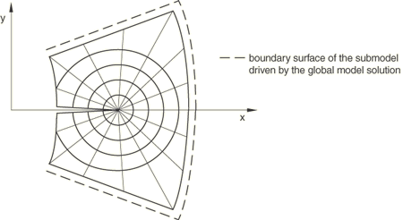
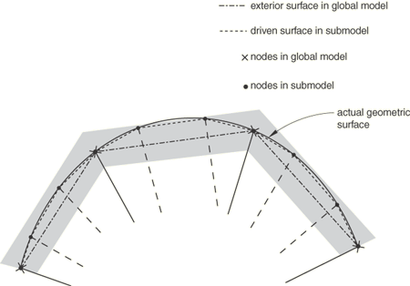

# 10.2.3 Surface-based submodeling


**Products: **Abaqus/Standard  

##### **References**

- ["Submodeling: overview," Section 10.2.1](pt04ch10s02aus60.md)
- [*SUBMODEL](../key/key-link.md#usb-kws-msubmodel)
- [*DSLOAD](../key/key-link.md#usb-kws-hdsload)
- [Chapter 38, "Submodeling," of the Abaqus/CAE User's Guide](../usi/usi-link.md#usi-adv-submodeling)

### Overview

The surface-based submodeling technique:
- may not provide the same level of accuracy as node-based submodeling;
- should be used only when the node-based technique cannot provide adequate results;
- is limited to stress-based solid-to-solid submodeling for general static procedures (see ["Static stress analysis," Section 6.2.2](pt03ch06s02at01.md)) in Abaqus/Standard;
- applies surface tractions to submodel surfaces based on a stress field interpolated from the global model; and
- can be combined with node-based submodeling of displacements (see ["Node-based submodeling," Section 10.2.2](pt04ch10s02aus61.md)).

### Performing a surface-based submodeling analysis

Your submodel analysis is driven, either partly or completely, from the results obtained from a global model analysis. The results from the global model are interpolated onto the surfaces on the appropriate parts of the boundary of the submodel. Thus, the response at the boundary of the local region is defined by the solution for the global model. The driven surfaces and any loads applied to the local region determine the solution in the submodel.

Surface-based submodeling should be used only when the node-based technique cannot provide adequate results. For a comparison of the two submodeling techniques and recommendations for their application, refer to ["Submodeling: overview," Section 10.2.1](pt04ch10s02aus60.md).

### Saving the results from the global model

The results from the global analysis must be saved at all elements required for the interpolation of the driven variables to the boundary surface of the submodel. Only the output database can be used for this purpose.

In each step of the global model whose solution will be used to drive the submodel, write the stress results to the output database (see ["Output to the output database," Section 4.1.3](pt02ch04s01aus40.md)).

| **Input File Usage: ** | Use both of the following options: |
| --- | --- |
|  | ``` [*OUTPUT](../key/key-link.md#usb-kws-houtput), FIELD [*ELEMENT OUTPUT](../key/key-link.md#usb-kws-helementoutput) ``` |

| **Abaqus/CAE Usage: ** | Step module: ****Output****Field Output Requests****Create**** |
| --- | --- |

#### Referring to the global model results from the submodel analysis

You must define the source of the global solution results and provide the name of the output database file; the file extension is optional. If the file extension is omitted, Abaqus will correctly choose the extension if the output database file exists.

| **Input File Usage: ** | **abaqus** **job**=*submodel_input_file* **globalmodel**= `*global_output_database*` |
| --- | --- |

| **Abaqus/CAE Usage: ** | Any module: ****Model****Edit Attributes*****submodel*****: **Submodel**: **Read data from job**: `*global_output_database*` |
| --- | --- |

### Specifying the driven surfaces in the submodel

Specifying the driven element-based surfaces does not activate the driven surface loads: they must be activated by specifying the appropriate submodel distributed surface loads.

All surface facets of the submodel to be driven by stresses in any step must be specified as driven surfaces since the list of surfaces cannot be extended subsequent to its initial definition (even at restart). However, variables at the surfaces given do not have to be driven in all steps: the choice of which surfaces are driven in a particular step is made as part of a submodel distributed surface load definition, as discussed in ["Defining the driven surface tractions in the submodel](pt04ch10s02aus62.md#asubmodelstress-defining),” later in this section.

**Figure 10.2.3–1** The magnified submodel.



| **Input File Usage: ** | ``` [*SUBMODEL](../key/key-link.md#usb-kws-msubmodel) *list of element-based structural surfaces* ``` |
| --- | --- |
|  | The [*SUBMODEL](../key/key-link.md#usb-kws-msubmodel) option must be included in the model definition portion of the input file for the submodel analysis. Multiple [*SUBMODEL](../key/key-link.md#usb-kws-msubmodel) options are allowed; however, in this case you must ensure that the driven surfaces specified on the data line of one option are separate and distinct from the other surfaces specified on the data lines of all the other options. |

| **Abaqus/CAE Usage: ** | Load module: **Create Load**: choose **Other** for the **Category** and **Submodel** for the **Types for Selected Step**: **Driving region**: select region |
| --- | --- |

#### Defining geometric tolerances

A geometric tolerance is used to define how far driven element-based surface nodes in the submodel can lie outside the exterior surface of the global model, as that surface is interpolated in the global, undeformed finite element model. By default, surface nodes in the submodel must lie within a distance calculated by multiplying the average element size in the global model by 0.05.  You can change the tolerance, which is useful in cases where submodel driven surfaces lie to a greater extent outside the global model exterior surface. Tolerances larger than this default value, however, can result in significantly greater computation times and lower accuracy in the driven solution for driven surface regions significantly outside the global model exterior surface.

You can define the geometric tolerance as a fraction of the size of the average element in the global model or as an absolute distance in the length units chosen for the model. If both tolerances are defined, Abaqus uses the tighter tolerance.

| **Input File Usage: ** | Use the following option to define the geometric tolerance as an absolute distance: |
| --- | --- |
|  | ``` [*SUBMODEL](../key/key-link.md#usb-kws-msubmodel), TYPE=SURFACE, ABSOLUTE EXTERIOR TOLERANCE=*tolerance* ``` Use the following option to define the geometric tolerance as a fraction of the size of the average element in the global model: ``` [*SUBMODEL](../key/key-link.md#usb-kws-msubmodel), TYPE=SURFACE, EXTERIOR TOLERANCE=*tolerance* ``` |

| **Abaqus/CAE Usage: ** | Load module: **Create Load** choose **Other** for the **Category** and **Submodel** for the **Types for Selected Step**: select region: **Exterior tolerance: absolute:** or **relative:** *tolerance* |
| --- | --- |

##### The exterior tolerance in solid-to-solid submodeling

The exterior tolerance for a solid-to-solid submodel analysis is indicated by the shaded region in [Figure 10.2.3--2](pt04ch10s02aus62.md#asubmodel-ext-tol-solid-solid-surface). If the distance between the driven surface nodes and the free surface of the global model falls within the specified tolerance, the solution variables from the global model are extrapolated to the submodel.

**Figure 10.2.3–2** The exterior tolerance in surface-based submodeling.



### Defining the driven surface tractions in the submodel

The actual driven surface tractions are defined in any step as submodel distributed surface loads. The stresses resulting in these tractions are “driven variables” obtained from the output database file of the global analysis.

All stress components from the global model elements that will drive the submodel boundary surface must have been written to the output database. They will be used to create traction, shear, and normal stresses at integration points of driven surfaces (as non-uniform distributed surface loads). All applicable stress components are calculated and applied to the surface integration points at each time increment.

| **Input File Usage: ** | ``` [*DSLOAD](../key/key-link.md#usb-kws-hdsload), SUBMODEL ``` |
| --- | --- |

| **Abaqus/CAE Usage: ** | Load module: **Create load**: choose **Other** for the **Category** and **Submodel** for the **Types for Selected Step** |
| --- | --- |

#### Specifying the step number from the global analysis

You specify the step of the global model history that is to be used for the driven variables in the current submodel analysis step.

| **Input File Usage: ** | ``` [*DSLOAD](../key/key-link.md#usb-kws-hdsload), SUBMODEL, STEP=*step* ``` |
| --- | --- |

| **Abaqus/CAE Usage: ** | Load module: **Create load**: choose **Other** for the **Category** and **Submodel** for the **Types for Selected Step**: select region: **Global step number:** *step* |
| --- | --- |

#### Modifying the set of driven surface tractions

You can modify the submodel distributed surface load definitions from step to step to change the global step reference, you can remove surface load definitions, and you can reintroduce them later (see ["Applying loads: overview," Section 34.4.1](pt07ch34s04aus120.md)). New surfaces cannot be added to the total set of driven surface defined for the submodel; this set of driven surfaces is a fixed part of the model definition.

| **Input File Usage: ** | Use one of the following options: |
| --- | --- |
|  | ``` [*DSLOAD](../key/key-link.md#usb-kws-hdsload), SUBMODEL, OP=MOD [*DSLOAD](../key/key-link.md#usb-kws-hdsload), SUBMODEL, OP=NEW ``` |

### Guidelines for obtaining adequate solution accuracy

Unlike node-based submodeling, surface-based submodeling can in many cases provide incorrect or misleading submodel results. This risk follows from the methods used to interpolate stresses from the global model to the submodel:
- The global model material point stresses are smoothed and associated with the global model nodes.
- These global model node-located stresses are then interpolated to the submodel surface integration points and applied as tractions.

This process is generally nonconservative, resulting in a submodel traction field that is not equivalent to the global model stress field in an equilibrium sense.

#### Modeling guidelines

You can improve accuracy and achieve reasonable submodel solutions by observing the following guidelines:
- Design your models so that your submodel surface intersects the global model in regions of relatively low stress gradients.
- Design your models so that your submodel surface intersects the global model in regions of uniform element size. A warning message is provided in the data (`.dat`) file in cases where significant nonuniform element size distributions are seen.

#### Checking your results

To understand whether your modeling approach results in a reasonably accurate solution, the following guidelines are recommended:
- Compare the stress distributions on the submodel-driven surfaces with the stress distributions in the global model. You can view the stress distributions in the global model by using tools such as cutting planes and path plots in the Visualization module of Abaqus/CAE. The degree to which the global model's stress distributions agree with those in the submodel-driven surface is generally an indication of the level of accuracy of your submodel solution.
- When using inertia relief in the submodel for cases where submodeling does not remove all rigid body modes, compare the inertia relief forces to the prevailing force level in your submodel. If the inertia relief force is large compared to the prevailing force level, your submodel results may be inaccurate.

### Special considerations

There are several special considerations that are worth noting.

#### Handling of rigid-body modes

When you use surface-based submodeling exclusively to drive your submodel response, your displacement solution will not be unique; you will generally encounter rigid-body modes and accompanying numerical issues. You can address these rigid-body modes by
- providing sufficient node-based submodel displacement boundary condition definitions in the submodel analysis,
- providing sufficient boundary condition definitions in the submodel analysis, or
- providing an inertia relief load definition in the submodel analysis (see ["Inertia relief," Section 11.1.1](pt04ch11s01at37.md)).

You can combine these definitions, as necessary and appropriate to your model, to address all rigid body modes.

#### Cases of finite rotation

Global model stress results are stored in the output database in the global coordinate system. Submodel tractions are calculated from these stresses and the current configuration surface normal in the submodel. Hence, when your global model result involves significant finite rotation, your submodel results will generally be inaccurate unless you provide sufficient node-based submodel displacement boundary condition definitions to impart similar rigid-body rotations to the submodel; exclusive use of surface-based submodeling definitions is not adequate to provide these rigid-body motions. You may also experience convergence difficulties in the submodel when it is not properly rotated.

#### Inelastic behavior

When surface-based submodeling is used to drive a submodel region with an inelastic material definition, you may encounter rigid-body modes and accompanying numerical issues. For example, numerical issues will prevent convergence if the submodel material definition includes plasticity and the submodel loading results in a shear band formation beyond the material hardening definition, such that unconstrained motion can occur (i.e., if the submodel loads exceed the limit load capacity). In these cases node-based submodeling should be used. 

### Procedures

Only the static procedure is allowed. Both general (possibly nonlinear) and linear perturbation steps can be used in submodeling (see ["General and linear perturbation procedures," Section 6.1.3](pt03ch06s01aus44.md), for a discussion of general and linear perturbation steps).

#### Obtaining a solution at a particular point in time using linear perturbation analysis

In Abaqus/Standard it is possible to study the submodel's linearized response corresponding to a particular point in time in the global solution by using a static, linear perturbation procedure in the submodel analysis. You can select the increment in the global analysis step that is to be used as the basis for calculating the values for the driven variables. If you do not select an increment in a static linear perturbation step, the last increment of the selected step in the global analysis is used as the basis for calculating the values for the driven variables. You cannot select an increment in a general submodel step.

| **Input File Usage: ** | ``` [*DSLOAD](../key/key-link.md#usb-kws-hdsload), SUBMODEL, STEP=*step*, INC=*increment* ``` |
| --- | --- |

| **Abaqus/CAE Usage: ** | Selection of a specific global model increment is not supported in Abaqus/CAE. |
| --- | --- |

#### Mixing general and linear perturbation steps

It is possible to mix general steps and linear perturbation steps in both the global and the submodel analyses. Abaqus allows general analysis steps to be treated as linear perturbation steps during submodeling, and vice versa.

##### Example: Submodeling with general and linear perturbation steps

For an example of submodeling that uses both general and linear perturbation steps, consider the following situation. The global analysis consists of a static preload—done as a general, nonlinear, analysis step—followed by extraction of the eigenmodes of the preloaded structure, then a step of 5 seconds of modal dynamic response analysis:

```
[*STEP](../key/key-link.md#usb-kws-hstep)
** Apply preload
[*STATIC](../key/key-link.md#usb-kws-hstatic)
 0.1, 1.0
…
** Write out stress results for elements needed to
** interpolate to the submodel's surfaces
[*ELEMENT OUTPUT](../key/key-link.md#usb-kws-helementoutput), ELSET=DETAIL
 S
[*END STEP](../key/key-link.md#usb-kws-hendstep)
[*STEP](../key/key-link.md#usb-kws-hstep)
** Calculate modes and frequencies
[*FREQUENCY](../key/key-link.md#usb-kws-hfrequency)
…
** The [*ELEMENT OUTPUT](../key/key-link.md#usb-kws-helementoutput) option is repeated because
** this is the first linear perturbation step
[*ELEMENT OUTPUT](../key/key-link.md#usb-kws-helementoutput), ELSET=DETAIL
 U
[*END STEP](../key/key-link.md#usb-kws-hendstep)
[*STEP](../key/key-link.md#usb-kws-hstep)
** Dynamic response of preloaded system
[*MODAL DYNAMIC](../key/key-link.md#usb-kws-hmodaldyn)
 0.01, 5.0
…
[*END STEP](../key/key-link.md#usb-kws-hendstep)
```

We wish to study the local, possibly nonlinear, response of a part of this model that is so small that we do not need to model dynamic effects locally and can, thus, perform two steps of static analysis:
```
** Define submodel surfaces (driven surfaces)
[*SUBMODEL](../key/key-link.md#usb-kws-msubmodel),TYPE=SURFACE
PERIM
[*STEP](../key/key-link.md#usb-kws-hstep)
** Preload
[*STATIC](../key/key-link.md#usb-kws-hstatic)
 0.1, 1.0
[*DSLOAD](../key/key-link.md#usb-kws-hdsload), SUBMODEL, STEP=1
…
[*END STEP](../key/key-link.md#usb-kws-hendstep)
[*STEP](../key/key-link.md#usb-kws-hstep)
** Local static response to global dynamic step
[*STATIC](../key/key-link.md#usb-kws-hstatic)
 0.01, 5.0
[*DSLOAD](../key/key-link.md#usb-kws-hdsload), SUBMODEL, STEP=3
…
[*END STEP](../key/key-link.md#usb-kws-hendstep)
```

It is perfectly acceptable that the submodel analysis requests general, possibly nonlinear, analysis for both steps, while in the global analysis the dynamic step was a linear perturbation step (modal dynamics is always a linear perturbation analysis). It is your responsibility to judge that this use of the submodeling feature is reasonable. For example, suppose that the global analysis were continued with a fourth step of general, nonlinear static response:
```
[*RESTART](../key/key-link.md#usb-kws-mrestart), READ, STEP=3
** Read state at end of initial preload
** (could equally well use [*RESTART](../key/key-link.md#usb-kws-mrestart), READ, STEP=1)
[*STEP](../key/key-link.md#usb-kws-hstep)
** Add more preload
[*STATIC](../key/key-link.md#usb-kws-hstatic)
 0.2, 1.0
…
[*END STEP](../key/key-link.md#usb-kws-hendstep)
```

This fourth general analysis step starts with the state at the end of general analysis Step 1 because the frequency extraction and the modal dynamic steps are both linear perturbation steps. However, if we restart the submodel analysis in the same way, the solution may not be comparable with the global model solution: 
```
[*RESTART](../key/key-link.md#usb-kws-mrestart), READ, STEP=2
** Read state at end of step 2
[*STEP](../key/key-link.md#usb-kws-hstep)
** Add more preload
[*STATIC](../key/key-link.md#usb-kws-hstatic)
 0.2, 1.0
[*DSLOAD](../key/key-link.md#usb-kws-hdsload), SUBMODEL, STEP=4
…
[*END STEP](../key/key-link.md#usb-kws-hendstep)
```

The second step in the submodel is a general analysis step, to which the response may be nonlinear, thus changing the state of the model. A valid alternative would be to apply the Step 4 response to the submodel immediately after the first step:
```
[*RESTART](../key/key-link.md#usb-kws-mrestart), READ, STEP=1
** Read state at end of preload step
[*STEP](../key/key-link.md#usb-kws-hstep)
** Add more preload
[*STATIC](../key/key-link.md#usb-kws-hstatic)
 0.2, 1.0
[*DSLOAD](../key/key-link.md#usb-kws-hdsload), SUBMODEL, STEP=4
…
[*END STEP](../key/key-link.md#usb-kws-hendstep)
```

### Loads

Any loads that are applied in the submodel region of the global analysis must be imposed in the submodel analysis in the usual way. It is your responsibility to apply such loads to the submodel correctly so that they correspond to the loading of the global model. See ["Applying loads: overview," Section 34.4.1](pt07ch34s04aus120.md), for an overview of the loads available in Abaqus.

### Output

Any of the output normally available within a particular procedure is also available during a submodeling analysis (see ["Abaqus/Standard output variable identifiers," Section 4.2.1](pt02ch04s02abv01.md), and ["Abaqus/Explicit output variable identifiers," Section 4.2.2](pt02ch04s02xbv01.md)).

As described above, element stress output requests to the output database file must be used in the global analysis to save the values of the driven variables at the submodel boundary.

### Input file template

#### Global analysis:

```
[*HEADING](../key/key-link.md#usb-kws-mheading)
…
[*STEP](../key/key-link.md#usb-kws-hstep)
Step 1
[*STATIC](../key/key-link.md#usb-kws-hstatic) (*or* [*STATIC](../key/key-link.md#usb-kws-hstatic), *etc.*)
*Data line to define step time and control incrementation*
…
[*ELEMENT OUTPUT](../key/key-link.md#usb-kws-helementoutput)
S
[*OUTPUT](../key/key-link.md#usb-kws-houtput), FIELD
[*ELEMENT OUTPUT](../key/key-link.md#usb-kws-helementoutput)
S
[*END STEP](../key/key-link.md#usb-kws-hendstep)
```

#### Submodel analysis:

```
[*HEADING](../key/key-link.md#usb-kws-mheading)
…
[*SUBMODEL](../key/key-link.md#usb-kws-msubmodel),TYPE=SURFACE, EXTERIOR TOLERANCE=*tolerance*
*List of all surfaces to be driven*
**
[*STEP](../key/key-link.md#usb-kws-hstep)
[*STATIC](../key/key-link.md#usb-kws-hstatic) (*or any other allowable procedure*)
*Data line to define step time and control incrementation.*
…[*DSLOAD](../key/key-link.md#usb-kws-hdsload), SUBMODEL, STEP=1
*Data lines listing surfaces to be driven in this step*
…
[*END STEP](../key/key-link.md#usb-kws-hendstep)
```


