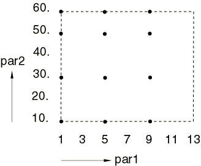
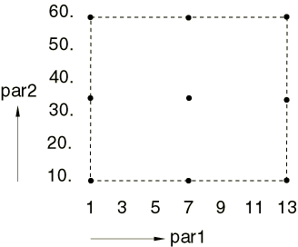
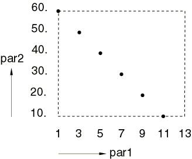
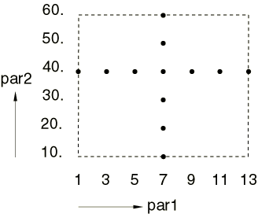

# 20.1.1 Scripting parametric studies


**Products: **Abaqus/Standard  Abaqus/Explicit  

##### **References**

- ["Parametric input," Section 1.4.1](pt01ch01s04aus04.md)
- ["Parametric shape variation," Section 2.1.2](pt01ch02s01aus06.md)
- ["Parametric studies," Section 3.2.10](pt01ch03s02abx10.md)

### Overview

Parametric studies allow you to generate, execute, and gather the results of multiple analyses that differ only in the values of some of the parameters used in place of input quantities.

Parametric studies can be performed by: 
- Creating a "template" parametrized input file from which the different parametric variations are generated.
- Preparing a script (a file with the `.psf` extension) that contains Python ([Lutz, 1996](pt04ch20s01aus108.md#usb-ref-lutz2)) instructions to generate, execute, and gather output for the parametric variations of the parametrized input file.

The Python commands for scripting parametric studies are discussed in this section.

### Introduction

Parametric studies require that multiple analyses be performed to provide information about the behavior of a structure or component at different design points in a design space. The inputs for these analyses differ only in the values assigned to the parameters of a parametrized keyword input file (identified with the `.inp` extension).

Parametric studies in Abaqus require a user-developed Python script in a file (identified with the `.psf` extension) that contains Python commands to define the parametric study. For example, consider a case where you wish to perform a parametric study in which the thickness of a shell is varied. You need to create a parametrized input file (in this example, a file named `shell.inp`) containing the parameter definition

```
[*PARAMETER](../key/key-link.md#usb-kws-mparameter)
thick1 = 5.
```

 and the parameter usage:
```
[*SHELL SECTION](../key/key-link.md#usb-kws-mshellsection),ELSET=*name*, MATERIAL=*name*
<thick1>
```

You create the parametric study by developing a `.psf` file that contains a script of Python instructions specifying the different designs that are to be analyzed, as follows: 
```
**thick = ParStudy**(**par**='thick1', **name**='shell') 
**thick.define**(CONTINUOUS, **par**='thick1', **domain**=(10., 20.)) 
**thick.sample**(NUMBER, **par**='thick1', **number**=5) 
**thick.combine**(MESH)
```

These scripting commands create five designs with corresponding section thicknesses of 10., 12.5, 15., 17.5, and 20.0. Each of these thicknesses will, in turn, replace the value of 5. specified in the parameter definition in `shell.inp`. You may then provide additional Python scripting commands in the `.psf` file instructing Abaqus to do the following:- Generate a number of `shell_*id*.inp` files and corresponding Abaqus jobs using the `shell.inp` file as a template. (The identifier *id* that is appended to the input file name is unique to each design in the parametric study.) An example of the Python command for this is ``` **thick.generate**(**template**='shell') ``` In this example the `shell_*id*.inp` files will differ only in the value to be used for the shell thickness.
- Execute all the Abaqus jobs representing the different variations of the parametric study. The Python command for this is ``` **thick.execute**(ALL) ```

You generally want to review certain key results from the large amount of data that is generated by a parametric study. Abaqus provides the following capabilities for this purpose: 
- A command specifying the source from which the results of a parametric study will be gathered. For example: ``` **thick.output**(**file**=ODB, **step**=1, **inc**=LAST) ``` The command above sets the output location to the last frame of the first step in the output database (`.odb`) file. The default behavior is to gather results from the last frame of a given step in the results (`.fil`) file.
- Commands to gather the required results from the multiple analyses generated by the parametric study and report them in a file or table. For example, the sequence of Python scripting commands used to gather and report the value of a displacement at a key node for each of the designs is: ``` **thick.gather**(**results**='n33_u', **variable**='U', **node**=33, **step**=1) **thick.report**(PRINT, **par**='thick1', **results**=('n33_u.2')) ``` The commands above gather the results record `'n33_u'` (the displacement vector of node 33 at the end of Step 1 of the analysis) for each of the designs and then print a table of the U2 component (the second component of the results record) of displacement for all designs.
- The ability to visualize *X--Y* plot data gathered across multiple analyses using the Visualization module of Abaqus/CAE. A typical example is to obtain an *X--Y* plot of the value of the displacement at a key node versus the value of the shell thickness. This is done by gathering the appropriate parametric study results in an ASCII file that can be read into the Visualization module to display the plot.

### Organization of parametric studies

A parametric study in Abaqus is associated with a particular set of parameters that define the design space. Only the values of the parameters can change in a parametric study. A new parametric study must be created if you wish to consider a different set of parameters. Having selected the parameters to be considered in a parametric study, you must specify how each parameter is defined. Parameters are distinguished as either continuous or discrete in nature and may have a domain and reference value.

The design points in the design space that are to be analyzed are created by specifying sample values for each parameter (sampling) and by combining the parameter samples to create sets of design points. A few simple commands are provided for parameter value sampling and for combining the sampled parameter values; these commands are described in detail later.

An initial definition and sampling of the parameters in the parametric study must be given before any combinations of parameter samples can be specified. After the first combination the initial definition and/or sampling of any individual parameter can be changed before the next combination is specified, thus providing a great deal of flexibility within one parametric study.

The domain of possible values and the reference value for a parameter given in the parameter definition can be temporarily redefined in any sampling of that parameter by specifying them differently during the sampling. You need not specify the parameter domain and reference value in the parameter definition so long as these are specified during sampling.

Design constraints can be imposed on all of the designs. A design that violates any of the constraints will be eliminated.

Finally, after all parametric study variations have been analyzed, you can gather and report results across all or some of the designs of the parametric study.

In summary, parametric studies in Abaqus are organized as follows:
- Create parametric study.
- Define parameters: define parameter type (continuous or discrete valued) and possibly the parameter domain and reference value.
- Sample parameters: specify sampling option and data and possibly temporarily redefine the parameter domain and reference value.
- Combine parameter samples to create sets of designs.
- Constrain designs (optional).
- Generate designs and analysis job data.
- Execute the analysis jobs for selected designs of the study.
- Gather key results for selected designs of the study.
- Report gathered results.

**Note:**The sequence of steps—define, sample, and combine—can be repeated as often as is necessary to create all the required design sets. Multiple parametric studies can be performed on a model contained in one input file. In general, more parameters will be defined and used in place of input quantities in the input file than those involved in any particular parametric study. In these cases parameters not involved in a particular parametric study will retain their values defined in the input file for the purposes of that parametric study. Therefore, we can think of the parameter values defined in the input file as representing a nominal design; parametric studies create modified designs by overwriting the values of some (or all) parameters.

### Defining the design space

The design space is defined by the selection of the parameters to be varied in the study as well as the specification of the parameter types and possible values they can have.

#### Parametric study creation

Use the ***aStudy*=ParStudy** scripting command (see ["Create a parametric study.," Section 20.2.8](pt04ch20s02asr08.md)) to create a parametric study and select the independent parameters to be considered for variation. ***aStudy*** is the Python variable name assigned by you to the parametric study object created by the command. The methods of the parametric study object are used to carry out all the actions of the parametric study.

| **Input File Usage: ** | ``` ***aStudy*=ParStudy** (**par**=, **name**=, **verbose**=, **directory**=) ``` |
| --- | --- |

#### Parameter definition

Use the ***aStudy*.define** command (see ["Define parameters for parametric studies.," Section 20.2.3](pt04ch20s02asr03.md)) to specify the parameter type (choose the CONTINUOUS or the DISCRETE token; a token is a symbolic constant used to select an option within a specific command) and, optionally, to specify the domain of possible parameter values and a reference value for the parameter. If the domain and/or reference value are not specified in this command, they can be specified in the parameter sampling.

Redefinitions of a parameter are treated as complete redefinitions; that is, no information is retained from the previous definition of that parameter.

| **Input File Usage: ** | ``` ***aStudy*.define** (*token*, **par**=, **domain**=, **reference**=) ``` |
| --- | --- |

##### CONTINUOUS parameter type

In this case the parameter can take any value in a continuous domain specified by minimum and maximum values; for example, **domain**=(3., 10.).

##### DISCRETE parameter type

In this case the parameter can take only the values specified in a list that defines the discrete domain; for example, **domain**=(1, 4, 9, 16).

### Sampling and combining parameter values to create sets of design points

Each parameter in the parametric study must be sampled before the combination operation is used to create the first set of design points. Any parameter in the parametric study can be redefined or resampled before a subsequent combination operation is performed.

#### Parameter sampling

Use the ***aStudy*.sample** command (see ["Sample parameters for parametric studies.," Section 20.2.10](pt04ch20s02asr10.md)) and choose one of the available tokens (INTERVAL, NUMBER, REFERENCE, or VALUES) to select how the sampling is done. The sampling data that must be given depend on how the sampling is done, as described next.

##### Sampling by INTERVAL

This sampling command assumes that you specify a domain of possible parameter values and wish to sample parameter values at fixed intervals in the domain. Sampling of the extreme values of the parameter is always done. The number of parameter values sampled depends on the interval and the domain. Because the extreme values are sampled, the last sampling interval will generally be smaller than the interval you specify.

The domain specification in this sampling command is optional: 
- If a domain is specified in this command, it temporarily redefines a domain specified in the **define** command.
- If a domain is not specified in this command, the domain specification from the **define** command is used for sampling.
- An error is flagged when a domain is not specified in this command or in the **define** command.

The sampling interval is interpreted differently for continuous and discrete parameters: - For continuously valued parameters the interval at which the samples are spaced is based on a numerical value. For example, specifying **interval**=10. for a continuous parameter with **domain**=(10., 35.) will sample values of 10., 20., 30., and 35. for this parameter.
- For discrete valued parameters the interval at which the samples are spaced is based on the index of the list of values. The index means the position of the entry in the list, starting at position 0 and continuing with positions 1, 2, 3, etc. In this case **interval** must be an integer number. For example, specifying **interval**=2 for a discrete parameter with **domain**=(1., 2., 3., 5., 7., 10.) will create sample values of 10., 5., 2., and 1. for this parameter.

The interval can have a positive or negative value (zero is not permitted). A positive interval indicates that sampling starts at the minimum value for a continuous parameter or at the first value in the list of values for a discrete parameter (forward sampling). A negative interval indicates that sampling starts at the maximum value for a continuous parameter or at the last value in the list of values for a discrete parameter (reverse sampling). Reverse sampling is useful when the TUPLE combination operation is used (see the discussion of combination of parameter samples).

Two special cases of the INTERVAL option are noteworthy: 
- A positive interval value larger than the range of continuous parameter values or the number of discrete parameter values will sample the minimum and maximum values of the continuous parameter or the first and last values in the discrete parameter list.
- A negative interval value larger (in absolute terms) than the range of continuous parameter values or the number of discrete parameter values will sample the maximum and minimum values of the continuous parameter or the last and first values in the discrete parameter list.

| **Input File Usage: ** | ``` ***aStudy*.sample** (INTERVAL, **par**=, **interval**=, **domain**=) ``` |
| --- | --- |

##### Sampling by NUMBER

This sampling option assumes that you specify a domain of possible parameter values and wish to sample a fixed number of parameter values in the domain. Except for a special case documented below, sampling of the extreme values of the parameter is always done. The parameter is sampled at equally spaced intervals (with some exceptions for discrete parameters, as discussed below) and the size of the interval depends on the number of values sampled as well as the domain.

The domain specification in this sampling command is optional: 
- If a domain is specified in this command, it temporarily redefines the domain specified in the **define** command.
- If a domain is not specified in this command, the domain specification from the **define** command is used for sampling.
- An error is flagged when a domain is not specified in this command or in the **define** command.

The sampling interval is calculated and interpreted differently for continuous and discrete parameters: - For continuous valued parameters the interval at which the samples are spaced is based on a numerical value. For example, specifying **number**=4 for a continuous parameter with **domain**=(10., 25.) will sample values of 10., 15., 20., and 25. for this parameter.
- For discrete valued parameters the interval at which the samples are spaced is based on the index of the list of values (indexing starts at zero). For example, specifying **number**=3 for a discrete parameter with **domain**=(1., 2., 3., 5., 7., 10., 12.) will create sample values of 1., 5., and 12.for this parameter. The number of discrete parameter samples specified by you may not allow equally spaced sampling; for example, specifying **number**=5 or **number**=6 for the discrete parameter above does not allow equally spaced sampling. This is resolved by sampling the parameter values that are closest to being equally spaced by rounding the sampling index to the closest index in the list of values. For example, specifying **number**=5 for the discrete parameter above will create sample values of 1., 3., 5., 10., and 12. The values 1. and 12. are sampled because they are the extreme values. The explanation for the second sampled value being the third value in the list (the value 3.) is as follows: the sampling interval is (highest index lowest index)/(**number** 1) = (6 0)/(5 1) = 1.5; the second sampled value should then be the one with index = 0 + 1.5 = 1.5 in the list; since the index has to be an integer number, we round off to index = 2 and, thus, sample the third value in the list. The other sampled values can be explained similarly. The same rule is used for character string type discrete parameters. For example, specifying **number**=3 for a discrete parameter with **domain**=('C3D8', 'C3D8R', 'C3D8I', 'C3D8H') will create sample values of 'C3D8', 'C3D8I', and 'C3D8H'.

Three special cases of the NUMBER option are noteworthy:
- Specifying **number**=1 will sample the central value of a parameter, which is useful when the center of the design space is of interest. It is the only case in which the use of the NUMBER option does not sample the extreme values of the parameter.
- Specifying **number**=2 will sample the extreme values of a parameter, which is useful when the boundaries of the design space are of interest.
- Specifying **number**=3 will sample the central and the extreme values of a parameter, which is useful when the center and the boundaries of the design space are of interest.

Specification of **number**=0 is not permitted. A negative value for **number** is permitted; this indicates that the sampling is to be in reverse order. For continuous parameters reverse order means that the first sampled value is the largest and the last sampled value is the smallest. For discrete parameters reverse order means that the first sampled value is the last in the list of values and the last sampled value is the first in the list of values. Sampling in reverse order is useful when the TUPLE combination operation is used (see the discussion of combination of parameter samples).

| **Input File Usage: ** | ``` ***aStudy*.sample** (NUMBER, **par**=, **number**=, **domain**=) ``` |
| --- | --- |

##### Sampling by REFERENCE

This sampling option allows you to specify a reference value for the parameter and to sample parameter values with respect to this reference value. It is useful for studying alternate designs with respect to an existing (reference) design.

This sampling command creates sample values symmetrically about the reference value at multiples of a given interval; in addition, the reference value is also sampled. The number of parameter values in the sample depends on the number of symmetrical pairs of values you specify.

The reference value specification in this sampling option is optional: 
- If a reference value is specified in this command, it temporarily redefines the reference specified in the **define** command.
- If a reference value is not specified in this command, the reference specification from the **define** command is used for sampling.
- An error is flagged when a reference value is not specified in this command or in the **define** command.

The reference value is interpreted differently for continuous and discrete parameters: - For continuous valued parameters **reference** is the parameter's numerical value about which a symmetrical sample will be created.
- For discrete valued parameters **reference** is the index of the list of values about which a symmetrical sample will be created.

A reference value that falls outside the domain definition for the parameter is flagged as an error.

The sampling interval is interpreted differently for continuous and discrete parameters: 
- For continuous valued parameters the interval at which the samples are taken is based on a numerical value. For example, specifying **reference**=50., **interval**=10., and **numSymPairs**=2 for a continuous parameter will create sample values of 30., 40., 50., 60., and 70. for this parameter.
- For discrete valued parameters the interval at which the samples are spaced is based on the index of the list of values (indexing starts at zero); in this case **interval** must be an integer value. For example, specifying **reference**=5, **interval**=2 and **numSymPairs**=2 for a discrete parameter with **domain**=[1, 2, 3, 5, 7, 10, 12, 15, 20, 25] will create sample values of 25, 15, 10, 5, and 2 for this parameter.

The specified **interval** can have a positive or negative value, but a value of zero is not permitted. A positive interval indicates that the list of sampled values starts with the smallest sampled value for a continuous parameter or with the sampled value closest to the beginning of the list of values for a discrete parameter (forward sampling). A negative interval indicates that the list of sampled values starts with the largest sampled value for a continuous parameter or with the sampled value closest to the end of the list of values for a discrete parameter (reverse sampling). Reverse sampling is useful when the TUPLE combination operation is used (see the discussion on combination of parameter samples).

The number of symmetrical pairs you specify must be zero or a positive integer; setting the number of symmetrical pairs equal to zero indicates that only the reference value is sampled.

The domain specification in this command is optional: 
- If a domain is specified in this command, it temporarily redefines the domain specified in the **define** command.
- If a domain is not specified in this command, the domain specification from the **define** command is used for sampling.
- An error is flagged in the case of discrete valued parameters when a domain is not specified in this command or in the **define** command.

A domain specification (either in this command or in the **define** command) is required for discrete valued parameters because the possible discrete values that can be sampled must be known. Although a domain specification is not required for continuous valued parameters, it may be given. In either the case of discrete parameters or the case of continuous parameters, a domain specification can be used to limit the number of values sampled using the REFERENCE option since the domain is treated as a bound on the possible sampling values. For example, specifying **reference**=50., **interval**=10., and **numSymPairs**=3 for a continuous parameter with **domain**=(35., 100.) will sample values of 40., 50., 60., 70., and 80. for this parameter. The minimum value of the domain acts as a bound in this sampling.

| **Input File Usage: ** | ``` ***aStudy*.sample** (REFERENCE, **par**=, **reference**=, **interval**=, **numSymPairs**=, **domain**=) ``` |
| --- | --- |

##### Sampling by VALUES

This sampling option assumes that you wish to create the parameter sample values directly. You must specify the actual parameter values, irrespective of whether the parameter is continuous or discrete.

A parameter domain specified in the **define** command does not affect the values sampled for the parameter when this option is used.

| **Input File Usage: ** | ``` ***aStudy*.sample** (VALUES, **par**=, **values**=) ``` |
| --- | --- |

#### Combination of parameter samples

Use the ***aStudy*.combine** command (see ["Combine parameter samples for parametric studies.," Section 20.2.1](pt04ch20s02asr01.md)) to create sets of design points from the parameter samples. Choose how the combining is done using one of the following tokens: MESH, TUPLE, or CROSS. The use of each combination command results in the creation of a number of design points, which are grouped into design sets. If a combine operation creates a design that duplicates a design in an existing design set, the duplicate design is deleted immediately. The total number of designs in a parametric study (before the application of any design constraints) is the sum of the number of designs in each design set.

You can name a design set; if you do not, it is named by default. The default naming convention is *p1* for the first non-user-named design set in the parametric study, *p2* for the second non-user-named design set, and so on. The design set name is used to help identify individual designs. A design set named by you with a name identical to a previously specified design set name indicates that it is a respecification of the design set and, thus, overwrites the previously existing one.

| **Input File Usage: ** | ``` ***aStudy*.combine** (*token*, **name**=) ``` |
| --- | --- |

##### MESH combination

This combine option indicates that every sampled value for a parameter is to be combined with every sampled value of every other parameter in the parametric study.

The following examples illustrate the use of the MESH combine option. In a two-parameter study with the parameters defined and sampled as 

```
**study=ParStudy**(**par**=('par1', 'par2')) 
**study.define**(DISCRETE, **par**='par1', 
    **domain**=(1, 3, 5, 7, 9, 11, 13)) 
**study.sample**(REFERENCE, **par**='par1', **reference**=0,
    **interval**=2, **numSymPairs**=2)
**study.define**(CONTINUOUS, **par**='par2', **domain**=(10., 60.)) 
**study.sample**(INTERVAL, **par**='par2', **interval**=20.)
```

 the combine command
```
**study.combine**(MESH, **name**='dSet1')
```

creates the following 12 design points (`par1`, `par2`): (1, 10.), (5, 10.), (9, 10.), (1, 30.), (5, 30.), (9, 30.), (1, 50.), (5, 50.), (9, 50.), (1, 60.), (5, 60.), and (9, 60.) (see [Figure 20.1.1--1](pt04ch20s01aus108.md#iparstudies-mesh1)).

**Figure 20.1.1–1** Design points in design set `dSet1` created with the MESH option of the combine command.



 A second use of the combine command preceded by a respecification of the parameter sampling 

```
**study.sample**(NUMBER, **par**='par1', **number**=3) 
**study.sample**(NUMBER, **par**='par2', **number**=3) 
**study.combine**(MESH, **name**='dSet2')
```

creates designs at the following nine points: (1, 10.), (7, 10.), (13, 10.), (1, 35.), (7, 35.), (13, 35.), (1, 60.), (7, 60.), and (13, 60.) (see [Figure 20.1.1--2](pt04ch20s01aus108.md#iparstudies-mesh2)). The extreme and center values of both parameters are combined.

**Figure 20.1.1–2**  Design points in design set `dSet2` created with the MESH option of the combine command after the parameter sampling is redefined.



##### TUPLE combination

This combine option creates design sets consisting of *n*-tuples of the sampled parameter values, where *n* is the number of parameters in the parametric study. Each *n*-tuple consists of one sampled value for each parameter. For example, in a three-parameter study the first sampled value of each of the three parameters makes up the first 3-tuple, the second sampled value of each of the three parameters makes up the second 3-tuple, and so on. The creation of tuples ceases when any of the parameter samples runs out of sampled values.

The following examples illustrate the use of the TUPLE combination operation. For a two-parameter study with the parameters defined and sampled as 

```
**study=ParStudy**(**par**=('par1', 'par2')) 
**study.define**(DISCRETE, **par**='par1', 
    **domain**=(1, 3, 5, 7, 9, 11, 13)) 
**study.define**(CONTINUOUS, **par**='par2', **domain**=(10., 60.)) 
**study.sample**(INTERVAL, **par**='par1', **interval**=1) 
**study.sample**(INTERVAL, **par**='par2', **interval**=10.)
```

 the combination operation 
```
**study.combine**(TUPLE, **name**='dSet3')
```

 creates designs at the following 6 points: (1, 10.), (3, 20.), (5, 30.), (7, 40.), (9, 50.), and (11, 60.) (see [Figure 20.1.1--3](pt04ch20s01aus108.md#iparstudies-tuple1)). This represents a diagonal pattern in the two-parameter space. We see that all `par2` values are used in the tuple combination but the last `par1` value is not used because there are no more `par2` sample values to form additional tuples.

**Figure 20.1.1–3** Design points in design set `dSet3` created with the TUPLE option of the combine command.


A second invocation of the above combine command after respecifying the `par2` sampling as

```
**study.sample**(INTERVAL, **par**='par2', **interval**=-10.) 
**study.combine**(TUPLE, **name**='dSet4')
```

 creates designs at the following 6 points: (1, 60.), (3, 50.), (5, 40.), (7, 30.), (9, 20.), and (11, 10.) (see [Figure 20.1.1--4](pt04ch20s01aus108.md#iparstudies-tuple2)). This represents the other diagonal in the two-parameter space.

**Figure 20.1.1–4** Design points in design set `dSet4` created with the TUPLE option of the combine command after the parameter sampling is redefined.



##### CROSS combination

This combine option creates designs in the form of “cross-shaped” patterns as follows: each value sampled for an individual parameter is combined with the reference value, as specified in the **define** command, of all the other parameters used in the parametric study. To use the CROSS combine option, it is necessary to specify a reference value in the **define** command for all parameters in the parametric study. 

The reference value specified for a parameter in the **define** command does not have to coincide with a value sampled by that parameter's sampling rule. However, if the reference value does not coincide with a sampled value, the reference parameter value is not added to the list of sampled values for that parameter; it is used only to form the CROSS combination.

The following examples illustrate the use of the CROSS combine option. For a two-parameter study with the parameters defined and sampled as 

```
**study=ParStudy**(**par**=('par1', 'par2')) 
**study.define**(DISCRETE, **par**='par1', 
    **domain**=(1, 3, 5, 7, 9, 11, 13), reference=3) 
**study.define**(CONTINUOUS, **par**='par2', 
    **domain**=(10., 60.), reference=40.) 
**study.sample**(REFERENCE, **par**='par1', **interval**=1,
    **numSymPairs**=3) 
**study.sample**(INTERVAL, **par**='par2', **interval**=10.)
```

 the combine cross option
```
**study.combine**(CROSS, name='dSet5')
```

creates designs at the following 12 points: (1, 40.), (3, 40.), (5, 40.), (7, 40.), (9, 40.), (11, 40.), (13, 40.), (7, 10.), (7, 20.), (7, 30.), (7, 50.), and (7, 60.) (see [Figure 20.1.1--5](pt04ch20s01aus108.md#iparstudies-cross1)). This combination is a cross-shaped pattern where the cross intersection is at (7, 40.) as specified [7 is the fourth value (**reference**=3) of the discrete parameter `par1`].

**Figure 20.1.1–5** Design points in design set `dSet5` created with the CROSS option of the combine command.



A second invocation of the above combine command after respecifying `par2` as 

```
**study.define**(CONTINUOUS, **par**='par2', **domain**=(10., 60.),
    **reference**=45.) 
**study.combine**(CROSS, **name**='dSet6')
```

creates designs at the following 13 design points: (1, 45.), (3, 45.), (5, 45.), (7, 45.), (9, 45.), (11, 45.), (13, 45.), (7, 10.), (7, 20.), (7, 30.), (7, 40.), (7, 50.), and (7, 60.) (see [Figure 20.1.1--6](pt04ch20s01aus108.md#iparstudies-cross2)).

#### Constraining designs

A constraint that determines the allowable design points in the parametric study can be specified using the ***aStudy*.constrain** scripting command (see ["Constrain parameter value combinations in parametric studies.," Section 20.2.2](pt04ch20s02asr02.md)). When such a constraint is specified, existing designs that violate the constraint are eliminated immediately. 

For example, the constrain command

```
**aStudy.constrain**('height*width < 12.')
```

 where `height` and `width` are parameters in the parametric study, can be used to enforce that the cross-sectional area of a rectangular beam must be less than 12.0 in all designs.

| **Input File Usage: ** | ``` ***aStudy*.constrain** ('*constraint expression*') ``` |
| --- | --- |

**Figure 20.1.1–6** Design points in design set `dSet6` created with the CROSS option of the combine command when the parameter `par2` is redefined.


### Generation and execution of the designs of a parametric study

Once the required design points have been specified, it is necessary to generate the corresponding analysis job data and execute the analyses.

#### Generation of analysis job data

Use the ***aStudy*.generate** scripting command (see ["Generate the analysis job data for a parametric study.," Section 20.2.6](pt04ch20s02asr06.md)) to generate an input file for each design.

The name of the parametrized template input file from which the input files of each design are generated must be specified.

The naming convention for the input files generated by the parametric study is as follows: 
- The name of each analysis job will start with the template input file name; for example, `shell`.
- The name of the parametric study (specified by you in the **ParStudy** command using the **name=** option) is appended, preceded by an underscore (_); for example, `shell_thickness` for a parametric study defined with the `study = ParStudy(name='thickness')` command. (If no parametric study name has been given, the parametric study name defaults to the name of the Python script file in which the study is defined.) If the template input file name and parametric study name are the same, the name is not repeated.
- The name of the design set (specified or created by default in the **combine** command) is appended, preceded by an underscore (_); for example, `shell_thickness_p1` for the first design set (named by default) of the above parametric study.
- The design name (created automatically in the **combine** command) is appended, preceded by an underscore (_); for example, `shell_thickness_p1_c1` for the first design in the first design set of the above parametric study.

As usual, the input files each have the extension `.inp`. You can examine and/or edit these input files before execution.

The **generate** command creates a file with the `.var` extension that contains a description of the parametric study. This file is given the parametric study name—for example, `*studyName*.var`—and contains a list of all the designs generated, together with the parameter values associated with each design. You can examine and/or edit this file; however, editing this file will affect the gathering of results across the designs of the parametric study (see “Gathering results”).

Each time the **generate** command is used, new versions of the `*studyName*.var` files are created reflecting the designs specified by all previous **combine** commands.

The define, sample, and combine steps are performed before the generate command is executed. It is, thus, possible for you to refer to parameters that do not exist or are not independent parameters in the template input file. These errors are detected and flagged by the **generate** command.

| **Input File Usage: ** | ``` ***aStudy*.generate** (**template**) ``` |
| --- | --- |

#### Execution of the analysis of the designs of a parametric study

Use the ***aStudy*.execute** command (see ["Execute the analysis of parametric study designs.," Section 20.2.4](pt04ch20s02asr04.md)) to execute the analysis of the designs of the study.

The command will submit a number of analysis jobs for execution under the control of a Python process. All designs can be evaluated without further user interaction by specifying the ALL or DISTRIBUTED options of this command, or you can control the execution of the analyses interactively by specifying the INTERACTIVE option. In the interactive case you are prompted for further execution instructions. The prompt allows you to: 
- Specify a number of analyses to be executed before the process pauses and prompts you again.
- Execute the remaining analyses without further user interaction.
- Specify a number of analyses whose execution is to be skipped before the process pauses and prompts you again.
- Stop execution.

The interactive option is useful because it provides the opportunity to: - Study the results of the analyses already executed.
- Delete unnecessary files generated by the analyses to conserve disk space when many designs are being analyzed.
- Analyze only certain designs of the parametric study.

The ALL and INTERACTIVE tokens are used for sequential execution of the Abaqus analyses on your machine. The DISTRIBUTED token can be used to schedule analysis jobs on multiple machines or multiple CPUs of one machine. 

The DISTRIBUTED option is available only on variants of the UNIX operating system. In particular the implementation depends on the operating system for support of the `rsh`, `rcp`, and `xhost` UNIX commands. Because of the use of these commands, it is necessary that for distributed execution of parametric studies the parametric study must itself be executed on your local computer. If binary results are output during the analyses, both the local and remote computers must be binary compatible. Before the distributed execution capability can be used, it is necessary to configure the appropriate queue interfaces in the Abaqus environment file.

Each analysis of a design of the parametric study that is executed when you issue the **execute** command is, by default, executed by Abaqus in background mode, irrespective of the command option used. Files created by the Abaqus analysis of each design will overwrite any existing files of the same name without you being prompted.

You can add any necessary Abaqus execution options (refer to ["Abaqus/Standard, Abaqus/Explicit, and Abaqus/CFD execution," Section 3.2.2](pt01ch03s02abx02.md)) to the execution command for each of the analyses by specifying them with the **execOptions** option. 

| **Input File Usage: ** | ``` ***aStudy*.execute** (*token*, **files**= , **queues**= , **execOptions**= ) ``` |
| --- | --- |

### Parametric study results

Once the analyses associated with a parametric study have been executed, the variation of key results across the different designs can be examined. First, results must be gathered from the results file or output database of each of the analyses; then, these results must be reported. 

The ***aStudy*.output** command (see ["Specify the source of parametric study results.," Section 20.2.7](pt04ch20s02asr07.md)) can be used to specify the source of the results to be gathered. All arguments to the ***aStudy*.output** command are optional: the specification of the file, the analysis step, and the increment (for non-frequency steps) or the mode (for frequency steps) from which the results are to be gathered. If the file is not specified, the results (`.fil`) file will be used. If the step is not specified, it must be specified in the **gather** command (see the discussion that follows). The defaults of the increment (for non-frequency steps) or the mode (for frequency steps) are the last increment of the step and the first mode calculated in the step unless specified in the **gather** command. Some arguments are applicable only to the output (`.odb`) database: the instance name, the request type (field or history), the frame value where the results are to be gathered, and whether the memory used to access an output database should be overlayed when a different output database is accessed.

The specification of the source of the gathered results remains in effect for all subsequent **gather** commands until the source is respecified. Respecification of the gathering source is treated as a complete respecification; that is, nothing is retained from the previous specification of the gathering source.

| **Input File Usage: ** | ``` ***aStudy*.output** (**file**=, **instance**=, **overlay**=, **request**=, **step**=, **frameValue**= | **inc**= | **mode**=) ``` |
| --- | --- | --- | --- |

#### Gathering results

Use the ***aStudy*.gather** command (see ["Gather the results of a parametric study.," Section 20.2.5](pt04ch20s02asr05.md)) to gather results from the results file or output database of each of the analyses.

In each use of the **gather** command you must specify a name that is associated with the gathered result record. This label is used to refer to the results record in the **report** commands.

When gathering results from the results (`.fil`) file, each result record to be gathered must be chosen by specifying one of the available output variable identifier keys appearing under the `.fil` column heading in ["Abaqus/Standard output variable identifiers," Section 4.2.1](pt02ch04s02abv01.md), or ["Abaqus/Explicit output variable identifiers," Section 4.2.2](pt02ch04s02xbv01.md). For example, the U or S variable identifier keys can be specified, but the U1 or S11 variable identifier keys cannot be specified. In addition, the MODAL variable identifier key can be specified to gather eigenvalue results records (those written to the results file with the record key 1980); in this case, no variable location data are required.

When gathering results from the output (`.odb`) database, each result record to be gathered is chosen by specifying one of the available output variable identifier keys appearing under the `.odb` column heading in ["Abaqus/Standard output variable identifiers," Section 4.2.1](pt02ch04s02abv01.md), or ["Abaqus/Explicit output variable identifiers," Section 4.2.2](pt02ch04s02xbv01.md). For field output the component must not be specified, while for history output the component number is required; for example, the U or S variable identifier keys can be specified for field output, while the U1 or S11 variable identifier keys can be specified for history output. Unless the output is at the assembly level, an instance name must be provided as an argument to the **gather** command. An exception to this instance-name requirement is the case where the output (`.odb`) database is generated from a model not defined as an assembly of part instances, which is inferred from the presence in the output database of a single assembly named Assembly-1 and a single part instance named PART–1–1. In this case you need not explicitly refer to the instance PART–1–1.

The names of components of the result records are created automatically. For example, the command 

```
**myStudy.gather**(**results**='e52_stress', **variable**='S', **element**=52)
```

creates a result record `e52_stress` whose six components (in the case of a three-dimensional solid element) are named: `e52_stress.1` (the S11 stress component), `e52_stress.2` (the S22 stress component), `e52_stress.3` (the S33 stress component), `e52_stress.4` (the S12 stress component), `e52_stress.5` (the S13 stress component), and `e52_stress.6` (the S23 stress component).

The variable location data that must be given depend on the output variable identifier key specified. (Refer to ["Gather the results of a parametric study.," Section 20.2.5](pt04ch20s02asr05.md), for a description of the location data.) Enough variable location data must be given to define a unique result record. 

| **Input File Usage: ** | ``` ***aStudy*.gather** (**request**=, **results**=, **step**=, **frameValue**= | **inc**= | **mode**=, **variable**=, *additional location data*) ``` |
| --- | --- | --- | --- |

#### Reporting results

Use the ***aStudy*.report** scripting command (see ["Report parametric study results.," Section 20.2.9](pt04ch20s02asr09.md)) to report results gathered from the results files of the parametric study. Use the PRINT, FILE, or XYPLOT options to specify the kind of report to be produced: 
- PRINT indicates that a table of results (with headings) is to be printed to the default output device (the screen). You may wish to limit the number of columns in a table so as to make the table readable.
- FILE indicates that a table of results (with headings) is to be written to an ASCII file.
- XYPLOT indicates that a table of results (without headings) is to be written to an ASCII file that can later be read into the Visualization module in Abaqus/CAE to display *X--Y* plots.

Each row in a table represents a design in the parametric study. A column in a table can represent values of a parameter, values of a gathered result, or design names.

One or more parameters can be specified in the **report** command. If no parameters are specified, the default is that all parameters in the parametric study are included in the table. The column corresponding to each parameter shows the value of that parameter in each of the designs included in the table.

A design set name can be specified to restrict the rows in the table to designs that are part of the set (refer to the **combine** command described earlier). If a design set is not specified, the default is that all designs are included in the table.

Use **variations**=ON to specify that the first column in a table must show the design names. If **variations**=ON is not specified or **variations**=OFF is included, the column of design names is not included in the table.

The names of the results to be reported must be specified as a sequence; for example, the Mises stress of element 33, the S22 stress of element 52, and the U3 displacement of node 10 are gathered in the following three separate commands:

```
**myStudy.gather**(**results**='e33_sinv', **variable**='SINV', **element**=33) 
**myStudy.gather**(**results**='e52_s', **variable**='S', **element**=52) 
**myStudy.gather**(**results**='n10_u', **variable**='U', **node**=10)
```

 These results can be printed in a single table using the following **report** command:
```
**myStudy.report**(PRINT, 
    **results**=('e33_sinv.1', 'e52_s.2', 'n10_u.3'))
```

This example shows not only how gathered results of different types (element, nodal, etc.) can be collected in a single table but also how to refer to components of results records (the Mises stress is the first component of SINV, S22 is the second component of S, and U3 is the third component of U—refer to ["Results file output format," Section 5.1.2](pt02ch05s01afi01.md), or the [Abaqus Scripting User's Guide](../cmd/cmd-link.md#cmd) for a description of how the results are stored in the results file and the output database, respectively).

When either the FILE token or the XYPLOT token is used, a file name must be given to specify the file to which the results are to be written. A subsequent **report** command issued in the same session using the same file name will append the new results to the file. However, a subsequent **report** command issued in a different session using the same file name overwrites the existing file.

| **Input File Usage: ** | ``` ***aStudy*.report** (*token*, **results**=, **par**=, **designSet**=, **variations**=, **file**=) ``` |
| --- | --- |

### Execution of parametric studies

To carry out a parametric study, you must prepare a parametrized input file (`*inputFile*.inp`). This input file is the template used for the generation of the parametric variations of the study and must contain the parameter definitions necessary to use parameters in place of input quantities. The parameters must be defined in the template file; they cannot be defined in any include files that are referred to by the template file.

In addition, you must prepare a Python scripting file, `*scriptFile*.psf`, containing instructions that script the actions of the parametric study.

Typically, you prepare the Python scripting file using an editor and then invoke execution of this file using the Abaqus execution command **abaqus** **script**=*scriptFile*. This command starts the Python interpreter and executes the instructions in the scripting file. Alternatively, you simply start the Python interpreter, without giving a scripting file, with the Abaqus execution command **abaqus** **script**. In this case the Python interpreter remains active, and you can execute additional commands interactively or execute additional commands contained in a file (for example, *fileName*) using the Python command **execfile('*fileName*')**. The Python interpreter can be terminated using **[Ctrl]****+d** on a UNIX machine or **[Ctrl]****+z** on a Windows machine.

It is normally preferable to execute a previously prepared scripting file because it is likely that you will want to develop the script iteratively; in this case you simply have to go back and edit the scripting file and re-execute it until satisfied with the result.

You can monitor the progress of the parametric variation analyses using normal operating system commands.

#### Execution in more than one session

You may want to gather and report results multiple times, after the parametric variations of the study have been executed. It is possible to define, generate, and execute a parametric study in one session and gather and report results in a separate session. Only the command used to create the parametric study needs to be reissued when you start a new session.

### Visualization of parametric study results

The results of the analysis of a particular parametric study variation can be visualized like any other results of a single analysis.

Visualization of results gathered across designs of a parametric study requires gathering of results. For visualization the results must be reported in ASCII files (using the XYPLOT option in the **gather** command), which can be read by the Visualization module in Abaqus/CAE to produce *X–Y* plots of results versus parameter values or design names.

### Scripting commands

Parametric studies are scripted in files with the `.psf` extension using the Python language ([Lutz, 1996](pt04ch20s01aus108.md#usb-ref-lutz2)). A parametric study object, constructed from the **ParStudy** class, is provided whose methods make scripting of parametric studies straightforward; these methods are described in this chapter. 

### Syntax of scripting commands

Scripting commands generally have the following form:

```
***aStudy*.*method*** (*token*, *data*)
```

***aStudy*** is the parametric study object to which the method applies; this object is constructed using the parametric study constructor command. ***method*** is the method to be used; for example, **define**, **sample**, or **execute**.

Most (but not all) commands have a *token* that selects an option of the command; for example, ***aStudy*.define (CONTINUOUS, par= )** indicates that one or more continuous parameters are being defined in a parametric study. Tokens are always given in capital letters and are mutually exclusive.

For most (but not all) commands additional *data* must be specified. 

### Python language rules

The parametric study scripts contained in scripting files must follow the syntax and semantics of the Python language. Some important aspects of this language are described here (more general Python language rules are discussed in ["Parametric input," Section 1.4.1](pt01ch01s04aus04.md)). 

#### Comments

Comments must be preceded by the # symbol. The comment is understood to continue to the end of the line. For example, 

```
# 
# This parametric study ... 
# 
studyTempEffects.generate(template='shell') #use shell input file
```

#### Case sensitivity

All variable and method names, tokens, and character string literals are case sensitive across all operating systems. For example, 

```
study.execute( ) # is valid 
study.Execute( ) # is not valid because of the capital E
```

```
study.sample(NUMBER, ...) # uses the valid token NUMBER
study.sample(number, ...) # lower case token is not valid 
```

```
study.generate(template='aFile') # 'aFile' is different 
study.generate(template='afile') # from 'afile'
```

#### Character strings

Character strings are indicated by using paired single (' ') or double (” ”) quotation marks. Backward single quotation marks (` `) cannot be used for this purpose. For example, 

```
"double quoted string" 
'single quoted string' 
```

#### Printing

The Python **print** command can be used to obtain a printed representation of any Python object. For example, 

```
print 'MY TEXT'
```

will print `MY TEXT` on the standard output device.

#### Lists and tuples

The scripting methods for parametric studies accept integer, real, and character string types. These primitive types can, in many cases, optionally be contained within tuple or list structures. Although there are some differences between lists and tuples in Python, they can be used interchangeably in the parametric study scripting commands; they simply represent ordered sequences of items. Items in lists or tuples must be separated by commas and enclosed in parentheses or brackets. For example,

```
aStudy.define(CONTINUOUS, par=('xCoord',))# tuple contains a 
                                          # single string item 
aStudy.define(CONTINUOUS, par=['xCoord']) # list contains a 
                                          # single string item 
aStudy.define(CONTINUOUS, par=('xCoord', 'yCoord')) # tuple  
aStudy.define(CONTINUOUS, par=['xCoord', 'yCoord']) # list
```

#### Indentation

Python uses indentation to group blocks of statements. Therefore, a Python statement should begin in the same column as the preceding statement except where grouping of statements is required by Python.

### Accessing the data of a parametric study

In some cases it is desirable to have direct programmatic access to the data of a parametric study. Therefore, all of the important data of the study are stored in repositories that can be accessed as data members of the parametric study object. The repositories have a similar interface and similar behavior to that of Python dictionaries. Repository data are stored as key, value pairs; and methods are provided for accessing the repository keys and values. The syntax `*aValue = aRepository[aKey]*` is used to retrieve the value associated with a repository key. A list of the keys of the repository is obtained using the **keys()** method of the repository; for example, `*allKeys = aRepository*.keys()`. Similarly, a list of the values of the repository is obtained using the **values()** method of the repository; for example, `*allValues = aRepository*.values()`. The following parametric study script shows an example of how the parameter repository of a parametric study can be accessed and how a list of the parameter names and a list of the sample values for the parameter `t1` can be obtained: 

```
studyTempEffect = ParStudy(par=('t1', 't2'))
studyTempEffect.define(CONTINUOUS, par=('t1', 't2'))
studyTempEffect.sample(VALUES, par='t1', values=(200.,300.,400.))
studyTempEffect.sample(VALUES, par='t2', values=(250.,350.,450.))
parRepository = studyTempEffect.parameter
listOfParameters = parRepository.keys()
t1Sample = parRepository['t1'].sample
```

The script results in the following assignments: `listOfParameters = ['t1', 't2']` and `t1Sample = [200.0, 300.0, 400.0]`. The Python **print** command can be used to obtain information on the contents of a repository.

#### Parametric study repositories

A parametric study has the following repositories and objects as data members:
- ***aStudy*.parameter**: A repository for parameter objects keyed by parameter name. Each parameter object has a **name**, **type**, **domain**, **reference**, and **sample** data member.
- ***aStudy*.designSet**: A repository for design sets keyed by design set name. Each design set is represented as a list of design points.
- ***aStudy*.job**: A repository for analysis job objects keyed by the name of the corresponding analysis input file name (without the `.inp` extension). Each job object has a **design**, **status**, **root**, **designSet**, and **designName** data member.
- ***aStudy*.resultData**: A repository for result records keyed by a name constructed by successively appending the result name, the underscore character (_), and the design name. For results retrieved from the result (`.fil`) file, each result record is in the format of the result (`.fil`) file record for the corresponding output variable. For field results retrieved from the output (`.odb`) database, each result record will be a tuple containing the components of the results. The result record for history results from the output (`.odb`) database, which can only be retrieved for a single component, will be a tuple containing a single value.
- ***aStudy*.table**: A table object containing a representation of the table formatted by the last use of the **report** command. The table object has **title**, **variation**, **designs**, and **results** data members.

#### Additional reference

- Lutz, M., *Programming Python, *O'Reilly & Associates, Inc., 1996.


