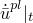

# 31.2.1 Connector behavior


**Products: **Abaqus/Standard  Abaqus/Explicit  Abaqus/CAE  

##### **References**

- ["Connectors: overview," Section 31.1.1](pt06ch31s01abo28.md)
- ["Connector elastic behavior," Section 31.2.2](pt06ch31s02alm28.md)
- ["Connector damping behavior," Section 31.2.3](pt06ch31s02alm29.md)
- ["Connector functions for coupled behavior," Section 31.2.4](pt06ch31s02alm30.md)
- ["Connector friction behavior," Section 31.2.5](pt06ch31s02alm31.md)
- ["Connector plastic behavior," Section 31.2.6](pt06ch31s02alm32.md)
- ["Connector damage behavior," Section 31.2.7](pt06ch31s02alm33.md)
- ["Connector stops and locks," Section 31.2.8](pt06ch31s02alm34.md)
- ["Connector failure behavior," Section 31.2.9](pt06ch31s02alm35.md)
- ["Connector uniaxial behavior," Section 31.2.10](pt06ch31s02alm36.md)
- [*CONNECTOR BEHAVIOR](../key/key-link.md#usb-kws-mconnectorbehavior)
- [*CONNECTOR CONSTITUTIVE REFERENCE](../key/key-link.md#usb-kws-mconnectorconstref)
- [*CONNECTOR SECTION](../key/key-link.md#usb-kws-mconnectorsection)
- ["Creating connector sections," Section 15.12.11 of the Abaqus/CAE User's Guide](../usi/usi-link.md#usi-itn-help-createconnprop)
- ["Defining a reference length," Section 15.17.12 of the Abaqus/CAE User's Guide](../usi/usi-link.md#usi-itn-help-reflength)
- ["Defining time integration," Section 15.17.13 of the Abaqus/CAE User's Guide](../usi/usi-link.md#usi-itn-help-integration)

### Overview

Connector behavior: 
- can be defined for connection types with available components of relative motion;
- can incorporate simple spring, dashpot, and node-to-node contact as particular applications;
- may include linear or nonlinear force versus displacement and force versus velocity behavior for the unconstrained relative motion components;
- can include uncoupled or coupled behavior specifications;
- can allow frictional force in an unconstrained component of relative motion to be generated by any force or moment in the connection;
- can allow for plasticity definitions for individual components or coupled plasticity definitions using user-defined yield functions;
- can be used to specify sophisticated damage mechanisms with various damage evolution laws;
- can provide user-defined locking criteria to lock in the current position all relative motion in the connector element or a single unconstrained component of relative motion;
- can be used to specify failure of the connector element; and
- can be used to specify complex uniaxial models by specifying the loading and unloading behavior in an available component of relative motion.

### Assigning a connector behavior to a connector element

You can assign the name of a connector behavior to particular connector elements.

| **Input File Usage: ** | Use the following options to define the connector behavior: |
| --- | --- |
|  | ``` [*CONNECTOR SECTION](../key/key-link.md#usb-kws-mconnectorsection), ELSET=*name*, BEHAVIOR=*behavior name* [*CONNECTOR BEHAVIOR](../key/key-link.md#usb-kws-mconnectorbehavior), NAME=*behavior name* ``` |

| **Abaqus/CAE Usage: ** | Interaction module: ****Connector****Section****Create****: **Name:** *connector section name*: **Behavior Options**, **Add******Connector****Assignment****Create****: select wires: **Section**: *connector section name* |
| --- | --- |

### Connector behavior models

Connector behaviors allow for modeling of the following types of effects:
- spring-like elastic behavior;
- rigid-like elastic behavior;
- dashpot-like (damping) behavior;
- friction;
- plasticity;
- damage;
- stops;
- locks;
- failure; and
- uniaxial behavior.

Kinetic behavior can be specified only in available components of relative motion. The list of available components of relative motion for each connector type is given in ["Connection-type library," Section 31.1.5](pt06ch31s01aus114.md). A connector behavior can be specified in any of the following ways:- uncoupled: the behavior is specified separately in individual available components of relative motion;
- coupled: all or several of the available components of relative motion are used simultaneously in a coupled manner to define the behavior; or
- combined: a combination of both uncoupled and coupled definitions are used simultaneously.

A conceptual model illustrating how connector behaviors interact with each other is shown in [Figure 31.2.1--1](pt06ch31s02alm27.md#usb-elm-econnectbehav-conceptual). Most behaviors (elasticity, damping, stops, locks, friction) act in parallel. Plasticity models are always defined in conjunction with spring-like or rigid-like elasticity definitions. Degradation due to damage can be specified either for the elastic-plastic or rigid-plastic response alone or for the entire kinetic response in the connector. The failure behavior will apply to the entire connector response.

**Figure 31.2.1–1** Conceptual illustration of connector behaviors.


Multiple definitions for the same behavior type are permitted. For example, if connector elasticity (or damping) is defined several times in an uncoupled fashion for the same available component of relative motion, in a coupled fashion, or in both fashions, the spring-like (or dashpot-like) responses are added together. Multiple definitions of friction, plasticity, and damage behaviors are permitted as long as the rules outlined in the corresponding behavior sections are followed. Multiple uncoupled stop and lock definitions for the same component are permitted, but only one will be enforced at a time.

### Defining coupled and uncoupled connector behavior

In many cases connector behavior is specified in an uncoupled manner in individual available components of relative motion. Coupled behavior can be defined for all or some of the available components of relative motion in a connector.

For coupled plasticity, damage, and, in certain situations, friction behavior, additional functions describing the nature of the coupling effects must be defined (see ["Connector functions for coupled behavior," Section 31.2.4](pt06ch31s02alm30.md)). These functions do not define a behavior by themselves but are used as tools for building a desired behavior. For example, these functions may be used to define:
- sophisticated yield functions in the connector force space for coupled plasticity behavior;
- friction-generating contact forces for friction behavior; or
- force or relative motion magnitude measures needed for damage behavior specifications.

| **Input File Usage: ** | Use the following input to define uncoupled behavior: |
| --- | --- |
|  | ``` **CONNECTOR BEHAVIOR OPTION*, COMPONENT=*n* ``` Use the following input to define coupled behavior: ``` **CONNECTOR BEHAVIOR OPTION* ``` |

| **Abaqus/CAE Usage: ** | Interaction module: connector section editor: ****Add*****connector behavior*****: **Coupling: Uncoupled** or **Coupled** |
| --- | --- |

### Defining nonlinear connector behavior properties to depend on relative positions or constitutive displacements/rotations

In all nonlinear uncoupled connector kinetic behaviors the independent variable is the connector available component in the direction for which the response is defined. When modeling the following connector behaviors, the properties can also depend on relative positions or constitutive displacements/rotations in several component directions:
- connector elasticity,
- connector damping,
- connector derived components, and
- connector friction.

When modeling connector uniaxial behavior, the properties can also depend on constitutive displacements/rotations in several component directions; see ["Connector uniaxial behavior," Section 31.2.10](pt06ch31s02alm36.md), for more information.

| **Input File Usage: ** | Use the following option to specify that the connector behavior properties are dependent on components of relative position included in the behavior definition: |
| --- | --- |
|  | ``` **CONNECTOR BEHAVIOR OPTION*, INDEPENDENT COMPONENTS=POSITION (default) ``` Use the following option to specify that the connector behavior properties are dependent on components of constitutive relative displacements or rotations included in the behavior definition: ``` **CONNECTOR BEHAVIOR OPTION*, INDEPENDENT COMPONENTS=CONSTITUTIVE MOTION ``` In either case the first data line identifies the independent component numbers to be used in determining the dependencies, and the additional data for the connector behavior definition begin on the second data line. |

| **Abaqus/CAE Usage: ** | For elasticity or damping behavior, use the following input to specify that connector behavior properties are dependent on relative position or constitutive relative displacements/rotations: |
| --- | --- |
|  | Interaction module: connector section editor: ****Add****Elasticity**** or **Damping**: **Coupling: Coupled on position** or **Coupled on motion**, select components and enter data For connector derived components, use the following input to specify that connector behavior properties are dependent on relative position or constitutive relative displacements/rotations: Interaction module: connector section editor: ****Add****Friction****, **Plasticity**, or **Damage**: **Force Potential**, **Initiation** **Potential**, or **Evolution Potential** Specify derived component, **Use local directions**: **Independent** **position components** or **Independent constitutive motion** **components**, select components and enter data For friction behavior specifying internal contact forces, use the following input to specify that connector behavior properties are dependent on relative position or constitutive relative displacements/rotations: Interaction module: connector section editor: ****Add****Friction****: **Friction model**: **User-defined**, **Contact Force**, **Use independent components: Position** or **Motion**, select components and enter data |

### Defining reference lengths and angles for constitutive response

In many connector behavior definitions, material-like behavior has a reference position where the force or moment is zero, which is different from the initial position. This is the case, for example, in a spring that has nonzero force or moment in the initial configuration. In these situations the most convenient way to define the connector behavior is relative to the nominal or reference geometry where the forces or moments vanish.

You can define the translational or angular positions at which constitutive forces and moments are zero by specifying up to six reference values (one per component of relative motion): three lengths and three angles (in degrees). The reference lengths and angles affect only spring-like elastic connector behavior and, if the friction-generating contact force (moment) is a function of the relative displacement (rotation), connector friction behavior. By default, the reference lengths and angles are the length and angle values determined from the initial geometry. See ["Connection-type library," Section 31.1.5](pt06ch31s01aus114.md), for the meaning of the reference lengths and angles for each connection type.

| **Input File Usage: ** | ``` [*CONNECTOR CONSTITUTIVE REFERENCE](../key/key-link.md#usb-kws-mconnectorconstref) *length 1*, *length 2*, *length 3*, *angle 1*, *angle 2*, *angle 3* ``` |
| --- | --- |

| **Abaqus/CAE Usage: ** | Interaction module: connector section editor: ****Add****Reference Length****: **Length associated with *CORM*** |
| --- | --- |

#### Defining precompressed or preextended linear elastic behavior

In many cases connectors are precompressed or preextended when installed in assemblies. In such cases the connector force is nonzero in the initial configuration. While nonlinear elasticity could be used to define nonzero force in the initial configuration, it is often more convenient to specify a (linear) spring stiffness plus a reference length or angle at which the force or moment is zero. For example, linear uncoupled elastic behavior defined with the connection type AXIAL would have force given by the equation


where .  is the current length of the AXIAL connection, and  is the user-defined constitutive reference length. The connector constitutive displacement quantities, , are defined for different connection types as described in ["Connection-type library," Section 31.1.5](pt06ch31s01aus114.md).

#### Example

An input file template for a connector model of the shock absorber in [Figure 31.2.1--2](pt06ch31s02alm27.md#econnector-shock-usb-elm-econnectorbehavior-reflengths) is presented in ["Connectors: overview," Section 31.1.1](pt06ch31s01abo28.md). A reference angle of 22.5 is defined for the nonlinear torsional spring as the fourth data item (corresponding to the connector's fourth component of relative motion) in the connector constitutive reference: 

```
[*CONNECTOR BEHAVIOR](../key/key-link.md#usb-kws-mconnectorbehavior), NAME=sbehavior
*...*
[*CONNECTOR CONSTITUTIVE REFERENCE](../key/key-link.md#usb-kws-mconnectorconstref)
 , , , 22.5
```

The effect of this reference angle is that the nonlinear torsional spring has a zero moment at an angle of 22.5.

**Figure 31.2.1–2** Simplified connector model of a shock absorber.


### Defining the time integration method for constitutive response in Abaqus/Explicit

In Abaqus/Explicit kinematic constraints, stops, locks, and actuated motion in connector elements are treated with implicit time integration. By default, connector constitutive behavior (for example, elasticity, damping, and friction) is also integrated implicitly. The advantage of implicit time integration is that elements with these behaviors do not affect the stability or time incrementation of the analysis in any way.

When “soft” springs are modeled with connectors, a more traditional explicit time integration for the constitutive response can be used. This explicit time integration may lead to a small improvement in computational performance. However, explicit integration of relatively stiff springs will reduce the global time increment size, since such connector elements are included in the stable time increment size calculation.

| **Input File Usage: ** | Use the following option to specify implicit integration of the constitutive response: |
| --- | --- |
|  | ``` [*CONNECTOR BEHAVIOR](../key/key-link.md#usb-kws-mconnectorbehavior), INTEGRATION=IMPLICIT ``` Use the following option to specify explicit integration of the constitutive response: ``` [*CONNECTOR BEHAVIOR](../key/key-link.md#usb-kws-mconnectorbehavior), INTEGRATION=EXPLICIT ``` |

| **Abaqus/CAE Usage: ** | Interaction module: connector section editor: ****Add****Integration****: **Integration: Implicit** or **Explicit** |
| --- | --- |

### Defining connector behavior in linear perturbation procedures

In linear perturbation procedures (see ["General and linear perturbation procedures," Section 6.1.3](pt03ch06s01aus44.md)) the connector element kinematics are linearized about the base state. Hence, linearized versions of kinematic constraints are applied, and the connector behavior is linearized about the state at the end of the previous general analysis step.

### Using several connectors in series or in parallel

Connector element behaviors allow for proper modeling of most physical connection behaviors within a single connector element. However, in rare circumstances more complex connection behaviors may require multiple connector elements to be used in parallel or in series. You place connector elements in parallel by defining two or more connector elements between the same nodes. You place connectors in series by specifying additional nodes (most often in the same location as the nodes of interest) and then stringing connector elements between these nodes. 

For example, assume that you would like to define a connector stop that exhibits elastic-plastic behavior upon contact. Since this is not permitted within the context of one connector behavior definition, you can circumvent the limitation by using two connector elements in series. This concept is illustrated in [Figure 31.2.1--3](pt06ch31s02alm27.md#usb-elm-econnectbehav-series). The first connector defines the stop, and the second defines the elastic-plastic behavior. Since both elements are subject to the same load (because they are in series), the desired behavior is obtained. 

**Figure 31.2.1–3** Conceptual illustration of two connector elements/behaviors in series.


Connectors in parallel can be used as well to model complex kinetic behavior. For example, assume that you need to define an elastic-viscous connector with spring-like and dashpot-like behaviors in parallel (for example, the strut in an automotive suspension). Assume that damage can occur only in the dashpot once it is stretched/compressed beyond specified limits. Since this is not permitted within the context of one connector behavior definition, you can circumvent the limitation by using two connector elements in parallel. This concept is illustrated in [Figure 31.2.1--4](pt06ch31s02alm27.md#usb-elm-econnectbehav-parallel). 

**Figure 31.2.1–4** Conceptual illustration of two connector elements/behaviors in parallel.


The first connector defines the elastic behavior, and the second defines the dashpot behavior. Since the two connector elements are in parallel, they undergo the same motion (stretching/compression). A motion-based damage behavior (see ["Connector damage behavior," Section 31.2.7](pt06ch31s02alm33.md)) can be used to degrade the entire behavior in the second element. Thus, only the dashpot behavior will eventually degrade.

### Defining connector behavior using tabular data

Tabular data are often used to define connector behaviors, such as nonlinear elasticity, isotropic hardening, etc. As shown in [Figure 31.2.1--5](pt06ch31s02alm27.md#espring-nonlinear-usb-elm-econnectorbehavior), the data points make up a nonlinear curve in the constitutive space. 

**Figure 31.2.1–5** Nonlinear connector behaviors defined as tabular data.


The options to define table lookups are described below.

#### Extrapolation options

 By default, the dependent variables are extrapolated as a constant (with a value corresponding to the endpoints of the curve) outside the specified range of the independent variables. This choice may cause a zero stiffness response, which may lead to convergence problems. You can specify linear extrapolation to extrapolate the dependent variables outside the specified range of the independent variables assuming that the slope given by the end points of the curve remains constant. The extrapolation behavior is illustrated in [Figure 31.2.1--5](pt06ch31s02alm27.md#espring-nonlinear-usb-elm-econnectorbehavior).

You define the extrapolation choice globally for all connector behaviors but can redefine the extrapolation choice for the following connector behaviors individually:
- connector elasticity;
- connector plasticity (connector hardening);
- connector damping;
- derived components for connector elements;
- connector friction;
- connector damage (connector damage initiation and evolution);
- connector locks; and
- connector uniaxial behavior.

 Tabular data for connector stop and lock behavior options are not supported in Abaqus/CAE.

##### Specifying constant extrapolation for all connector behaviors

You can specify constant extrapolation for tabular data for all connector behaviors.

| **Input File Usage: ** | ``` [*CONNECTOR BEHAVIOR](../key/key-link.md#usb-kws-mconnectorbehavior), EXTRAPOLATION=CONSTANT (default) ``` |
| --- | --- |

| **Abaqus/CAE Usage: ** | Interaction module: connector section editor: **Table Options** tabbed page: **Extrapolation**: **Constant** |
| --- | --- |

##### Specifying linear extrapolation for all connector behaviors

You can specify linear extrapolation for tabular data for all connector behaviors.

| **Input File Usage: ** | ``` [*CONNECTOR BEHAVIOR](../key/key-link.md#usb-kws-mconnectorbehavior), EXTRAPOLATION=LINEAR ``` |
| --- | --- |

| **Abaqus/CAE Usage: ** | Interaction module: connector section editor: **Table Options** tabbed page: **Extrapolation**: **Linear** |
| --- | --- |

##### Redefining the extrapolation choice for individual connector behaviors

You can redefine the extrapolation choice for individual connector behaviors.

| **Input File Usage: ** | Use either of the following options: |
| --- | --- |
|  | ``` **CONNECTOR BEHAVIOR OPTION*, EXTRAPOLATION=CONSTANT ``` ``` **CONNECTOR BEHAVIOR OPTION*, EXTRAPOLATION=LINEAR ``` For example, use the following options to use constant extrapolation for all connector behaviors except for connector elasticity: ``` [*CONNECTOR BEHAVIOR](../key/key-link.md#usb-kws-mconnectorbehavior), EXTRAPOLATION=CONSTANT ``` ``` [*CONNECTOR ELASTICITY](../key/key-link.md#usb-kws-mconnectorelasticity), EXTRAPOLATION=LINEAR ``` |

| **Abaqus/CAE Usage: ** | Use the following input for elasticity, damping, friction, plasticity, and damage behaviors: |
| --- | --- |
|  | Interaction module: connector section editor: **Behavior Options** tabbed page: **Table Options** button: **Extrapolation**: toggle off **Use behavior settings** and choose **Constant** or **Linear** Use the following input for connector derived components: Interaction module: derived component editor: **Add**: **Table Options** button: **Extrapolation**: toggle off **Use behavior settings** and choose **Constant** or **Linear** |

#### Regularization options for Abaqus/Explicit

By default, Abaqus/Explicit regularizes the data into tables that are defined in terms of even intervals of the independent variables since table lookups are most economical if the interpolation is from even intervals of the independent variables. In some cases, where it is necessary to capture sharp changes in connector behavior accurately, you can use the user-defined tabular connector behavior data directly by turning regularization off. However, the table lookups will be more computationally expensive compared to using regular intervals. Therefore, the use of regularization is almost always recommended.

Abaqus/Explicit uses an error tolerance to regularize the input data. The number of intervals in the range of each independent variable is chosen such that the error between the piecewise linear regularized data and each of your defined points is less than the tolerance times the range of the dependent variable. The default tolerance is 0.03. In some cases where the dependent quantities are defined at uneven intervals of the independent variables and the range of the independent variable is large compared to the smallest interval, Abaqus/Explicit may fail to obtain an accurate regularization of your data in a reasonable number of intervals. In this case Abaqus/Explicit stops after all data are processed and issues an error message that you must redefine the behavior data. See ["Material data definition," Section 21.1.2](pt05ch21s01aus109.md), for a more detailed discussion of data regularization.

You define the choice of regularization and regularization tolerance globally for all connector behaviors but can redefine the choice of regularization and regularization tolerance for the following connector behaviors individually:
- connector elasticity;
- connector plasticity (connector hardening)
- connector damping;
- derived components for connector elements;
- connector friction;
- connector damage (connector damage initiation and evolution);
- connector locks; and
- connector uniaxial behavior.

Tabular data for connector stop and lock behavior options are not supported in Abaqus/CAE.

##### Specifying the regularization of user-defined tabular data for all connector behaviors

You can specify regularization of tabular data and a regularization tolerance to be used globally for all connector behaviors.

| **Input File Usage: ** | ``` [*CONNECTOR BEHAVIOR](../key/key-link.md#usb-kws-mconnectorbehavior), REGULARIZE=ON (default), RTOL=*tolerance* ``` |
| --- | --- |

| **Abaqus/CAE Usage: ** | Interaction module: connector section editor: **Table Options** tabbed page: **Regularization**: toggle on **Regularize data (Explicit only)**, **Specify**: *tolerance* |
| --- | --- |

##### Specifying the use of user-defined tabular data without regularization for all connector behaviors

You can specify the use of user-defined tabular data directly by turning regularization off for all connector behaviors.

| **Input File Usage: ** | ``` [*CONNECTOR BEHAVIOR](../key/key-link.md#usb-kws-mconnectorbehavior), REGULARIZE=OFF ``` |
| --- | --- |

| **Abaqus/CAE Usage: ** | Interaction module: connector section editor: **Table Options** tabbed page: **Regularization**: toggle off **Regularize data (Explicit only)** |
| --- | --- |

##### Redefining the regularization options for individual connector behaviors

You can redefine the choice of regularization and regularization tolerance for individual connector behaviors.

| **Input File Usage: ** | Use either of the following options: |
| --- | --- |
|  | ``` **CONNECTOR BEHAVIOR OPTION*, REGULARIZE=ON, RTOL=*tolerance* ``` ``` **CONNECTOR BEHAVIOR OPTION*, REGULARIZE=OFF ``` For example, use the following options to regularize the user-defined data for all connector behaviors except for connector elasticity: ``` [*CONNECTOR BEHAVIOR](../key/key-link.md#usb-kws-mconnectorbehavior), REGULARIZE=ON, RTOL=0.05 ``` ``` [*CONNECTOR ELASTICITY](../key/key-link.md#usb-kws-mconnectorelasticity), REGULARIZE=OFF ``` |

| **Abaqus/CAE Usage: ** | Use the following input for elasticity, damping, friction, plasticity, and damage behaviors: |
| --- | --- |
|  | Interaction module: connector section editor: **Behavior Options** tabbed page: **Table Options** button: **Regularization**: toggle off **Use behavior settings**; toggle on **Regularize data (Explicit only)** and **Specify**: *tolerance*, or toggle off **Regularize data (Explicit only)** Use the following input for connector derived components: Interaction module: derived component editor: **Add**: **Table Options** button: **Regularization**: toggle off **Use behavior settings**; toggle on **Regularize data (Explicit only)** and **Specify**: *tolerance*, or toggle off **Regularize data (Explicit only)** |

#### Evaluation of rate-dependent data

Data for the tabulated isotropic hardening in connector plasticity (["Defining the isotropic hardening component by specifying tabular data" in "Connector plastic behavior," Section 31.2.6](pt06ch31s02alm32.md#usb-elm-econnplastbehav-isohardtabular)) and plastic motion–based damage initiation criterion (["Plastic motion--based damage initiation criterion" in "Connector damage behavior," Section 31.2.7](pt06ch31s02alm33.md#usb-elm-econndamagebehav-plasticmotion)) can be specified as dependent on the equivalent relative plastic motion rate. Loading/unloading data for the rate-dependent connector uniaxial behavior model can be specified as dependent on the rate of deformation.

##### Specifying linear intervals for interpolation of rate-dependent data

By default, both Abaqus/Standard and Abaqus/Explicit interpolate rate-dependent data using linear intervals of the relative motion rate.

| **Input File Usage: ** | Use the following option to specify linear interpolation for isotropic hardening data: |
| --- | --- |
|  | ``` [*CONNECTOR HARDENING](../key/key-link.md#usb-kws-mconnectorhardening), RATE INTERPOLATION=LINEAR ``` Use the following option to specify linear interpolation for damage initiation data: ``` [*CONNECTOR DAMAGE INITIATION](../key/key-link.md#usb-kws-mconnectordamageinit), RATE INTERPOLATION= LINEAR ``` Use both of the following options to specify linear interpolation for uniaxial behavior loading/unloading data: ``` [*CONNECTOR UNIAXIAL BEHAVIOR](../key/key-link.md#usb-kws-mconnectorunibehavior) [*LOADING DATA](../key/key-link.md#usb-kws-mloadingdata), RATE INTERPOLATION=LINEAR ``` Abaqus/Standard always interpolates rate-dependent data using linear intervals of the equivalent relative plastic motion rate. |

| **Abaqus/CAE Usage: ** | Use the following input for isotropic hardening data: |
| --- | --- |
|  | Interaction module: connector section editor: ****Add****Plasticity****: **Isotropic Hardening**: **Definition**: **Tabular**, **Table Options** button: **Interpolation**: **Linear** Use the following input for damage initiation data: Interaction module: connector section editor: ****Add****Damage****: **Initiation**: **Table Options** button: **Interpolation**: **Linear** Connector uniaxial behavior cannot be defined in Abaqus/CAE. |

##### Specifying logarithmic intervals for interpolation of rate-dependent data in Abaqus/Explicit

In Abaqus/Explicit you can specify that logarithmic intervals of the relative motion rate be used for the interpolation of rate-dependent data if the rate dependence of the data is measured at logarithmic intervals.

| **Input File Usage: ** | Use the following option to specify linear interpolation for isotropic hardening data: |
| --- | --- |
|  | ``` [*CONNECTOR HARDENING](../key/key-link.md#usb-kws-mconnectorhardening), RATE INTERPOLATION=LOGARITHMIC ``` Use the following option to specify linear interpolation for damage initiation data: ``` [*CONNECTOR DAMAGE INITIATION](../key/key-link.md#usb-kws-mconnectordamageinit), RATE INTERPOLATION=LOGARITHMIC ``` Use both of the following options to specify linear interpolation for uniaxial behavior loading/unloading data: ``` [*CONNECTOR UNIAXIAL BEHAVIOR](../key/key-link.md#usb-kws-mconnectorunibehavior) [*LOADING DATA](../key/key-link.md#usb-kws-mloadingdata), RATE INTERPOLATION=LOGARITHMIC ``` |

| **Abaqus/CAE Usage: ** | Use the following input for isotropic hardening data: |
| --- | --- |
|  | Interaction module: connector section editor: ****Add****Plasticity****: **Isotropic Hardening**: **Definition**: **Tabular**, **Table Options** button: **Interpolation**: **Logarithmic** Use the following input for damage initiation data: Interaction module: connector section editor: ****Add****Damage****: **Initiation**: **Table Options** button: **Interpolation**: **Logarithmic** Connector uniaxial behavior cannot be defined in Abaqus/CAE. |

#### Filtering the equivalent plastic motion rate in Abaqus/Explicit

Rate-sensitive connector constitutive behavior may introduce nonphysical high-frequency oscillations in an explicit dynamic analysis. To overcome this problem, Abaqus/Explicit uses a filtered equivalent plastic motion rate 


for the evaluation of rate-dependent data.  is the incremental change in equivalent plastic motion during the time increment , and  and  are the plastic motion rates at the beginning and end of the increment, respectively. The factor  () facilitates filtering high-frequency oscillations associated with rate-dependent connector behavior. You can specify the value of the rate filter factor, , directly. The default value is 0.9. A value of  provides no filtering and should be used with caution.

| **Input File Usage: ** | Use either of the following options: |
| --- | --- |
|  | ``` [*CONNECTOR HARDENING](../key/key-link.md#usb-kws-mconnectorhardening), RATE FILTER FACTOR= ``` ``` [*CONNECTOR DAMAGE INITIATION](../key/key-link.md#usb-kws-mconnectordamageinit), RATE FILTER FACTOR= ``` |

| **Abaqus/CAE Usage: ** | Use the following input for isotropic hardening data: |
| --- | --- |
|  | Interaction module: connector section editor: ****Add****Plasticity****: **Isotropic Hardening**: **Definition**: **Tabular**, **Table Options** button: **Filter factor**: **Specify**:  Use the following input for damage initiation data: Interaction module: connector section editor: ****Add****Damage****: **Initiation**: **Table Options** button: **Filter factor**: **Specify**:  |


