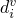

# 31.2.7 Connector damage behavior


**Products: **Abaqus/Standard  Abaqus/Explicit  Abaqus/CAE  

##### **References**

- ["Connectors: overview," Section 31.1.1](pt06ch31s01abo28.md)
- ["Connector behavior," Section 31.2.1](pt06ch31s02alm27.md)
- [*CONNECTOR BEHAVIOR](../key/key-link.md#usb-kws-mconnectorbehavior)
- [*CONNECTOR DAMAGE EVOLUTION](../key/key-link.md#usb-kws-mconnectordamageevol)
- [*CONNECTOR DAMAGE INITIATION](../key/key-link.md#usb-kws-mconnectordamageinit)
- [*CONNECTOR ELASTICITY](../key/key-link.md#usb-kws-mconnectorelasticity)
- [*CONNECTOR PLASTICITY](../key/key-link.md#usb-kws-mconnectorplasticity)
- [*CONNECTOR POTENTIAL](../key/key-link.md#usb-kws-mconnectorpotential)
- [*SECTION CONTROLS](../key/key-link.md#usb-kws-msectioncontrols)
- ["Defining damage," Section 15.17.7 of the Abaqus/CAE User's Guide](../usi/usi-link.md#usi-itn-help-damage)

### Overview

Connector damage behavior:
- can be specified in any connectors with available components of relative motion;
- can be used to degrade the elastic, elastic-plastic, or rigid plastic response in connector elements;
- can use a force-based, motion-based, or plastic motion--based damage initiation criterion upon which response degradation may be triggered;
- can use either a (plastic) motion-based or an energy-based damage evolution law to degrade the force response in the connector;
- can be defined in terms of several competing damage mechanisms; and
- can be used only as an indicator of proximity to the damage initiation point without degrading the connector response.

### Damage formulation in connectors

If relative forces or motions in a connection exceed critical values, the connector starts undergoing irreversible damage (degradation). Upon additional loading there is further evolution of damage leading to eventual failure. If damage has occurred, the force response in the connector component *i* will change according to the following general form:


where  is a scalar damage variable and  is the response in the available connector component of relative motion *i* if damage were not present (effective response).

To define a connector damage mechanism, you specify the following:
- a criterion for damage initiation; and
- a damage evolution law that specifies how the damage variable *d* evolves (optional).

Prior to damage initiation, *d* has a value of 0.0; thus, the force response in the connector does not change. Once damage has been initiated, the damage variable will monotonically evolve up to the maximum value of 1.0 if damage evolution is specified. Complete failure occurs when *d* = 1.0.

Abaqus allows you to specify a maximum degradation value (the default value is 1.0); damage evolution will stop when the damage variable reaches this value, and the element will be deleted from the mesh by default. Alternatively, you can specify that the damaged connector elements remain in the analysis with no further damage evolution. The maximum degradation value is used to evaluate the damaged stiffness in the remaining part of the analysis. This functionality is discussed in detail in ["Controlling element deletion and maximum degradation for materials with damage evolution" in "Section controls," Section 27.1.4](pt06ch27s01aus113.md#usb-elm-esectioncontrol-deletion).

### Defining connector damage initiation

The degradation process in connectors initiates when forces or relative motions in the connector satisfy certain criteria. Three different criteria types can be used to trigger damage in connectors: criteria based on force, plastic motion, or constitutive motion. Connector damage initiation criteria for the available components of relative motion can be specified for each component independently (uncoupled). Alternatively, connector damage initiation criteria that couple all or some of the available components of relative motion in the connector can be defined.

The damage initiation criterion can depend on temperature and field variables. See ["Input syntax rules," Section 1.2.1](pt01ch01s02aus01.md), for further information about defining data as functions of temperature and field variables.

#### Force-based damage initiation criterion

By default, the damage initiation criterion is specified in terms of forces/moments in the connector. Elastic or rigid connector behavior must be defined for the components involved in the initiation. You provide the lower (compression) limit, , and the upper (tension) limit, , for the force/moment damage initiation values. If the force is outside the range specified by the two limit values, damage is initiated. The output variable CDIF can be used to monitor the proximity to the damage initiation point.

##### Defining uncoupled force-based damage initiation

For an uncoupled force-based damage initiation criterion, the connector force in the specified component is compared to the specified limit values. Damage is initiated when the force in the specified component *i*, , is for the first time outside the range ( or ).

| **Input File Usage: ** | ``` [*CONNECTOR DAMAGE INITIATION](../key/key-link.md#usb-kws-mconnectordamageinit), COMPONENT=*component number*, CRITERION=FORCE (default), DEPENDENCIES=*n* ``` |
| --- | --- |

| **Abaqus/CAE Usage: ** | Interaction module: connector section editor: ****Add****Damage****: **Coupling: Uncoupled**, **Initiation criterion: Force** |
| --- | --- |

##### Defining coupled force-based damage initiation

For a coupled force-based damage initiation criterion, a connector potential, , must be specified to define an equivalent force magnitude (scalar). The equivalent force magnitude is compared to the specified limit values to assess damage initiation. Damage is initiated when the equivalent force magnitude, , is for the first time outside the range ( or ).

| **Input File Usage: ** | Use the following options: |
| --- | --- |
|  | ``` [*CONNECTOR DAMAGE INITIATION](../key/key-link.md#usb-kws-mconnectordamageinit), CRITERION=FORCE (default), DEPENDENCIES=*n* [*CONNECTOR POTENTIAL](../key/key-link.md#usb-kws-mconnectorpotential) ``` |

| **Abaqus/CAE Usage: ** | Interaction module: connector section editor: ****Add****Damage****: **Coupling: Coupled**, **Initiation criterion: Force**, **Initiation Potential** |
| --- | --- |

#### Plastic motion--based damage initiation criterion

The damage initiation criterion can be specified in terms of an equivalent relative plastic motion in the connector. You provide the relative equivalent plastic displacement/rotation at which damage will be initiated as a function of the relative equivalent plastic rate. The output variable CDIP can be used to monitor the proximity to the damage initiation point.

##### Defining uncoupled plastic damage initiation

For an uncoupled elastic-plastic or rigid plastic damage initiation criterion, uncoupled connector plasticity in the specified component of relative motion must be defined (see ["Connector plastic behavior," Section 31.2.6](pt06ch31s02alm32.md)). When the equivalent relative plastic motion as defined by the associated plasticity definition is greater than the specified limit value for the first time, damage is initiated.

| **Input File Usage: ** | Use the following options: |
| --- | --- |
|  | ``` [*CONNECTOR DAMAGE INITIATION](../key/key-link.md#usb-kws-mconnectordamageinit), COMPONENT=*component number*, CRITERION=PLASTIC MOTION, DEPENDENCIES=*n* [*CONNECTOR PLASTICITY](../key/key-link.md#usb-kws-mconnectorplasticity), COMPONENT=*component number* *or* [*CONNECTOR PLASTICITY](../key/key-link.md#usb-kws-mconnectorplasticity) ``` |

| **Abaqus/CAE Usage: ** | Interaction module: connector section editor: ****Add****Damage****: **Initiation criterion: Plastic motion**; ****Add****Plasticity**** |
| --- | --- |

##### Defining coupled plastic damage initiation

For a coupled elastic-plastic or rigid plastic damage initiation criterion, coupled connector plasticity must be defined. The connector potential used in the coupled connector plasticity function defines an equivalent relative plastic motion. This equivalent relative plastic motion is compared to the specified limit values to assess damage initiation. The equivalent relative plastic motion at which damage is initiated can be a function of the mode-mix ratio  (see ["Connector plastic behavior," Section 31.2.6](pt06ch31s02alm32.md)).

| **Input File Usage: ** | Use the following options: |
| --- | --- |
|  | ``` [*CONNECTOR DAMAGE INITIATION](../key/key-link.md#usb-kws-mconnectordamageinit), CRITERION=PLASTIC MOTION, DEPENDENCIES=*n* [*CONNECTOR PLASTICITY](../key/key-link.md#usb-kws-mconnectorplasticity) [*CONNECTOR POTENTIAL](../key/key-link.md#usb-kws-mconnectorpotential) ``` |

| **Abaqus/CAE Usage: ** | Interaction module: connector section editor: ****Add****Damage****: **Coupling: Coupled**, **Initiation criterion: Plastic motion**; ****Add****Plasticity****: **Coupling: Coupled**, **Force Potential** |
| --- | --- |

#### Constitutive motion-based damage initiation criterion

The damage initiation criterion can be specified in terms of relative constitutive displacements/rotations in the connector. You provide the lower (compression) limit, , and the upper (tension) limit, , for the constitutive displacement/rotation damage initiation values. If the motion is outside the range specified by the two limit values, damage is initiated. The output variable CDIM can be used to monitor the proximity to the damage initiation point.

##### Defining uncoupled constitutive motion-based damage initiation

For an uncoupled motion-based damage initiation criterion, the connector relative constitutive motion in the specified component is compared to the specified limit values. Damage is initiated when the relative constitutive displacement/rotation in the specified component *i*, , is for the first time outside the range ( or ).

| **Input File Usage: ** | ``` [*CONNECTOR DAMAGE INITIATION](../key/key-link.md#usb-kws-mconnectordamageinit), COMPONENT=*component number*, CRITERION=MOTION, DEPENDENCIES=*n* ``` |
| --- | --- |

| **Abaqus/CAE Usage: ** | Interaction module: connector section editor: ****Add****Damage****: **Coupling: Uncoupled**, **Initiation criterion: Motion** |
| --- | --- |

##### Defining coupled constitutive motion-based damage initiation

For a coupled motion-based damage initiation criterion, a connector potential, , must be specified to define an equivalent motion magnitude (scalar), where  is the collection of all available components of relative motion in the connector. The equivalent motion magnitude is compared to the specified limit values to assess damage initiation. Damage is initiated when the equivalent motion magnitude, , is for the first time outside the range ( or ).

| **Input File Usage: ** | Use the following options: |
| --- | --- |
|  | ``` [*CONNECTOR DAMAGE INITIATION](../key/key-link.md#usb-kws-mconnectordamageinit), CRITERION=MOTION, DEPENDENCIES=*n* [*CONNECTOR POTENTIAL](../key/key-link.md#usb-kws-mconnectorpotential) ``` |

| **Abaqus/CAE Usage: ** | Interaction module: connector section editor: ****Add****Damage****: **Coupling: Coupled**, **Initiation criterion: Motion**, **Initiation Potential** |
| --- | --- |

### Defining connector damage evolution

Connector damage evolution specifies the evolution law for the damage variable. Upon evolution, the connector response will be degraded. The evolution of damage can be based on an energy dissipation criterion or on relative (plastic) motions. In the motion-based criteria the damage variable, *d*, can be defined as a linear, exponential, or tabular function of relative motions.

The damage evolution law can depend on temperature and field variables. See ["Input syntax rules," Section 1.2.1](pt01ch01s02aus01.md), for further information about defining data as functions of temperature and field variables.

#### Specifying the affected components

By default (i.e., the affected components are not specified explicitly), only the elastic/rigid or elastic/rigid-plastic response in the connector will be damaged. The response due to friction, damping, and stop/lock behavior will not be degraded. For an uncoupled connector damage mechanism (uncoupled damage initiation criterion), only the specified component of relative motion will undergo damage. For coupled connector damage initiation, the components that will be degraded by default are chosen as follows:
- If a force-based or constitutive motion-based damage initiation criterion is used, the intrinsic available components (1 through 6) that ultimately contribute to the connector potential for damage initiation will be affected.
- If a plastic motion--based damage initiation criterion is used, the intrinsic available components that ultimately contribute to the connector potential used in the coupled plasticity definition will be affected.

Alternatively, you can specify the available components of relative motion that will be affected by the damage evolution law directly. In this case the entire connector response (elasto/rigid-plastic, friction, damping, constraint forces and moments, etc.) in the affected components will be damaged.

| **Input File Usage: ** | ``` [*CONNECTOR DAMAGE EVOLUTION](../key/key-link.md#usb-kws-mconnectordamageevol), AFFECTED COMPONENTS ``` |
| --- | --- |
|  | The first data line identifies the component numbers that will be damaged, and the additional data for the connector damage evolution definition begins on the second data line. |

| **Abaqus/CAE Usage: ** | Interaction module: connector section editor: ****Add****Damage****: **Specify damage evolution**, **Evolution**, **Specify affected components** |
| --- | --- |

#### Defining a motion-based linear damage evolution law

The linear form of the damage evolution law is illustrated here in the context of linear elasticity, although it can be used in any situation. Assume that the connector response is linear elastic and that after damage initiation a linear damage evolution is desired, as illustrated in [Figure 31.2.7--1](pt06ch31s02alm33.md#usb-elm-econnectbehav-lindamevolve). 

**Figure 31.2.7–1** Linear damage evolution law for linear elastic connector behavior.


If damage were not specified, the response would be linear elastic (a straight line passing through the origin). Assume that damage has initiated at point I as triggered by a force-based or motion-based criterion, for example; the corresponding constitutive motion at this point is . If the connector is loaded further such that the constitutive motion increases to , the connector force response at point C becomes . The response is diminished by  when compared to the effective response  (the elastic response with no damage). Thus, . If unloading occurs at point C, the unloading curve of slope  is followed. As long as the constitutive motion does not exceed , the damage variable, *d*, stays constant at the value obtained when point C is first reached. If further loading occurs, further damage occurs until the ultimate failure motion, , is reached (*d* = 1) and the connector component loses the ability to carry any load. Thus, one possible loading/unloading sequence is OICOC.

The linear damage evolution law defines a truly linear damaged force response only in the case of linear elastic or rigid behavior with optional perfect plasticity. If nonlinear elasticity or plasticity with hardening are defined for the damaged components, an approximate linear damaged response is observed.

##### Defining the linear evolution law for a force-based or constitutive motion-based damage initiation criterion

If an uncoupled damage initiation criterion is used in component *i*, you specify the difference between the constitutive relative motion at ultimate failure, , and the constitutive relative motion at damage initiation, , in the specified component ().

If a coupled damage initiation criterion is used, an equivalent constitutive relative motion, , must be defined for damage evolution purposes. A connector potential definition is used to define . You specify the difference between the equivalent motion at ultimate failure, , and the equivalent motion at damage initiation,  ().

| **Input File Usage: ** | Use the following options to define a linear evolution law for an uncoupled initiation criterion: |
| --- | --- |
|  | ``` [*CONNECTOR DAMAGE INITIATION](../key/key-link.md#usb-kws-mconnectordamageinit), COMPONENT=*component number*, CRITERION=FORCE or MOTION [*CONNECTOR DAMAGE EVOLUTION](../key/key-link.md#usb-kws-mconnectordamageevol), TYPE=MOTION, SOFTENING=LINEAR ``` Use the following options to define a linear evolution law for a coupled initiation criterion: ``` [*CONNECTOR DAMAGE INITIATION](../key/key-link.md#usb-kws-mconnectordamageinit), CRITERION=FORCE or MOTION [*CONNECTOR POTENTIAL](../key/key-link.md#usb-kws-mconnectorpotential) [*CONNECTOR DAMAGE EVOLUTION](../key/key-link.md#usb-kws-mconnectordamageevol), TYPE=MOTION, SOFTENING=LINEAR [*CONNECTOR POTENTIAL](../key/key-link.md#usb-kws-mconnectorpotential) ``` The second [*CONNECTOR POTENTIAL](../key/key-link.md#usb-kws-mconnectorpotential) option defines . |

| **Abaqus/CAE Usage: ** | Use the following input to define a linear evolution law for an uncoupled initiation criterion: |
| --- | --- |
|  | Interaction module: connector section editor: ****Add****Damage****: **Coupling: Uncoupled**, **Initiation criterion: Force** or **Motion**; **Specify damage evolution**, **Evolution type: Motion**, **Evolution softening: Linear** Use the following input to define a linear evolution law for a coupled initiation criterion: Interaction module: connector section editor: ****Add****Damage****: **Coupling: Coupled**, **Initiation criterion: Force** or **Motion**; **Specify damage evolution**, **Evolution type: Motion**, **Evolution softening: Linear**; **Initiation Potential**; **Evolution Potential** |

##### Defining the linear evolution law for a plastic motion--based damage initiation criterion

You can specify the difference between the associated equivalent plastic relative motion at ultimate failure, , and the associated equivalent plastic relative motion at damage initiation,  (), as a function of the mode-mix ratio, , defined in ["Connector plastic behavior," Section 31.2.6](pt06ch31s02alm32.md). The equivalent plastic relative motions are calculated from the associated plasticity definition (either coupled or uncoupled).

| **Input File Usage: ** | Use the following options: |
| --- | --- |
|  | ``` [*CONNECTOR DAMAGE INITIATION](../key/key-link.md#usb-kws-mconnectordamageinit), CRITERION=PLASTIC MOTION [*CONNECTOR DAMAGE EVOLUTION](../key/key-link.md#usb-kws-mconnectordamageevol), TYPE=MOTION, SOFTENING=LINEAR ``` |

| **Abaqus/CAE Usage: ** | Interaction module: connector section editor: ****Add****Damage****: **Initiation criterion: Plastic motion**; **Specify damage evolution**, **Evolution type: Motion**, **Evolution softening: Linear** |
| --- | --- |

#### Defining a motion-based exponential damage evolution law

The exponential damage evolution law is illustrated in the context of a linear elastic-plastic response with hardening, although it can be used in any situation. The force response in a particular connector component is shown in [Figure 31.2.7--2](pt06ch31s02alm33.md#usb-elm-econnectbehav-expondamevolve). 

**Figure 31.2.7–2** Exponential damage evolution law for linear elastic-plastic connector behavior with hardening.


Assume that damage is initiated at point I as triggered by a plastic motion–based damage initiation criterion. If further loading occurs until point C, the response is . Unloading from point C occurs along the damaged elastic line of slope . Upon unloading/reloading, the damage variable remains constant until point C is reached again. Further loading (beyond point C) leads to an increasingly damaged response until the ultimate failure point, , is reached (*d* = 1). The damage variable *d* is given by the following equation:


The damaged response will appear to be truly exponential only if either linear elasticity or perfect plasticity is used. An approximate exponential degradation is obtained if plasticity with hardening is present.

You specify the difference between the relative motions at ultimate failure and at damage initiation and the exponential coefficient . The difference between the relative motions is interpreted in the same way as described in ["Defining a motion-based linear damage evolution law](pt06ch31s02alm33.md#usb-elm-econnectbehav-linevol),” as follows:
- If an uncoupled force-based or constitutive motion-based damage initiation criterion is used, the difference between the relative motions at ultimate failure and at damage initiation in the specified component *i*, , is specified.
- If a coupled force-based or constitutive motion-based damage initiation criterion is used, an equivalent relative motion is defined using a connector potential (). The difference between the relative motions at ultimate failure and at damage initiation, , is specified.
- If a plastic motion--based damage initiation criterion is used, the difference between the equivalent relative plastic motions at ultimate failure and at damage initiation, , is specified. The equivalent plastic relative motion is calculated from the associated plasticity definition. The data can also be functions of the mode-mix ratio .

In the first two cases the equation for the damage variable is similar to that given above for plastic motion–based damage initiation except that (equivalent) constitutive relative motions are used instead of equivalent relative plastic motions.

| **Input File Usage: ** | ``` [*CONNECTOR DAMAGE EVOLUTION](../key/key-link.md#usb-kws-mconnectordamageevol), TYPE=MOTION, SOFTENING=EXPONENTIAL ``` |
| --- | --- |

| **Abaqus/CAE Usage: ** | Interaction module: connector section editor: ****Add****Damage****: **Specify damage evolution**, **Evolution type: Motion**, **Evolution softening: Exponential** |
| --- | --- |

#### Defining a motion-based tabular damage evolution law

You can also specify the damage variable directly as a tabular function of the differences between the relative motions at ultimate failure and the relative motions at damage initiation. The differences between the relative motions are interpreted in the same way as described in ["Defining a motion-based linear damage evolution law](pt06ch31s02alm33.md#usb-elm-econnectbehav-linevol),” as follows:
- If an uncoupled force-based or constitutive motion-based damage initiation criterion is used, the differences between the constitutive relative motions at ultimate failure and at damage initiation in the specified component *i*, , are used to define the tabular data.
- If a coupled force-based or constitutive motion-based damage initiation criterion is used, an equivalent relative motion is defined using a connector potential (). The differences between the relative motions at ultimate failure and at damage initiation, , are used to define the tabular data.
- If a plastic motion--based damage initiation criterion is used, the differences between the equivalent relative plastic motions at ultimate failure and at damage initiation, , are used. The equivalent plastic relative motion is calculated from the associated plasticity definition. The tabular data can also be functions of the mode-mix ratio .

| **Input File Usage: ** | ``` [*CONNECTOR DAMAGE EVOLUTION](../key/key-link.md#usb-kws-mconnectordamageevol), TYPE=MOTION, SOFTENING=TABULAR, DEPENDENCIES=*n* ``` |
| --- | --- |

| **Abaqus/CAE Usage: ** | Interaction module: connector section editor: ****Add****Damage****: **Specify damage evolution**, **Evolution type: Motion**, **Evolution softening: Tabular** |
| --- | --- |

#### Defining a damage evolution law using post-damage initiation dissipation energies

This damage evolution law is illustrated in the context of nonlinear elasticity, as shown in [Figure 31.2.7--3](pt06ch31s02alm33.md#usb-elm-econnectbehav-energydamevolve). 

**Figure 31.2.7–3** Post-damage initiation dissipation energy evolution law for nonlinear elastic connector behavior.


Assume that damage is initiated at point I when the constitutive relative motion is  as triggered by a force-based or a motion-based damage initiation criterion, for example. The response at point C will be . Unloading from point C occurs along the CO curve, which is the original nonlinear elastic response curve (OE) scaled down by the () factor. Damage remains constant on the unloading/reloading curve (COC), and it increases only if loading increases beyond point C.

Instantaneous failure can be specified upon initiation if  is specified as 0.0. In all other cases ultimate failure (*d* = 1) would occur (in theory) at infinite motion since an exponential-like response that asymptotically goes to zero is generated. Abaqus will set *d* = 1 when the damage dissipated energy reaches 0.99.

You specify the post-damage initiation dissipated energy at ultimate failure, . If a plastic motion–based initiation criterion is used,  can be specified as a function of the mode-mix ratio .

| **Input File Usage: ** | ``` [*CONNECTOR DAMAGE EVOLUTION](../key/key-link.md#usb-kws-mconnectordamageevol), TYPE=ENERGY, DEPENDENCIES=*n* ``` |
| --- | --- |

| **Abaqus/CAE Usage: ** | Interaction module: connector section editor: ****Add****Damage****: **Specify damage evolution**, **Evolution type: Energy** |
| --- | --- |

### Using multiple damage mechanisms

At most three uncoupled damage mechanisms (pairs of connector damage initiation criteria and connector damage evolution laws) can be defined for each available component of relative motion, one for each type of initiation criterion (force, motion, and plastic motion). In addition, three coupled damage mechanisms can be defined (one for each type of initiation criterion). Coupled and uncoupled damage definitions can be combined; only one overall damage variable per component will be used to damage the response in a particular available component of relative motion. Only the overall damage will be output.

#### Specifying the contribution of each damage mechanism

When several damage mechanisms are defined for the same connector behavior, you can specify the contribution of each damage mechanism to the overall damage effect for a particular component of relative motion. By default, the damage value associated with a particular mechanism will be compared to the damage values from any other damage mechanisms defined for the connector behavior, and only the maximum value will be considered for the overall damage. Alternatively, you can specify that the damage values for the mechanisms associated with the connector behavior should be combined in a multiplicative fashion to obtain the overall damage. See the last example below for an illustration.

| **Input File Usage: ** | Use the following option to specify that only the maximum damage value associated with a particular connector behavior should contribute to the overall damage effect: |
| --- | --- |
|  | ``` [*CONNECTOR DAMAGE EVOLUTION](../key/key-link.md#usb-kws-mconnectordamageevol), DEGRADATION=MAXIMUM ``` Use the following option to specify that all the damage values associated with a particular connector behavior should contribute in a multiplicative way to the overall damage effect: ``` [*CONNECTOR DAMAGE EVOLUTION](../key/key-link.md#usb-kws-mconnectordamageevol), DEGRADATION=MULTIPLICATIVE ``` |

| **Abaqus/CAE Usage: ** | Interaction module: connector section editor: ****Add****Damage****: **Specify damage evolution**, **Evolution**, **Degradation: Maximum** or **Multiplicative** |
| --- | --- |

### Examples

The examples that follow illustrate several methods for defining damage mechanisms.

#### Uncoupled damage

The following input could be used to define a simple uncoupled damage mechanism:

```
[*CONNECTOR ELASTICITY](../key/key-link.md#usb-kws-mconnectorelasticity), COMPONENT=1
[*CONNECTOR DAMAGE INITIATION](../key/key-link.md#usb-kws-mconnectordamageinit), COMPONENT=1, CRITERION=FORCE
*force_compress*, *force_tens*
[*CONNECTOR DAMAGE EVOLUTION](../key/key-link.md#usb-kws-mconnectordamageevol), TYPE=ENERGY
0.0
```

Damage will initiate when the elastic force in component 1 is either smaller than *force_compress* or larger than *force_tens*. Only the elastic response in component 1 will be damaged. Since the dissipated energy specified for damage evolution is 0.0, the damage evolves catastrophically instantaneously after it has initiated.

#### Coupled rigid plasticity with plasticity-based damage

Referring to the spot weld in [Figure 31.2.7--4](pt06ch31s02alm33.md#usb-elm-econnect-weldexample-damage) for which coupled plasticity is defined in ["Connector plastic behavior," Section 31.2.6](pt06ch31s02alm32.md), a plastic motion–based damage initiation and evolution with dependencies on the mode-mix ratio can be specified as follows:

**Figure 31.2.7–4** Spot weld connection.


```
[*PARAMETER](../key/key-link.md#usb-kws-mparameter)
=0.25
=0.35
=0.45
=0.75
=0.78
=0.82
=0.85
[*CONNECTOR DAMAGE INITIATION](../key/key-link.md#usb-kws-mconnectordamageinit), CRITERION=PLASTIC MOTION
, 0.0
, 0.5
, 1.0
[*CONNECTOR DAMAGE EVOLUTION](../key/key-link.md#usb-kws-mconnectordamageevol), TYPE=MOTION, SOFTENING=LINEAR
, 0.0
, 0.3
, 0.5
, 1.0
```

The equivalent plastic relative motion on the data lines is defined by the associated coupled plasticity definition illustrated in ["Connector plastic behavior," Section 31.2.6](pt06ch31s02alm32.md). For the damage evolution the post-damage-initiation equivalent plastic relative motion should be specified. The second column in all the data lines represents the mode-mix ratios as defined in ["Connector plastic behavior," Section 31.2.6](pt06ch31s02alm32.md). In this particular case the mode-mix ratio is . The data point at 0.0 comes from a pure “shear” experiment, and the data point at 1.0 comes from a pure “normal” experiment. Data for the values in between come from combined “shear-normal” experiments.

#### Coupled rigid plasticity with force-based damage initiation and motion-based damage evolution

Referring to the spot weld in [Figure 31.2.7--4](pt06ch31s02alm33.md#usb-elm-econnect-weldexample-damage) and using the derived components `normal` and `shear` defined in ["Defining derived components for connector elements" in "Connector functions for coupled behavior," Section 31.2.4](pt06ch31s02alm30.md#usb-elm-econnectbehav-derivedcomps), an alternative way to define damage in the spot weld is to use: 

```
[*PARAMETER](../key/key-link.md#usb-kws-mparameter)
=2
=0.85
=120.0
=115.0
[*CONNECTOR DAMAGE INITIATION](../key/key-link.md#usb-kws-mconnectordamageinit), CRITERION=FORCE
, 1.0
[*CONNECTOR POTENTIAL](../key/key-link.md#usb-kws-mconnectorpotential)
normal, 
shear, 
** 
[*CONNECTOR DAMAGE EVOLUTION](../key/key-link.md#usb-kws-mconnectordamageevol), TYPE=MOTION, SOFTENING=EXPONENTIAL
, 
[*CONNECTOR POTENTIAL](../key/key-link.md#usb-kws-mconnectorpotential)
1
2
3
** 
```

Damage will be initiated when the force magnitude defined by the first connector potential definition exceeds the specified value of 1.0. The scale factors  and  in the first potential definition are used in this case to define a force magnitude that would be 1.0 at damage initiation. A motion-based exponential decay damage evolution law is chosen. The second connector potential definition is associated with the connector damage evolution definition and defines an equivalent motion, , in the connection. When the equivalent post-initiation motion,  (where  is  at damage initiation), reaches , ultimate failure occurs. All components (1 through 6) are affected in this case since they all ultimately contribute to the first connector potential definition (see ["Defining derived components for connector elements" in "Connector functions for coupled behavior," Section 31.2.4](pt06ch31s02alm30.md#usb-elm-econnectbehav-derivedcomps), for the specific definitions associated with the `normal` and `shear` derived components). 

#### Elastic-plasticity with four competing damage mechanisms

This example illustrates how to specify the contributions of multiple damage mechanisms to the overall damage effect and the components of relative motion affected by the damage evolution law. Most of the data line entries or parameters are not given for conciseness.

```
** first damage mechanism: force-based damage initiation
** damage variable 
[*CONNECTOR DAMAGE INITIATION](../key/key-link.md#usb-kws-mconnectordamageinit), COMPONENT=4, CRITERION=FORCE
[*CONNECTOR DAMAGE EVOLUTION](../key/key-link.md#usb-kws-mconnectordamageevol), TYPE=MOTION, SOFTENING=EXPONENTIAL, 
DEGRADATION=MAXIMUM, AFFECTED COMPONENTS
4, 6
**
** second damage mechanism: motion-based damage initiation
** damage variable 
[*CONNECTOR DAMAGE INITIATION](../key/key-link.md#usb-kws-mconnectordamageinit), COMPONENT=4, CRITERION=MOTION
[*CONNECTOR DAMAGE EVOLUTION](../key/key-link.md#usb-kws-mconnectordamageevol), TYPE=MOTION, SOFTENING=LINEAR, 
DEGRADATION=MULTIPLICATIVE, AFFECTED COMPONENTS
1, 2, 6
**
** third damage mechanism: plastic motion–based damage initiation 
** damage variable 
[*CONNECTOR DAMAGE INITIATION](../key/key-link.md#usb-kws-mconnectordamageinit), COMPONENT=4, 
CRITERION=PLASTIC MOTION
[*CONNECTOR DAMAGE EVOLUTION](../key/key-link.md#usb-kws-mconnectordamageevol), TYPE=MOTION, SOFTENING=TABULAR, 
DEGRADATION=MULTIPLICATIVE, AFFECTED COMPONENTS
1, 2
**
** fourth damage mechanism: coupled force-based damage initiation
** damage variable 
[*CONNECTOR DAMAGE INITIATION](../key/key-link.md#usb-kws-mconnectordamageinit), CRITERION=FORCE
[*CONNECTOR POTENTIAL](../key/key-link.md#usb-kws-mconnectorpotential)
** using components 1, 2, 3, 4, 5, 6
[*CONNECTOR DAMAGE EVOLUTION](../key/key-link.md#usb-kws-mconnectordamageevol), TYPE=ENERGY, DEGRADATION=MAXIMUM, 
AFFECTED COMPONENTS
1, 3, 4, 6
```

Four damage mechanisms (connector damage initiation/connector damage evolution pairs) are specified: three uncoupled and one coupled. The first line of each damage evolution definition establishes the components that will be damaged by the mechanism. The overall damage in a particular component is determined by contributions from all the mechanisms that affect that component. For example, the overall damage in component 1, , is determined by the second, third, and fourth damage mechanisms as follows: 


 and  use multiplicative degradation; therefore, they are multiplied first: .  uses maximum degradation, so  is compared to  and the minimum value is taken.

For example, assume that at a particular time *t*, =0.5, =0.3, and =0.2 and at time , =0.6 (the only one increasing) while  and  stay the same. The overall damage variable gets closer to the ultimate damage value faster when all three damage mechanisms are used than if we use only the  mechanism: 


while 


Complete failure occurs when  reaches 0.0.

, where *i* refers to the  available component of relative motion. The overall damage variables for the other components are determined as follows (based on the specified affected components for each damage evolution law):


### Maximum degradation and choice of element removal in Abaqus/Standard

You have control over how Abaqus/Standard treats connector elements with severe damage. By default, the upper bound to the overall damage variable at a material point is . You can reduce this upper bound as discussed in ["Controlling element deletion and maximum degradation for materials with damage evolution" in "Section controls," Section 27.1.4](pt06ch27s01aus113.md#usb-elm-esectioncontrol-deletion). 

By default, once the overall damage variable in at least one component reaches , the connector elements are removed (deleted). See ["Controlling element deletion and maximum degradation for materials with damage evolution" in "Section controls," Section 27.1.4](pt06ch27s01aus113.md#usb-elm-esectioncontrol-deletion), for details. Once removed, connector elements offer no resistance to subsequent deformation.

Alternatively, you can specify that a connector element should remain in the model even after the overall damage variable reaches . In this case, once the overall damage variable reaches , the element stiffness remains constant at  times the undamaged stiffness.

### Viscous regularization in Abaqus/Standard

Damage causes a softening response in connector elements, which often leads to convergence difficulties in an implicit code such as Abaqus/Standard. One technique for overcoming convergence difficulties is applying viscous regularization to the constitutive response by introducing a viscous damage variable, , as defined by the evolution equation


where  is the damage variable evaluated in the inviscid backbone model and  is the viscosity parameter representing the relaxation time. The damaged response of the viscous material is given as 


As a result of viscous regularization, the damped damage variable does not obey the specified evolution law exactly (only the backbone damage variable does).

| **Input File Usage: ** | ``` [*SECTION CONTROLS](../key/key-link.md#usb-kws-msectioncontrols), NAME=*name*, VISCOSITY= [*CONNECTOR SECTION](../key/key-link.md#usb-kws-mconnectorsection), CONTROLS=*name* ``` |
| --- | --- |

| **Abaqus/CAE Usage: ** | Viscous regularization is not supported in Abaqus/CAE. |
| --- | --- |

### Defining connector damage behavior in linear perturbation procedures

Damage cannot be initiated and damage variables do not evolve during linear perturbation analyses. Consequently, during a linear perturbation step damage is “frozen” in the state attained at the end of the previous general step.

### Output

The Abaqus output variables available for connectors are listed in ["Abaqus/Standard output variable identifiers," Section 4.2.1](pt02ch04s02abv01.md), and ["Abaqus/Explicit output variable identifiers," Section 4.2.2](pt02ch04s02xbv01.md). The following variables are of particular interest when damage is defined in connectors:

| CDMG | Connector overall damage variable. |
| --- | --- |

| CDIF | Force-based connector damage initiation variable. In addition to the usual six components associated with connector output variables, CDIF includes the scalar CDIFC, which is the damage initiation criterion value associated with a coupled force-based damage initiation criterion. |
| --- | --- |

| CDIM | Motion-based connector damage initiation variable. CDIM includes the scalar CDIMC, which is the damage initiation criterion value associated with a coupled motion-based damage initiation criterion. |
| --- | --- |

| CDIP | Plastic motion--based connector damage initiation variable. CDIP includes the scalar CDIPC, which is the damage initiation criterion value associated with a coupled plastic motion--based damage initiation criterion. |
| --- | --- |

| ALLDMD | Energy dissipated by damage. |
| --- | --- |

| ALLCD | Energy dissipated by viscous regularization. |
| --- | --- |


