# 35.6.1 Overconstraint checks


**Product: **Abaqus/Standard  

##### **References**

- ["Rigid body definition," Section 2.4.1](pt01ch02s04aus22.md)
- ["Connectors: overview," Section 31.1.1](pt06ch31s01abo28.md)
- ["Boundary conditions in Abaqus/Standard and Abaqus/Explicit," Section 34.3.1](pt07ch34s03aus118.md)
- ["General multi-point constraints," Section 35.2.2](pt08ch35s02aus130.md)
- ["Mesh tie constraints," Section 35.3.1](pt08ch35s03aus132.md)
- ["Coupling constraints," Section 35.3.2](pt08ch35s03aus133.md)
- ["Mesh-independent fasteners," Section 35.3.4](pt08ch35s03aus135.md)
- ["Defining contact pairs in Abaqus/Standard," Section 36.3.1](pt09ch36s03aus145.md)
- [*BASE MOTION](../key/key-link.md#usb-kws-hbasemotion)
- [*CONSTRAINT CONTROLS](../key/key-link.md#usb-kws-hconstraintcontrols)

### Overview

An overconstraint means applying multiple consistent or inconsistent kinematic constraints. Many models have nodal degrees of freedom that are overconstrained. Such overconstraints may lead to inaccurate solutions or nonconvergence. Common examples of situations that may lead to overconstraints include (but are not limited to):
- contact slave nodes that are involved in boundary conditions or multi-point constraints;
- edges of surfaces involved in a surface-based tie constraint that are included in contact slave surfaces or have symmetry boundary conditions; and
- boundary conditions applied to nodes already involved in coupling or rigid body constraints.

The overconstraint checks performed in Abaqus/Standard:- check for overconstraints caused by combinations of the following: base motions, boundary conditions, contact pairs, coupling constraints, linear constraint equations, mesh-independent spot welds, multi-point constraints, rigid body constraints, and surface-based tie constraints;
- check for overconstraints resulting from kinematic constraints introduced through connector elements, coupling elements, special-purpose contact elements, and elements with incompressible material behavior;
- identify through detailed messages the constraints that cause overconstraints;
- automatically resolve a limited set of consistent overconstraints detected during model preprocessing and during an Abaqus/Standard analysis;
- use the equation solver to detect overconstraints that cannot be resolved automatically; and
- can have the default behavior modified.

### Overconstraints: general remarks

In general, the term overconstraint refers to multiple constraints acting on the same degree of freedom. Overconstraints are then categorized as *consistent* (if all the constraints are compatible with each other) or *inconsistent* (if the constraints are incompatible with each other). Consistent overconstraints are also called *redundant * constraints, and inconsistent overconstraints are also called *conflicting* constraints.

In Abaqus/Standard the following types of constraints, in combination, may lead to overconstraints:
- boundary conditions or base motions,
- contact pairs,
- coupling constraints,
- mesh-independent spot welds,
- multi-point constraints or linear constraint equations,
- surface-based tie constraints, and
- rigid body constraints.

In addition to these constraints the following elements impose kinematic constraints and, when used in combination with each other or with the above constraints, may lead to overconstraints:- connector elements,
- special-purpose contact elements, and
- hybrid elements for incompressible material response.

An illustration of several consistent overconstraints is given in [Figure 35.6.1--1](pt08ch35s06aus138.md#aoverconstr-gen-example). 

**Figure 35.6.1–1** Model with redundant constraints.

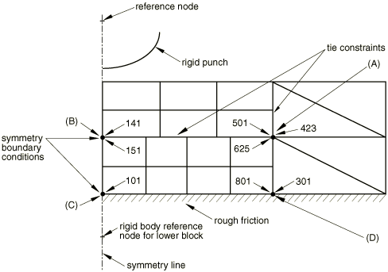

The upper block is built from three separately meshed regions, which are connected together using a surface-based tie constraint. This block is in contact with the lower rigid block, which is made rigid by specifying a rigid body constraint. The rigid block's reference node is fixed. Symmetry boundary conditions are used at the left edge of the upper block, and rough friction is defined for the surface interaction between the upper and lower blocks. The following redundant constraints can be identified:- Intersecting tie constraints: At (A) three nodes share the same location, and their relative motions are constrained by two surface-based tie constraints (one vertical and one horizontal). Only two constraints (two dependent nodes and one independent node) are needed to fully constrain the motion of the three nodes, but three constraints are generated internally (one for the horizontal tie constraint and two for the vertical one). Therefore, one redundant constraint exists.
- Tie constraint and symmetry boundary condition: At (B) nodes 141 and 151 have their motion constrained horizontally by the symmetry boundary condition, but their relative motion is also constrained by the surface-based tie constraint. Therefore, one redundant constraint exists.
- Rough friction and symmetry boundary condition: At (C) node 101 is constrained horizontally by the symmetry boundary condition. The rough friction contact acts in the same direction as the boundary condition. Therefore, one redundant constraint exists.
- Tie constraint and contact interactions: At (D) nodes 801 and 301 are involved in the surface-based tie constraint, but two contact constraints (one at each node) act in the vertical direction. Therefore, one redundant constraint exists.

Even in this simple model the number of redundant constraints is surprisingly large. If not appropriately accounted for, the redundant constraints can lead to convergence difficulties, even nonconvergence. Moreover, in the cases when a solution is obtained (despite the convergence difficulties), the reported reaction forces and contact pressures may be inaccurate.

Abaqus/Standard checks for the inappropriate use of combinations of constraints for the majority of constraint and element types listed in this section. Depending on the complexity of the constraints involved, Abaqus/Standard identifies three classes of consistent and inconsistent overconstraints.

**Overconstraints detected in the model preprocessor**

Many relatively simple overconstraints can be identified by inspecting the constraints defined at a node. If a consistent overconstraint is detected, the unnecessary constraints are eliminated automatically and a warning message is generated. If the overconstraints are inconsistent, the analysis is stopped and an error message is generated.

**Overconstraints detected and resolved in an Abaqus/Standard analysis**

Some overconstraints involving contact interactions may become overconstrained only during an analysis due to changes in contact status. Certain of these cases are detectable and eliminated automatically by Abaqus/Standard. Appropriate messages are issued.

**Overconstraints detected by the equation solver**

Many overconstraints involve complex interactions between various constraint definitions and element types. Automatic resolution of these situations may not be possible. In such cases the equation solver will detect the overconstraint, and a detailed message listing potential causes of the problem will be issued.

### Overconstraints detected in the model preprocessor

In this section we consider overconstraints that involve two or more of the following:
- surface-based tie constraints,
- rigid body constraints,
- boundary conditions, and
- connector elements.

While the number of cases handled automatically in the model preprocessor is limited, many often-encountered situations are corrected. The list of overconstraints to be resolved automatically in the preprocessor is organized based on the constraint types involved. Each case is illustrated by examples.

#### Intersecting tie constraints

Examples of intersecting tie constraint definitions are shown in [Figure 35.6.1--2](pt08ch35s06aus138.md#aoverconstr-intersecting-ties). 

**Figure 35.6.1–2** Consistent overconstraints due to intersecting tie constraints.

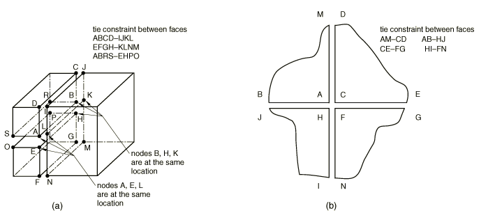

In both cases there is at least one node that, if not properly treated, will be redundantly constrained. In the case on the left, the three edges belonging to the three surfaces overlap (shown here in an exploded view for clarity). Each of the three end nodes on either end occupy the same location. Therefore, one redundant tie constraint exists. In the case shown on the right, four adjacent meshes are “glued” together using four tie constraints. Only three constraints are needed to “glue” the center nodes together, but four are generated (one from each tie constraint). Therefore, one constraint is not needed and in both cases one constraint is removed.

#### Tie constraint inside a rigid body constraint

An example of a tie constraint inside a rigid body constraint is shown in [Figure 35.6.1--3](pt08ch35s06aus138.md#aoverconstr-tie-rigbody)(a). Two surfaces are connected by a tie constraint, and the two element sets are included in the same rigid body. Since the motion of all the nodes is constrained to the motion of the rigid body's reference node, the tie constraint is redundant. The tie constraint definition is removed from the model.

**Figure 35.6.1–3** Consistent overconstraints due to combinations of tie and rigid body constraints.

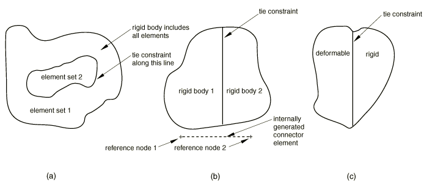

#### Tie constraint between two rigid bodies

An example of a tie constraint between two rigid bodies is shown in [Figure 35.6.1--3](pt08ch35s06aus138.md#aoverconstr-tie-rigbody)(b). If the two surfaces are connected by a tie constraint at more than two or three points (in two- or three-dimensional analyses, respectively), the tie constraint definition is redundant. A connector type BEAM is placed between the two reference nodes, and the tie constraint is removed.

#### Tie constraint between a deformable and a rigid body

An example of connecting a deformable body to a rigid body with a surface-based tie constraint is shown in [Figure 35.6.1--3](pt08ch35s06aus138.md#aoverconstr-tie-rigbody)(c). If the slave surface in the tie constraint definition belongs to the rigid body, the tie and the rigid body constraints are redundant for the slave nodes. If possible, Abaqus/Standard will switch the master and the slave surface in the tie constraint definition. If switching the master and the slave surfaces is not possible due to other modeling restrictions, an error message is issued and the analysis is stopped.

#### Intersecting rigid bodies

[Figure 35.6.1--4](pt08ch35s06aus138.md#aoverconstr-rigbod-in-rigbod)(a) illustrates the case when two rigid bodies partially overlap and, thus, the union of the two bodies behaves as one rigid body. However, the motion of the nodes in this region is governed by the motion of the two rigid body reference nodes; hence, the model is overconstrained. In [Figure 35.6.1--4](pt08ch35s06aus138.md#aoverconstr-rigbod-in-rigbod)(b) several rigid bodies are included in a larger rigid body definition. The nodes belonging to the included bodies will be overconstrained.

**Figure 35.6.1–4** Rigid body including other rigid bodies.

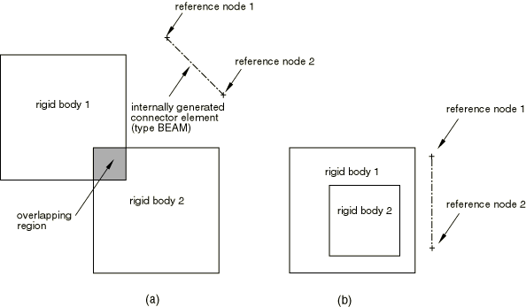

In both cases the rigid body constraint will be enforced only once for the nodes that belong to several rigid bodies. To enforce the rigid behavior of the ensemble, connector elements of type BEAM are generated between the rigid body reference nodes to ensure a rigid connection between the intersecting rigid body definitions.

#### Tie constraints and boundary conditions

There are numerous cases of overconstraints when a surface-based tie constraint and a boundary condition are used together, as illustrated in [Figure 35.6.1--5](pt08ch35s06aus138.md#aoverconstr-tie-and-boundary). 

**Figure 35.6.1–5** Overconstraints involving tie constraints and boundary conditions.

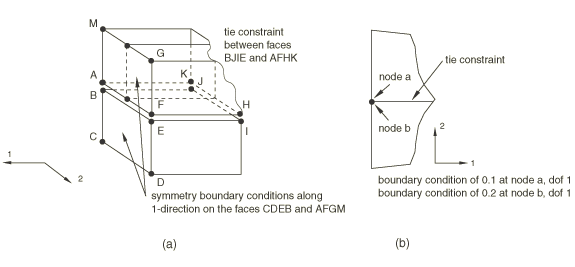

In the first case nodes A and B are constrained to move together by the tie constraint. The vertical symmetry boundary conditions will constrain the motion of both nodes in the horizontal direction, generating one redundant constraint. In the second case the two specified boundary conditions conflict, thus generating a conflicting constraint.

For every tie-dependent node with a boundary condition, Abaqus/Standard first determines which independent nodes are involved in the tie constraint (see ["Mesh tie constraints," Section 35.3.1](pt08ch35s03aus132.md)). If only one independent node is involved, Abaqus/Standard will transfer the boundary conditions from the dependent node to the independent node. If conflicting boundary conditions are detected at the independent node during the transferring process, the analysis is stopped and an error message is issued. If several independent nodes are involved, Abaqus/Standard checks if the specified boundary conditions at all the nodes involved in the constraint are identical. If no conflicts are identified, the boundary conditions at the independent node are redundant and, therefore, ignored. Otherwise, an error message is issued, and the analysis is stopped.

#### Rigid body constraints and boundary conditions

Combinations of rigid body constraints and boundary conditions can lead to overconstrained models when boundary conditions are specified at nodes other than the reference node ([Figure 35.6.1--6](pt08ch35s06aus138.md#aoverconstr-rigbody-and-boundary)). In [Figure 35.6.1--6](pt08ch35s06aus138.md#aoverconstr-rigbody-and-boundary)(a) boundary conditions are specified at several nodes belonging to the rigid body. In [Figure 35.6.1--6](pt08ch35s06aus138.md#aoverconstr-rigbody-and-boundary)(b) symmetry boundary conditions are specified on the flat surface of the rigid body, and the body is spun around an axis perpendicular to the symmetry plane at the reference node.

**Figure 35.6.1–6** Overconstraints due to boundary conditions applied at rigid body nodes.

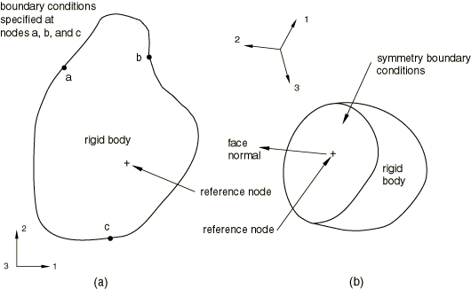

In case (a) if the specified boundary conditions are not consistent with the rigid constraint, the model will be inconsistently overconstrained. In case (b) if the reference node has the symmetry boundary conditions, there is no need to have symmetry boundary conditions at the nodes of the flat surface. Abaqus/Standard will attempt to remove all boundary conditions specified at the dependent nodes and redefine them at the reference node. To do so, the consistency of the boundary conditions specified at the dependent nodes is checked. If the boundary conditions are not identical, an error message is issued and the analysis is stopped (since otherwise the solution of a nonlinear system of equations would be required in the general case to assess whether the boundary conditions are consistent or not). Otherwise, Abaqus/Standard will try to merge the boundary conditions at the dependent nodes with those at the reference node by:
- checking the consistency of the overlapping boundary conditions;
- moving to the reference node any boundary conditions specified at the dependent nodes but not specified at the reference node; and
- applying additional zero rotational boundary conditions at the reference node to compensate for the removed displacement constraints from the dependent nodes.

To illustrate, refer to [Figure 35.6.1--6](pt08ch35s06aus138.md#aoverconstr-rigbody-and-boundary)(b): as the symmetry boundary conditions specified at the dependent nodes are consistent with each other, they are removed from the dependent nodes and applied to the reference node (boundary condition in the 2-direction). In addition, the symmetry constraints preclude rotations about the 1- and 3-directions; therefore, zero rotational boundary conditions are applied to the reference node about these axes.

#### Connector elements and rigid bodies

In most cases detection and automatic resolution of redundant constraints involving connector elements cannot be done by simple inspection of the constraints involved. However, the examples shown in [Figure 35.6.1--7](pt08ch35s06aus138.md#aoverconstr-connect-rigbody) are simple enough to be resolved automatically. It is assumed that the connector elements are connected to nodes on the rigid body whose rotational degrees of freedom are dependent on the rotation of the reference node. In [Figure 35.6.1--7](pt08ch35s06aus138.md#aoverconstr-connect-rigbody)(a) the connector elements are assumed to enforce some kinematic constraints. They are redundant since the rigid body definition constrains the motion of all nodes to the motion of the rigid body's reference node. Abaqus/Standard automatically removes the connector elements from the model. 

**Figure 35.6.1–7** Redundant constraints involving rigid bodies and connector elements.

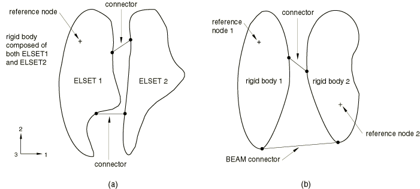

When connector elements are placed between two rigid bodies (as in [Figure 35.6.1--7](pt08ch35s06aus138.md#aoverconstr-connect-rigbody)(b)), the model may be redundantly constrained. As shown in [Figure 35.6.1--7](pt08ch35s06aus138.md#aoverconstr-connect-rigbody)(b), if a connector element of type BEAM (or WELD) is placed between two rigid bodies, the connection is rigid and any additional connector elements between the two rigid bodies are redundant. Abaqus/Standard will automatically remove these redundant connector elements. 

When the ensemble of connector elements placed between two rigid bodies enforces more than the necessary translational and rotational constraints between the two rigid bodies, but none of the connectors is of type BEAM (or WELD), only warning messages are issued to signal the overconstraint situation. In these cases none of the connector elements can be eliminated automatically since the connection between the two rigid bodies may become underconstrained. To illustrate this situation, assume that in [Figure 35.6.1--7](pt08ch35s06aus138.md#aoverconstr-connect-rigbody)(b) the two connectors were of type SLOT and TRANSLATOR. Thus, four translational constraints (in three dimensions) are enforced between the two rigid bodies, rendering the system overconstrained since only three translational constraints are needed to fully constrain the relative translation between the two bodies. However, if the SLOT were eliminated from the model, the model would become underconstrained and different from the original one. Only a warning message is issued in this case.

#### Coupling constraints and rigid bodies

When all or some of the nodes involved in a kinematic coupling constraint belong to the same rigid body, the coupling constraint becomes redundant. The situation is illustrated in [Figure 35.6.1--8](pt08ch35s06aus138.md#aoverconstr-coupling-rigbody). Node 101 is the reference node for the coupling constraint involving nodes 1001–1005. At the same time nodes 1001–1003 are included in the rigid body definition with reference node 102.

**Figure 35.6.1–8** Redundant constraints involving coupling constraints and rigid bodies.

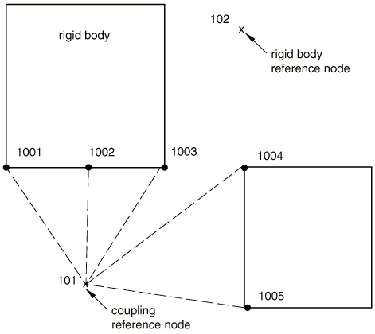

If the coupling constraint was defined as kinematic, it will not be enforced at nodes 1001–1003 to avoid overconstraining the model. The removed overconstraint may be inconsistent such as when incompatible boundary conditions are prescribed at the two reference nodes. However, the constraint will be enforced at nodes 1004 and 1005 since these nodes do not belong to the rigid body.

If a distributing coupling constraint was used instead, the model would not be overconstrained. However, if node 101 was added to the rigid body definition and nodes 1004 and 1005 were not included in the coupling constraint, the model would be overconstrained. Indeed, all nodes involved in the coupling constraint would be already constrained by the rigid body definition, making the coupling constraint redundant. To avoid the overconstraint, Abaqus/Standard will not enforce the coupling constraint in this case.

#### Coupling constraints and boundary conditions

When boundary conditions are specified at all nodes involved in a distributing coupling constraint, the model may become overconstrained. Abaqus/Standard will issue a warning message outlining the cause of the potential overconstraint.

#### Spot welds and rigid bodies

Potential overconstraints that may arise when a rigid body is involved in a mesh-independent spot weld definition are discussed in ["Mesh-independent fasteners," Section 35.3.4](pt08ch35s03aus135.md).

### Overconstraints detected and resolved during analysis

There are numerous situations when contact interactions in combination with other constraint types may lead to overconstraints. Since contact status typically changes during the analysis, it is not possible to detect redundant constraints associated with contact in the model preprocessor. Instead, these checks are performed during the analysis. Due to the complexities associated with contact interactions, only a limited number of redundant constraint cases are resolved automatically.

#### Contact interactions and tie constraints

Redundant constraints are common in cases when slave nodes used in surface-based tie constraints (["Mesh tie constraints," Section 35.3.1](pt08ch35s03aus132.md)) are also slave nodes in contact, as illustrated in [Figure 35.6.1--9](pt08ch35s06aus138.md#aoverconstr-contact-and-tie). In [Figure 35.6.1--9](pt08ch35s06aus138.md#aoverconstr-contact-and-tie)(a) nodes 5 and 9 are connected with a tie constraint, and both are in contact with a master surface. Since the two nodes are tied together, one of the contact constraints is redundant. A similar situation is presented in [Figure 35.6.1--9](pt08ch35s06aus138.md#aoverconstr-contact-and-tie)(b): two mismatched solid meshes are connected with a tie constraint, and contact is defined with a flat rigid surface. Node S is a dependent node in the tie constraint, so its motion is determined by that of nodes B and C. Therefore, any contact constraint applied at node S is redundant. Moreover, the contact constraints at nodes G and H are redundant, since the motion of these nodes is determined by nodes B and C, respectively. 

**Figure 35.6.1–9** Redundant constraints arising from contact interactions and tie constraints.

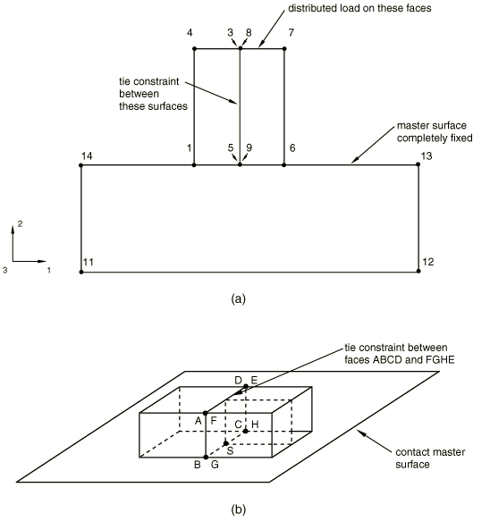

To eliminate these redundancies when all nodes involved in the tie constraint are in contact, Abaqus/Standard will automatically apply a tie-type constraint between the Lagrange multipliers associated with the contact constraint. The redundant contact constraint is eliminated. The contact pressure and the friction forces at the slave node are recovered from the pressures and friction forces at the associated tie-independent nodes.

##### Deleting contact elements to remove overconstraints

Instead of letting Abaqus remove overconstraints by tying Lagrange multipliers, you can apply constraint controls that delete the contact elements associated with tied slave nodes. If you use this technique, contact-related output is not available for the tied slave nodes.

| **Input File Usage: ** | ``` [*CONSTRAINT CONTROLS](../key/key-link.md#usb-kws-hconstraintcontrols), DELETE SLAVE ``` |
| --- | --- |

#### Contact interactions and prescribed boundary conditions

Contact interactions and prescribed boundary conditions may lead to redundant constraints if either normal contact with the default “hard contact” formulation (["Contact pressure-overclosure relationships," Section 37.1.2](pt09ch37s01aus166.md)) or frictional contact with the Lagrange multiplier formulation (see ["Frictional behavior," Section 37.1.5](pt09ch37s01aus169.md)) is invoked. Abaqus/Standard attempts to resolve these types of redundant constraints for contact pairs involving rigid surfaces.

##### Checks related to normal contact interactions

In [Figure 35.6.1--10](pt08ch35s06aus138.md#aoverconstr-contact-normal-bc) the fixed analytical rigid master surface is in contact with a slave node that has a fixed boundary condition specified in the direction normal to the contact surface. If during a particular increment in the analysis the node is in contact, the contact constraint is redundant and will not be enforced during that increment. If the boundary condition at the slave node is in conflict with the boundary conditions at the rigid surface's reference node, an error message is issued and the analysis is stopped. 

**Figure 35.6.1–10** Overconstraints involving normal contact interactions and boundary conditions.

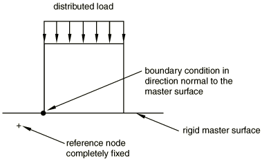

The contact and boundary conditions related to overconstraints are removed automatically only if the master surface is defined as an analytical rigid surface. In all other cases, if an overconstraint occurs during the analysis, a zero pivot message is issued by the equation solver (see below) and the chains of constraints responsible for the overconstraint are clearly outlined.

##### Checks related to Lagrange friction

A common redundant constraint case is depicted in [Figure 35.6.1--11](pt08ch35s06aus138.md#aoverconstr-lagfric-boundary). The symmetry boundary conditions combined with the Lagrange friction are redundant. 

**Figure 35.6.1–11** Lagrange friction and boundary conditions.

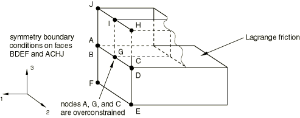

The slave node is in contact and the tangent to the surface is in approximately the same direction as the specified boundary condition at the slave node. To avoid redundancy, at this node Abaqus/Standard will switch from the Lagrange friction formulation to the default penalty formulation (["Frictional behavior," Section 37.1.5](pt09ch37s01aus169.md)) if the motion of the master nodes is prescribed in the tangent direction.

### Overconstraints detected in the equation solver

All overconstraints that cannot be identified and resolved during preprocessing or during the analysis need to be detected by the equation solver. Examples include models with contact interactions where slave nodes are driven by specified boundary conditions into partially fixed rigid surfaces; contact with multiple master surfaces; closed-loop and multiple-loop mechanisms in which rigid bodies are connected by connector elements; and many more. By default, equation solver overconstraint checks are performed continuously during the analysis.

Abaqus/Standard will not resolve overconstraints detected by the equation solver. Instead, detailed messages with information regarding the kinematic constraints involved in the overconstraint will be issued. The message first identifies the nodes involved in either a consistent or an inconsistent overconstraint by using zero pivot information from the Gauss elimination in the solver (["Direct linear equation solver," Section 6.1.5](pt03ch06s01aus46.md)). A detailed message containing constraint information is then issued.

The 4-bar mechanism shown in [Figure 35.6.1--12](pt08ch35s06aus138.md#aoverconstr-hard-to-detect) illustrates this strategy. 

**Figure 35.6.1–12** Hard-to-detect redundant constraints.

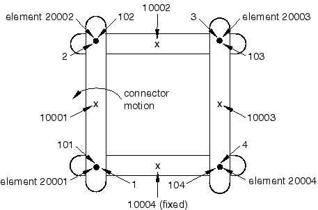

Four three-dimensional rigid bodies are defined as follows: the rigid body with reference node 10001 includes nodes 2 and 101; the rigid body with reference node 10002 includes nodes 3 and 102; the rigid body with reference node 10003 includes nodes 4 and 103; and the rigid body with reference node 10004 includes nodes 1 and 104. The four rigid bodies are connected with four JOIN and REVOLUTE combination connector elements defined as follows: element 20001 between nodes 1 and 101; element 20002 between nodes 2 and 102; element 20003 between nodes 3 and 103; and element 20004 between nodes 4 and 104. Each connector element enforces three translation and two rotation constraints (["Connectors: overview," Section 31.1.1](pt06ch31s01abo28.md)), and all four revolute axis directions are parallel. The bottom rigid body (with reference node 10004) is fixed. The motion of the bottom left REVOLUTE connector (element 20001) is prescribed to rotate the mechanism. 

When Abaqus/Standard attempts to find a solution for this model, three zero pivots are identified in the first increment of the analysis suggesting that there are three constraints too many in the model. Eventually, one would have to remove three constraints to render the model properly constrained. In this simple example a count of the degrees of freedom and constraints confirms the number of overconstraints, as follows. There are four rigid bodies in the model, with a total of 24 degrees of freedom. The reference node 10004 is completely fixed with a boundary condition, constraining six degrees of freedom; and the prescribed connector motion enforces one rotational constraint, constraining one degree of freedom. Hence, there are 17 degrees of freedom remaining. Each of the four connector elements enforces five constraints, for a total of 20 constraints. Thus, there are three constraints too many in the model, which matches the number of zero pivots identified by the equation solver. To help you identify the constraints that should be removed, the following message is produced in the message (`.msg`) file outlining the chains of constraints that generated the overconstraint: 

```
 ***WARNING: SOLVER PROBLEM. ZERO PIVOT WHEN PROCESSING ELEMENT 20004
             INTERNAL NODE 1 D.O.F. 4     

OVERCONSTRAINT CHECKS:  An overconstraint was detected at one of the 
Lagrange multipliers associated with element 20004. There are 
multiple constraints applied directly or chained constraints that 
are applied indirectly to this element. The following is a list of 
nodes and chained constraints between these nodes that most likely 
lead to the detected overconstraint.

LAGRANGE MULTIPLIER: 4 <-> 104: connector element 20004 type 
                     JOIN REVOLUTE constraining 3 translations  
                     and  2 rotations   
..4 -> 10003: *RIGID BODY (or *COUPLING-KINEMATIC)  
....10003 -> 103: *RIGID BODY (or *COUPLING-KINEMATIC)  
......103 -> 3: connector element 20003 type JOIN REVOLUTE 
                constraining 3 translations  and  2 rotations   
........3 -> 10002: *RIGID BODY (or *COUPLING-KINEMATIC)  
..........10002 -> 102: *RIGID BODY (or *COUPLING-KINEMATIC)  
............102 -> 2: connector element 20002 type JOIN REVOLUTE 
                      constraining 3 translations and 2 rotations   
..............2 -> 10001: *RIGID BODY (or *COUPLING-KINEMATIC)  
................10001 -> 101: *RIGID BODY (or *COUPLING-KINEMATIC)  
..................101 -> 1: connector element 20001 type 
                            JOIN REVOLUTE constraining  3 
                            translations  and 2 rotations
....................1 -> 10004: *RIGID BODY (or *COUPLING-KINEMATIC)
......................10004 -> *BOUNDARY in degrees of freedom  
                                1  2  3  4  5  6   
......................10004 -> 104: *RIGID BODY 
                                    (or *COUPLING-KINEMATIC) 
....................1 -> 101: connector element 20001 with 
                              *CONNECTOR MOTION in components  4 

 Please analyze these constraint loops and remove unnecessary 
 constraints.
```

First, the message identifies the user-defined or, in this case, the internally defined (Lagrange multiplier) node at which a zero pivot was identified. A typical line in this output issues information related to one constraint. For example, the first line in this output
```
LAGRANGE MULTIPLIER: 4 <-> 104: connector element 20004 type 
                     JOIN REVOLUTE constraining 3 translations 
                     and  2 rotations   
```

informs you that the Lagrange multiplier on which the zero pivot occurs enforces one of the five constraints (JOIN and REVOLUTE) associated with connector element 20004 between user-defined nodes 4 and 104. Each of the subsequent lines conveys information related to one constraint in the chains of constraints originating at the zero pivot node or in chains adjacent to them. For example, the line 
```
....10003 -> 103: *RIGID BODY (or *COUPLING - KINEMATIC)
```

informs you that there is a rigid body constraint between nodes 10003 and 103, while the line 
```
.....................10004 -> *BOUNDARY in degrees of freedom  
                               1  2  3  4  5  6   
```

states that there is a boundary condition constraint fixing degrees of freedom 1 through 6 at node 10004.

Indentation levels (the dots in front of the node numbers) identify links in a chain of constraints. Each time a constraint is found to link another node in a particular chain, the indentation is increased by two dots and the constraint information is printed out. For example, starting from the top of the message, the Lagrange multiplier is connected to node 4, node 4 is connected to node 10003, node 10003 is connected to node 103, and so on. When the indentation on a certain line is less than or equal to the indentation on the previous line, a chain of constraints has ended on the previous line. For example, a chain has ended on the line 

```
.....................10004 -> *BOUNDARY in degrees of freedom  
                               1  2  3  4  5  6   
```

since the next line has equal indentation. 

Three chains of constraints (in correspondence with the three zero pivots that were found) that most likely generated the overconstraint can be identified in the model above. Starting from the top, one can first identify a chain of constraints that terminates in a boundary condition (ground):

```
Lagrange multiplier: 4 –> 10003 –> 103 –> 3 –> 10002 –> 2 –> 
10001 –> 101 –> 1 –> 10004 –> *BOUNDARY
```

 Since the indentation of the two lines starting with node 10004 is the same, one should expect another chain of constraints to include the constraint output on the second of the two lines. Indeed, one can identify a closed loop of constraints:
```
Lagrange multiplier : 4–> 10003 –> 103 –> 3 –> 10002 –> 2 –> 
10001 –> 101 –> 1 –> 10004 –> 104 <-> 4 
```

 Finally, since the two lines starting with node 1 have the same indentation, one expects that a separate chain of constraints will include the last line in the output. A third (closed) loop 
```
101 –> 1 –> 101
```

 is identified. 

If the chains of constraints terminate in a free end (not ending in a constraint), the chain does not have any contribution in generating the overconstraint. There are no such chains in this example.

#### Correcting an overconstrained model

A node set containing all the nodes in the chains of constraints associated with a particular zero pivot is generated automatically and can be displayed in the Visualization module of Abaqus/CAE.

There is no unique way to remove the overconstraints in this model. For example, if one JOIN and REVOLUTE (five constraints) combination is replaced with a SLOT connector element, which enforces only the two translation constraints in the plane of the mechanism, there are no redundancies. Alternatively, you could remove the REVOLUTE from one of the connector elements and also use a SLOT connection instead of a JOIN in one of the other connector elements.

Another alternative is to relax some of the constraints. In the example outlined here, an elastic body could replace one or more of the rigid bodies. You could also relax the Lagrange multiplier-based constraints (e.g., JOIN or REVOLUTE) by using CARTESIAN and CARDAN connection types with appropriate elastic stiffnesses (see ["Connector behavior," Section 31.2.1](pt06ch31s02alm27.md)).

After analyzing the chains of constraints, you have to decide which constraints have to be removed to render the model properly constrained and also best fit the modeling goals. For this example the three constraints cannot be removed randomly. Removing any three combinations of the six boundary conditions, for example, would make the problem worse: the model is still overconstrained, and three rigid body modes have been added to the model. Moreover, you should remove the constraints that do not affect the kinematics of the model. For example, you cannot completely remove a JOIN connection from any of the connector elements since the model would be different from that originally intended. 

### Controlling the overconstraint checks

By default, Abaqus/Standard will attempt to remove as many redundant constraints as possible, as discussed in the sections above. When it is not possible to remove a redundant constraint or an inconsistent overconstraint is detected, a detailed message is issued identifying the constraints contributing to the overconstraint. You can modify this default behavior by prescribing constraint controls for the model or the step.

Overconstraints may produce damaging and unpredictable behavior. Therefore, it is strongly recommended that overconstraint checking be used in both the preprocessor and during the analysis at least during the first running of a model. Furthermore, it is recommended that the original model be changed to correct any overconstraints identified by Abaqus/Standard. Only after establishing confidence that the model is free of overconstraints should constraint checks be turned off. The only advantage of turning off the constraint checks is a minor speedup of the analysis.

#### Bypassing the overconstraint checks

The overconstraint checks performed during input file preprocessing and during the analysis can be bypassed. Bypassing these checks is not recommended, as it may allow a model with overconstraints to enter into the analysis code. Bypassing the overconstraint checks is not step dependent; i.e., the setting is defined as model data and affects the entire analysis.

| **Input File Usage: ** | ``` [*CONSTRAINT CONTROLS](../key/key-link.md#usb-kws-hconstraintcontrols), NO CHECKS ``` |
| --- | --- |

#### Preventing automatic redundant constraint resolution

Automatic model modifications in the model preprocessor can be prevented. In this case Abaqus/Standard will still perform overconstraint checks, but no automatic redundant constraint resolution will be performed; only appropriate error messages will be issued. Preventing constraint resolution is not step dependent; i.e., the setting is defined as model data and affects the entire analysis.

| **Input File Usage: ** | ``` [*CONSTRAINT CONTROLS](../key/key-link.md#usb-kws-hconstraintcontrols), NO CHANGES ``` |
| --- | --- |

#### Changing the frequency of the overconstraint checks

By default, the overconstraint checks are performed at every increment during the analysis. You can modify the frequency of these checks (in increments) for each step in the analysis. If the frequency is set equal to zero, no overconstraint checks are performed during that analysis step. The frequency specification is maintained in subsequent steps until the value is reset.

| **Input File Usage: ** | ``` [*CONSTRAINT CONTROLS](../key/key-link.md#usb-kws-hconstraintcontrols), CHECK FREQUENCY=*n* ``` |
| --- | --- |

#### Stopping the analysis when overconstraints are detected

By default, the analysis continues even though an overconstraint is detected. This behavior can be changed on a step-dependent basis. The analysis can be stopped the first time an overconstraint is detected in a step, or it can be stopped only if a converged solution is obtained despite the fact that overconstraints exist. This setting is maintained in subsequent steps until it is reset.

| **Input File Usage: ** | Use one of the following options: |
| --- | --- |
|  | ``` [*CONSTRAINT CONTROLS](../key/key-link.md#usb-kws-hconstraintcontrols), TERMINATE ANALYSIS=FIRST OCCURRENCE [*CONSTRAINT CONTROLS](../key/key-link.md#usb-kws-hconstraintcontrols), TERMINATE ANALYSIS=CONVERGED ``` |


