# 37.1.9 Breakable bonds


**Product: **Abaqus/Explicit  

##### **References**

- ["Contact formulations for contact pairs in Abaqus/Explicit," Section 38.2.2](pt09ch38s02aus181.md)
- [*BOND](../key/key-link.md#usb-kws-hbond)
- [*SURFACE INTERACTION](../key/key-link.md#usb-kws-hsurfaceinteraction)
- [*CONTACT PAIR](../key/key-link.md#usb-kws-hcontactpair)

### Overview

Breakable bonds, such as spot welds, between surfaces:
- can be defined only at the nodes of the slave surface of a pure master-slave contact pair;
- can be defined only in the first step of a simulation;
- constrain the slave node to the master surface until the failure criterion of the bond is met;
- are designed to provide a simple simulation of spot weld failure under relatively monotonic straining, such as occurs during an impact of a vehicle structure;
- do not constrain the rotational degrees of freedom at the node;
- use either a time to failure or a damaged failure model to simulate the postfailure response of the bonds;
- use the default contact property model (["Mechanical contact properties: overview," Section 37.1.1](pt09ch37s01aus165.md)) once the bonds have been broken; and
- can be used only between two deformable surfaces with the kinematic contact pair algorithm.

### Specifying spot welds for a contact pair

A contact pair that contains spot welds must be a pure master-slave contact pair; therefore, spot welds cannot be used with single-surface contact. If the contact pair consists of two deformable surfaces, Abaqus/Explicit would normally use a balanced master-slave contact pair. In such situations you must specify a weighting factor (see ["Contact formulations for contact pairs in Abaqus/Explicit," Section 38.2.2](pt09ch38s02aus181.md)) to define a pure master-slave contact pair. Contact pairs containing spot welds must be defined in the first step of a simulation. The spot welds are located at the nodes of the slave surface of the contact pair.

Spot welds can also be modeled more accurately using fasteners instead of breakable bonds. Fasteners have the advantage of being mesh independent in their definition and are convenient for defining point-to-point connections between two or more surfaces with the capability to model plasticity, damage, and failure behavior. However, fasteners are intended to be used in three dimensions; therefore, the fastener method cannot be used to specify spot welds for contact pairs in a two-dimensional case. If non-breakable bonds (rigid spot welds) are to be modeled, it is recommended that you use the mesh-independent spot weld feature (["Mesh-independent fasteners," Section 35.3.4](pt08ch35s03aus135.md)).

All of the slave nodes which are bonded to a master surface can be grouped together into a node set.

| **Input File Usage: ** | Use all of the following options: |
| --- | --- |
|  | ``` [*CONTACT PAIR](../key/key-link.md#usb-kws-hcontactpair), MECHANICAL CONSTRAINT=KINEMATIC, INTERACTION=*interaction_property_name* [*SURFACE INTERACTION](../key/key-link.md#usb-kws-hsurfaceinteraction), NAME=*interaction_property_name* [*BOND](../key/key-link.md#usb-kws-hbond) *node_set_name*, … ``` |

### Adjustments to the initial positions of the bonded nodes

Nodes that are bonded to a master surface with spot welds should be defined so that they contact the surface in the model's initial configuration. If the bonded nodes are not in contact initially, Abaqus/Explicit will enforce the bonded constraint by prescribing strain-free displacements to those nodes. The nodes will begin the simulation exactly in contact with the master surface. If the spot welds are defined incorrectly, this automatic adjustment of the nodes may cause the analysis to end immediately as a result of excessive initial distortion of elements that are connected to the bonded nodes.

### Forces carried by a spot weld

Abaqus assumes that a spot weld carries a force normal to the surface onto which the node is welded, , and two orthogonal shear forces tangent to the surface, , . The magnitude of the resultant shear force, 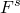, is defined as 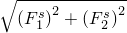. The normal force is positive in tension.

A spot weld is assumed to be so small that it carries no moments or torque. As a result, spot welds do not impose any constraints on rotational degrees of freedom.

### Defining the failure criterion for the spot welds

The failure criterion for a spot weld is defined as 


where


is the force required to cause failure in tension (Mode I loading),


is the force required to cause failure in pure shear (Mode II loading), and

 and 

are defined above.

A typical yield surface for spot welds is shown in [Figure 37.1.9--1](pt09ch37s01aus173.md#aspotweld-yield-typical). 

**Figure 37.1.9–1** Typical yield surface for spot welds.

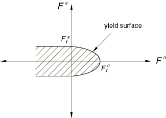

By specifying a very large value for either  or , the yield criteria of the spot welds can be made independent of either shear forces or normal forces, as shown in [Figure 37.1.9--2](pt09ch37s01aus173.md#aspotweld-yield-degen).

**Figure 37.1.9–2** Degenerate yield surfaces for spot welds.


| **Input File Usage: ** | ``` [*BOND](../key/key-link.md#usb-kws-hbond) *node_set_name*, ,  ``` |
| --- | --- |

Spot weld forces sometimes exhibit significant noise, which can cause the spot weld to reach its failure criterion when a filtered solution of the spot weld forces would still be well within the strength limits of the spot weld. This is characterized by a noisy time history of the BONDSTAT variable and can correspond to an unrealistically early onset of failure of a spot weld. Two models for deterioration of a spot weld after the onset of failure are discussed below: a time to failure model and a postfailure damage model. With the time to failure model a single, spurious spike in the constraint force history that just exceeds the spot weld strength will lead to complete failure of the spot weld. The postfailure damage model may mitigate the effects of noise in the spot weld force.

### Defining the postfailure behavior of the spot welds

Once the constraint forces on a spot weld exceed the failure criterion, the spot weld fails and deteriorates until the weld is broken completely. The behavior of the spot weld during this deterioration process can be simulated using either a damaged failure model or by linearly reducing the constraint forces to zero over a specified time period. With either model, the applied constraint forces from a spot weld are limited by the size of the yield surface as defined by the failure criterion. Deterioration of the spot weld is modeled by shrinking the yield surface to zero while retaining its original shape.

If the predicted constraint forces exceed the yield surface, the applied forces are calculated using a radial flow rule to return to the yield surface.

After complete failure, the node behaves like the rest of the slave nodes in the contact pair. The node may recontact the master surface, but the weld plays no further role.

#### Defining the time to failure model

You specify the time to failure, 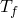, which is the time required for the spot weld to fail completely after the initial failure criterion has been exceeded. Once failure is detected, the weld constraint is relaxed linearly over the time . Abaqus/Explicit shrinks the yield surface to zero over the time period : 

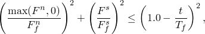

where *t* is the time since Abaqus/Explicit detected initial failure of the weld.

| **Input File Usage: ** | ``` [*BOND](../key/key-link.md#usb-kws-hbond) *node_set_name*, , , ,  ``` |
| --- | --- |

#### Defining the postfailure damage model

As stated above, if the predicted constraint forces exceed the failure criterion, the forces carried by the spot weld are calculated using a radial flow rule to return to the yield surface. Since the forces in the weld in this case are less than the constraint forces required to constrain the welded node on the master surface, the welded node will move relative to the master surface. The work expended during this relative motion is used to determine how the yield surface degrades.

During failure the behavior of the weld is assumed to be such that any stretching of the weld in the normal direction, or any shearing of the weld, dissipates energy. Abaqus/Explicit assumes a linear force-displacement relationship after failure, thus resulting in the behaviors sketched in [Figure 37.1.9--3](pt09ch37s01aus173.md#aspotweld-postfailure) when the weld is subjected to pure Mode I or pure Mode II loading. 

**Figure 37.1.9–3** Typical postfailure behavior in pure tension/compression (Mode I) and in pure shear (Mode II).


More general loadings create combinations of these responses.

You define the amount of energy that the weld can dissipate in Mode I and Mode II by specifying the breakage displacements in the normal and shear directions under pure Mode I and Mode II loading,  and .

Using these linear force-displacement relationships, the failure criterion for the damaged failure model is 

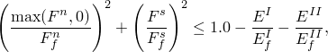

where


is the energy expended in Mode I;


is the energy expended in Mode II;

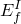

is the breakage energy in Mode I, which is calculated as ; and

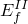

is the breakage energy in Mode II, which is calculated as 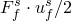.

| **Input File Usage: ** | ``` [*BOND](../key/key-link.md#usb-kws-hbond) *node_set_name*, , , , , ,  ``` |
| --- | --- |

#### Post-yield surface interactions in spot welds

Any friction, contact damping, or softening defined at the spot weld will not affect the analysis until the weld is broken completely; i.e., until the failure surface has shrunk to zero.

### Bead size of the spot weld

The initial bead size of the spot weld, 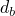, is taken into account by offsetting the slave surface node associated with the spot weld from the master surface by an amount equal to the bead size during the penetration calculations. A master or slave surface defined on shell or membrane elements is itself offset from the midplane of the element by the half-thickness of the shell or membrane.

If the damaged failure model is chosen to characterize the postfailure behavior, the size of the spot weld bead may grow due to tensile yielding of the spot weld. The size of the spot weld is equal to the sum of  and the 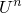 accumulated after the failure of the spot weld. After the weld has broken, the size of the bead at breakage is taken into account for subsequent contact between the weld node and the master surface.

### Available output for spot welds

You can examine the forces carried by spot welds in Abaqus/CAE by generating a vector plot of the reaction forces on the surface (output variable CFORCE). Two output variables specifically related to spot welds, the bond status and bond load, are available for use in Abaqus/CAE. These variables can be written as history output to the output database (`.odb`) file. They can be used in *X–Y* plots in Abaqus/CAE.

#### Definition of bond status

The bond status (output variable BONDSTAT) is a measure of how close a spot weld is to complete failure. The bond status varies between 0.0 and 1.0 and is defined to be 

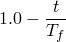

if the time to failure postfailure model is chosen or 

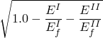

if the damaged failure model is chosen. With either model, the bond status is equal to 1.0 before the spot weld fails.

#### Definition of bond load

The bond load (output variable BONDLOAD) is a measure of how close the current constraint forces at a spot weld are to its failure surface. The value of the bond load also varies between 0.0 and 1.0 and is defined to be 

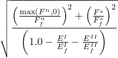

if the damaged failure model is chosen. For the time to failure model, the bond load is defined to be 

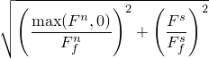

prior to failure. Then, the bond load is 1.0 from the moment of first yield until total failure, at which point the bond load becomes 0.0.

#### Example: Spot welds and output requests

The spot-welded nodes in node set `WELDS` are a subset of the nodes on surface *A*, which is the slave surface of the pure master-slave contact pair.

```
[*NSET](../key/key-link.md#usb-kws-mnset), NSET=WELDS
*node set definition*
[*CONTACT PAIR](../key/key-link.md#usb-kws-hcontactpair), MECHANICAL CONSTRAINT=KINEMATIC, 
INTERACTION=A TO B, WEIGHT=0.
*slave surface A, master surface B*
[*SURFACE INTERACTION](../key/key-link.md#usb-kws-hsurfaceinteraction), NAME=A TO B
[*BOND](../key/key-link.md#usb-kws-hbond)
WELDS, , , , , , 
[*OUTPUT](../key/key-link.md#usb-kws-houtput), HISTORY, TIME INTERVAL=0.001
[*CONTACT OUTPUT](../key/key-link.md#usb-kws-hcontactoutput), NSET=WELDS
BONDSTAT, BONDLOAD
```

Here  must be specified if the time to failure model is used, or  and  must be specified if the damaged failure model is chosen.


