# 41.1.1 Cavity radiation


**Products: **Abaqus/Standard  Abaqus/CAE  

##### **References**

- ["Defining an analysis," Section 6.1.2](pt03ch06s01abo05.md)
- ["Heat transfer analysis procedures: overview," Section 6.5.1](pt03ch06s05abo08.md)
- [*CAVITY DEFINITION](../key/key-link.md#usb-kws-mcavitydef)
- [*COUPLED THERMAL-ELECTRICAL](../key/key-link.md#usb-kws-hthermalelectric)
- [*CYCLIC](../key/key-link.md#usb-kws-hcyclicsym)
- [*EMISSIVITY](../key/key-link.md#usb-kws-memissivity)
- [*HEAT TRANSFER](../key/key-link.md#usb-kws-hheattrans)
- [*MOTION](../key/key-link.md#usb-kws-hmotion)
- [*PERIODIC](../key/key-link.md#usb-kws-hperiodicsym)
- [*PHYSICAL CONSTANTS](../key/key-link.md#usb-kws-mphysicalconsts)
- [*RADIATION FILE](../key/key-link.md#usb-kws-hradfile)
- [*RADIATION PRINT](../key/key-link.md#usb-kws-hradprint)
- [*RADIATION OUTPUT](../key/key-link.md#usb-kws-hradiationoutput)
- [*RADIATION SYMMETRY](../key/key-link.md#usb-kws-hradsymmetry)
- [*RADIATION VIEW FACTOR](../key/key-link.md#usb-kws-hradviewfactor)
- [*REFLECTION](../key/key-link.md#usb-kws-hreflectionsym)
- [*SURFACE](../key/key-link.md#usb-kws-msurface)
- [*SURFACE PROPERTY](../key/key-link.md#usb-kws-msurfaceprop)
- [*VIEW FACTOR OUTPUT](../key/key-link.md#usb-kws-hviewfactout)
- ["Cavity radiation," Section 2.11.4 of the Abaqus Theory Guide](../stm/stm-link.md#stm-anl-cavradiation)
- ["Defining a cavity radiation interaction," Section 15.13.21 of the Abaqus/CAE User's Guide](../usi/usi-link.md#usi-itn-help-cavityrad)
- ["Defining a cavity radiation interaction property," Section 15.14.3 of the Abaqus/CAE User's Guide](../usi/usi-link.md#usi-itn-help-prop-cavity-radiation)

### Overview

Abaqus/Standard provides a cavity radiation capability for modeling heat transfer effects due to radiation in enclosures. This cavity radiation functionality:
- can be included in heat transfer analysis problems without deformation (["Uncoupled heat transfer analysis," Section 6.5.2](pt03ch06s05at18.md), and ["Coupled thermal-electrical analysis," Section 6.7.3](pt03ch06s07at22.md));
- is provided for two-dimensional, three-dimensional, and axisymmetric cases;
- accounts for symmetries, surface blocking, and surface motion within cavities; and
- can include closed cavities or open cavities (implying that some radiation takes place to an exterior medium).

Cavity radiation equations are not symmetric; therefore, the nonsymmetric matrix storage and solution scheme is invoked automatically in models that include cavity radiation (see ["Cavity radiation," Section 2.11.4 of the Abaqus Theory Guide](../stm/stm-link.md#stm-anl-cavradiation), and ["Defining an analysis," Section 6.1.2](pt03ch06s01abo05.md)). Each cavity defines a view factor matrix involving the geometric relations between the surfaces in the enclosure. These matrices may be updated a number of times during the analysis (due to moving surfaces in the cavity). Therefore, large cavity radiation problems may be computationally expensive. Instead, you should consider using:- gap radiation (see ["Thermal contact properties," Section 37.2.1](pt09ch37s02aus174.md)) for modeling radiation between closely spaced surfaces;
- average-temperature radiation conditions for modeling enclosures that are approximately isothermal, with constant emissivity, and do not require blocking or reflection considerations (see ["Thermal loads," Section 34.4.4](pt07ch34s04aus123.md)); or
- parallel cavity decomposition for parallel calculation of view factors and solution of the radiative heat transfer equations (see ["Decomposing large cavities in parallel](pt09ch41s01aus187.md#usb-cni-acavityradiation-parallel)" below).

### Defining a cavity radiation problem

Since cavity radiation effects are calculated only in heat transfer and coupled thermal-electrical procedures, the only kind of thermal-stress analysis that can include these effects is sequentially coupled thermal-stress analysis (see ["Sequentially coupled thermal-stress analysis," Section 16.1.2](pt04ch16s01at39.md)). Moreover, unless you allow cavity parallel decomposition (see ["Decomposing large cavities in parallel](pt09ch41s01aus187.md#usb-cni-acavityradiation-parallel)” below), there is a software limit of 16,000 nodes and facets in Abaqus/Standard.

#### Model definition

When you define the model for a cavity radiation problem, you must:

1. define all of the surfaces in the cavity (see ["Defining surfaces](pt09ch41s01aus187.md#usb-cni-acavityradiation-definesurfaces)");
2. define the radiation properties of each surface (i.e., the emissivity) and the physical constants (see ["Defining surface radiation properties](pt09ch41s01aus187.md#usb-cni-acavityradiation-surfprops)"); and
3. construct cavities from the surfaces (see ["Constructing a cavity](pt09ch41s01aus187.md#usb-cni-acavityradiation-constructcavity)").

#### History definition

In the first step of a cavity radiation analysis you must associate with each cavity a radiation view factor definition, which controls the calculation of view factors for the cavity. You then may:

1. define cavity symmetries, if any (see ["Defining cavity symmetries](pt09ch41s01aus187.md#usb-cni-acavityradiation-cavsymm)");
2. prescribe the motion of surfaces (see ["Prescribing motion during a cavity radiation analysis](pt09ch41s01aus187.md#usb-cni-acavityradiation-prescribemotion)");
3. define boundary conditions such as temperature and forced convection (see ["Boundary conditions](pt09ch41s01aus187.md#usb-cni-acavityradiation-bc)");
4. control the cavity radiation and view factor calculations in each step (the specifications from the previous step are used if they are not redefined in a step; see ["Controlling view factor calculation during the analysis](pt09ch41s01aus187.md#usb-cni-acavityradiation-viewfactorcalc)");
5. request output of heat transfer variables to the data and results files (see ["Requesting surface variable output](pt09ch41s01aus187.md#usb-cni-acavityradiation-outputvars)"); and
6. request output of the radiation view factor matrices (see ["Writing the view factor matrices to the results file](pt09ch41s01aus187.md#usb-cni-acavityradiation-viewfactoroutput)").

If any of the above are included in your analysis, they must be defined within a heat transfer or coupled thermal-electrical step definition.

### Defining surfaces

Cavities are defined in Abaqus/Standard as collections of surfaces, which are composed of facets. In axisymmetric and two-dimensional cases a facet is a side of an element; in three-dimensional cases a facet is a face of a solid element or a surface of a shell element. Rigid surfaces cannot be used in cavity radiation problems.

Surfaces are defined as described in ["Element-based surface definition," Section 2.3.2](pt01ch02s03aus17.md). You may associate each surface with a surface property definition as part of the surface option, or you may associate surfaces with surface properties as part of the cavity definition option. The surface properties are defined as described below.

| **Input File Usage: ** | Use the following option to define a surface with a surface property for use in a cavity radiation analysis: |
| --- | --- |
|  | ``` [*SURFACE](../key/key-link.md#usb-kws-msurface), TYPE=ELEMENT, NAME=*surface_name*, PROPERTY=*property_name* ``` Use the following option to define a surface for use in a cavity radiation analysis in which surface properties are defined as part of the cavity definition: ``` [*SURFACE](../key/key-link.md#usb-kws-msurface), TYPE=ELEMENT, NAME=*surface_name* ``` |

| **Abaqus/CAE Usage: ** | Interaction module: **Create Interaction**: **Cavity radiation**: select the initial surface region |
| --- | --- |

#### Restrictions

Surfaces that are associated with cavity radiation are subject to the following restrictions in addition to the general surface definition restrictions outlined in ["Element-based surface definition," Section 2.3.2](pt01ch02s03aus17.md):
- Surfaces cannot overlap because of the ambiguity that would result in the associated property definitions and in the blocking specification.
- A surface can be used only in one cavity definition (the same surface cannot appear in two different cavities).

In addition, the three-dimensional quadrilateral facets should be as close to planar as possible; otherwise, the quality of the view factor calculations will be compromised. 

#### Controlling spurious spatial oscillations

The radiation flux for each facet is calculated based on the average of the nodal temperatures on that facet (see ["Cavity radiation," Section 2.11.4 of the Abaqus Theory Guide](../stm/stm-link.md#stm-anl-cavradiation)). This value of radiation flux is then distributed to each node in proportion to its area. Consequently, the mesh must be sufficiently fine that temperature differences across elements are small. Otherwise, computed fluxes at nodes with temperatures above the facet average will be excessively low, and the fluxes at nodes with below-average temperatures will be too high. This tends to induce a spatially oscillatory solution. This effect can be eliminated by reducing the element size in the vicinity of high temperature gradients.

### Defining surface radiation properties

Cavity radiation problems are intrinsically nonlinear, due to the dependence of the radiative flux on the fourth power of the facet temperature. Further, nonlinearity can be introduced by describing the emissivity, , as a function of temperature. 

#### Defining the emissivity

Emissivity is a dimensionless quantity with a value that is greater than or equal to zero and less than or equal to one. A value of 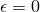 corresponds to all radiation being reflected by the surface. A value of 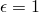 corresponds to black body radiation, where all radiation is absorbed by the surface. You can define the emissivity, , of a surface as a function of temperature and other predefined field variables.

You must assign a name to the surface property that defines the emissivity.

| **Input File Usage: ** | Use both of the following options to define the emissivity of a surface: |
| --- | --- |
|  | ``` [*SURFACE PROPERTY](../key/key-link.md#usb-kws-msurfaceprop), NAME=*property_name* [*EMISSIVITY](../key/key-link.md#usb-kws-memissivity) ``` The [*EMISSIVITY](../key/key-link.md#usb-kws-memissivity) option must appear directly after the [*SURFACE PROPERTY](../key/key-link.md#usb-kws-msurfaceprop) option in the model definition section of the input file. If black body radiation is being defined (), the following option can be used in the step definition to improve efficiency: ``` [*RADIATION VIEW FACTOR](../key/key-link.md#usb-kws-hradviewfactor), REFLECTION=NO ``` |

| **Abaqus/CAE Usage: ** | Use the following input to define gray body radiation: |
| --- | --- |
|  | Interaction module: **Create Interaction Property**: **Cavity radiation**: enter the emissivity () You can define the emissivity as a function of temperature and/or field variables. Use the following input to define black body radiation: Interaction module: **Create Interaction**: **Cavity radiation**: **Use heat reflection**: **No** |

##### Controlling the accuracy of temperature-dependent emissivity changes

Abaqus/Standard evaluates the emissivity, , based on the temperature at the start of each increment and uses that emissivity value throughout the increment. When emissivity is a function of temperature or field variables, you can control the time incrementation for the heat transfer or coupled thermal-electrical step by specifying the maximum allowable emissivity change during an increment, 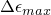. If this tolerance is exceeded, Abaqus/Standard will cut back the increment size until the maximum change in emissivity is less than the specified value. If you do not specify a value for , a default value of 0.1 is used.

| **Input File Usage: ** | Use either of the following options: |
| --- | --- |
|  | ``` [*HEAT TRANSFER](../key/key-link.md#usb-kws-hheattrans), MXDEM= [*COUPLED THERMAL-ELECTRICAL](../key/key-link.md#usb-kws-hthermalelectric), MXDEM= ``` |

| **Abaqus/CAE Usage: ** | Step module: **Create Step**: **Heat transfer** or **Coupled thermal-electric**: **Incrementation**: **Automatic**: **Max. allowable emissivity change per increment**:  |
| --- | --- |

#### Defining the Stefan-Boltzmann constant and value of absolute zero

You must define the Stefan-Boltzmann constant, , and the value of absolute zero, ; there are no default values for these constants.

| **Input File Usage: ** | ``` [*PHYSICAL CONSTANTS](../key/key-link.md#usb-kws-mphysicalconsts), STEFAN BOLTZMANN=, ABSOLUTE ZERO= ``` |
| --- | --- |
|  | This option can appear anywhere in the model definition portion of the input file. |

| **Abaqus/CAE Usage: ** | Any module: ****Model****Edit Attributes*****model_name*****. Enter values for **Absolute zero temperature** and **Stefan-Boltzmann constant** |
| --- | --- |

### Constructing a cavity

You construct cavities as collections of the surfaces defined as described above. Each surface can be used only in one cavity definition. Each cavity must have a unique name; this name is used to specify view factor calculations. The cavity name can also be used to request output.

#### Setting surface properties

By default, a cavity is assumed to consist of surfaces for which surface properties have already been defined. Instead, you may define surface properties as part of the cavity definition.

| **Input File Usage: ** | Use the following option to construct a cavity: |
| --- | --- |
|  | ``` [*CAVITY DEFINITION](../key/key-link.md#usb-kws-mcavitydef), NAME=*cavity_name*, SET PROPERTY *surface name*, *surface property name* ``` By using the SET PROPERTY parameter, you define the surface properties used in the cavity, overriding any property defined as part of the surface option. |

| **Abaqus/CAE Usage: ** | Interaction module: **Create Interaction**: **Cavity radiation**: select the surface region. Use the **Properties** table to add or edit surfaces and cavity radiation interaction properties (emissivity). |
| --- | --- |

#### Creating a closed cavity

By default, a cavity is assumed to be closed.

| **Input File Usage: ** | Use the following option to construct a closed cavity: |
| --- | --- |
|  | ``` [*CAVITY DEFINITION](../key/key-link.md#usb-kws-mcavitydef), NAME=*cavity_name* ``` |

| **Abaqus/CAE Usage: ** | Interaction module: **Create Interaction**: **Cavity radiation**: **Definition**: **Closed** |
| --- | --- |

#### Creating an open cavity

You can specify an open cavity by defining the reference temperature of the external medium. This ambient temperature value is converted to an absolute temperature scale based on the definition of absolute zero. You can verify the degree of opening in the cavity by specifying a tolerance for the accuracy of the view factor calculations; radiation to the external medium will take place only if the deviation of the sum of the view factors from unity is more than this tolerance. See ["Controlling the accuracy of view factor calculations](pt09ch41s01aus187.md#usb-cni-acavityradiation-viewfactor-vtol)” below for details.

| **Input File Usage: ** | Use the following option to create an open cavity: |
| --- | --- |
|  | ``` [*CAVITY DEFINITION](../key/key-link.md#usb-kws-mcavitydef), NAME=*cavity_name*, AMBIENT TEMP= ``` |

| **Abaqus/CAE Usage: ** | Interaction module: **Create Interaction**: **Cavity radiation**: **Definition**: **Open**, **Ambient temperature**: 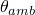 |
| --- | --- |

##### Creating a cavity with multiple openings or complex ambient conditions

The open cavity definition allows for a cavity with a single opening into an ambient environment with a single, constant temperature value. If the cavity has multiple openings or the ambient temperature is not constant, you should model the surroundings differently.

You should close any cavity openings with elements, and prescribe the temperatures of the external media on these elements. Since the cavity is now closed, you should not specify an ambient temperature with the cavity definition. The temperature definition that you use for the closing elements provides the ambient temperature, and it allows you to specify different temperatures, including variable temperatures, at the cavity openings. The elements modeling the external media should not share nodes with the cavity elements (so that conduction will not take place between them). The surfaces defined by the external media elements should have an emissivity of 1.

### Decomposing large cavities in parallel

By default, Abaqus/Standard uses a single working thread for the calculation of the view factor matrix and solution of the radiative heat transfer equations (see ["Cavity radiation," Section 2.11.4 of the Abaqus Theory Guide](../stm/stm-link.md#stm-anl-cavradiation)). This method is robust and works well for small cavities composed of hundreds of facets, but it becomes inefficient and computationally expensive for large cavities composed of thousand of facets. Moreover, the memory requirements for these cavities may be prohibitively large for a single computational node (the view factor matrix is the size of the number of facets squared). In these cases you should consider allowing Abaqus/Standard to decompose the cavity among all CPUs during view factor calculations and solution of the radiative heat transfer equations. 

| **Input File Usage: ** | Use the following option to activate cavity parallel decomposition: |
| --- | --- |
|  | ``` [*CAVITY DEFINITION](../key/key-link.md#usb-kws-mcavitydef), NAME=*cavity_name*, PARALLEL DECOMPOSITION=ON ``` |

| **Abaqus/CAE Usage: ** | Cavity parallel decomposition is not supported in Abaqus/CAE. |
| --- | --- |

#### Solving radiative heat transfer equations in parallel

Abaqus/Standard uses an iterative solution technique for obtaining the radiative heat fluxes when cavity parallel decomposition is enabled. This technique is based on Krylov methods, employs a preconditioner, and uses only MPI-based parallelization (see ["Parallel execution in Abaqus/Standard," Section 3.5.2](pt01ch03s05aus33.md) for details). This iterative technique is used only to solve the cavity radiation equations and does not require user intervention. You may still opt to use the either the iterative or direct sparse solvers for the solution of the heat transfer finite element equations.

#### Convergence of models with decomposed cavities

The exact cavity radiation equations are solved whether parallel decomposition is allowed or not; however, when parallel decomposition is active, Abaqus/Standard may require more iterations to obtain a solution. This slower rate of convergence comes from an approximation to the Jacobian (the linearization of the radiation fluxes) that is based on small changes of the irradiation (any part not due to emission from the surface). Models involving surfaces with low emissivities and steady-state analyses might be especially affected. If you encounter convergence problems with parallel decomposed cavities, you may consider
- changing the analysis from steady-state to transient (["Uncoupled heat transfer analysis," Section 6.5.2](pt03ch06s05at18.md)); or
- allowing more solver iterations per time increment (["Convergence criteria for nonlinear problems," Section 7.2.3](pt03ch07s02aus51.md)).

#### Kinematic constraints on models with decomposed cavities

Kinematic constraints (for example, coupling constraints, linear constraint equations, multi-point constraints, or surface-based tie constraints) can be applied to any node or surface belonging to a cavity where parallel decomposition is allowed. However, the nodes or surfaces must be the independent (master) nodes or surfaces in the constraint definition.

### Defining cavity symmetries

Taking advantage of geometric symmetry can reduce computational model size and simulation time. Instead of modeling all of the parts or components in a symmetric assembly, you can model a smaller repeated component and take symmetry into account in the definition of the cavity radiation interaction. In Abaqus/Standard cavity definitions with defined symmetries take into account the radiation interactions between each cavity facet and between all of the facets in the cavity and all of its symmetric images. Abaqus/Standard does not check that the model created using cavity symmetries is physically realistic. You must check the input and results carefully to ensure that a valid model is created.

You must assign a name to each radiation symmetry definition for reference by a radiation view factor definition. The radiation view factor definition and corresponding radiation symmetry definition must appear in the same step.

Cyclic, periodic, and/or reflection symmetries can be defined as described below.

| **Input File Usage: ** | Use all of the following options to define symmetry in a cavity radiation problem: |
| --- | --- |
|  | ``` [*RADIATION VIEW FACTOR](../key/key-link.md#usb-kws-hradviewfactor), SYMMETRY=*symmetry_name* [*RADIATION SYMMETRY](../key/key-link.md#usb-kws-hradsymmetry), NAME=*symmetry_name* [*REFLECTION](../key/key-link.md#usb-kws-hreflectionsym) and/or [*PERIODIC](../key/key-link.md#usb-kws-hperiodicsym) and/or [*CYCLIC](../key/key-link.md#usb-kws-hcyclicsym) ``` |

| **Abaqus/CAE Usage: ** | Interaction module: **Create Interaction**: **Cavity radiation**: **Symmetry**: **Reflection**, **Periodic**, and/or **Cyclic** |
| --- | --- |

#### Reflection symmetry

You define reflection symmetry to create a cavity that is composed of the user-defined cavity surface plus its reflected image through a line or plane. You must identify the dimensionality of the cavity when you define reflection symmetry.

##### Reflection of two-dimensional cavities

You can define the cavity symmetry by reflecting the cavity surface through a line, as shown in [Figure 41.1.1--1](pt09ch41s01aus187.md#kreflection-line). 

**Figure 41.1.1–1** Reflection symmetry through a line.

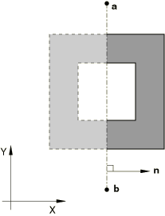

This type of reflection can be used only with two-dimensional cavities.

| **Input File Usage: ** | ``` [*REFLECTION](../key/key-link.md#usb-kws-hreflectionsym), TYPE=LINE ``` |
| --- | --- |

| **Abaqus/CAE Usage: ** | Interaction module: **Create Interaction**: **Cavity radiation**: **Symmetry**: **Reflection**: select the symmetry line |
| --- | --- |

##### Reflection of three-dimensional cavities

You can define the cavity symmetry by reflecting the cavity surface through a plane, as shown in [Figure 41.1.1--2](pt09ch41s01aus187.md#kreflection-plane). 

**Figure 41.1.1–2** Reflection symmetry through a plane.

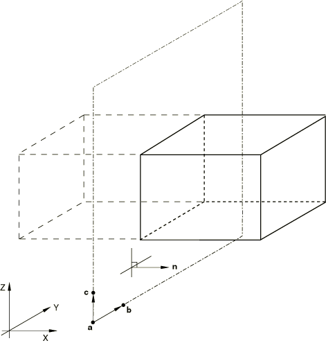

This type of reflection can be used only with three-dimensional cavities.

| **Input File Usage: ** | ``` [*REFLECTION](../key/key-link.md#usb-kws-hreflectionsym), TYPE=PLANE ``` |
| --- | --- |

| **Abaqus/CAE Usage: ** | Interaction module: **Create Interaction**: **Cavity radiation**: **Symmetry**: **Reflection**: select the symmetry plane |
| --- | --- |

##### Reflection of axisymmetric cavities

You can define the cavity symmetry by reflecting the cavity surface through a line of constant *z*-coordinate, as shown in [Figure 41.1.1--3](pt09ch41s01aus187.md#kreflection-zconst). 

**Figure 41.1.1–3** Reflection symmetry through a line of constant *z*-coordinate.


This type of reflection can be used only with axisymmetric cavities.

| **Input File Usage: ** | ``` [*REFLECTION](../key/key-link.md#usb-kws-hreflectionsym), TYPE=ZCONST ``` |
| --- | --- |

| **Abaqus/CAE Usage: ** | Interaction module: **Create Interaction**: **Cavity radiation**: **Symmetry**: **Reflection**: enter the *z*-axis symmetry value for the line of symmetry |
| --- | --- |

#### Periodic symmetry

You can define cavity symmetry by periodic repetition in a given direction. Physically, periodic symmetry is understood as an infinite number of repetitions of the same image at a periodic interval. Numerically, periodic symmetry has to be represented by a finite number of repetitions of the periodic image. You can define the number of repetitions used in the numerical calculation, *n*.

The periodic symmetry will result in a cavity composed of the user-defined cavity plus twice *n* similar images, since the periodic symmetry is assumed to apply in both the positive and negative directions. By default, *n*=2.

Although symmetries do not increase the size of the view factor matrix, they do make its calculation more expensive. Therefore, the number of repetitions should be minimized, but the value of *n* should be large enough that the view factor matrix is calculated accurately. Output variable VFTOT can be used to check the amount of closure implied by the symmetry. (See ["Controlling the accuracy of view factor calculations](pt09ch41s01aus187.md#usb-cni-acavityradiation-viewfactor-vtol)” below.) Periodic symmetry for defining the cavity radiation view factor matrix does not impose symmetry conditions automatically in the heat transfer analysis. It may be necessary to impose appropriate constraints on the temperature and loading conditions at the nodes on the periodic symmetry planes to obtain a meaningful solution from the underlying heat transfer analysis.

You must identify the dimensionality of the cavity when you define periodic symmetry.

##### Periodic symmetry of two-dimensional cavities

You can create a cavity that is composed of a series of similar images generated by repetition along a two-dimensional distance vector, as shown in [Figure 41.1.1--4](pt09ch41s01aus187.md#kperiodic-2d). 

**Figure 41.1.1–4** Two-dimensional periodic symmetry.


The repeated images are bounded by lines parallel to line *ab*. The distance vector must be defined so that it points away from line *ab* and into the domain of the model. This type of periodic symmetry can be used only with two-dimensional cavities.

| **Input File Usage: ** | ``` [*PERIODIC](../key/key-link.md#usb-kws-hperiodicsym), TYPE=2D, NR=*n* ``` |
| --- | --- |

| **Abaqus/CAE Usage: ** | Interaction module: **Create Interaction**: **Cavity radiation**: **Symmetry**: **Periodic**: **Number of periodic symmetries**: *n* |
| --- | --- |

##### Periodic symmetry of three-dimensional cavities

You can create a cavity that is composed of a series of similar images generated by repetition along a three-dimensional distance vector, as shown in [Figure 41.1.1--5](pt09ch41s01aus187.md#kperiodic-3d). The repeated images are bounded by planes that are parallel to plane *abc*. The distance vector must be defined so that it points away from plane *abc* and into the domain of the model. This type of periodic symmetry can be used only with three-dimensional cavities.

**Figure 41.1.1–5** Three-dimensional periodic symmetry.


| **Input File Usage: ** | ``` [*PERIODIC](../key/key-link.md#usb-kws-hperiodicsym), TYPE=3D, NR=*n* ``` |
| --- | --- |

| **Abaqus/CAE Usage: ** | Interaction module: **Create Interaction**: **Cavity radiation**: **Symmetry**: **Periodic**: **Number of periodic symmetries**: *n* |
| --- | --- |

##### Periodic symmetry of axisymmetric cavities

You can create a cavity that is composed of a series of similar images generated by repetition in the *z*-direction, as shown in [Figure 41.1.1--6](pt09ch41s01aus187.md#kperiodic-zdir). 

**Figure 41.1.1–6** Axisymmetric periodic symmetry.

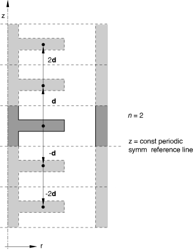

The repeated images are bounded by lines of constant *z*-coordinate. The *z*-distance vector must be defined so that it points away from the *z*-constant periodic symmetry reference line and into the domain of the model. This type of periodic symmetry can be used only with axisymmetric cavities.

| **Input File Usage: ** | ``` [*PERIODIC](../key/key-link.md#usb-kws-hperiodicsym), TYPE=ZDIR, NR=*n* ``` |
| --- | --- |

| **Abaqus/CAE Usage: ** | Interaction module: **Create Interaction**: **Cavity radiation**: **Symmetry**: **Periodic**: **Number of periodic symmetries**: *n* |
| --- | --- |

#### Cyclic symmetry

You can define cavity symmetry by cyclic repetition of the user-defined cavity surface about a point or an axis. The cavity defined by cyclic repetition must cover 360.

You must define the number of cyclically similar images that compose the cavity, *n*. The angle of rotation about a point or axis used to create cyclically similar images is equal to 360/*n*.

You must identify the dimensionality of the cavity when you define cyclic symmetry.

##### Cyclic symmetry of two-dimensional cavities

You can define the cavity symmetry by rotating the cavity about a point, *l*, as shown in [Figure 41.1.1--7](pt09ch41s01aus187.md#kcyclic-point). 

**Figure 41.1.1–7** Cyclic symmetry about a point.

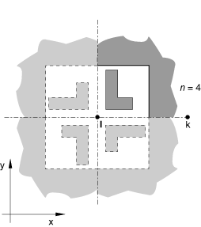

The cavity surface defined in the model must be bounded by the line *lk* and a line passing through *l* at an angle, measured counterclockwise when looking into the plane of the model, of 360/*n* to *lk*. This type of cyclic symmetry can be used only for two-dimensional cavities.

| **Input File Usage: ** | ``` [*CYCLIC](../key/key-link.md#usb-kws-hcyclicsym), TYPE=POINT, NC=*n* ``` |
| --- | --- |

| **Abaqus/CAE Usage: ** | Interaction module: **Create Interaction**: **Cavity radiation**: **Symmetry**: **Cyclic**: toggle on **Use cyclic symmetric**, **Total number of sectors**: *n* |
| --- | --- |

##### Cyclic symmetry of three-dimensional cavities

You can define the cavity symmetry by rotating the cavity about an axis, *lm*, as shown in [Figure 41.1.1--8](pt09ch41s01aus187.md#kcyclic-axis). The cavity surface defined in the model must be bounded by the plane *lmk* and a plane passing through the line *lm* at an angle, measured clockwise when looking from *l* to *m*, of 360/*n* to *lmk*. Line *lk* must be normal to line *lm*. This type of cyclic symmetry can be used only for three-dimensional cavities.

**Figure 41.1.1–8** Cyclic symmetry about an axis.


| **Input File Usage: ** | ``` [*CYCLIC](../key/key-link.md#usb-kws-hcyclicsym), TYPE=AXIS, NC=*n* ``` |
| --- | --- |

| **Abaqus/CAE Usage: ** | Interaction module: **Create Interaction**: **Cavity radiation**: **Symmetry**: **Cyclic**: toggle on **Use cyclic symmetric**, **Total number of sectors**: *n* |
| --- | --- |

#### Combining symmetries

Reflection, periodic, and cyclic symmetries can be combined as shown in [Table 41.1.1--1](pt09ch41s01aus187.md#table-cavrad-symm-combos). [Figure 41.1.1--9](pt09ch41s01aus187.md#acavityrad-2d-2reflect) through [Figure 41.1.1--12](pt09ch41s01aus187.md#acavityrad-3d-cyc-per) illustrate some possible symmetry combinations.

**Table 41.1.1–1** Permissible number of symmetry definitions used in combination.
| Reflection | Periodic | Cyclic | 2D | 3D | Axi | Restrictions |
| --- | --- | --- | --- | --- | --- | --- |
| 1 | 0 | 0 | • | • | • |  |
| 2 | 0 | 0 | • | • |  | 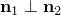 |
| 3 | 0 | 0 |  | • |  | 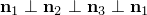 |
| 0 | 1 | 0 | • | • | • |  |
| 0 | 2 | 0 | • | • |  |  |
| 0 | 3 | 0 |  | • |  |  |
| 1 | 1 | 0 | • | • |  | 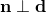 |
| 1 | 2 | 0 |  | • |  | 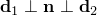 |
| 2 | 1 | 0 |  | • |  | 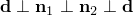 |
| 0 | 0 | 1 | • | • |  |  |
| 1 | 0 | 1 |  | • |  | 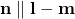 |
| 0 | 1 | 1 |  | • |  | 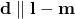 |

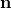, , ,  are normals to lines or planes of reflection symmetry.

, 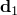, 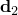 are distance vectors used to define periodic symmetry.

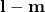 is the direction of the axis of cyclic symmetry in three-dimensional cases.

**Figure 41.1.1–9** Combination of two reflection symmetries in two dimensions.

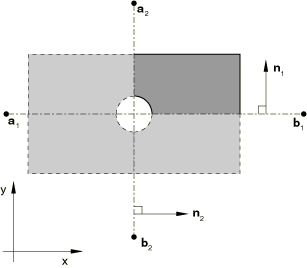

**Figure 41.1.1–10** Combination of two periodic symmetries in two dimensions.

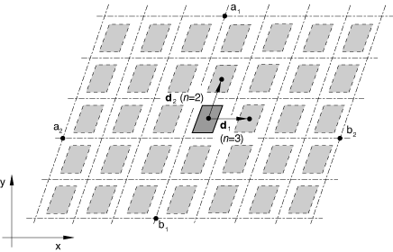

**Figure 41.1.1–11** Combination of one reflection symmetry and one periodic symmetry in two dimensions.

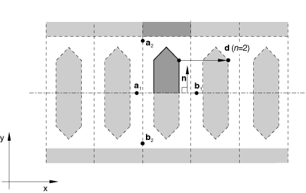

**Figure 41.1.1–12** Combination of one cyclic symmetry and one periodic symmetry in three dimensions.

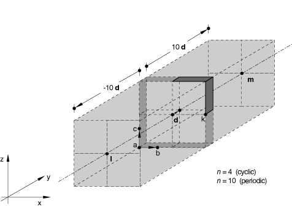

### Prescribing motion during a cavity radiation analysis

In many cavity radiation problems such as simulations of manufacturing sequences, radiation view factors change because surfaces are moved during the analysis. You can specify surface motions during heat transfer or coupled thermal-electrical analysis.

The prescribed motions affect only the calculation of view factors (and, therefore, radiation fluxes) in heat transfer due to cavity radiation. They do not affect heat conduction, storage, or distributed flux contributions.

You can define both the translational and rotational components of the motion within a step independently. For example, you can prescribe the translational motion of a node set according to a certain amplitude function and then prescribe the rotational motion of the node set according to a different amplitude function. In each step, each component of motion can be specified only once for any particular node.

Motions can also be prescribed during steps in which the cavity radiation is turned off, as described below.

#### Translational motion

Translations, 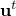, are specified in terms of global *x*-, *y*-, and *z*-components unless a local coordinate system is defined at the nodes for which motion is specified; then translations are specified in terms of local *x*-, *y*-, and *z*-components (see ["Transformed coordinate systems," Section 2.1.5](pt01ch02s01aus09.md)).

Translational displacements are always specified as total values of translational motion. This treatment of translations is consistent with that used for displacement boundary conditions (["Boundary conditions in Abaqus/Standard and Abaqus/Explicit," Section 34.3.1](pt07ch34s03aus118.md)) in stress/displacement analyses. The default is to apply translational motion.

Translational velocities can also be specified. Translational velocities always refer to the current step; therefore, the rate of translational motion specified as a velocity is in effect only during the step for which it is defined. This behavior is different from velocity boundary conditions, where velocities stay in effect in subsequent steps if they are not redefined.

| **Input File Usage: ** | Use either of the following options to prescribe translational motion: |
| --- | --- |
|  | ``` [*MOTION](../key/key-link.md#usb-kws-hmotion), TRANSLATION, TYPE=DISPLACEMENT [*MOTION](../key/key-link.md#usb-kws-hmotion), TRANSLATION, TYPE=VELOCITY ``` |

| **Abaqus/CAE Usage: ** | Surface motion is not supported with cavity radiation in Abaqus/CAE. |
| --- | --- |

#### Rotational motion

Displacements due to a rigid body rotation, 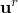, can be defined by specifying the magnitude of the rotation and the rotation axis. In three dimensions the rotation axis is defined by specifying two points,  and , on the axis of rotation. In two dimensions the rotation axis is assumed to be normal to the plane of the model and is defined by specifying one point, .

The coordinates of the points defining the axis of rotation must be defined in the configuration at the beginning of the step for which rigid body rotation is being defined.

Motion due to rigid body rotation during a step is specified as the amount of rotation that takes place during that step only. Therefore, the rigid body rotation specified during a step is local to that step; if no rigid body rotation is specified in the following step, no further rotation occurs.

The treatment of rigid body rotations is different from that of translations: rigid body rotations are specified incrementally from step to step while translations are specified as total values.

| **Input File Usage: ** | Use either of the following options to prescribe rotational motion: |
| --- | --- |
|  | ``` [*MOTION](../key/key-link.md#usb-kws-hmotion), ROTATION, TYPE=DISPLACEMENT [*MOTION](../key/key-link.md#usb-kws-hmotion), ROTATION, TYPE=VELOCITY ``` |

| **Abaqus/CAE Usage: ** | Surface motion is not supported with cavity radiation in Abaqus/CAE. |
| --- | --- |

##### Prescribing large rotational motions

Prescribed rotational motions of more than  radians or complex sequences of rotations about different directions in three-dimensional models are most simply defined by specifying rotational velocities, which allows the definition to be given in terms of the angular velocity instead of the total rotation. Abaqus/Standard calculates the increment of rotation as the average of the angular velocities at the beginning and end of each increment multiplied by the time increment. (See ["Conventions," Section 1.2.2](pt01ch01s02aus02.md).)

##### Example

For example, if a rotation of  about the *z*-axis is required, with no rotation about the *x*- and *y*-axes, and assuming a step time of 1.0, specify a constant angular velocity of  as follows: 

```
[*MOTION](../key/key-link.md#usb-kws-hmotion), TYPE=VELOCITY, ROTATION
 node (node set), 18.84955592, 0., 0., 0., 0., 0., 1.
```

The angular velocity will be constant since the default variation for motions prescribed using a predefined velocity field in a heat transfer or coupled thermal-electrical step (both steady-state and transient) is a step function (see ["Defining an analysis," Section 6.1.2](pt03ch06s01abo05.md)). An amplitude reference could be used to specify other variations of the angular velocity.

If, in the next step, the same node (or node set) should have an additional rotation of  radians about the global *x*-axis, assuming again a step time of 1.0, prescribe a constant angular velocity as follows: 

```
[*MOTION](../key/key-link.md#usb-kws-hmotion), TYPE=VELOCITY, ROTATION
 node (node set), 1.570796327, 0., 0., 0., 1., 0., 0.
```

##### Prescribing simultaneous rigid body rotations

Motions involving two or more simultaneous rigid body rotations about different axes cannot be specified directly. An example of simultaneous rigid body rotations is a satellite rotating about its own axis while orbiting the earth. Such complex motions can be defined with user subroutine [`UMOTION`](../sub/sub-link.md#sub-xsl-umotion). This subroutine allows specification of the time variation of the magnitude of the translational components of the motion (degrees of freedom 1–3) at each node.

If you specify the magnitude of the translation as part of the prescribed motion definition, it will be modified by the amplitude curve (if any) and passed into subroutine [`UMOTION`](../sub/sub-link.md#sub-xsl-umotion), where it can be redefined.

When user subroutine [`UMOTION`](../sub/sub-link.md#sub-xsl-umotion) is used to define the motion of a certain node set in a step, only one prescribed motion can be defined in that step for that node set. The complete motion of all nodes in the node set during the step must be defined in the user subroutine.

| **Input File Usage: ** | ``` [*MOTION](../key/key-link.md#usb-kws-hmotion), USER ``` |
| --- | --- |

| **Abaqus/CAE Usage: ** | Surface motion is not supported with cavity radiation in Abaqus/CAE. |
| --- | --- |

#### Simultaneous translational and rotational motion

Whenever simultaneous translational and rotational motion is specified, the total motion of a node during step *k* is defined as 

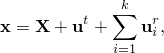

where 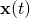 is the current location of the node due to the specified motion history,  is the original location of the node, 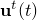 is the displacement of the node due to the translational motion specified in the step, and 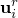 is the displacement of the node due to rigid body rotation during step *i*.

In these cases the translation is applied first and the rotation is then assumed to be about the translated (material) axis. In other words, the displacement  due to rigid body rotation during step *i* is computed as the rotation about an axis defined by points 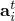 and 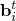 where 

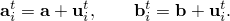

In the preceding equations  and  are the locations of the points used to define the axis of rotation for the prescribed rotational motion (they refer to the configuration at the beginning of step *i*) and 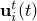 is the displacement due to translational motion during the step (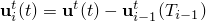, where 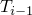 is the time at the end of step ).

##### Example

As an example, consider a three-dimensional problem with *x*–*y* planar motion as shown in [Figure 41.1.1--13](pt09ch41s01aus187.md#acavityrad-planar-motion).

**Figure 41.1.1–13** Planar motion example.

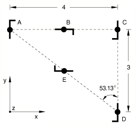

The centroid of the object of interest is initially located at 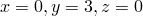. In the first step the object is translated 4 length units in the *x*-direction while at the same time it rotates clockwise 180 ( radians) about the *z*-axis at constant angular velocity. This motion moves the object from position *A* to position *C* in [Figure 41.1.1--13](pt09ch41s01aus187.md#acavityrad-planar-motion). Halfway through this motion, at position *B*, the displacements due to the rigid body rotation are calculated by applying the translation to the *z*-axis (the axis of rotation) and then applying a 90 rotation about this translated axis.

In the second step the object is translated 3 length units in the *y*-direction only. This motion places the object at position *D* with no additional rotation. Finally, in the third step the object is simultaneously translated 5 length units at an angle of 53.13 to the *y*-direction and rotated clockwise, again at constant angular velocity, through 180 about the *z*-axis. This motion returns the object to its original position.

Assuming that each step time is 1.0, the input required for the above motion sequence is as follows:

First step:

```
[*MOTION](../key/key-link.md#usb-kws-hmotion)
 node set, 1, 1, 4.
[*MOTION](../key/key-link.md#usb-kws-hmotion), ROTATION, TYPE=VELOCITY
 node set, 3.14159265, 0., 3., 0., 0., 3., -1.
```

Second step:

```
[*MOTION](../key/key-link.md#usb-kws-hmotion)
 node set, 2, 2, -3.
```

Third step:

```
[*MOTION](../key/key-link.md#usb-kws-hmotion)
 node set, 1, 2, 0.
[*MOTION](../key/key-link.md#usb-kws-hmotion), ROTATION, TYPE=VELOCITY
 node set, 3.14159265, 4., 0., 0., 4., 0., -1.
```

#### Controlling the time variation of the motion

For any prescribed motion you can refer to an amplitude curve that gives the time variation of the motion throughout a step (see ["Amplitude curves," Section 34.1.2](pt07ch34s01aus115.md)).

| **Input File Usage: ** | Use both of the following options: |
| --- | --- |
|  | ``` [*AMPLITUDE](../key/key-link.md#usb-kws-mamplitude), NAME=*amplitude* [*MOTION](../key/key-link.md#usb-kws-hmotion), AMPLITUDE=*amplitude* ``` |

| **Abaqus/CAE Usage: ** | Surface motion is not supported with cavity radiation in Abaqus/CAE. |
| --- | --- |

#### Controlling the frequency of view factor recalculation due to motion

You can control how view factors are recalculated during a step as a result of prescribed motion by specifying a value for the maximum allowable motion, *max*, for a particular node set. View factor recalculation is triggered if a displacement component at any node in the specified node set exceeds the specified value for *max*.

You must respecify the value of *max* and the node set in every step where recalculation is required; the values do not remain in effect for subsequent steps.

View factor recalculation can be expensive; use discretion when choosing a value for *max*.

| **Input File Usage: ** | ``` [*RADIATION VIEW FACTOR](../key/key-link.md#usb-kws-hradviewfactor), MDISP=*max*, NSET=*nset* ``` |
| --- | --- |
|  | The *max* and *nset* values must always be specified together. |

| **Abaqus/CAE Usage: ** | View factor recalculation due to motion is not supported with cavity radiation in Abaqus/CAE. |
| --- | --- |

### Controlling view factor calculation during the analysis

The cavity radiation capability can be used in applications such as the simulation of manufacturing sequences where radiation view factors change during the simulation. Therefore, radiation view factor definitions provide significant flexibility for the control of view factor calculations during a step.

Multiple radiation view factor definitions can be specified within a step definition if different types of radiation and view factor calculations are required for different cavities. Different types of view factor calculations can be specified for the same cavity in different steps of the analysis. 

By default, view factors are calculated at the beginning of the first step that includes a radiation view factor definition. View factors are recalculated at the beginning of a subsequent step only if the view factor definition changes in that step; for example, if different surface blocking checks are specified for the same cavity. In a restart analysis Abaqus/Standard reads the radiation view factors from the user-specified restart step and increment and recalculates the view factors only if the view factor definitions have changed.

You can specify the name of the cavity for which radiation view factor control is being specified. If you do not specify a cavity name, the radiation view factor definition applies to all cavities in the model.

| **Input File Usage: ** | ``` [*RADIATION VIEW FACTOR](../key/key-link.md#usb-kws-hradviewfactor), CAVITY=*cavity_name* ``` |
| --- | --- |

| **Abaqus/CAE Usage: ** | Radiation view factors are defined separately for each cavity radiation interaction and apply to all steps in which that interaction is active. |
| --- | --- |

#### Activating and deactivating cavity radiation

There are practical situations in which it may be useful to switch cavity radiation effects on and off during the analysis. For example, radiation may be taking place in a cavity that is then filled with a fluid so that radiation is no longer significant; later in the analysis, radiation may resume when the fluid is drained from the cavity. In such cases you can use a radiation view factor definition to switch the radiation on and off in any particular cavity during one or more steps of the analysis.

When cavity radiation is switched back on after having been switched off, Abaqus/Standard will use the last view factors calculated in the last step in which cavity radiation was active. However, if motion is prescribed during the time that the cavity radiation is switched off and one of the displacement components of a node in the specified node set exceeds the value for the maximum allowable motion, *max*, specified in the step during which cavity radiation is switched off, the view factors will be recalculated at the beginning of the step in which the cavity radiation is switched back on.

| **Input File Usage: ** | Use the following option to turn view factor calculation off for a step: |
| --- | --- |
|  | ``` [*RADIATION VIEW FACTOR](../key/key-link.md#usb-kws-hradviewfactor), OFF ``` Use one of the following options to turn view factor calculation back on in a subsequent step: ``` [*RADIATION VIEW FACTOR](../key/key-link.md#usb-kws-hradviewfactor) [*RADIATION VIEW FACTOR](../key/key-link.md#usb-kws-hradviewfactor), MDISP=*max*, NSET=*nset* ``` |

| **Abaqus/CAE Usage: ** | Radiation view factors cannot be turned off or on for a selected step. You can use the following options to turn a cavity radiation interaction off or on: |
| --- | --- |
|  | Interaction module: **Interaction Manager**: select a step and a cavity radiation interaction, **Activate** or **Deactivate** |

#### Controlling the accuracy of view factor calculations

Abaqus/Standard uses a progressive integration scheme for view factor calculation.  When facets are sufficiently far from each other, a lumped area approximation is used.  If the facets are close to each other but one of the facets is much larger than the other, an infinitesimal-to-finite approximation is used.  For all other cases a contour integral is numerically calculated to compute the view factor.  See ["View factor calculation," Section 2.11.5 of the Abaqus Theory Guide](../stm/stm-link.md#stm-anl-viewfactor), for details.  

Two nondimensional parameters are calculated for each facet pair to determine which integration scheme is used:

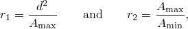

 where 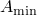 is the area of the smaller facet, 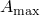 is the area of the larger facet, and *d* is the distance between their centroids. The lumped area approximation is used whenever the nondimensional distance square parameter 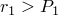, where 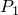 has a default value of 5.0. If 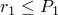, an infinitesimal-to-finite area approximation is used if the facet area ratio 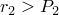, where 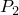 has a default value of 64.0. Otherwise, a more precise calculation is performed, involving the numerical integration of a contour integral. 

You can customize the accuracy and speed of the view factor calculation by specifying the parameters  and  and the number of integration points per edge. For example, Abaqus/Standard will used lumped area approximations throughout the whole model if  is set to zero. Likewise, the more precise, albeit more expensive, numerical integration method will always be used if  and  are set to very large numbers.

| **Input File Usage: ** | ``` [*RADIATION VIEW FACTOR](../key/key-link.md#usb-kws-hradviewfactor), LUMPED AREA=*P1*, INFINITESIMAL=*P2*, INTEGRATION=*integration points per edge* ``` |
| --- | --- |

| **Abaqus/CAE Usage: ** | Interaction module: **Create Interaction**: **Cavity radiation**: **View factors**: enter new values or accept the defaults for **Infinitesimal facet area ratio**, **Gauss integration points per edge**, and **Lumped area distance-square value** |
| --- | --- |

##### View factor calculation checks for closed cavities

You can provide a tolerance on the accuracy of the view factor calculation. In a closed cavity the sum of the view factors for each cavity facet should be one. Abaqus/Standard compares the value of the specified tolerance to the largest view factor matrix row sum deviation from unity; that is, 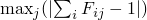. If the tolerance is violated for a closed cavity, the analysis is terminated. The default view factor tolerance is 0.05. Failure to meet this criterion may indicate a need for mesh refinement.

| **Input File Usage: ** | ``` [*RADIATION VIEW FACTOR](../key/key-link.md#usb-kws-hradviewfactor), VTOL=*tolerance* ``` |
| --- | --- |

| **Abaqus/CAE Usage: ** | Interaction module: **Create interaction**: **Cavity radiation**: **View factors**: **Accuracy tolerance**: *tolerance* |
| --- | --- |

##### View factor calculations in cavities with symmetries

The view factor calculations account for the closure of a cavity implied by any cavity symmetries. For cavities without periodic or cyclic symmetries the view factors are calculated exactly for two-dimensional geometries, but approximations are made for axisymmetric and three-dimensional geometries. These approximations become less accurate as the distance between surfaces decreases. Define heat radiation to model closely spaced surfaces (see ["Thermal contact properties," Section 37.2.1](pt09ch37s02aus174.md)).

##### View factor calculations in open cavities

If the sum of the view factors for facets in an open cavity (defined by specifying a value for the ambient temperature) deviates from unity by more than the specified view factor tolerance, radiation to the ambience will take place. In nearly closed cavities this deviation may be small. If the tolerance is not violated, radiation to the external medium is not included even though the cavity is defined to be open; a warning message is issued to this effect. You can loosen the view factor tolerance to include such radiation.

#### Controlling checks for surface blocking

Heat is transferred between surfaces that have unobstructed direct views of each other (see [Figure 41.1.1--14](pt09ch41s01aus187.md#acavityrad-blocking)); “blocking” may occur in geometrically complex cavities.

**Figure 41.1.1–14** Illustrations of blocking.

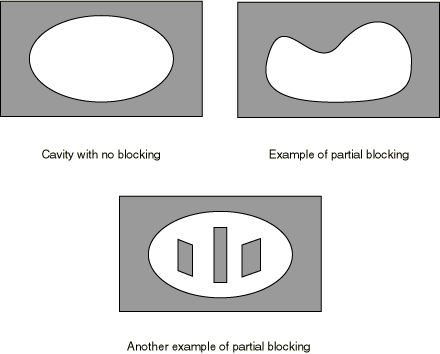

Surface blocking checks may be computationally expensive in cavities with many surfaces; therefore, significant computational time may be saved by specifying which surfaces are potential blocking surfaces, as described below.

View factor calculations with blocking surfaces are especially sensitive to mesh refinement. If a mesh is too coarse, the view factors may not add up to one (in a closed cavity). To obtain accurate results, the mesh should be refined until the view factors can be summed accurately.

##### Full blocking checks

By default, Abaqus/Standard will check for blocking of every surface with itself and all other surfaces.

| **Input File Usage: ** | ``` [*RADIATION VIEW FACTOR](../key/key-link.md#usb-kws-hradviewfactor), BLOCKING=ALL ``` |
| --- | --- |

| **Abaqus/CAE Usage: ** | Interaction module: **Create interaction**: **Cavity radiation**: **Properties**: **Blocking surface checks**: **All** |
| --- | --- |

##### Partial blocking checks

You can specify a list of the potential blocking surfaces in the cavity.

| **Input File Usage: ** | ``` [*RADIATION VIEW FACTOR](../key/key-link.md#usb-kws-hradviewfactor), BLOCKING=PARTIAL ``` |
| --- | --- |

| **Abaqus/CAE Usage: ** | Interaction module: **Create interaction**: **Cavity radiation**: **Properties**: **Blocking surface checks**: **Partial** |
| --- | --- |

##### No blocking checks

You can indicate that there are no blocking surfaces in the cavity; in this case Abaqus omits all checks for blocking.

| **Input File Usage: ** | ``` [*RADIATION VIEW FACTOR](../key/key-link.md#usb-kws-hradviewfactor), BLOCKING=NO ``` |
| --- | --- |

| **Abaqus/CAE Usage: ** | Interaction module: **Create interaction**: **Cavity radiation**: **Properties**: **Blocking surface checks**: **None** |
| --- | --- |

#### Reducing computations for surfaces that are far apart

In cases where there are many surfaces in the cavity, surfaces separated by more than a certain distance may not be able to “see” each other for the purposes of radiation because of blocking by other surfaces. You can specify the distance beyond which view factors need not be calculated, which reduces the computational effort required for the view factor calculations.

| **Input File Usage: ** | ``` [*RADIATION VIEW FACTOR](../key/key-link.md#usb-kws-hradviewfactor), RANGE=*distance* ``` |
| --- | --- |

| **Abaqus/CAE Usage: ** | Interaction module: **Create interaction**: **Cavity radiation**: **View factors**: toggle on **Specify blocking range**: *distance* |
| --- | --- |

#### Memory usage in cavity radiation analyses

The cavity radiation heat transfer between facets of a surface in Abaqus is modeled using a full, unsymmetric matrix defining interactions between each node and all others in the cavity. For surfaces with large numbers of nodes this matrix may be large, resulting in memory requirements that are significantly larger than those for the finite element portion of the analysis without the cavity radiation interaction.

To minimize memory requirements and computational cost for cavity radiation heat transfer analysis, the cavity can be defined using a coarser mesh of heat transfer shell elements having a single degree of freedom per node. The overlaid element should have minimal heat capacity and conduction, and it should be used for the definition of the cavity in place of the physical, multiple-degree-of-freedom shell. The overlaid element should be used to define the master surface in a tied coupling constraint (["Mesh tie constraints," Section 35.3.1](pt08ch35s03aus132.md)); the multiple-degree-of-freedom, physical, heat transfer shell element forms the slave surface.

### Initial conditions

By default, the initial temperature of all nodes is zero. You can specify nonzero initial temperatures in a cavity radiation analysis; see ["Defining initial temperatures" in "Initial conditions in Abaqus/Standard and Abaqus/Explicit," Section 34.2.1](pt07ch34s02aus116.md#usb-prc-pinitialcond-temp).

In a heat transfer analysis involving forced convection through the mesh, you can define nonzero initial mass flow rates at the nodes of the forced convection/diffusion heat transfer elements in the model (see ["Uncoupled heat transfer analysis," Section 6.5.2](pt03ch06s05at18.md)).

### Boundary conditions

You can specify boundary conditions to prescribe temperatures (degree of freedom 11) at the nodes (see ["Boundary conditions in Abaqus/Standard and Abaqus/Explicit," Section 34.3.1](pt07ch34s03aus118.md)). Shell elements have additional temperature degrees of freedom 12, 13, etc. through the thickness (see ["Conventions," Section 1.2.2](pt01ch01s02aus02.md)). Boundary conditions can be specified as functions of time by referring to amplitude curves (["Amplitude curves," Section 34.1.2](pt07ch34s01aus115.md)).

For purely diffusive elements, a boundary without any prescribed boundary conditions (natural boundary condition) corresponds to an insulated surface. For forced convection/diffusion elements, only the flux associated with conduction is zero; energy is free to convect across an unloaded surface. This natural boundary condition correctly models areas where fluid is crossing a surface (as, for example, at the upstream and downstream boundaries of the mesh) and prevents spurious reflections of energy back into the mesh.

### Loads

The following types of loading can be prescribed in addition to the cavity radiation, as described in ["Thermal loads," Section 34.4.4](pt07ch34s04aus123.md): 
- Concentrated heat fluxes
- Body fluxes and distributed surface fluxes
- Convective film conditions and radiation conditions

### Predefined fields

You cannot specify temperatures as field variables in heat transfer or coupled thermal-electrical analyses. Boundary conditions should be used instead, as described above.

You can specify values of other user-defined field variables during the analysis. These values will affect field-variable-dependent material properties, if any. See ["Predefined fields," Section 34.6.1](pt07ch34s06aus128.md).

### Material options

You must define the radiation properties of the surfaces as described above in ["Defining surface radiation properties](pt09ch41s01aus187.md#usb-cni-acavityradiation-surfprops).” Other thermal properties such as conductivity, density, specific heat, and latent heat are defined as in uncoupled heat transfer analysis—see ["Uncoupled heat transfer analysis," Section 6.5.2](pt03ch06s05at18.md), and ["Thermal properties: overview," Section 26.2.1](pt05ch26s02abo23.md).

You can specify internal heat generation—see ["Internal heat generation" in "Uncoupled heat transfer analysis," Section 6.5.2](pt03ch06s05at18.md#usb-anl-aheattransfer-internalheatgen).

Thermal expansion coefficients are not meaningful in cavity radiation heat transfer analysis since deformation of the structure is not considered.

### Elements

Any of the heat transfer or coupled thermal-electrical elements in Abaqus/Standard can be used in a cavity radiation analysis, including forced convection/diffusion heat transfer elements (see ["Choosing the appropriate element for an analysis type," Section 27.1.3](pt06ch27s01aus112.md); ["Uncoupled heat transfer analysis," Section 6.5.2](pt03ch06s05at18.md); and ["Coupled thermal-electrical analysis," Section 6.7.3](pt03ch06s07at22.md)). Coupled temperature-displacement and coupled thermal-electrical-structural elements cannot be used in a cavity radiation analysis.

In addition to the elements that you define, Abaqus/Standard uses internal elements that are generated automatically from your definition of radiation cavities.

### Output

The following output variables are available for cavity radiation:

Surface variables

| RADFL | Radiation flux per unit area. This variable does include heat flux to ambient in an open cavity. |
| --- | --- |

| RADFLA | Radiation flux over a facet. |
| --- | --- |

| RADTL | Time integrated radiation per unit area. |
| --- | --- |

| RADTLA | Time integrated radiation over a facet. |
| --- | --- |

| VFTOT | Total view factor for a facet (sum of the view factor values in the row of the view factor matrix corresponding to the facet). |
| --- | --- |

| FTEMP | Facet temperature. |
| --- | --- |

All of the output variables are listed in ["Abaqus/Standard output variable identifiers," Section 4.2.1](pt02ch04s02abv01.md). Abaqus/CAE supports motion display and can display surface- and element-based results.

#### Writing the view factor matrices to the results file

You can write the view factor matrices for cavity radiation interactions in heat transfer or coupled thermal-electrical analyses to the results (`.fil`) file if parallel decomposition for the cavity is not enabled.. The entire radiation view factor matrix is written for each cavity radiation element in the specified cavity.

You can control the frequency of view factor matrix output by specifying the required output frequency in increments. The default output frequency is 1. Specify an output frequency of 0 to suppress output. The output will always be written at the last increment of each step unless you specify an output frequency of 0.

The record formats for the results file are described in ["Results file output format," Section 5.1.2](pt02ch05s01afi01.md). The file can be written in binary or ASCII format (see ["Controlling the format of the results file in Abaqus/Standard" in "Output," Section 4.1.1](pt02ch04s01aus38.md#usb-out-ooutput-fileformat-std)).

| **Input File Usage: ** | ``` [*VIEW FACTOR OUTPUT](../key/key-link.md#usb-kws-hviewfactout), CAVITY=*cavity_name*, FREQUENCY=*n* ``` |
| --- | --- |

| **Abaqus/CAE Usage: ** | View factor output is not supported in Abaqus/CAE. |
| --- | --- |

#### Requesting surface variable output

For the cavity radiation interaction, you can request cavity-, element-, or surface-based radiation output such as radiation fluxes, view factor totals for a facet, and facet temperatures to the data, results, and/or output database files. The output requests can be repeated as often as necessary to request output for different variables, different cavities, different surfaces, different element sets, etc. The surface variables that can be requested are listed above.

You can specify the particular cavity, element set, or surface for which output is being requested. If you do not specify a cavity, element set, or surface, output will be provided for all cavities in the model. The same cavity, element set, or surface can appear in several radiation output requests.

By default, no cavity radiation data output will be provided. If you define a radiation output request without specifying the desired output variables, all six cavity radiation surface variables will be output.

You can control the frequency of radiation output by specifying the required output frequency in increments. The default output frequency is 1. Specify an output frequency of 0 to suppress output. The output will always be written at the last increment of each step unless you specify an output frequency of 0.

| **Input File Usage: ** | Use one of the following options to obtain output in the data file: |
| --- | --- |
|  | ``` [*RADIATION PRINT](../key/key-link.md#usb-kws-hradprint), CAVITY=*cavity_name*, FREQUENCY=*n* [*RADIATION PRINT](../key/key-link.md#usb-kws-hradprint), ELSET=*element_set*, FREQUENCY=*n* [*RADIATION PRINT](../key/key-link.md#usb-kws-hradprint), SURFACE=*surface_name*, FREQUENCY=*n* ``` Use one of the following options to obtain output in the results file: ``` [*RADIATION FILE](../key/key-link.md#usb-kws-hradfile), CAVITY=*cavity_name*, FREQUENCY=*n* [*RADIATION FILE](../key/key-link.md#usb-kws-hradfile), ELSET=*element_set*, FREQUENCY=*n* [*RADIATION FILE](../key/key-link.md#usb-kws-hradfile), SURFACE=*surface_name*, FREQUENCY=*n* ``` Use the first option and one of the subsequent options to obtain output in the output database: ``` [*OUTPUT](../key/key-link.md#usb-kws-houtput), FREQUENCY=*n* [*RADIATION OUTPUT](../key/key-link.md#usb-kws-hradiationoutput), CAVITY=*cavity_name* [*RADIATION OUTPUT](../key/key-link.md#usb-kws-hradiationoutput), ELSET=*element_set* [*RADIATION OUTPUT](../key/key-link.md#usb-kws-hradiationoutput), SURFACE=*surface_name* ``` |

| **Abaqus/CAE Usage: ** | Cavity radiation output to the data file and the results file are not supported in Abaqus/CAE. |
| --- | --- |
|  | Use the following options to obtain output in the output database: Step module: history output request editor: **Thermal**: select the output variables |

##### Printed output

The output tables generated by a radiation output request to the data file are organized on a surface-by-surface basis. The rows that will appear in a particular table are defined by choosing a cavity, surface, or element set: each row of a table corresponds to an individual element face that is part of the cavity, surface, or element set chosen. If all of the variables in a row of a table are zero, the row is not printed.

The first column of each table is the element number, and the second column is the element face identifier. You choose the variables to appear in the remaining columns. There is no limit to the number of tables that can be defined.

As an example, consider a heat transfer model containing a cavity named `CAV1`, which, in turn, is composed of surfaces `SURF1` and `SURF2`. If you request output of radiation flux (RADFL) and facet temperature (FTEMP) to the data file for this model, two tables will appear in the data file. One table will contain RADFL and FTEMP output for all element faces composing surface `SURF1`, and the other table will contain the same output variables for all element faces making up surface `SURF2`.

By default, Abaqus/Standard writes a summary of the maximum and minimum values in each column of the table. You can choose to suppress this summary. In addition, you can choose to print the total of each column in the table, which is useful, for example, to sum radiation fluxes over all facets composing a radiation surface. By default, these totals are not printed.

| **Input File Usage: ** | Use the following option to control output of the summary information to the data file: |
| --- | --- |
|  | ``` [*RADIATION PRINT](../key/key-link.md#usb-kws-hradprint), SUMMARY=YES *or* NO ``` Use the following option to control output of the totals to the data file: ``` [*RADIATION PRINT](../key/key-link.md#usb-kws-hradprint), TOTALS=YES *or* NO ``` |

| **Abaqus/CAE Usage: ** | Cavity radiation output to the data file is not supported in Abaqus/CAE. |
| --- | --- |

### Input file template

The following template shows the options required for a transient, cavity radiation analysis of a closed two-dimensional symmetric cavity. All surfaces within the cavity `topcav` have the same emissivity. The surface `surf2` moves (translation only) during the analysis. In the second step surface `surf2` stops moving, cavity radiation is turned off, all thermal loads except the surface convection are removed, and a steady-state heat transfer analysis is conducted to determine the final temperature of the system.

```
[*HEADING](../key/key-link.md#usb-kws-mheading)
…
[*PHYSICAL CONSTANTS](../key/key-link.md#usb-kws-mphysicalconsts), ABSOLUTE ZERO=, STEFAN BOLTZMANN=
[*SURFACE](../key/key-link.md#usb-kws-msurface), NAME=surf1, PROPERTY=surfp
 elset1, S1
 elset2, S2
[*SURFACE](../key/key-link.md#usb-kws-msurface), NAME=surf2, PROPERTY=surfp
 elset3,
[*SURFACE PROPERTY](../key/key-link.md#usb-kws-msurfaceprop), NAME=surfp
[*EMISSIVITY](../key/key-link.md#usb-kws-memissivity)
*Data lines to define the emissivity of the surfaces in the model*
[*CAVITY DEFINITION](../key/key-link.md#usb-kws-mcavitydef), NAME=topcav
 surf1, surf2
[*INITIAL CONDITIONS](../key/key-link.md#usb-kws-minitialcond), TYPE=TEMPERATURE
*Data lines to prescribe initial temperatures at the nodes*
[*AMPLITUDE](../key/key-link.md#usb-kws-mamplitude), NAME=motion
*Data lines to define amplitude curve to be used for motion of surface *surf2
[*AMPLITUDE](../key/key-link.md#usb-kws-mamplitude), NAME=film
*Data lines to define amplitude curve to be used for the convection film coefficient, h*
*************
** Step 1
*************
[*STEP](../key/key-link.md#usb-kws-hstep)
[*HEAT TRANSFER](../key/key-link.md#usb-kws-hheattrans), MXDEM=, DELTMX=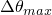 
*Data line to define incrementation*
[*RADIATION VIEW FACTOR](../key/key-link.md#usb-kws-hradviewfactor), CAVITY=topcav, VTOL=*tol*, SYMMETRY=outer,
 NSET=nset, MDISP=*max*
[*RADIATION SYMMETRY](../key/key-link.md#usb-kws-hradsymmetry), NAME=outer
[*REFLECTION](../key/key-link.md#usb-kws-hreflectionsym), TYPE=LINE
*Data line to define line of symmetry*
[*MOTION](../key/key-link.md#usb-kws-hmotion), TRANSLATION, TYPE=DISPLACEMENT, AMPLITUDE=motion
*Data line to define motion of nodes on surface *surf2
[*CFLUX](../key/key-link.md#usb-kws-hcflux) and/or [*DFLUX](../key/key-link.md#usb-kws-hdflux)
*Data lines to define concentrated and/or distributed fluxes*
[*BOUNDARY](../key/key-link.md#usb-kws-hboundary)
*Data lines to prescribe temperatures at selected nodes*
[*FILM](../key/key-link.md#usb-kws-hfilm), FILM AMPLITUDE=film
*Data lines to define surface convection*
**
[*RADIATION PRINT](../key/key-link.md#usb-kws-hradprint), CAVITY=topcav, SUMMARY=YES, TOTALS=YES
*Data lines requesting cavity radiation surface variable output*
[*RADIATION FILE](../key/key-link.md#usb-kws-hradfile), CAVITY=topcav, FREQUENCY=4
*Data lines requesting cavity radiation surface variable output*
[*NODE PRINT](../key/key-link.md#usb-kws-hnodeprint)
*Data lines requesting nodal output such as temperatures*
[*EL PRINT](../key/key-link.md#usb-kws-helprint)
*Data lines requesting element output such as heat flux*
[*END STEP](../key/key-link.md#usb-kws-hendstep)
*************
** Step 2
*************
[*STEP](../key/key-link.md#usb-kws-hstep)
[*HEAT TRANSFER](../key/key-link.md#usb-kws-hheattrans), STEADY STATE
*Data line to define incrementation*
[*RADIATION VIEW FACTOR](../key/key-link.md#usb-kws-hradviewfactor), OFF
[*CFLUX](../key/key-link.md#usb-kws-hcflux), OP=NEW
[*DFLUX](../key/key-link.md#usb-kws-hdflux), OP=NEW
[*END STEP](../key/key-link.md#usb-kws-hendstep)
```


