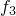

# 1.2.3 声学模态

**产品：**Abaqus/Standard  

### I. 管风琴模态

### 测试的单元

AC1D2    AC1D3    

ACAX3    ACAX4    ACAX6    ACAX8    

AC2D3    AC2D4    AC2D6    AC2D8    

AC3D4    AC3D5    AC3D6    AC3D8    AC3D10    AC3D15    AC3D20    

### 测试的功能

特征频率提取

表面阻抗

### 问题描述

声学单元族中的每个成员用于模拟管风琴。从模型中提取管风琴的固有振动模态，包括两端开口的管风琴（开口/开口）和一端开口另一端封闭的管风琴（开口/封闭）。开口端适当的边界条件是将声压自由度设置为零（自由表面）。封闭端不需要边界条件；自然边界条件是邻接流体的刚性表面。结果与精确解进行比较。

模型由高度为 165.8 单位、横截面积为 1.0 的空气柱组成。一阶单元模型由沿流体柱长度方向的 20 个声学单元和横截面上一个单元组成。二阶单元模型由 10 个单元组成。

空气使用的材料属性为  = 1.293，体积模量 = 1.42176  105。

### 结果与讨论

该问题定义的几何形状和材料属性产生的固有频率为：对于开口管风琴， = 1.0 循环/秒， = 2.0 循环/秒， = 3.0 循环/秒；对于封闭管风琴， = 0.5 循环/秒， = 1.5 循环/秒， = 2.5 循环/秒。

一阶单元的结果与这些频率的偏差小于 1%，二阶单元的结果偏差小于 0.1%。使用更细的网格可以获得更高的精度。为了与二维和三维有限单元匹配这些频率，流体柱的长度被选择得比柱的宽度大得多。

### 输入文件

[ec12afe4.inp](../eif/ec12afe4.inp)

AC1D2 单元。

[ec13afe4.inp](../eif/ec13afe4.inp)

AC1D3 单元。

[eca3afe4.inp](../eif/eca3afe4.inp)

ACAX3 单元。

[eca4afe4.inp](../eif/eca4afe4.inp)

ACAX4 单元。

[eca6afe4.inp](../eif/eca6afe4.inp)

ACAX6 单元。

[eca8afe4.inp](../eif/eca8afe4.inp)

ACAX8 单元。

[eca3afe4_ams.inp](../eif/eca3afe4_ams.inp)

ACAX3 单元，Abaqus/AMS。

[eca4afe4_ams.inp](../eif/eca4afe4_ams.inp)

ACAX4 单元，Abaqus/AMS。

[eca6afe4_ams.inp](../eif/eca6afe4_ams.inp)

ACAX6 单元，Abaqus/AMS。

[eca8afe4_ams.inp](../eif/eca8afe4_ams.inp)

ACAX8 单元，Abaqus/AMS。

[ec23afe4.inp](../eif/ec23afe4.inp)

AC2D3 单元。

[ec24afe4.inp](../eif/ec24afe4.inp)

AC2D4 单元。

[ec26afe4.inp](../eif/ec26afe4.inp)

AC2D6 单元。

[ec28afe4.inp](../eif/ec28afe4.inp)

AC2D8 单元。

[ec34afe4.inp](../eif/ec34afe4.inp)

AC3D4 单元。

[ec35afe4.inp](../eif/ec35afe4.inp)

AC3D5 单元。

[ec36afe4.inp](../eif/ec36afe4.inp)

AC3D6 单元。

[ec38afe4.inp](../eif/ec38afe4.inp)

AC3D8 单元。

[ec3aafe4.inp](../eif/ec3aafe4.inp)

AC3D10 单元。

[ec3fafe4.inp](../eif/ec3fafe4.inp)

AC3D15 单元。

[ec3kafe4.inp](../eif/ec3kafe4.inp)

AC3D20 单元。

[ec34afe4_ams.inp](../eif/ec34afe4_ams.inp)

AC3D4 单元，Abaqus/AMS。

[ec35afe4_ams.inp](../eif/ec35afe4_ams.inp)

AC3D5 单元，Abaqus/AMS。

[ec36afe4_ams.inp](../eif/ec36afe4_ams.inp)

AC3D6 单元，Abaqus/AMS。

[ec38afe4_ams.inp](../eif/ec38afe4_ams.inp)

AC3D8 单元，Abaqus/AMS。

[ec3aafe4_ams.inp](../eif/ec3aafe4_ams.inp)

AC3D10 单元，Abaqus/AMS。

[ec3fafe4_ams.inp](../eif/ec3fafe4_ams.inp)

AC3D15 单元，Abaqus/AMS。

[ec3kafe4_ams.inp](../eif/ec3kafe4_ams.inp)

AC3D20 单元，Abaqus/AMS。

### II. 具有非反射阻抗的外部模态

### 测试的单元

ACAX3    ACAX4    ACAX6    ACAX8    

AC2D3    AC2D4    AC2D6    AC2D8    

AC3D4    AC3D5    AC3D6    AC3D8    AC3D10    AC3D15    AC3D20    

### 问题描述

模型由长度为 0.1 的管道状网格组成。第一步对没有边界条件的模型进行特征值分析。第二步在管道的所有外部端施加球形非反射阻抗。第三步对具有阻抗条件的模型进行特征值分析。仅打印第一步和第三步的结果。

### 结果与讨论

对于所有单元，模态分析结果与预期行为一致。

### 输入文件

[acoustic_exteig2d.inp](../eif/acoustic_exteig2d.inp)

AC2D3、AC2D4、AC2D6 和 AC2D8 单元。

[acoustic_exteigax.inp](../eif/acoustic_exteigax.inp)

ACAX3、ACAX4、ACAX6 和 ACAX8 单元。

[acoustic_exteig3d.inp](../eif/acoustic_exteig3d.inp)

AC3D4、AC3D6、AC3D8、AC3D10、AC3D15 和 AC3D20 单元。

### III. 具有声学无限单元的外部模态

### 测试的单元

**声学有限单元**
ACAX3    ACAX4    ACAX6    ACAX8    

AC2D3    AC2D4    AC2D6    AC2D8    

AC3D4    AC3D5    AC3D6    AC3D8    AC3D10    AC3D15    AC3D20    

**声学无限单元**
ACINAX2    ACINAX3    

ACIN2D2    ACIN2D3    

ACIN3D3    ACIN3D4    ACIN3D6    ACIN3D8    

### 问题描述

模型由长度为 0.1 的管道状网格组成，末端终止于声学无限单元。第一分析步骤对模型进行实特征值分析。第二步对模型进行复特征值分析。

### 结果与讨论

对于所有单元，模态分析结果与预期行为一致。

### 输入文件

[acoustic_infeig2d.inp](../eif/acoustic_infeig2d.inp)

ACIN2D2、ACIN2D3、AC2D3、AC2D4、AC2D6 和 AC2D8 单元。

[acoustic_infeigax.inp](../eif/acoustic_infeigax.inp)

ACINAX2、ACINAX3、ACAX3、ACAX4、ACAX6 和 ACAX8 单元。

[acoustic_infeig3d.inp](../eif/acoustic_infeig3d.inp)

ACIN3D3、ACIN3D4、ACIN3D6、ACIN3D8、AC3D4、AC3D6、AC3D8、AC3D10、AC3D15 和 AC3D20 单元。

