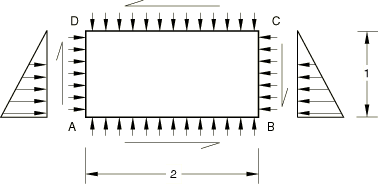
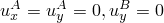
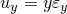
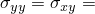
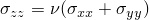
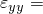

# 1.3.1 平面应力、平面应变、膜和壳单元的膜载荷

**产品：**Abaqus/Standard  

### 测试的单元

CPS3    CPS4    CPS4I    CPS4R    CPS4RT    CPS6    CPS6M    CPS6MT    CPS8    CPS8R    

CPE3    CPE3H    CPE4    CPE4H    CPE4I    CPE4IH    CPE4R    CPE4RH    CPE4RHT    CPE4RT    CPE6    CPE6H    CPE6M    CPE6MH    CPE6MHT    CPE6MT    CPE8    CPE8H    CPE8R    CPE8RH    

CPEG3    CPEG3H    CPEG4    CPEG4H    CPEG4I    CPEG4IH    CPEG4R    CPEG4RH    CPEG6    CPEG6H    CPEG6M    CPEG6MH    CPEG8    CPEG8H    CPEG8R    CPEG8RH    

M3D3    M3D4    M3D4R    M3D6    M3D8    M3D8R    M3D9    M3D9R    

S4    S4R    S4R5    S8R    S8R5    S9R5    STRI3    STRI65    SC8R    

### 问题描述

**材料：**

线弹性，弹性模量 = 30  106，泊松比 = 0.3。

对于耦合温度-位移单元，指定虚拟热属性以完成材料定义。

**边界条件：**

，对于壳单元，在所有节点处 。

#### 步骤 1

在每条边上施加 1000/长度的分布压力（对于壳单元，等效集中载荷）。在与所示方向相同的每条边上施加对应于 1000/长度分布剪切载荷的等效集中剪力。

**响应：**

**应力**

在每个积分点  1000，对于平面应变单元， 600。

**应变**

平面应变单元：

 1.7333  105， 8.6667  105。

平面应力和壳单元：

 2.3333  105， 8.6667  105。

**位移**

，。

对于低阶单元，测试描述完成。对于高阶单元，包含另一个步骤定义。

#### 步骤 2

除了步骤 1 中已施加的载荷外，沿两个垂直面添加静水压力载荷，从顶部为 0 到底部为 1000/长度。

**响应：**

**应力**

 1000(2  *y*)， 1000，对于平面应变单元，。

**应变**

平面应变单元：

 (3.0333 (2  *y*) + 1.3)  105， (1.3(2  *y*)  3.03333)  105， 8.66667  105。

平面应力和壳单元：

 (3.333 (2  *y*) + 1)  105， ((2  *y*)  3.3333)  105， 8.6667  105。

### 结果与讨论

广义平面应变单元的结果取决于施加在广义平面应变参考节点上的边界约束。在这些测试中，低阶广义平面应变单元中的参考节点被约束，使得结果与其平面应变对应单元相同。对于高阶广义平面应变单元，这些节点不受约束，因此结果与其平面应力对应单元相同。

使用减缩积分的单元可能具有除上述规定之外的附加边界条件。所有单元都产生精确解。

### 输入文件

[ecs3sfs1.inp](../eif/ecs3sfs1.inp)

CPS3 单元。

[ecs4sfs1.inp](../eif/ecs4sfs1.inp)

CPS4 单元。

[ecs4sis1.inp](../eif/ecs4sis1.inp)

CPS4I 单元。

[ecs4srs1.inp](../eif/ecs4srs1.inp)

CPS4R 单元。

[ecs4trs1.inp](../eif/ecs4trs1.inp)

CPS4RT 单元。

[ecs6sfs1.inp](../eif/ecs6sfs1.inp)

CPS6 单元。

[ecs6sks1.inp](../eif/ecs6sks1.inp)

CPS6M 单元。

[ecs6tks1.inp](../eif/ecs6tks1.inp)

CPS6MT 单元。

[ecs8sfs1.inp](../eif/ecs8sfs1.inp)

CPS8 单元。

[ecs8srs1.inp](../eif/ecs8srs1.inp)

CPS8R 单元。

[ece3sfs1.inp](../eif/ece3sfs1.inp)

CPE3 单元。

[ece3shs1.inp](../eif/ece3shs1.inp)

CPE3H 单元。

[ece4sfs1.inp](../eif/ece4sfs1.inp)

CPE4 单元。

[ece4shs1.inp](../eif/ece4shs1.inp)

CPE4H 单元。

[ece4sis1.inp](../eif/ece4sis1.inp)

CPE4I 单元。

[ece4sjs1.inp](../eif/ece4sjs1.inp)

CPE4IH 单元。

[ece4srs1.inp](../eif/ece4srs1.inp)

CPE4R 单元。

[ece4sys1.inp](../eif/ece4sys1.inp)

CPE4RH 单元。

[ece4tys1.inp](../eif/ece4tys1.inp)

CPE4RHT 单元。

[ece4trs1.inp](../eif/ece4trs1.inp)

CPE4RT 单元。

[ece6sfs1.inp](../eif/ece6sfs1.inp)

CPE6 单元。

[ece6shs1.inp](../eif/ece6shs1.inp)

CPE6H 单元。

[ece6sks1.inp](../eif/ece6sks1.inp)

CPE6M 单元。

[ece6sls1.inp](../eif/ece6sls1.inp)

CPE6MH 单元。

[ece6tls1.inp](../eif/ece6tls1.inp)

CPE6MHT 单元。

[ece8sfs1.inp](../eif/ece8sfs1.inp)

CPE8 单元。

[ece8shs1.inp](../eif/ece8shs1.inp)

CPE8H 单元。

[ece8srs1.inp](../eif/ece8srs1.inp)

CPE8R 单元。

[ece8sys1.inp](../eif/ece8sys1.inp)

CPE8RH 单元。

[ecg3sfs1.inp](../eif/ecg3sfs1.inp)

CPEG3 单元。

[ecg3shs1.inp](../eif/ecg3shs1.inp)

CPEG3H 单元。

[ecg4sfs1.inp](../eif/ecg4sfs1.inp)

CPEG4 单元。

[ecg4shs1.inp](../eif/ecg4shs1.inp)

CPEG4H 单元。

[ecg4sis1.inp](../eif/ecg4sis1.inp)

CPEG4I 单元。

[ecg4sjs1.inp](../eif/ecg4sjs1.inp)

CPEG4IH 单元。

[ecg4srs1.inp](../eif/ecg4srs1.inp)

CPEG4R 单元。

[ecg4sys1.inp](../eif/ecg4sys1.inp)

CPEG4RH 单元。

[ecg6sfs1.inp](../eif/ecg6sfs1.inp)

CPEG6 单元。

[ecg6shs1.inp](../eif/ecg6shs1.inp)

CPEG6H 单元。

[ecg6sks1.inp](../eif/ecg6sks1.inp)

CPEG6M 单元。

[ecg6sls1.inp](../eif/ecg6sls1.inp)

CPEG6MH 单元。

[ecg8sfs1.inp](../eif/ecg8sfs1.inp)

CPEG8 单元。

[ecg8shs1.inp](../eif/ecg8shs1.inp)

CPEG8H 单元。

[ecg8srs1.inp](../eif/ecg8srs1.inp)

CPEG8R 单元。

[ecg8sys1.inp](../eif/ecg8sys1.inp)

CPEG8RH 单元。

[em33sfs1.inp](../eif/em33sfs1.inp)

M3D3 单元。

[em34sfs1.inp](../eif/em34sfs1.inp)

M3D4 单元。

[em34srs1.inp](../eif/em34srs1.inp)

M3D4R 单元。

[em36sfs1.inp](../eif/em36sfs1.inp)

M3D6 单元。

[em38sfs1.inp](../eif/em38sfs1.inp)

M3D8 单元。

[em38srs1.inp](../eif/em38srs1.inp)

M3D8R 单元。

[em39sfs1.inp](../eif/em39sfs1.inp)

M3D9 单元。

[em39srs1.inp](../eif/em39srs1.inp)

M3D9R 单元。

[ese4sxs1.inp](../eif/ese4sxs1.inp)

S4 单元。

[esf4sxs1.inp](../eif/esf4sxs1.inp)

S4R 单元。

[es54sxs1.inp](../eif/es54sxs1.inp)

S4R5 单元。

[es68sxs1.inp](../eif/es68sxs1.inp)

S8R 单元。

[es58sxs1.inp](../eif/es58sxs1.inp)

S8R5 单元。

[es59sxs1.inp](../eif/es59sxs1.inp)

S9R5 单元。

[es63sxs1.inp](../eif/es63sxs1.inp)

STRI3 单元。

[es56sxs1.inp](../eif/es56sxs1.inp)

STRI65 单元。

[esc8sxs1.inp](../eif/esc8sxs1.inp)

SC8R 单元。

[esc8sxs1_eh.inp](../eif/esc8sxs1_eh.inp)

具有增强沙漏控制的 SC8R 单元。

