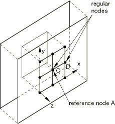
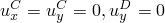
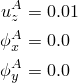
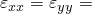
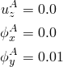
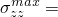
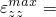
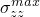
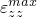

# 1.3.2 具有边界平面相对运动的广义平面应变单元

**产品：**Abaqus/Standard  

### 测试的单元

CPEG3    CPEG3H    CPEG3HT    CPEG3T    CPEG4    CPEG4H    CPEG4HT    CPEG4I    CPEG4IH    CPEG4R    CPEG4RH    CPEG4RHT    CPEG4RT    CPEG4T    CPEG6    CPEG6H    CPEG6M    CPEG6MH    CPEG6MHT    CPEG6MT    CPEG8    CPEG8H    CPEG8HT    CPEG8R    CPEG8RH    CPEG8RHT    CPEG8T    

### 问题描述

**材料：**

线弹性，弹性模量 = 30  106，泊松比 = 0.3。

**边界条件：**

。

#### 步骤 1（微扰）

施加 0.01 单位的平面外位移（一个边界平面相对于另一个的运动）到参考节点的自度 3，即纤维长度自由度的变化。

**解析解：**

**应力**

在每个节点处  3.0  105。

**应变**

在每个节点处  3.0  103， 1.0  102。

#### 步骤 2（微扰）

相对于 *y* 轴施加 0.01 弧度的相对旋转到参考节点的自度 5（一个边界平面相对于另一个的旋转自由度）。

**解析解：**

**应力**

最大拉应力  1.5  105。

**应变**

最大拉应变  5  103。

### 结果与讨论

对于步骤 1，所有单元类型都产生精确解。步骤 2 的结果如下表所示：

| 单元类型 |  |  |
| --- | --- | --- |
| CPEG3 | 1.264 105 | 4.167 103 |
| CPEG3H | 1.264 105 | 4.167 103 |
| CPEG3HT | 1.264 105 | 4.167 103 |
| CPEG3T | 1.264 105 | 4.167 103 |
| CPEG4 | 1.131 105 | 3.750 103 |
| CPEG4H | 1.131 105 | 3.750 103 |
| CPEG4HT | 1.131 105 | 3.750 103 |
| CPEG4I | 1.500 105 | 5.000 103 |
| CPEG4IH | 1.500 105 | 5.000 103 |
| CPEG4R | 1.125 105 | 3.750 103 |
| CPEG4RH | 1.125 105 | 3.750 102 |
| CPEG4RHT | 1.125 105 | 3.750 102 |
| CPEG4RT | 1.125 105 | 3.750 103 |
| CPEG4T | 1.131 105 | 3.750 103 |
| CPEG6 | 1.500 105 | 5.000 103 |
| CPEG6H | 1.500 105 | 5.000 103 |
| CPEG6M | 1.504 105 | 5.000 103 |
| CPEG6MH | 1.504 105 | 5.000 103 |
| CPEG6MHT | 1.504 105 | 5.000 103 |
| CPEG6MT | 1.504 105 | 5.000 103 |
| CPEG8 | 1.500 105 | 5.000 103 |
| CPEG8H | 1.500 105 | 5.000 103 |
| CPEG8HT | 1.500 105 | 5.000 103 |
| CPEG8R | 1.500 105 | 5.000 103 |
| CPEG8RH | 1.500 105 | 5.000 103 |
| CPEG8RHT | 1.500 105 | 5.000 103 |
| CPEG8T | 1.500 105 | 5.000 103 |

二阶四边形单元、一阶不兼容模式单元和二次三角形单元产生精确解。改进的三角形单元产生接近精确的解。其他单元类型表现出刚性响应。

### 输入文件

[ecg3sas2.inp](../eif/ecg3sas2.inp)

CPEG3 和 CPEG3H 单元。

[ecg4sas2.inp](../eif/ecg4sas2.inp)

CPEG4、CPEG4I、CPEG4R、CPEG4IH、CPEG4H 和 CPEG4RH 单元。

[ecg6sas2.inp](../eif/ecg6sas2.inp)

CPEG6、CPEG6H、CPEG6M 和 CPEG6MH 单元。

[ecg8sas2.inp](../eif/ecg8sas2.inp)

CPEG8、CPEG8R、CPEG8H 和 CPEG8RH 单元。

[ecg3tas2.inp](../eif/ecg3tas2.inp)

CPEG3HT 和 CPEG3T 单元。

[ecg4tas2.inp](../eif/ecg4tas2.inp)

CPEG4HT、CPEG4RHT、CPEG4RT 和 CPEG4T 单元。

[ecg6tas2.inp](../eif/ecg6tas2.inp)

CPEG6、CPEG6H、CPEG6MT 和 CPEG6MHT 单元。

[ecg8tas2.inp](../eif/ecg8tas2.inp)

CPEG8HT、CPEG8RHT 和 CPEG8T 单元。

