# 1.3.3 三维实体单元

**产品：**Abaqus/Standard  

### 测试的单元

C3D4    C3D4H    C3D6    C3D6H    C3D8    C3D8H    C3D8I    C3D8IH    C3D8R    C3D8RH    C3D10    C3D10H    C3D10I    C3D10M    C3D10MH    C3D15    C3D15H    C3D15V    C3D15VH    C3D20    C3D20H    C3D20R    C3D20RH    C3D27    C3D27H    C3D27R    C3D27RH    

### 问题描述

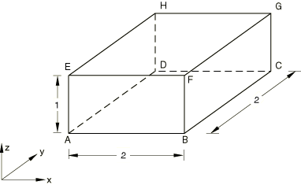

**材料：**

线弹性，弹性模量 = 30  106，泊松比 = 0.3。

**边界条件：**

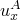 = 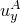 = 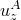 = 0，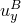 = 0，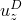 = 0，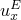 = 0。

#### 步骤 1

在每个面上施加 1000/面积的分布压力，以及等效集中力用于剪切载荷，定义使得所有三个剪应力大小为 1000。

**响应：**

**应力**

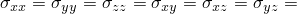 在每个积分点处为 1000。

**应变**

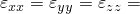 1.3333  105， 8.6667  105。

**位移**

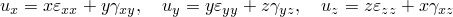。

对于低阶单元，测试描述完成。对于高阶单元，包含另一个步骤定义。

#### 步骤 2

除了步骤 1 的载荷外，在四个垂直面上施加静水压力载荷，从顶部为 0 到底部为 1000/面积。

**响应：**

**应力**

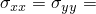 1000(2  *z*)， 1000，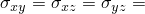 1000。

**应变**

 3.333  105(0.7*z*  1.1)， 3.333  105(0.2  0.6*z*)，

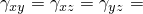 8.66667  105。

### 结果与讨论

使用减缩积分的单元可能具有除上述规定之外的附加边界条件。

单元 C3D27R 和 C3D27RH 在此测试中使用 21 个节点以产生精确解。缺少面中节点与单元的预期用途一致，因为不存在接触单元。

所有不使用改进公式的单元（除了 C3D20RH）都产生精确解。单元 C3D20RH 计算的应力是正确的。

改进的四面体单元公式由于用于未知场的分段线性插值而无法精确捕获线性变化梯度场。然而，随着网格细化，数值解将收敛到精确解。

某些输入文件使用对结果（.fil）文件和数据（.dat）文件的截面输出请求，以输出 *y*-*z* 平面上面的累积量。该面的面积在两个步骤中均为 2.0。累积力在局部于截面的坐标系中报告。在步骤 1 中，每个局部方向的力为 2000。在步骤 2 中，局部 1 方向（垂直于面）上的总力分量变为 3000。

### 输入文件

[ec34sfs2.inp](../eif/ec34sfs2.inp)

C3D4 单元。

[ec34shs2.inp](../eif/ec34shs2.inp)

C3D4H 单元。

[ec36sfs2.inp](../eif/ec36sfs2.inp)

C3D6 单元。

[ec36shs2.inp](../eif/ec36shs2.inp)

C3D6H 单元。

[ec38sfs2.inp](../eif/ec38sfs2.inp)

C3D8 单元。

[ec38shs2.inp](../eif/ec38shs2.inp)

C3D8H 单元。

[ec38sis2.inp](../eif/ec38sis2.inp)

C3D8I 单元。

[ec38sjs2.inp](../eif/ec38sjs2.inp)

C3D8IH 单元。

[ec38srs2.inp](../eif/ec38srs2.inp)

C3D8R 单元。

[ec38sys2.inp](../eif/ec38sys2.inp)

C3D8RH 单元。

[ec3asfs2.inp](../eif/ec3asfs2.inp)

C3D10 单元。

[ec3ashs2.inp](../eif/ec3ashs2.inp)

C3D10H 单元。

[ec3asis2.inp](../eif/ec3asis2.inp)

C3D10I 单元。

[ec3asks2.inp](../eif/ec3asks2.inp)

C3D10M 单元。

[ec3asls2.inp](../eif/ec3asls2.inp)

C3D10MH 单元。

[ec3fsfs2.inp](../eif/ec3fsfs2.inp)

C3D15 单元。

[ec3fshs2.inp](../eif/ec3fshs2.inp)

C3D15H 单元。

[ec3isfs2.inp](../eif/ec3isfs2.inp)

C3D15V 单元。

[ec3ishs2.inp](../eif/ec3ishs2.inp)

C3D15VH 单元。

[ec3ksfs2.inp](../eif/ec3ksfs2.inp)

C3D20 单元。

[ec3kshs2.inp](../eif/ec3kshs2.inp)

C3D20H 单元。

[ec3ksrs2.inp](../eif/ec3ksrs2.inp)

C3D20R 单元。

[ec3ksys2.inp](../eif/ec3ksys2.inp)

C3D20RH 单元。

[ec3rsfs2.inp](../eif/ec3rsfs2.inp)

C3D27 单元。

[ec3rshs2.inp](../eif/ec3rshs2.inp)

C3D27H 单元。

[ec3rsrs2.inp](../eif/ec3rsrs2.inp)

C3D27R 单元。

[ec3rsys2.inp](../eif/ec3rsys2.inp)

C3D27RH 单元。

