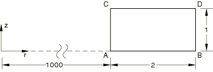
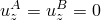

# 1.3.4 轴对称实体单元

**产品：**Abaqus/Standard  

### 测试的单元

CAX3    CAX3H    CAX4    CAX4H    CAX4I    CAX4IH    CAX4R    CAX4RH    CAX4RHT    CAX4RT    CAX6    CAX6H    CAX6M    CAX6MH    CAX6MHT    CAX6MT    CAX8    CAX8H    CAX8R    CAX8RH    

### 问题描述

**材料：**

线弹性，弹性模量 = 30  106，泊松比 = 0.3。

对于耦合温度-位移单元，指定虚拟热属性以完成材料定义。

**边界条件：**

。

#### 步骤 1

在每个面上施加 1000/面积的分布压力载荷。

**响应：**

**应力**

在每个积分点， 1000， 0。

**应变**

 1.3333  105， 0。

**位移**

 1.33  102，沿  1000， 1.33  105*z*。

对于低阶单元，测试描述完成。对于高阶单元，包含另一个步骤定义。

#### 步骤 2

除了步骤 1 的载荷外，沿两个垂直面施加静水压力载荷，从顶部为 0 到底部为 1000/面积。

以下参考解使用 CAXA84 轴对称实体单元和非线性非对称变形（输入文件 [eref84s3.inp](../eif/eref84s3.inp)）针对步骤 2 获得，并在  0.5 处给出。

**应力**

 1500， 1000， 1500， 0。

**应变**

 2.5  105， 3.33  106， 2.5  105， 0。

### 结果与讨论

使用减缩积分的单元可能具有除上述规定之外的附加边界条件。所有单元都产生精确解。

某些输入文件使用对结果（.fil）文件和数据（.dat）文件的截面输出请求，以输出 CD面上的累积量。这些量在局部于截面的坐标系中报告。

### 输入文件

[eca3sfs3.inp](../eif/eca3sfs3.inp)

CAX3 单元。

[eca3shs3.inp](../eif/eca3shs3.inp)

CAX3H 单元。

[eca4sfs3.inp](../eif/eca4sfs3.inp)

CAX4 单元。

[eca4shs3.inp](../eif/eca4shs3.inp)

CAX4H 单元。

[eca4sis3.inp](../eif/eca4sis3.inp)

CAX4I 单元。

[eca4sjs3.inp](../eif/eca4sjs3.inp)

CAX4IH 单元。

[eca4srs3.inp](../eif/eca4srs3.inp)

CAX4R 单元。

[eca4sys3.inp](../eif/eca4sys3.inp)

CAX4RH 单元。

[eca4tys3.inp](../eif/eca4tys3.inp)

CAX4RHT 单元。

[eca4trs3.inp](../eif/eca4trs3.inp)

CAX4RT 单元。

[eca6sfs3.inp](../eif/eca6sfs3.inp)

CAX6 单元。

[eca6shs3.inp](../eif/eca6shs3.inp)

CAX6H 单元。

[eca6sks3.inp](../eif/eca6sks3.inp)

CAX6M 单元。

[eca6sls3.inp](../eif/eca6sls3.inp)

CAX6MH 单元。

[eca6tls3.inp](../eif/eca6tls3.inp)

CAX6MHT 单元。

[eca6tks3.inp](../eif/eca6tks3.inp)

CAX6MT 单元。

[eca8sfs3.inp](../eif/eca8sfs3.inp)

CAX8 单元。

[eca8shs3.inp](../eif/eca8shs3.inp)

CAX8H 单元。

[eca8srs3.inp](../eif/eca8srs3.inp)

CAX8R 单元。

[eca8sys3.inp](../eif/eca8sys3.inp)

CAX8RH 单元。

