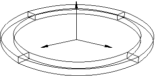
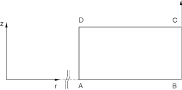
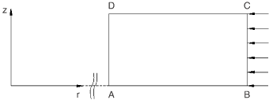
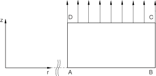
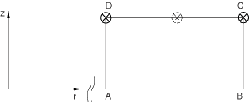

# 1.3.6 圆柱坐标单元

**产品：**Abaqus/Standard  

### 测试的单元

CCL9    CCL9H    CCL18    CCL18H    CCL12    CCL12H    

CCL24    CCL24R    CCL24H    CCL24RH    

### 测试的功能

针对集中载荷和分布载荷情况测试单元。研究了不同类型的分析（线性和非线性）。使用了弹性和超弹性材料模型。

### 问题描述

**网格：**

上述网格用于具有矩形横截面的单元。对于具有三角形横截面的单元，上述每个单元使用两个单元。对称轴是 *z* 轴。

**材料：**

线弹性：线弹性，弹性模量 = 30  106，泊松比 = 0.3。超弹性：超弹性，多项式应变能势，*N*=2， = 1  105， = 0.5  105， = 0.5  105， = 0.8  105， = 0.75  105， = 1  107， = 1  107。

**边界条件：**

情形 1

段 AD 固定。施加轴对称边界条件。

情形 2

段 AD 固定。施加轴对称边界条件。

情形 3

CCL12 和 CCL9：段 AD 固定。施加轴对称边界条件。CCL24 和 CCL18：段 AB 固定。施加轴对称边界条件。

情形 4

段 AB 固定。

**载荷：**

情形 1：集中载荷情形
情形 2：分布载荷情形
情形 3：分布表面载荷情形
情形 4：集中载荷情形
（参见前图）

### 结果与讨论

将结果与使用轴对称单元获得的结果进行比较。CCL9 单元与 CAX3（以及适当时的 CGAX3）进行比较，CCL12 单元与 CAX4（以及适当时的 CGAX4）进行比较，CCL18 单元与 CAX6（以及适当时的 CGAX6）进行比较，CCL24 与 CAX8（以及适当时的 CGAX8）进行比较。圆柱坐标单元和轴对称单元产生相同结果，差异小于 2%。

### 输入文件

[ecc9gfs1a.inp](../eif/ecc9gfs1a.inp)

CCL9 单元，情形 1 的载荷和边界条件，微扰步骤，弹性材料。

[ecc9gfs1b.inp](../eif/ecc9gfs1b.inp)

CCL9 单元，情形 1 的载荷和边界条件，一般步骤，弹性材料。

[ecc9gfs1c.inp](../eif/ecc9gfs1c.inp)

CCL9 单元，情形 1 的载荷和边界条件，假设非线性几何，弹性材料。

[ecc9ghs1d.inp](../eif/ecc9ghs1d.inp)

CCL9H 单元，情形 1 的载荷和边界条件，假设非线性几何，超弹性材料。

[ecc9gfs2a.inp](../eif/ecc9gfs2a.inp)

CCL9 单元，情形 2 的载荷和边界条件，微扰步骤，弹性材料。

[ecc9gfs2b.inp](../eif/ecc9gfs2b.inp)

CCL9 单元，情形 2 的载荷和边界条件，一般步骤，弹性材料。

[ecc9gfs2c.inp](../eif/ecc9gfs2c.inp)

CCL9 单元，情形 2 的载荷和边界条件，假设非线性几何，弹性材料。

[ecc9ghs2d.inp](../eif/ecc9ghs2d.inp)

CCL9H 单元，情形 2 的载荷和边界条件，假设非线性几何，超弹性材料。

[ecc9gfs3a.inp](../eif/ecc9gfs3a.inp)

CCL9 单元，情形 3 的载荷和边界条件，微扰步骤，弹性材料。

[ecc9gfs3b.inp](../eif/ecc9gfs3b.inp)

CCL9 单元，情形 3 的载荷和边界条件，一般步骤，弹性材料。

[ecc9gfs3c.inp](../eif/ecc9gfs3c.inp)

CCL9 单元，情形 3 的载荷和边界条件，假设非线性几何，弹性材料。

[ecc9ghs3d.inp](../eif/ecc9ghs3d.inp)

CCL9H 单元，情形 3 的载荷和边界条件，假设非线性几何，超弹性材料。

[ecc9gfs4a.inp](../eif/ecc9gfs4a.inp)

CCL9 单元，情形 4 的载荷和边界条件，微扰步骤，弹性材料。

[ecc9gfs4b.inp](../eif/ecc9gfs4b.inp)

CCL9 单元，情形 4 的载荷和边界条件，一般步骤，弹性材料。

[ecc9gfs4c.inp](../eif/ecc9gfs4c.inp)

CCL9 单元，情形 4 的载荷和边界条件，假设非线性几何，弹性材料。

[ecc9ghs4d.inp](../eif/ecc9ghs4d.inp)

CCL9H 单元，情形 4 的载荷和边界条件，假设非线性几何，超弹性材料。

[ecccgfs1a.inp](../eif/ecccgfs1a.inp)

CCL12 单元，情形 1 的载荷和边界条件，带 [*LOAD CASE](../key/key-link.md#usb-kws-hloadcase) 的微扰步骤，弹性材料。

[ecccgfs1b.inp](../eif/ecccgfs1b.inp)

CCL12 单元，情形 1 的载荷和边界条件，一般步骤，弹性材料。

[ecccgfs1c.inp](../eif/ecccgfs1c.inp)

CCL12 单元，情形 1 的载荷和边界条件，假设非线性几何，弹性材料。

[ecccghs1d.inp](../eif/ecccghs1d.inp)

CCL12H 单元，情形 1 的载荷和边界条件，假设非线性几何，超弹性材料。

[ecccgfs2a.inp](../eif/ecccgfs2a.inp)

CCL12 单元，情形 2 的载荷和边界条件，微扰步骤，弹性材料。

[ecccgfs2b.inp](../eif/ecccgfs2b.inp)

CCL12 单元，情形 2 的载荷和边界条件，一般步骤，弹性材料。

[ecccgfs2c.inp](../eif/ecccgfs2c.inp)

CCL12 单元，情形 2 的载荷和边界条件，假设非线性几何，带 [*LOAD CASE](../key/key-link.md#usb-kws-hloadcase) 的附加线性微扰步骤，弹性材料。

[ecccghs2d.inp](../eif/ecccghs2d.inp)

CCL12H 单元，情形 2 的载荷和边界条件，假设非线性几何，超弹性材料。

[ecccgfs3a.inp](../eif/ecccgfs3a.inp)

CCL12 单元，情形 3 的载荷和边界条件，微扰步骤，弹性材料。

[ecccgfs3b.inp](../eif/ecccgfs3b.inp)

CCL12 单元，情形 3 的载荷和边界条件，一般步骤，弹性材料。

[ecccgfs3c.inp](../eif/ecccgfs3c.inp)

CCL12 单元，情形 3 的载荷和边界条件，假设非线性几何，弹性材料。

[ecccghs3d.inp](../eif/ecccghs3d.inp)

CCL12H 单元，情形 3 的载荷和边界条件，假设非线性几何，超弹性材料。

[ecccgfs4a.inp](../eif/ecccgfs4a.inp)

CCL12 单元，情形 4 的载荷和边界条件，微扰步骤，弹性材料。

[ecccgfs4b.inp](../eif/ecccgfs4b.inp)

CCL12 单元，情形 4 的载荷和边界条件，一般步骤，弹性材料。

[ecccgfs4c.inp](../eif/ecccgfs4c.inp)

CCL12 单元，情形 4 的载荷和边界条件，假设非线性几何，弹性材料。

[ecccghs4d.inp](../eif/ecccghs4d.inp)

CCL12H 单元，情形 4 的载荷和边界条件，假设非线性几何，超弹性材料。

[eccigfs1a.inp](../eif/eccigfs1a.inp)

CCL18 单元，情形 1 的载荷和边界条件，微扰步骤，弹性材料。

[eccigfs1b.inp](../eif/eccigfs1b.inp)

CCL18 单元，情形 1 的载荷和边界条件，一般步骤，弹性材料。

[eccigfs1c.inp](../eif/eccigfs1c.inp)

CCL18 单元，情形 1 的载荷和边界条件，假设非线性几何，弹性材料。

[eccighs1d.inp](../eif/eccighs1d.inp)

CCL18H 单元，情形 1 的载荷和边界条件，假设非线性几何，超弹性材料。

[eccigfs2a.inp](../eif/eccigfs2a.inp)

CCL18 单元，情形 2 的载荷和边界条件，微扰步骤，弹性材料。

[eccigfs2b.inp](../eif/eccigfs2b.inp)

CCL18 单元，情形 2 的载荷和边界条件，一般步骤，弹性材料。

[eccigfs2c.inp](../eif/eccigfs2c.inp)

CCL18 单元，情形 2 的载荷和边界条件，假设非线性几何，弹性材料。

[eccighs2d.inp](../eif/eccighs2d.inp)

CCL18H 单元，情形 2 的载荷和边界条件，假设非线性几何，超弹性材料。

[eccigfs3a.inp](../eif/eccigfs3a.inp)

CCL18 单元，情形 3 的载荷和边界条件，微扰步骤，弹性材料。

[eccigfs3b.inp](../eif/eccigfs3b.inp)

CCL18 单元，情形 3 的载荷和边界条件，一般步骤，弹性材料。

[eccigfs3c.inp](../eif/eccigfs3c.inp)

CCL18 单元，情形 3 的载荷和边界条件，假设非线性几何，弹性材料。

[eccighs3d.inp](../eif/eccighs3d.inp)

CCL18H 单元，情形 3 的载荷和边界条件，假设非线性几何，超弹性材料。

[eccigfs4a.inp](../eif/eccigfs4a.inp)

CCL18 单元，情形 4 的载荷和边界条件，微扰步骤，弹性材料。

[eccigfs4b.inp](../eif/eccigfs4b.inp)

CCL18 单元，情形 4 的载荷和边界条件，一般步骤，弹性材料。

[eccigfs4c.inp](../eif/eccigfs4c.inp)

CCL18 单元，情形 4 的载荷和边界条件，假设非线性几何，弹性材料。

[eccighs4d.inp](../eif/eccighs4d.inp)

CCL18H 单元，情形 4 的载荷和边界条件，假设非线性几何，超弹性材料。

[eccrgfs1a.inp](../eif/eccrgfs1a.inp)

CCL24 单元，情形 1 的载荷和边界条件，微扰步骤，弹性材料。

[eccrgfs1b.inp](../eif/eccrgfs1b.inp)

CCL24 单元，情形 1 的载荷和边界条件，一般步骤，弹性材料。

[eccrgfs1c.inp](../eif/eccrgfs1c.inp)

CCL24 单元，情形 1 的载荷和边界条件，假设非线性几何，弹性材料。

[eccrghs1d.inp](../eif/eccrghs1d.inp)

CCL24H 单元，情形 1 的载荷和边界条件，假设非线性几何，超弹性材料。

[eccrgfs2a.inp](../eif/eccrgfs2a.inp)

CCL24 单元，情形 2 的载荷和边界条件，微扰步骤，弹性材料。

[eccrgfs2b.inp](../eif/eccrgfs2b.inp)

CCL24 单元，情形 2 的载荷和边界条件，一般步骤，弹性材料。

[eccrgfs2c.inp](../eif/eccrgfs2c.inp)

CCL24 单元，情形 2 的载荷和边界条件，假设非线性几何，弹性材料。

[eccrghs2d.inp](../eif/eccrghs2d.inp)

CCL24H 单元，情形 2 的载荷和边界条件，假设非线性几何，超弹性材料。

[eccrgfs3a.inp](../eif/eccrgfs3a.inp)

CCL24 单元，情形 3 的载荷和边界条件，微扰步骤，弹性材料。

[eccrgfs3b.inp](../eif/eccrgfs3b.inp)

CCL24 单元，情形 3 的载荷和边界条件，一般步骤，弹性材料。

[eccrgfs3c.inp](../eif/eccrgfs3c.inp)

CCL24 单元，情形 3 的载荷和边界条件，假设非线性几何，弹性材料。

[eccrghs3d.inp](../eif/eccrghs3d.inp)

CCL24H 单元，情形 3 的载荷和边界条件，假设非线性几何，超弹性材料。

[eccrgfs4a.inp](../eif/eccrgfs4a.inp)

CCL24 单元，情形 4 的载荷和边界条件，微扰步骤，弹性材料。

[eccrgfs4b.inp](../eif/eccrgfs4b.inp)

CCL24 单元，情形 4 的载荷和边界条件，一般步骤，弹性材料。

[eccrgfs4c.inp](../eif/eccrgfs4c.inp)

CCL24 单元，情形 4 的载荷和边界条件，假设非线性几何，弹性材料。

[eccrghs4d.inp](../eif/eccrghs4d.inp)

CCL24H 单元，情形 4 的载荷和边界条件，假设非线性几何，超弹性材料。

[eccrgrs1a.inp](../eif/eccrgrs1a.inp)

CCL24R 单元，情形 1 的载荷和边界条件，微扰步骤，弹性材料。

[eccrgrs1b.inp](../eif/eccrgrs1b.inp)

CCL24R 单元，情形 1 的载荷和边界条件，一般步骤，弹性材料。

[eccrgrs1c.inp](../eif/eccrgrs1c.inp)

CCL24R 单元，情形 1 的载荷和边界条件，假设非线性几何，弹性材料。

[eccrgys1d.inp](../eif/eccrgys1d.inp)

CCL24RH 单元，情形 1 的载荷和边界条件，假设非线性几何，超弹性材料。

[eccrgrs2a.inp](../eif/eccrgrs2a.inp)

CCL24R 单元，情形 2 的载荷和边界条件，微扰步骤，弹性材料。

[eccrgrs2b.inp](../eif/eccrgrs2b.inp)

CCL24R 单元，情形 2 的载荷和边界条件，一般步骤，弹性材料。

[eccrgrs2c.inp](../eif/eccrgrs2c.inp)

CCL24R 单元，情形 2 的载荷和边界条件，假设非线性几何，弹性材料。

[eccrgys2d.inp](../eif/eccrgys2d.inp)

CCL24RH 单元，情形 2 的载荷和边界条件，假设非线性几何，超弹性材料。

[eccrgrs3a.inp](../eif/eccrgrs3a.inp)

CCL24R 单元，情形 3 的载荷和边界条件，微扰步骤，弹性材料。

[eccrgrs3b.inp](../eif/eccrgrs3b.inp)

CCL24R 单元，情形 3 的载荷和边界条件，一般步骤，弹性材料。

[eccrgrs3c.inp](../eif/eccrgrs3c.inp)

CCL24R 单元，情形 3 的载荷和边界条件，假设非线性几何，弹性材料。

[eccrgys3d.inp](../eif/eccrgys3d.inp)

CCL24RH 单元，情形 3 的载荷和边界条件，假设非线性几何，超弹性材料。

[eccrgrs4a.inp](../eif/eccrgrs4a.inp)

CCL24R 单元，情形 4 的载荷和边界条件，微扰步骤，弹性材料。

[eccrgrs4b.inp](../eif/eccrgrs4b.inp)

CCL24R 单元，情形 4 的载荷和边界条件，一般步骤，弹性材料。

[eccrgrs4c.inp](../eif/eccrgrs4c.inp)

CCL24R 单元，情形 4 的载荷和边界条件，假设非线性几何，弹性材料。

[eccrgys4d.inp](../eif/eccrgys4d.inp)

CCL24RH 单元，情形 4 的载荷和边界条件，假设非线性几何，超弹性材料。

