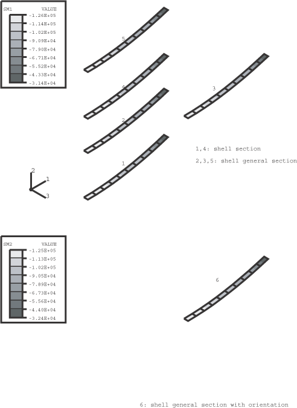
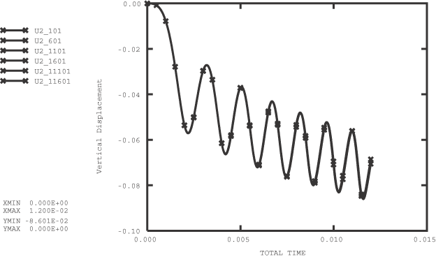
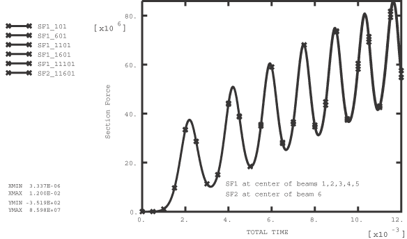
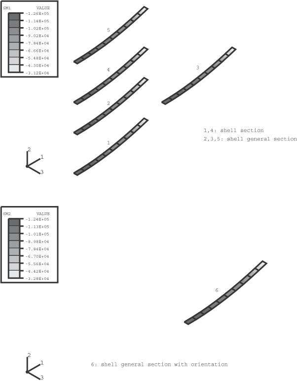
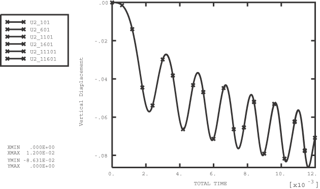
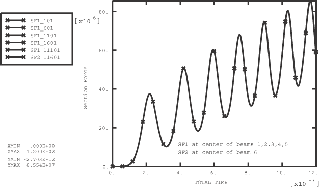

# 1.3.15 复合壳截面

**产品：**Abaqus/Explicit  

### 测试的单元

S4    S4R    S4RS    S4RSW    

### 测试的功能

壳通用截面，复合层压板，取向。

### 问题描述

在 Abaqus/Explicit 中定义复合壳截面有三种不同的选项：

1. 壳通用截面，用户以矩阵形式提供壳截面的（常数）刚度系数。
2. 分层弹性壳截面，Abaqus/Explicit 计算预积分的有效壳刚度矩阵。使用此选项，用户定义层数、每层材料属性和每层取向。材料定义必须是弹性的才能预积分壳刚度。此选项将打印从分层壳截面计算的有效刚度系数矩阵。
3. 数值积分壳截面。此情况的壳截面定义与上面选项 (b) 基本相同：用户定义层数、每层材料属性、每层取向以及每层厚度方向的积分点数。此情况的材料属性可以是非线性的（例如，可以使用塑性）。如果仅使用弹性属性与壳截面，使用上面选项 (b) 中的通用壳截面更有效。

此验证问题的目的是确保生成壳截面的每种不同选项对相同的物理壳模型产生相同的结果。测试由六个相同的简支梁在均匀压力载荷下组成。执行两组分析：一组使用 S4R 单元建模梁，另一组使用 S4RS 单元建模梁。由于对称性，仅考虑每个梁的一半。研究每种单元类型的六种情况：

1. 使用数值积分壳截面建模的三明治梁。有三层线性弹性层，由铝层（厚度 8 mm）夹在两层钢（厚度 6 mm）之间。每层有三个材料点通过厚度。
2. 与情况 1 相同的三明治梁，使用复合通用壳截面建模。
3. 与情况 1 相同的三明治梁，使用通用壳截面建模，其中壳截面的刚度矩阵（21 个系数）给出与预积分情况 2 对应的值。
4. 与情况 1 相同，只是对每层施加 90° 的面内取向角。由于材料是各向同性的，取向不应影响最终结果。
5. 与情况 2 相同，只是对每层施加 90° 的面内取向角。
6. 与情况 3 相同，只是对整个截面施加取向。面内取向用局部节点编号定义。

### 结果与讨论

[图 1.3.15--1](ch01s03abv18.md#exxshellsect-contours-s4r) 显示了在使用 S4R 单元进行分析时情况 1 至 5 的截面弯矩 SM1 在变形几何上的等值线图，以及情况 6 的截面弯矩 SM2。[图 1.3.15--2](ch01s03abv18.md#exxshellsect-deflect-s4r) 显示了所有六种情况梁中心挠度的时间历程。[图 1.3.15--3](ch01s03abv18.md#exxshellsect-memforces-s4r) 显示了梁中心的截面力 SF1（膜力）的时间历程。请注意，在 Abaqus/Explicit 中，任何取向选项都不会影响截面力的输出，因为它们始终在默认壳系统中。应力和应变以局部材料坐标系输出到选定结果文件。这些量的局部坐标系方向会自动写入结果文件。

[图 1.3.15--4](ch01s03abv18.md#exxshellsect-contours-s4rs) 到 [图 1.3.15--6](ch01s03abv18.md#exxshellsect-memforces-s4rs) 显示了使用 S4RS 单元进行分析的类似结果。

### 输入文件

[shellsect.inp](../eif/shellsect.inp)

S4R 模型，带壳截面。

[shellgensect.inp](../eif/shellgensect.inp)

S4R 模型，带通用壳截面。

[shellsect_s4rs.inp](../eif/shellsect_s4rs.inp)

S4RS 模型，带壳截面。

[shellgensect_s4rs.inp](../eif/shellgensect_s4rs.inp)

S4RS 模型，带通用壳截面。

[shellsect_s4.inp](../eif/shellsect_s4.inp)

S4 模型，带壳截面，仅用于测试性能。

[shellgensect_s4.inp](../eif/shellgensect_s4.inp)

S4 模型，带通用壳截面，仅用于测试性能。

[shellgensect_s4rsw.inp](../eif/shellgensect_s4rsw.inp)

S4RSW 模型，带通用壳截面，仅用于测试性能。

### 图

**图 1.3.15–1** 12 毫秒时的弯矩等值线（S4R 模型）。

**图 1.3.15–2** 中心挠度的时间历程（S4R 模型）。

**图 1.3.15–3** 膜力的时间历程（S4R 模型）。

**图 1.3.15–4** 12 毫秒时的弯矩等值线（S4RS 模型）。

**图 1.3.15–5** 中心挠度的时间历程（S4RS 模型）。

**图 1.3.15–6** 膜力的时间历程（S4RS 模型）。

