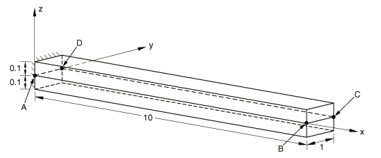
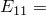
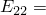
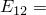
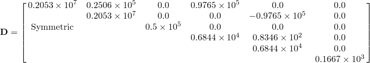

# 1.3.14 壳截面力的验证

**产品：**Abaqus/Standard  

### 测试的单元

S4    S4R    S4R5    S8R    S8R5    S9R5    STRI3    STRI65    

### 问题描述

**材料：**

线弹性， 2.00313  107， 5.00783  105， 1.25296  105， 0.5  105， 0.5  105。

**边界条件：**

沿  边的节点为固定端。

**载荷：**

在 *B* 和 *C* 节点处  0.5。

**取向：**

相对于 *x* 轴，绕 *z* 轴旋转，第一层为 90，第二层为 0。

模型中有两个具有相同几何形状的单元。第一个单元使用复合壳截面定义，并使用局部坐标系。第二个单元使用通用壳截面定义，直接输入截面刚度矩阵，等效于上述双层模型。

截面刚度为：

### 参考解

应力结果：弯矩 = 1.0(10.0  *x*)。

### 结果与讨论

所有单元都产生可接受的解。在输入文件 [es58s2sc.inp](../eif/es58s2sc.inp) 中使用 S8R5 单元类型请求局部坐标方向。

### 输入文件

[ese4s2sc.inp](../eif/ese4s2sc.inp)

S4 单元。

[esf4s2sc.inp](../eif/esf4s2sc.inp)

S4R 单元。

[es54s2sc.inp](../eif/es54s2sc.inp)

S4R5 单元。

[es68s2sc.inp](../eif/es68s2sc.inp)

S8R 单元。

[es58s2sc.inp](../eif/es58s2sc.inp)

S8R5 单元。

[es59s2sc.inp](../eif/es59s2sc.inp)

S9R5 单元。

[es63s2sc.inp](../eif/es63s2sc.inp)

STRI3 单元。

[es56s2sc.inp](../eif/es56s2sc.inp)

STRI65 单元。

