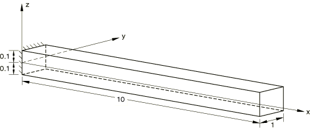

# 1.3.19 壳偏移

**产品：**Abaqus/Standard  

### 测试的单元

S4R    S8R    S8RT    

### 测试的功能

与壳截面和壳通用截面一起使用的壳偏移。

### 问题描述

模型由一块长度为 10.0、宽度为 1.0、厚度为 0.2 的板组成。 0 处的端部为固定端，除了绕  轴的旋转外，所有自由度在  10 处受到约束。对于静力分析，在  10 处施加旋转  0.1。使用单个偏移量为壳中面厚度一半的壳单元来建模板。所有单元的壳截面均使用 Simpson 规则。

两个额外的输入文件（[esf4sxsd.inp](../eif/esf4sxsd.inp) 和 [esf4sgsb.inp](../eif/esf4sgsb.inp)）测试悬臂半圆柱的弯曲。模型的半径为 5，长度为 20，厚度为 0.2。一端完全约束，均匀向上的压力施加于所有单元。包含了通用非线性静力过程。

在所有情况下使用弹性材料属性来定义材料， 3.0  106， 0.25。

### 结果与讨论

壳偏移结果的验证基于 ["Transverse shear stiffness in composite shells and offsets from the midsurface," Section 3.6.8 of the Abaqus Theory Guide](../stm/stm-link.md#stm-elm-transshearshells) 中描述的公式。通过与无偏移的等效模型的结果进行比较来验证结果。该等效模型使用复合壳截面和通用壳截面定义，其中添加了一层材料模量可以忽略的额外层。

### 输入文件

#### 复合壳截面偏移：

[esf4sxsc.inp](../eif/esf4sxsc.inp)

S4R 单元；静力步骤。

[esf4sxsd.inp](../eif/esf4sxsd.inp)

S4R 单元；使用 NLGEOM 的静力步骤。

[es68sxsc.inp](../eif/es68sxsc.inp)

S8R 单元；静力步骤。

[es68sxsd.inp](../eif/es68sxsd.inp)

S8R 单元；频率、稳态动力学、模态动力学和响应谱步骤。

[es68sxra.inp](../eif/es68sxra.inp)

S8R 单元；带钢筋的静力步骤。

[es68sxrb.inp](../eif/es68sxrb.inp)

S8R 单元；带钢筋的频率、稳态动力学、模态动力学和响应谱步骤。

[es68sxxa.inp](../eif/es68sxxa.inp)

S8R 单元；带热膨胀的静力步骤。

[es68sxxb.inp](../eif/es68sxxb.inp)

S8RT 单元；带静力载荷的耦合温度-位移步骤。

#### 通用壳截面偏移：

[esf4sgsa.inp](../eif/esf4sgsa.inp)

S4R 单元；静力步骤。

[esf4sgsb.inp](../eif/esf4sgsb.inp)

S4R 单元；使用 NLGEOM 的静力步骤。

[es68sgsa.inp](../eif/es68sgsa.inp)

S8R 单元；静力步骤。

[es68sgsb.inp](../eif/es68sgsb.inp)

S8R 单元；频率、稳态动力学、模态动力学和响应谱步骤。

