# 1.3.22 梁单元和截面类型的验证

**产品：**Abaqus/Standard  

### 测试的单元

B21H    B22    B23H    B31    B31OS    B31OSH    B32H    B32OS    B32OSH    B33H    

PIPE21H    PIPE22    PIPE31H    PIPE32    

ELBOW31    ELBOW31B    ELBOW31C    ELBOW32    

### 问题描述

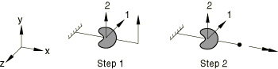

问题由沿 *x* 轴的悬臂梁组成。梁的长度为 75.0，模型由五个单元组成。对于二维单元，问题包括一个步骤，在该步骤中向梁端部施加 25.0 的横向载荷。对于三维单元，随后有一个额外的步骤，在该步骤中施加 25.0 绕 *x* 轴的力矩。运行了具有相似几何和载荷的众多测试，以测试与每个截面定义相关的可用选项。在具有开薄壁开环截面（[eb3ia3sd.inp](../eif/eb3ia3sd.inp)、[eb3ja3sd.inp](../eif/eb3ja3sd.inp)、[ebo3a3sd.inp](../eif/ebo3a3sd.inp)）的输入文件中，以及在使用通用梁截面的两个输入文件（[eb32gssd.inp](../eif/eb32gssd.inp)、[eb3jgssd.inp](../eif/eb3jgssd.inp)）中请求了局部坐标方向。

**材料：**

线弹性，弹性模量 = 3.0  106，泊松比 = 0.3。

**截面类型：**

任意（开和闭）、箱形、圆形、肘形、通用、六边形、I、L、非线性通用、管道、矩形、梯形。

### 截面力

所有问题都是静定问题，截面力已验证为正确。

### 参考解

**实心圆形截面：**

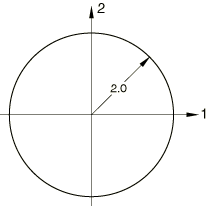

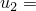 9.325  102，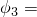 1.865  103（步骤 1），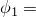 6.466  105（步骤 2）

**实心方形截面：**

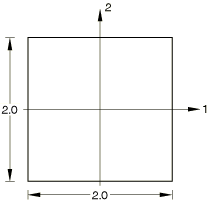

 .8789， 1.758  102（步骤 1）， 7.224  104（步骤 2）

**实心薄矩形截面：**

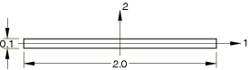

 .7031， 1.406  102（步骤 1）， 2.440  104（步骤 2）

**注：**载荷改为 .0025。

**闭口薄壁管道截面：**

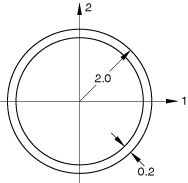

 .2712， 5.423  103（步骤 1）， 1.885  104（步骤 2）

**闭口薄壁箱形截面：**

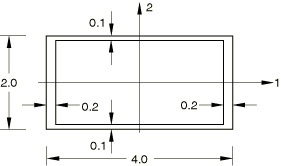

 1.278， 2.556  102（步骤 1）， 7.521  104（步骤 2）

**闭口薄壁六边形截面：**

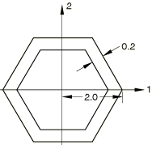

 .3489， 6.978  103（步骤 1）， 2.796  104（步骤 2）

**开薄壁 I 形截面：**

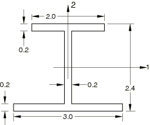

 .8931， 1.786  102（步骤 1）， 7.537  102（步骤 2）

**开薄壁 C 形截面：**

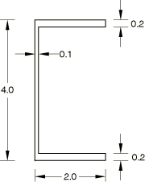

 .3564， 7.112  103（步骤 1）， .1081（步骤 2）

**开薄壁开环截面：**

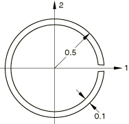

 29.84， .5949（步骤 1）， 1.388（步骤 2）

**开薄壁 L 形截面：**

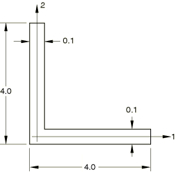

 1.422， 2.857  102（步骤 1）， .6177（步骤 2）

**开薄壁 T 形截面：**

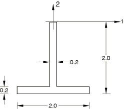

 4.069， 8.138  102（步骤 1）， .1563（步骤 2）

### 结果与讨论

步骤 1 的结果在解析值的 1% 以内。

步骤 2 的结果对于  精度较低。虽然杆和圆柱的结果是精确的，但其他闭口截面可能有百分之几的误差。对于开截面梁， 可能有超过 10% 的误差，除非使用开截面梁单元类型。开截面梁包括翘曲，这对  有显著影响。

### 输入文件

#### 任意截面，梁截面测试：

[eb32a1sd.inp](../eif/eb32a1sd.inp)

B31 单元，剪切中心处的槽形原点。

[eb32a2sd.inp](../eif/eb32a2sd.inp)

B31 单元，剪切中心处无槽形原点。

[eb32a3sd.inp](../eif/eb32a3sd.inp)

B31 单元，开圆形截面。

[eb32absd.inp](../eif/eb32absd.inp)

B31 单元，箱形截面。

[eb32aisd.inp](../eif/eb32aisd.inp)

B31 单元，I 形截面。

[eb32alsd.inp](../eif/eb32alsd.inp)

B31 单元，L 形截面。

[eb3ia1sd.inp](../eif/eb3ia1sd.inp)

B32H 单元，剪切中心处的槽形原点。

[eb3ia2sd.inp](../eif/eb3ia2sd.inp)

B32H 单元，剪切中心处无槽形原点。

[eb3ia3sd.inp](../eif/eb3ia3sd.inp)

B32H 单元，开圆形截面。

[eb3iabsd.inp](../eif/eb3iabsd.inp)

B32H 单元，箱形截面。

[eb3iaisd.inp](../eif/eb3iaisd.inp)

B32H 单元，I 形截面。

[eb3ialsd.inp](../eif/eb3ialsd.inp)

B32H 单元，L 形截面。

[eb3ja1sd.inp](../eif/eb3ja1sd.inp)

B33H 单元，剪切中心处的槽形原点。

[eb3ja2sd.inp](../eif/eb3ja2sd.inp)

B33H 单元，剪切中心处无槽形原点。

[eb3ja3sd.inp](../eif/eb3ja3sd.inp)

B33H 单元，开圆形截面。

[eb3jabsd.inp](../eif/eb3jabsd.inp)

B33H 单元，箱形截面。

[eb3jaisd.inp](../eif/eb3jaisd.inp)

B33H 单元，I 形截面。

[eb3jalsd.inp](../eif/eb3jalsd.inp)

B33H 单元，L 形截面。

[ebo2a1sd.inp](../eif/ebo2a1sd.inp)

B31OS 单元，剪切中心处的槽形原点。

[ebo2a2sd.inp](../eif/ebo2a2sd.inp)

B31OS 单元，剪切中心处无槽形原点。

[ebo2a3sd.inp](../eif/ebo2a3sd.inp)

B31OS 单元，开圆形截面。

[ebo2aisd.inp](../eif/ebo2aisd.inp)

B31OS 单元，I 形截面。

[ebo2alsd.inp](../eif/ebo2alsd.inp)

B31OS 单元，L 形截面。

[ebo3a1sd.inp](../eif/ebo3a1sd.inp)

B32OS 单元，剪切中心处的槽形原点。

[ebo3a2sd.inp](../eif/ebo3a2sd.inp)

B32OS 单元，剪切中心处无槽形原点。

[ebo3a3sd.inp](../eif/ebo3a3sd.inp)

B32OS 单元，开圆形截面。

[ebo3aisd.inp](../eif/ebo3aisd.inp)

B32OS 单元，I 形截面。

[ebo3alsd.inp](../eif/ebo3alsd.inp)

B32OS 单元，L 形截面。

[eboha1sd.inp](../eif/eboha1sd.inp)

B31OSH 单元，剪切中心处的槽形原点。

[eboha2sd.inp](../eif/eboha2sd.inp)

B31OSH 单元，剪切中心处无槽形原点。

[eboha3sd.inp](../eif/eboha3sd.inp)

B31OSH 单元，开圆形截面。

[ebohaisd.inp](../eif/ebohaisd.inp)

B31OSH 单元，I 形截面。

[ebohalsd.inp](../eif/ebohalsd.inp)

B31OSH 单元，L 形截面。

[eboia1sd.inp](../eif/eboia1sd.inp)

B32OSH 单元，剪切中心处的槽形原点。

[eboia2sd.inp](../eif/eboia2sd.inp)

B32OSH 单元，剪切中心处无槽形原点。

[eboia3sd.inp](../eif/eboia3sd.inp)

B32OSH 单元，开圆形截面。

[eboiaisd.inp](../eif/eboiaisd.inp)

B32OSH 单元，I 形截面。

[eboialsd.inp](../eif/eboialsd.inp)

B32OSH 单元，L 形截面。

#### 任意截面，通用梁截面测试：

[eb32d1sd.inp](../eif/eb32d1sd.inp)

B31 单元，剪切中心处的槽形原点。

[eb32d2sd.inp](../eif/eb32d2sd.inp)

B31 单元，剪切中心处无槽形原点。

[eb32d3sd.inp](../eif/eb32d3sd.inp)

B31 单元，开圆形截面。

[eb32dbsd.inp](../eif/eb32dbsd.inp)

B31 单元，箱形截面。

[eb32disd.inp](../eif/eb32disd.inp)

B31 单元，I 形截面。

[eb32dlsd.inp](../eif/eb32dlsd.inp)

B31 单元，L 形截面。

[eb3id1sd.inp](../eif/eb3id1sd.inp)

B32H 单元，剪切中心处的槽形原点。

[eb3id2sd.inp](../eif/eb3id2sd.inp)

B32H 单元，剪切中心处无槽形原点。

[eb3id3sd.inp](../eif/eb3id3sd.inp)

B32H 单元，开圆形截面。

[eb3idbsd.inp](../eif/eb3idbsd.inp)

B32H 单元，箱形截面。

[eb3idisd.inp](../eif/eb3idisd.inp)

B32H 单元，I 形截面。

[eb3idlsd.inp](../eif/eb3idlsd.inp)

B32H 单元，L 形截面。

[eb3jd1sd.inp](../eif/eb3jd1sd.inp)

B33H 单元，剪切中心处的槽形原点。

[eb3jd2sd.inp](../eif/eb3jd2sd.inp)

B33H 单元，剪切中心处无槽形原点。

[eb3jd3sd.inp](../eif/eb3jd3sd.inp)

B33H 单元，开圆形截面。

[eb3jdbsd.inp](../eif/eb3jdbsd.inp)

B33H 单元，箱形截面。

[eb3jdisd.inp](../eif/eb3jdisd.inp)

B33H 单元，I 形截面。

[eb3jdlsd.inp](../eif/eb3jdlsd.inp)

B33H 单元，L 形截面。

[ebo2d1sd.inp](../eif/ebo2d1sd.inp)

B31OS 单元，剪切中心处的槽形原点。

[ebo2d2sd.inp](../eif/ebo2d2sd.inp)

B31OS 单元，剪切中心处无槽形原点。

[ebo2d3sd.inp](../eif/ebo2d3sd.inp)

B31OS 单元，开圆形截面。

[ebo2disd.inp](../eif/ebo2disd.inp)

B31OS 单元，I 形截面。

[ebo2dlsd.inp](../eif/ebo2dlsd.inp)

B31OS 单元，L 形截面。

[ebo3d1sd.inp](../eif/ebo3d1sd.inp)

B32OS 单元，剪切中心处的槽形原点。

[ebo3d2sd.inp](../eif/ebo3d2sd.inp)

B32OS 单元，剪切中心处无槽形原点。

[ebo3d3sd.inp](../eif/ebo3d3sd.inp)

B32OS 单元，开圆形截面。

[ebo3disd.inp](../eif/ebo3disd.inp)

B32OS 单元，I 形截面。

[ebo3dlsd.inp](../eif/ebo3dlsd.inp)

B32OS 单元，L 形截面。

[ebohd1sd.inp](../eif/ebohd1sd.inp)

B31OSH 单元，剪切中心处的槽形原点。

[ebohd2sd.inp](../eif/ebohd2sd.inp)

B31OSH 单元，剪切中心处无槽形原点。

[ebohd3sd.inp](../eif/ebohd3sd.inp)

B31OSH 单元，开圆形截面。

[ebohdisd.inp](../eif/ebohdisd.inp)

B31OSH 单元，I 形截面。

[ebohdlsd.inp](../eif/ebohdlsd.inp)

B31OSH 单元，L 形截面。

[eboid1sd.inp](../eif/eboid1sd.inp)

B32OSH 单元，剪切中心处的槽形原点。

[eboid2sd.inp](../eif/eboid2sd.inp)

B32OSH 单元，剪切中心处无槽形原点。

[eboid3sd.inp](../eif/eboid3sd.inp)

B32OSH 单元，开圆形截面。

[eboidisd.inp](../eif/eboidisd.inp)

B32OSH 单元，I 形截面。

[eboidlsd.inp](../eif/eboidlsd.inp)

B32OSH 单元，L 形截面。

#### 箱形截面，梁截面测试：

[eb23bdsd.inp](../eif/eb23bdsd.inp)

B22 单元，默认积分。

[eb23bnsd.inp](../eif/eb23bnsd.inp)

B22 单元，非默认积分。

[eb2hbdsd.inp](../eif/eb2hbdsd.inp)

B21H 单元，默认积分。

[eb2hbnsd.inp](../eif/eb2hbnsd.inp)

B21H 单元，非默认积分。

[eb2jbdsd.inp](../eif/eb2jbdsd.inp)

B23H 单元，默认积分。

[eb2jbnsd.inp](../eif/eb2jbnsd.inp)

B23H 单元，非默认积分。

[eb32bdsd.inp](../eif/eb32bdsd.inp)

B31 单元，默认积分。

[eb32bnsd.inp](../eif/eb32bnsd.inp)

B31 单元，非默认积分。

[eb3ibdsd.inp](../eif/eb3ibdsd.inp)

B32H 单元，默认积分。

[eb3ibnsd.inp](../eif/eb3ibnsd.inp)

B32H 单元，非默认积分。

[eb3jbdsd.inp](../eif/eb3jbdsd.inp)

B33H 单元，默认积分。

[eb3jbnsd.inp](../eif/eb3jbnsd.inp)

B33H 单元，非默认积分。

#### 箱形截面，通用梁截面测试：

[eb23exsd.inp](../eif/eb23exsd.inp)

B22 单元。

[eb2hexsd.inp](../eif/eb2hexsd.inp)

B21H 单元。

[eb2jexsd.inp](../eif/eb2jexsd.inp)

B23H 单元。

[eb32exsd.inp](../eif/eb32exsd.inp)

B31 单元。

[eb3iexsd.inp](../eif/eb3iexsd.inp)

B32H 单元。

[eb3jexsd.inp](../eif/eb3jexsd.inp)

B33H 单元。

#### 圆形截面，梁截面测试：

[eb23cdsd.inp](../eif/eb23cdsd.inp)

B22 单元，默认积分。

[eb23cnsd.inp](../eif/eb23cnsd.inp)

B22 单元，非默认积分。

[eb2hcdsd.inp](../eif/eb2hcdsd.inp)

B21H 单元，默认积分。

[eb2hcnsd.inp](../eif/eb2hcnsd.inp)

B21H 单元，非默认积分。

[eb2jcdsd.inp](../eif/eb2jcdsd.inp)

B23H 单元，默认积分。

[eb2jcnsd.inp](../eif/eb2jcnsd.inp)

B23H 单元，非默认积分。

[eb32cdsd.inp](../eif/eb32cdsd.inp)

B31 单元，默认积分。

[eb32cnsd.inp](../eif/eb32cnsd.inp)

B31 单元，非默认积分。

[eb3icdsd.inp](../eif/eb3icdsd.inp)

B32H 单元，默认积分。

[eb3icnsd.inp](../eif/eb3icnsd.inp)

B32H 单元，非默认积分。

[eb3jcdsd.inp](../eif/eb3jcdsd.inp)

B33H 单元，默认积分。

[eb3jcnsd.inp](../eif/eb3jcnsd.inp)

B33H 单元，非默认积分。

#### 圆形截面，通用梁截面测试：

[eb23fxsd.inp](../eif/eb23fxsd.inp)

B22 单元。

[eb2hfxsd.inp](../eif/eb2hfxsd.inp)

B21H 单元。

[eb2jfxsd.inp](../eif/eb2jfxsd.inp)

B23H 单元。

[eb32fxsd.inp](../eif/eb32fxsd.inp)

B31 单元。

[eb3ifxsd.inp](../eif/eb3ifxsd.inp)

B32H 单元。

[eb3jfxsd.inp](../eif/eb3jfxsd.inp)

B33H 单元。

#### 通用截面测试：

[eb23gpsd.inp](../eif/eb23gpsd.inp)

B22 单元，管道截面。

[eb23gssd.inp](../eif/eb23gssd.inp)

B22 单元，实心方形截面。

[eb2hgpsd.inp](../eif/eb2hgpsd.inp)

B21H 单元，管道截面。

[eb2hgssd.inp](../eif/eb2hgssd.inp)

B21H 单元，实心方形截面。

[eb2jgpsd.inp](../eif/eb2jgpsd.inp)

B23H 单元，管道截面。

[eb2jgssd.inp](../eif/eb2jgssd.inp)

B23H 单元，实心方形截面。

[eb32gisd.inp](../eif/eb32gisd.inp)

B31 单元，I 形截面。

[eb32gpsd.inp](../eif/eb32gpsd.inp)

B31 单元，管道截面。

[eb32gssd.inp](../eif/eb32gssd.inp)

B31 单元，实心方形截面。

[eb3igpsd.inp](../eif/eb3igpsd.inp)

B32H 单元，管道截面。

[eb3igssd.inp](../eif/eb3igssd.inp)

B32H 单元，实心方形截面。

[eb3jgpsd.inp](../eif/eb3jgpsd.inp)

B33H 单元，管道截面。

[eb3jgssd.inp](../eif/eb3jgssd.inp)

B33H 单元，实心方形截面。

[ebo2gisd.inp](../eif/ebo2gisd.inp)

B31OS 单元，I 形截面。

[ebo3gisd.inp](../eif/ebo3gisd.inp)

B32OS 单元，I 形截面。

[ebohgisd.inp](../eif/ebohgisd.inp)

B31OSH 单元，I 形截面。

[ebohgisd.inp](../eif/ebohgisd.inp)

B32OSH 单元，I 形截面。

#### 六边形截面，梁截面测试：

[eb23hdsd.inp](../eif/eb23hdsd.inp)

B22 单元，默认积分。

[eb23hnsd.inp](../eif/eb23hnsd.inp)

B22 单元，非默认积分。

[eb2hhdsd.inp](../eif/eb2hhdsd.inp)

B21H 单元，默认积分。

[eb2hhnsd.inp](../eif/eb2hhnsd.inp)

B21H 单元，非默认积分。

[eb2jhdsd.inp](../eif/eb2jhdsd.inp)

B23H 单元，默认积分。

[eb2jhnsd.inp](../eif/eb2jhnsd.inp)

B23H 单元，非默认积分。

[eb32hdsd.inp](../eif/eb32hdsd.inp)

B31 单元，默认积分。

[eb32hnsd.inp](../eif/eb32hnsd.inp)

B31 单元，非默认积分。

[eb3ihdsd.inp](../eif/eb3ihdsd.inp)

B32H 单元，默认积分。

[eb3ihnsd.inp](../eif/eb3ihnsd.inp)

B32H 单元，非默认积分。

[eb3jhdsd.inp](../eif/eb3jhdsd.inp)

B33H 单元，默认积分。

[eb3jhnsd.inp](../eif/eb3jhnsd.inp)

B33H 单元，非默认积分。

#### 六边形截面，通用梁截面测试：

[eb23jxsd.inp](../eif/eb23jxsd.inp)

B22 单元。

[eb2hjxsd.inp](../eif/eb2hjxsd.inp)

B21H 单元。

[eb2jjxsd.inp](../eif/eb2jjxsd.inp)

B23H 单元。

[eb32jxsd.inp](../eif/eb32jxsd.inp)

B31 单元。

[eb3ijxsd.inp](../eif/eb3ijxsd.inp)

B32H 单元。

[eb3jjxsd.inp](../eif/eb3jjxsd.inp)

B33H 单元。

#### I 形截面，梁截面测试：

[eb23idsd.inp](../eif/eb23idsd.inp)

B22 单元，默认积分。

[eb23insd.inp](../eif/eb23insd.inp)

B22 单元，非默认积分。

[eb2hidsd.inp](../eif/eb2hidsd.inp)

B21H 单元，默认积分。

[eb2hinsd.inp](../eif/eb2hinsd.inp)

B21H 单元，非默认积分。

[eb2jidsd.inp](../eif/eb2jidsd.inp)

B23H 单元，默认积分。

[eb2jinsd.inp](../eif/eb2jinsd.inp)

B23H 单元，非默认积分。

[eb32idsd.inp](../eif/eb32idsd.inp)

B31 单元，默认积分。

[eb32insd.inp](../eif/eb32insd.inp)

B31 单元，非默认积分。

[eb32itsd.inp](../eif/eb32itsd.inp)

B31 单元，T 形截面。

[eb3iidsd.inp](../eif/eb3iidsd.inp)

B32H 单元，默认积分。

[eb3iinsd.inp](../eif/eb3iinsd.inp)

B32H 单元，非默认积分。

[eb3iitsd.inp](../eif/eb3iitsd.inp)

B32H 单元，T 形截面。

[eb3jidsd.inp](../eif/eb3jidsd.inp)

B33H 单元，默认积分。

[eb3jinsd.inp](../eif/eb3jinsd.inp)

B33H 单元，非默认积分。

[eb3jitsd.inp](../eif/eb3jitsd.inp)

B33H 单元，T 形截面。

[ebo2idsd.inp](../eif/ebo2idsd.inp)

B31OS 单元，默认积分。

[ebo2insd.inp](../eif/ebo2insd.inp)

B31OS 单元，非默认积分。

[ebo2itsd.inp](../eif/ebo2itsd.inp)

B31OS 单元，T 形截面。

[ebo3idsd.inp](../eif/ebo3idsd.inp)

B32OS 单元，默认积分。

[ebo3insd.inp](../eif/ebo3insd.inp)

B32OS 单元，非默认积分。

[ebo3itsd.inp](../eif/ebo3itsd.inp)

B32OS 单元，T 形截面。

[ebohidsd.inp](../eif/ebohidsd.inp)

B31OSH 单元，默认积分。

[ebohinsd.inp](../eif/ebohinsd.inp)

B31OSH 单元，非默认积分。

[ebohitsd.inp](../eif/ebohitsd.inp)

B31OSH 单元，T 形截面。

[eboiidsd.inp](../eif/eboiidsd.inp)

B32OSH 单元，默认积分。

[eboiinsd.inp](../eif/eboiinsd.inp)

B32OSH 单元，非默认积分。

[eboiitsd.inp](../eif/eboiitsd.inp)

B32OSH 单元，T 形截面。

#### I 形截面，通用梁截面测试：

[eb23kxsd.inp](../eif/eb23kxsd.inp)

B22 单元。

[eb2hkxsd.inp](../eif/eb2hkxsd.inp)

B21H 单元。

[eb2jkxsd.inp](../eif/eb2jkxsd.inp)

B23H 单元。

[eb32ktsd.inp](../eif/eb32ktsd.inp)

B31 单元，T 形截面。

[eb32kxsd.inp](../eif/eb32kxsd.inp)

B31 单元。

[eb3iktsd.inp](../eif/eb3iktsd.inp)

B32H 单元，T 形截面。

[eb3ikxsd.inp](../eif/eb3ikxsd.inp)

B32H 单元。

[eb3jktsd.inp](../eif/eb3jktsd.inp)

B33H 单元。T 形截面。

[eb3jkxsd.inp](../eif/eb3jkxsd.inp)

B33H 单元。

[ebo2ktsd.inp](../eif/ebo2ktsd.inp)

B31OS 单元，T 形截面。

[ebo2kxsd.inp](../eif/ebo2kxsd.inp)

B31OS 单元。

[ebo3ktsd.inp](../eif/ebo3ktsd.inp)

B32OS 单元，T 形截面。

[ebo3kxsd.inp](../eif/ebo3kxsd.inp)

B32OS 单元。

[ebohktsd.inp](../eif/ebohktsd.inp)

B31OSH 单元，T 形截面。

[ebohkxsd.inp](../eif/ebohkxsd.inp)

B31OSH 单元。

[eboiktsd.inp](../eif/eboiktsd.inp)

B32OSH 单元，T 形截面。

[eboikxsd.inp](../eif/eboikxsd.inp)

B32OSH 单元。

#### L 形截面，梁截面测试：

[eb32ldsd.inp](../eif/eb32ldsd.inp)

B31 单元，默认积分。

[eb32lnsd.inp](../eif/eb32lnsd.inp)

B31 单元，非默认积分。

[eb3ildsd.inp](../eif/eb3ildsd.inp)

B32H 单元，默认积分。

[eb3ilnsd.inp](../eif/eb3ilnsd.inp)

B32H 单元，非默认积分。

[eb3jldsd.inp](../eif/eb3jldsd.inp)

B33H 单元，默认积分。

[eb3jlnsd.inp](../eif/eb3jlnsd.inp)

B33H 单元，非默认积分。

[ebo2ldsd.inp](../eif/ebo2ldsd.inp)

B31OS 单元，默认积分。

[ebo2lnsd.inp](../eif/ebo2lnsd.inp)

B31OS 单元，非默认积分。

[ebo3ldsd.inp](../eif/ebo3ldsd.inp)

B32OS 单元，默认积分。

[ebo3lnsd.inp](../eif/ebo3lnsd.inp)

B32OS 单元，非默认积分。

[ebohldsd.inp](../eif/ebohldsd.inp)

B31OSH 单元，默认积分。

[ebohlnsd.inp](../eif/ebohlnsd.inp)

B31OSH 单元，非默认积分。

[eboildsd.inp](../eif/eboildsd.inp)

B32OSH 单元，默认积分。

[eboilnsd.inp](../eif/eboilnsd.inp)

B32OSH 单元，非默认积分。

#### L 形截面，通用梁截面测试：

[eb32mxsd.inp](../eif/eb32mxsd.inp)

B31 单元。

[eb3imxsd.inp](../eif/eb3imxsd.inp)

B32H 单元。

[eb3jmxsd.inp](../eif/eb3jmxsd.inp)

B33H 单元。

[ebo2mxsd.inp](../eif/ebo2mxsd.inp)

B31OS 单元。

[ebo3mxsd.inp](../eif/ebo3mxsd.inp)

B32OS 单元。

[ebohmxsd.inp](../eif/ebohmxsd.inp)

B31OSH 单元。

[eboimxsd.inp](../eif/eboimxsd.inp)

B32OSH 单元。

#### 非线性通用截面测试：

[eb23ncsd.inp](../eif/eb23ncsd.inp)

B22 单元，圆形截面。

[eb23nvsd.inp](../eif/eb23nvsd.inp)

B22 单元，使用值表定义的截面数据。

[eb2hncsd.inp](../eif/eb2hncsd.inp)

B21H 单元，圆形截面。

[eb2hnvsd.inp](../eif/eb2hnvsd.inp)

B21H 单元，使用值表定义的截面数据。

[eb2jncsd.inp](../eif/eb2jncsd.inp)

B23H 单元，圆形截面。

[eb2jnvsd.inp](../eif/eb2jnvsd.inp)

B23H 单元，使用值表定义的截面数据。

[eb32ncsd.inp](../eif/eb32ncsd.inp)

B31 单元，圆形截面。

[eb32nvsd.inp](../eif/eb32nvsd.inp)

B31 单元，使用值表定义的截面数据。

[eb3incsd.inp](../eif/eb3incsd.inp)

B32H 单元，圆形截面。

[eb3invsd.inp](../eif/eb3invsd.inp)

B32H 单元，使用值表定义的截面数据。

[eb3jncsd.inp](../eif/eb3jncsd.inp)

B33H 单元，圆形截面。

[eb3jnvsd.inp](../eif/eb3jnvsd.inp)

B33H 单元，使用值表定义的截面数据。

#### 管道截面，梁截面测试：

[eb23pdsd.inp](../eif/eb23pdsd.inp)

B22 单元，默认积分。

[eb23pnsd.inp](../eif/eb23pnsd.inp)

B22 单元，非默认积分。

[eb2hpdsd.inp](../eif/eb2hpdsd.inp)

B21H 单元，默认积分。

[eb2hpnsd.inp](../eif/eb2hpnsd.inp)

B21H 单元，非默认积分。

[eb2jpdsd.inp](../eif/eb2jpdsd.inp)

B23H 单元，默认积分。

[eb2jpnsd.inp](../eif/eb2jpnsd.inp)

B23H 单元，非默认积分。

[eb32pdsd.inp](../eif/eb32pdsd.inp)

B31 单元，默认积分。

[eb32pnsd.inp](../eif/eb32pnsd.inp)

B31 单元，非默认积分。

[eb3ipdsd.inp](../eif/eb3ipdsd.inp)

B32H 单元，默认积分。

[eb3ipnsd.inp](../eif/eb3ipnsd.inp)

B32H 单元，非默认积分。

[eb3jpdsd.inp](../eif/eb3jpdsd.inp)

B33H 单元，默认积分。

[eb3jpnsd.inp](../eif/eb3jpnsd.inp)

B33H 单元，非默认积分。

[ep23pdsd.inp](../eif/ep23pdsd.inp)

PIPE22 单元，默认积分。

[ep23pnsd.inp](../eif/ep23pnsd.inp)

PIPE22 单元，非默认积分。

[ep2hpdsd.inp](../eif/ep2hpdsd.inp)

PIPE21H 单元，默认积分。

[ep2hpnsd.inp](../eif/ep2hpnsd.inp)

PIPE21H 单元，非默认积分。

[ep33pdsd.inp](../eif/ep33pdsd.inp)

PIPE32 单元，默认积分。

[ep33pnsd.inp](../eif/ep33pnsd.inp)

PIPE32 单元，非默认积分。

[ep3hpdsd.inp](../eif/ep3hpdsd.inp)

PIPE31H 单元，默认积分。

[ep3hpnsd.inp](../eif/ep3hpnsd.inp)

PIPE31H 单元，非默认积分。

#### 管道截面，通用梁截面测试：

[eb23oxsd.inp](../eif/eb23oxsd.inp)

B22 单元。

[eb2hoxsd.inp](../eif/eb2hoxsd.inp)

B21H 单元。

[eb2joxsd.inp](../eif/eb2joxsd.inp)

B23H 单元。

[eb32oxsd.inp](../eif/eb32oxsd.inp)

B31 单元。

[eb3ioxsd.inp](../eif/eb3ioxsd.inp)

B32H 单元。

[eb3joxsd.inp](../eif/eb3joxsd.inp)

B33H 单元。

#### 矩形截面，梁截面测试：

[eb23rssd.inp](../eif/eb23rssd.inp)

B22 单元，实心方形截面，默认积分。

[eb23r4sd.inp](../eif/eb23r4sd.inp)

B22 单元，实心方形截面，非默认积分。

[eb23rrsd.inp](../eif/eb23rrsd.inp)

B22 单元，薄矩形截面。

[eb23r5sd.inp](../eif/eb23r5sd.inp)

B22 单元，薄矩形截面，非默认积分。

[eb2hrssd.inp](../eif/eb2hrssd.inp)

B21H 单元，实心方形截面，默认积分。

[eb2hr4sd.inp](../eif/eb2hr4sd.inp)

B21H 单元，实心方形截面，非默认积分。

[eb2hrrsd.inp](../eif/eb2hrrsd.inp)

B21H 单元，薄矩形截面。

[eb2hr5sd.inp](../eif/eb2hr5sd.inp)

B21H 单元，薄矩形截面，非默认积分。

[eb2jrssd.inp](../eif/eb2jrssd.inp)

B23H 单元，实心方形截面，默认积分。

[eb2jr4sd.inp](../eif/eb2jr4sd.inp)

B23H 单元，实心方形截面，非默认积分。

[eb2jrrsd.inp](../eif/eb2jrrsd.inp)

B23H 单元，薄矩形截面。

[eb2jr5sd.inp](../eif/eb2jr5sd.inp)

B23H 单元，薄矩形截面，非默认积分。

[eb32rssd.inp](../eif/eb32rssd.inp)

B31 单元，实心方形截面，默认积分。

[eb32r4sd.inp](../eif/eb32r4sd.inp)

B31 单元，实心方形截面，非默认积分。

[eb32rrsd.inp](../eif/eb32rrsd.inp)

B31 单元，薄矩形截面。

[eb32r5sd.inp](../eif/eb32r5sd.inp)

B31 单元，薄矩形截面，非默认积分。

[eb3irssd.inp](../eif/eb3irssd.inp)

B32H 单元，实心方形截面，默认积分。

[eb3ir4sd.inp](../eif/eb3ir4sd.inp)

B32H 单元，实心方形截面，非默认积分。

[eb3irrsd.inp](../eif/eb3irrsd.inp)

B32H 单元，薄矩形截面。

[eb3ir5sd.inp](../eif/eb3ir5sd.inp)

B32H 单元，薄矩形截面，非默认积分。

[eb3jrssd.inp](../eif/eb3jrssd.inp)

B33H 单元，实心方形截面，默认积分。

[eb3jr4sd.inp](../eif/eb3jr4sd.inp)

B33H 单元，实心方形截面，非默认积分。

[eb3jrrsd.inp](../eif/eb3jrrsd.inp)

B33H 单元，薄矩形截面。

[eb3jr5sd.inp](../eif/eb3jr5sd.inp)

B33H 单元，薄矩形截面，非默认积分。

#### 矩形截面，通用梁截面测试：

[eb23qrsd.inp](../eif/eb23qrsd.inp)

B22 单元，薄矩形截面。

[eb23qssd.inp](../eif/eb23qssd.inp)

B22 单元，实心方形截面，默认积分。

[eb2hqrsd.inp](../eif/eb2hqrsd.inp)

B21H 单元，薄矩形截面。

[eb2hqssd.inp](../eif/eb2hqssd.inp)

B21H 单元，实心方形截面，默认积分。

[eb2jqrsd.inp](../eif/eb2jqrsd.inp)

B23H 单元，薄矩形截面。

[eb2jqssd.inp](../eif/eb2jqssd.inp)

B23H 单元，实心方形截面，默认积分。

[eb32qrsd.inp](../eif/eb32qrsd.inp)

B31 单元，薄矩形截面。

[eb32qssd.inp](../eif/eb32qssd.inp)

B31 单元，实心方形截面，默认积分。

[eb3iqrsd.inp](../eif/eb3iqrsd.inp)

B32H 单元，薄矩形截面。

[eb3iqssd.inp](../eif/eb3iqssd.inp)

B32H 单元，实心方形截面，默认积分。

[eb3jqrsd.inp](../eif/eb3jqrsd.inp)

B33H 单元，薄矩形截面。

[eb3jqssd.inp](../eif/eb3jqssd.inp)

B33H 单元，实心方形截面，默认积分。

#### 梯形截面，梁截面测试：

[eb23t4sd.inp](../eif/eb23t4sd.inp)

B22 单元，实心方形截面，非默认积分。

[eb23t5sd.inp](../eif/eb23t5sd.inp)

B22 单元，薄矩形截面，非默认积分。

[eb23t6sd.inp](../eif/eb23t6sd.inp)

B22 单元，实心方形截面，非默认局部原点。

[eb23trsd.inp](../eif/eb23trsd.inp)

B22 单元，薄矩形截面。

[eb23tssd.inp](../eif/eb23tssd.inp)

B22 单元，实心方形截面，默认积分。

[eb2ht4sd.inp](../eif/eb2ht4sd.inp)

B21H 单元，实心方形截面，非默认积分。

[eb2ht5sd.inp](../eif/eb2ht5sd.inp)

B21H 单元，薄矩形截面，非默认积分。

[eb2ht6sd.inp](../eif/eb2ht6sd.inp)

B21H 单元，实心方形截面，非默认局部原点。

[eb2htrsd.inp](../eif/eb2htrsd.inp)

B21H 单元，薄矩形截面。

[eb2htssd.inp](../eif/eb2htssd.inp)

B21H 单元，实心方形截面，默认积分。

[eb2jt4sd.inp](../eif/eb2jt4sd.inp)

B23H 单元，实心方形截面，非默认积分。

[eb2jt5sd.inp](../eif/eb2jt5sd.inp)

B23H 单元，薄矩形截面，非默认积分。

[eb2jt6sd.inp](../eif/eb2jt6sd.inp)

B23H 单元，实心方形截面，非默认局部原点。

[eb2jtrsd.inp](../eif/eb2jtrsd.inp)

B23H 单元，薄矩形截面。

[eb2jtssd.inp](../eif/eb2jtssd.inp)

B23H 单元，实心方形截面，默认积分。

[eb32t4sd.inp](../eif/eb32t4sd.inp)

B31 单元，实心方形截面，非默认积分。

[eb32t5sd.inp](../eif/eb32t5sd.inp)

B31 单元，薄矩形截面，非默认积分。

[eb32t6sd.inp](../eif/eb32t6sd.inp)

B31 单元，实心方形截面，非默认局部原点。

[eb32trsd.inp](../eif/eb32trsd.inp)

B31 单元，薄矩形截面。

[eb32tssd.inp](../eif/eb32tssd.inp)

B31 单元，实心方形截面，默认积分。

[eb3it4sd.inp](../eif/eb3it4sd.inp)

B32H 单元，实心方形截面，非默认积分。

[eb3it5sd.inp](../eif/eb3it5sd.inp)

B32H 单元，薄矩形截面，非默认积分。

[eb3it6sd.inp](../eif/eb3it6sd.inp)

B32H 单元，实心方形截面，非默认局部原点。

[eb3itrsd.inp](../eif/eb3itrsd.inp)

B32H 单元，薄矩形截面。

[eb3itssd.inp](../eif/eb3itssd.inp)

B32H 单元，实心方形截面，默认积分。

[eb3jt4sd.inp](../eif/eb3jt4sd.inp)

B33H 单元，实心方形截面，非默认积分。

[eb3jt5sd.inp](../eif/eb3jt5sd.inp)

B33H 单元，薄矩形截面，非默认积分。

[eb3jt6sd.inp](../eif/eb3jt6sd.inp)

B33H 单元，实心方形截面，非默认局部原点。

[eb3jtrsd.inp](../eif/eb3jtrsd.inp)

B33H 单元，薄矩形截面。

[eb3jtssd.inp](../eif/eb3jtssd.inp)

B33H 单元，实心方形截面，默认积分。

#### 梯形截面，通用梁截面测试：

[eb23s6sd.inp](../eif/eb23s6sd.inp)

B22 单元，实心方形截面，非默认局部原点。

[eb23srsd.inp](../eif/eb23srsd.inp)

B22 单元，薄矩形截面。

[eb23sssd.inp](../eif/eb23sssd.inp)

B22 单元，实心方形截面，默认积分。

[eb2hs6sd.inp](../eif/eb2hs6sd.inp)

B21H 单元，实心方形截面，非默认局部原点。

[eb2hsrsd.inp](../eif/eb2hsrsd.inp)

B21H 单元，薄矩形截面。

[eb2hsssd.inp](../eif/eb2hsssd.inp)

B21H 单元，实心方形截面，默认积分。

[eb2js6sd.inp](../eif/eb2js6sd.inp)

B23H 单元，实心方形截面，非默认局部原点。

[eb2jsrsd.inp](../eif/eb2jsrsd.inp)

B23H 单元，薄矩形截面。

[eb2jsssd.inp](../eif/eb2jsssd.inp)

B23H 单元，实心方形截面，默认积分。

[eb32s6sd.inp](../eif/eb32s6sd.inp)

B31 单元，实心方形截面，非默认局部原点。

[eb32srsd.inp](../eif/eb32srsd.inp)

B31 单元，薄矩形截面。

[eb32sssd.inp](../eif/eb32sssd.inp)

B31 单元，实心方形截面，默认积分。

[eb3is6sd.inp](../eif/eb3is6sd.inp)

B32H 单元，实心方形截面，非默认局部原点。

[eb3isrsd.inp](../eif/eb3isrsd.inp)

B32H 单元，薄矩形截面。

[eb3isssd.inp](../eif/eb3isssd.inp)

B32H 单元，实心方形截面，默认积分。

[eb3js6sd.inp](../eif/eb3js6sd.inp)

B33H 单元，实心方形截面，非默认局部原点。

[eb3jsrsd.inp](../eif/eb3jsrsd.inp)

B33H 单元，薄矩形截面。

[eb3jsssd.inp](../eif/eb3jsssd.inp)

B33H 单元，实心方形截面，默认积分。

#### 参考解：

[erefscsd.inp](../eif/erefscsd.inp)

圆形截面梁的参考解。

[erefsisd.inp](../eif/erefsisd.inp)

I 形截面梁的参考解。

[erefslsd.inp](../eif/erefslsd.inp)

L 形截面梁的参考解。

[erefstsd.inp](../eif/erefstsd.inp)

T 形截面梁的参考解。

