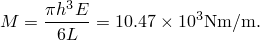
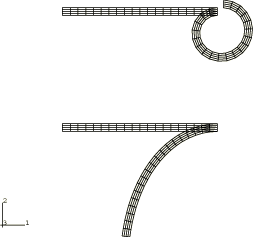
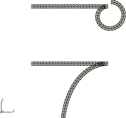
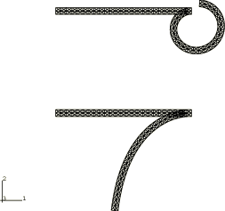
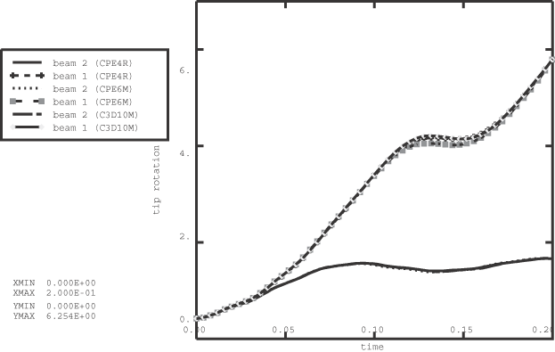

# 1.3.25 端点力矩梁

**产品：**Abaqus/Explicit  

### 测试的单元

CPE4R    CPE6M    C3D10M    

### 测试的功能

集中载荷、跟随力、多点约束。

### 问题描述

此问题演示了在有限应变分析中使用 CPE4R、CPE6M 和 C3D10M 单元的集中载荷。两个梁一起分析。两个梁均在一端为悬臂端，在另一端承受一对力（平动自由度上的平衡载荷集）。梁 1（上部梁）的力偶由跟随力组成，因此施加的力矩与端部旋转无关。非跟随力在梁 2（下部梁）上产生力矩，因此力矩是端部旋转的函数。

此问题还演示了一种将跟随力引入使用实体单元生成的网格的技术。Abaqus 中的跟随力需要转动自由度来引入力施加方向的改变。然而，连接到实体单元的节点只有平动自由度。BEAM MPC 用于在施加力的节点处激活转动自由度。LINEAR MPC 用于约束梁的端部保持为平面截面。

每个梁长 400 mm（*L*），厚 20 mm（*h*）。在有限元模型中，右侧所有节点为铰接，左侧节点用 BEAM 和 LINEAR MPC 约束，使它们保持为常长度直线。

此问题的材料为弹性，弹性模量常数为 1000 MPa，泊松比为 0。密度为 10000 kg/m3。

对于小应变弹性，形成圆形梁所需的单位宽度力矩为

此力矩所需的力（使用梁厚度作为力臂）为 523.6  103 N。由于动力学效应，所需力对于 CPE4R 网格仅为 490.0  103 N，对于 CPE6M 网格为 510.0  103 N，对于 C3D10M 网格为 4900.0 N。这些力在 0.2 秒的分析时间内线性递增。选择此时间段是为了能够以最小的动力学振动观察到准静态响应。

### 结果与讨论

[图 1.3.25-1](ch01s03abv28.md#exxbeamfollow-meshes-cpe4r) 显示了两个梁的未变形和变形网格（CPE4R）。梁 1 形成一个圆，而梁 2 停在 90 度端部旋转之前。由于梁 2 上的载荷不是跟随载荷，随着梁挠度的增加，力偶的力臂减小。[图 1.3.25-2](ch01s03abv28.md#exxbeamfollow-meshes-cpe6m) 显示了由 CPE6M 单元组成的相应网格。[图 1.3.25-3](ch01s03abv28.md#exxbeamfollow-meshes-c3d10m) 显示了 C3D10M 单元的未变形和变形网格。[图 1.3.25-4](ch01s03abv28.md#exxbeamfollow-tiprotations) 显示了两个梁的端部旋转（弧度）的时间历程。

### 输入文件

[beamfollow.inp](../eif/beamfollow.inp)

CPE4R 单元。

[beamfollow_cpe6m.inp](../eif/beamfollow_cpe6m.inp)

CPE6M 单元。

[beamfollow_c3d10m.inp](../eif/beamfollow_c3d10m.inp)

C3D10M 单元。

### 图形

**图 1.3.25-1** 梁的变形和未变形网格（CPE4R）。

**图 1.3.25-2** 梁的变形和未变形网格（CPE6M）。

**图 1.3.25-3** 梁的变形和未变形网格（C3D10M）。

**图 1.3.25-4** 梁的端部旋转。

