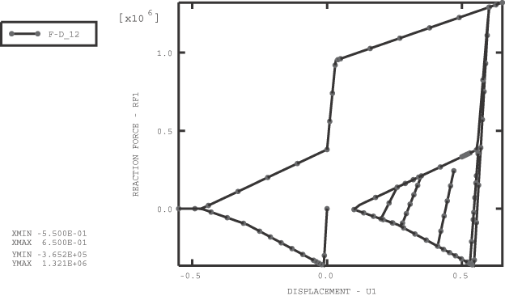
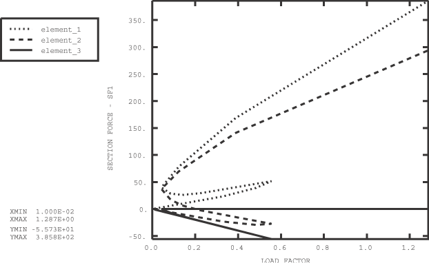
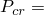
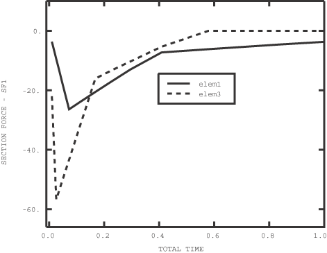

# 1.3.30 框架单元弹性行为的验证

**产品：**Abaqus/Standard  

### I. 简单载荷测试

### 测试的单元

FRAME2D    FRAME3D    

### 测试的功能

框架单元的弹性行为已通过测试。框架单元考虑的不同截面包括：
- 矩形空心箱型截面
- 实心圆截面
- 通用截面
- I 型梁截面
- 空心圆截面
- 实心矩形截面

针对以下载荷条件进行测试：
- 集中载荷
- 重力载荷
- 全球和局部框架方向上单位长度的力
- 作为节点温度的热载荷
- 横向流体阻力载荷
- 作用在框架端部的流体阻力
- 切向流体阻力载荷
- 浮力载荷（闭端条件）
- 横向风阻力载荷
- 作用在框架端部的风阻力
- 全球和局部框架方向上的基础载荷

这些载荷可以单独作用或组合作用。考虑了常规静力步骤和线性扰动步骤。

还测试了局部坐标系。在热载荷下测试框架单元属性的温度依赖性。还验证了初始应力条件和节点初始温度。

### 问题描述

该问题由长度为 75.0 个单位的悬臂组成，由五个框架单元构成。考虑了悬臂在空间中的各种方向。五个截面类型（矩形空心箱型、实心圆、空心圆、矩形和 I 型梁）使用的截面尺寸如["框架单元和截面类型的验证"，第 1.3.22 节](ch01s03abv25.md)所示。

悬臂承受集中端部载荷，导致弯曲和扭转。风载荷 WD1 和 WD2 以及 Aqua 载荷 FD1 和 FD2 也在节点上施加集中力。其余载荷在悬臂上引起均匀分布载荷。在热载荷下，悬臂的自由端是固定的。通过将指数  设置为 1 × 10⁰·⁹，使风速曲线在高度上接近均匀。Aqua 载荷中的流体速度在高度上恒定。对于基础载荷，悬臂的边界条件变为简支，悬臂使用分布载荷均匀地压入基础。

**材料：**

| 温度 10.0 单位时的弹性模量： | 3 × 10⁶ |
| --- | --- |
| 温度 10.0 单位时的泊松比： | 0.3 |
| 温度 90.0 单位时的弹性模量： | 1.5 × 10⁶ |
| 温度 90.0 单位时的泊松比： | 0.3 |
| 热膨胀系数定义参考温度： | 10.0 |
| 温度 10.0 时的热膨胀系数： | 0.001 |
| 温度 90.0 时的热膨胀系数： | 0.002 |
| 初始温度： | 10.0 |
| 材料密度： | 0.8 |
| 引力常数： | 10.0 |
| 风载荷的空气密度： | 0.008 |
| Aqua 载荷的流体密度： | 0.008 |
| 海底标高： | 100.0 |
| 静止流体标高： | 50.0 |
| 基础刚度： | 1500.0 |

### 结果与讨论

该问题是静定的。截面力和截面应变与分析值一致。

### 输入文件

[frame2d_bs_thermal.inp](../eif/frame2d_bs_thermal.inp)

带热载荷的箱型截面。

[frame2d_cs_wind_transform.inp](../eif/frame2d_cs_wind_transform.inp)

带风载荷和 [*TRANSFORM](../key/key-link.md#usb-kws-mtransform) 的圆截面。

[frame2d_gs_foundation.inp](../eif/frame2d_gs_foundation.inp)

带 [*FOUNDATION](../key/key-link.md#usb-kws-mfoundation) 载荷的通用截面。

[frame2d_gs_sig0.inp](../eif/frame2d_gs_sig0.inp)

带初始应力的通用截面，带 [*LOAD CASE](../key/key-link.md#usb-kws-hloadcase) 的扰动步骤。

[frame2d_is_aqua.inp](../eif/frame2d_is_aqua.inp)

带 Aqua 流体载荷的 I 截面。

[frame2d_ps_sig0.inp](../eif/frame2d_ps_sig0.inp)

带初始应力的管道截面。

[frame2d_rs_aqua.inp](../eif/frame2d_rs_aqua.inp)

带 Aqua 流体载荷的矩形截面。

[frame2d_rs_aqua_transform.inp](../eif/frame2d_rs_aqua_transform.inp)

带 Aqua 流体载荷和 [*TRANSFORM](../key/key-link.md#usb-kws-mtransform) 的矩形截面。

[frame2d_rs_foundation.inp](../eif/frame2d_rs_foundation.inp)

带 [*FOUNDATION](../key/key-link.md#usb-kws-mfoundation) 载荷的矩形截面。

[frame3d_bs_wind.inp](../eif/frame3d_bs_wind.inp)

带风载荷的箱型截面。

[frame3d_cs_foundation.inp](../eif/frame3d_cs_foundation.inp)

带 [*FOUNDATION](../key/key-link.md#usb-kws-mfoundation) 载荷的圆截面。

[frame3d_cs_transform.inp](../eif/frame3d_cs_transform.inp)

带 [*TRANSFORM](../key/key-link.md#usb-kws-mtransform) 的圆截面。

[frame3d_gs_sig0_transform.inp](../eif/frame3d_gs_sig0_transform.inp)

带初始应力的通用截面。

[frame3d_is_aqua.inp](../eif/frame3d_is_aqua.inp)

带 Aqua 流体载荷的 I 截面。

[frame3d_ps_foundation.inp](../eif/frame3d_ps_foundation.inp)

带 [*FOUNDATION](../key/key-link.md#usb-kws-mfoundation) 载荷的管道截面。

[frame3d_ps_thermal.inp](../eif/frame3d_ps_thermal.inp)

带热载荷的管道截面。

[frame3d_rs_sig0_transform.inp](../eif/frame3d_rs_sig0_transform.inp)

带初始应力和 [*TRANSFORM](../key/key-link.md#usb-kws-mtransform) 的矩形截面。

### II. 带铰接端的弹性框架单元

### 测试的单元

FRAME2D    FRAME3D    

### 测试的功能

测试框架单元在集中载荷下的线弹性单轴行为。

### 问题描述

通过声明框架截面的相关参数来指定框架单元末端的铰接连接。在本例中，框架单元表现为具有恒定刚度的轴向弹簧。在小位移分析中，该单元可以与桁架或弹簧单元进行比较。使用的模型和几何形状与验证问题["三杆桁架"，第 1.3.32 节](ch01s03abv35.md)相同。

### 结果与讨论

所有测试都与精确解一致；详情请参阅["三杆桁架"，第 1.3.32 节](ch01s03abv35.md)。

### 输入文件

[frame2d_3bar_pinned.inp](../eif/frame2d_3bar_pinned.inp)

带 [*CLOAD](../key/key-link.md#usb-kws-hcload) 载荷的矩形截面。

[frame3d_3bar_pinned.inp](../eif/frame3d_3bar_pinned.inp)

带 [*CLOAD](../key/key-link.md#usb-kws-hcload) 载荷的矩形截面。

### III. 带屈曲撑架响应的弹性框架单元

### 测试的单元

FRAME2D    FRAME3D    

### 测试的功能

测试两端铰接的框架单元的单轴屈曲撑架行为。

### 问题描述

屈曲撑架包线对应于 Marshall Strut 理论。测试包括一端固定、另一端承受指定位移的一个框架单元。指定位移的值根据振幅定义变化。振幅的变化选择使得屈曲撑架包线在压应力以及拉应力行为中追踪，直到超过屈服应力值。对于框架单元的截面，考虑了单轴响应、屈曲撑架响应和屈服应力。

**模型：**

| 管道半径： | 2. |
| --- | --- |
| 管道厚度： | 0.08122693 |
| 截面积： | 1. |

**材料：**

| 弹性模量： | 30 × 10⁶ |
| --- | --- |
| 剪切模量： | 10 × 10⁶ |
| 屈服应力： | 1 × 10⁶ |

### 结果与讨论

通过绘制单元中的轴向力与指定位移的关系，可以看出压缩时的单轴屈曲和后屈曲行为以及拉伸时的等向硬化行为；见[图 1.3.30--1](ch01s03abv33.md#verframes-elast-2dbuckle)。

### 输入文件

[frame2d_pinned_buckl.inp](../eif/frame2d_pinned_buckl.inp)

带指定位移的管道截面。

[frame3d_pinned_buckl.inp](../eif/frame3d_pinned_buckl.inp)

带指定位移的管道截面。

### 图

**图 1.3.30–1** FRAME2D 单元的屈曲响应。

### IV. 带非线性几何屈曲撑架响应的弹性框架单元

### 测试的单元

FRAME2D

### 测试的功能

在几何非线性分析中研究坍塌脚手架。

### 问题描述

脚手架由三个带管道截面的铰接框架单元组成。屈曲撑架包线对应于 Marshall Strut 理论。坍塌发生在力控载荷下。

**模型：**

| 管道半径： | 0.2 |
| --- | --- |
| 管道厚度： | 0.01 |

**材料：**

| 弹性模量： | 3 × 10⁶ |
| --- | --- |
| 剪切模量： | 1.5 × 10⁶ |
| 屈服应力： | 51.9 × 10³ |

### 结果与讨论

响应的跳跃特性需要 Riks 分析过程。[图 1.3.30--2](ch01s03abv33.md#verframes-elast-scaffold) 绘制了每个单元中的截面力与 Riks 分析的载荷因子的关系。框架单元 2 和 3 的屈曲改变了整个结构的力分布。在单元 3 屈曲后，它在整个加载过程中保持屈曲状态；单元 2 屈曲，然后恢复刚度并产生拉力，如图 [1.3.30--2](ch01s03abv33.md#verframes-elast-scaffold) 所示。

### 输入文件

[frame2d_pinned_buckl_nlgeom.inp](../eif/frame2d_pinned_buckl_nlgeom.inp)

带非线性几何的屈曲管道截面。

### 图

**图 1.3.30–2** 带 FRAME2D 管道单元的脚手架屈曲响应。

### V. 带非线性几何切换算法的弹性框架单元

### 测试的单元

FRAME2D    FRAME3D    

### 测试的功能

使用具有切换算法的框架单元研究具有几何和材料特性的坍塌脚手架，如["框架单元弹性行为的验证"中"带非线性几何屈曲撑架响应的弹性框架单元"，第 1.3.30 节](ch01s03abv33.md#ver-elastframe-buckle-nonlin)所述。

### 问题描述

为弹性框架单元启用屈曲撑架响应。ISO 方程用作切换算法的准则，默认屈曲包线控制后屈曲行为。

### 结果与讨论

这里测试了两类问题：使用 FRAME2D 和 FRAME3D 单元建模的平面内脚手架结构，以及由额外的面外单元支撑的三维脚手架。平面内脚手架问题使用默认屈曲包线，三维脚手架使用非默认屈曲包线。在所有问题中，两个方向的屈曲折减系数均为 1.0。脚手架结构的所有端点都是固定的，指定位移施加在节点 2 上。位移值的选择使得三维脚手架中的单元 1、3 和 4 将违反 ISO 方程，从而导致切换到撑架响应。

[图 1.3.30--3](ch01s03abv33.md#verframes-elast-switch) 绘制了平面内脚手架中单元 1 和 3 的轴向力与时间的关系。单元 3 在临界压力  56.75 处屈曲，并在指定位移值的 58% 处失去刚度；单元 1 接下来屈曲，并在整个加载历程中保持少量刚度。

三维脚手架的行为不同。第一个切换到撑架响应的单元是单元 4，其次是单元 3 和 1。在指定位移值的 72.5% 处，单元 3 和 4 已经失去了刚度。

### 输入文件

[frame2d_el_switch.inp](../eif/frame2d_el_switch.inp)

带切换算法的 FRAME2D 单元。

[frame3d_el_switch.inp](../eif/frame3d_el_switch.inp)

带切换算法的 FRAME3D 单元。

[frame3d_inspace_switch.inp](../eif/frame3d_inspace_switch.inp)

带切换算法的 FRAME3D 单元。

### 图

**图 1.3.30–3** 带 FRAME2D 和切换算法的脚手架屈曲响应。

