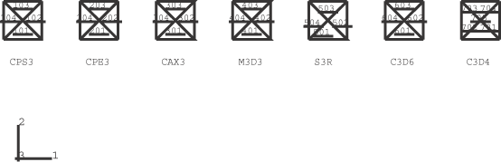
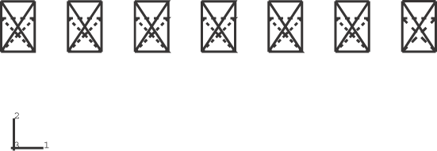
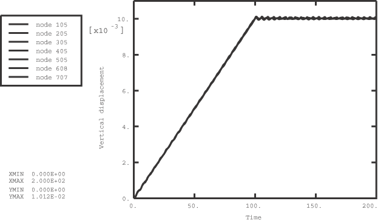

# 1.3.28 拉伸测试

**产品：**Abaqus/Explicit  

### 测试的单元

CPS3    CPE3    CAX3    C3D6    M3D3    S3R    C3D4    

### 测试的功能

集中载荷。

### 问题描述

在该问题中，单元承受拉伸载荷。该问题使用七种不同的单元类型进行分析。网格如图 [1.3.28--1](ch01s03abv31.md#exxtensile-mesh) 所示。

材料模型为各向同性线弹性。使用的材料属性为：弹性模量 = 1.0，泊松比 = 0.0，密度 = 1。利用结构的对称性，在每种情况下，模型底部约束垂直方向的位移，左侧约束水平方向的位移。

集中载荷的大小选择为使总应变为 0.01。载荷大小在前半步骤中从零线性增加到最终值；然后在后半步骤中保持恒定，以验证任何振荡动态效应最小。

### 结果与讨论

[图 1.3.28--2](ch01s03abv31.md#exxtensile-dispelems) 显示了位移配置中的单元，位移放大了 50 倍。[图 1.3.28--3](ch01s03abv31.md#exxtensile-disp-v-time) 显示了七种情况中每种的垂直位移与时间的关系图。由于泊松比为 0.0，七种情况的结果相同。

### 输入文件

[tensile.inp](../eif/tensile.inp)

本分析使用的输入数据。

[tensile_c3d4.inp](../eif/tensile_c3d4.inp)

C3D4 单元。

[tensile_c3d6.inp](../eif/tensile_c3d6.inp)

C3D6 单元。

[tensile_c3d8r.inp](../eif/tensile_c3d8r.inp)

C3D8R 单元。

[tensile_cax3.inp](../eif/tensile_cax3.inp)

CAX3 单元。

[tensile_cax4r.inp](../eif/tensile_cax4r.inp)

CAX4R 单元。

[tensile_cpe3.inp](../eif/tensile_cpe3.inp)

CPE3 单元。

[tensile_cpe4r.inp](../eif/tensile_cpe4r.inp)

CPE4R 单元。

[tensile_cps3.inp](../eif/tensile_cps3.inp)

CPS3 单元。

[tensile_cps4r.inp](../eif/tensile_cps4r.inp)

CPS4R 单元。

[tensile_m3d3.inp](../eif/tensile_m3d3.inp)

M3D3 单元。

[tensile_m3d4r.inp](../eif/tensile_m3d4r.inp)

M3D4R 单元。

[tensile_s3r.inp](../eif/tensile_s3r.inp)

S3R 单元。

[tensile_s4r.inp](../eif/tensile_s4r.inp)

S4R 单元。

[tensile_s3r_gauss2.inp](../eif/tensile_s3r_gauss2.inp)

带 Gauss 积分的壳单元，壳截面积分使用 2 个 Gauss 积分点。

[tensile_s3r_gauss4.inp](../eif/tensile_s3r_gauss4.inp)

带 Gauss 积分的壳单元，壳截面积分使用 4 个 Gauss 积分点。

[tensile_s3r_gauss5.inp](../eif/tensile_s3r_gauss5.inp)

带 Gauss 积分的壳单元，壳截面积分使用 5 个 Gauss 积分点。

[tensile_s3r_gauss6.inp](../eif/tensile_s3r_gauss6.inp)

带 Gauss 积分的壳单元，壳截面积分使用 6 个 Gauss 积分点。

[tensile_s3r_gauss7.inp](../eif/tensile_s3r_gauss7.inp)

带 Gauss 积分的壳单元，壳截面积分使用 7 个 Gauss 积分点。

### 图

**图 1.3.28–1** 拉伸测试问题的网格。

**图 1.3.28–2** 拉伸测试问题中的位移单元。

**图 1.3.28–3** 垂直位移与时间的关系。

