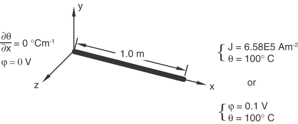
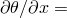
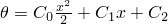
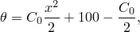

# 1.3.38 热电元件的简单载荷测试

**产品：**Abaqus/Standard  

### 测试元件

DC1D2E    DC1D3E    

DC2D3E    DC2D4E    DC2D6E    DC2D8E    

DCAX3E    DCAX4E    DCAX6E    DCAX8E    

DC3D4E    DC3D6E    DC3D8E    DC3D10E    DC3D15E    DC3D20E    

### 问题描述

如图所示的模型[图 1.3.38–1](ch01s03abv41.md#verthermelect-model)，一根1米长的导体，通过在导体两端建立电位差或施加集中电流，使其内部产生6.58E5 A/m²的恒定电流密度。电流流动产生的电能转化为热量，导致导体内部形成温度分布。每个测试仅考虑稳态解。为了获得二次分布的热量，在每种情况下使用了合理的网格划分。

**图 1.3.38–1** 导体模型。

**材料：**

热导率 = 45 W/m°C；电导率 = 6.58E6 1/ m。

**边界条件：**

零电位（ 0 V）和零温度梯度（ 0°C/m）在  0 m处。

电位  0.1 V和温度  100°C，或电流密度6.58E5 A/m²和温度  100°C在  1 m处。

在这些边界条件下，问题是一维的。假设所有电能都转化为热量。

### 参考解

在这个单轴问题中，温度的精确解形式为 ，其中 、 和  是实常数。应用上述材料性能和边界条件，可得精确解

其中  1462.2。

### 结果与讨论

测试由三个步骤组成。

在步骤1中，施加热边界条件，并通过导体两端的电位差获得电流。使用耦合热电程序获得导体内的温度分布。对于一阶元素，当在x-y平面和/或x-z平面中生成的网格倾斜时，结果是y和z的函数。对于不同的测试用例，温度在y-z平面上对于给定的x值可能变化高达3%。因此，使用三角元和四面体元时需要特别小心。在大多数测试用例中都能恢复精确解，DC3D6E元件观察到的最大偏差为1.5%。对于二阶元素，由于结果至多是变量x的二次函数，因此获得精确结果。而且，倾斜网格不会影响结果。

步骤2是一个传热步骤，导体在此期间冷却。

步骤3调用耦合热电程序，向试样提供与步骤1相同量的电能。然而，现在是通过在  1 m处规定电流而不是0.1 V电位来提供能量。同样，温度结果与步骤1中获得的结果相同，步骤1中作为输入的电位分布在步骤3中作为输出被检索。

### 输入文件

[eca3vfsj.inp](../eif/eca3vfsj.inp)

DCAX3E元件。

[eca4vfsj.inp](../eif/eca4vfsj.inp)

DCAX4E元件。

[eca6vfsj.inp](../eif/eca6vfsj.inp)

DCAX6E元件。

[eca8vfsj.inp](../eif/eca8vfsj.inp)

DCAX8E元件。

[ec12vfsj.inp](../eif/ec12vfsj.inp)

DC1D2E元件。

[ec13vfsj.inp](../eif/ec13vfsj.inp)

DC1D3E元件。

[ec23vfsj.inp](../eif/ec23vfsj.inp)

DC2D3E元件。

[ec24vfsj.inp](../eif/ec24vfsj.inp)

DC2D4E元件。

[ec26vfsj.inp](../eif/ec26vfsj.inp)

DC2D6E元件。

[ec28vfsj.inp](../eif/ec28vfsj.inp)

DC2D8E元件。

[ec34vfsj.inp](../eif/ec34vfsj.inp)

DC3D4E元件。

[ec36vfsj.inp](../eif/ec36vfsj.inp)

DC3D6E元件。

[ec38vfsj.inp](../eif/ec38vfsj.inp)

DC3D8E元件。

[ec3avfsj.inp](../eif/ec3avfsj.inp)

DC3D10E元件。

[ec3fvfsj.inp](../eif/ec3fvfsj.inp)

DC3D15E元件。

[ec3kvfsj.inp](../eif/ec3kvfsj.inp)

DC3D20E元件。

