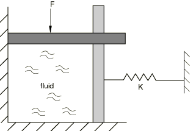
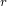
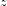
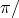

# 1.3.39 Hydrostatic fluid elements

**Product: **Abaqus/Standard  

### Features tested

This section provides basic verification tests for the fluid elements that are generated in Abaqus/Standard when the fluid cavity capability is used.

### Elements tested

F2D2    F3D3    F3D4    FAX2    

### Problem description

 For the two-dimensional and three-dimensional cases, a “block” of incompressible fluid is subjected to a system of loads, as shown in [Figure 1.3.39--1](ch01s03abv42.md#verfluidelem-model). The downward force causes the fluid to compress vertically and expand horizontally, while maintaining the original fluid volume (since the fluid is incompressible). The spring resists the horizontal expansion of the fluid, thus generating internal pressure in the fluid. The first axisymmetric problem is similar: the fluid volume is now a cylinder, compressed axially, with a spring resisting the radial expansion. In the second axisymmetric problem the pressure inside the fluid is specified. No external loading is applied, and the “walls” bounding the fluid are fixed.

**Figure 1.3.39–1** Loading of fluid elements.

The surface-based fluid cavity capability requires a surface to be defined on the boundary of the fluid cavity. The underlying elements on which the surface is defined can be solid elements, structural elements, or surface elements. In these tests the cavity boundary is represented with surface elements in the three-dimensional model. Since Abaqus does not provide two-dimensional surface elements, solid elements are used in the two-dimensional models to define the exterior surface. The solid elements are removed at the start of the first analysis step and are, therefore, not involved in the solution of the problem.

The two-dimensional fluid block measures 1  1 and has unit thickness, while the three-dimensional fluid block measures 1  1  1. Node 1 is the cavity reference node for the fluid cavity. In each case a single grounded spring acting in the *x*-direction is attached to a node on the outermost face of the model perpendicular to the *x*-direction. In addition, all nodes on this face are constrained to displace equally in the *x*-direction. The downward force is applied as a concentrated load to a single node on the uppermost face of the model perpendicular to the *y*-direction. All nodes on this face are constrained to displace equally in the *y*-direction. Finally, a grounded spring of negligible stiffness acting in the *y*-direction is attached to a single node on this face to preclude solver problems in the solution.

The axisymmetric fluid cylinder has a radius of 1 and a height of 1. Node 1 is the cavity reference node for the fluid cavity. In the first problem a single grounded spring acting in the *r*-direction is attached to a node on the outermost face of the model perpendicular to the *r*-direction. All nodes on this face are additionally constrained to displace equally in the *r*-direction. The downward force is applied as a concentrated load to a single node on the uppermost face of the model perpendicular to the *z*-direction. All nodes on this face are constrained to displace equally in the *z*-direction. Finally, a grounded spring of negligible stiffness acting in the *z*-direction is attached to a single node on this face to preclude solver problems in the solution. In the second problem all nodes are fixed in space, and the pressure inside the fluid is specified at node 1. No external force is specified, and no springs are used in the model.

**Material: **

Fluid: incompressible, density = 10.0 (arbitrary).

Spring:  400.

**Loading: **

The concentrated force applied to all models except the second axisymmetric analysis ( 600 at node 4) is ramped linearly from zero to the final value of 600 over a single static step. Results are reported at the end of the step.

 1 for the second axisymmetric analysis.

**Two-dimensional boundary conditions: **

 0 at node 4;  is constrained to be equal at nodes 2 and 3.

 0 at node 2;  is constrained to be equal at nodes 3 and 4.

**Three-dimensional boundary conditions: **

 0 at nodes 4, 5, and 8;  is constrained to be equal at nodes 2, 3, 6, and 7.

 0 at nodes 2, 5, and 6;  is constrained to be equal at nodes 3, 4, 7, and 8.

 0 at nodes 2 through 8.

**Axisymmetric boundary conditions—Problem 1: **

 0 at node 4;  is constrained to be equal at nodes 2 and 3.

 0 at node 2;  is constrained to be equal at nodes 3 and 4.

**Axisymmetric boundary conditions—Problem 2: **

 0 at nodes 2, 3, and 4.

 0 at nodes 2, 3, and 4.

### Reference solution

Since the fluid is incompressible, the original fluid volume should be maintained. For the two-dimensional and three-dimensional cases CVOL = 1.0, and for the axisymmetric case CVOL = .

For the second axisymmetric problem, the reaction forces at the nodes are as follows:

| Node | RF | RF |
| --- | --- | --- |
| 2 |  | 0.0 |
| 3 |  | 23 |
| 4 | 0.0 | 3 |

### Results and discussion

**Table 1.3.39–1** F2D2 results.
| Node |  |  | PCAV | CVOL |
| --- | --- | --- | --- | --- |
| 1 |  |  | 376.9 | 1.000 |
| 2 | 0.5919 | 0.0 |  |  |
| 3 | 0.5919 | 0.3718 |  |  |
| 4 | 0.0 | 0.3718 |  |  |

**Table 1.3.39–2** F3D3 results.
| Node |  |  |  | PCAV | CVOL |
| --- | --- | --- | --- | --- | --- |
| 1 |  |  |  | 376.9 | 1.000 |
| 2 | 0.5919 | 0.0 | 0.0 |  |  |
| 3 | 0.5919 | 0.3718 | 0.0 |  |  |
| 4 | 0.0 | 0.3718 | 0.0 |  |  |
| 5 | 0.0 | 0.0 | 0.0 |  |  |
| 6 | 0.5919 | 0.0 | 0.0 |  |  |
| 7 | 0.5919 | 0.3718 | 0.0 |  |  |
| 8 | 0.0 | 0.3718 | 0.0 |  |  |

**Table 1.3.39–3** F3D4 results.
| Node |  |  |  | PCAV | CVOL |
| --- | --- | --- | --- | --- | --- |
| 1 |  |  |  | 376.9 | 1.000 |
| 2 | 0.5919 | 0.0 | 0.0 |  |  |
| 3 | 0.5919 | 0.3718 | 0.0 |  |  |
| 4 | 0.0 | 0.3718 | 0.0 |  |  |
| 5 | 0.0 | 0.0 | 0.0 |  |  |
| 6 | 0.5919 | 0.0 | 0.0 |  |  |
| 7 | 0.5919 | 0.3718 | 0.0 |  |  |
| 8 | 0.0 | 0.3718 | 0.0 |  |  |

**Table 1.3.39–4** FAX2 results: Problem 1.
| Node |  |  | PCAV | CVOL |
| --- | --- | --- | --- | --- |
| 1 |  |  | 88.25 | 3.142 |
| 2 | 0.4711 | 0.0 |  |  |
| 3 | 0.4711 | 0.5380 |  |  |
| 4 | 0.0 | 0.5380 |  |  |

**Table 1.3.39–5** FAX2 results: Problem 2.
| Node | RF | RF | PCAV | CVOL |
| --- | --- | --- | --- | --- |
| 1 |  |  | 1.0 | 3.142 |
| 2 | 3.1416 | 0.0 |  |  |
| 3 | 3.1416 | 2.0944 |  |  |
| 4 | 0.0 | 1.0472 |  |  |

### Input files

[ef22sxso.inp](../eif/ef22sxso.inp)

F2D2 elements.

[ef33sxso.inp](../eif/ef33sxso.inp)

F3D3 elements.

[ef34sxso.inp](../eif/ef34sxso.inp)

F3D4 elements.

[efa2sxso.inp](../eif/efa2sxso.inp)

FAX2 elements, problem 1.

[efa2sxsr.inp](../eif/efa2sxsr.inp)

FAX2 elements, problem 2.

