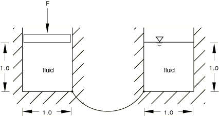
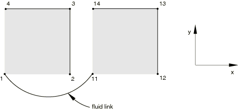
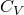
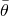
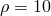
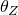
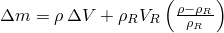
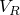
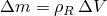
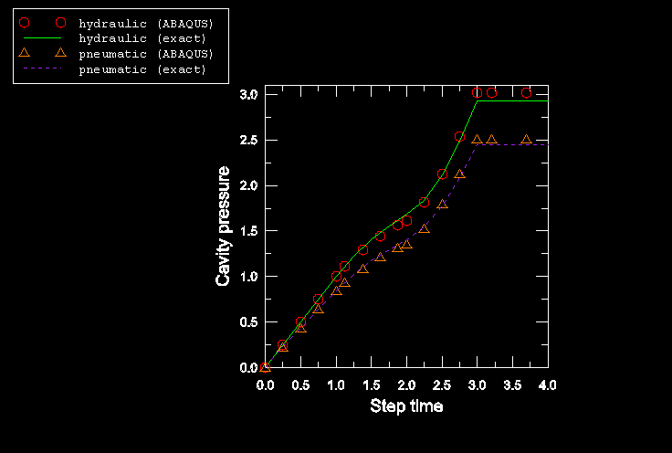

# 1.3.40 Fluid link element

**Product: **Abaqus/Standard  

### Features tested

This section provides basic verification tests for the fluid link element that is generated in Abaqus/Standard when the fluid exchange capability is used to model flow between two fluid-filled cavities.

### I. Connected fluid cavities

### Elements tested

FLINK    F2D2    

### Problem description

A fluid link element is created when the fluid exchange capability is used to transfer fluid between two vessels filled with incompressible fluid, as shown in [Figure 1.3.40--1](ch01s03abv43.md#verfluidlink-prob). One of the vessels is subjected to internal pressure by applying a load *F*. The other vessel is always maintained at zero pressure. The difference in pressures between the two vessels causes fluid to be transferred. Two analyses are performed to verify the fluid transfer rate between the two vessels by specifying the bulk viscosity and the mass flow rate as a function of pressure difference and temperature.

**Figure 1.3.40–1** Fluid link analysis.

Each vessel is modeled using a two-dimensional fluid block that measures 1  1 with unit thickness, as shown in [Figure 1.3.40--2](ch01s03abv43.md#verfluidlink-model-1). Nodes 1 and 11 are the cavity reference nodes for the two fluid cavities. The downward force on the first fluid cavity is applied as a concentrated load to node 4 in the *y*-direction. Nodes 3 and 4 are constrained to displace equally in the *y*-direction. Nodes 13 and 14 are also constrained to displace equally in the *y*-direction. Finally, grounded springs of very small stiffness acting in the *y*-direction are attached to nodes 4 and 14 to preclude solver problems in the solution.

**Figure 1.3.40–2** Fluid link model.

**Material: **

Fluid: incompressible, density = 10.0 (arbitrary).

Fluid link:

| Specifying the bulk viscosity |
| --- |
|  |  |  | Field variable |
| 10 | 0.0 | 10 | 1.0 |
| 1.0 | 0.0 | 100 | 1.0 |
| 10 | 0.001 | 10 | 2.0 |
| 1.0 | 0.001 | 100 | 2.0 |

The data used when specifying the mass flow rate as a function of pressure difference and temperature were computed using the implicit functional relationship between *q* and  discussed in ["Fluid exchange definition," Section 11.5.3 of the Abaqus Analysis User's Guide](../usb/usb-link.md#usb-anl-afluidcavityexchange), and the values of  and  in the above table. To capture the nonlinear relationship between *q* and  accurately, 33 values of *q* were included in the data lines option for various combinations of  and the one field variable.

**Loading: **

The concentrated force of 100 units is applied instantaneously over all static steps. In the first step the temperature and the field variable are held fixed at 10 and 1, respectively, for a time period of 0.20. In the second step the temperature is ramped from 10 to 100 for a time period of 0.01, while the field variable remains fixed at 1. The third step is a dummy perturbation step. This step is included to verify that an intermittent perturbation step has no effect on the subsequent general step. In the fourth step the temperature is held fixed at 100, with the field variable instantaneously changed to 2 for a time period of 0.01. Results are reported at the end of each general step.

### Reference solution

Since the fluid is incompressible, the total fluid volume should be maintained; i.e., CVOL=2.0. The pressure in the first cavity should always be 100. Because of the presence of grounded springs of very small stiffness, the pressure in the second cavity is not zero.

### Results and discussion

The results for the analyses compare quite well with one another. The agreement between the two models could be further improved by refining the tabular data for the mass flow rate model to better represent the nonlinear relationship between *q* and  as defined by the bulk viscosity model.

| Specifying the bulk viscosity |
| --- |
| Step | PCAV | CVOL | PCAV | CVOL |
| 1 | 100.0 | 0.800 | 2.00E7 | 1.20 |
| 2 | 100.0 | 0.778 | 2.22E7 | 1.22 |
| 4 | 100.0 | 0.683 | 3.17E7 | 1.32 |

| Specifying the mass flow rate as a function of pressure difference and temperature |
| --- |
| Step | PCAV | CVOL | PCAV | CVOL |
| 1 | 100.0 | 0.800 | 2.00E7 | 1.20 |
| 2 | 100.0 | 0.778 | 2.22E7 | 1.22 |
| 4 | 100.0 | 0.683 | 3.18E7 | 1.32 |

### Input files

[efl2sfsp.inp](../eif/efl2sfsp.inp)

TYPE=BULK VISCOSITY.

[efl2stsp.inp](../eif/efl2stsp.inp)

 TYPE=MASS RATE LEAKAGE.

### II. Single fluid cavity with a fluid link element

### Elements tested

FLINK    F2D2    

### Problem description

A fluid link element with one end connected and the other end free is used to transfer fluid to a single fluid cavity. The vessel is modeled using a two-dimensional fluid block that measures 1  1 with unit thickness. The model in this example is identical to the model shown in [Figure 1.3.40--2](ch01s03abv43.md#verfluidlink-model-1) except that the cavity defined by nodes 12, 13 and 14 is absent. Node 1 is the cavity reference node for the fluid cavity. Node 11 is connected to the fluid link element but not to a fluid cavity. Nodes 3 and 4 are constrained to displace equally in the *y*-direction. A grounded spring of unit stiffness acting in the *y*-direction is attached to node 4.

Two models are considered, one with an incompressible hydraulic fluid and the other with a compressible pneumatic fluid. The hydraulic fluid is given an arbitrary fluid density of . For the pneumatic fluid the molecular weight, , is set to 660; the universal gas constant, , is set to 1; and the absolute zero temperature, , is set to —460. See ["Fluid cavity definition," Section 11.5.2 of the Abaqus Analysis User's Guide](../usb/usb-link.md#usb-anl-afluidcavities), for details. The fluid link is defined by specifying bulk viscosity as =0.1 and =0.

It is a simple exercise to show that with a single fluid link element and fixed temperature the change in mass in the fluid cavity is given by , where  is the initial volume of the fluid cavity and  is the change in volume of the fluid cavity with respect to . For an incompressible hydraulic fluid , in which case the change in mass is simply . 

**Loading: **

Four steps are used in the analyses. In Step 1 a constant mass flow rate of 10 is applied to node 11 on the fluid link element using the mass flow rate specified for a fluid cavity. In Step 2 the fluid flux loading is removed and the pressure at node 11 is held at its value at the end of step one using a boundary condition with the option of fixing a degree of freedom at its current value at the start of the step. In Step 3 the pressure at node 11 is ramped up to 5. Finally, in Step 4 all pressure boundary conditions are removed, and the system comes to rest.

### Results and discussion

A comparison of the Abaqus results for the cavity pressure (pressure at node 1) to exact solutions for both the hydraulic and pneumatic fluids is shown in [Figure 1.3.40--3](ch01s03abv43.md#verfluidlink-result). It is clear that Abaqus is accurately modeling the fluid cavity response.

**Figure 1.3.40–3** Cavity pressure.

### Input files

[onecav_hydr.inp](../eif/onecav_hydr.inp)

 Hydraulic fluid.

[onecav_pneu.inp](../eif/onecav_pneu.inp)

Pneumatic fluid.

