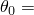
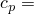
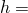
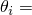
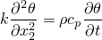
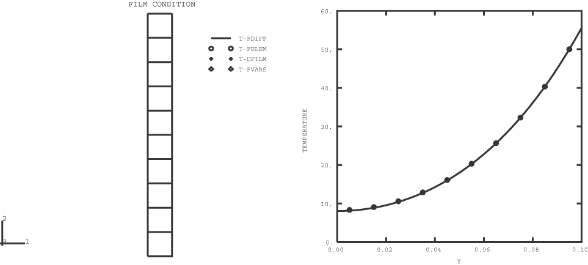

# 1.3.41 Temperature-dependent film condition

**Products: **Abaqus/Standard  Abaqus/Explicit  

### Elements tested

CPE3T    CPE4RT    CPS3T    CPS4RT    DC2D4    S4RT    

### Features tested

Temperature-dependent film conditions.

### Problem description

An infinite plate of width 0.1 unit and thickness 1 unit is considered. A zero flux boundary condition is imposed on all of the surfaces except the top surface. A film condition and sink temperature are imposed on the top surface, and the transient solution to the heat transfer problem is sought. 

In Abaqus/Standard the problem is modeled with 10 DC2D4 elements of dimension 0.01  0.01. In Abaqus/Explicit two-dimensional (plane strain and plane stress) elements are used to model the plate: 10 elements are used through the width of the plate when using CPE4RT and CPS4RT elements, while 20 elements are used when using CPE3T and CPS3T elements. The problem is also modeled using S4RT elements in Abaqus/Explicit. Only one coupled thermal shell element is used, and the shell's thickness represents the length of the model. The film condition is applied on one face of the shell, and a large number of temperature points are considered through the thickness (19 points, which is the maximum allowable temperature points.)

**Material: **

Thermal conductivity,  1.4; sink temperature,  100(1 + *t*/3600); specific heat,  260; film coefficient,  10 + 0.02; density,  7800; initial temperature,  0.

In Abaqus/Explicit dummy mechanical properties are prescribed to complete the material definition.

### Results and discussion

The transient solution at  3600 units is plotted for all four cases; the finite difference solution is plotted as a solid line, and the three finite element results as markers at the centroid of the elements.

The results obtained with Abaqus/Explicit are in close agreement with those obtained with Abaqus/Standard.

### Input files

##### **Abaqus/Standard input files**

[ec24dfd1.f](../eif/ec24dfd1.f)

FORTRAN program to compute the finite difference solution to the differential equation

with appropriate boundary conditions for the film and sink conditions. The solution is computed at 101 points through the width of the plate at time steps of 0.01 units.

[ec24dfd2.inp](../eif/ec24dfd2.inp)

Finite element model of the problem as described above.

[ec24dfd3.inp](../eif/ec24dfd3.inp)

Finite element model with temperature dependent film condition prescribed through user subroutine [`FILM`](../sub/sub-link.md#sub-xsl-film).

[ec24dfd3.f](../eif/ec24dfd3.f)

User subroutine [`FILM`](../sub/sub-link.md#sub-xsl-film) used in ec24dfd3.inp.

[ec24dfd4.inp](../eif/ec24dfd4.inp)

Finite element model where the film condition is changed using a field variable which is prescribed through user subroutine [`UFIELD`](../sub/sub-link.md#sub-xsl-ufield).

[ec24dfd4.f](../eif/ec24dfd4.f)

User subroutine [`UFIELD`](../sub/sub-link.md#sub-xsl-ufield) used in ec24dfd4.inp.

[ec24dfd5.inp](../eif/ec24dfd5.inp)

Same as problem ec24dfd2.inp with surface-based loads.

[ec24dfd6.inp](../eif/ec24dfd6.inp)

Same as problem ec24dfd3.inp with surface-based loads.

[ec24dfd6.f](../eif/ec24dfd6.f)

User subroutine [`FILM`](../sub/sub-link.md#sub-xsl-film) used in ec24dfd6.inp.

[ec24dfd7.inp](../eif/ec24dfd7.inp)

Same as problem ec24dfd4.inp with surface-based loads.

[ec24dfd7.f](../eif/ec24dfd7.f)

User subroutine [`UFIELD`](../sub/sub-link.md#sub-xsl-ufield) used in ec24dfd7.inp.

##### **Abaqus/Explicit input files**

[tempdepfilm_xpl_cpe3t.inp](../eif/tempdepfilm_xpl_cpe3t.inp)

CPE3T elements.

[tempdepfilm_xpl_cpe4rt.inp](../eif/tempdepfilm_xpl_cpe4rt.inp)

CPE4RT elements.

[tempdepfilm_xpl_cps3t.inp](../eif/tempdepfilm_xpl_cps3t.inp)

CPS3T elements.

[tempdepfilm_xpl_cps4rt.inp](../eif/tempdepfilm_xpl_cps4rt.inp)

CPS4RT elements.

[tempdepfilm_xpl_s4rt.inp](../eif/tempdepfilm_xpl_s4rt.inp)

S4RT elements.

### Figure

**Figure 1.3.41–1** Finite element model and temperature profile (Abaqus/Standard).

